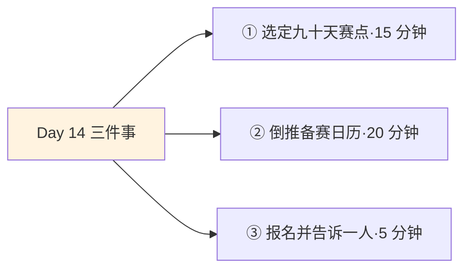
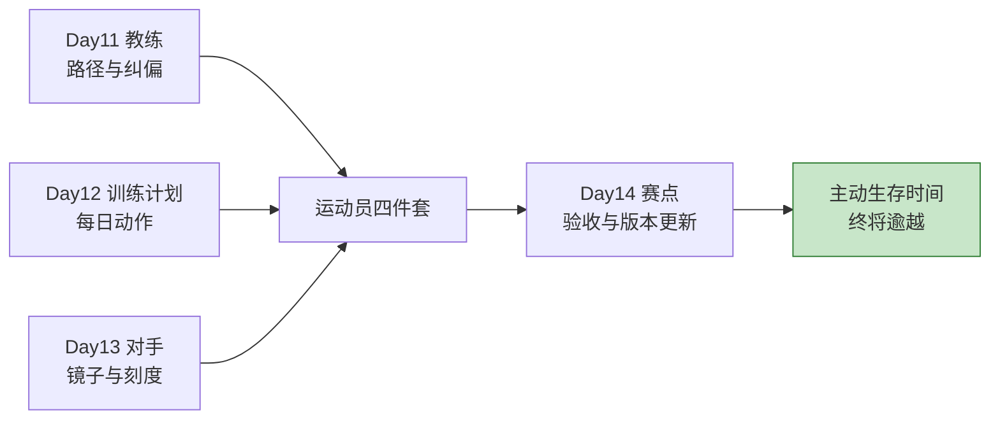
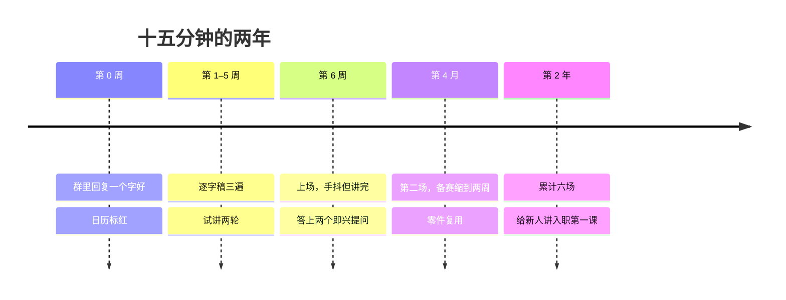

## Day 14·看下一个赛点：光芒就在下一场

- [01.看一个真实案例](#01看一个真实案例)
- [02.比赛是验收，不是变身](#02比赛是验收不是变身)
- [03.日常生活的比赛荒](#03日常生活的比赛荒)
- [04.赛点四要素](#04赛点四要素)
- [05.备赛第一步：设赛](#05备赛第一步设赛)
- [06.备赛第二步：拆赛](#06备赛第二步拆赛)
- [07.备赛第三步：陪赛](#07备赛第三步陪赛)
- [08.备赛第四步：复赛](#08备赛第四步复赛)
- [09.输了怎么办](#09输了怎么办)
- [10.今天要做的三件事](#10今天要做的三件事)
- [11.总结回顾本章节](#11总结回顾本章节)
- [12.后来发生的改变](#12后来发生的改变)
- [13.今天起改变三点](#13今天起改变三点)
- [14.课后作业思考下](#14课后作业思考下)

---

## 01.看一个真实案例

先讲一位内向到骨子里的工程师，姓小陈。

他的日常画风是：会议坐在最角落，能打字绝不发言，工位十年没挪过。去年主管在季度会上点名，让他做十五分钟的技术分享，主题是他最熟的那块系统。他第一反应是想办法推掉，请假的心思都动了。挣扎了两天，他没退，反而做了一个对他来说极不寻常的动作：**在部门群里回复了一个字，好，然后把日历上六周后的那天标成了红色。**

那天成了他的赛点。备赛的六周他这样过：逐字稿写了三遍，第一遍给自己，第二遍砍掉一半术语，第三遍改成说人话；每讲一遍就用手机录音，回听，挑毛病；第四周拉着一位要好同事试讲，第五周又拉了两位。演讲当天，他上场前手还在抖，但开口三分钟后就顺了，提问环节甚至答上了两个没准备过的问题。

一年后的今天，他做过六场分享，最近的一场是给全部门新人讲入职第一课。他复盘那次突破时说：**"那天讲的十五分钟没什么了不起，了不起的是为了那十五分钟，我认真练了六个星期。我人生第一次知道，准备是这种感觉。"**

这就是今天的主题：赛点。也是运动员四件套的最后一件。

## 02.比赛是验收，不是变身

先立本章的第一块基石，原稿的话：**每当说一场重要的比赛改变了运动员的人生，那是因为在此前的训练中，他早已成为了更厉害的人，而不是比赛那一天突然变成的。**

这句话纠正了一个普遍错觉：把高光时刻当成变身时刻。不是的。台上那十五分钟是利息，台下的六周才是本金；比赛只负责把训练成果领出来亮个相，它不生产任何东西。小陈不是在台上那十五分钟变成会演讲的人的，他是在那六周的每一遍逐字稿里变成的。

这个认知的实用推论是：**比赛是验收，不是变身。**所以备赛的真正价值，不在比赛结果本身，而在于赛点给了训练一个截止日期。Day12 讲过，计划最大的敌人是无限期：训练永远可以进行下去，因为你永远觉得还没准备好。赛点一刀切下去：**那天就是那天，练成什么样上什么样的台。**

帕金森定律说工作会自动膨胀，填满所有可用的时间。反过来它也成立：没有截止日期的准备，会无限拖延。多少人的学英语、要转型、想考证，坏就坏在没有一个非上场不可的日子。**光芒可能就在下一个赛点**，因为它逼着你把练了很久的东西，拿出去见光。

## 03.日常生活的比赛荒

为什么普通人需要专门讲赛点？因为毕业后，比赛从日历上集体消失了。

学生时代是被比赛结构起来的：月考、期中、中考、高考，每一段路程都有终点线，每次冲线都有名次。毕业那天，这套结构轰然拆除，取而代之的是循环：周报、月报、季度会、年终总结。注意循环和比赛的区别：**循环没有终点线，比赛有**。循环里只有下一轮，没有那一天；所以循环里的人容易陷入一种温和的麻木，反正下个月还有下个月。

比赛荒的症状很典型：准备了很多年，从未上过场。想学英语十年，没考过一次试；想写东西五年，没投过一篇稿；想转行两年，没面过一次试。每一个没上过场的准备，都是一支没有靶子的箭。更隐蔽的损耗是：不上场的人，永远不知道自己的真实水平。Day13 说只和自己比是没有刻度的镜子，不上场比赛是连镜子都没照过。

比赛荒还有一个少有人提的代价：错失了赛点对日常的反哺。观察一个正在备赛的人，你会发现他的日常也变了：时间利用率上去了，坏习惯收敛了，因为所有动作都被那个红色日期重新排了序。备赛期的小陈，连通勤都在心里过逐字稿。**赛点像一个强磁场，把散落的日常铁屑吸成一条线**。没有赛点的人，同样的时间还是散沙，再好的训练计划也缺那股向心力。

解法原稿早就给了：**在我们的生活中，虽然没有像运动员一样明确的比赛，但我们可以把任何一次里程碑定义为比赛。它可以是月度 KPI，可以是一次会议演讲，可以是一份 PPT，或者一个新产品的好评率。**定义，是普通人的发令枪。

## 04.赛点四要素

不是随便一件事都配当赛点。合格线是四要素。

第一个要素，截止日期。具体到某年某月某日，那天一到就必须上场。第二个要素，评估标准。怎么算讲得好、做得成，事先定好：现场反馈、通过与否、指标数字。第三个要素，观众。哪怕只有你自己，也要有一个明确的见证者，这是赛点和瞎练的分界。第四个要素，可复盘的结果。赛完能拿回来一样东西：分数、录像、反馈，供赛后解剖。

| 要素 | 坏赛点 | 好赛点 |
|:--:|:---|:---|
| 截止日期 | 我要练好英语 | 九十天后考 B2 口语 |
| 评估标准 | 我要变厉害 | 考官按标准打分 |
| 观众 | 反正自己知道 | 考场、评委、陪考 |
| 可复盘 | 感觉进步了 | 成绩单加考场录音 |

对照着看很清楚：坏赛点全是感觉，好赛点全是日程和数字。**只有先定义好比赛，才能开始准备比赛**，原稿这句话就是四要素的意义：定义的动作本身，就完成了备赛的一半。

## 05.备赛第一步：设赛

四步备赛流程，从设赛开始。设赛是把一件事正式定义为比赛的动作，有三个要点。

要点一，主动报名。设赛的第一动作不是准备，是报名：交报名费、群里回那个好字、公开宣布。报名的那一刻，比赛就已经开始了，因为退赛从此有了成本。小陈那个好字，是他六周地狱的开始，也是他一年六场的开始。报名这个动作的心理学底细值得点破：它是一次小小的公开承诺。研究承诺的心理学家早就发现，**承诺一旦公开且自愿，人会强烈倾向于言行一致**。这就是为什么想练演讲的人，闭门苦练三年，常常不如当众回一个好字然后被逼上台的六周：前者靠意志力，后者靠一致性，一致性比意志力耐用得多。要点二，难度取中。赛点要设在跳一跳够得着的高度，呼应 Day12 的踮脚原则：第一次分享选内部小会而不是行业大会，第一次考试选达标考而不是竞赛。要点三，让压力适度。心理学的耶克斯多德森定律给出了赛场版：**压力和表现是倒 U 形关系，太大崩溃，太小涣散，中等最优**。设赛的艺术就是把自己放进那个 U 的顶部：有真实的赌注，但不至于压垮。

## 06.备赛第二步：拆赛

设好赛，从赛点日期倒推训练计划，这一步叫拆赛，本质是 Day12 的反向应用：那时从目标拆到每天，现在从截止日拆到每天。

小陈的六周是这样拆的：第六周上场，第五周完成第二轮试讲，第四周首轮试讲，第二三周逐字稿成型加录音回听，第一周搭框架。注意拆赛的要点：**越靠近赛点的动作越接近实战**。前几周可以练零件，最后两周必须全真模拟，因为比赛检验的是整体。

拆赛还有一个隐藏福利，心理学叫目标梯度效应：**越接近目标，努力加速**。研究者在咖啡店会员卡上做过实验：同样的十杯额度，从第一杯就开始送的卡，比从零开始的卡，完成率低，因为离终点远的人容易放弃。翻译过来：赛点自带加速器，倒计时越近，你的训练强度自动上调，不用动员。这也是为什么备赛期的人，成长速度普遍是平时的数倍。

这个加速器还能解释一个日常现象：为什么 deadline 前一晚的效率惊人，平时一周磨不完的活那晚能干完。不是那晚的你突然变强了，是目标梯度把你的全部马力调了出来。赛点做的事，就是把这种平日罕见的满血状态，主动搬进你的训练周期：不是等着被 deadline 追，而是把 deadline 提前请进来，让它从第一天就陪着你的每一周。

## 07.备赛第三步：陪赛

第三步，把你的观众席填满。运动员从不是一个人上场，普通人也该给自己配齐三件陪赛装备。

第一件，教练到场。Day11 找来的教练，在备赛期的角色是试听你的预演、指出致命伤。小陈的同事就是免费教练：第一轮试讲后对方说了一句话，技术太多，第三分钟我就跟不上了，这句话值六周。第二件，对手同场。Day13 的对手，在赛点上的用法是参照系：往届的通过率、同场其他选手的水平，让训练知道追谁。第三件，观众落座。提前请两三个人承诺到场或关注结果，真人的目光是最好的训练强度调节器。Day08 的同伴机制，在赛场上原样复用：**被人看着的练习，认真程度自动上一个档。**

## 08.备赛第四步：复赛

比赛结束，流程没结束。第四步是复赛：赛后复盘，这一步被多数人扔掉，也最可惜。

复盘的框架借自美军。军队打完每一仗都做一件事，叫行动后复盘，四个问题：原定目标是什么，实际发生了什么，差异的原因是什么，下一步怎么调整。平移到赛点上：我预期讲到什么程度，实际讲到什么程度，卡壳的那两次是准备问题还是心态问题，下一次备赛改哪一条。

复赛的产出不是感想，是一份清单：下一个训练周期的调整项。小陈赛后的清单里有三条，其中一条是提问环节的应对要单独练，这直接成了他第二次分享前的重点。**没复盘的比赛只贡献了一次心跳，复盘过的比赛贡献一次版本更新。**版本号一个一个往上摞，就是 Day17 要讲的那条往上走的人生曲线。

## 09.输了怎么办

最后讲输。设了赛点，就一定会输，这一节先备好。

第一句要立住的：**一场比赛不等于人生比赛。**输掉一场比赛是事件，输掉比赛这个习惯才是灾难。两者的分界线在赛后：前者赛后四十八小时内完成复盘，然后归档，开始下一个周期的训练；后者赛后无限期回放，用这场输说服自己别再上场。

输的三层价值，值得逐条背下来。第一层，定位：只有输过一次，才知道差距的真实形状，它和想象中的从来不一样。第二层，免疫：**输过一次的人，对输的恐惧显著下降**，因为发现天没塌、人还在、下周照常上班，这份祛魅千金难买。第三层，素材：输的比赛是复盘的金矿，顺境里学不到的东西全在里面。

这里有一个值得单独指出的观察：多数人怕的其实不是输，是输被看见。独自准备的失败可以消化，台前的失败仿佛社死。把这个恐惧拆开看，它经不起推敲：观众对台上失误的记忆远比你以为的短，心理学管这叫聚光灯效应，**我们总在严重高估别人对自己失误的关注度**。小陈第一次分享忘词了四秒，他懊恼了一周，三个月后提起那次分享，在场同事只记得讲得挺清楚的。你的失误在别人那里最多活一天，在你自己这里不处理能活一年，这笔账怎么算都该处理自己的那一头。

要防两个极端。一个极端是用重在参与安慰自己，那是换了姿势的放弃；另一个极端是把一场输内化成身份，我就是不行的。健康的姿势是运动员式的：下场，拼，出结果，四十八小时内解剖完毕，然后眼睛抬起来看下一场。**输掉一场比赛和输掉比赛，是两件事。**

## 10.今天要做的三件事

动作一，选定九十天内的一个赛点。从 Day02 的年度主目标里挑一块，套上四要素：具体日期、评估标准、观众、可复盘结果。候选池很宽：一次考试、一场分享、一次投稿、一个上线的作品、一场面试。

动作二，倒推备赛日历。从赛点那天往回拆：最后两周全真模拟，中间几周练零件，第一周搭框架。写进 Day12 的训练计划里，赛点就是那份计划的验收日。

动作三，完成报名并告诉一个人。交钱、回那个好字、公开发布，任选其一。然后告诉一位教练或见证人你的比赛日期，请他那天问你要结果。

## 11.总结回顾本章节

运动员都是在比赛前日复一日的准备之中，逐渐成为了更厉害的人，而不是比赛那一天突然变成的。比赛是验收，不是变身，台上的十五分钟是利息，台下的六周是本金。毕业后的比赛荒让准备失去截止日期，解法是把任何一次里程碑定义为比赛，定义是普通人的发令枪。

赛点四要素：截止日期、评估标准、观众、可复盘结果，定义好比赛才能开始准备比赛。备赛四步：设赛要主动报名、难度取中、压力适度；拆赛从截止日倒推，越近越实战，目标梯度自带加速；陪赛让教练、对手、观众到场；复赛用四问把心跳变成版本更新。输了不可怕，一场比赛不等于人生比赛，四十八小时内解剖完，归档，看下一场。

四件套装齐，第三章收官。回头看 Day06 的承诺兑现了：逾越生存时间的六件事，全部到位。你可以把这套结构理解为一台四缸发动机：教练给方向，计划给节奏，对手给刻度，赛点给验收，四个缸一起点火，主动生存时间才算真正上路。

## 12.后来发生的改变

回到小陈，讲讲那六周之后的两年。

第一次分享之后的第四个月，他做了第二场。准备时间从六周缩到两周，他说不是因为懈怠，是因为第一轮六周攒下的逐字稿方法、录音回听、试讲流程，全是可复用的零件，第二轮只是重排了顺序。**第一次比赛买的从来不是那一次的表现，是一整套备赛系统和一次身份换机。**所谓身份换机，用他的话说：我以前是个不敢上台的人，现在是个上台前会紧张的人。两句话差一个字，隔着一整年。

最新的进展是，他带的新人要做第一次技术分享，跑来问他经验。他教的第一招不是技巧，是流程：先去群里把好字回了。他说教完那个瞬间他突然明白了当年主管点名的用意：**"她哪里是让我做分享，她是替我按下了发令枪。"**

## 13.今天起改变三点

第一，人生赛季制。从今天起，每九十天给自己设一个赛点，形成设赛、备赛、比赛、复盘的循环。**没有赛季的人生是无限期热身**，赛季制把漫长时间切成一段段有终点的冲刺，Day29 你会看到这个结构在饼图上的位置。

第二，报名要快。以后凡是动过念头的比赛型机会，演讲、投稿、考试、路演，犹豫期最多三天，三天内没报名的，视为放弃，不再反刍。**报名的动作要走在勇气前面**，先上车，恐惧会在备赛过程中被训练稀释。

第三，赛后四十八小时铁律。无论输赢，赛后两天内完成四问复盘，写下调整清单，然后归档。给情绪留四十八小时，给自己的下一个版本留四十八小时之后的全部时间。

## 14.课后作业思考下

第一，写下你九十天内的赛点，用四要素自查：日期是哪天，标准是什么，观众是谁，赛后拿回什么。哪一栏空着，就说明你在把感觉当计划。

第二，倒推你的备赛日历，第一周的动作是什么？它够不够具体到今晚就能开始？如果不够，回到 Day12 的执行意图格式重写。

第三，回想你上一次真正上场比赛是什么时候：一次考试、一场面试、一个公开发布。距今几年？空窗的这些年，你的哪些准备因为没有终点线而一直悬着？

第四，找一个本周就能报名的比赛型机会，行业分享、考试报名、投稿征稿、内部路演，任选其一。今天先做一件事：把报名入口找到，放进明天的三件小事里。

---

**明日预告 · Day 15 小念头大兴趣。** 第三章收官，明天开启第四章：长期主义与复利。第一课从最轻的东西讲起：那些一闪而过的小念头。它们为什么大部分被浪费了？三个月、六个月、十二个月，一个念头怎么长成终身兴趣？还有信号与噪音的三条判据。明天见。
