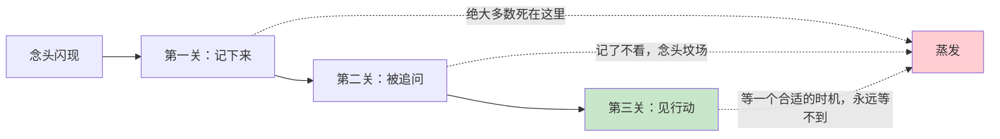
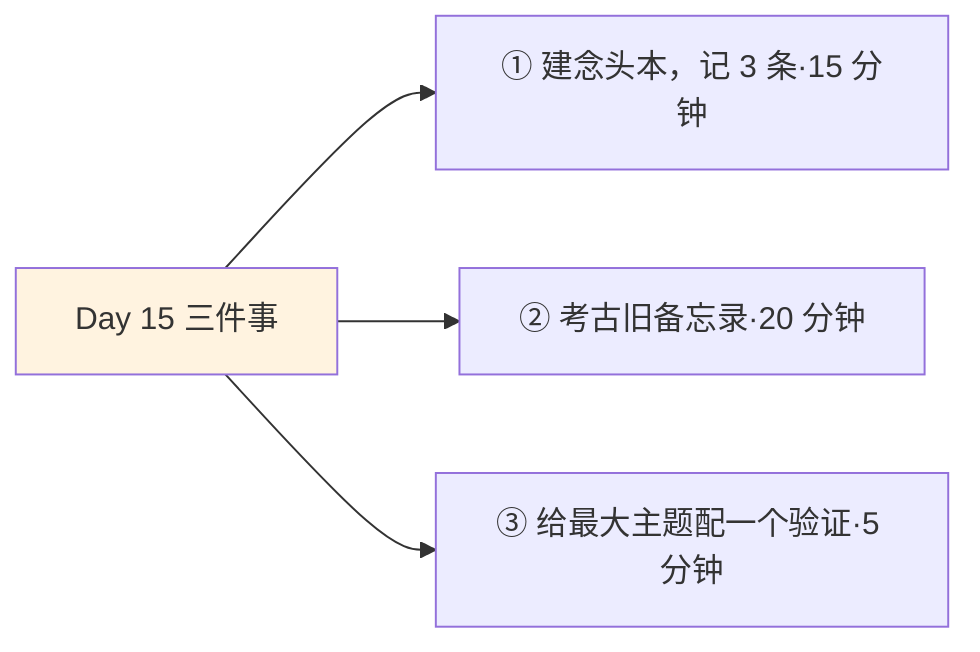
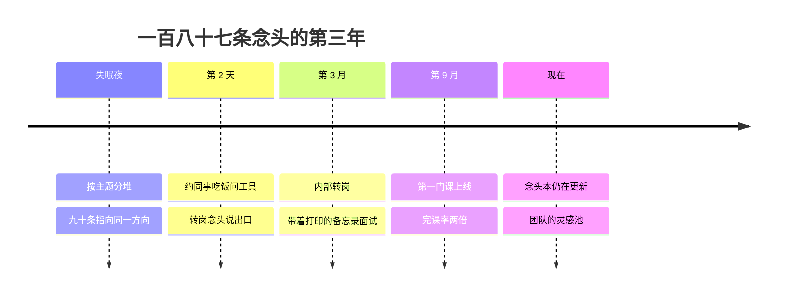

## Day 15·小念头大兴趣：方向的考古学

- [01.看一个真实案例](#01看一个真实案例)
- [02.战略篇为什么从小念头讲起](#02战略篇为什么从小念头讲起)
- [03.小念头是什么](#03小念头是什么)
- [04.念头的一生：被浪费的三个环节](#04念头的一生被浪费的三个环节)
- [05.记录小念头的四步法](#05记录小念头的四步法)
- [06.一条完整记录的示范](#06一条完整记录的示范)
- [07.三个观察窗口](#07三个观察窗口)
- [08.信号的三个特征](#08信号的三个特征)
- [09.噪音的三个特征](#09噪音的三个特征)
- [10.今天要做的三件事](#10今天要做的三件事)
- [11.总结回顾本章节](#11总结回顾本章节)
- [12.后来发生的改变](#12后来发生的改变)
- [13.今天起改变三点](#13今天起改变三点)
- [14.课后作业思考下](#14课后作业思考下)

---

## 01.看一个真实案例

先讲一位互联网运营，姓阿栋，和他手机备忘录里的一百八十七条念头。

他有个习惯：脑子里闪过什么，就往备忘录里丢一条。丢完从来不看，备忘录对他来说是念头的中转站，或者更准确地说，坟场。直到某个失眠的夜里，他闲得无聊开始翻，两年攒下来的一百八十七条，他做了一件以前从没做过的事：按主题分堆。

分完他愣住了。最大的一堆有九十多条，主题高度一致：看到同事把季度数据做成一张动图，全组围过去看，他心里一动；刷到一个把复杂原理讲得极清楚的科普视频，他反复看了三遍；连点外卖都在想这个App的推荐逻辑凭什么这么准。这一百八十七条念头没有一条和运营直接相关，但几乎全部指向同一件事：**把复杂的东西讲清楚，让他兴奋。**

一年后他转岗做了课程产品，专门负责把专业内容设计成别人学得会的课。他复盘时说了一句我记到今天的话：**"我以为我在记录胡思乱想，其实是方向在两年里给我发了九十多封信，我只回了最后一封。"**

今天开讲第四章：长期主义与复利。第一课，从最轻的东西讲起：小念头。

## 02.战略篇为什么从小念头讲起

第四章的三篇是一个整体。Day16 讲长期主义，Day17 讲人生曲线，Day18 讲复利。但这一切有个共同前提：**复利需要本金，本金需要一个方向。**

方向从哪来？多数人的答案是：想出来。找个安静的地方，认真思考人生，然后方向降临。这个答案误导了无数人，因为方向几乎从不以这种方式出现。方向出现的真实形态，就是阿栋备忘录里那九十多条碎片：一闪、心动、忘记、再现。**大方向不是想出来的，是攒出来的。**原稿说得干脆：一个人首先被喜欢什么、不喜欢什么塑造出来。你被什么反复吸引，你就是会被什么塑造的人。

问题在于，多数人对自己的喜欢一无所知，不是没有，是没有记录，没有识别。所以战略篇的第一课，不宏大，甚至有点琐碎：学会当一个自己人生的考古学家，从念头碎片里，挖出你未来的方向。

## 03.小念头是什么

先给研究对象画个像。小念头长这样：一闪而过的我想试试；一次莫名其妙的心动；一段读到就想抄下来的话；朋友聊天时突然插进来的那句话；看到别人的某个瞬间，心里轻轻咯噔一下。

它们有三个共同特征。第一，携带的能量很微弱：不是激情澎湃，是轻轻一动。第二，出现得无声：不打招呼，没有仪式，常常发生在洗澡、走路、通勤这些大脑闲下来的时刻。神经科学给这个现象留了个位置：大脑的默认模式网络，在你不专注干活时活跃，负责的就是这种看似闲散的联想和酝酿，**很多好主意专门挑你不忙的时候敲门。**第三，消失得无息：不记下来，几小时后就模糊，一两天就归零。

这种易蒸发的轻资产，历史上最著名的收藏家是达尔文。他环球航行时随身带着笔记本，看到什么记什么：地质、物种、农民的育种闲谈、甚至完全无关的观察，全往本子里塞。这些碎片单独看毫无战略眼光，谁都看不出一堆杂记里藏着一本《物种起源》。二十年后回头看，**每一个大理论的考古现场，都堆满了当时毫不起眼的小念头。**

达芬奇是另一个标本。他的笔记本流传下来的有几千页，一页纸上会同时出现心脏解剖的草图、一道数学题、一个飞行器的猜想和晚餐的购物清单。当时的人觉得他杂乱，后世才看明白那是把整个世界当成素材库的记法。这两个人的共同点不是天赋，是同一个朴素的信念：**你不知道哪个念头重要，所以先都留着，让时间来筛选。**这恰恰是普通人做不到的，我们总想当场判断哪个念头值得记，判断的工夫念头已经走了，留下的只有那个不算什么的自我安慰。

## 04.念头的一生：被浪费的三个环节

一个念头从闪现到变成方向，要闯三关。绝大多数念头死在关卡里。

第一关，没记下来。念头在脑子里保存不了：它不像待办事项会持续骚扰你，它像萤火，亮一下就灭。阿栋的第一百八十七条如果没进备忘录，就是一个死在关外的念头。第二关，没追问。记下来只是收留，不是识别。记了从不回看、从不分类、从不问它意味着什么，备忘录就是坟场，收留和安葬是同一件事。这一关死掉的最多，因为人有一种错觉：记了就等于处理了。第三关，没行动。看了也信了，然后说时机不成熟，等以后再说。以后的含义是永远。**一个从没被验证过的念头，不管多准，对你的人生都是零贡献。**

三关的通关率连乘下来，一百个念头里，能走到行动的不足一成。这就是为什么大多数人的方向不是没有出现过，是被自己的三道关卡，一批一批枪毙在了半路。

## 05.记录小念头的四步法

怎么提高通关率，原稿给了方法：记录小念头分四步走。记录感受；记录引发感受的事件；记录因感受做出的判断；记录想引发的行为。

四步的精妙在于，它不是流水账，是把一个念头放进了一个完整的认知链路里。感受是原始数据，事件是数据来源，判断是初步分析，行为是转化出口。只记感受的念头是日记，四步俱全的念头是证据。区别在哪？日记只能回味，证据可以用来决策：**当你三个月后回看，能做统计和推断的，只有四步俱全的记录。**

| 步骤 | 记什么 | 回答的问题 |
|:--:|:---|:---|
| 第一步：感受 | 此刻的真实感受 | 我被什么打动了 |
| 第二步：事件 | 引发感受的具体事件 | 打动发生在什么场景 |
| 第三步：判断 | 因感受做出的判断 | 这说明我可能喜欢什么 |
| 第四步：行为 | 想引发的行为 | 我打算做点什么验证 |

四步不用一次写全，但至少写全第一二步，三四步哪怕当时只有半句也要占个位置。**没有出口的念头，记了也是进不了流程的库存。**

## 06.一条完整记录的示范

拿阿栋的一条真事，走一遍四步。

那天下午的场景：同事把枯燥的季度数据做成一张会动的图，全组围过去看。当晚他的念头本上写了四行。第一行，感受：羡慕，加一点说不清的兴奋。第二行，事件：看到数据被做成动图，全组围着看的那两分钟。第三行，判断：我羡慕的可能不是那张图，是把复杂东西讲清楚之后，所有人围着看的那种时刻。第四行，行为：下周找那个同事问问用的什么工具，自己拿一组数据练一遍。

注意第三行那个转折词可能。**四步法的判断栏，写的永远不是结论，是假设。**假设的价值是可以被验证：第四行的行为就是为验证服务的最小实验。如果练完一遍觉得不过如此，假设作废，念头清账；如果练完反而上头，假设升级，进入下一节说的观察窗口。这样，念头就从一个情绪碎片，变成了一条可以走完科研流程的证据链。

## 07.三个观察窗口

单个念头说明不了什么，方向是从一批念头的规律里长出来的。原稿给了三个观察窗口，各配一个动作。

三个月，做识别。把窗口期内的念头按主题分堆，看最大的一堆是什么。阿栋在两年后才做对这件事，你只需要三个月。识别的要点是只看数据不看情绪：不问哪个主题最让你激动，问哪个主题的纸条最多。激动会被一次高光带偏，数量不会。六个月，做验证。对最大主题投入真实时间：每周固定几小时，做这个主题的事。这一步在区分两个东西：想一下的喜欢，和做一阵的喜欢。无数人败在这里：念头阶段爱得死去活来，真上手三周就没了兴致。这不是失败，这是验证在发挥它该有的作用，**它淘汰的从来不是你，是你以为的喜欢。**被六个月验证淘汰的方向，应该庆幸：它只花了你半年，没骗你十年。十二个月，做判断。经过一年真金白银的时间投入，问一句：这个兴趣在没人为它鼓掌的日子里，还剩多少？没人点赞、没有回报、纯粹靠做的本身，还能不能留住你？剩得多的，就是终身兴趣的候选，值得交给 Day16 的长期主义去托管。

这三个窗口不是发明，是兴趣科学的路标。心理学家希迪和伦宁格研究兴趣发展几十年，提出的四阶段模型几乎逐字对应这条路径：**情境兴趣被触发，被维持，长出个人兴趣的萌芽，最后长成成熟的个人兴趣。**他们反复强调一件事：兴趣不是被发现的，是被发展的。翻译过来：大兴趣不是找到的，是从小念头一票一票喂大的。

## 08.信号的三个特征

窗口期内，怎么区分值得押注的方向性念头和普通杂念？看三个特征，原稿给的判据。

第一个特征，反复出现。不是一两个月，是跨季度、跨场景地回来找你。阿栋的九十多条，从饭桌到通勤到外卖，全在不同场景里指向同一件事。**一次出现是偶遇，反复出现是信号。**第二个特征，越做越有能量。注意方向：不是做的时候不累（那可能是熟练），是做完之后，人更满而不是更空。用它对照 Day09 好玩时间的分界线，你会发现在底层是同一个机制：给能量和耗能量，是方向问题的生理答案。这个特征还有个实用的小测法：做这件事之前，你是想赶紧开始，还是想缓缓再说；做完之后，你是想再来一段，还是如释重负。前后两个答案都是想，就是能量在正循环；都是缓缓和如释重负，再怎么合理化，身体已经投了反对票。第三个特征，时间越久越坚定。三个月后再想起这件事，心动是衰减了还是加深了？风口型的心动半年就凉，方向型的心动会随时间复利。

## 09.噪音的三个特征

反面的三个特征同样来自原稿，一一对应：短暂兴奋，依赖外部刺激，事后空虚。

第一个，短暂兴奋。它的生命周期以天计：看到时上头，三天后想不起来。第二个，依赖外部刺激：得不断刷到别人的成绩单才能维持热情，一旦断了供给，热情立刻归零。**靠喂养的火，不是你的火。**第三个，事后空虚：跟着做了一场热闹，结束后心里更空，那是消费的快感，不是创造的能量。

噪音的三大来源值得点名：风口（别人的机会装作你的方向）、光鲜展示（看见的是舞台，没看见后台）、消费冲动（想拥有那个东西，和想做那件事，是两码事）。最后一个警告：**噪音往往比信号响**。信号像心跳，安静、持续、在深处；噪音像鞭炮，巨响、密集、在天上。你的注意力天然被响的吸引，所以判据要写在纸上，不能靠当场感觉。

| 对照项 | 信号 | 噪音 |
|:--:|:---|:---|
| 生命周期 | 跨季度反复出现 | 以天计，三天就凉 |
| 能量方向 | 越做越满 | 断了刺激就熄火 |
| 时间作用 | 越久越坚定 | 越久越空虚 |
| 比喻 | 心跳，安静而深 | 鞭炮，响完就散 |

## 10.今天要做的三件事

动作一，建念头本，今晚记三条。纸质或电子都行，四栏结构照第 05 节。三条起步，不求质量，今天闪过什么都算数。

动作二，考古你的旧备忘录。翻出手机里那个念头坟场，按主题分堆，数出最大的一堆。如果你和阿栋一样从没做过这件事，这一步的震撼值很高。

动作三，给最大主题配一个最小验证。本周内就能做的那种：问一个人、试一个工具、看一小时资料。行为栏写上日期，它就活了。

## 11.总结回顾本章节

战略的起点不是思考人生，是攒方向。小念头是最轻也最易蒸发的资产，达尔文的笔记本证明：大理论的考古现场堆满小念头。念头要闯三关：记下来、被追问、见行动，多数人的关卡连杀九成念头。四步法把念头变成证据链：感受、事件、判断、行为，判断栏写假设不写结论。

三个观察窗口：三个月识别主题，六个月投入验证，十二个月判断终身。信号三特征：反复出现、越做越满、越久越坚定；噪音三特征：短暂兴奋、依赖刺激、事后空虚。噪音比信号响，判据要落在纸上。

一句话总结整章：**大方向不是想出来的，是从小念头一票一票攒出来的。**第四章从今天开始给你的复利准备本金：先有方向的存款，明天讲怎么让存款滚十年。

## 12.后来发生的改变

回到阿栋，讲讲整理那一夜之后的事。

第二天他约了做动图的同事吃饭，问出了工具的名字，那顿饭的副产品是对方听他讲了十分钟为什么要转岗，说了句你比我们组大部分人想得都清楚。三个月后内部转岗面试，他把两年备忘录打印出来带去了，九十多条按时间排列，他说面试官翻那几页纸的时间，比问他问题的时间长。半年后他做成了第一门课，上线三个月的完课率是团队均值的两倍。

他现在还记念头本，只是用途变了：他带的团队有个共享文档，就叫灵感池，谁冒出念头都往里丢，每月分一次堆。他跟新人说得最多的一句话，是他自己的教训换来的：**"别急着找方向，方向找你的方式，是先给你发很多条小的，你回不回，决定它还发不发。"**

有个后记值得单独一提。那份让他转岗成功的打印版备忘录，他现在裱在工位隔板上，不是纪念，是提醒。他说每次想给自己找借口的时候看一眼那九十多条时间戳：**两年，九十多次心动，我一次都没回。**要是那晚没有失眠，那家公司永远不会有那次转岗，一个人和他的方向，会一直像两条平行线，各自安静地过完。世界上大多数人和他们方向的结局，大概就是这两条线。区别只在于，有没有那么一个失眠的晚上，有人肯去翻一翻堆积的信号。

## 13.今天起改变三点

第一，念头本随身，记录不隔夜。闪现到记录的间隔越长，损耗越大，睡前补记是底线。别追求记得好看，**念头本的敌人是整洁**，太整洁说明你在筛选，筛选是识别阶段才做的事，记录阶段要的是一网打尽。

第二，每月一次主题盘点。每月最后一个周日，把当月念头分堆，最大堆标红。三个月后你手里的就不是一堆碎片，而是一张主题热力图，方向在图上是看得见的。

第三，每个念头配最小验证。没有行为栏的念头不完整，没有验证的主题不动心。**念头加一个动作，才等于一次表态。**你对你人生方向的每一次表态，都会在 Day18 的复利曲线上，留下一个数据点。

## 14.课后作业思考下

第一，今晚用四步法记三条念头，然后回答：四步里哪一步最难写？难写的那一步，暴露的是你感受力的钝化、观察的粗放，还是行动的迟疑？

第二，考古完旧备忘录后，最大的一堆是什么主题？用信号三特征检查它：反复出现了几个季度？做的时候是充电还是放电？三个月后再想起，是淡了还是浓了？

第三，回想一个被你浪费的念头：当年闪过、没当回事、后来看到别人做成了的。它当时被卡在了三关里的哪一关？那道关卡，是你人生的惯常枪毙点吗？

第四，为你最大主题堆配一个本周最小验证，写下具体日期和动作。这是你向方向发出的第一封回信。回信不必隆重，但要有日期：**方向不看你怎么说，只看你哪天做。**

---

**明日预告 · Day 16 做长期主义者。** 方向有了，明天讲怎么让它长十年。为什么计划要以年为单位？为什么说要信所未见？那三条铁律、四象限的真相，还有相信本身怎么被工程化地建立。我们明天见。
