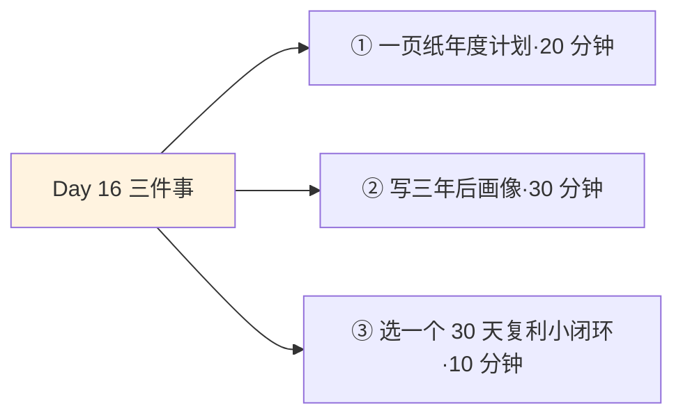
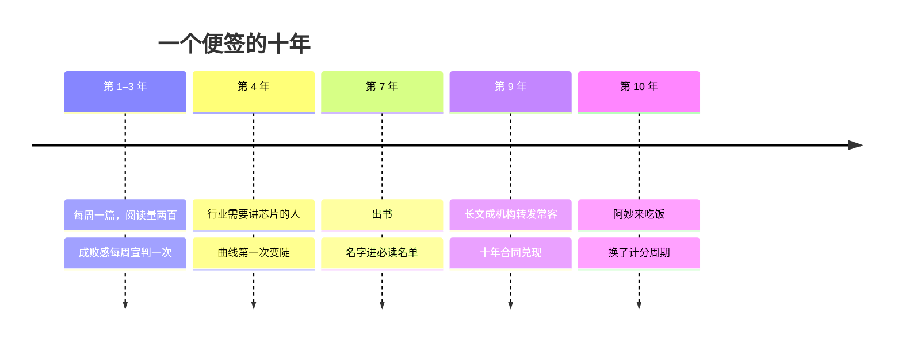

## Day 16·做长期主义者：相信时间的复利

- [01.看一个真实案例](#01看一个真实案例)
- [02.什么是长期主义](#02什么是长期主义)
- [03.铁律一：计划以年为单位](#03铁律一计划以年为单位)
- [04.铁律二：每天安排赚钱时间](#04铁律二每天安排赚钱时间)
- [05.铁律三：信所未见](#05铁律三信所未见)
- [06.四象限的真相](#06四象限的真相)
- [07.敌人一：成败感](#07敌人一成败感)
- [08.敌人二三：短期反馈与环境噪音](#08敌人二三短期反馈与环境噪音)
- [09.如何工程化地建立相信](#09如何工程化地建立相信)
- [10.今天要做的三件事](#10今天要做的三件事)
- [11.总结回顾本章节](#11总结回顾本章节)
- [12.后来发生的改变](#12后来发生的改变)
- [13.今天起改变三点](#13今天起改变三点)
- [14.课后作业思考下](#14课后作业思考下)

---

## 01.看一个真实案例

先讲两位同一年开始写作的人。

老树写公众号，只写一个主题：芯片产业。每周一篇长文，雷打不动。前三年惨淡到什么程度：平均阅读量两百出头，后台留言一星期凑不齐十条。第四年行业突遭全球关注，所有媒体疯狂找能讲清楚芯片的人，发现这个领域深耕的中文写作者凤毛麟角，老树的号被反复推荐。第七年他出了书，第九年他的名字进了行业必读名单，现在他的长文是几家投资机构的内部转发常客。

阿妙比老树聪明，这是所有认识他们俩的人公认的。第一年她也写公众号，写得比老树灵；第二年看短视频起势，果断转战；第四年直播，第六年知识付费，第八年做AI内容。她每次都进场很早，嗅觉极佳。第十年她找我聊，说了一句需要逐字读的话：**"我不是不努力，我是每次都刚好差一年。"**每次都在曲线即将变陡之前，换了赛道。

我问老树怎么看这十年。他的回答也值得逐字读：**"我前九年都觉得自己在赔，第十年才知道在攒。"**

他们俩的差距不是第十天产生的，也不是第十个月产生的，是每天都在产生，只是前九年，肉眼看不见。今天讲的就是怎么熬过那肉眼看不见的九年：长期主义。

## 02.什么是长期主义

原稿的定义只有一句话：**用微小积累的持续成长，叠加起来足够长的时间，去等待质变点。**三个关键词，一个都不能少。

微小积累，说的是动作的尺寸。长期主义不靠豪赌，靠的是每天做得动的小额存款：Day07 的一小时，Day12 的一千字。动作太大，热情耗不起；动作够小，日历才接得住。足够长的时间，说的是周期：以年计，而不是以周计。质变点，说的是这条路径的非线性：增长不是匀速爬坡，是长时间的平台期之后突然的陡升，Day05 埋过伏笔，**指数曲线的前段平得让人绝望，后段陡得让人不敢认。**

把这三个关键词和另一个常见理解对比一下：长期主义等于坚持。不对，坚持是忍受，长期主义是相信。忍受的人咬牙切齿地盼终点，相信的人心平气和地走过程，同样的十年，体感完全不同，产出也完全不同，因为忍受消耗心力，相信不消耗。

原稿给长期主义者的画像说得极重：**真正的长期主义者，就是持续去知行合一的人。**注意知行合一四个字的分量：知道复利不算，每天真的投才算。老树讲不出什么复利理论，但他用十年把知行合一四个字活成了本人。理论讲到这，具体怎么做，三条铁律。

## 03.铁律一：计划以年为单位

第一条铁律：计划以年为单位。

为什么偏偏是年，不是季、不是月？因为一年是一个完整的反馈周期。一个技能从生到熟，一个作品从立到成，一批读者从零到聚，市场给你的回应需要春夏秋冬才能走完一轮。月计划训练耐心，季度计划训练执行，**只有年计划训练的是战略**：你在练习把自己的投入交给一个大于自己的周期。

年度计划的写法只有一个建议：一页纸，一个主目标。呼应 Day02 的那道题，清单里纵然时光倒流还是会去做的那件事，就是年度主目标的种子。写满十项目标的那张纸不叫计划，叫愿望展销会。老树十年间的年度计划我看过，每一年都是一张便签，内容只变过三次，主题从没变过。

年计划的另一个隐藏价值，是它对冲了当下最流行的活法：人生季度化。三个月没结果就换方向，是对复利最彻底的谋杀。**阿妙不是输在判断力上，她是输在计分周期上**：她用季度给别人十年期的人生打分，每打一次，就清零重算一次。第 17 天会专门画这条曲线，今天先立规矩：从今天起，你的所有重要计划，落款日期以年为单位。

## 04.铁律二：每天安排赚钱时间

第二条铁律：每天为自己安排赚钱时间。这条 Day07 已经深潜过，这里只讲它在长期主义结构里的位置。

长期主义的数学骨架是一个乘法：结果等于起点，乘以每天的增量，再自乘时间那么多次。这是原稿那个硬核人生终极等式的通俗版，Day18 会正式拆解公式，今天只看它对日程的指令：**时间这个指数不能是零。**每天投一小时，指数是三百六十五；三天打鱼两天晒网，指数腰斩；阿妙式的每年清零，指数永远从一重新算起。

所以年计划必须配一个日供机制，否则就是空头支票。老树的机制是每周一篇，九年的五百多篇，是他那条曲线的全部砖块。你的机制可以是每天一小时，也可以是每周三篇、每月一更，形式不限，铁律只有一条：**节奏固定，不问心情。**因为长期主义的敌人太多，今天详细讲，它们专挑靠情绪供血的计划下手。

写到这里可以把三条铁律的关系说清了：年计划给你方向和容错，日供机制给你进度，而下面这条，给你熬到质变点的燃料。

## 05.铁律三：信所未见

第三条铁律最难：要信所未见，所以延迟满足。

为什么难。行为经济学给这个难处起了名字，叫时间贴现：**人脑会自动给远期的回报打折，而且打得很狠**。今天的快乐按原价，一年后的收获折价三成，十年后的成就几乎折成零。这不是品质问题，是出厂设置，远古时代谁囤粮到十年后谁先饿死。所以长期主义天然反人性：它要求你把今天的一部分兑换成一张十年后才兑现的支票，而且利息看不见。

心理学最著名的棉花糖实验，测的就是这个。能等十五分钟拿两块糖的孩子，后续发展普遍更好，这个结论你大概率听过。但后续研究揭示了更有用的细节：**真正区分孩子的不是意志力，是策略。**等得住的孩子会转移注意力，捂眼睛、唱歌、把糖想成云朵。后来重新验证发现，控制了家庭环境后，意志力的差距大幅缩小，但策略的作用依然坚挺。

这个细节把长期主义的实操讲透了：**不要靠意志力硬扛延迟满足，要靠结构和想象。**结构是 Day26 将讲的仪式和结界，把诱惑物理性挡在外面；想象是给未来画一张足够具体的脸：三年后你在哪个城市、做什么、一天怎么过、身边有谁。脸越具体，折价越少，这是大脑的一个后门：**它不为抽象的未来行动，但它会为具体的画面心软。**所以今天的三件事里有写三年画像，原理在此。

## 06.四象限的真相

三条铁律立完，补一块认知基石：四象限法则的再理解。

四象限你肯定熟：重要且紧急、重要不紧急、紧急不重要、不重要不紧急。传统用法是给事项排序，今天换一个理解角度：**四个象限其实是四种人生的居住地。**住在第一象限的人，永远被截止日期追杀，救火队员式生存；住第三象限的人，被别人的紧急绑架；住第四象限的人，刷着手机把人生过成背景。而长期主义者，住在第二象限：重要、但不紧急的那些事，健康、学习、作品、关系。

原稿对第二象限的评价值得整段抄录：**未来的重大成果和生活质量，都是重要而不紧急的时间累积决定的。**这句话为什么对？因为紧急的本质是别人给你的截止日期，而第二象限的事，恰恰没有人在外面替你设截止日期：没有人催你锻炼，没有人逼你读书，没有人为你的作品倒计时。没人催的事最容易被无限推迟，也最能在多年后拉开人与人的差距。

老树每周那篇长文，写的那九年里，没有一次是紧急的。它是标准的第二象限居民。**长期主义者的日常，就是把第二象限住成根据地：不紧急的事，反而最先做。**实操口诀就一句：每天的第一件事，永远从第二象限里挑。

## 07.敌人一：成败感

现在讲长期主义的三个敌人。第一个最凶，原稿点过名：意识层面的成败感。

成败感的定义：用单次结果给自己打分。写了一篇没人看，败；三个月没涨粉，败；投了一个月没回报，败。问题在于，**复利曲线的前段本来就平**，成败感计分的那几局，恰好全落在平台期里。于是每一次诚实的计分都在说：你不行。老树前三年的阅读量，用成败感计分就是一场连续三年的败局，任何理智人早该止损离场了。

解药是换计分方式：从结果指标换成过程指标。**成败感计单局，长期主义计整场**；不看今天赢没赢，看今天投没投。写了没看的人只多了一种数据，投了。做了没爆的人只多了一个证据，积累。老树说他给自己定的唯一考核是：这周那篇，写完了没有。写完了，这周就赢了，至于阅读量，那是市场的事，市场的反馈要拿年做单位才能读懂。这个计分方式换掉之后，他描述自己的心理变化是：**"以前每周发布完像等宣判，后来每周发布完像存了一笔钱，心态是完全不同的两个物种。"**

## 08.敌人二三：短期反馈与环境噪音

第二个敌人，短期反馈的诱惑。具体形态就是阿妙曲线：别的赛道看起来永远更快。你在平台期苦熬时，总有人晒出陡峭段的截图。诱惑的机制拆开看很简单：**你每次都在别人的曲线最陡处入场，和自己的平台期对比，当然处处是黄金**。但那是人家熬出来的陡峭段，不是入场券附赠的，你进去之后先领的是人家早就熬完的平台期。阿妙九年换了五条赛道，等于领了五次平台期，一次陡峭都没等到。

第三个敌人，环境噪音。身边的人都在赚快钱，亲戚关心你怎么还没成功，同学聚会成了汇报现场。噪音的麻烦在于它披着关心的外衣，躲不掉。两个解药：定期信息斋戒，季度性地和一切进步叙事隔离一周，让耳朵reset；找到同路人，Day11 的教练、Day13 的对手、长期主义社群，**相信是会传染的，和相信的人待在一起，是成本最低的续航。**

| 三个敌人 | 典型台词 | 解药 |
|:--:|:---|:---|
| 成败感 | 做了这么久没结果，算了 | 换计分方式：计投入不计胜负 |
| 短期反馈 | 别的赛道明显更快 | 看懂那是别人熬完的平台期 |
| 环境噪音 | 大家都成了，就你还没 | 信息斋戒加同路人 |

## 09.如何工程化地建立相信

三个敌人讲完，剩最后一个问题：相信本身从哪来。答案是，相信不靠悟，靠工程，三步搭起来。

第一步，找到相信的人。Day11 的教练在这里多一重身份：**他是长期主义的活体证据**。听一百遍复利理论，不如认识一个真靠十年攒出来的人。看他的十年轨迹，相信从抽象变具体。第二步，用小闭环亲眼验证复利。三十天写作、三十天运动、九十天练一个技能，在一个小周期里完整经历一次：平台期的烦躁、微小积累的沉闷、然后某一天的突然变好。**亲眼见过一次复利的人，和只听说过复利的人，是两种生物**，前者已经信了，后者还在等被说服。第三步，用故事喂养自己。传记和纪录片是长期主义的粮仓，因为传主的一生被压缩在几百页里，**复利的形状在传记里最容易被看见**。达克沃思研究坚毅多年，结论说坚毅是对长期目标的热情与坚持，而她的数据反复显示：坚毅比天赋更能预测成就。热情哪来？一半就是从故事里喂出来的。

三步做完，相信就不再是口号，成了一个有证据、有验证、有粮草的立场。

## 10.今天要做的三件事

动作一，写一页纸年度计划。一个主目标，落款日期在一年后。贴在书桌前，这是你的战略合同的正文。

动作二，写三年后的画像。城市、住处、一天的作息、桌上的东西、身边的人，越具体越好，配上画面。写完贴出来，每天早晚各读一遍。别小看这个动作，它是对抗时间贴现的后门。

动作三，选定一个三十天复利小闭环。从你的主目标里切一小块：三十天写满三万字，或者三十天练熟一项技能。三十天后你会亲眼看见一次小型复利，那将成为你相信的第一块砖。

## 11.总结回顾本章节

长期主义是用微小积累的持续成长，叠加足够长的时间，等待质变点。它不是坚持，是相信；真正的长期主义者，是持续知行合一的人。三条铁律：计划以年为单位，一年是完整的反馈周期，季度化人生是对复利的谋杀；每天安排赚钱时间，指数不能是零，节奏固定不问心情；信所未见，不靠意志力硬扛延迟满足，靠结构与想象，给未来画一张具体的脸。

四象限的真相：长期主义者住在重要不紧急的第二象限，每天的第一件事从那里挑。三个敌人：成败感计单局，换计分方式；短期反馈是别人熬完的平台期；环境噪音用斋戒和同路人对抗。相信靠工程：找活体证据，跑小闭环，用故事喂养。

一句话总结整章：**十年的差距不是第十年产生的，它每天都在产生，只是前九年，肉眼看不见。**

## 12.后来发生的改变

回到老树和阿妙，讲讲第十年之后。

去年他们吃了一顿饭，阿妙请的，她带着一个具体问题去的：到底该不该做AI内容，这是她第九次站在换道的路口。老树没直接回答，反问了她一句，后来阿妙跟我复述了三遍：**"你每一步都对，就是从来没让任何一步算数。"**阿妙说她在饭桌上愣了很久，回家把九年做过的东西列了一张清单，每一条都很精彩，每一条都是别人的生态位。她说那天她第一次看清一件事：她不缺判断力，缺的是一个让判断力算数的周期。

阿妙现在的动向：她停了第九次转型，在她最熟的那个领域开始长期做。我问她会不会又差一年，她说了一句我认为比老树那句还好的话：**"我转了九年，现在才开始第一次留下。前面的账没白付，我现在知道哪条路是坑，只是以前知道得太快，走得太急。"**

老树的最新便签换了一张，还是一页纸，还是那个主题，只是下方多了一行小字：第十年，继续。**长期主义者的计划永远只有一句话，因为方向不用换，要换的只是日期。**

## 13.今天起改变三点

第一，每天早晚读一遍三年画像。早晚各一次，读出声更好。它是对抗时间贴现的日常维护，给那张具体的脸，每天上一次色。

第二，永久更换计分方式。从今天起，凡长期项目只计过程分：今天投了没有，投了多少。结果交给年去评。**用单局的成绩要求自己，是对长期主义最深的误解。**

第三，每季度一次信息斋戒。每年四次，每次一周，和所有进步叙事、同行数据、风口新闻隔离。耳朵清干净了，自己的心跳才听得见。

## 14.课后作业思考下

第一，写出你的一页纸年度计划。检查两件事：落款是否在一年之后，主目标是否只有一个。写完对照 Day02 的清单：它是不是那件纵然时光倒流还是会做的事。

第二，完成三年画像，然后回答：画面里最模糊的部分是什么？模糊处就是你现在最没把握的地方，也是最需要在下一个赛点前重点准备的地方。

第三，盘点你的成败感高发场景：什么事最容易让你用一次结果否定全部投入？用换计分法重写那件事的记分牌，把赢的定义从结果改成过程。

第四，数一数你人生里坚持超过五年的事，写作、跑步、一个爱好、一段关系，都算。那就是你长期主义能力的存量证明。如果一件都数不出来，别慌，三十天的复利小闭环，就是给这个存量从零开户。

---

**明日预告 · Day 17 三种人生曲线。** 相信有了，明天画曲线。直线人生、断断续续人生、循环增强人生：三种函数图，你正在哪一条上？怎么检测，怎么切换？还会讲那三个条件：可累积的技能、可复利的资产、足够的时间跨度。我们明天见。
