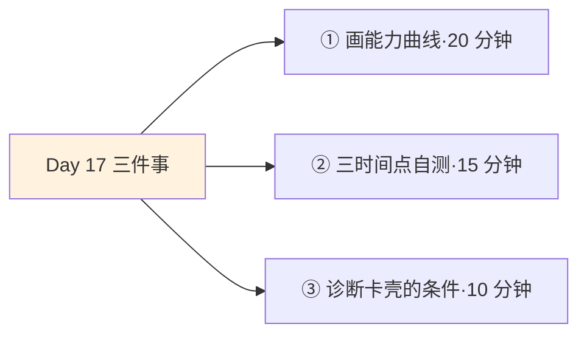
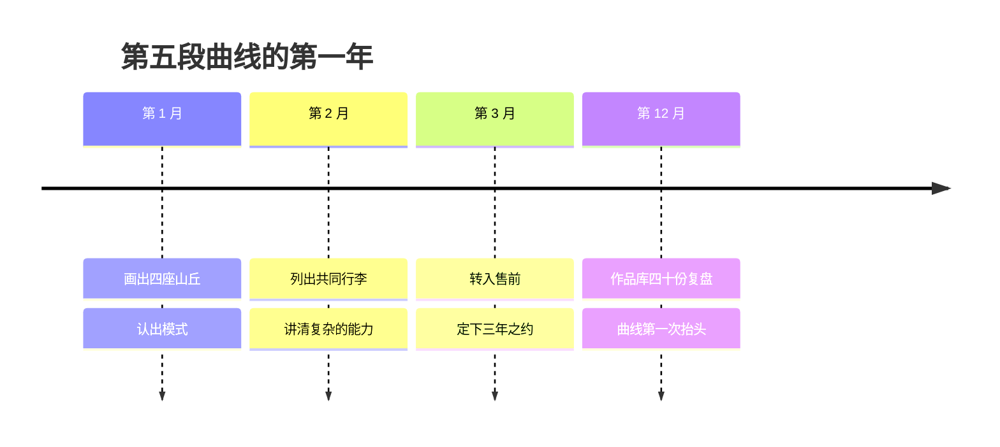

## Day 17·三种人生曲线：你在哪条上

- [01.看一个真实案例](#01看一个真实案例)
- [02.曲线一：直线人生](#02曲线一直线人生)
- [03.曲线二：断断续续人生](#03曲线二断断续续人生)
- [04.曲线三：循环增强人生](#04曲线三循环增强人生)
- [05.两种恐惧](#05两种恐惧)
- [06.循环增强的三个条件](#06循环增强的三个条件)
- [07.检测：你在哪条曲线上](#07检测你在哪条曲线上)
- [08.切换轨道的三个原则](#08切换轨道的三个原则)
- [09.今天要做的三件事](#09今天要做的三件事)
- [10.总结回顾本章节](#10总结回顾本章节)
- [11.后来发生的改变](#11后来发生的改变)
- [12.今天起改变三点](#12今天起改变三点)
- [13.课后作业思考下](#13课后作业思考下)

---

## 01.看一个真实案例

先讲一位 Day03 画过人生起落图的读者，姓老穆，三十二岁。

起落图那次，他的纵轴是情绪，画出来的曲线虽有起伏但大体平顺。上个月他又画了一张新图，这次纵轴换成了别的东西：**能力与资产的总量**，就是你手里真正的家伙，技能、作品、人脉、声誉的总和。横轴还是时间，从二十二岁工作那年起画到今天。

画完他自己先愣住了。十年，图上不是一条曲线，是四座小山丘：第一座是入行的销售，爬了两年半，放弃了；第二座是开店，爬了一年半；第三座是做保险，第四座是做短视频代运营，各爬了两年左右。每座山丘的形状惊人地一致：起步、爬升、到某个高度，然后换道，**曲线垂直落回地面，从零开始爬下一座。**

他拿着图跟我说：**"我以为我经历丰富，其实我是在同一个高度上，摔了四次。"**

今天讲的就是这张图。人这一生的轨迹，大差不差就三种形状，原稿把它们叫三种人生函数图。对号入座之前先说好：这一章的目的不是审判，是定位。曲线没有道德，只有走向。

## 02.曲线一：直线人生

第一种，直线人生。能力总量十年如一日，图上是一条平线。

这种人生的自述通常很好听：知足常乐，稳定踏实。原稿对它的判词只有一句，但极其冷峻：**貌似知足常乐，但环境中，不进则退。**

这句话的学术版叫红皇后效应，出自《爱丽丝镜中奇遇》：在那个国度里，你必须拼命奔跑，才能留在原地。生物学家借它描述进化军备竞赛，经济学家借它描述竞争环境：**当你停止进步时，你的绝对值没变，但坐标系在动**。你十年前的技能还在手里，可市场对这项技能的报价每年都在降；你的岗位还在，但应届生的供给每年都在涨。图上那条平线，放进真实环境里换算，其实是一条缓慢下行的斜线。

物理学会给这条线再补一刀。熵增定律说，不投入能量做功的封闭系统，只会自发走向无序：房子不收拾会乱，技能不维护会钝，关系不维护会淡。**直线人生的问题不是走错了方向，是它默认自己可以不做功而维持原状**，这在物理上就不成立。所以直线的准确判词是：不是稳定，是缓慢的下沉，只是下沉得慢到本人感觉不到。

直线人生还有一种最隐蔽的形态，值得单独点名：用战术上的微调，掩盖战略上的静止。每年都换新工具、追新概念、跳新平台，看起来忙忙碌碌与时俱进，但每一年的忙碌都没有落在积累物上，都是在原地换姿势。判断真假很简单，回到证据：三年下来，你手里多出来的东西，是可带走的资产，还是又一段用完即弃的经历？**姿势换得再勤，不动就是不进，环境不陪你演戏。**

## 03.曲线二：断断续续人生

第二种，断断续续人生，就是老穆的四座山丘。不断更换目标，结果什么都没完成。

这条曲线最贵的地方是换道时的清零成本。每次换赛道，你以为换的是方向，实际上交出去的是资产：上一段攒的技能，新赛道用不上；上一段攒的人脉，随着转行通讯录里慢慢沉默；上一段攒的声誉，行业一换归零。这些在经济学里叫沉没成本，沉没成本本不该影响决策，**问题是你沉没的不止一次成本，是每一座山丘上本来可以长成雪球的雪。**

必须公平地讲：这条曲线的原始动机常常不坏，甚至听着很先进：多探索，多试错，寻找热爱。这就引出一个必须讲清的区分：**探索和逃离长得像，但内里完全不同。探索有结论，逃离没有。**探索的人每次换道，手里拎着上一段的收获：结论是我不适合，原因是什么，我验证了什么；逃离的人换道时两手空空，只有如释重负。老穆后来自己承认，他那四次换道，只有第一次带出来过结论，后面三次都是逃离：爬到要真正见效的那一段了，压力上来了，走了。**山丘最高的那段，恰好是所有人放弃的位置**，因为那里陡。

## 04.曲线三：循环增强人生

第三种，循环增强人生。微小积累，逐渐增强，等待质变。图上是一条前平后陡的指数曲线。

```mermaid
xychart-beta
    title "三种人生曲线（示意）"
    x-axis [第1年, 第3年, 第5年, 第7年, 第10年]
    y-axis "能力与资产总量" 0 --> 100
    line [12, 13, 13, 14, 14]
    line [15, 35, 15, 40, 15]
    line [10, 14, 25, 48, 95]
```

三条线放在一起看最直观：直线平着走，断续在山丘间循环，循环增强前段和直线几乎重合，然后在某一年突然抬头。民间流传一个竹子的说法：毛竹种下去的前几年几乎不长，几厘米的个头要维持好一阵，因为它在往地下扎根，根系铺好了，某个雨季开始，每天蹿几十厘米。**说法的科学细节可以商榷，但它描述的机制是真实的：看得见的陡升，全是看不见的地下工程换来的。**昨天那位写了九年的老树，就是这条曲线的标本：他的前三年和直线人生看不出区别，区别埋在土里。

原稿给这条曲线下过一个定语，是全章最重要的一句话：**第三种函数图，就是长期主义者的时间看得见的人生图。**注意看得见三个字。Day16 讲过，十年的差距每天都在产生，只是前九年肉眼看不见，这张图就是让复利现形的那张底片。

## 05.两种恐惧

三种曲线画完，一个问题自然浮出来：为什么大多数人的图，是前两种？

原稿的诊断一针见血：**直线的人害怕改变，断续的人害怕坚持。**这两种恐惧来自不同的深处。

直线者的账是这么算的：改变意味着不确定性，不确定意味着风险，我现在的熟悉虽然乏味，但至少可预测。心理学管这个叫现状偏差：**人在两个选项之间，会系统性高估熟悉的那个**，哪怕数据说陌生那个更好。熟悉的痛苦是已知的，陌生的收益是打折的，这一对比，十年就过去了。

断续者的账更隐蔽。表面上他们最勇敢，最敢改变，但他们真正怕的是一件事：**坚持到出结果。**只要不把任何一条路走完，就永远不用面对那个终极问题：万一我全力以赴，还是不行呢？频繁换道是对这个问题的完美逃避：不是我不行，是我还没找到对的赛道。**每条山丘都是一堵挡住验证的墙**，翻过去重新开始，比在墙上撞出一个结果，心理上安全得多。

合起来就是那句值得抄下来的话：**直线者用稳定逃避选择，断续者用变化逃避验证。**两种逃避，同一种代价：永远不知道自己全力走完一条路，会站在哪里。

## 06.循环增强的三个条件

想从两条旧曲线换到第三条，原稿给了三个条件：有可累积的技能，有可复利的资产，有足够的时间跨度。

第一个条件，可累积的技能，关键词是**不是消耗品**。把你的日常工作拆开看，哪些是随做随耗的：流水线式的执行、重复的体力输出、纯消耗的应酬，做完归零；哪些是越做越厚的：方法论、判断力、审美、手感，做完沉淀。消耗型的事占满日程，人是直线；积累型的事每天有占比，人才有抬头的可能。第二个条件，可复利的资产，作品、关系、资本，明天 Day18 整章讲它，今天先记结论：**没有资产的人生，技能再强也是给别人的资产打工**，老穆的四座山丘上有技能，没资产，所以每次清零清得干干净净。第三个条件，足够的时间跨度，三年起。为什么是三：第一年入门，光看懂地形就要一整年；第二年入行，开始有产出和反馈；第三年入道，量变攒到临界。**三年是复利的最小有效剂量**，短于它的坚持，连引擎都没预热就熄了火。

三个条件还有个鲜被点破的关系：它们互为因果。没有累积型技能，攒不出资产；没有资产，坚持三年等于白守；而时间跨度不够，技能和资产又都长不熟。反过来，只要有一个先动起来，另外两个就会被带着转：先挤出每天一小时练一项可累积的技能，技能会开始结出作品这个资产，资产会反过来劝你别换道，三年之约就这么自己成立了。**所以不必三样齐备才出发，先动最容易动的那一个**，通常是技能，因为它只依赖你的日程，不依赖任何外部条件。

## 07.检测：你在哪条曲线上

三种曲线摆在这，怎么知道自己现在在哪条上。原稿给的检测法：看三个时间点的自己。

三个月前的你，一年前的你，三年前的你。三个快照放在一起对比：能力上有没有进阶，手里有没有新增的作品、技能、资产。判定标准三条：**有明显进阶感的，在循环增强上**，你的曲线正在抬头；**几乎没变的，在直线上**，该给系统供能了；**跳跃很多但没有累积的，在断续上**，经历丰富，家底空空。

实操有个关键提醒：用证据，不用感觉。感觉会双标：焦虑的时候觉得自己十年没长进，膨胀的时候觉得一年顶别人十年。证据是可以列出来的：三年前的你拿得出手的作品是什么，现在是什么；三年前会的技术，现在会什么；三年前的通讯录，和现在差几页。**快照对比的颗粒度，决定检测的诚实度。**老穆就是靠这个方法破的案：他起初觉得自己这些年进步不小，把四段经历的能力清单列出来一看，重复率超过七成，十年的时间，练的是同一层。

检测还有一个常见的误判，要提前排掉：把忙碌当进阶。有人三个月一份快照拿过来，列了厚厚一沓做过的事，问这算不算循环增强。判定不看厚度看性质：这沓事里，有多少件会留下来？留下的意思是，明天还产生作用：方法论沉淀了没有，作品存在了没有，关系升温了没有。会留下来的是资产，做完即散的是经历。**一沓经历叠不出一条上扬的曲线，几个资产才能。**这也是 Day01 就立的规矩在三年尺度上的版本：看得见的记录里，藏着看得见的人生走向。

## 08.切换轨道的三个原则

检测出旧曲线之后，讲怎么换到新曲线，原稿给了切换的三个原则。

第一个原则，允许转换，但要少。人生不是不能换道，Day15 说过方向需要验证，验证失败就该换。**换道要有配额意识：十年两三次以内**，超过这个频率，问题基本不在赛道上，在模式上。第二个原则，转换时保留可迁移能力。写作、表达、判断、学习方法、带人的手感，这些是跨赛道的行李，换道时唯一该死死拎住的东西。老穆的四座山丘上其实都有一件共同的行李，他自己从没发现，第 11 节会讲。第三个原则，转换后立刻进入循环增强模式。新赛道第一件事不是冲刺，是搭积累结构：定下要练的可累积技能、要攒的资产、认定的年限。**带着断续的习惯进入新赛道，只是把第五座山丘画在了新的行业里。**

## 09.今天要做的三件事



动作一，画出你的人生曲线。横轴十年，纵轴能力与资产总量，诚实落笔，山丘就是山丘，平线就是平线。画完在曲线上标出今天的你。

动作二，做三时间点自测。三个月前、一年前、三年前各列一份证据清单：作品、技能、资产。对比判定你在哪条曲线上。

动作三，诊断你卡在哪个条件上。三个条件逐个过：日程里积累型的事有占比吗，手里有正在变厚的资产吗，给现在的方向留够三年了吗。卡住的那个条件，就是你下个月的主功课。

## 10.总结回顾本章节

三种人生函数图：直线貌似知足常乐，实则环境中不进则退，不做功的系统按熵增走向无序；断断续续是反复清零的山丘，贵在沉没的雪，探索有结论、逃离没有，山丘最高处恰好是放弃的位置；循环增强是长期主义者的时间看得见的人生图，前平后陡，陡升全靠地下工程。

两种恐惧：直线者用稳定逃避选择，断续者用变化逃避验证。换到第三条曲线的三个条件：可累积的技能、可复利的资产、三年起步的时间跨度。检测看三个时间点的证据，不看感觉。切换三原则：换道有配额，拎住可迁移行李，进新轨道先搭积累结构。

一句话总结整章：**雪球不在大小，在滚动。**今天画的这条曲线，就是检查你是否在滚动的仪表盘，从下一条曲线开始，愿你只看它抬头。

## 11.后来发生的改变

回到老穆，讲讲那张四座山丘的图之后的事。

画完图那晚他睡不着，翻来覆去想一件事：四段经历里，有没有什么共同的东西。第二天他把四段工作里自己被夸过、被需要过的时刻列了一遍，发现了一件他十年没看见的事：四段经历里，他干得最出色的都是同一件事，**把复杂的东西讲给客户听**。做销售时他讲产品，开店时他讲货源和账目，做保险时他讲条款，做代运营时他给客户讲数据。四座山丘的行业各不相同，这件行李他每次都拎在手里，只是从没把它当成主角。

现在的老穆在做售前解决方案，专门负责把技术团队的东西翻译给客户。入行第二年起，他开始把每一场讲过的方案整理成复盘文档，存进自己的作品库。他说这是他第一次在新赛道里搭积累结构，这一次给自己定了死规矩：**三年，不换。**曲线的第五段，第一次没有画成山丘的样子，画成了上坡。



他上个月说了句话，把这一章全讲完了：**"我的前四条曲线不是白画的，它们是我的扫描线：扫过四个行业，终于看清自己带的是什么行李。"**

这个故事里最值得咂摸的，是时间的作用被彻底改写了。前十年，时间是老穆的敌人：每一次流逝都意味着又一座山丘白爬。现在，同样这十年变成了他的资产：四个行业的扫描经验，让他讲方案时比同行多一层跨界直觉。**内容没变，结构变了，同一份过去就从沉没成本变成了入场筹码。**这就是曲线的意义：它不是宣判你的过去，是给你的过去重新记账。

## 12.今天起改变三点

第一，给当前的方向设三年之约。从今天起，把你正在做的事的合同期写到三年后，白纸黑字。三年之内可以调整方法，不许更换赛道，**配额用完之前，先让一次复利跑完全程**。

第二，每季度做一次快照。每季度末列出当季的作品、技能、资产清单，和上季度对比。快照是曲线的日常巡检，它让轨迹的走向，看得见的频率从十年一次，变成一季一次。四个快照连起来，你就能看出自己这一年的斜率：抬头了、走平了、还是又画了一座小山丘，答案每季度更新一次，比人生每十年才总结一次，便宜太多了。

第三，换任何道之前先问一句话。以后每次心动想换赛道时，先问：我这次是拎着行李走，还是空着手逃。答不上来带了什么结论的，先别走，把结论整理出来再走。

## 13.课后作业思考下

第一，画完你的人生曲线后回答：你的图上有没有山丘？每座山丘的高度大致一样吗？如果一样，你在重复的到底是什么模式？

第二，用三份证据清单完成自测。诚实的判定结果是什么？如果是直线，你的日程里消耗型事务的占比是多少？如果是断续，你最近一次换道，带走了什么结论？

第三，清点你的可迁移行李：跨过你所有经历而反复出现的能力是什么？别人跨行业找你帮忙时，找的通常是哪一样？那就是你的行李，新曲线的主语。

第四，检查三个条件里你卡得最死的那一个，给它配一个三十天的改造动作：日程里加积累型的事，还是启动第一件资产，还是续签三年之约。三十天后再看这张曲线图，第四十一条数据点，由你亲手画上去。

---

**明日预告 · Day 18 复利属性理想。** 曲线画完，明天讲曲线上的雪。复利资产的三个判断、五种类型，还有那个终极等式 D 等于 P 乘以一加 R 的 N 次方的完整拆解。第四章收官，战略三件套配齐。明天见。
