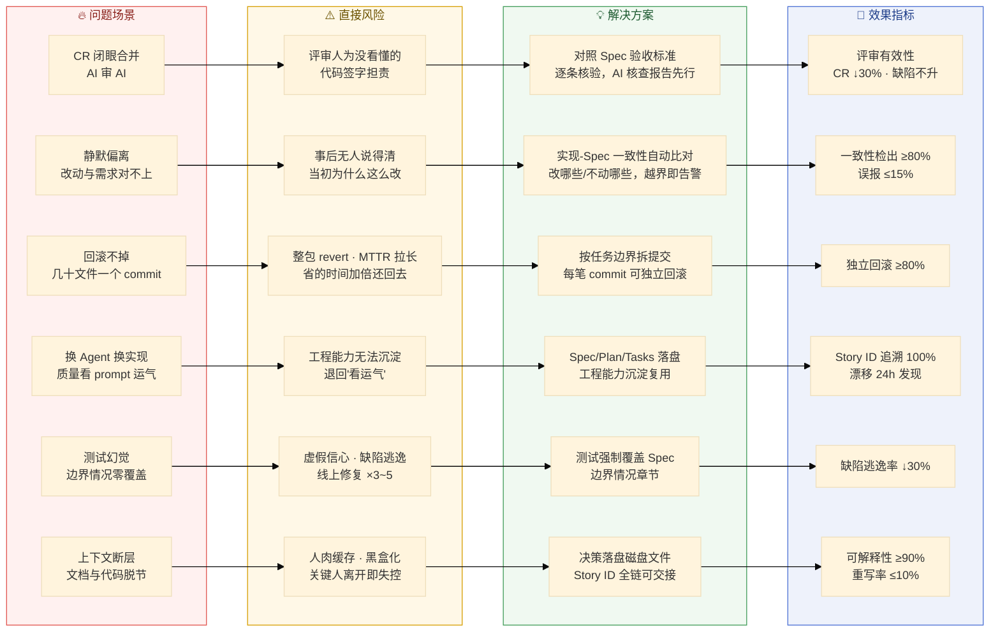
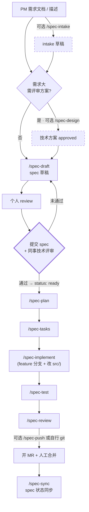

# Spec-Driven AI Collaborative Workspace

你的团队的 **Spec 驱动 AI 协作开发工作空间**。

一句话理念：**我们不写"AI 自由发挥"的代码——每个改动都从一份 Spec 开始，经 Plan、Tasks 三件套沉淀，由「人审 + AI 执行 + 人合并」。**

📋 **全队 Spec 索引 / 当前迭代需求一览** → 团队 Wiki：<TEAM-WIKI-URL>（含每个 spec 的版本号、Status、Owner、Spec/Plan/Tasks 链接）

---

## 一、这是什么（30 秒了解）

传统「vibe coding」让 AI 直接写代码，问题有：改动范围漂移、文档与代码脱节、难追溯（六大典型困境见下节全景）。本工作空间把开发流程切成标准阶段，**每个阶段产出一份磁盘文件**，让需求、方案、计划、执行全程可读、可审、可交接、可追溯。

本仓库只管理「协作元数据」（Spec / Plan / Tasks / 规则 / 技能 / 命令 / 文档），**不存放业务代码**——业务代码由各人按需 clone 到 `src/`（已 gitignore）。

想深入了解设计理念，见 [`docs/01-overview.md`](./docs/01-overview.md)。

---

## 二、为什么需要它：六大真实困境

当团队的 AI 编码覆盖率接近 100%，问题的重心就从「写不快」变成「管不住」。以下六个场景，是 AI 规模化落地后每天都在真实发生的困境：

**场景 1 · CR 环节：看不完、看不懂，最后闭眼合并。** AI 一口气吐出横跨十几个文件的千行 diff，评审人要么"能跑就过"，要么让 AI review AI，人只点一下通过。**风险**："AI 审 AI"等于没人审，评审人却要为没看懂的代码签字担责。

**场景 2 · 执行过程：顺手改、静默偏、上下文全丢。** AI 会"好心"重构相邻代码、引入新依赖、动了明确"不要动"的模块且不声明，光靠规则约束和人工抽查兜不住。**风险**：改动范围漂移失控，实际改动和需求对不上，事后无人说得清"当初为什么这么改"。

**场景 3 · 出事之后：定位不了，也回滚不掉。** git blame 指向一次大而全的 AI 提交，几十个文件混在一个 commit；回滚只能整包 revert，好的也一起撤掉。**风险**：MTTR 拉长，AI 提效省下的时间，在出事那晚加倍还了回去。

**场景 4 · 同一需求，换个 Agent 就换一套实现。** 不同人/不同 Agent（甚至同人隔天重跑）产出的架构、质量、风格天差地别。**风险**：质量取决于"谁的 prompt 写得好"，工程能力无法沉淀复制——团队从"工程化"退回"看运气"。

**场景 5 · 测试幻觉：自测全绿，只测了 happy path。** AI 自己写测试自己跑，全绿，但 spec 里列的十几条边界情况一条没碰。**风险**：覆盖率报表给人虚假信心，缺陷逃逸到测试/线上才暴露——既当运动员又当裁判。

**场景 6 · 上下文断层：换个人、隔个周末，就接不上了。** 决策上下文只存在于当时的对话窗口里，接手的人要从零理解；文档与代码持续脱节。**风险**：人成了"人肉缓存"，关键人一离开，AI 模块立即变成无人敢动的黑盒。

我们的答案不是限制 AI 的产出量，而是**把开发流程切成标准阶段，每个阶段产出一份磁盘文件**。下面这张全景图，把六个困境逐一映射到本工作空间的解法与效果目标——每个解法都会在后续章节（核心理念 / 标准工作流 / 十铁律）落成具体的文件与命令：

### 全景图：困境 → 风险 → 解法 → 效果指标



---

## 三、核心理念（记住这 4 点）

1. **Spec 是单一事实来源** —— 需求不留在 IM、邮件或脑子里，必须落到 spec 文件。
2. **三件套必须落盘** —— Spec（做什么）/ Plan（怎么做）/ Tasks（步步执行）都要有磁盘文件，不允许只在对话里存在。
3. **执行权 ≠ 定义权** —— AI 只执行，不能改 Spec；要改只能在 tasks「偏离记录」里提建议，由人决策。
4. **全程靠 Story ID 串联** —— 从 spec 到 commit 到 MR 都带 Story ID；分支命名跨仓库统一为 `{feature|hotfix}/<spec-name>`。

---

## 四、标准工作流

`(Intake) → (Design) → Draft → 个人 review → 提交 + 同事评审 → Plan → Tasks → Implement → Test → Review → (Push) → 合并 → Sync`



关键卡口：spec 写完后，**先提交文档、再由其他技术同事评审通过**，才能进入 plan/tasks/实现。个人 review 不能代替同事评审。

### 命令清单（10 个工作流命令，其中 3 个可选）

| 阶段 | 命令 | 输入 | 输出 |
|------|------|------|------|
| 0 前置（可选） | `/spec-intake` | PM 需求文档路径 或 对话描述 | `intake/<VERSION>/<STORYID>-<slug>.md`（原始需求草稿） |
| 0 前（可选） | `/spec-design` | intake 或描述（需求大/复杂时） | `designs/<VERSION>/<STORYID>-<slug>-design.md`（draft → approved） |
| 0 | `/spec-draft` | intake 或描述（+ 可选 design） | `specs/<VERSION>/<STORYID>-<slug>.md`（status: draft） |
| 1 | （个人 review + 同事评审） | spec draft | status 改 `ready` |
| 2 | `/spec-plan` | spec 路径 | `plans/<VERSION>/<STORYID>-<slug>-plan.md` |
| 2.5 | `/spec-tasks` | spec + plan | `tasks/<VERSION>/<STORYID>-<slug>-tasks.md` |
| 3 | `/spec-implement` | spec 路径 | feature 分支 + `src/` 改动 + tasks 实时勾选 |
| 4 | `/spec-test` | spec 路径 | `tests/` 测试文件 |
| 5 | `/spec-review` | spec 路径 | review 报告（含变更摘要） |
| 6（可选） | `/spec-push` | spec 路径 | commit + 安全 rebase + `git push -f` + 提示开 MR（也可自行 git 提交） |
| 6 后 | `/spec-sync` | spec 路径或 `all` | spec 状态 + 三件套一致性同步 |

**3 个可选命令**：`/spec-intake`（视习惯把 PM 需求/零散描述结构化成 intake）、`/spec-design`（仅需求大、需先评审方案时用）、`/spec-push`（视个人代码提交习惯，也可自行 `git` 提交）。小需求可直接从 `/spec-draft` 起步。`change-summary` 不是独立命令，由 `/spec-review` 与 `/spec-push` 内部自动调用。

此外还有一个**带外工具** `/spec-index`：扫描 `specs/` 生成索引并同步到 团队 Wiki。它**不属于个人开发流程**，由专人/工具按需运行。

---

## 五、三件套与十铁律速记

**三件套**：Spec（要做什么）→ Plan（怎么做）→ Tasks（步步执行），各有磁盘文件，模板见各 `*/templates/` 目录。需求较大时，可在 Spec 前先出**技术方案**（`designs/`）再起草 spec。

**十铁律**：无 spec 不写代码 · 三件套落盘 · AI 不改 spec · MR 带 Story ID · 变更摘要必写 · tasks 实时勾 · 偏离必记录 · 分支统一 · push 前 rebase · commit 规范。

完整规则见 [`rules/`](./rules/)，详细工作流见 [`rules/10-spec-workflow.md`](./rules/10-spec-workflow.md)。

---

## 六、目录速览

| 目录 | 职责 | 入仓 |
|------|------|------|
| `specs/` | 需求规格文档（单一事实来源） | ✅ |
| `designs/` | 技术方案文档（可选前置，需求大时用） | ✅ |
| `plans/` | 实施计划（每个 spec 对应一份） | ✅ |
| `tasks/` | 任务清单（实施中的可勾选活文档） | ✅ |
| `intake/` | 原始需求草稿区（**不是** spec） | ✅ |
| `rules/` | AI 协作规则（5 个 rule 文件，10 条铁律） | ✅ |
| `skills/` | AI 可复用技能（8 个 SKILL） | ✅ |
| `commands/` | 协作命令（10 个 `/spec-*` 入口） | ✅ |
| `tests/` | 测试代码（与 spec 验收标准对齐） | ✅ |
| `docs/` | 方法论文档矩阵（README + 01~07）、git 工作流、反馈问卷 | ✅ |
| `.gitlab/` | MR 模板（Git 平台） | ✅ |
| `.codebuddy/` | CodeBuddy IDE 协作配置（commands/rules 软链） | ✅ |
| `src/` | 业务代码仓库（按 spec 涉及范围自行 clone） | ❌ gitignore |
| `bin/` `pkg/` | 本地工具二进制 / Go module 缓存 | ❌ gitignore |

📂 **版本目录层级**：`intake/`、`designs/`、`specs/`、`plans/`、`tasks/` 下的文档均按迭代版本归档到 `<VERSION>/` 子目录（如 `v1.6.0/`）；各目录的 `templates/`、`README.md` 为跨版本元文件，保留在目录根。

🌐 **Spec 索引发布到 团队 Wiki**：仓库内不再维护聚合的 `specs/INDEX.md`（避免 MR 冲突），由带外命令 `/spec-index` 按需覆盖发布到团队 Wiki（<TEAM-WIKI-URL>）。

---

## 七、首次使用（约 20 分钟）

**Step 1 — 拉本仓库**

```bash
git clone <GIT-HOST>:<ORG>/CoSpec.git spec
cd spec
```

> CodeBuddy / Claude Code 用户：在 IDE 中 `File → Open Folder` 选择该目录即可。

**Step 2 — 按需把业务代码仓库 clone 到 `src/<repo>/`**（`src/` 已 gitignore）

```bash
mkdir -p src && cd src
git clone <GIT-HOST>:<ORG>/<业务主仓库>.git   # 业务主仓库（基线 develop）
git clone <GIT-HOST>:<ORG>/<协议仓库>.git   # proto 定义仓库（基线 master）
# 其他仓库按当前 spec 的 plan「涉及仓库」表按需 clone
```

仓库地址与基线分支详见 [`docs/git-workflow.md`](./docs/git-workflow.md)。

**Step 3 — 阅读入口文档**（见下表）

---

## 八、文档导航

| 顺序 | 文件 | 用途 | 时间 |
|------|------|------|------|
| 1 | `README.md` | 你正在读——项目门面与全局视图 | — |
| 2 | [`docs/README.md`](./docs/README.md) | **文档总入口**——7 篇方法论文档矩阵（全景 → 案例） | 2 分钟 |
| 3 | [`docs/01-overview.md`](./docs/01-overview.md) | 全景总览——是什么、为什么、四理念、十铁律 | 10 分钟 |
| 4 | [`docs/04-how-to-use.md`](./docs/04-how-to-use.md) | 使用手册——三种规模场景 + FAQ + 常见错误自救 | 20 分钟 |
| — | [`docs/git-workflow.md`](./docs/git-workflow.md) | Git 操作手册（基线分支 / commit / 安全 rebase / 多仓库） | 按需 |

---

## 九、推广路径

1. **第 1 周**：Tech Lead + 1 位志愿者用一个真实小需求跑完整命令链路，全员旁观
2. **第 2-3 周**：每个新 Spec 必须三件套；老 Spec 不强制回填；MR 必须用 `.gitlab/merge_request_templates/Default.md`
3. **第 4 周后**：CI 加卡口（MR 必须含 `--story=` commit、关联 spec/plan/tasks 文件）
4. **3 个月后**：复盘《Spec Coding 手册 v2》，沉淀团队特化经验

---

## 十、反馈与改进

本仓库是**活文档**，欢迎提 MR 改进规则、模板、文档。改 `rules/` 与 `commands/` 时，请同步 review `docs/` 下的方法论文档矩阵（README + 01~07）是否仍然一致。
