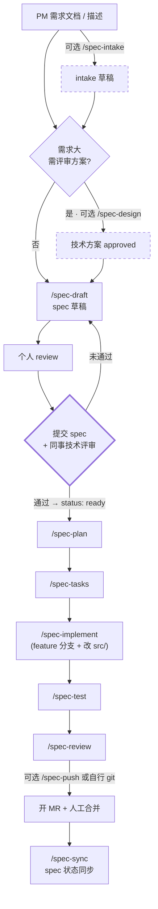

# Spec-Driven AI Collaborative Workspace

你的团队的 **Spec 驱动 AI 协作开发工作空间**。

> 一句话理念：**我们不写"AI 自由发挥"的代码——每个改动都从一份 Spec 开始，经 Plan、Tasks 三件套沉淀，由「人审 + AI 执行 + 人合并」。**

> 📋 **全队 Spec 索引 / 当前迭代需求一览** → 团队 Wiki：<TEAM-WIKI-URL>（含每个 spec 的版本号、Status、Owner、Spec/Plan/Tasks 链接）

---

## 一、这是什么（30 秒了解）

传统「vibe coding」让 AI 直接写代码，问题是：不同人/不同 Agent 结果差异大、改动范围漂移、文档与代码脱节、改动难追溯。

本工作空间把开发流程切成标准阶段，**每个阶段产出一份磁盘文件**，让需求、方案、计划、执行全程可读、可审、可交接、可追溯。

> 本仓库只管理「协作元数据」（Spec / Plan / Tasks / 规则 / 技能 / 命令 / 文档），**不存放业务代码**——业务代码由各人按需 clone 到 `src/`（已 gitignore）。

---

## 二、核心理念（记住这 4 点）

1. **Spec 是单一事实来源** —— 需求不留在 IM、邮件或脑子里，必须落到 spec 文件。
2. **三件套必须落盘** —— Spec（做什么）/ Plan（怎么做）/ Tasks（步步执行）都要有磁盘文件，不允许只在对话里存在。
3. **执行权 ≠ 定义权** —— AI 只执行，不能改 Spec；要改只能在 tasks「偏离记录」里提建议，由人决策。
4. **全程靠 Story ID 串联** —— 从 spec 到 commit 到 MR 都带 Story ID；分支命名跨仓库统一为 `{feature|hotfix}/<spec-name>`。

---

## 三、标准工作流

`(Intake) → (Design) → Draft → 个人 review → 提交 + 同事评审 → Plan → Tasks → Implement → Test → Review → (Push) → 合并 → Sync`



> 关键卡口：spec 写完后，**先提交文档、再由其他技术同事评审通过**，才能进入 plan/tasks/实现。个人 review 不能代替同事评审。

### 命令清单（10 个工作流命令，其中 3 个可选）

> 此外还有一个**带外工具** `/spec-index`：扫描 `specs/` 生成索引并完整覆盖同步到 团队 Wiki（<TEAM-WIKI-URL>）。它**不属于个人开发流程**，由专人/工具按需运行，避免大家在自己分支上各自重生导致 团队 Wiki 反复被半成品覆盖。

| 阶段 | 命令 | 输入 | 输出 |
|------|------|------|------|
| 0 前置（可选） | `/spec-intake` | PM 需求文档路径 或 对话描述 | `docs/intake/<VERSION>/<STORYID>-<slug>.md`（原始需求草稿） |
| 0 前（可选） | `/spec-design` | intake 或描述（需求大/复杂时） | `designs/<VERSION>/<STORYID>-<slug>-design.md`（draft → approved） |
| 0 | `/spec-draft` | intake 或描述（+ 可选 design） | `specs/<VERSION>/<STORYID>-<slug>.md`（status: draft） |
| 1 | （个人 review + 同事评审） | spec draft | status 改 `ready` |
| 2 | `/spec-plan` | spec 路径 | `plans/<VERSION>/<STORYID>-<slug>-plan.md` |
| 2.5 | `/spec-tasks` | spec + plan | `tasks/<VERSION>/<STORYID>-<slug>-tasks.md` |
| 3 | `/spec-implement` | spec 路径 | feature 分支 + `src/` 改动 + tasks 实时勾选 |
| 4 | `/spec-test` | spec 路径 | `tests/` 测试文件 |
| 5 | `/spec-review` | spec 路径 | review 报告（含变更摘要） |
| 6（可选） | `/spec-push` | spec 路径 | commit + 安全 rebase + `git push -f` + 提示开 MR（也可自行 git 提交） |
| 6 后 | `/spec-sync` | spec 路径或 `all` | spec 状态 + 三件套一致性同步 |

> **3 个可选命令**：`/spec-intake`（视习惯把 PM 需求/零散描述结构化成 intake）、`/spec-design`（仅需求大、需先评审方案时用）、`/spec-push`（视个人代码提交习惯，也可自行 `git` 提交）。小需求可直接从 `/spec-draft` 起步。`change-summary` 不是独立命令，由 `/spec-review` 与 `/spec-push` 内部自动调用。

---

## 四、三件套产物

| 类型 | 目录 | 回答的问题 | 模板 |
|------|------|-----------|------|
| **Spec** | `specs/` | 要做什么 | `specs/templates/spec-template.md` |
| **Plan** | `plans/` | 怎么做、涉及哪些仓库 | `plans/templates/plan-template.md` |
| **Tasks** | `tasks/` | 分几步、做到哪了 | `tasks/templates/tasks-template.md` |

> 需求较大时，可在 Spec 之前先产出**技术方案**（`designs/`，评审通过后再起草 spec）。它是可选前置产物，不属于必备三件套。

---

## 五、关键原则（10 条铁律摘要）

1. 没有 Spec，不写代码
2. Plan 与 Tasks 必须沉淀为磁盘文件
3. 执行权 ≠ 定义权（AI 不能改 Spec，只能在 tasks「偏离记录」提建议）
4. MR 必须可追溯到 Story ID
5. 变更摘要不可省略（即使 1 行 bugfix）
6. Tasks 实时勾选，不允许批量补
7. 偏离必须记录（沉默偏离视为缺陷）
8. 分支命名严格统一：`{feature|hotfix}/<spec-name>`，多仓库一致
9. Push 前必须安全 rebase（基线 `git pull -r` → feature `git rebase 基线` → `git push -f`）
10. Commit Message 严格规范：`<type>(<scope>): <subject> --story=<STORYID> [#finish]`

完整规则见 [`rules/`](./rules/)，详细工作流见 [`rules/10-spec-workflow.md`](./rules/10-spec-workflow.md)。

---

## 六、目录速览

| 目录 | 职责 | 入仓 |
|------|------|------|
| `specs/` | 需求规格文档（单一事实来源） | ✅ |
| `designs/` | 技术方案文档（可选前置，需求大时用） | ✅ |
| `plans/` | 实施计划（每个 spec 对应一份） | ✅ |
| `tasks/` | 任务清单（实施中的可勾选活文档） | ✅ |
| `rules/` | AI 协作规则（5 个 rule 文件，10 条铁律） | ✅ |
| `skills/` | AI 可复用技能（8 个 SKILL） | ✅ |
| `commands/` | 协作命令（10 个 `/spec-*` 入口） | ✅ |
| `tests/` | 测试代码（与 spec 验收标准对齐） | ✅ |
| `docs/` | 团队手册 / 流程概要 / git 工作流 / onboarding | ✅ |
| `docs/intake/` | 原始需求草稿区（**不是** spec） | ✅ |
| `.gitlab/` | MR 模板（Git 平台（GitHub / GitLab / 工蜂）） | ✅ |
| `.codebuddy/` | CodeBuddy IDE 协作配置（commands/rules 软链） | ✅ |
| `src/` | 业务代码仓库（按 spec 涉及范围自行 clone） | ❌ gitignore |
| `bin/` | 本地工具二进制（如 gopls） | ❌ gitignore |
| `pkg/` | Go module 缓存 | ❌ gitignore |

> 📂 **版本目录层级**：`docs/intake/`、`designs/`、`specs/`、`plans/`、`tasks/` 下的文档均按迭代版本归档到 `<VERSION>/` 子目录（如 `v1.6.0/`）；各目录的 `templates/`、`README.md` 为跨版本元文件，保留在目录根。
>
> 🌐 **Spec 索引发布到 团队 Wiki**：仓库内不再维护聚合的 `specs/INDEX.md`（避免 MR 冲突）。索引以 团队 Wiki 文档为单一发布出口（<TEAM-WIKI-URL>），由专人/工具按需运行带外命令 `/spec-index` 完整覆盖发布，**不在个人开发流程中执行**。

---

## 七、首次使用（约 20 分钟）

**Step 1 — 拉本仓库**

```bash
git clone <GIT-HOST>:<ORG>/CoSpec.git spec
cd spec
```

> CodeBuddy / Claude Code 用户：在 IDE 中 `File → Open Folder` 选择该目录即可。

**Step 2 — 按需把业务代码仓库 clone 到 `src/<repo>/`**（`src/` 已 gitignore，本仓库不存放业务代码）

```bash
mkdir -p src && cd src
git clone <GIT-HOST>:<ORG>/<业务主仓库>.git   # 业务主仓库（基线 develop）
git clone <GIT-HOST>:<ORG>/<协议仓库>.git   # proto 定义仓库（基线 master）
# 其他仓库按当前 spec 的 plan「涉及仓库」表按需 clone
```

仓库地址与基线分支详见 [`docs/git-workflow.md`](./docs/git-workflow.md)。

**Step 3 — 阅读入口文档**（见下表）

---

## 八、文档导航

| 顺序 | 文件 | 用途 | 时间 |
|------|------|------|------|
| 1 | `README.md` | 你正在读——项目门面与全局视图 | — |
| 2 | [`docs/spec-flow-overview.md`](./docs/spec-flow-overview.md) | 流程概要（流程图 + 每步关注点 + 规范），一眼看清怎么跑 | 5 分钟 |
| 3 | [`docs/spec-coding-handbook.md`](./docs/spec-coding-handbook.md) | 团队手册（一页纸，10 条铁律 + 全景图） | 5 分钟 |
| 4 | [`docs/onboarding-codebuddy.md`](./docs/onboarding-codebuddy.md) | 新人完整手册（端到端实操 + IDE 操作 + 常见错误自救） | 30 分钟 |
| — | [`docs/git-workflow.md`](./docs/git-workflow.md) | Git 操作手册（基线分支 / commit / 安全 rebase / 多仓库） | 按需 |

---

## 九、推广路径

1. **第 1 周**：Tech Lead + 1 位志愿者用一个真实小需求跑完整命令链路，全员旁观
2. **第 2-3 周**：每个新 Spec 必须三件套；老 Spec 不强制回填；MR 必须用 `.gitlab/merge_request_templates/Default.md`
3. **第 4 周后**：CI 加卡口（MR 必须含 `--story=` commit、关联 spec/plan/tasks 文件）
4. **3 个月后**：复盘《Spec Coding 手册 v2》，沉淀团队特化经验

---

## 十、反馈与改进

本仓库是**活文档**，欢迎提 MR 改进规则、模板、文档。改 `rules/` 与 `commands/` 时，请同步 review `docs/` 下的 handbook、flow-overview、onboarding 是否仍然一致。
