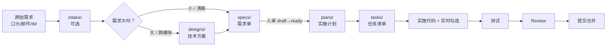

# 01｜Spec 驱动 AI 协作开发 · 全景总览

📖 **本篇定位**：**通用版**——不绑定任何具体业务、任何具体语言、任何具体 Git 平台。

🎯 **一句话**：**不写"AI 自由发挥"的代码——每个改动都从一份 Spec 开始，走过 Plan、Tasks 三件套，由"人审 + AI 执行 + 人合并"完成。**

🧭 **本系列**：01 总览 · [02 工作流](./02-workflow.md) · [03 原理与思想](./03-principles.md) · [04 使用手册](./04-how-to-use.md) · [05 目录与文件契约](./05-architecture.md) · [06 落地你自己的项目](./06-adaptation.md)

---

## 1.这是什么

### 1.1 一句话定位

**Spec 驱动 AI 协作开发（Spec-Driven AI Collaboration，本文档统一称为 CoSpec 范式）** 是一套面向"人 + AI"协作编写生产级代码的工作方式，核心是：

**需求先落成磁盘文件，再让 AI 按文件执行；AI 全程只有执行权，没有定义权。**

它既不是一门工具、也不是一个框架，而是一整套**约定**：

- **文件契约**：需求 / 实施计划 / 任务清单三份文件的固定位置与格式
- **命令契约**：从需求到合并的 8 个阶段各自触发一条命令
- **AI 行为契约**：AI 遇到不清楚的地方必须问、遇到偏离必须记录、不能改需求文件
- **人工卡口**：某些关键节点必须由人评审通过才能推进

### 1.2 与"vibe coding"的对比

所谓"vibe coding"——凭感觉让 AI 一边聊天一边写代码——的四个硬伤：

| 硬伤             | 表现                                                       |
| ---------------- | ---------------------------------------------------------- |
| 结果不可复现     | 同一个需求，不同人 / 不同时间 / 不同 Agent 问，产出差异极大 |
| 改动范围漂移     | 让 AI"改个小 bug"，AI 顺手重构了三个文件                    |
| 文档与代码脱节   | 代码合并了，需求文档还是三个月前的旧版本                    |
| 改动难追溯       | 半年后看 MR，说不清当初为什么这么改                        |

**根源**：需求只存在于人的脑子里和 AI 的对话上下文里——两者都会丢、会换、会遗忘。

**CoSpec 的解法**：把需求 → 计划 → 任务全部沉淀成磁盘文件，用命令链切分成 8 段流程，每段的产物必须落盘、必须过人审卡口。

---

## 2.三件套说明

### 2.1 核心骨架主干

**三件套**是 CoSpec 的骨架，回答的问题各不相同：

| 类型      | 目录        | 回答什么       | 谁负责主导                     |
| --------- | ----------- | -------------- | ------------------------------ |
| **Spec**  | `specs/`    | 要做什么       | 人（产品/架构师），AI 起草辅助 |
| **Plan**  | `plans/`    | 怎么做、改哪些文件 | AI 起草 + 人审               |
| **Tasks** | `tasks/`    | 分几步、做到哪了 | AI 起草 + 实施时 AI 实时勾选  |

**三件套必须落盘**——这是 CoSpec 的第一铁律。为什么？

1.AI 的对话上下文有窗口限制，会随着对话变长而遗忘早期信息；2.同一个 spec 可能跨会话推进，可能换人接手，可能停几天后再回来；3.只有磁盘文件能跨"会话 / 时间 / 人"这三个边界持续存在。

### 2.2 可选扩展

除了三件套主干，还有两个**可选前置产物**：

| 类型            | 目录            | 何时用                                | 回答什么                        |
| --------------- | --------------- | ------------------------------------- | ------------------------------- |
| **Intake**（原始需求录入） | `intake/` | 需求来自会议 / 邮件 / IM，先原文归档 | 原始需求原话是什么             |
| **Design**（技术方案）    | `designs/`     | 需求大、跨多模块、需评审方案时       | 用什么方案、拆几个 spec         |

**Design 与 Plan 的边界**（最易混淆的一对）：**Design 决定"用什么方案、拆几个 spec"；Plan 决定"改哪些文件、按什么步骤"。** Design 出现在 spec **之前**（方案级、可选）；Plan 出现在 spec ready **之后**（执行级、复杂改动必须）。

### 2.3 全景数据流



---

## 3.四条核心理念

### 3.1 Spec 是单一事实来源

需求不留在 IM / 邮件 / 脑子里——一律沉淀到 `specs/*.md`。任何时候有人问"这个功能到底要做什么"，答案永远指向 spec 文件。

**推论**：spec 与代码不一致时，**改哪个由 spec 状态决定**：
- `draft/ready` → 改代码方向，因为需求还没定稿；
- `implemented` → spec 才是权威，代码要么修 bug 要么走"偏离回流"更新 spec。

### 3.2 三件套必须落盘

对话是易失的，磁盘是持久的。**三件套不允许只在对话里存在**——即使是最小的需求，也要落成文件。

**心理门槛**：一开始会觉得"这么点事写 spec 有点重"，但**替换成本比想象低得多**——用模板 + AI 起草，一份 spec 通常几分钟就出得来。

### 3.3 执行权 ≠ 定义权

**AI 只有执行权，没有定义权**——这是 CoSpec 最反直觉、也最重要的规则：

| 权限         | 谁有                                        |
| ------------ | ------------------------------------------- |
| 定义需求     | 人（产品 / 业务）                            |
| 定义验收标准 | 人（产品 / 架构师）                          |
| 定义技术方案 | 人主导，AI 提供备选方案供选                  |
| 起草文档     | AI 可以起草，但内容需人审                    |
| 编写代码     | AI 主力，人 review                          |
| 修改 spec    | **只有人**——AI 如有意见只能在 tasks 记录建议 |

**为什么如此严格**：因为一旦 AI 有权改 spec，"改动漂移"就无法遏制——AI 每次执行都能顺手改需求让代码"符合 spec"，等于回到 vibe coding。

### 3.4 全程用需求编号（Story ID）串联

从 `intake → design → spec → plan → tasks → branch → commit → MR` 全程用同一个 Story ID：

```txt
Story ID = 12345（例如）

intake/v1.0/12345-user-login.md
designs/v1.0/12345-user-login-design.md
specs/v1.0/12345-user-login.md
plans/v1.0/12345-user-login-plan.md
tasks/v1.0/12345-user-login-tasks.md
feature/12345-user-login  ← Git 分支
feat(login): add oauth flow --story=12345 [#finish]  ← commit 尾注
```

**收益**：半年后翻 MR，看到 `--story=12345` 就能一键回溯到当初的需求、方案、计划、任务全景。

---

## 四、十铁律

从四条理念展开成十条可执行的强制约束（AI 在每一步都要遵守）：

1. **无 Spec 不写代码** —— 任何代码改动前必须先有 spec（哪怕 5 行的 spec）
2. **三件套必须落盘** —— spec / plan / tasks 三个磁盘文件缺一不可（简单需求可合成一份，但不能只在对话里）
3. **AI 不改 spec** —— AI 只能建议不能直接改 spec 文件
4. **MR 带 Story ID** —— 每一笔 MR / PR 的标题或描述必须含 Story ID
5. **变更摘要必写** —— MR 描述必须包含"改了什么、为什么改、影响哪些模块"
6. **Tasks 实时勾选** —— 每完成一小步立刻更新 tasks 文件的 checkbox
7. **偏离必记录** —— 实际实现与 spec / plan 有任何偏离，必须在 tasks 的"偏离记录"章节写明
8. **分支统一** —— 跨仓库同名分支：`{feature|hotfix}/<STORYID>-<slug>`
9. **Push 前 rebase** —— 保持线性历史，避免混乱的 merge commit
10. **Commit 规范** —— 统一格式 `<type>(<scope>): <subject> --story=<ID> [#finish]`

**十铁律的作用**：把"AI 可能踩的坑"提前用规则封死。AI 在起草 / 实施 / 提交时，每一步都要过一次十铁律检查。

---

## 五、CoSpec 与传统工作流的对比

| 维度            | 直接 vibe coding                | 传统 spec 驱动开发           | CoSpec 范式                             |
| --------------- | ------------------------------- | --------------------------- | --------------------------------------- |
| 需求在哪里      | 对话里，关掉就没                | 需求管理系统（Jira/Trello） | **仓库内 markdown 文件**                |
| 谁定需求        | AI 边写边猜                     | 产品 / BA                    | 人写 spec，AI 只能提建议                 |
| 改动范围可控性  | 取决于 AI 心情                  | 依赖开发者自律              | **Plan 列明文件清单，超出即偏离**       |
| 进度追踪        | "差不多做完了"                  | Jira 状态                   | **Tasks 文件实时勾选，可 diff**         |
| 换人接手成本    | 基本要重做                      | 中等（要读 Jira + 代码）     | **读三件套即可，磁盘上什么都有**        |
| 与代码的关系    | 无正式关联                      | 靠 Story ID 松散关联         | **Story ID 全程强制串联，可机器校验**   |
| AI 参与深度     | 主导                            | 无                          | **辅助生成 + 严格约束**                 |

### 代价

**唯一的代价是：多了文档工作量。**

CoSpec 的对策：

- 提供模板 → AI 一键起草
- 提供命令 → 减少手工步骤
- 分级使用 → 小需求可直接从 `/spec-draft` 起，intake / design / push 都是可选

**实际执行体感**：一个中等规模需求，全流程增加 15-30 分钟；对应换来的收益是"半年后仍能一秒回溯 + 换人接手无痛"。

---

## 六、命令清单（8 阶段命令链）

完整命令链：`intake → design → draft → 评审 → plan → tasks → implement → test → review → push → sync`，共 10 个命令（其中 3 个可选），唯一强制卡口是「人工评审」。逐命令的输入 / 输出 / AI 行为详解见 [02-workflow.md](./02-workflow.md)。

---

## 七、状态机

一个 spec 从诞生到归档的完整状态：

```mermaid
stateDiagram-v2
    [*] --> draft: /spec-draft
    draft --> ready: 人工评审通过
    draft --> deprecated: 需求撤回
    ready --> in-progress: /spec-plan → /spec-tasks → /spec-implement
    in-progress --> implemented: 合并 + /spec-sync
    in-progress --> ready: 需要重新评审
    implemented --> deprecated: 后续需求覆盖
    deprecated --> [*]
```

**关键**：只有人有权推动状态迁移——AI 在实施过程中即使发现问题，也只能标 `[TBD]` 或写在偏离记录，不能改状态。

---

## 八、CoSpec 适合谁

### 8.1 强烈推荐

- **多人协作 + AI 深度参与的中大型团队**：需要严格的可追溯性和一致性
- **跨仓库 / 微服务架构**：需要统一 Story ID 串联多仓库改动
- **合规 / 审计要求高的行业**：金融、医疗、政府——需要"改动可溯源到需求"
- **知识型工作、需求变化快**：需要低成本的换人 / 换会话切换

### 8.2 一般收益（可裁剪使用）

- **小团队 + 小项目**：可以只用 `/spec-draft`，跳过 design / intake / push
- **纯个人项目**：三件套简化成"一份 spec 顶所有"
- **一次性脚本 / 探索型代码**：可以不走 spec，标注"实验代码"

### 8.3 不适用

- **纯手工 coding，完全不用 AI**：CoSpec 的价值主要在"约束 AI"，如果不用 AI，投入产出比会低
- **超短生命周期项目（一天写完扔）**：文档成本不划算

---

## 九、下一步

你现在应该：

- **想快速上手做实事** → 直接看 [04 使用手册](./04-how-to-use.md)
- **想理解全套流程** → 看 [02 工作流详解](./02-workflow.md)
- **想理解设计哲学** → 看 [03 原理与思想](./03-principles.md)
- **想把 CoSpec 用到自己的项目上** → 看 [06 落地你自己的项目](./06-adaptation.md)

---

## 十、术语速查

| 术语             | 含义                                                      |
| ---------------- | --------------------------------------------------------- |
| **CoSpec**       | 本套 Spec 驱动 AI 协作开发范式（Collaborative Spec）      |
| **Spec**         | 需求单，回答"要做什么"                                    |
| **Plan**         | 实施计划，回答"怎么做、改哪些文件"                        |
| **Tasks**        | 任务清单，回答"分几步、做到哪了"                          |
| **Design**       | 技术方案（可选前置），回答"用什么方案、拆几个 spec"      |
| **Intake**       | 原始需求录入（可选前置），保留需求原话                    |
| **Story ID**     | 需求编号，全程串联所有产物                                 |
| **slug**         | kebab-case 简短标题，同 Story 下必须唯一                  |
| **三件套**       | Spec / Plan / Tasks 的合称                                |
| **十铁律**       | 十条不可违反的强制约束                                    |
| **偏离回流**     | 实施发现 spec 需修改 → 记录到 tasks → 人审后回写 spec 的流程 |
