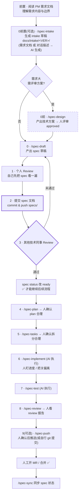

# Spec Coding 流程概要（一眼看懂版 · 给人看的）

> 本项目是「刷掌支付」团队的 **Spec 驱动 AI 协作开发工作空间**：不写"AI 自由发挥"的代码，每个改动都从一份 Spec 开始，**人审 + AI 执行 + 人合并**。
> 本文只讲 **「人」要关注什么、要遵守什么**；AI 的执行细节由 `commands/` `skills/` `rules/` 约束，不在此重复。

> 📋 **想查全队 Spec 索引 / 了解当前迭代有哪些需求？** 直接看 iWiki：<https://iwiki.woa.com/p/4022732388>（包含每个 spec 的版本、Status、Owner、Spec/Plan/Tasks 链接）。仓库内不再维护本地聚合的 INDEX 文件。

---

## 一、流程全景图（人的视角）

> 🔑 **关键卡口**：spec 写完后**必须先提交、由其他技术同事评审通过**，才能进入 plan/tasks/实现。个人 review 不能代替同事评审。

---

## 二、每一步：人要做什么 / 把关什么

| 阶段 | 人的动作 | ⚠️ 人要关注的点 |
|------|----------|------------------|
| **前置 · 理解需求** | 阅读 **PM 输出的需求文档**，搞清这次到底要做什么、边界在哪 | 边界/验收口径要先在脑子里清楚，后面所有产物都依赖它 |
| **0前置（可选）· `/spec-intake`** | 把需求文档（或简单需求直接在对话里描述）交给 AI，快速生成 `docs/intake/<VER>/` 草稿 | **生成前必须确认归属的迭代版本目录**（如 `v1.7.0`），后续 design/spec/plan/tasks 全程复用同一版本；**可选命令，视个人习惯使用**；intake 不是 spec，仅作为 `/spec-draft` 的输入，习惯直接起草的可跳过 |
| **0前**（可选） | 大需求先跑 `/spec-design`，**评审技术方案** | 仅大/复杂需求需要；方案要评审到 `approved` 才往下 |
| **0 Draft** | 跑 `/spec-draft` 生成草稿 | spec 只描述"要做什么"，不陷入实现细节 |
| **1 个人 Review** | 自己先通读 spec 草稿 | 确认需求边界、验收标准清晰；这是你自己的把关，不能跳过 |
| **2 提交 spec** | `commit` + `push` 把 spec 文档提交上去 | **先落盘提交，再发起评审**；spec 是单一事实来源，必须进仓 |
| **3 同事 Review** | 指定/邀请**其他技术同事**评审 spec | ✅ **强制卡口**：同事评审**通过后才能继续**；未通过则回到 draft 修改重提 |
| — | 评审通过后把 spec `status` 改 `ready` | `ready` 是"可进入开发"的唯一信号 |
| **4 Plan** | 跑 `/spec-plan`，确认计划合理 | 重点看「涉及仓库」表，据此 clone 业务代码到 `src/` |
| **5 Tasks** | 跑 `/spec-tasks`，确认任务拆分合理 | 任务颗粒是否清晰、可执行 |
| **6 Implement** | 跑 `/spec-implement`，盯实现进度 | 关注 AI 是否偏离 spec；有疑问及时介入，**spec 的最终解释权在人** |
| **7 Test** | 跑 `/spec-test` | 测试是否覆盖 spec 验收标准 |
| **8 Review** | 跑 `/spec-review`，阅读 review 报告 | 报告 + 变更摘要是否反映真实改动 |
| **9 Push（可选）** | 确认无误后跑 `/spec-push` 推送，或按个人习惯自行 `git` 提交 | **可选命令，视个人代码提交习惯**；无论用命令还是手动，都要遵守分支命名、commit message 规范与 push 前安全 rebase |
| **收尾** | 人工开 MR、合并；`/spec-sync` 同步状态 | MR 必须能追溯到 Story ID；合并是人的决定 |

---

## 三、人要遵守的基本规范

1. **没有 Spec，不写代码** —— 任何改动先有一份 spec。
2. **spec 必须经"个人 review + 同事评审"双重把关**，且**先提交文档再评审**；同事评审通过才进入开发。
3. **spec 的定义权在人**：spec 怎么定、改不改、何时 `ready`，由人决定，AI 只负责执行。
4. **关键节点人要把关**：plan 是否合理、tasks 是否清晰、review 报告是否真实、MR 是否可合并——这些都需要人确认，不能甩给 AI。
5. **分支命名统一**：`{feature|hotfix}/<spec-name>`，多仓库保持一致。
6. **Commit Message 规范**：`<type>(<scope>): <subject> --story=<STORYID> [#finish]`（`#finish` 仅 Story 最后一笔加）。
7. **MR 必须可追溯到 Story ID**，并使用团队 MR 模板；**合并由人做最终决定**。
8. **版本归档**：intake / designs / specs / plans / tasks 五类产物按迭代版本放到 `<VERSION>/` 子目录（如 `v1.6.0/`）。

---

## 四、新人最快上手

1. clone 本仓库并用 IDE 打开；按当前 spec 的 plan「涉及仓库」表把业务代码 clone 到 `src/<repo>/`（`src/` 不入仓）。
2. 打开 iWiki Spec 索引 <https://iwiki.woa.com/p/4022732388>，扫一眼当前迭代有哪些 spec、谁在做、状态如何。
3. 读 [`docs/spec-coding-handbook.md`](./spec-coding-handbook.md)（一页纸，5 分钟）。
4. 跟着上面的流程图走：**起草 → 个人 review → 提交 spec → 等同事评审通过 → 再往下**。
