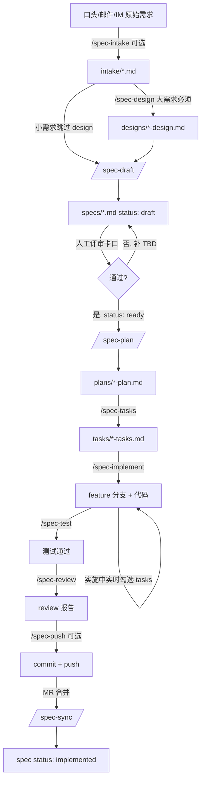

# 02｜工作流程详解

> 📖 **本篇定位**：把 CoSpec 的 8 阶段命令链一段一段拆开讲——每段的输入、输出、AI 行为、人工卡口、可跳过条件、常见误区。
> 🔗 **上一篇**：[01 全景总览](./01-overview.md) · **下一篇**：[03 原理与思想](./03-principles.md)

---

## 一、工作流全景图



**核心结构**：**8 个阶段 + 1 个强制人工卡口**（阶段 1，spec 评审）+ 若干可选阶段。

---

## 二、阶段 -1：需求录入（`/spec-intake`）· 可选

### 何时用

- 需求来自会议 / 邮件 / IM，需要保留原话作为审计凭据
- 需求较模糊，先原样落盘让人有时间消化
- **可跳过条件**：需求本身已足够清晰，可直接进 `/spec-draft`

### AI 行为

1. 复述原始需求，确认理解无误
2. 补充上下文（来源 / 提出人 / 时间 / 相关链接）
3. 写入 `intake/<VERSION>/<STORYID>-<slug>.md`
4. Frontmatter 保留 Story ID、日期、原文出处

### 产物

```markdown
---
Story ID: 12345
Received: 2026-01-15
Source: 张三@产品部（IM）
Version: v1.0.0
---

# 用户登录支持第三方 OAuth

## 原始需求（保留原话）
> 我们最近...（略）

## 相关背景
- 现有登录流程见 XXX
- 相关竞品 YYY 的做法是...

## 待澄清点
- OAuth 支持几家？（Google/GitHub/OIDC 提供商...）
- 是否影响现有账号体系？
```

### 常见误区

- ❌ 在 intake 里就开始设计方案 → 应保持"原始记录"性质
- ❌ 跳过 Story ID 用 `TBD` → 必须给 `0` 占位或立即分配

---

## 三、阶段 0 前：技术方案（`/spec-design`）· 大需求必须

### 何时用

**触发条件**（满足任一即建议）：

- 涉及 ≥ 2 个模块 / 仓库
- 有多种技术方案需要评审拍板
- 数据结构 / API 有重大调整
- 影响性能 / 安全 / 兼容性等关键非功能属性

### 为什么要单设这一步

> 大需求直接起草 spec 容易因技术方向未定而反复返工。先做技术方案 → 团队评审 → 敲定"用什么方案、拆几个 spec" → 再基于"需求 + 方案"起草 spec，spec 会更准确、边界更清晰。

### AI 行为（关键步骤）

1. **澄清 6 类问题（不可跳过）**：需求性质、涉及模块 / 仓库、现有实现、核心边界、非功能约束、范围
2. **调用代码侦察**（架构视角）：模块边界、调用链、跨系统交互
3. **先给 2-3 个候选方案对比**——推荐方案 + 淘汰方案的取舍分析
4. **等用户选定方案**后再落盘（严禁自作主张只给单一方案）
5. 按模板填写 design：总体方案、方案对比、关键决策、跨系统影响、**建议的 spec 拆分**、风险
6. 写入 `designs/<VERSION>/<STORYID>-<slug>-design.md`（`Status: draft`）
7. **团队评审**（架构师 / Tech Lead / 相关方）
8. 评审通过后 `Status: approved` → 进入阶段 0 起草 spec

### Design 与 Plan 的边界（关键）

| 维度            | Design（方案级）                | Plan（执行级）                    |
| --------------- | ------------------------------- | --------------------------------- |
| 时机            | spec 之前                       | spec ready 之后                   |
| 输入            | 原始需求                        | 已 ready 的 spec                  |
| 关注点          | 架构、选型、方案对比、spec 拆分 | 具体文件、Phase 步骤              |
| 颗粒度          | 方案级（怎么做、为什么）        | 执行级（改哪些文件、什么顺序）    |
| 是否必须        | 否，仅大 / 复杂需求             | 复杂改动必须                      |

**一句话**：**Design 决定"用什么方案、拆几个 spec"，Plan 决定"改哪些文件、按什么步骤"。**

### 常见误区

- ❌ 把 Design 写成 Plan（写到具体文件改动步骤）→ 越界
- ❌ 只给一个方案强推 → AI 剥夺人的选择权
- ❌ 未评审就 `Status: approved` → 跳过人工卡口

---

## 四、阶段 0：起草 Spec（`/spec-draft`）· 必须

### 触发条件

- 收到原始需求（不管有没有走 intake / design）
- 仓库中**尚无**对应 spec

### AI 行为的四大核心原则

1. **AI 是起草助手，不是业务方** —— 目标 / 验收标准的最终拍板权在人
2. **必须主动问澄清问题** —— 宁可问 5 个也不要硬填
3. **每个章节标注信息来源**：📥 原始需求 / 🤖 AI 推断 / ❓ TBD / 🔍 现有代码
4. **输出 status 一定是 `draft`** —— 不允许直接 `ready`，必须经人 review

### 执行步骤

1. **确认 Story ID**（录入点，必填）—— 用户提供 / 从 intake frontmatter 取 / 主动询问
2. **多 spec 检测** —— 扫描 `specs/` 目录，若已有同 Story ID 的 spec：
   - 新建子 spec（slug 区分）
   - 修改已有的
   - 换 Story ID
3. **读取上游资料**：intake 原文 + design（若有）
4. **代码侦察（light 模式）** —— 相关模块 / 可复用资产 / 冲突提示
5. **列出 2-5 个澄清问题，等回答**（关键，不可跳过）
6. **按模板起草**（每章节标来源）
7. 写入 `specs/<VERSION>/<STORYID>-<slug>.md`，`Status: draft`

### 澄清问题的 5 类必问

| 类别         | 示例                                                   |
| ------------ | ------------------------------------------------------ |
| 业务目标边界 | "这个功能要解决谁的什么问题？成功的衡量指标是什么？" |
| 用户角色     | "调用方是终端用户、内部服务，还是第三方？"           |
| 验收标准     | "怎样算做完了？至少需要哪几条可验证的标准？"         |
| 非功能要求   | "性能 / 安全 / 兼容性是否有特殊要求？"                |
| 范围边界     | "这一期不做哪些事？"                                   |

### Spec 模板核心章节

```markdown
> Story ID: 12345
> Status: draft | ready | in-progress | implemented | deprecated
> Author / Created / Updated
> Sibling Specs（若为子 spec）
> Branch: feature/12345-user-login

## 背景
## 目标
## 非目标
## 用户故事
## 功能需求（FR-1, FR-2, ...）
## 非功能需求
## 数据结构 / API / 接口影响
## 状态流转 / 业务流程
## 边界情况
## 验收标准（可勾选）
## 测试点
## 风险与未决问题
## 实施备注
## 修订记录
```

### 常见误区

- ❌ AI 帮"填满" `[TBD]` → 违反"不臆造"原则
- ❌ 起草前不做代码侦察 → 与 vibe coding 无异
- ❌ 直接写 `Status: ready` → 越过评审卡口

---

## 五、阶段 1：人工评审卡口

### 这是 CoSpec 唯一的强制人工卡口

**规则**：spec draft 必须由**其他技术同事**评审通过，才能改 `Status: ready`，进而进入 plan / 实现。

- **个人 review 不能代替同事评审** —— 因为自己容易看不出盲区
- 评审重点：目标是否清晰、验收标准是否可验证、边界是否明确、TBD 是否已补齐
- 评审记录写入 spec 的"修订记录"章节

### 常见误区

- ❌ 自己起草自己审 → 违反"其他同事"规则
- ❌ 评审只做形式检查（看格式）→ 应审内容质量

---

## 六、阶段 2：实施计划（`/spec-plan`）· 复杂改动必须

### 何时用

- Spec 涉及新增 / 修改 ≥ 3 个文件
- 需要拆分成多个 Phase 顺序推进
- 有复杂依赖 / 顺序约束

### 何时可跳过

- Spec 极简（改 1-2 行）→ 可直接 `/spec-implement`

### AI 行为

1. **前置校验** —— Story ID 从 spec 文件名解析，plan 沿用（不再询问）
2. **读取 spec**，完整阅读
3. **检查 spec 完整性** —— 有 `[TBD]` 则先反馈，重大缺失则停下
4. **扫描现有代码**（deep 模式）—— 识别需新增和修改的文件
5. **产出实施计划**：改动范围、Phase 步骤、依赖、风险
6. **等待用户确认** —— 根据反馈调整
7. 确认后写入 `plans/<VERSION>/<STORYID>-<slug>-plan.md`

### Plan 模板核心章节

```markdown
## 改动范围
- 新增文件：
- 修改文件：
- 删除文件：

## Phase 拆分
### Phase 1: 数据模型
- 涉及文件 X, Y
- 依赖：无

### Phase 2: API 层
- 涉及文件 Z
- 依赖：Phase 1

## 关键决策
（复用 Design 的决策，不重复讨论）

## 风险
```

### 常见误区

- ❌ 越界写代码 → Plan 只描述"改哪些、怎么改"，不写具体代码
- ❌ 与 Design 重复讨论方案 → Plan 应**复用** Design 决策

---

## 七、阶段 2.5：任务清单（`/spec-tasks`）· 复杂改动必须

### 何时用

- Plan 有 ≥ 3 个 Phase
- 需要跨会话推进（比如今天开个头，明天继续）
- 需要跨人协作

### AI 行为

1. 读 plan
2. 把每个 Phase 拆成 checkbox 任务列表
3. 每个任务应能在 15-60 分钟内完成
4. 写入 `tasks/<VERSION>/<STORYID>-<slug>-tasks.md`

### Tasks 模板核心章节

```markdown
## Phase 1: 数据模型

- [ ] 1.1 定义 User 表的新字段
- [ ] 1.2 编写 migration 脚本
- [ ] 1.3 更新 ORM 模型
- [ ] 1.4 运行 migration 并验证

## Phase 2: API 层

- [ ] 2.1 新增 /api/oauth/login 端点
- [ ] 2.2 处理回调逻辑
- [ ] 2.3 单元测试

## 偏离记录

> 实施过程中如与 spec/plan 不符，在此追加。

| 日期 | 偏离点 | 原因 | 建议 spec 修订 |
|------|--------|------|----------------|
| — | 初始 | — | — |
```

### 关键约定

- **实施中实时勾选** —— 每完成一小步立即改 `[ ]` 为 `[x]`
- **偏离必记录** —— 实际实现与 plan / spec 有任何不符，写在"偏离记录"

---

## 八、阶段 3：实施（`/spec-implement`）· 必须

### AI 行为

1. **前置校验** —— 检查 tasks 状态，找到第一个 `[ ]`
2. **切分支**：`{feature|hotfix}/<STORYID>-<slug>`，跨仓库同名
3. **按 tasks 顺序执行**，每完成一小步：
   - 更新 tasks 文件 `[ ] → [x]`
   - Commit（如果需要），格式：`<type>(<scope>): <subject> --story=<ID>`
4. **遇到偏离** → 停下问，或先记录到"偏离记录"章节
5. **不修改 spec / plan** —— 严格遵守"AI 无定义权"

### 分支命名统一（重要）

```txt
feature/12345-user-login       ← 新功能
hotfix/12345-fix-login-crash   ← 紧急修复

跨仓库使用同一分支名，便于用 `git branch --list` 统一查询
```

### Commit 规范（统一格式）

```txt
<type>(<scope>): <subject> --story=<STORYID> [#finish]
```

- **type**: `feat` / `fix` / `docs` / `refactor` / `test` / `chore`
- **scope**: 模块名
- **subject**: 一句话说清做了什么
- **--story=**: 强制带 Story ID
- **[#finish]**: **仅**加在最后一笔 commit 上（表示这个 spec 已完成）

**示例**：

```txt
feat(auth): add oauth callback handler --story=12345
test(auth): add oauth flow integration tests --story=12345
fix(auth): handle expired oauth tokens --story=12345 [#finish]
```

### 常见误区

- ❌ 一次性写完再勾选 → 应"每完成一小步就勾"
- ❌ Commit 忘带 Story ID → 强制约束
- ❌ 顺手改无关代码 → 违反"最小改动原则"

---

## 九、阶段 4：测试（`/spec-test`）· 有可测行为则必须

### AI 行为

1. 读 spec 的"测试点"和"验收标准"
2. 为每个验收标准至少写一个测试
3. 测试命名格式：`Test_[功能]_[场景]_[预期结果]`
4. 测试文件放在 `tests/`
5. 运行测试，输出结果

### 测试命名示例

```txt
Test_CreateTodo_ValidInput_ReturnsNewTodo
Test_CreateTodo_EmptyTitle_ReturnsValidationError
test_list_todos_filter_by_status_returns_filtered
```

### 无法自动化测试时

- 明确说明原因
- 提供手动测试步骤
- 在变更摘要中标注"测试缺口"

---

## 十、阶段 5：Review（`/spec-review`）· 关键改动必须

### AI 行为

1. **对照 spec 验收标准** —— 逐条检查是否达标
2. **对照 plan** —— 检查改动范围是否符合，超出即偏离
3. **代码质量检查** —— 命名、模块边界、错误处理、依赖
4. **输出 review 报告**：验收标准 checklist、发现的问题、建议

### Review 报告示例

```markdown
## Review Report — 12345-user-login

### 验收标准检查
- [x] 支持 Google OAuth 登录
- [x] 登录失败有明确提示
- [ ] 支持记住登录状态 30 天 —— 未实现，见问题 #1

### 改动范围检查
- Plan 声明改动 5 个文件，实际改动 7 个（多了 utils/logger.ts, config/oauth.ts）
- 建议在 tasks 偏离记录说明

### 代码质量
- ✅ 命名一致
- ✅ 错误处理完整
- ⚠️ src/auth/oauth.ts 与 src/auth/session.ts 有重复逻辑，建议下一 spec 重构

### 问题清单
1. 记住登录状态未实现
```

---

## 十一、阶段 6：提交合并（`/spec-push`）· 可选

### AI 行为

1. **本地校验**：
   - Tasks 全部 `[x]`
   - Spec / Plan / Tasks 已同步更新
   - 变更摘要已写
2. **Rebase 至基线**（保持线性历史）：
   ```bash
   git checkout <base>
   git pull -r
   git checkout feature/<spec-name>
   git rebase <base>
   ```
3. **Push**：`git push --force-with-lease`
4. **创建 MR / PR**，模板包含：
   - 关联 Spec 路径
   - 偏离说明（若有）
   - 变更摘要
   - Story ID

### 常见误区

- ❌ 不 rebase 直接 push → 历史混乱
- ❌ `git push --force`（不加 `--with-lease`）→ 可能覆盖他人提交

---

## 十二、阶段 7：同步（`/spec-sync`）· 必须

### 何时用

- MR / PR 已合并
- 需要把 spec 状态推到 `implemented`

### AI 行为

1. 读取 spec 当前状态
2. 检查所有验收标准是否已勾选
3. 更新 spec：
   - `Status: implemented`
   - `Updated: <今日>`
   - 追加修订记录（如有偏离）
4. 如果有"偏离记录"（tasks 里），回写到 spec 的"修订记录"章节

---

## 十三、简化版工作流（小需求专用）

对小需求，可以裁剪成最简单的三段：

```txt
/spec-draft → 人审 → /spec-implement → /spec-sync
```

跳过的：

- ❌ intake：直接口头即可
- ❌ design：需求清晰无需评审方案
- ❌ plan：spec 已足够详细
- ❌ tasks：一两步就做完
- ❌ push：走团队既有 Git 流程即可

**唯一不能省的**：spec 起草 + 人审 + status 到 `implemented`。

---

## 十四、命令速查表

| 命令               | 输入                | 输出                              | 是否必须       |
| ------------------ | ------------------- | --------------------------------- | -------------- |
| `/spec-intake`     | 口头 / IM / 邮件    | `intake/`                    | 可选           |
| `/spec-design`     | intake              | `designs/*-design.md` (approved)  | 大需求必须    |
| `/spec-draft`      | intake + design     | `specs/*.md` (draft)              | **必须**       |
| （人工评审）       | draft spec          | spec status: `ready`               | **必须**       |
| `/spec-plan`       | ready spec          | `plans/*-plan.md`                 | 复杂改动必须  |
| `/spec-tasks`      | plan                | `tasks/*-tasks.md`                | 复杂改动必须  |
| `/spec-implement`  | tasks               | 分支 + 代码                        | **必须**       |
| `/spec-test`       | 实现                | 测试 + 报告                        | 有可测行为则必须 |
| `/spec-review`     | 实现 + 测试         | review 报告                        | 关键改动必须  |
| `/spec-push`       | commits             | rebase + push + MR                 | 可选           |
| `/spec-sync`       | 合并信息            | spec status: `implemented`         | **必须**       |

---

## 十五、下一步

- 想理解每一步**背后的为什么** → 看 [03 原理与思想](./03-principles.md)
- 想**立即上手做实事** → 看 [04 使用手册](./04-how-to-use.md)
- 想理解**目录 / 文件契约的细节** → 看 [05 目录与文件契约](./05-architecture.md)
