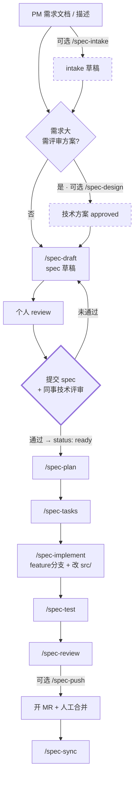

# CoSpec 项目梳理：是什么 / 背景 / 为何要用 / 怎么用

> 本文是我对 `/Users/github/YCBookBlog/code/Spec` 这个仓库的通读梳理，面向「第一次接触这个项目的人」，也作为自己的理解存档。
>
> 原仓库已有 `README.md`（门面）、`CLAUDE.md`（AI 加载入口）、`docs/`（团队手册）。本文不重复照搬，而是**用一条主线把散落在各处的规则、命令、技能串起来**，并补上通读时发现的不一致点。

---

## 一、项目是什么

### 1.1 一句话定位

**「刷掌支付」团队的 Spec 驱动 AI 协作开发工作空间。**

> 我们不写"AI 自由发挥"的代码——每个改动都从一份 Spec 开始，经 Plan、Tasks 三件套沉淀，由「人审 + AI 执行 + 人合并」。

仓库地址：`git@git.woa.com:palm/palmpay/CoSpec.git`

### 1.2 它最反直觉的一点：这个仓库不存代码

这是理解整个项目的关键。打开仓库你会看到 `specs/`、`plans/`、`tasks/`、`rules/`、`commands/`、`skills/`……**唯独没有业务代码**。

```
CoSpec/                    ← 入仓，全员共享「怎么协作」
├── specs/      需求规格
├── plans/      实施计划
├── tasks/      任务清单
├── designs/    技术方案（可选）
├── rules/      AI 协作规则
├── commands/   工作流命令
├── skills/     AI 可复用技能
├── docs/       团队手册
└── src/        ← gitignore！业务代码各自 clone 到这里
```

**为什么这么设计？**

因为"协作方式"和"业务代码"的变更频率、审阅对象完全不同。协作元数据需要全队共享、反复打磨、走 MR 评审；业务代码则散落在 `palm_local`、`palm_proto`、`pos_link` 等多个仓库。

把两者分开后：

- CoSpec 仓库可以小而稳，**规则改一次全队生效**
- 业务代码按 spec 涉及的仓库**按需 clone**，不用一次拉全部
- 多仓库改动时，仍有**统一的 Story ID 和分支名**把它们串起来

### 1.3 三件套：整个体系的骨架

| 类型 | 目录 | 回答的问题 | 模板 |
|------|------|-----------|------|
| **Spec** | `specs/` | 要做什么（需求、验收标准） | `specs/templates/spec-template.md` |
| **Plan** | `plans/` | 怎么做（改哪些文件、分几阶段） | `plans/templates/plan-template.md` |
| **Tasks** | `tasks/` | 分几步、做到哪了（活文档） | `tasks/templates/tasks-template.md` |

外加一个**可选前置产物**：

| **Design** | `designs/` | 用什么方案、拆成几个 spec | `designs/templates/design-template.md` |

**三件套必须落盘，不允许只存在于对话里。** 这是本项目最重要的一条硬约束——AI 的对话上下文会丢、会换会话、会换人，只有磁盘文件能跨这些边界存活。

### 1.4 一句话区分 Design 和 Plan

这是新人最容易混淆的一对，规则文件里专门用表格做了区分：

> **Design 决定「用什么方案、拆几个 spec」，Plan 决定「改哪些文件、按什么步骤」。**

| 维度 | Design（可选） | Plan（复杂改动必须） |
|------|---------------|---------------------|
| 时机 | spec 之前 | spec 已 ready 之后 |
| 输入 | 原始需求 | 已评审通过的 spec |
| 颗粒度 | 方案级（架构、选型、方案对比） | 执行级（文件清单、Phase 步骤） |

---

## 二、背景：为什么要做这个

### 2.1 要解决的四个问题

README 里把动因写得很直白——传统「vibe coding」（让 AI 直接写代码）有四个硬伤：

| 问题 | 具体表现 |
|------|---------|
| **结果不可复现** | 同一个人不同时间问、不同人问、不同 Agent 跑，产出差异巨大 |
| **改动范围漂移** | 一句"顺便优化一下"，AI 可能顺手改了十几个文件，超出预期 |
| **文档与代码脱节** | 代码改完了，需求文档还是三个月前那版，没人知道哪个准 |
| **改动难追溯** | 半年后回看一个 MR，说不清当初为什么这么改、改动的依据是什么 |

这四个问题的共同根源是：**需求只存在于人的脑子里和 AI 的对话里，没有一份所有人都能看到的、稳定的、可评审的载体。**

### 2.2 解法：把流程切段，每段产出一份文件

CoSpec 的解法不复杂，但很硬：

1. **把开发流程切成标准阶段**（Intake → Design → Draft → Plan → Tasks → Implement → Test → Review → Push → Sync）
2. **每个阶段产出一份磁盘文件**（不是对话，不是 IM，是仓库里的 `.md`）
3. **设置人工卡口**（spec 写完必须提交 + 同事评审通过，才能进入 plan/实现）
4. **用 Story ID 全程串联**（从 spec 到分支到 commit 到 MR）

一句话总结：**把"AI 自由发挥"变成"人定义清楚 → AI 执行 → 人验收"。**

### 2.3 它和 Kiro / spec-kit 这类工具的关系

思路同属 **Spec-Driven Development**（规范驱动开发）这一脉：先写规范再写代码，AI 只做执行者。

区别在于 CoSpec 是**团队级的落地定制**：

- 绑定了具体的 Git 工作流（工蜂、多仓库、基线分支映射）
- 绑定了团队的仓库地址与分支命名
- 索引发布到内部 iWiki 而非仓库内 `INDEX.md`（避免 MR 冲突）
- 增加了 `mr-spec-review` / `mr-review-resolve` 等对接 MR 评审的技能

---

## 三、为何要用：核心价值

### 3.1 四条核心理念

| # | 理念 | 含义 |
|---|------|------|
| 1 | **Spec 是单一事实来源** | 需求不留在 IM、邮件或脑子里，必须落到 spec 文件。口头描述与 spec 冲突时，以 spec 为准 |
| 2 | **三件套必须落盘** | Spec / Plan / Tasks 都要有磁盘文件，不允许只在对话里存在 |
| 3 | **执行权 ≠ 定义权** | AI 只执行，不能改 Spec。有意见只能在 tasks「偏离记录」里提建议，**由人决策** |
| 4 | **全程靠 Story ID 串联** | 从 spec 到 commit 到 MR 都带 Story ID；分支命名跨仓库统一为 `{feature\|hotfix}/<spec-name>` |

第 3 条尤其关键。它划清了一条明确的线：**AI 可以提出"我觉得这里该改"，但不能自己动手改需求。** 偏离必须记录，沉默偏离视为缺陷。

### 3.2 十铁律

| # | 铁律 |
|---|------|
| 1 | 没有 Spec，不写代码 |
| 2 | Plan 与 Tasks 必须沉淀为磁盘文件 |
| 3 | 执行权 ≠ 定义权（AI 不能改 Spec，只能在偏离记录提建议） |
| 4 | MR 必须可追溯到 Story ID |
| 5 | 变更摘要不可省略（即使 1 行 bugfix） |
| 6 | Tasks 实时勾选，不允许批量补 |
| 7 | 偏离必须记录（沉默偏离视为缺陷） |
| 8 | 分支命名严格统一：`{feature\|hotfix}/<spec-name>`，多仓库一致 |
| 9 | Push 前必须安全 rebase |
| 10 | Commit Message 严格规范：`<type>(<scope>): <subject> --story=<STORYID> [#finish]` |

### 3.3 用一个对比看价值

同一个需求「给支付页面加一个网络状态提示」，两种做法：

| | 直接 vibe coding | CoSpec 流程 |
|---|---|---|
| 需求在哪 | 对话里，关掉就没了 | `specs/v2.0.0/xxx.md`，可评审可追溯 |
| 谁定需求 | AI 边写边猜 | 人写 spec，AI 只能在偏离记录提建议 |
| 改动范围 | 取决于 AI 心情 | Plan 里列明文件清单，超出即为偏离 |
| 进度 | "差不多做完了" | Tasks 实时勾选，一眼看到第几步 |
| 半年后回看 | 看不懂当初为什么 | spec + plan + tasks + MR 完整链路 |
| 换人接手 | 基本要重做 | 读三件套即可接手 |

**代价是多了文档工作量**（一个小需求也要走完 draft → review → plan → tasks）。所以项目也做了分级：小需求可直接从 `/spec-draft` 起步，Design 和 Intake 都是可选。

---

## 四、怎么用

### 4.1 工作流全景

```
(Intake) → (Design) → Draft → 个人review → 提交+同事评审 → Plan → Tasks
   → Implement → Test → Review → (Push) → 合并 → Sync
```



**唯一的强制人工卡口**：spec 写完必须先提交、由**其他技术同事**评审通过，才能进 plan/tasks/实现。个人 review 不能代替同事评审。

### 4.2 命令清单

| 阶段 | 命令 | 输入 | 输出 |
|------|------|------|------|
| 0 前置（**可选**） | `/spec-intake` | PM 需求文档或对话描述 | `docs/intake/<VERSION>/<STORYID>-<slug>.md` |
| 0 前（**可选**） | `/spec-design` | intake 或描述（需求大时） | `designs/<VERSION>/<STORYID>-<slug>-design.md` |
| 0 | `/spec-draft` | intake 或描述 | `specs/<VERSION>/<STORYID>-<slug>.md`（status: draft） |
| 1 | （人工评审） | spec draft | status 改 `ready` |
| 2 | `/spec-plan` | spec 路径 | `plans/<VERSION>/<STORYID>-<slug>-plan.md` |
| 2.5 | `/spec-tasks` | spec + plan | `tasks/<VERSION>/<STORYID>-<slug>-tasks.md` |
| 3 | `/spec-implement` | spec 路径 | feature 分支 + `src/` 改动 + tasks 实时勾选 |
| 4 | `/spec-test` | spec 路径 | `tests/` 测试文件 |
| 5 | `/spec-review` | spec 路径 | review 报告（含变更摘要） |
| 6（**可选**） | `/spec-push` | spec 路径 | commit + 安全 rebase + push + 提示开 MR |
| 6 后 | `/spec-sync` | spec 路径或 `all` | spec 状态 + 三件套一致性同步 |

**带外工具**：`/spec-index` 扫描 `specs/` 生成索引并**完整覆盖**同步到 iWiki（<https://iwiki.woa.com/p/4022732388>）。

> ⚠️ 它**不属于个人开发流程**，由专人/工具按需运行。个人分支只是部分进度，人人都跑会把半成品状态反复覆盖到 iWiki。

### 4.3 完整实操：从零到提 MR

**Step 1 — 拉仓库**

```bash
git clone git@git.woa.com:palm/palmpay/CoSpec.git spec
cd spec
```

CodeBuddy / Claude Code 用户：IDE 里 `File → Open Folder` 打开该目录即可。

**Step 2 — 按需 clone 业务代码到 `src/`**

```bash
mkdir -p src && cd src
git clone git@git.woa.com:palm/palmpay/palm_local.git   # 业务主仓库（基线 develop）
git clone git@git.woa.com:palm/palmpay/palm_proto.git   # proto 定义仓库（基线 master）
# 其他仓库按当前 spec 的 plan「涉及仓库」表按需 clone
```

**Step 3 — 起草 spec**

```
/spec-draft
```

AI 会先做**代码侦察**（`codebase-survey` light 模式），再按五类问题向你澄清（业务目标边界 / 用户角色 / 验收标准 / 非功能要求 / 范围边界），然后才动笔。

起草时每个章节会标注来源，方便你判断哪些需要补齐：

| 标记 | 含义 |
|------|------|
| 📥 | 来自原始需求 |
| 🤖 | AI 推断（**需你确认**） |
| ❓ | TBD，待定 |
| 🔍 | 来自现有代码 |

产出的 spec 状态恒为 `draft`。

**Step 4 — 个人 review → 提交 → 同事评审 → 改 status 为 `ready`**

这一步是硬性卡口，不能跳过。

**Step 5 — 生成 plan 和 tasks**

```
/spec-plan     # 产出实施计划（文件清单 + Phase 划分）
/spec-tasks    # 产出任务清单（可勾选的活文档）
```

**Step 6 — 实现、测试、评审**

```
/spec-implement   # 建 feature 分支 + 改 src/ + tasks 实时勾选
/spec-test        # 按 spec 验收标准写测试
/spec-review      # 生成 review 报告（含变更摘要）
```

**Step 7 — 提交**

可自行 git 提交，也可用 `/spec-push`（自动走安全 rebase）。

### 4.4 命名规范（强制对齐）

```
docs/intake/<VERSION>/<STORYID>-<slug>.md
designs/<VERSION>/<STORYID>-<slug>-design.md
specs/<VERSION>/<STORYID>-<slug>.md
plans/<VERSION>/<STORYID>-<slug>-plan.md
tasks/<VERSION>/<STORYID>-<slug>-tasks.md
```

要点：

- `STORYID` 是纯数字需求单号，**无对应 story 用 `0` 占位**
- `slug` 用 kebab-case 简短描述
- **三件套的 STORYID + slug 必须完全一致**（这是它们互相定位的依据）
- 按迭代版本归档到 `<VERSION>/` 子目录（如 `v2.0.0/`）；`templates/`、`README.md` 是跨版本元文件，留在目录根
- 分支名 = spec 文件名去 `.md`：`{feature|hotfix}/<spec-name>`，**多仓库同名**

> 早期的 `NNNN-<STORYID>-<slug>` 顺序号前缀形式**已废弃**——多人并行开发时易冲突、难维护。

### 4.5 Git 工作流要点

| 项 | 规范 |
|----|------|
| 分支 | `{feature\|hotfix}/<spec-name>`，跨仓库一致 |
| Commit | `<type>(<scope>): <subject> --story=<STORYID> [#finish]`（`#finish` 仅加在 Story 最后一笔） |
| Push 前 | **安全 rebase**：基线 `git pull -r` → feature `git rebase 基线` → `git push -f` |
| MR 模板 | `.gitlab/merge_request_templates/Default.md`（三段式：关联 Spec / 偏离说明 / 变更摘要） |

完整细节见 `docs/git-workflow.md`。

---

## 五、规则与技能体系

### 5.1 规则：常驻约束（5 个文件）

通过 `CLAUDE.md` 的 `@rules/...` 显式导入，常驻 AI 上下文。

| 文件 | 主题 | 要点 |
|------|------|------|
| `00-project-principles.md` | 项目级原则（地基） | 7 条：Spec 单一事实来源 / 先理解后行动 / 最小改动 / 与现有结构一致 / 透明可追溯 / 流程优先于效率 / 不做无关重构 |
| `10-spec-workflow.md` | **核心工作流**（611 行） | 7 个阶段的详细执行规则、Design vs Plan 区分、命名三件套对齐、偏离回流机制 |
| `20-coding-rules.md` | 编码规则 | 编码阶段约束 |
| `30-testing-rules.md` | 测试规则 | 测试与验收标准对齐 |
| `40-documentation-rules.md` | 文档规则 | 文档产出要求 |

`00` 里的两条原则值得单独提，因为它们直接对抗 AI 的"顺手改"倾向：

- **最小改动**：不做"顺手"的优化、重构、风格调整；发现其他问题**记录下来但不在本次修改中处理**
- **不做无关重构**：重构是一个**独立的 spec 主题**，不能夹带在功能需求里

### 5.2 技能：按需调用的 AI 能力

规则是**被动常驻**的，技能是**主动调用**的。

**8 个核心工作流技能**：

| 技能 | 用途 | 被谁调用 |
|------|------|---------|
| `technical-design` | 需求大时，先产出供评审的技术方案（含 spec 拆分建议） | `/spec-design` |
| `spec-drafting` | 把原始需求转成 spec 草稿 | `/spec-draft` |
| `spec-analysis` | 分析已有 spec 的完整性 | `/spec-plan`、`/spec-review`、`/spec-sync` |
| `codebase-survey` | 扫描现有代码，识别可复用资产与参考模式 | 被 `spec-drafting`(light)、`implementation-planning`(deep) 调用 |
| `implementation-planning` | 制定实施计划 | `/spec-plan` |
| `feature-implementation` | 执行代码实现 | `/spec-implement` |
| `test-writing` | 编写测试用例 | `/spec-test` |
| `change-summary` | 生成变更摘要（内部调用，不单独出命令） | `/spec-review`、`/spec-push`、`/spec-sync` |

**6 个扩展技能**（后期追加，文档未同步）：

`mr-spec-review`（评审他人 spec/plan/tasks MR）、`mr-review-resolve`（作者侧处理 MR 评论）、`create-zerus`、`analyze-log`、`palm-openapi`、`skill-review`

> `codebase-survey` 存在的理由写在它自己的 SKILL.md 里，很到位：**「AI 没看代码就起草 spec/plan，本质是另一种 vibe coding。」**

### 5.3 技能如何串成链路

```
原始需求
  ↓ technical-design（可选：需求大时先定方案）
技术方案 → 含 spec 拆分建议
  ↓ spec-drafting ──→ codebase-survey(light) 侦察现状
spec 草稿（draft）
  ↓ 【人工：提交 + 同事评审 → ready】
  ↓ spec-analysis 分析完整性
  ↓ implementation-planning ──→ codebase-survey(deep) 深挖代码
实施计划 plan
  ↓ 任务拆解
任务清单 tasks
  ↓ feature-implementation（实时勾选 tasks）
代码改动
  ↓ test-writing
测试
  ↓ change-summary
变更摘要 → MR
```

---

## 六、当前进展：仓库里实际有什么

这一点很重要——**模板体系非常完备，但实际跑通的链路只有一条**：

| 目录 | 模板 | 真实实例 | 状态 |
|------|------|---------|------|
| `docs/intake/` | ✅ | 1 个（137345399） | 已落盘 |
| `designs/` | ✅ | 1 个（137345399-design） | `draft` |
| `specs/` | ✅ | 1 个（137345399） | `draft` |
| `plans/` | ✅ | **0 个**（`v2.0.0/` 空目录） | 未生成 |
| `tasks/` | ✅ | **0 个**（只有 `.gitkeep`） | 未生成 |

目前唯一的需求链路是：

| 项 | 内容 |
|----|------|
| Story ID | 137345399 |
| 标题 | O4 网络诊断措施（网络检测 / 测速 / 弱网运维） |
| Spec | `specs/v2.0.0/137345399-o4-network-diagnostics.md`（30 KB / 311 行） |
| 作者 | chongyyang |
| 状态 | `draft`（尚未评审到 `ready`，所以 plan/tasks 未生成） |
| 分支 | `feature/137345399-o4-network-diagnostics` |
| 涉及仓库 | palm_app_linux / palm_manager / pos_link（+ iotservice_linux 只读取材） |

> 说明：文档里引用的 `specs/v1.6.0/0-example-feature.md`、`specs/v1.7.0/134747897-...` 等历史 spec，在当前工作副本上已不存在，磁盘上只有 `v2.0.0`。

**Spec 模板的 14 个章节**：背景 / 目标 / 非目标 / 用户故事 / 功能需求(FR-1..N) / 非功能需求 / 数据结构·API·接口影响 / 状态流转·业务流程 / 边界情况 / 验收标准 / 测试点 / 风险与未决问题 / 实施备注 / 修订记录。

**Spec 状态机**：`draft` → `ready` → `in-progress` → `implemented` → `deprecated`

---

## 七、上手清单（约 20 分钟）

| 顺序 | 动作 | 时间 |
|------|------|------|
| 1 | `git clone` 本仓库 | 1 分钟 |
| 2 | 读本文（建立全局视图） | 10 分钟 |
| 3 | 读 `docs/spec-flow-overview.md`（流程图 + 每步关注点） | 5 分钟 |
| 4 | 读 `docs/spec-coding-handbook.md`（一页纸 10 铁律） | 5 分钟 |
| 5 | 按需 clone 业务仓库到 `src/` | 2 分钟 |
| 6 | 用一个真实小需求跑完整链路 | — |

**新人完整手册**：`docs/onboarding-codebuddy.md`（含端到端实操、IDE 操作示范、常见错误自救，约 30 分钟）
**Git 操作手册**：`docs/git-workflow.md`（基线分支 / commit / 安全 rebase / 多仓库）

---

## 八、通读时发现的不一致点

这几处不影响使用，但值得知道（也建议后续修掉）：

| # | 问题 | 位置 |
|---|------|------|
| 1 | **技能数量三处不一致**：README 说 8 个、CLAUDE.md 列 10 个、磁盘实际 14 个 | `README.md` / `docs/spec-coding-handbook.md` / `docs/onboarding-codebuddy.md` |
| 2 | **spec 模板「修订记录」章节被重复粘贴两次**（第 126–133 行与 135–142 行完全相同） | `specs/templates/spec-template.md` |
| 3 | 文档引用的历史 spec（v1.6.0 / v1.7.0）在工作副本上不存在 | 各处文档示例 |

建议：改 `rules/` 与 `commands/` 时，同步 review `docs/` 下的 handbook、flow-overview、onboarding 是否仍然一致（README 第十节也是这么要求的）。

---

## 附：速查卡

```
三件套      Spec 做什么 / Plan 怎么做 / Tasks 做到哪
四理念      单一事实来源 · 必须落盘 · 执行权≠定义权 · Story ID 串联
十铁律      无spec不写代码 · 三件套落盘 · AI不改spec · MR带StoryID
            变更摘要必写 · tasks实时勾 · 偏离必记录
            分支统一 · push前rebase · commit规范

命令链      intake?(可选) → design?(可选) → draft → 【评审→ready】
            → plan → tasks → implement → test → review → push?(可选) → sync

分支        {feature|hotfix}/<spec-name>   跨仓库同名
提交        <type>(<scope>): <subject> --story=<STORYID> [#finish]
索引        iWiki 4022732388（由 /spec-index 带外发布，个人勿跑）
```
