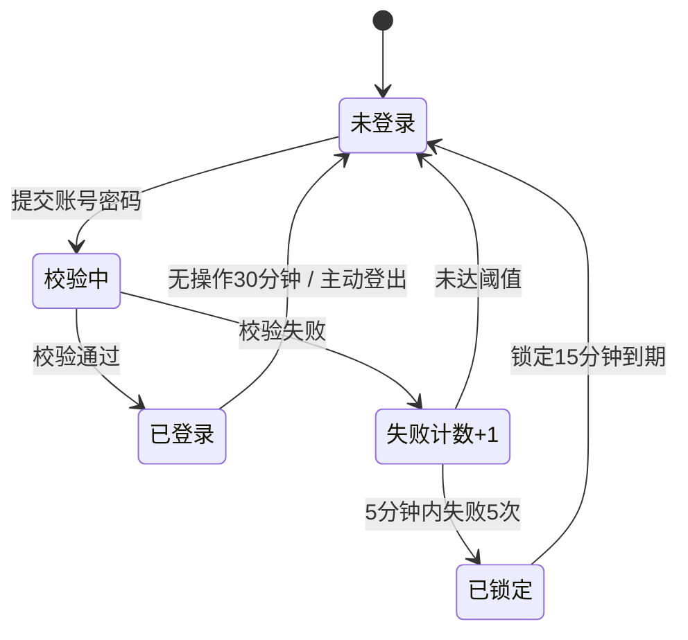

# 示例：用户登录与会话管理

> **Story ID**: 0（示例，无真实需求单）
> **Status**: draft
> **Author**: `<作者>`
> **Created**: `<日期>`
> **Updated**: `<日期>`
> **Sibling Specs**: 无
> **Branch**: `feature/0-example-user-login`

> 📌 **这是示例 spec**，用于展示各章节该怎么写、写到什么颗粒度。真实 spec 请复制 `templates/spec-template.md` 后填写。
>
> 章节来源标记约定：📥 原始需求 / 🤖 AI 推断（需确认）/ ❓ TBD / 🔍 现有代码

---

## 背景

📥 当前系统缺少统一的登录入口，各业务模块各自实现了临时的身份校验逻辑，导致：

1. 同一账号在不同模块需要重复登录
2. 会话过期策略不一致，有的 30 分钟失效、有的长期有效
3. 无法统一管控异常登录（如短时间大量失败）

需要一套统一的登录与会话管理能力，作为后续权限体系的基础。

## 目标

用可验证的语言描述本 spec 完成后达到的状态：

- 用户通过**一次**登录即可访问所有接入模块，无需重复认证
- 会话在**无操作 30 分钟后**自动失效，用户需重新登录
- 同一账号在**5 分钟内连续失败 5 次**后，账号锁定 15 分钟

## 非目标

明确排除哪些事情**不在**本次范围内，避免范围蔓延：

- ❌ 不做第三方登录（微信 / OAuth），本次仅账号密码
- ❌ 不做角色与权限管理（由后续 spec 承接）
- ❌ 不改现有各模块的业务代码，仅要求接入统一会话校验

## 用户故事

| 作为 | 我希望 | 以便 |
|------|--------|------|
| 普通用户 | 登录一次后访问各模块不再重复输入密码 | 减少操作成本 |
| 安全管理员 | 看到异常登录尝试并被自动拦截 | 降低账号被盗风险 |
| 接入方开发 | 通过统一接口校验会话，不自己实现登录 | 减少重复开发 |

## 功能需求

### FR-1: 账号密码登录

用户提供账号与密码，服务端校验通过后返回会话凭证。

- 密码使用 **bcrypt** 加盐哈希存储，禁止明文或可逆加密 🔍（沿用现有用户表的哈希方式）
- 校验失败不区分「账号不存在」与「密码错误」，统一返回「账号或密码错误」

### FR-2: 会话保持与刷新

- 登录后签发会话凭证，有效期 **30 分钟**
- 用户每次请求刷新有效期（滑动过期）
- 凭证在服务端可主动失效（用于登出、封禁）

### FR-3: 登录失败限制

- 同一账号 5 分钟内连续失败 5 次 → 锁定 15 分钟
- 锁定期间即使密码正确也拒绝登录
- 锁定状态随成功登录或超时自动解除

## 非功能需求

| 类型 | 要求 |
|------|------|
| 性能 | 登录接口 P99 < 300ms（含密码哈希校验） |
| 安全 | 凭证随机生成且不可预测；传输全程 HTTPS；不在日志中记录密码 |
| 兼容 | 兼容现有客户端版本，不强制升级 |
| 可维护 | 会话存储可替换（先内存，后续换 Redis 不改业务代码） |

## 数据结构 / API / 接口影响

```json
// 登录请求
POST /api/v1/auth/login
{ "account": "string", "password": "string" }

// 登录响应 200
{ "token": "string", "expires_in": 1800 }

// 失败响应 401
{ "code": "AUTH_FAILED", "message": "账号或密码错误" }

// 锁定响应 423
{ "code": "ACCOUNT_LOCKED", "message": "账号已锁定，请稍后再试", "retry_after": 900 }
```

新增数据结构：

```go
// 会话记录
type Session struct {
    Token     string    // 随机凭证
    UserID    int64
    CreatedAt time.Time
    ExpireAt  time.Time // 滑动更新
}
```

## 状态流转 / 业务流程



## 边界情况

| 场景 | 预期行为 |
|------|---------|
| 账号不存在 | 返回统一错误信息「账号或密码错误」，不泄露账号是否存在 |
| 密码正确但账号已锁定 | 返回 423 并提示剩余锁定时间 |
| 会话在请求进行中过期 | 当前请求正常完成，下一个请求返回 401 |
| 并发登录同一账号 | 允许多会话并存，不强制互踢 |
| 凭证被篡改 | 校验失败，返回 401，记录安全日志 |

## 验收标准

- [ ] 使用正确账号密码可登录，返回有效凭证
- [ ] 凭证有效期内访问受保护接口成功
- [ ] 无操作 30 分钟后访问返回 401
- [ ] 连续失败 5 次后账号锁定，第 6 次正确密码也无法登录
- [ ] 锁定 15 分钟后自动恢复登录能力
- [ ] 登出后原凭证立即失效
- [ ] 日志中不出现明文密码

## 测试点

**正常路径**

- 登录后访问受保护资源
- 会话有效期内持续访问不失效

**边界条件**

- 第 29 分钟与第 31 分钟的访问差异
- 失败 4 次与 5 次的临界行为
- 锁定期间的最后一分钟

**错误处理**

- 空账号 / 空密码
- 超长输入
- 特殊字符（SQL 注入、XSS 载荷）

**并发 · 竞态**

- 同一账号并发登录
- 会话过期与请求同时发生

## 风险与未决问题

| 项目 | 描述 | 状态 |
|------|------|------|
| 会话存储选型 | 当前用内存实现，多实例部署时会话不共享 | open |
| 是否需要"记住我" | 产品未明确，本期不做 | resolved |
| 密码策略 | 是否需要强制复杂度与定期更换 | open |

## 实施备注

**推荐方案**

1. 先实现内存版会话存储，接口层抽象为 `SessionStore`，便于后续替换
2. 登录校验封装为中间件，接入方只需引用
3. 失败计数用滑动窗口实现（避免固定窗口的时间边界问题）

**现有代码参考** 🔍

- 密码哈希：复用 `internal/crypto/password.go`
- 统一错误码：遵循 `internal/errors` 的 `AUTH_*` 规范

**实现顺序**

1. 数据模型与会话存储抽象
2. 登录接口与凭证签发
3. 会话校验中间件
4. 失败计数与锁定
5. 接入方改造（各模块去掉自实现校验）

## 修订记录

| 日期 | 修订点 | 关联 tasks 偏离记录 | 修订人 |
|------|--------|--------------------|--------|
| `<日期>` | 创建示例 | — | `<作者>` |
