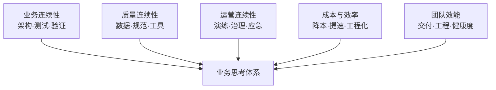
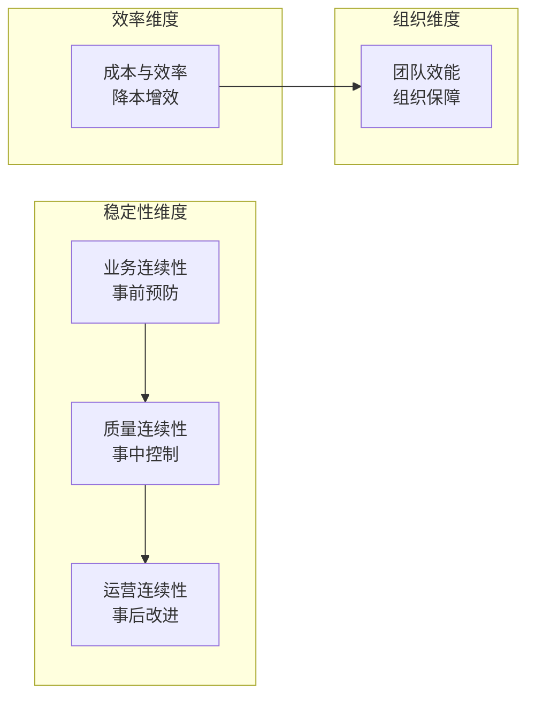

# 业务思考系列

> 从写代码到建体系——当技术能力达到一定高度后，真正的挑战是理解业务、守护稳定、推动治理、降本增效。

## 系列导读

代码写得好只是基本功。当你成长为高级工程师或技术负责人时，核心命题悄然转变：**如何让业务持续稳定运行？如何平衡功能迭代与系统稳定性？如何从一次故障中举一反三，推动团队治理升级？如何用更少的资源创造更大的价值？**

本系列从五个维度出发——**业务连续性、质量连续性、运营连续性、成本效率、团队效能**——梳理技术人向上成长时必须建立的**全局思维和方法论**。

## 文档目录

| 编号 | 文档 | 核心问题 | 适合人群 |
|:--:|------|---------|:--:|
| 01 | [业务连续性评估实战](https://yccoding.com/pages/6d824a/) | 如何从架构/测试/变更三个维度构建稳定可靠的业务底座？ | 高级工程师 / 技术负责人 |
| 02 | [质量连续性评估实战](https://yccoding.com/pages/8b4721/) | 如何用数据证明质量在提升？如何沉淀可复用的质量体系？ | 高级工程师 / 技术负责人 |
| 03 | [运营连续性评估实战](https://yccoding.com/pages/dc3ea5/) | 如何守住运营红线、从故障中举一反三、平衡收入与稳定性？ | 技术负责人 / 架构师 |
| 04 | [成本与效率评估实战](https://yccoding.com/pages/biz-cost-efficiency/) | 如何优化云资源和研发流程，做到降本增效？ | 高级工程师 / 技术负责人 |
| 05 | [技术团队效能评估](https://yccoding.com/pages/biz-team-effectiveness/) | 如何度量团队产出、提升工程能力、保持团队健康？ | 技术负责人 / 架构师 |

## 五篇文档的逻辑关系

| 维度 | 01 业务连续性 | 02 质量连续性 | 03 运营连续性 | 04 成本与效率 | 05 团队效能 |
|------|:--:|:--:|:--:|:--:|:--:|
| **关注阶段** | 事前设计 | 事中执行 | 事后+日常 | 贯穿全流程 | 组织层面 |
| **核心命题** | 系统能否扛住故障？ | 质量在提升还是下降？ | 如何避免人因事故？ | 如何降本增效？ | 团队是否高效健康？ |
| **关键动作** | 容灾设计、故障注入 | 数据度量、规范落地 | 监控巡检、根因复盘 | 资源优化、流程加速 | 交付度量、工程评分 |
| **典型产出** | 容灾架构、演练方案 | 测试框架、质量仪表盘 | 故障SOP、治理方案 | 成本报告、效率基线 | 效能报告、改进计划 |

## 适合谁读

- **高级工程师**：正在从"执行者"向"设计者"转型，需要建立全局视角
- **技术负责人/Tech Lead**：需要对团队的质量、稳定性、运营效率和成本负责
- **架构师**：需要从技术选型和架构设计角度把控成本与效率
- **准备晋升答辩的开发者**：需要系统性地梳理自己在业务思考方面的贡献

## 阅读建议

1. **先读稳定性三篇**：01 → 02 → 03，建立"预防-控制-改进"的闭环认知
2. **再读效率两篇**：04 → 05，从技术和组织两个维度深化全局视野
3. **带着自己的项目读**：每读完一篇，对照自己的项目梳理一份评估
4. **重点关注举证方法**：五篇文档都提供了大量"数据举证"和"案例展示"的模板，可直接复用于答辩材料
