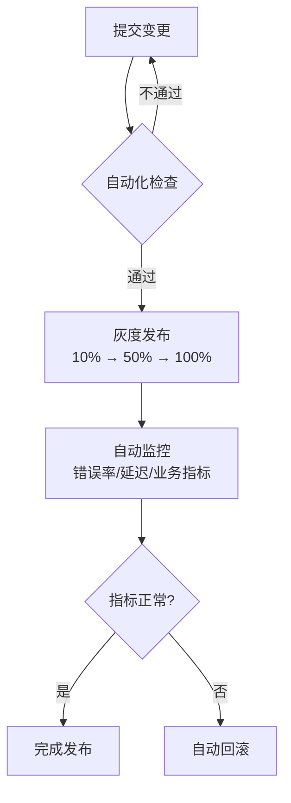
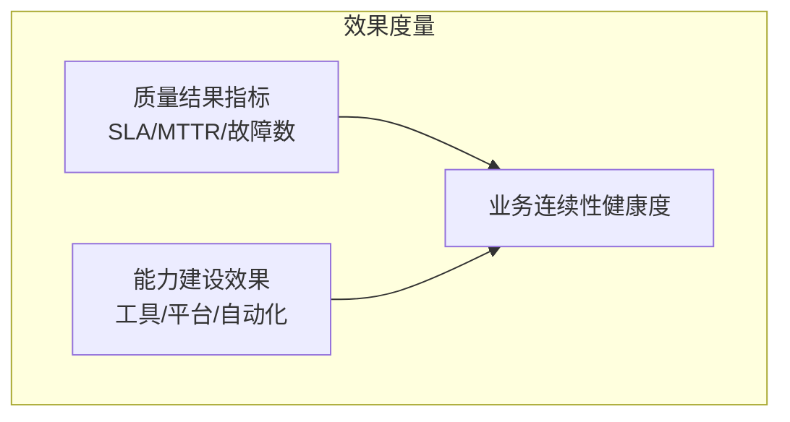

# 业务连续性评估实战

> 业务连续性是关乎全局和长期价值的命题——如何在系统设计、测试验证、变更管控三个维度构建稳定可靠的业务底座。

## 一、业务连续性落地场景

业务连续性的建设不是"出了事再救火"，而是**在系统设计、质量验证、变更管控三个阶段层层设防**：


### 1.1 稳定性与容灾能力建设

主导或参与产品稳定性与容灾能力的体系化设计和落地，核心方向：

#### a. 稳定性测试设计与实施

针对产品特性，设计并实施专项稳定性测试方案：

| 测试类型 | 目标 | 示例 |
|----------|------|------|
| **故障注入** | 验证系统在异常下的行为 | 模拟依赖服务中断、网络延迟、CPU/内存耗尽 |
| **监控告警验证** | 确认告警规则的有效性 | 注入已知故障，检查告警是否及时触发 |
| **兼容性测试** | 验证多版本、多环境的兼容性 | 不同浏览器/操作系统/依赖版本的组合测试 |

> **关键原则**：故障注入不是"搞破坏"，而是"打疫苗"——用小剂量的可控故障来验证系统的免疫能力。

#### b. 产品容灾与故障恢复能力验证


| 验证项 | 度量指标 | 目标 |
|--------|----------|------|
| 容灾切换 | 切换耗时 | ≤ 30s |
| 故障恢复 | MTTR（平均恢复时长） | ≤ 5min |
| 数据一致性 | 切换后数据校验通过率 | 100% |
| 演练频率 | 每季度演练次数 | ≥ 2次 |

#### c. 业务连续性共性风险分析与总结

能举一反三识别出产品的**共性风险**，协同稳定性团队推动治理：

```
识别路径：
  单点故障 → 同类产品是否有相同风险？→ 输出风险报告 → 推动批量整改

示例：
  发现A服务的数据库连接池未设置超时
  → 扫描全部门30+服务的连接池配置
  → 发现8个服务存在同类问题
  → 统一配置标准，批量修复
```

### 1.2 质量规范与工程化能力建设

将业务连续性要求融入日常质量流程，推动工程化和标准化：

#### a. 质量规范设计/执行贡献

| 规范类型 | 内容 | 价值 |
|----------|------|------|
| 稳定性测试规范 | 定义测试场景、工具、准入标准 | 统一测试标准，避免漏测 |
| 变更管理规范 | 变更分级、审批流程、灰度策略 | 降低变更引入的故障 |
| 代码准入规范 | Review Checklist + 静态扫描 | 从源头拦截风险 |

#### b. 变更工程化能力建设

推动产品发布变更流程的标准化与自动化：



**核心能力：**
- **发布流水线**：编译 → 单测 → 集成测试 → 灰度 → 全量，每步都有卡点
- **自动回滚**：发布后监控指标异常自动触发回滚
- **变更可观测**：每次发布可追溯——谁、什么时间、改了什么、影响范围

#### c. 演练环境治理

| 治理维度 | 要求 | 避免的问题 |
|----------|------|-----------|
| 环境完整性 | 与生产环境配置一致 | "我本地能跑"但上线就挂 |
| 环境隔离 | 测试环境不影响生产 | 压测把生产库打挂 |
| 数据脱敏 | 测试数据不包含真实用户信息 | 数据泄露 |
| 变更成熟度 | 测试环境变更流程规范 | 环境随意改动导致测试不可信 |

### 1.3 过程指标

可量化的过程指标，证明你在业务连续性上的投入：

| 指标类别 | 具体指标 | 建议统计口径 |
|----------|----------|-------------|
| 测试活动 | 主导/参与的稳定性测试次数 | 按季度统计 |
| 场景覆盖 | 演练场景覆盖的业务链路数量 | 核心链路覆盖率 |
| 缺陷发现 | 通过测试活动发现的缺陷数量 | 分P0/P1/P2统计 |
| 流程优化 | 推动的变更流程优化点数量 | 每项治理独立计数 |
| 环境治理 | 演练环境治理的关键改进项 | 治理前后的改善对比 |

## 二、业务连续性落地效果



### 2.1 质量结果指标

| 指标 | 计算方式 | 改进目标 |
|------|----------|----------|
| **容灾切换耗时** | 从故障发生到完成切换 | 缩短50% |
| **MTTR** | 故障确认到修复完成 | 缩短60% |
| **SLA达成率** | 可用时间/总时间 | ≥ 99.95% |
| **现网故障数** | 一定周期内P0/P1故障 | 同比下降 ≥ 30% |
| **变更引致故障** | 因发布变更导致的故障 | 降至0 |
| **发布回滚率** | 回滚次数/总发布次数 | ≤ 1% |

### 2.2 能力建设效果指标

| 指标 | 说明 | 度量方式 |
|------|------|----------|
| 工具使用率 | 稳定性测试工具/平台的采纳率 | 使用团队数/总团队数 |
| 问题发现效率 | 自动化 vs 人工发现问题数对比 | 自动化发现占比 |
| 变更自动化率 | 自动化发布的占比 | 自动化发布/总发布 |
| 风险评估准确率 | 变更风险预判的正确率 | 预测高风险且实际出问题/总高风险预测 |

## 三、业务连续性经验分享

### 3.1 方法论沉淀

形成可复用的业务连续性实践方法论，包括：

| 产出类型 | 示例 |
|----------|------|
| **设计指南** | 《稳定性测试设计指南》- 指导如何针对不同架构设计测试方案 |
| **流程文档** | 《容灾演练标准化流程》- 从准备到复盘的标准SOP |
| **风险清单** | 《变更风险控制清单》- 按业务场景列出的风险点和控制措施 |
| **架构文档** | 《产品容灾链路和架构测试设计》- 关键链路的容灾设计方案 |
| **工具能力** | 引入或自研的稳定性测试工具的使用手册和最佳实践 |

### 3.2 内外部影响力

| 形式 | 指标 | 目标 |
|------|------|------|
| 团队分享 | 主题分享次数 + 覆盖人数 | 季度 ≥ 1次 |
| 跨团队推广 | 方法论被采纳的团队数 | ≥ 3个团队 |
| 文章输出 | 内部知识库文章/外部博客 | ≥ 2篇/年 |
| 社区贡献 | 开源项目贡献/技术会议演讲 | 量的积累 |

---

> **小结**：业务连续性的本质是**从"救火"到"防火"的转变**——通过架构设计、质量规范和持续演练，构建一个"无论是单点故障还是人因失误，都不会演变成灾难"的体系。
