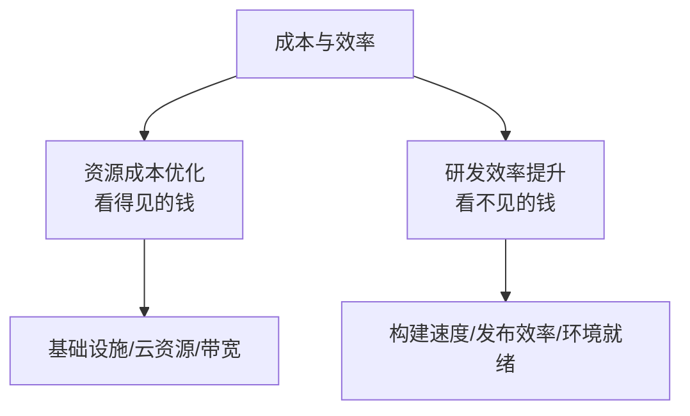
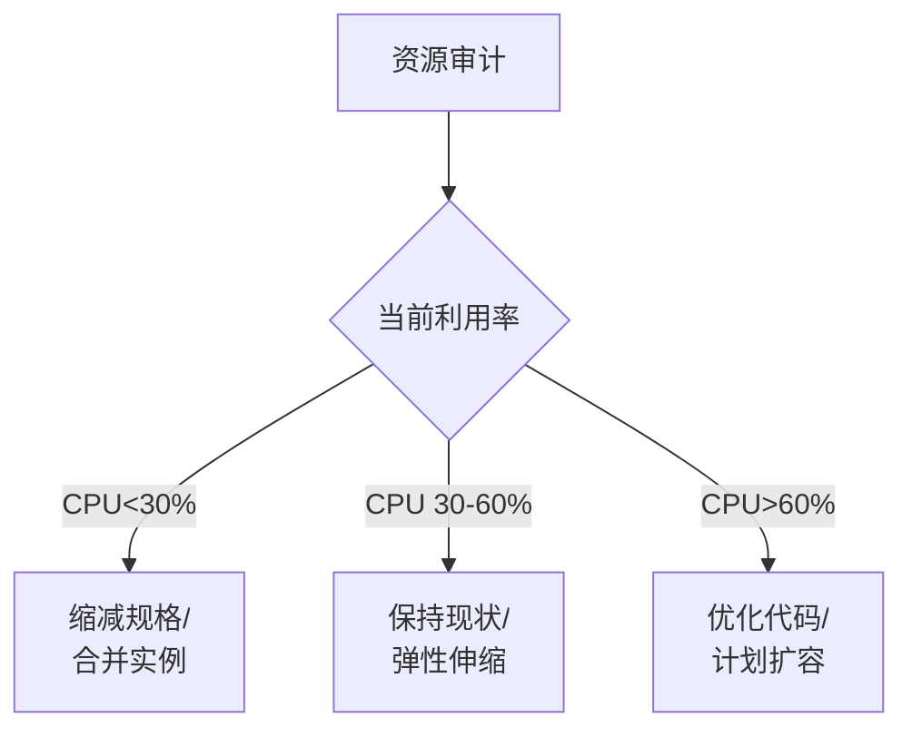

# 成本与效率评估实战

> 稳定性是根基，成本效率是杠杆——用更少的资源做更多的事，才是高级工程师的核心竞争力。



## 一、为什么成本与效率是晋升硬指标

当你还是初级工程师时，关注的是"功能能不能做出来"。但到了高级工程师和技术负责人的层面，公司关心的命题变了：

| 阶段 | 关注点 | 典型命题 |
|------|--------|----------|
| 初级 | 功能实现 | 这个接口怎么写？ |
| 中级 | 质量保障 | 如何保证不出Bug？ |
| **高级/专家** | **成本效率** | **这个方案需要多少资源？能否更省？** |

> 一个不懂得算账的高级工程师，和技术决策的"价值"之间永远隔着一层。

## 二、资源成本优化

### 2.1 常见成本构成

| 成本类型 | 典型占比 | 优化潜力 |
|----------|----------|----------|
| 计算资源（云主机/容器） | 40-60% | 高 |
| 存储资源（DB/ES/对象存储） | 20-30% | 中 |
| 带宽/CDN | 10-20% | 中 |
| 第三方服务/API调用 | 5-15% | 高 |
| 许可证/SaaS订阅 | 5-10% | 低 |

### 2.2 计算资源优化



| 优化策略 | 具体措施 | 预期节省 |
|----------|----------|----------|
| **合理规格** | 根据压测数据选择机型，不盲目用大规格 | 15-30% |
| **弹性伸缩** | 非高峰自动缩容，高峰自动扩容 | 20-40% |
| **Spot/竞价实例** | 离线任务/异步任务使用竞价实例 | 50-70%（此类任务） |
| **合并部署** | 低流量服务共享实例，减少闲置资源 | 10-20% |
| **淘汰下线** | 定期清理不再使用的服务/环境 | 5-10% |

**实战案例：**

```
场景：某业务线高峰期需要50台机器，非高峰期只需10台

优化前：
  固定配置50台机器（按峰值预留）→ 日均40台闲置

优化后：
  1. 配置弹性伸缩策略（HPA）：
     - 高峰期（10:00-22:00）：自动扩容至50台
     - 低峰期（22:00-10:00）：自动缩容至10台
  2. 非实时任务（报表生成/数据清洗）迁移到竞价实例

成果：
  - 月度成本降低 45%（从¥15万降到¥8.2万）
  - 年化节省约 ¥81.6万
```

### 2.3 存储成本优化

| 优化策略 | 措施 | 收益 |
|----------|------|------|
| **冷热分离** | 热数据SSD、冷数据HDD/对象存储 | 存储成本降低50%+ |
| **数据生命周期** | 自动归档N天前的日志数据 | 长期存储成本降低70%+ |
| **索引优化** | 删除冗余索引，减少存储和写入开销 | 存储降低10%，写入提速 |
| **压缩** | 日志压缩存储、大字段压缩 | 存储降低30-60% |
| **清理策略** | 定期删除过期日志/临时数据 | 防止无限膨胀 |

### 2.4 带宽与CDN优化

| 优化策略 | 预期效果 |
|----------|----------|
| 静态资源CDN加速（减少源站带宽） | 源站带宽减少60-80% |
| 启用Gzip/Brotli压缩 | 传输量减少50-70% |
| 图片WebP/AVIF格式 + 懒加载 | 图片带宽减少40-60% |
| API响应瘦身（按需返回字段） | 减少30-50%传输量 |

### 2.5 成本可视化


**关键数据：**

| 度量指标 | 说明 | 优化目标 |
|----------|------|----------|
| **单次请求成本** | 总资源成本 / 总请求数 | 持续降低 |
| **用户人均成本** | 总成本 / MAU（月活用户） | 规模效应下递减 |
| **收入成本比** | 技术成本 / 业务收入 | < 15% |
| **闲置率** | 低利用率资源数 / 总资源数 | < 10% |

## 三、研发效率提升

### 3.1 效率的四个维度


### 3.2 构建效率

| 优化措施 | 效果 | 实施难度 |
|----------|------|----------|
| 增量编译（仅编译变更模块） | 构建时间缩短50-80% | ★★ |
| 并行构建（多模块并行） | 构建时间缩短30-50% | ★★ |
| 依赖缓存（.m2/node_modules） | 减少重复下载，缩短2-5min | ★ |
| 换更快的构建工具（esbuild vs webpack） | 构建时间缩短80%+ | ★★★ |
| 构建产物瘦身（Tree-shaking） | 包体积缩小，部署更快 | ★★ |

**量化示例：**

```
前端项目构建优化案例：

优化前：
  - 全量构建：8分钟
  - node_modules每次CI都重新安装：3分钟
  - 包体积：5.2MB（未压缩）

优化措施：
  1. 替换为 esbuild → 构建时间降至 45s（↓ 90%）
  2. CI缓存 node_modules → 减少 2min
  3. Tree-shaking + 代码分割 → 包体积降至 1.8MB（↓ 65%）

总效果：
  - 单次构建：8min → 50s
  - 每天构建50次 → 节省6小时/天
  - 年化节省开发者等待时间：约 1500小时
```

### 3.3 部署效率

| 优化措施 | 效果 |
|----------|------|
| 灰度发布流水线（自动分批） | 发布耗时从2小时→15分钟 |
| 制品预热（预拉取镜像） | 部署时间缩短50% |
| 健康检查优化（缩短探针间隔） | Pod启动到就绪从60s→15s |
| 并行部署（多实例同时更新） | 全量更新时间缩短70% |

### 3.4 环境效率

| 痛点 | 解决方案 | 效果 |
|------|----------|------|
| 新人环境搭建半天 | Docker Compose一键启动 | 半天→30分钟 |
| 多人环境冲突 | 每人独立开发环境 | 消除相互影响 |
| 环境与生产不一致 | 容器化 + 配置中心统一管理 | 减少"我本地没问题" |
| 测试数据准备耗时 | 数据生成脚本+快照恢复 | 手动1小时→自动5分钟 |

### 3.5 认知效率

| 措施 | 价值 |
|------|------|
| 代码可读性规范（命名、注释、结构） | 新成员阅读代码的速度提升50% |
| 架构文档 + 决策记录（ADR） | 减少重复讨论"为什么这么设计" |
| 模块化拆分（高内聚低耦合） | 修改一个模块不用理解整个系统 |
| On-Call Runbook/排错手册 | 故障处理从30分钟→5分钟 |

## 四、效率度量体系

### 4.1 DORA视角下的效率指标

| 指标 | Elite水平 | 衡量方式 |
|------|-----------|----------|
| 部署频率 | 按需（每天多次） | 生产部署次数/周 |
| 变更前置时间 | < 1小时 | Commit到上线的时间 |
| 变更失败率 | 0-5% | 导致故障的发布占比 |
| 恢复时间(MTTR) | < 1小时 | 故障到恢复的时间 |

### 4.2 自定义效率指标

| 指标 | 计算方式 | 优化目标 |
|------|----------|----------|
| **CI耗时** | PR提交到CI完成的时间 | < 10分钟 |
| **PR合入周期** | PR创建到合入的时间 | < 1天 |
| **需求交付周期** | 需求确认到上线的时间 | < 5天 |
| **环境就绪时间** | 新环境从创建到可用的时间 | < 30分钟 |
| **重复工作率** | 因环境/工具问题的重复操作占比 | < 5% |

## 五、成本效率举证框架

### 5.1 举证结构

```
1. 发现问题
   → 描述现状和痛点（用数据说话）

2. 分析根因
   → 为什么会产生这个问题？（资源浪费/流程低效/工具落后）

3. 解决方案
   → 你做了什么？（技术选型/方案设计/推动落地）

4. 量化效果
   → 优化前后的数据对比（成本 ↓X%，时间 ↓Y%）

5. 可持续性
   → 如何保证优化效果不会反弹？（告警/流程/自动化）
```

### 5.2 举证示例模板

```markdown
## 项目：[XX服务成本优化]

### 背景
XX服务月成本 ¥12万，核心模块QPS仅300，单次请求成本偏高。

### 根因分析
1. 机器规格偏高（8C16G），实际CPU利用率仅15%
2. 固定50台实例，非高峰期大量闲置
3. 数据库存在5个冗余索引，占用额外存储和写入开销

### 优化措施
1. 降配至4C8G，压测验证QPS可达600+（安全水位67%）
2. 接入HPA弹性伸缩，非高峰期自动缩容至15台
3. 下线3个冗余索引，清理180天前的归档日志

### 效果
| 指标 | 优化前 | 优化后 | 改善 |
|------|--------|--------|------|
| 月度成本 | ¥12万 | ¥5.8万 | ↓ 52% |
| CPU利用率 | 15% | 55% |业务无影响 |
| 年度节省 | - | - | ¥74.4万 |
```

## 六、常见误区

| 误区 | 正确做法 |
|------|----------|
| 一味追求低成本 | 成本优化不能牺牲稳定性和用户体验 |
| 只看资源成本 | 研发效率是"看不见的成本"，往往比资源成本更大 |
| 优化完就不管了 | 建立监控和告警，防止优化效果回退 |
| 只做一次性优化 | 成本优化应该是持续的，纳入日常运营 |

## 七、小结

成本与效率评估的关键在于：

1. **数据说话**：优化前先测量，优化后做对比
2. **先低垂果实**：优先做ROI高的优化（弹性伸缩 > 重构代码）
3. **技术驱动**：好的架构设计本身就是最高效的成本优化
4. **持续化**：成本优化不是一次性项目，应该成为日常运营的KPI

> 降本不是砍预算，而是用技术的手段让每一分钱花在刀刃上；提效不是加班，而是用工程化的手段让团队跑得更快。
