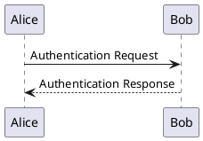

## 五、实战技巧

### 5.1 排版规范（中文文案排版指北）

参考 [中文文案排版指北](https://github.com/sparanoid/chinese-copywriting-guidelines)：

- **中英文之间**需要空格：`这是 English 单词`
- **中文与数字之间**需要空格：`价格是 100 元`
- **数字与单位之间**需要空格：`10 Mbps`，但 `10°` 和 `50%` 除外
- **全角标点**与其他字符之间不加空格
- **专有名词**使用正确的大小写：`GitHub`、`iOS`、`macOS`
- **链接**前后加空格：`请访问 [GitHub](https://github.com) 了解更多`

### 5.2 好的文档结构

```markdown
# 文档标题

> 一句话描述这个文档是做什么的

## 概述

简要说明背景、目的、适用人群。

## 快速开始

让读者在 5 分钟内上手的最简步骤。

## 详细说明

分章节展开。

## 常见问题

收集常见问题和解决方案。

## 参考链接

列出相关文档、参考资料。
```

### 5.3 代码块的最佳实践

- **指定语言**：始终为代码块指定语言标识符，获得语法高亮
- **添加注释**：在关键代码前后加文字说明
- **控制行数**：过长的代码用 `...` 省略无关部分
- **标注重点**：利用行高亮让读者聚焦

### 5.4 表格优化

- **对齐列**：手动对齐 `|` 分隔符，使源文件也易于阅读
- **精简内容**：表格不适合放长文字，超过 30 字的单元格考虑用列表替代
- **合并场景**：多个小表格优于一个超大表格

### 5.5 链接管理

- **少用裸链接**：始终给链接配上描述性文字
- **集中定义**：同一文档内多次引用的链接用引用式写法
- **检查死链**：发布前确认所有链接可访问

### 5.6 图片管理

- **统一存放**：图片集中放在 `images/` 或 `assets/` 目录
- **合理压缩**：使用 WebP 格式，单张不超过 500KB
- **提供替代文字**：`` 中的描述对无障碍访问很重要
- **相对路径**：引用本地图片用相对路径，便于迁移

---

## 六、常见编辑器

### 6.1 Typora

- **类型**：所见即所得（WYSIWYG）
- **优点**：极简设计，实时预览，支持数学公式、Mermaid 图表
- **缺点**：1.0 后付费

### 6.2 VS Code

- **类型**：源码 + 预览
- **推荐插件**：
  - `Markdown All in One`：快捷键、目录、列表增强
  - `Markdown Preview Enhanced`：增强预览、导出 PDF
  - `markdownlint`：语法检查，规范排版

### 6.3 Obsidian

- **类型**：知识管理 + 双向链接
- **优点**：本地存储、图谱视图、插件生态丰富
- **适合**：个人知识库、笔记系统

### 6.4 在线工具

| 工具 | 地址 | 特点 |
|------|------|------|
| StackEdit | stackedit.io | 在线编辑器，同步 Google Drive |
| Dillinger | dillinger.io | 极简在线编辑器 |
| HackMD | hackmd.io | 在线协作 Markdown |
| Markdown Live | markdownlivepreview.com | 实时预览 |
| Mermaid Live | mermaid.live | Mermaid 图表在线编辑 |

---

## 七、常见问题与排错

### 7.1 换行不生效

**现象**：两行文字渲染后连在一起。

**解决**：
1. 两行之间插入一个空行（即按两次回车）
2. 在行末加两个空格再回车
3. 使用 `<br>` 标签

### 7.2 列表嵌套代码块失败

**现象**：代码块没有正确嵌套在列表项下。

**解决**：在代码块前缩进 **4 个空格** 或 **1 个 Tab**。

### 7.3 表格无法正常显示

常见原因：
- 表头和分隔行之间不能有空行
- 分隔行的 `---` 数量要一致（至少三个）
- `|` 和内容之间建议加一个空格

正确写法：
```markdown
| 列A | 列B | 列C |
| :-- | :-- | :-- |
| A1  | B1  | C1  |
```

### 7.4 Frontmatter 解析错误

- `---` 必须独占一行，前后不能有空格
- YAML 缩进必须一致（用空格，不要混用 Tab）
- 冒号 `:` 后必须有一个空格

```yaml
---
title: 正确写法
---
```

### 7.5 中文标题锚点跳转失败

**原因**：中文在 URL 中被编码为 `%E4%BD%A0%E5%A5%BD` 格式。

**解决**：
1. 使用英文标题
2. 使用 HTML 锚点：`<a id="custom-id"></a>`
3. VuePress 中会自动处理，GFM 中较容易出问题

### 7.6 HTML 标签不渲染

**原因**：部分平台（如 GitHub）出于安全考虑限制了 `style`、`script`、`iframe` 等标签。

**解决**：
1. 使用平台支持的扩展语法替代
2. 用 Markdown 原生语法实现等效效果
3. 减少对 HTML 的依赖

---

## 八、Markdown 转其他格式

### 8.1 转 HTML

```bash
# 使用 Pandoc
pandoc input.md -o output.html

# 带样式
pandoc input.md -s -c style.css -o output.html
```

### 8.2 转 PDF

```bash
# Pandoc + LaTeX 引擎
pandoc input.md -o output.pdf --pdf-engine=xelatex

# 通过 HTML 中转
pandoc input.md -s -o output.html
# 然后用浏览器打印为 PDF
```

### 8.3 转 Word (docx)

```bash
pandoc input.md -o output.docx
```

### 8.4 转幻灯片

```bash
# Marp 工具
marp input.md -o output.pptx

# Pandoc
pandoc input.md -t beamer -o output.pdf
```

---

## 九、速查表

### 9.1 语法速查

| 语法 | Markdown 写法 |
|------|--------------|
| 标题 | `# H1` `## H2` `### H3` |
| 粗体 | `**粗体**` |
| 斜体 | `*斜体*` |
| 删除线 | `~~删除~~` |
| 行内代码 | `` `code` `` |
| 代码块 | ` ```lang ``` ` |
| 链接 | `[文字](URL)` |
| 图片 | `` |
| 引用 | `> 引用文字` |
| 无序列表 | `- 项目` |
| 有序列表 | `1. 项目` |
| 任务列表 | `- [ ] 待办` / `- [x] 完成` |
| 表格 | `\| 列 \| 列 \|` |
| 分隔线 | `---` |
| 脚注 | `[^1]` + `[^1]: 内容` |
| 行内公式 | `$E=mc^2$` |
| 块级公式 | `$$公式$$` |

### 9.2 快捷键（VS Code）

| 快捷键 | 功能 |
|--------|------|
| `Ctrl+B` | 加粗 |
| `Ctrl+I` | 斜体 |
| `Ctrl+Shift+]` | 增加标题级别 |
| `Ctrl+Shift+[` | 减少标题级别 |
| `Ctrl+Shift+V` | 打开预览 |
| `Ctrl+K V` | 侧边预览 |
| `Alt+C` | 切换任务状态 |

---

## 十、结语

Markdown 是每个开发者都该熟练掌握的基础技能。从写 README 到技术博客，从 API 文档到项目 Wiki，它无处不在。

本文覆盖了 Markdown 从零基础到进阶的绝大多数知识点。建议你在实际项目中有意识地使用这些语法——写得越多，越熟练。

记住一个原则：**Markdown 的核心不是炫技，而是让文档更清晰、更易读、更易维护**。

---

## 十一、各平台差异对比

不同平台对 Markdown 的支持程度不同，了解差异能避免踩坑：

| 特性 | GitHub | GitLab | VuePress | Notion | Obsidian |
|------|:------:|:------:|:--------:|:------:|:--------:|
| 基础语法 | ✅ | ✅ | ✅ | ✅ | ✅ |
| 表格 | ✅ | ✅ | ✅ | ✅ | ✅ |
| 任务列表 | ✅ | ✅ | ✅ | ✅ | ✅ |
| 代码高亮 | ✅ | ✅ | ✅ | ✅ | ✅ |
| Emoji 短代码 | ✅ | ✅ | ❌ | ✅ | ❌ |
| 数学公式 | ✅ | ✅ | ✅ | ✅ | ✅ |
| Mermaid 图表 | ✅ | ✅ | ❌ | ❌ | ✅ |
| 脚注 | ✅ | ✅ | ❌ | ❌ | ✅ |
| HTML 嵌入 | 部分 | 部分 | 全部 | ❌ | ❌ |
| Frontmatter | 部分 | ✅ | ✅ | ❌ | ✅ |
| 自定义容器 | ❌ | ❌ | ✅ | ❌ | ❌ |
| TOC 目录 | ✅ | ✅ | 自动 | ✅ | ✅ |
| 图片尺寸 | ✅ | ✅ | ✅ | ❌ | ✅ |
| 链接自动识别 | ✅ | ✅ | ✅ | ✅ | ✅ |
| Diff 语法 | ✅ | ✅ | ❌ | ❌ | ❌ |
| 双向链接 | ❌ | ❌ | ❌ | ✅ | ✅ |

### 11.1 GitHub 特有语法

**Diff 代码块**：展示代码变更

````markdown
```diff
- const oldVar = '旧代码'
+ const newVar = '新代码'
   const unchanged = '未修改'
```
````

**警告框（GitHub 扩展）**：

```markdown
> [!NOTE]
> 这是一个备注信息。

> [!TIP]
> 这是一个提示信息。

> [!IMPORTANT]
> 这是一个重要信息。

> [!WARNING]
> 这是一个警告信息。

> [!CAUTION]
> 这是一个危险警告。
```

**颜色展示**：GitHub 支持在 issue 中预览颜色：

```markdown
`#FF0000` `rgb(255,0,0)` `hsl(0,100%,50%)`
```

### 11.2 GitLab 特有语法

**PlantUML 图表**：GitLab 额外支持 PlantUML

````markdown

````

**Kroki 集成**：支持更多图表类型（BlockDiag、GraphViz 等）

### 11.3 Notion 特有语法

Notion 不完全遵循标准 Markdown，而是有自己的富文本格式：

- 不支持 HTML 标签
- 表格功能更弱（无对齐控制）
- 列表嵌套需要用 Tab 键缩进
- 使用 `/` 命令快速插入元素

导出 Markdown 时图片会丢失，建议用 Notion 原生分享。

### 11.4 Obsidian 特有语法

**双向链接（Wiki Links）**：

```markdown
[[页面名称]]
[[页面名称|显示文本]]
[[页面名称#标题]]
```

**嵌入文件**：

```markdown
![[文件名]]
```

**标注（Callouts）**：

```markdown
> [!info] 标题
> 内容文字，支持多行。
```

**标签**：

```markdown
#标签名
#编程/Markdown  （嵌套标签）
```

---

## 十二、高级排版技巧

### 12.1 多级列表混合使用

```markdown
1. 第一章
   - 要点一
   - 要点二
     1. 子要点 A
     2. 子要点 B
2. 第二章
   - 要点三
     > 引用注释
     > 
     > 可以多行
```

### 12.2 表格内嵌代码块

```markdown
| 功能 | 代码示例 |
|:-----|:---------|
| 循环 | `for (let i = 0; i < 10; i++)` |
| 箭头函数 | `const fn = (x) => x * 2` |
| 异步 | `await fetch(url)` |
```

**嵌套反引号的技巧**：如果表格内要显示反引号本身，用 `&#96;` 或双反引号包裹。

```markdown
| 示例 | 写法 |
|:-----|:-----|
| &#96;code&#96; | 用 `&#96;` 代替反引号 |
| `` `code` `` | 双反引号包裹 |
```

### 12.3 渐变式标题（视觉层次）

通过合理搭配标题级别，创建清晰的层次：

```markdown
# 文档标题（H1）
## 第一部分（H2）
### 1.1 章节一（H3）
#### 知识点 A（H4）
##### 细节 a（H5）
###### 补充说明（H6）

## 第二部分（H2）
### 2.1 章节二（H3）
```

**原则**：
- H1 只用于文档标题，全文仅一个
- H2 用于大板块划分
- H3~H4 用于具体章节
- H5~H6 极少使用，仅在深度嵌套时出现

### 12.4 清单+说明模式

```markdown
**前置条件**
- [x] Node.js >= 18
- [x] npm >= 9
- [ ] Docker Desktop

**安装步骤**
1. 克隆仓库
2. 安装依赖：`npm install`
3. 启动开发服务：`npm run dev`
4. 打开浏览器访问 `http://localhost:8080`

**常见问题**
- **Q: 端口被占用怎么办？**
  A: 使用 `npm run dev -- --port 9090` 指定端口。
- **Q: 依赖安装失败？**
  A: 尝试 `npm install --legacy-peer-deps`。
```

### 12.5 双列布局（HTML）

```markdown
<table>
<tr>
<td width="50%">

**左列内容**
- 优点一
- 优点二

</td>
<td width="50%">

**右列内容**
- 缺点一
- 缺点二

</td>
</tr>
</table>
```

### 12.6 可折叠的代码块

```markdown
<details>
<summary><b>点击查看完整代码（102行）</b></summary>

```python
def factorial(n):
    if n <= 1:
        return 1
    return n * factorial(n - 1)

# ... 更多代码
```

</details>
```

### 12.7 使用 Badge 美化文档

```markdown
<!-- 版本 -->


<!-- 许可证 -->


<!-- 构建状态 -->


<!-- 覆盖率 -->


<!-- 技术栈 -->


```

---

## 十三、自动化工具

### 13.1 Markdown Lint

使用 `markdownlint` 检查语法规范：

```bash
# 安装
npm install -g markdownlint-cli

# 检查单个文件
markdownlint README.md

# 检查整个目录
markdownlint docs/**/*.md

# 自动修复（部分问题）
markdownlint --fix docs/**/*.md
```

常见规则配置 `.markdownlint.json`：

```json
{
  "default": true,
  "MD013": { "line_length": 120 },
  "MD033": false,
  "MD041": false,
  "MD024": { "siblings_only": true },
  "MD025": { "front_matter_title": "" }
}
```

### 13.2 Prettier 格式化

Prettier 支持 Markdown 格式化：

```bash
# 安装
npm install -D prettier

# 格式化
npx prettier --write "**/*.md"
```

### 13.3 拼写检查

```bash
# 使用 cspell
npm install -g cspell

cspell "**/*.md"
```

### 13.4 死链检测

```bash
# 使用 markdown-link-check
npm install -g markdown-link-check

markdown-link-check README.md
```

---

## 十四、从零搭建 Markdown 工作流

### 14.1 最小配置（单文件）

1. 安装 VS Code
2. 安装插件 `Markdown All in One`
3. 新建 `notes.md`
4. 开始写作

### 14.2 博客级配置

1. 选用 VuePress / Hexo / Hugo 等静态站点生成器
2. 所有文章放在 `docs/` 目录下
3. 配置侧边栏、导航、搜索
4. 部署到 GitHub Pages / Vercel

### 14.3 知识库级配置

1. 安装 Obsidian / Logseq / Notion
2. 建立文件夹体系
3. 使用双向链接建立知识图谱
4. 定期回顾和整理

### 14.4 团队协作配置

1. 统一使用一个 Markdown 风格指南
2. 在 CI 中集成 markdownlint
3. 使用 HackMD / Notion 进行实时协作
4. 规范文件命名、图片存放路径

---

## 十五、写作建议与进阶阅读

### 15.1 写作心法

1. **先结构后内容**：先列大纲，再填充，避免边写边想
2. **一篇文章只解决一个问题**：不要试图涵盖所有，聚焦产生深度
3. **善用示例**：每个概念配一个最小的可复现代码示例
4. **图文并茂**：复杂概念用 Mermaid 图辅助理解
5. **反复打磨**：写完后隔一天再读，删掉所有可有可无的内容
6. **换位思考**：问自己「如果我是读者，我能看懂吗？」
7. **重视排版**：清晰的排版降低读者的认知负担

### 15.2 推荐书籍

| 书名 | 作者 | 说明 |
|------|------|------|
| 《The Elements of Style》 | Strunk & White | 英文写作经典，对中文写作也有启发 |
| 《金字塔原理》 | 芭芭拉·明托 | 结构化思考与表达 |
| 《技术文档写作》 | 张鑫旭 | 针对开发者的中文技术写作 |

### 15.3 优秀参考

- [Vue.js 官方文档](https://cn.vuejs.org/) — 中文技术文档标杆
- [React 官方文档](https://react.dev/) — 渐进式引导的典范
- [MDN Web Docs](https://developer.mozilla.org/zh-CN/) — 最全面、最准确的 Web 技术参考
- [阮一峰的网络日志](https://www.ruanyifeng.com/blog/) — 通俗易懂的中文技术写作
- [GitHub Docs](https://docs.github.com/zh) — 产品文档的规范范例

---

> **参考资料**
>
> - [Markdown 官方文档](https://daringfireball.net/projects/markdown/)
> - [CommonMark 规范](https://commonmark.org/)
> - [GitHub Flavored Markdown 规范](https://github.github.com/gfm/)
> - [VuePress 文档](https://vuepress.vuejs.org/zh/)
> - [Vdoing 主题文档](https://doc.xugaoyi.com/)
> - [Mermaid 官方文档](https://mermaid.js.org/)
> - [中文文案排版指北](https://github.com/sparanoid/chinese-copywriting-guidelines)
