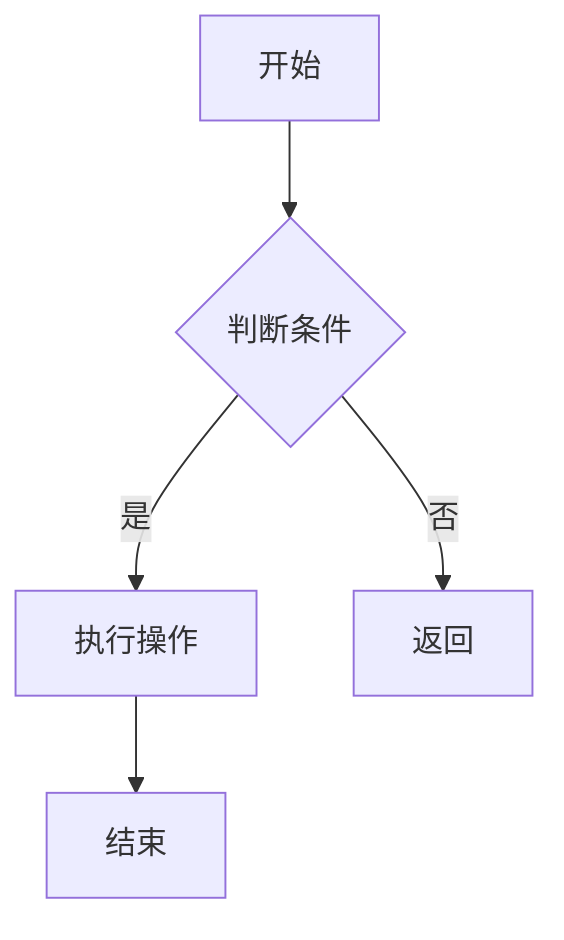

# Mermaid 图表完全指南

用代码画图——Mermaid 让你告别拖拽，用 Markdown 语法轻松绘制专业图表。

## 图表类型速览

```
01.基础入门 → 02.流程图 → 03.时序图 → 04.类图与ER图
                                         ↓
        08.综合实战 ← 07.其他图表 ← 06.甘特图与饼图 ← 05.状态图与Git图
```

| 编号 | 文章 | 图表类型 | 典型场景 |
|------|------|----------|----------|
| 01 | 基础入门 | 环境搭建/基本语法 | 安装配置，第一个 Mermaid 图 |
| 02 | 流程图完全指南 | 流程图 | 业务流程、算法逻辑、审批流 |
| 03 | 时序图完全指南 | 时序图 | API 调用链、微服务交互、登录流程 |
| 04 | 类图与ER图 | 类图/实体关系图 | 面向对象设计、数据库建模 |
| 05 | 状态图与Git图 | 状态图/Git图 | 订单状态机、分支管理可视化 |
| 06 | 甘特图与饼图 | 甘特图/饼图 | 项目排期、资源分配统计 |
| 07 | 其他图表合集 | 用户旅程图/象限图/思维导图 | 产品设计、技术决策 |
| 08 | 综合实战 | 多图联动 | 真实项目中的综合应用 |

## 为什么用 Mermaid？

| 传统画图 | Mermaid 代码画图 |
|----------|------------------|
| 拖拽对齐，费时费力 | 写几行代码即可 |
| 改图需要重新调整 | 改代码即改图 |
| 难以版本管理 | 纯文本，Git 完美管理 |
| 多人协作困难 | 和代码一起 PR/Review |

## 快速体验

````markdown

````

> **适用人群**：技术文档写作者、后端架构师、产品经理、所有用 Markdown 写文档的人。
