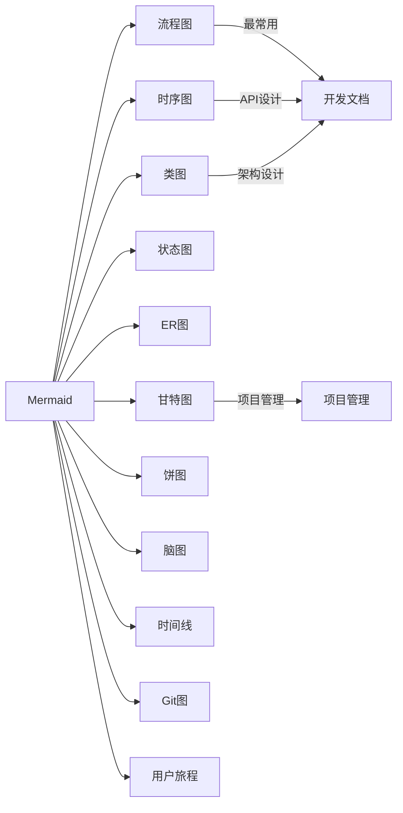
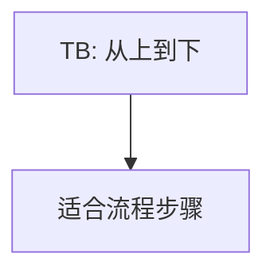
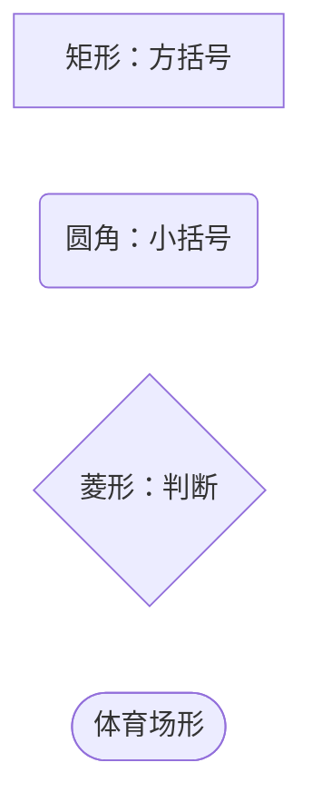
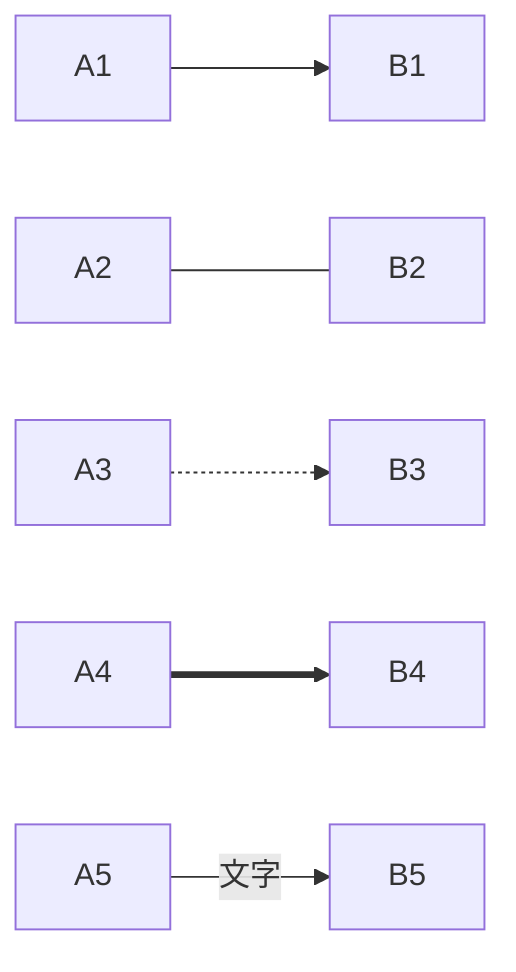
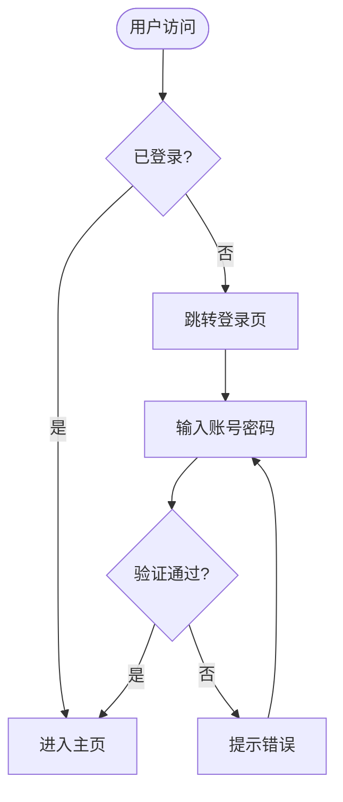

# Mermaid 基础入门

## 一、什么是 Mermaid

Mermaid 是一个基于文本的图表绘制工具。你写一段简单的文字描述，它自动渲染成流程图、时序图、甘特图等。

> 它的核心理念：**用代码画图，而不是用鼠标拖拽。**

和传统画图工具（Visio、draw.io、ProcessOn）相比：

| | Mermaid | 传统工具 |
|---|---|---|
| 编辑方式 | 纯文本代码 | 鼠标拖拽 |
| 版本管理 | 天然适合 Git | 二进制文件，难以 diff |
| 和文档整合 | 直接嵌入 Markdown | 图片引用，需单独管理 |
| 修改成本 | 改一行文字 | 重新拖拽对齐 |
| 学习曲线 | 看文档 30 分钟上手 | 上手快，精细调整费时间 |

Mermaid 被 GitHub、GitLab、Notion、Obsidian、VuePress 等平台原生支持，是目前最主流的文本绘图方案。

---

## 二、在 Markdown 中使用

```markdown
graph TD
    A[开始] --> B[处理]
    B --> C{判断}
    C -->|是| D[结束]
    C -->|否| B
```

关键：代码块指定语言为 `mermaid`，GitHub/VuePress/GitLab 都会自动渲染。


### 各平台支持情况

| 平台 | 支持方式 |
|------|---------|
| GitHub | 原生支持，直接写 ` ```mermaid ` 即可 |
| GitLab | 原生支持，还额外支持 PlantUML |
| VuePress | 需安装 `vuepress-plugin-mermaidjs` |
| Notion | 需通过 `/mermaid` 命令 |
| Obsidian | 社区插件 `Mermaid Tools` |
| VS Code | 安装 `Markdown Preview Mermaid Support` 插件 |

---

## 三、流程图速览

下面这张图展示了 Mermaid 能画的主要图表类型：



---

## 四、流程图基础语法

### 4.1 方向控制

流程图的方向由 `graph <方向>` 指定：

| 代码 | 含义 | 常用场景 |
|------|------|---------|
| `TB` / `TD` | 从上到下（Top→Bottom） | 流程步骤、决策树 |
| `BT` | 从下到上（Bottom→Top） | 逆向流程 |
| `LR` | 从左到右（Left→Right） | 横向流程、架构图 |
| `RL` | 从右到左（Right→Left） | 特殊布局 |



### 4.2 四种基础节点



```markdown
A[方括号：标准矩形]
B(圆括号：圆角矩形)
C{花括号：菱形判断}
D([体育场形：半圆角])
```

另外还有：

| 语法 | 形状 | 说明 |
|------|------|------|
| `A[文本]` | 矩形 | 最常用 |
| `A(文本)` | 圆角矩形 | 开始/结束 |
| `A{文本}` | 菱形 | 判断/分支 |
| `A([文本])` | 体育场形 | 流程端点 |
| `A[[文本]]` | 子程序形 | 子流程 |
| `A[(文本)]` | 圆柱形 | 数据库 |
| `A((文本))` | 圆形 | 连接点 |
| `A>文本]` | 旗帜形 | 标签 |
| `A{{文本}}` | 六边形 | 准备操作 |
| `A[/文本/]` | 平行四边形 | 输入/输出 |
| `A[\文本\]` | 反向平行四边形 | 输入/输出(反) |

### 4.3 箭头类型



```markdown
A --> B        实线箭头
A --- B        实线无箭头
A -.-> B       虚线箭头
A ==> B        粗箭头
A --文字--> B  带标签的箭头
A -.文字.-> B  虚线带标签
A ==文字==> B  粗线带标签
```

### 4.4 第一个完整流程图

做一个简单的登录流程：



```markdown

```

---

## 五、本章小结

| 学会的 | 说明 |
|--------|------|
| Mermaid 是什么 | 用纯文本代码画图 |
| 如何使用 | Markdown 代码块 ` ```mermaid ` |
| 四种基础节点 | `[]` 矩形、`()` 圆角、`{}` 菱形、`([])` 体育场 |
| 六种箭头 | `-->` `---` `-.->` `==>` 等 |
| 方向控制 | `graph LR` / `graph TB` |

> 🏃 下一篇：[流程图完全指南](./02.流程图完全指南.md)——11种节点形状、子图嵌套、样式美化、点击交互。
