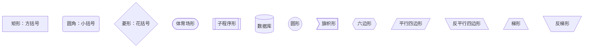
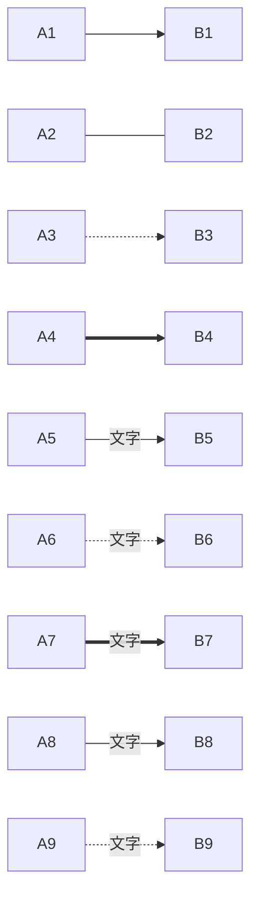
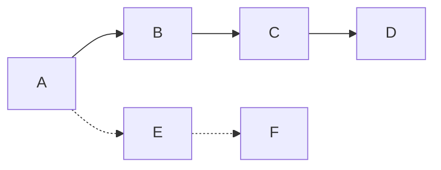
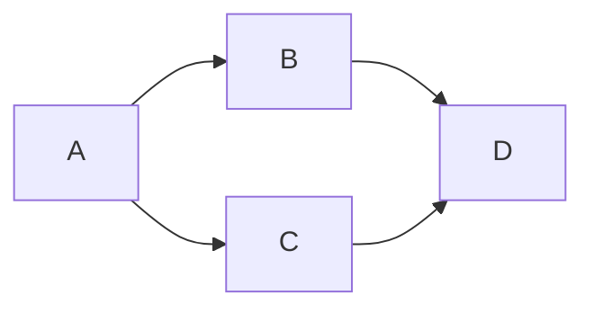
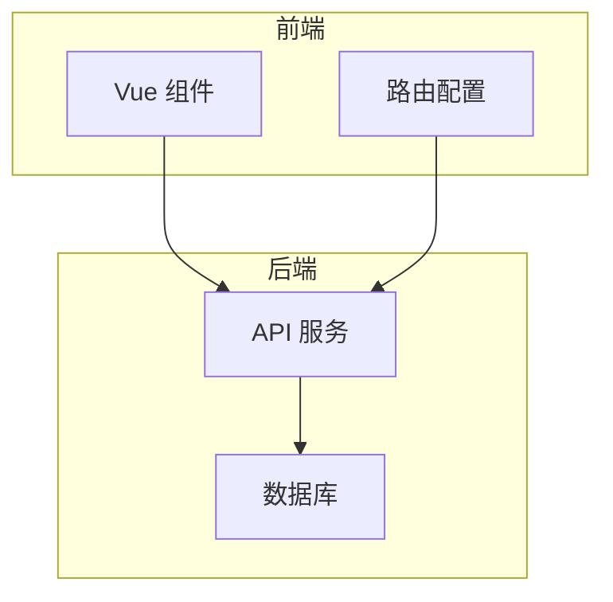
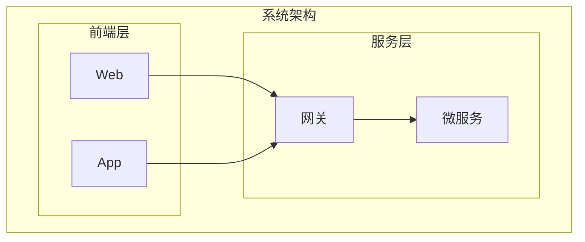
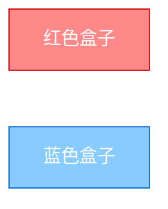
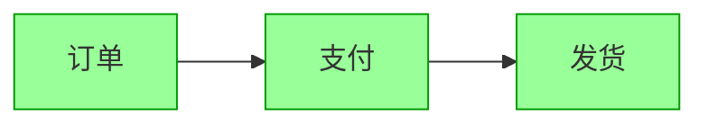
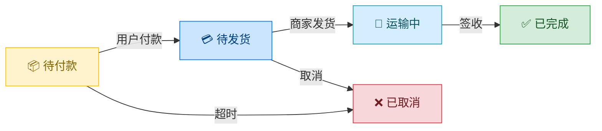
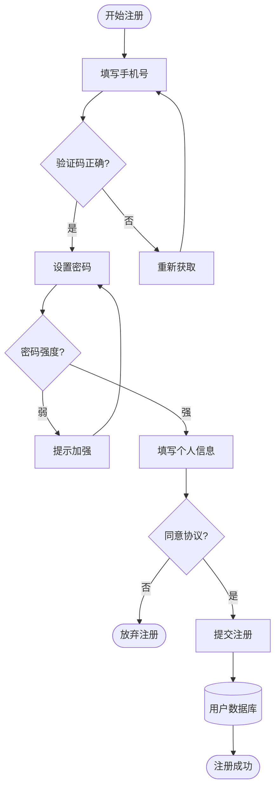

# Mermaid 流程图完全指南

## 一、全部节点形状速查



| 语法 | 形状 | 用途 |
|:-----|:-----|:-----|
| `A[文本]` | 矩形 | 通用节点 |
| `B(文本)` | 圆角 | 开始/结束 |
| `C{文本}` | 菱形 | 条件判断 |
| `D([文本])` | 体育场 | 流程端点 |
| `E[[文本]]` | 子程序 | 子流程/函数调用 |
| `F[(文本)]` | 圆柱 | 数据库/存储 |
| `G((文本))` | 圆形 | 连接点 |
| `H>文本]` | 旗帜 | 标签页 |
| `I{{文本}}` | 六边形 | 准备/初始化 |
| `J[/文本/]` | 平行四边 | 输入 |
| `K[\文本\]` | 反平行 | 输出 |

---

## 二、箭头大全



| 语法 | 效果 |
|:-----|:-----|
| `A --> B` | 实线箭头 |
| `A --- B` | 实线无箭头 |
| `A -.-> B` | 虚线箭头 |
| `A ==> B` | 粗箭头 |
| `A --文字--> B` | 带标签 |
| `A -.文字.-> B` | 虚线标签 |
| `A ==文字==> B` | 粗线标签 |
| `A -->\|文字\| B` | 竖线封装标签 |

### 多段连接



```markdown
A --> B --> C --> D      链式连接
A -.-> E -.-> F          虚线链条
```

### 多箭头



```markdown
A --> B & C --> D        A指向B和C，B和C都指向D
```

---

## 三、子图（Subgraph）

子图用于把相关节点圈在一个框里：



```markdown
subgraph 前端
    A[Vue 组件]
    B[路由配置]
end

subgraph 后端
    C[API 服务]
    D[数据库]
end
```

### 子图嵌套



### 子图方向

子图内部可以独立设置方向：

```markdown
subgraph LR
    A --> B
end
```

---

## 四、样式美化

### 4.1 单节点样式



```markdown
A[红色盒子]:::red
classDef red fill:#f88,stroke:#c00,color:#fff
```

**classDef 格式**：

```markdown
classDef 样式名 fill:填充色,stroke:边框色,stroke-width:边框宽,color:文字色
```

### 4.2 批量应用样式



```markdown
classDef green fill:#9f9,stroke:#090
class A,B,C green      批量应用
```

### 4.3 完整美化案例

一个电商订单状态流转图：



---

## 五、点击交互

部分平台（如 VuePress）支持节点点击跳转：

```markdown
A[GitHub] --> B
click A "https://github.com" "点击访问 GitHub"
```

```markdown
click A "https://github.com" "悬浮提示文字"
```

> ⚠️ GitHub 原生不支持 `click` 事件，主要用于导出 HTML 或 VuePress 场景。

---

## 六、实战：用户注册完整流程

```mermaid
graph TB
    Start([开始注册]):::start --> Input[填写手机号]:::input
    Input --> Verify{验证码正确?}:::judge
    Verify -->|是| SetPwd[设置密码]:::input
    Verify -->|否| Retry[重新获取]:::input
    Retry --> Input
    SetPwd --> PwdCheck{密码强度?}:::judge
    PwdCheck -->|弱| Alert[提示加强]:::warn
    Alert --> SetPwd
    PwdCheck -->|强| Profile[填写个人信息]:::input
    Profile --> Agree{同意协议?}:::judge
    Agree -->|否| End1([放弃注册]):::end
    Agree -->|是| Submit[提交注册]:::process
    Submit --> API[(用户数据库)]:::db
    API --> Success([注册成功]):::done
    
    classDef start fill:#e1f5fe,stroke:#01579b,stroke-width:2px
    classDef input fill:#fff,stroke:#78909c
    classDef judge fill:#fff9c4,stroke:#f57f17,stroke-width:2px
    classDef warn fill:#ffecb3,stroke:#ff8f00
    classDef process fill:#c8e6c9,stroke:#2e7d32
    classDef db fill:#e8eaf6,stroke:#283593,stroke-width:2px
    classDef done fill:#b9f6ca,stroke:#00c853,stroke-width:3px
    classDef end fill:#ffcdd2,stroke:#c62828
```

**源码**：

````markdown

````

---

## 七、速查卡片

```
┌──────────────────────────────────────────────┐
│              Mermaid 流程图速查               │
├──────────────────────────────────────────────┤
│ 方向：graph TB / LR / BT / RL                │
│                                              │
│ 节点：[]矩形 ()圆角 {}菱形 ([])体育场          │
│       [[]]子程序 [()]圆柱 (())圆形            │
│       >]旗帜 {{}}六边形  // 平行四边形          │
│                                              │
│ 箭头：--> 实线  --- 无线  -.-> 虚线  ==> 粗线  │
│        --文字--> 带标签                       │
│                                              │
│ 子图：subgraph 名称 ... end                   │
│                                              │
│ 样式：classDef name fill:色,stroke:色         │
│       class A,B name                         │
│                                              │
│ 样式：style A fill:#fff,stroke:#000          │
│ 链接：click A "url" "提示"                    │
└──────────────────────────────────────────────┘
```

> 🏃 下一篇：[时序图完全指南](https://yccoding.com/pages/mermaid-sequence/)——参与者、生命线、异步消息、并发、循环、分组。
