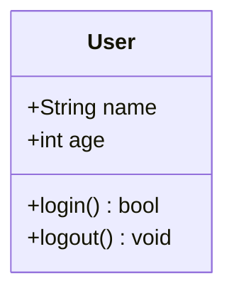
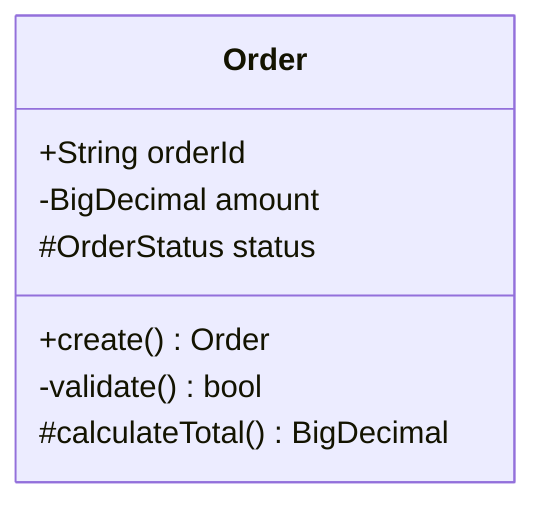
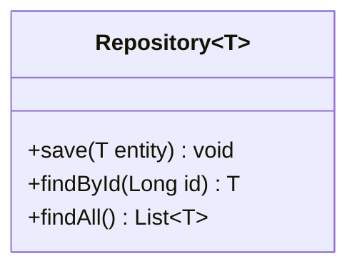
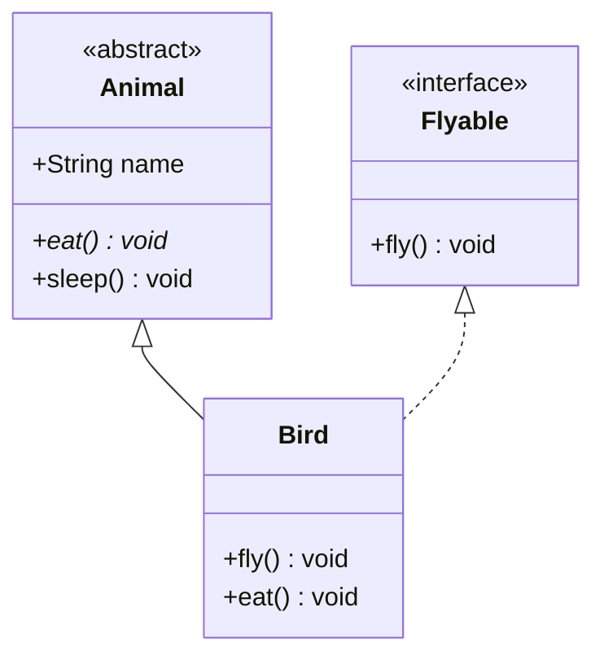
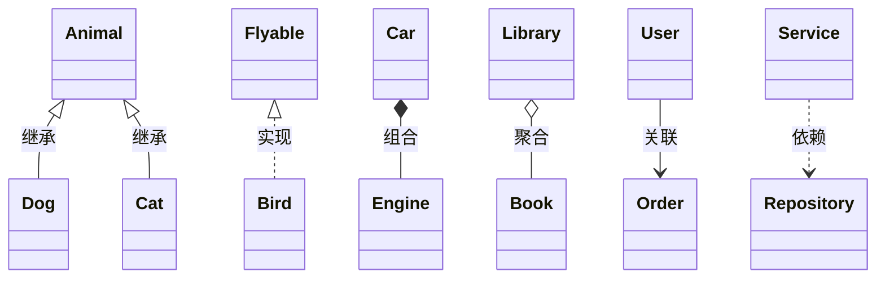
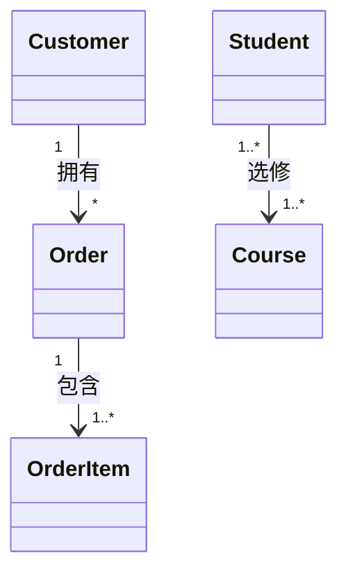
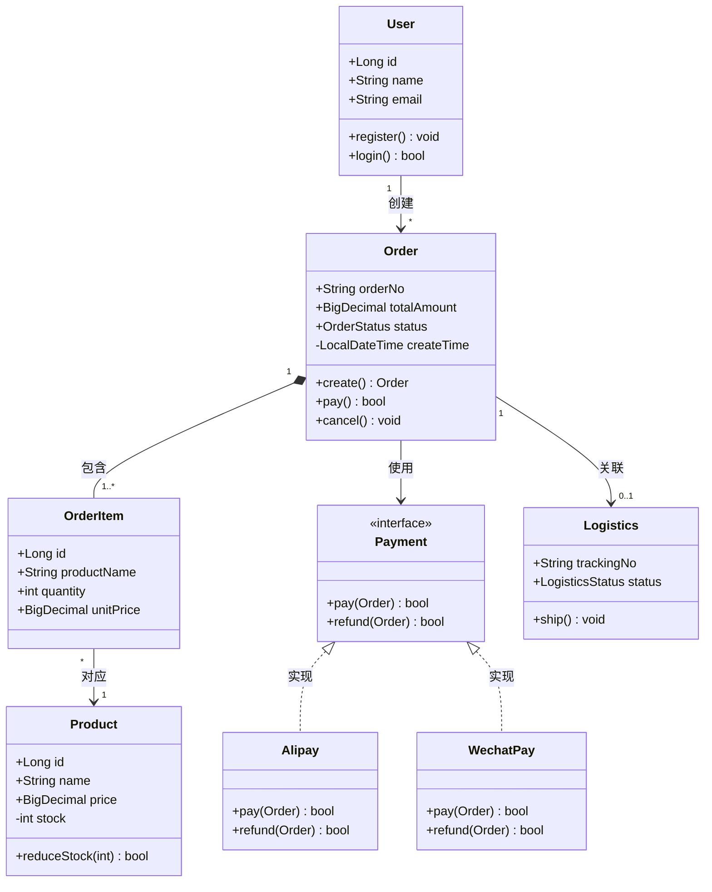
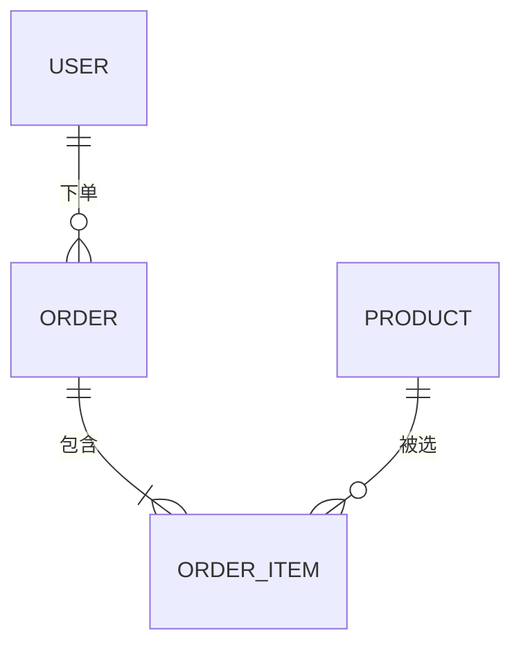
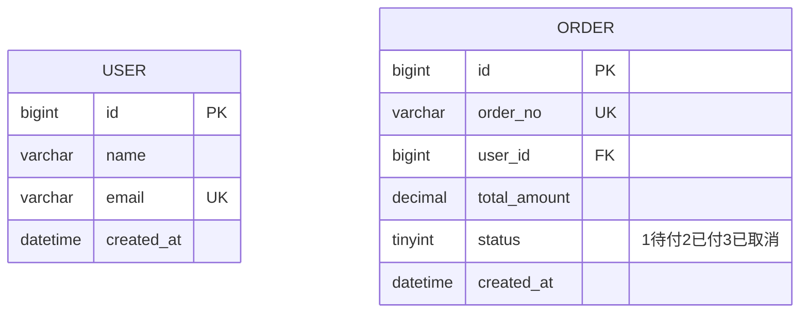
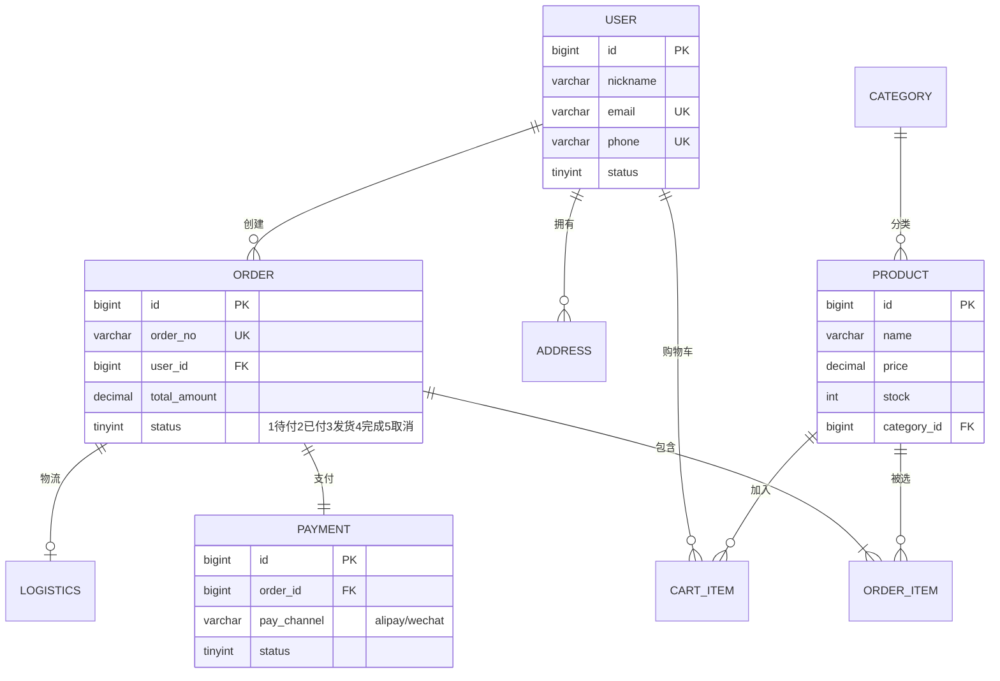

# Mermaid 类图与 ER 图

## 一、类图解决什么问题

类图描述**系统中类的结构以及类之间的关系**。在做架构设计、代码评审、或者看开源项目时，一张类图胜过千言万语。

---

## 二、类定义

### 2.1 基础语法



**成员可见性符号**：

| 符号 | 含义 |
|:-----|:-----|
| `+` | public |
| `-` | private |
| `#` | protected |
| `~` | package/internal |

### 2.2 属性与方法类型



用括号 `()` 区分方法和属性：

```markdown
+String name          属性：可见性 + 类型 + 名称
+login() bool         方法：可见性 + 名称() + 返回类型
```

### 2.3 泛型



```markdown
class Repository~T~          类定义泛型
List~T~                       属性/返回类型泛型
```

### 2.4 抽象类和接口



```markdown
<<abstract>>    抽象类标记
<<interface>>   接口标记
*               抽象方法（方法后加 *）
```

---

## 三、六种关系

| 关系 | 语法 | 含义 | 代码体现 |
|:-----|:-----|:-----|:-----|
| 继承 | `<\|--` | is-a | `class Dog extends Animal` |
| 实现 | `<\|..` | can-do | `class Bird implements Flyable` |
| 组合 | `*--` | has-a（强） | 成员变量，同生命周期 |
| 聚合 | `o--` | has-a（弱） | 成员变量，独立生命周期 |
| 关联 | `-->` | uses-a | 方法参数/返回值 |
| 依赖 | `..>` | depends-on | 局部变量/静态调用 |



### 关系标签与基数



```markdown
"1"      一个
"0..1"   零或一个
"1..*"   一到多个
"*"      零到多个
"n"      精确n个
```

---

## 四、实战：电商订单领域模型



---

## 五、ER 图（Entity Relationship）

ER 图描述数据库表之间的关系，替代 Excel 画表结构。

### 5.1 基础语法



```markdown
||    必须一
|o    一或零
}|    一或多
}o    零或多
```

### 5.2 实体定义



```markdown
PK    主键
UK    唯一键
FK    外键
"注释" 字段说明
```

### 5.3 实战：电商数据库 ER 图



---

## 六、速查

```
┌──────────────────────────────────────────────┐
│            Mermaid 类图 & ER图速查            │
├──────────────────────────────────────────────┤
│ 类图                                         │
│ class Name { +属性 -方法() }                  │
│ <<abstract>>  <<interface>>  <<enum>>        │
│ <|-- 继承  <|.. 实现  *-- 组合  o-- 聚合     │
│ --> 关联  ..> 依赖                           │
│ class Name~T~   泛型                         │
│                                              │
│ ER图                                         │
│ ENTITY { type name KEY }                     │
│ ||--|| 一对一  ||--o{ 一对多                 │
│ }|--|{ 多对多  ||--o| 一或零                  │
│ PK 主键  UK 唯一  FK 外键                    │
└──────────────────────────────────────────────┘
```

> 🏃 下一篇：[状态图与Git图](./05.状态图与Git图.md)——状态流转、复合状态、分支合并、Git分支提交可视化。
