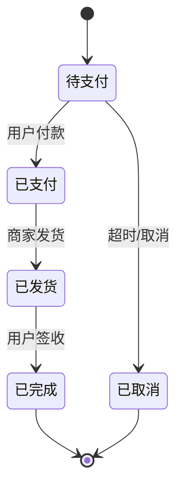
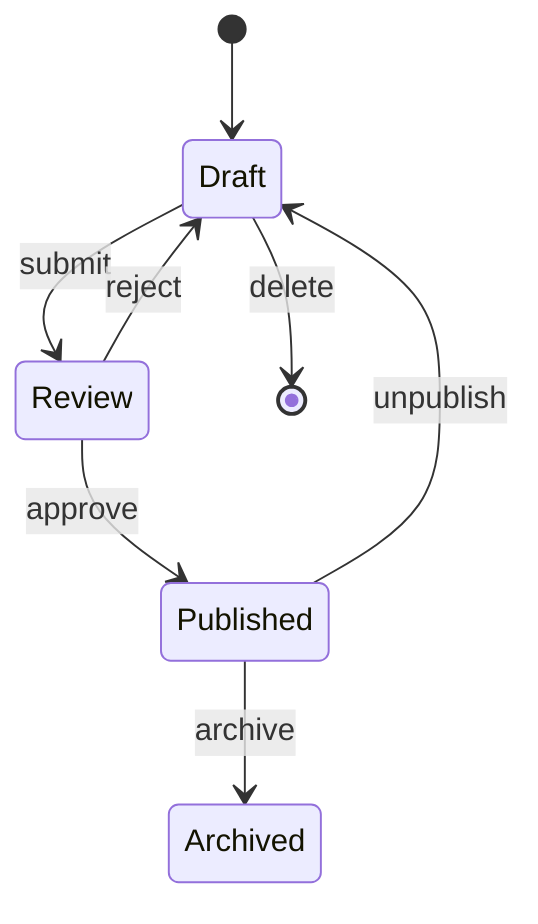
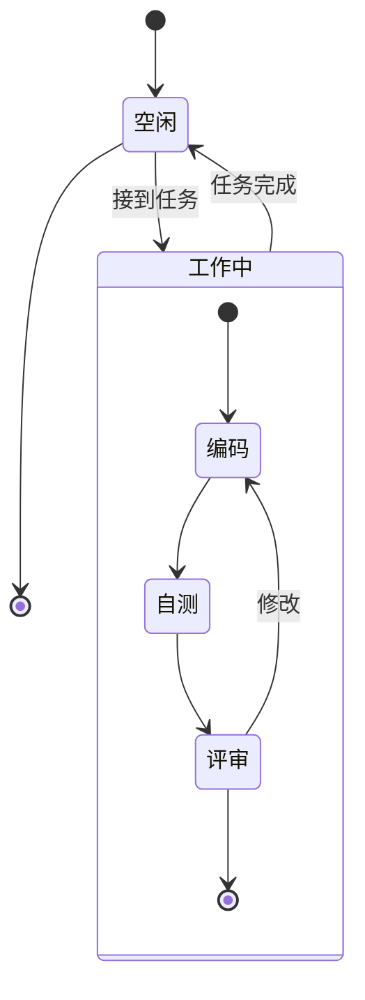
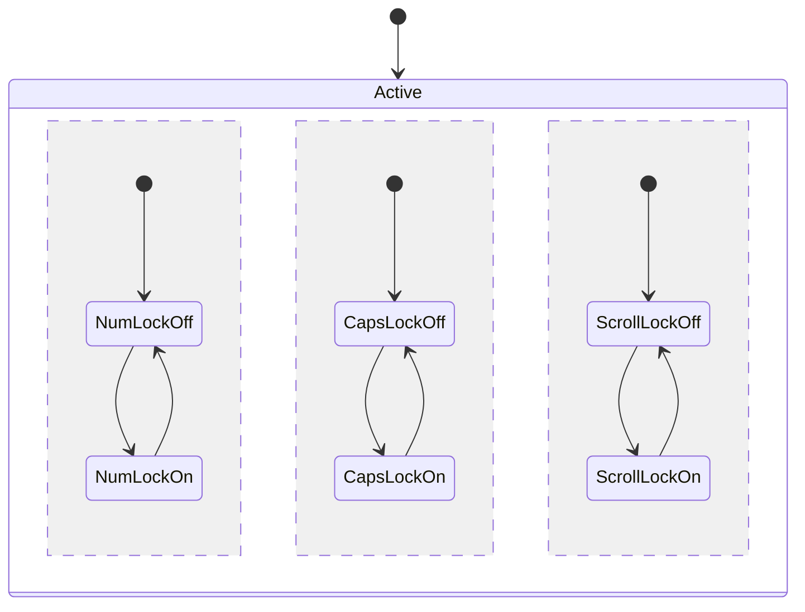
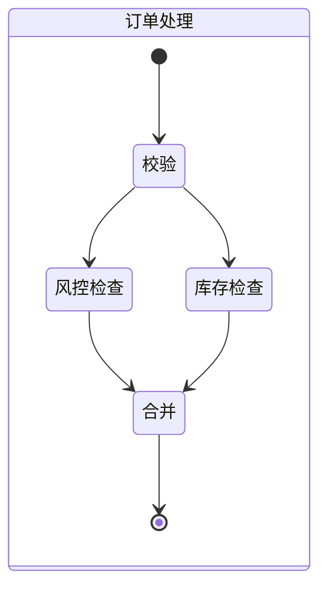
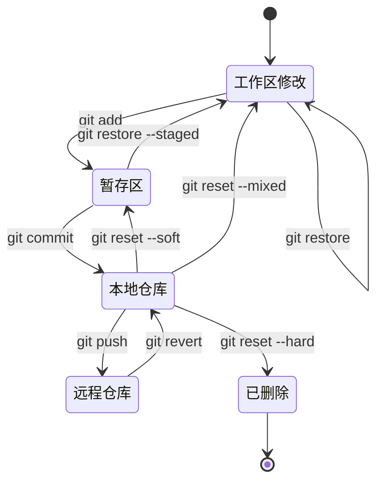
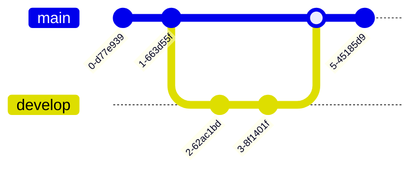
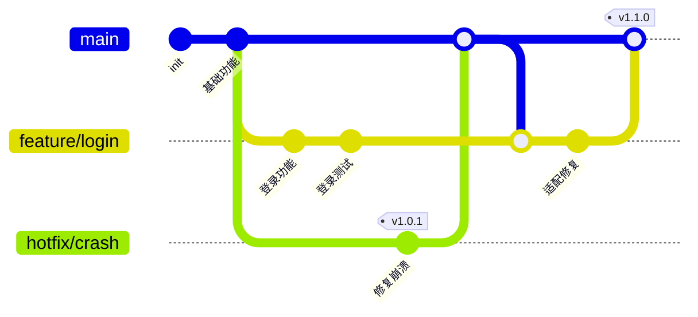

# Mermaid状态图Git图完全指南

## 一、状态图（State Diagram）

状态图描述**一个对象从创建到销毁经历的所有状态，以及触发状态转换的事件**。最适合画订单状态、工作流、审批流。

### 1.1 基础语法



```markdown
[*]                  起点或终点
状态名 --> 状态名     状态转换
: 说明文字             转换标签
```

### 1.2 带转换描述



---

## 二、复合状态（Composite State）

一个状态内部可以包含子状态：



---

## 三、并发状态（Concurrent State）



```markdown
--     分隔并发子状态
```

---

## 四、分支（Fork/Join）



---

## 五、实战：Git 提交状态流转



---

## 六、Git 图（gitGraph）

Git 图直接用 Mermaid 画出分支结构和提交历史，最适合讲解 Git 工作流。

### 6.1 基础语法



```markdown
gitGraph           声明 Git 图
commit             在当前分支提交
commit id: "hash"  指定 commit id
branch name        创建分支
checkout name      切换分支
merge name         合并分支
```

### 6.2 标签与反向合并



### 6.3 实战：Git Flow 可视化


---

## 七、速查

```
┌──────────────────────────────────────────────┐
│           Mermaid 状态图 & Git图速查          │
├──────────────────────────────────────────────┤
│ 状态图                                        │
│ [*]           起点/终点                       │
│ state 名 {}   复合状态                        │
│ --            并发分隔                        │
│ : 文字         转换标签                        │
│                                              │
│ Git图                                         │
│ commit        在当前分支提交                  │
│ commit tag:"" 提交并打标签                    │
│ branch name   创建分支                        │
│ checkout name 切换分支                        │
│ merge name    合并分支                        │
└──────────────────────────────────────────────┘
```

> 🏃 下一篇：[甘特图与饼图](https://yccoding.com/pages/mermaid-gantt-pie/)——项目排期、任务管理、数据占比可视化。
