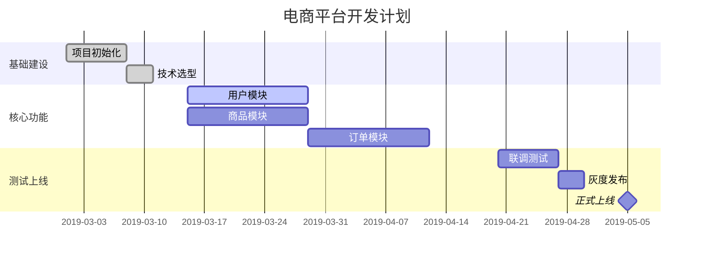
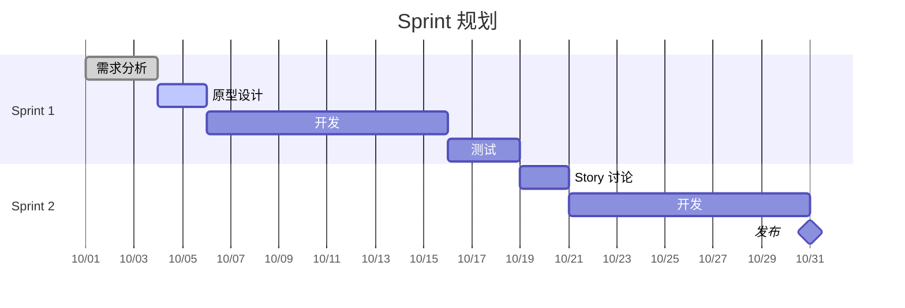
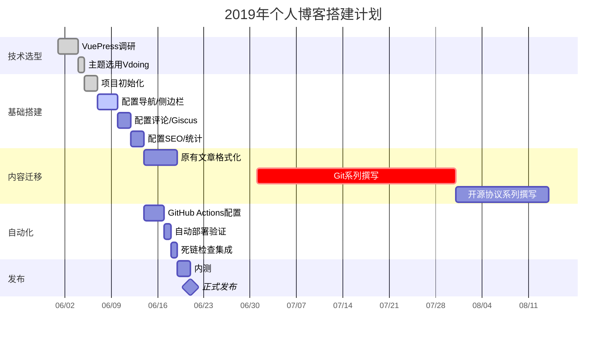
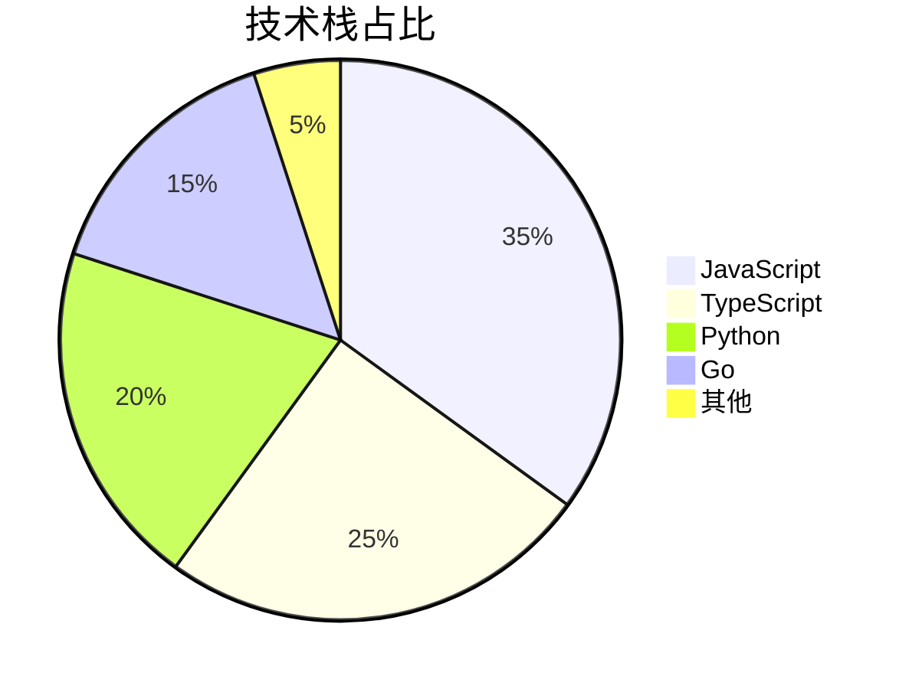
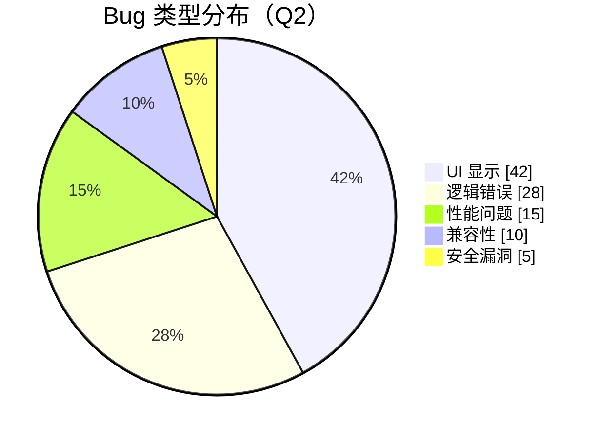
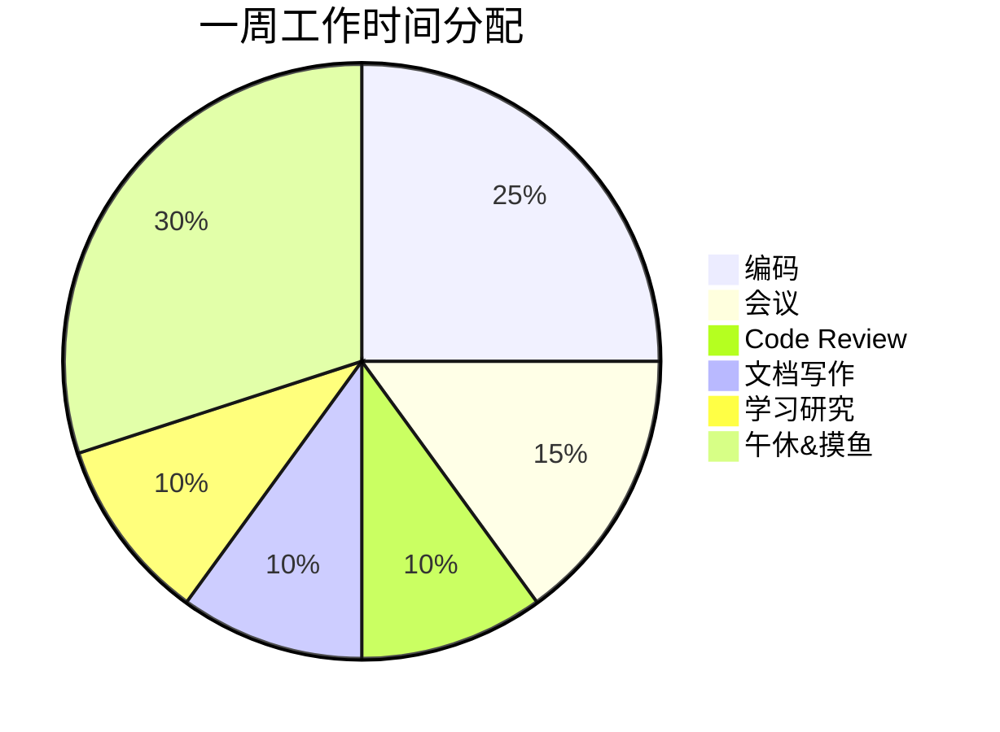

# Mermaid 甘特图与饼图

## 一、甘特图（Gantt Chart）

甘特图展示**项目时间线和任务排期**，是项目管理的核心工具。

### 1.1 基础语法



**任务状态标记**：

| 标记 | 含义 |
|:-----|:-----|
| `done` | 已完成（灰色） |
| `active` | 进行中（蓝色） |
| `crit` | 关键任务（红色） |
| 无标记 | 待开始 |
| `milestone` | 里程碑（菱形标记） |

### 1.2 两种时间格式

```markdown
dateFormat YYYY-MM-DD                    日期格式
a1, 2019-03-01, 7d                       指定起始日期 + 持续天数

after a1, 5d                             在任务a1之后开始
until a2                                 直到任务a2完成时结束
2019-03-01, 2019-03-15                   起始→终止日期
```

### 1.3 简化版（用周/天表示）



### 1.4 实战：一个完整项目的甘特图



---

## 二、饼图（Pie Chart）

### 2.1 基础语法



```markdown
pie [showData]
    title 图表标题
    "数据项1" : 数值
    "数据项2" : 数值
```

加上 `showData` 可以在图例中显示数值。

### 2.2 实战场景

**场景1：项目 Bug 类型分布**



**场景2：团队时间分配**



---

## 三、实践技巧

### 3.1 甘特图最佳实践

- **section 分类**：按团队或模块名称拆分 section
- **里程碑用 `milestone`**：发布、转测等关键节点
- **关键任务标 `crit`**：让风险和阻塞点醒目
- **粒度控制**：一页不要超过 30 个任务，否则失去全局视角
- **用 `after` 而不是硬编码日期**：上游任务变动后自动联动

### 3.2 饼图最佳实践

- **数据项不超过 6-8 个**：过多的小块难以阅读
- **合并"其他"**：占比较小的项统一归入"其他"
- **搭配百分比**：用 `showData` 显示具体数字
- **颜色自动分配**：Mermaid 自动给每块不同颜色

---

## 四、速查

```
┌──────────────────────────────────────────────┐
│          Mermaid 甘特图 & 饼图速查            │
├──────────────────────────────────────────────┤
│ 甘特图                                        │
│ dateFormat YYYY-MM-DD   日期格式              │
│ :done, id, date, days   已完成任务            │
│ :active, id, date, days 进行中任务            │
│ :crit, id, date, days   关键任务              │
│ :milestone, id, date, 0d 里程碑               │
│ after taskId            在任务后开始          │
│                                              │
│ 饼图                                          │
│ pie [showData]          带数据标注             │
│ "名称" : 数值            数据项               │
└──────────────────────────────────────────────┘
```

> 🏃 下一篇：[其他图表合集](https://yccoding.com/pages/mermaid-other/)——脑图、时间线、用户旅程图、C4架构图、Git图、需求图、桑基图。
