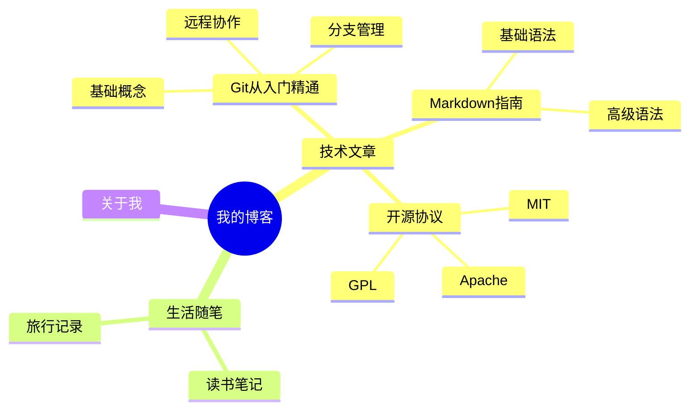
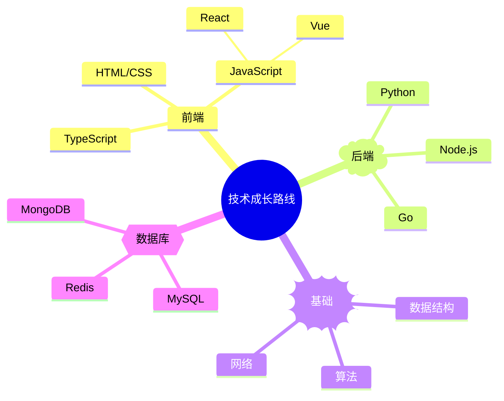
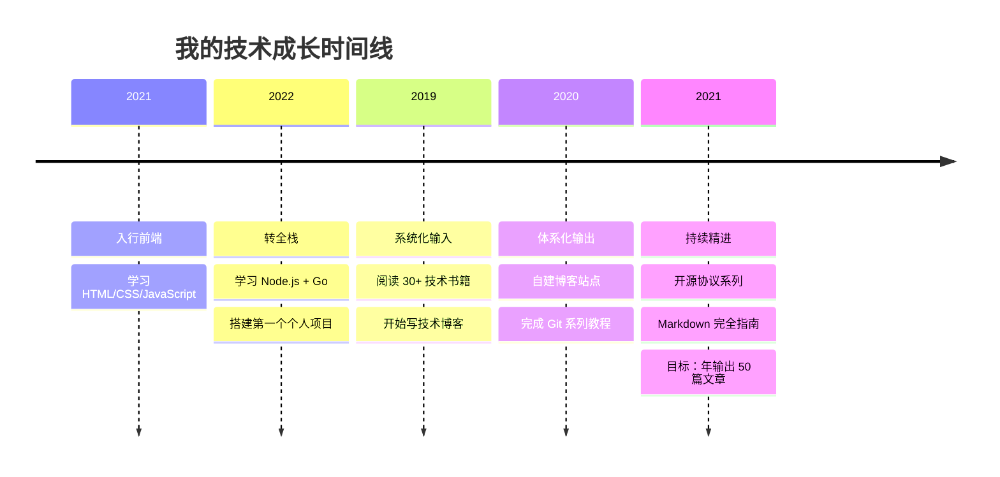
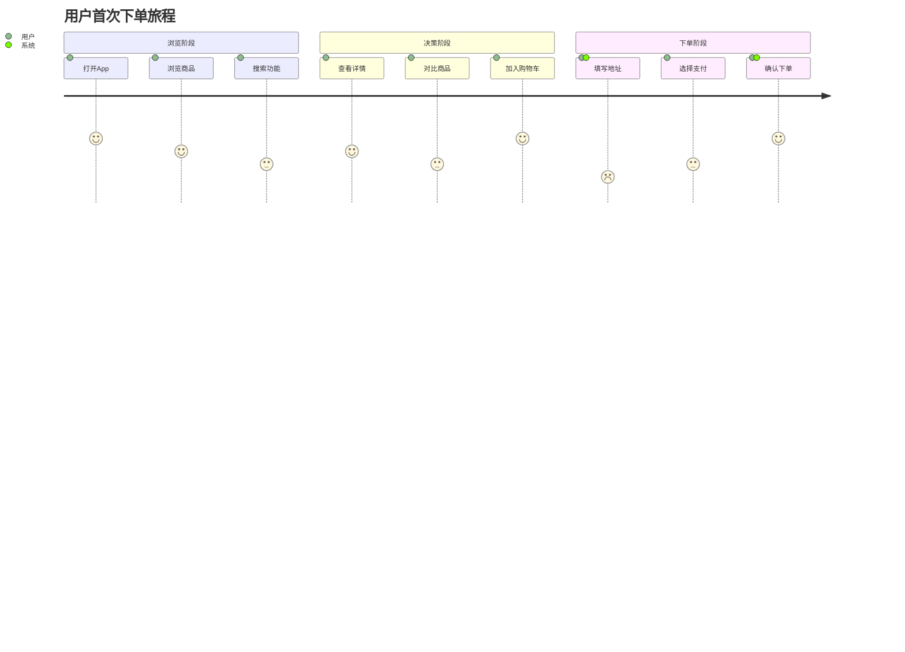
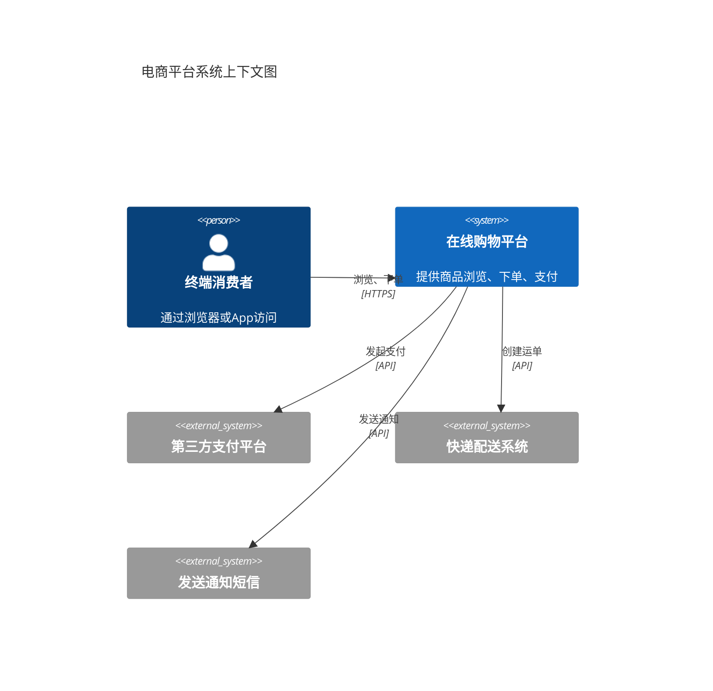
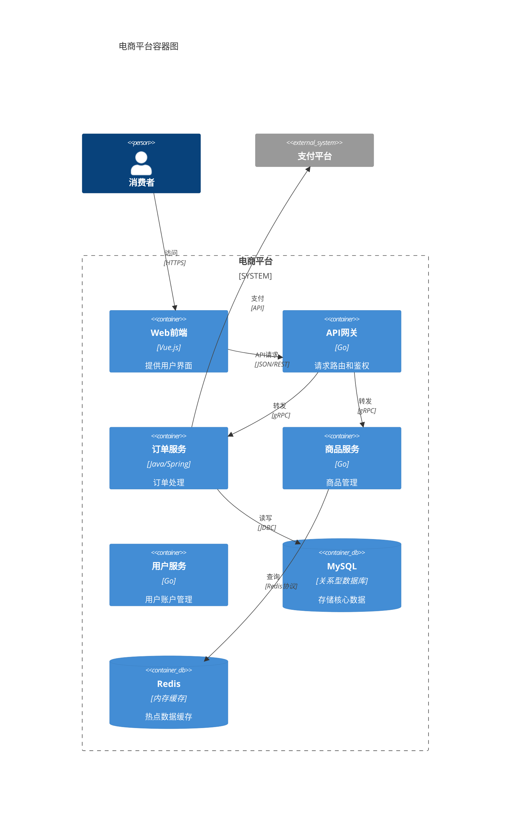
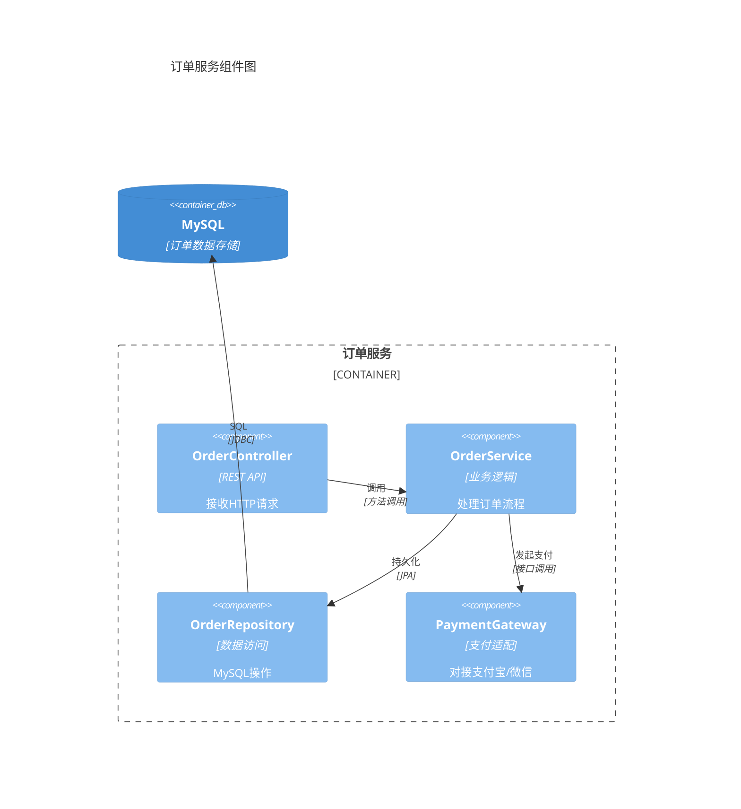
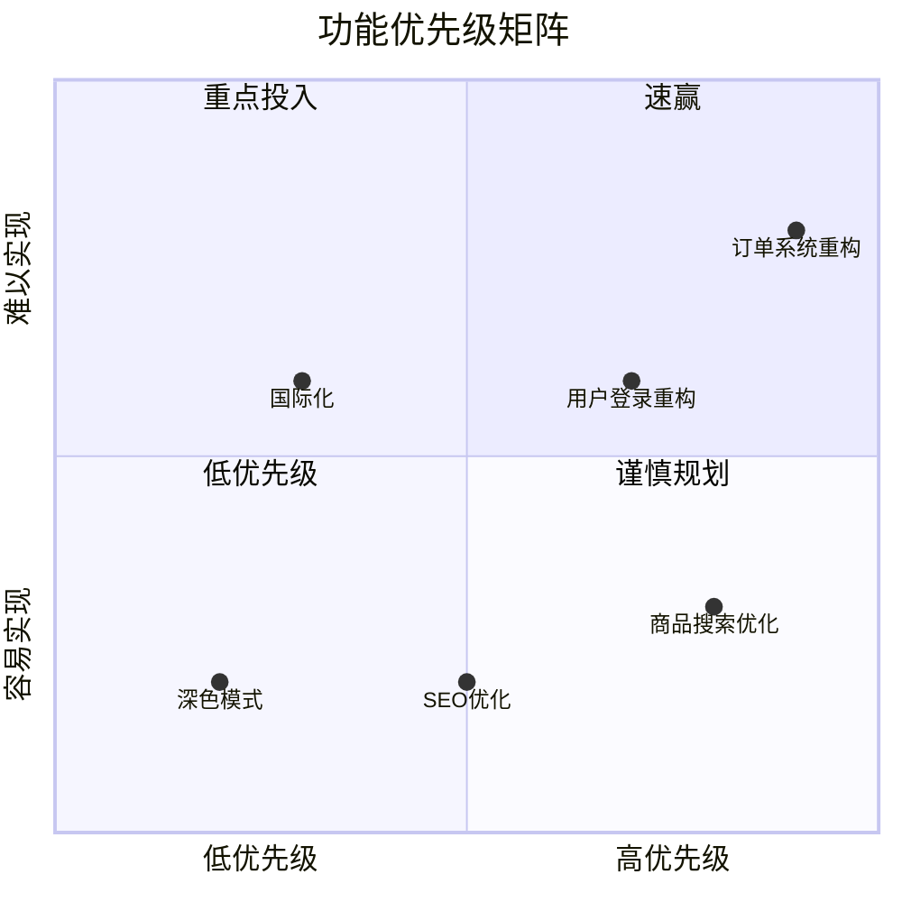

# Mermaid 其他图表合集

## 一、图表总览

前六篇覆盖了流程图、时序图、类图、ER图、状态图、Git图、甘特图、饼图。本篇补全剩余类型：

| 图表 | 用途 | 常用度 |
|:-----|:-----|:------:|
| Mindmap | 脑图/思维导图 | ⭐⭐⭐ |
| Timeline | 时间线/里程碑 | ⭐⭐ |
| User Journey | 用户体验地图 | ⭐⭐ |
| C4 Diagram | 软件架构图 | ⭐⭐⭐ |
| Sankey | 流量/能量流转 | ⭐ |
| XY Chart | 柱状图/折线图 | ⭐ |
| Quadrant Chart | 四象限图 | ⭐ |
| Requirement | 需求关系图 | ⭐ |

---

## 二、脑图（Mindmap）

### 2.1 基础语法



用**缩进**表示层级关系，支持最多六层嵌套。

### 2.2 带形状标记



| 语法 | 效果 |
|:-----|:-----|
| `root((文字))` | 圆形中心 |
| `)文字(` | 圆角矩形 |
| `))文字((` | 云形 |
| `{{文字}}` | 六边形 |
| `[文字]` | 矩形（默认） |

---

## 三、时间线（Timeline）



---

## 四、用户旅程图（User Journey）



```markdown
: 满意度分数 : 参与者1, 参与者2
```

分数范围 1~5，参与者逗号分隔。

---

## 五、C4 架构图

C4 模型（Context-Container-Component-Code）是业界标准的软件架构可视化方法。

### 5.1 系统上下文图（Level 1）



### 5.2 容器图（Level 2）



### 5.3 组件图（Level 3）



---

## 六、桑基图（Sankey）

展示流量、能量或资金的流动路径：

```mermaid
---
config:
  sankey:
    showValues: true
---
sankey-beta
    用户访问,首页, 10000
    首页,商品列表, 8000
    首页,搜索结果, 2000
    商品列表,商品详情, 5000
    搜索结果,商品详情, 1500
    商品详情,加入购物车, 3000
    商品详情,直接购买, 1500
    商品列表,离开, 3000
    搜索结果,离开, 500
    商品详情,离开, 2000
    加入购物车,下单成功, 2000
    直接购买,下单成功, 1200
    加入购物车,放弃, 1000
```

> ⚠️ Sankey 目前为 beta 版本，部分平台可能不支持。

---

## 七、需求图（Requirement Diagram）

```mermaid
requirementDiagram
    requirement 用户登录 {
        id: FR-001
        text: 支持手机号和邮箱两种方式
    }
    
    requirement 密码安全 {
        id: FR-002
        text: 密码长度>=8位，含大小写数字
    }
    
    requirement 登录速率限制 {
        id: NFR-001
        text: 同IP每分钟最多尝试5次
    }
    
    element 登录页面
    
    登录页面 - satisfies -> 用户登录
    用户登录 - contains -> 密码安全
    用户登录 - traces -> 登录速率限制
```

---

## 八、象限图（Quadrant Chart）

常用于优先级评估（如重要-紧急矩阵）：



---

## 九、图表选择指南

```
你需要展示什么？
│
├── 流程/步骤
│   ├── 线性步骤 → 流程图
│   ├── 带分支判断 → 流程图（菱形判断）
│   └── 参与者按时间交互 → 时序图
│
├── 结构/关系
│   ├── 代码类结构 → 类图
│   ├── 数据库表关系 → ER图
│   └── 系统架构层次 → C4图
│
├── 状态/生命周期
│   ├── 对象状态变化 → 状态图
│   └── 分支提交历史 → Git图
│
├── 时间/排期
│   ├── 项目计划 → 甘特图
│   └── 时间线回顾 → 时间线
│
├── 数据占比
│   ├── 百分比分布 → 饼图
│   └── 流量流转 → 桑基图
│
├── 思维/创意
│   ├── 知识整理 → 脑图
│   └── 优先级排序 → 象限图
│
└── 需求/旅程
    ├── 需求追踪 → 需求图
    └── 用户情绪 → 用户旅程图
```

> 🏃 下一篇：[综合实战](https://yccoding.com/pages/mermaid-practice/)——用 5 种图表讲一个完整的系统架构故事。
