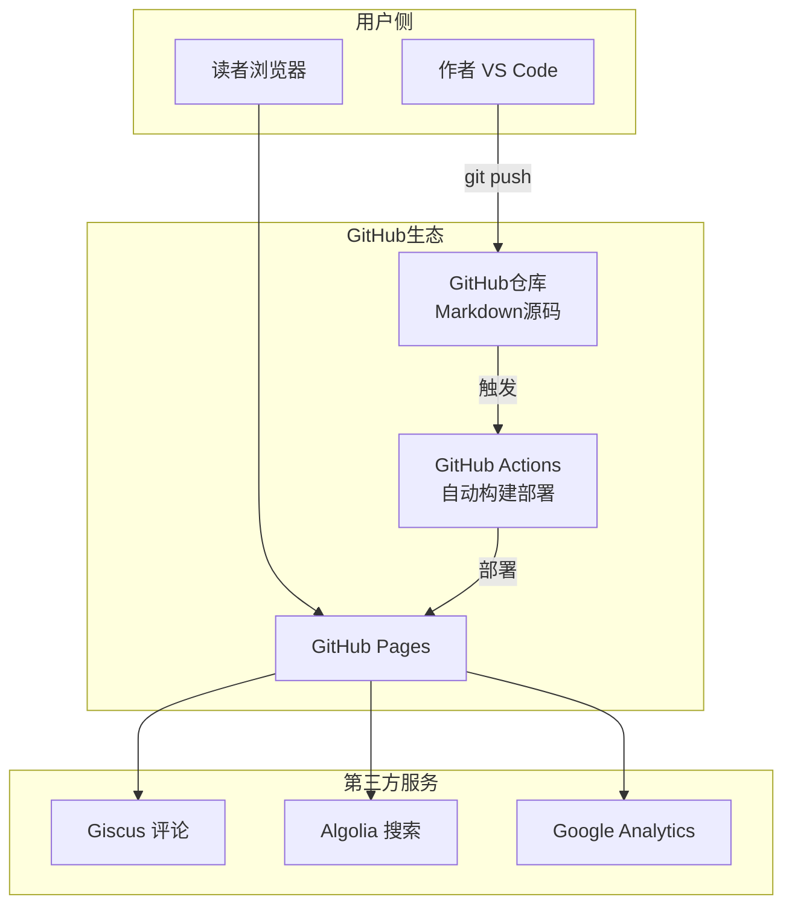
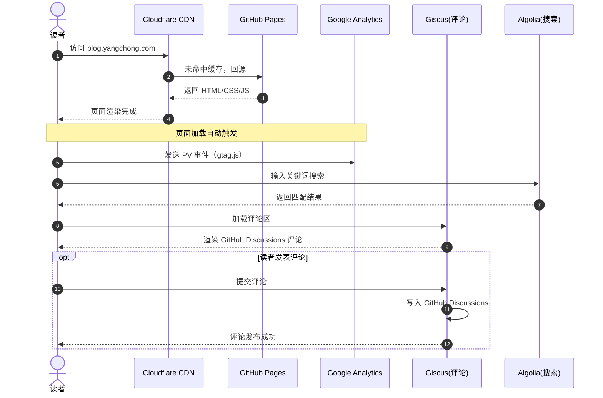
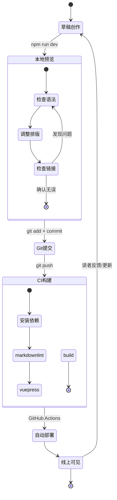
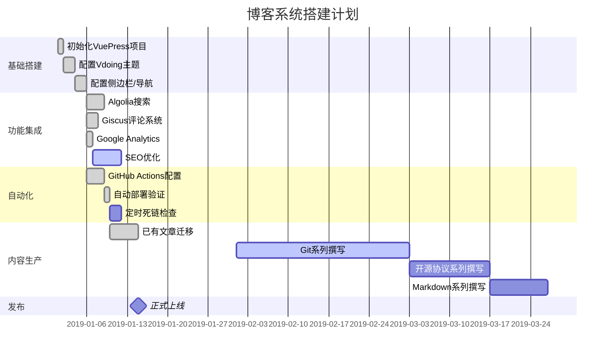
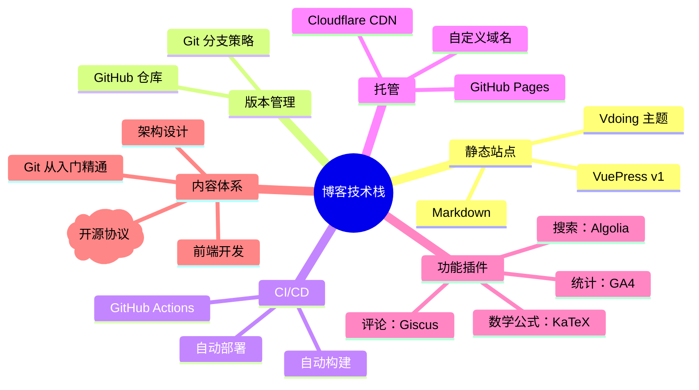

# Mermaid 综合实战

## 场景设定

你要从零搭建一个**个人技术博客系统**。这套系统需要：

- 一个自建站点（VuePress），部署在 GitHub Pages 上
- 文章通过 Markdown 编写，Git 管理版本
- 读者可以评论、搜索、订阅
- 你一个人完成全部工作

下面用 Mermaid 的 **5 种图表** 把这个项目讲清楚。

---

## 图一：系统架构图（C4 + Flowchart）

---

## 图二：用户访问全链路（时序图）

---

## 图三：Markdown → 线上文章（状态图）

---

## 图四：开发计划（甘特图）

---

## 图五：技术选型脑图

---

## 复盘：为什么选择 Mermaid

对比一下用传统工具和 Mermaid 画上面 5 张图的工作量：

| | Visio/draw.io | Mermaid |
|---|---|---|
| 图一（架构图） | 拖拽 8 个框 + 8 条线，30 分钟 | 写 20 行文字，3 分钟 |
| 图二（时序图） | 手动对齐箭头和文字，45 分钟 | 写 30 行文字，5 分钟 |
| 图三（状态图） | 画圆角矩形 + 箭头 + 对齐，30 分钟 | 写 25 行文字，3 分钟 |
| 图四（甘特图） | 最痛苦，逐条画彩色条，60 分钟 | 写 25 行文字，3 分钟 |
| 图五（脑图） | 手动画层级框 + 连线，20 分钟 | 写 15 行带缩进的文字，2 分钟 |
| **修改其中一张** | 重新拖拽，10-30 分钟 | 改 2 行文字，10 秒 |
| **版本管理** | 二进制文件，无法 diff | 纯文本，和代码一起 Git |
| **总计** | ~3 小时 | ~15 分钟 |

**关键差距不在画图速度，而在修改成本。** 架构演进时，用 Visio 改图就像用铅笔改墨水画——越改越脏。用 Mermaid 就像用代码重构——改一行，全局生效。

---

## 全文总结：Mermaid 八篇总览

| 篇 | 内容 | 核心图表 |
|:--:|:-----|:-----|
| 01 | 基础入门 | 流程图基础 |
| 02 | 流程图完全指南 | 11种节点 + 子图 + 样式 + 交互 |
| 03 | 时序图完全指南 | 参与者、消息、激活、循环、并发 |
| 04 | 类图与ER图 | 类定义、6种关系、实体关系 |
| 05 | 状态图与Git图 | 状态流转、复合状态、Git分支 |
| 06 | 甘特图与饼图 | 项目排期、数据占比 |
| 07 | 其他图表合集 | 脑图、时间线、旅程图、C4、桑基图 |
| 08 | 综合实战 | 5种图表讲一个项目 |

> 📌 **记住一个原则**：Mermaid 的核心价值不是"画得好看"，而是 **"把图表纳入版本管理"**。你的架构图、流程图和代码放在同一个 Git 仓库里，一起提交、一起审查、一起演化。这才是它真正的威力。
