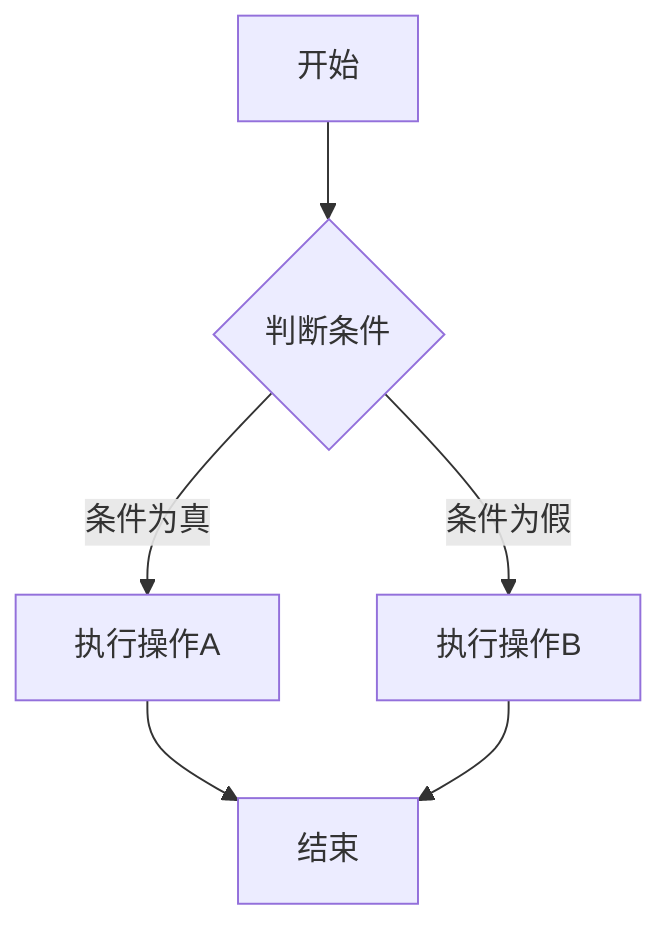
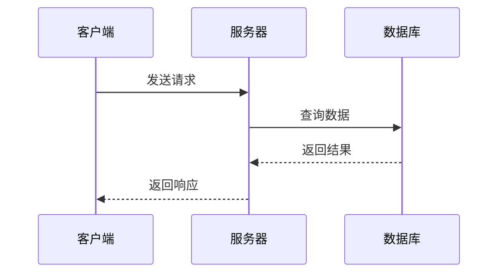
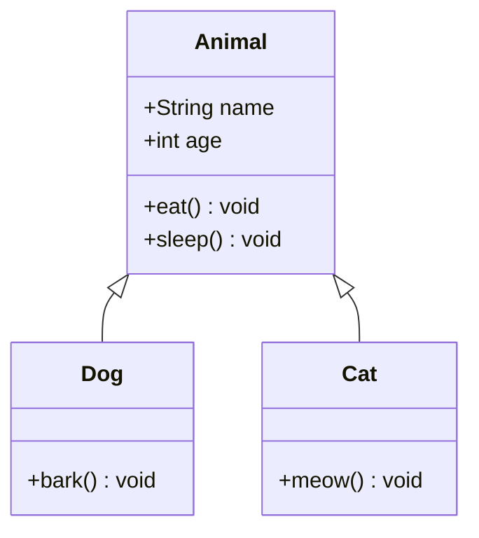
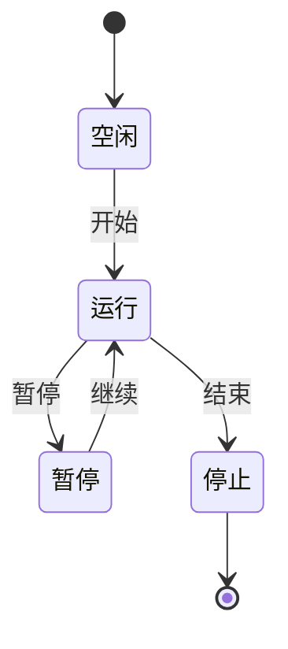
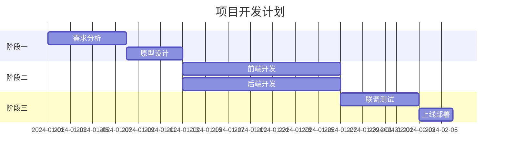
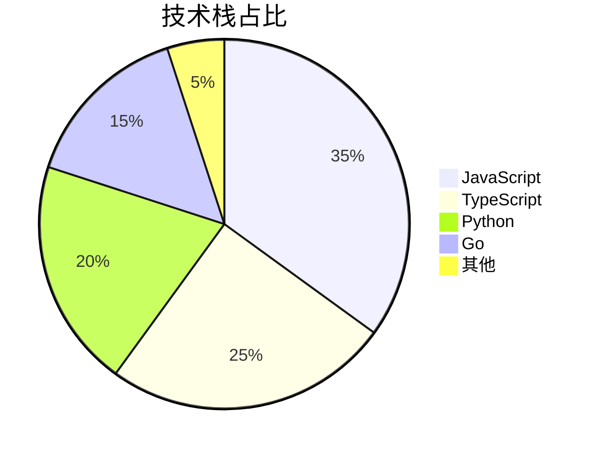
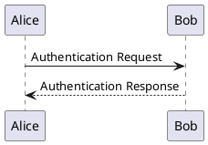

# Markdown 从零到一完全指南

## 一、前言

### 1.1 什么是 Markdown

Markdown 是一种轻量级标记语言，由 John Gruber 于 2004 年创建。它的核心理念是「**易读易写**」——用纯文本格式编写文档，通过简单的符号标记排版，最终可以转换成 HTML、PDF、Word 等多种格式。

Markdown 的文件扩展名通常是 `.md` 或 `.markdown`。今天你在 GitHub、GitLab、Notion、Obsidian、Typora、VuePress 等几乎所有开发者工具中都能看到它的身影。

### 1.2 为什么学习 Markdown

- **所有开发者都在用**：GitHub 的 README、Issue、Pull Request 全部使用 Markdown
- **效率极高**：手不离开键盘，纯文本操作，排版速度快 3-5 倍
- **跨平台**：纯文本文件，任何编辑器都能打开，永不格式错乱
- **版本管理友好**：纯文本便于 Git 追踪变更、diff 对比
- **扩展性强**：支持 HTML、LaTeX 数学公式、Mermaid 图表、代码高亮等

### 1.3 Markdown 的方言与标准

由于原始 Markdown 语法过于简单，社区衍生出多种「方言」，其中 **CommonMark** 和 **GitHub Flavored Markdown (GFM)** 最为主流。本文以 GFM 为主要参考，并补充 VuePress 等平台的扩展语法。

---

## 二、基础语法

### 2.1 标题

使用 `#` 号标记标题，`#` 的数量决定标题级别（1~6级）。建议在 `#` 后加一个空格。

```markdown
# 一级标题
## 二级标题
### 三级标题
#### 四级标题
##### 五级标题
###### 六级标题
```

**最佳实践**：
- 一级标题 (`#`) 通常留给文档标题，正文内从二级开始
- 标题后空一行更美观
- 也可以用 `===` 和 `---` 表示一级和二级标题，但不推荐，因为兼容性差

```markdown
一级标题
===

二级标题
---
```

### 2.2 文本样式

Markdown 提供了丰富的行内文本格式：

| 语法 | 效果 | 说明 |
|------|------|------|
| `**粗体**` | **粗体** | 双星号包裹 |
| `*斜体*` | *斜体* | 单星号包裹 |
| `***粗斜体***` | ***粗斜体*** | 三星号包裹 |
| `~~删除线~~` | ~~删除线~~ | 双波浪线包裹 |
| `==高亮==` | ==高亮== | 双等号包裹（部分平台） |
| `` `行内代码` `` | `行内代码` | 反引号包裹 |

```markdown
这是 **粗体文字**，这是 *斜体文字*，这是 ***粗斜体文字***。

这是 ~~被删除的文字~~，这是 ==高亮文字==。

这是一段 `行内代码` 的例子。

下划线可以用 <u>HTML标签</u> 实现。

上标：X<sup>2</sup> + Y<sup>2</sup> = Z<sup>2</sup>

下标：H<sub>2</sub>O
```

**转义字符**：如果需要显示 `*` `#` `` ` `` 等特殊符号本身，在前面加反斜杠 `\`：

```markdown
\* 这不是斜体 \*
\# 这不是标题
\` 这不是代码
\\ 这是反斜杠
```

完整转义字符列表：

| 符号 | 转义写法 | 说明 |
|------|---------|------|
| `\*` | `\\*` | 星号 |
| `\_` | `\\_` | 下划线 |
| `\#` | `\\#` | 井号 |
| `` \` `` | `` \\` `` | 反引号 |
| `\~` | `\\~` | 波浪号 |
| `\{` `\}` | `\\{` `\\}` | 花括号 |
| `\[` `\]` | `\\[` `\\]` | 方括号 |
| `\(` `\)` | `\\(` `\\)` | 圆括号 |
| `\|` | `\\|` | 竖线 |

### 2.3 段落与换行

Markdown 中，连续两个换行（即空一行）才会生成一个新段落。单个换行在大多数渲染器中不会产生 `<br>` 效果，除非末尾加两个空格。

```markdown
这是第一段。

这是第二段（中间有空行）。

这是第三段，末尾加两个空格  
这样就会换行了。

另一种换行方式是用 <br> HTML标签。
```

**VuePress 提示**：VuePress 默认开启 `lineNumbers`，单个换行也可能生效。建议统一用空行分段，保持可读性。

### 2.4 列表

#### 无序列表

使用 `-`、`*` 或 `+` 作为标记：

```markdown
- 项目一
- 项目二
  - 子项目 2.1
  - 子项目 2.2
    - 孙子项目 2.2.1
- 项目三
```

#### 有序列表

使用数字加 `.` 作为标记：

```markdown
1. 第一步
2. 第二步
   1. 子步骤 2.1
   2. 子步骤 2.2
3. 第三步
```

**注意**：有序列表的数字不需要连续，Markdown 会自动递增。你甚至可以全部写成 `1.`：

```markdown
1. 苹果
1. 香蕉
1. 橙子
```

渲染结果会显示为 1, 2, 3。

#### 任务列表（GFM 扩展）

```markdown
- [x] 已完成的待办事项
- [x] 学习 Markdown 基础
- [ ] 学习 Markdown 高级语法
- [ ] 完成项目文档
```

#### 列表嵌套

列表中嵌套代码块或引用块时，需要在前面加 **4 个空格** 或 **1 个 Tab**：

```markdown
1. 第一步说明

    ```python
    print("这是嵌套的代码块")
    ```

2. 第二步说明

    > 这是嵌套的引用块

3. 第三步说明
```

#### 列表中的段落

如果列表项内需要多段内容，第二段开始需要缩进对齐：

```markdown
- 第一项

  这是第一项的第二段，前面缩进了两个空格。

- 第二项
```

### 2.5 链接

#### 行内链接

```markdown
[链接文字](URL)
[GitHub](https://github.com)
[编程进阶网](https://example.com "鼠标悬停提示文字")
```

#### 引用式链接

适合长文档中多次引用同一个链接，方便统一管理：

```markdown
这是一个指向 [GitHub][1] 的链接，这是另一个指向 [Google][2] 的链接。

[1]: https://github.com
[2]: https://www.google.com
```

#### 自动链接

用尖括号包裹 URL 或邮箱：

```markdown
<https://github.com>
<user@example.com>
```

#### 锚点链接

链接到文档内部的标题：

```markdown
[跳转到第二章](#二基础语法)
```

**注意**：中文标题的锚点会被 URL 编码，建议用英文标题或手动指定锚点。

#### VuePress 扩展：目录页链接

```markdown
[首页](/)
[关于页](/about/)
[某篇文章](/pages/xxxxx/)
```

### 2.6 图片

#### 基本语法

```markdown


```

#### 引用式图片

```markdown
![GitHub Logo][github-logo]

[github-logo]: https://github.githubassets.com/favicons/favicon.png
```

#### 带链接的图片

```markdown
[](点击跳转的URL)
```

#### 图片尺寸控制

Markdown 原生不支持设置图片大小，需要通过 HTML 标签或平台扩展语法实现：

```markdown
<!-- HTML方式 -->


<!-- GFM / VuePress 方式 -->

```

#### 图片对齐

```markdown
<!-- 居中 -->
<div align="center">
  
</div>

<!-- 右对齐 -->
<div align="right">
  
</div>
```

### 2.7 代码

#### 行内代码

用单个反引号包裹：

```markdown
使用 `console.log()` 输出日志。
```

如果代码内包含反引号，用双反引号包裹：

```markdown
`` 在代码中使用 ` 反引号 ``
```

#### 代码块

用三个反引号（或三个波浪号）包裹，指定语言可以启用语法高亮：

````markdown
```javascript
function greet(name) {
  console.log(`Hello, ${name}!`);
}

greet('Markdown');
```
````

常见语言标识：

| 语言 | 标识符 | 语言 | 标识符 |
|------|--------|------|--------|
| JavaScript | `js`, `javascript` | Python | `py`, `python` |
| TypeScript | `ts`, `typescript` | Java | `java` |
| HTML | `html` | C | `c` |
| CSS | `css` | C++ | `cpp`, `c++` |
| JSON | `json` | Go | `go` |
| YAML | `yaml`, `yml` | Rust | `rust` |
| Bash | `bash`, `sh` | SQL | `sql` |
| Markdown | `md`, `markdown` | Dockerfile | `docker`, `dockerfile` |
| Diff | `diff` | 纯文本 | `text`, 不填 |

#### 行号与高亮

部分平台（如 VuePress）支持代码行号和行高亮：

````markdown
```javascript{2,4-6}
function add(a, b) {        // ← 第2行高亮
  return a + b;
}
console.log(add(1, 2));     // ← 第4~6行高亮
console.log(add(3, 4));
console.log(add(5, 6));
```
````

### 2.8 引用

使用 `>` 创建引用块：

```markdown
> 这是一段引用文字。

> 这是另一段引用，
> 可以跨多行。
```

#### 嵌套引用

```markdown
> 第一层引用
>> 第二层引用
>>> 第三层引用
```

#### 引用中嵌套其他元素

```markdown
> ### 引用中的标题
>
> - 列表项一
> - 列表项二
>
> ```python
> print("引用中的代码")
> ```
>
> > 引用中的引用
```

### 2.9 分隔线

一行中用三个或以上的 `---`、`***` 或 `___` 创建分隔线：

```markdown
---

***

___
```

**注意**：`---` 容易和 YAML frontmatter 的结束标记冲突，建议前后加空行。

### 2.10 表格

#### 基本表格

```markdown
| 左对齐 | 居中对齐 | 右对齐 |
| :----- | :------: | -----: |
| 内容1  | 内容2    | 内容3  |
| A      | B        | C      |
```

渲染效果：

| 左对齐 | 居中对齐 | 右对齐 |
| :----- | :------: | -----: |
| 内容1  | 内容2    | 内容3  |
| A      | B        | C      |

**对齐方式**：
- `:---` 或 `---` → 左对齐（默认）
- `:---:` → 居中对齐
- `---:` → 右对齐

#### 表格中的特殊内容

```markdown
| 功能 | 代码 | 说明 |
| :--- | :--- | :--- |
| 加粗 | `**文字**` | 表格中可以加粗 |
| 代码 | `` `code` `` | 表格中嵌套反引号需要转义 |
| 换行 | 第一行<br>第二行 | 使用 `<br>` 换行 |
| 竖线 | `\|` 或 `&#124;` | 显示竖线符号 |
```

#### 表格内容对齐的小技巧

在 IDE 中对齐表格的 `|` 能大幅提升可读性：

```markdown
| 短 | 中等长度 | 非常非常长的列名 |
|:---|:--------|:-----------------|
| A  | B        | C                |
```

### 2.11 注释

Markdown 原生不支持注释，但可以用 HTML 注释：

```markdown
<!-- 这是注释，渲染时不可见 -->

这是一段文字。<!-- 行内注释 -->
```

---

## 三、高级语法

### 3.1 HTML 嵌入

Markdown 可以直接嵌入 HTML 标签：

```markdown
<div style="color: red; font-size: 20px;">
  这是红色大字
</div>

<details>
  <summary>点击展开更多内容</summary>
  
  这里是折叠的内容，默认隐藏。
  
  - 可以包含列表
  - 可以包含代码
</details>

<kbd>Ctrl</kbd> + <kbd>C</kbd> 复制

<mark>这是高亮文字</mark>（HTML方式）

<abbr title="HyperText Markup Language">HTML</abbr>
```

**注意**：HTML 块级元素前后需要空行。部分平台（如 GitHub）出于安全考虑会过滤一些 HTML 标签。

### 3.2 脚注（GFM 扩展）

```markdown
这是一个带脚注的文字[^1]。

这是一个非常长的脚注[^longnote]。

[^1]: 这是脚注的内容，可以是多段文字。

    脚注第二段需要缩进 4 个空格。

[^longnote]: 这是一个带有多个段落的脚注示例。

    可以继续写更多内容，支持 Markdown 语法。
```

### 3.3 数学公式（LaTeX）

需要在支持 MathJax 或 KaTeX 的平台使用。

#### 行内公式

```markdown
勾股定理：$a^2 + b^2 = c^2$

欧拉公式：$e^{i\pi} + 1 = 0$

行内分数：$\frac{1}{2}$
```

#### 块级公式

```markdown
$$
\int_{0}^{\infty} e^{-x^2} dx = \frac{\sqrt{\pi}}{2}
$$

$$
\begin{pmatrix}
  a & b \\
  c & d
\end{pmatrix}
$$

$$
\begin{cases}
  x + y = 5 \\
  2x - y = 1
\end{cases}
$$

$$
\sum_{i=1}^{n} i = \frac{n(n+1)}{2}
$$
```

常用 LaTeX 符号速查：

| 符号 | 代码 | 说明 |
|:-----|:-----|:-----|
| $\alpha$ | `\alpha` | 希腊字母 Alpha |
| $\beta$ | `\beta` | 希腊字母 Beta |
| $\infty$ | `\infty` | 无穷大 |
| $\sqrt{x}$ | `\sqrt{x}` | 平方根 |
| $\sqrt[n]{x}$ | `\sqrt[n]{x}` | n次方根 |
| $\frac{a}{b}$ | `\frac{a}{b}` | 分数 |
| $\sum$ | `\sum` | 求和 |
| $\prod$ | `\prod` | 求积 |
| $\int$ | `\int` | 积分 |
| $\lim$ | `\lim` | 极限 |
| $\leq$ | `\leq` | 小于等于 |
| $\geq$ | `\geq` | 大于等于 |
| $\neq$ | `\neq` | 不等于 |
| $\approx$ | `\approx` | 约等于 |
| $\times$ | `\times` | 乘号 |
| $\div$ | `\div` | 除号 |
| $\pm$ | `\pm` | 正负号 |
| $\cdot$ | `\cdot` | 点乘 |
| $\Rightarrow$ | `\Rightarrow` | 向右箭头 |
| $\Leftarrow$ | `\Leftarrow` | 向左箭头 |
| $\Leftrightarrow$ | `\Leftrightarrow` | 双向箭头 |

**字母字体变体**：

```
$\mathbb{R}$  黑板粗体 ℝ
$\mathbf{A}$  粗体 A
$\mathcal{L}$ 花体 ℒ
$\mathit{abc}$ 数学斜体 abc
$\mathrm{xyz}$ 正体 xyz
$\mathsf{ABC}$ 无衬线体 ABC
$\mathtt{ABC}$ 打字机体 ABC
```

### 3.4 图表（Mermaid）

Mermaid 是 Markdown 中最流行的图表工具，支持流程图、时序图、甘特图等多种类型。

#### 流程图

````markdown

````

#### 时序图

````markdown

````

#### 类图

````markdown

````

#### 状态图

````markdown

````

#### 甘特图

````markdown

````

#### 饼图

````markdown

````

### 3.5 目录（TOC）

部分编辑器支持自动生成目录：

```markdown
[[toc]]
```

或使用：

```markdown
[TOC]
```

**VuePress 提示**：VuePress/vdoing 自动在侧边栏生成目录，不需要手动添加 TOC。

### 3.6 Emoji 表情

GFM 支持短代码表情：

| 短代码 | 表情 | 短代码 | 表情 |
|--------|------|--------|------|
| `:smile:` | 😄 | `:heart:` | ❤️ |
| `:+1:` | 👍 | `:fire:` | 🔥 |
| `:rocket:` | 🚀 | `:bulb:` | 💡 |
| `:warning:` | ⚠️ | `:white_check_mark:` | ✅ |
| `:x:` | ❌ | `:tada:` | 🎉 |
| `:books:` | 📚 | `:memo:` | 📝 |
| `:bug:` | 🐛 | `:wrench:` | 🔧 |
| `:zap:` | ⚡ | `:star:` | ⭐ |
| `:package:` | 📦 | `:lock:` | 🔒 |
| `:key:` | 🔑 | `:hourglass:` | ⏳ |

完整列表参考 [Emoji Cheat Sheet](https://www.webfx.com/tools/emoji-cheat-sheet/)。

### 3.7 定义列表

部分 Markdown 处理器支持定义列表：

```markdown
Markdown
: 一种轻量级标记语言，由 John Gruber 创建。

HTML
: 超文本标记语言，用于创建网页。

CSS
: 层叠样式表，用于描述网页的外观。
```

### 3.8 缩写

```markdown
在文档中可以使用 HTML 缩写标签：

HTML 规范由 <abbr title="World Wide Web Consortium">W3C</abbr> 制定。
```

### 3.9 键盘按键

```markdown
使用 <kbd>Ctrl</kbd> + <kbd>C</kbd> 复制文本。

使用 <kbd>Cmd</kbd> + <kbd>Shift</kbd> + <kbd>P</kbd> 打开命令面板。
```

### 3.10 上标和下标

```markdown
水分子：H<sub>2</sub>O

面积：10 m<sup>2</sup>

勾股定理：a<sup>2</sup> + b<sup>2</sup> = c<sup>2</sup>

多项式：x<sub>1</sub> + x<sub>2</sub> + ... + x<sub>n</sub>
```

### 3.11 视频嵌入

```markdown
<!-- HTML5 Video -->
<video src="demo.mp4" controls width="100%"></video>

<!-- YouTube / Bilibili 等使用 iframe -->
<iframe 
  src="//player.bilibili.com/player.html?bvid=BV1xx411c7mD" 
  scrolling="no" 
  border="0" 
  frameborder="no" 
  framespacing="0" 
  allowfullscreen="true"
  width="100%"
  height="500">
</iframe>
```

### 3.12 折叠内容（Details/Summary）

```markdown
<details>
<summary>点击查看详细内容</summary>

这里是折叠的内容，点击上方文字即可展开/收起。

- 支持列表
- 支持代码块
- 支持任意 Markdown 语法

```python
print("Hello, World!")
```

</details>
```

---

## 四、VuePress / Vdoing 扩展语法

### 4.1 Frontmatter

VuePress 文件中 YAML frontmatter 用于配置页面元数据：

```yaml
---
title: 我的文章标题
date: 2025-06-06
permalink: /pages/my-article/
categories:
  - 技术
  - 前端
tags:
  - Vue
  - JavaScript
sidebar: auto
article: true
comment: true
editLink: true
author:
  name: 杨充
  link: https://github.com/yangchong
---
```

**常用字段**：

| 字段 | 类型 | 说明 |
|------|------|------|
| `title` | string | 页面标题 |
| `date` | string | 创建日期 |
| `permalink` | string | 永久链接 |
| `categories` | array | 分类 |
| `tags` | array | 标签 |
| `sidebar` | boolean/string | 侧边栏：`true`/`false`/`'auto'` |
| `article` | boolean | 是否为文章页 |
| `comment` | boolean | 是否开启评论 |
| `editLink` | boolean | 是否显示编辑链接 |
| `author` | object | 作者信息 |

### 4.2 目录页（Catalogue）

Vdoing 主题特有，创建一个带 `pageComponent: Catalogue` 的页面可以作为目录索引：

```yaml
---
pageComponent:
  name: Catalogue
  data:
    path: 07.计算机
    imgUrl: /img/other.png
    description: 计算机组成原理、CPU、内存等底层技术
title: 计算机
permalink: /computer/
sidebar: false
article: false
comment: false
editLink: false
---
```

### 4.3 自定义容器（Custom Containers）

VuePress 默认主题提供的彩色提示框：

```markdown
::: tip 提示
这是一个提示信息。
:::

::: warning 警告
这是一个警告信息。
:::

::: danger 危险
这是一个危险警告。
:::

::: details 点击展开详情
这是折叠的详细内容。
:::

::: theorem 定理
勾股定理：直角三角形的两条直角边的平方和等于斜边的平方。
:::
```

### 4.4 代码组（Code Groups）

在不同语言的代码块之间切换：

````markdown
::: code-group
```bash
npm install
```
```yarn
yarn install
```
```pnpm
pnpm install
```
:::
````

### 4.5 徽章（Badge）

在 VuePress 中快速添加标签：

```markdown
<Badge text="v1.0.0" />
<Badge text="稳定版" type="tip" />
<Badge text="已弃用" type="warning" />
<Badge text="不兼容" type="danger" />
```

### 4.6 导入代码片段

VuePress 支持从外部文件导入代码：

```markdown
<<< @/snippets/example.js
```

按行导入：

```markdown
<<< @/snippets/example.js{2-5}
```

---

## 五、实战技巧

### 5.1 排版规范（中文文案排版指北）

参考 [中文文案排版指北](https://github.com/sparanoid/chinese-copywriting-guidelines)：

- **中英文之间**需要空格：`这是 English 单词`
- **中文与数字之间**需要空格：`价格是 100 元`
- **数字与单位之间**需要空格：`10 Mbps`，但 `10°` 和 `50%` 除外
- **全角标点**与其他字符之间不加空格
- **专有名词**使用正确的大小写：`GitHub`、`iOS`、`macOS`
- **链接**前后加空格：`请访问 [GitHub](https://github.com) 了解更多`

### 5.2 好的文档结构

```markdown
# 文档标题

> 一句话描述这个文档是做什么的

## 概述

简要说明背景、目的、适用人群。

## 快速开始

让读者在 5 分钟内上手的最简步骤。

## 详细说明

分章节展开。

## 常见问题

收集常见问题和解决方案。

## 参考链接

列出相关文档、参考资料。
```

### 5.3 代码块的最佳实践

- **指定语言**：始终为代码块指定语言标识符，获得语法高亮
- **添加注释**：在关键代码前后加文字说明
- **控制行数**：过长的代码用 `...` 省略无关部分
- **标注重点**：利用行高亮让读者聚焦

### 5.4 表格优化

- **对齐列**：手动对齐 `|` 分隔符，使源文件也易于阅读
- **精简内容**：表格不适合放长文字，超过 30 字的单元格考虑用列表替代
- **合并场景**：多个小表格优于一个超大表格

### 5.5 链接管理

- **少用裸链接**：始终给链接配上描述性文字
- **集中定义**：同一文档内多次引用的链接用引用式写法
- **检查死链**：发布前确认所有链接可访问

### 5.6 图片管理

- **统一存放**：图片集中放在 `images/` 或 `assets/` 目录
- **合理压缩**：使用 WebP 格式，单张不超过 500KB
- **提供替代文字**：`` 中的描述对无障碍访问很重要
- **相对路径**：引用本地图片用相对路径，便于迁移

---

## 六、常见编辑器

### 6.1 Typora

- **类型**：所见即所得（WYSIWYG）
- **优点**：极简设计，实时预览，支持数学公式、Mermaid 图表
- **缺点**：1.0 后付费

### 6.2 VS Code

- **类型**：源码 + 预览
- **推荐插件**：
  - `Markdown All in One`：快捷键、目录、列表增强
  - `Markdown Preview Enhanced`：增强预览、导出 PDF
  - `markdownlint`：语法检查，规范排版

### 6.3 Obsidian

- **类型**：知识管理 + 双向链接
- **优点**：本地存储、图谱视图、插件生态丰富
- **适合**：个人知识库、笔记系统

### 6.4 在线工具

| 工具 | 地址 | 特点 |
|------|------|------|
| StackEdit | stackedit.io | 在线编辑器，同步 Google Drive |
| Dillinger | dillinger.io | 极简在线编辑器 |
| HackMD | hackmd.io | 在线协作 Markdown |
| Markdown Live | markdownlivepreview.com | 实时预览 |
| Mermaid Live | mermaid.live | Mermaid 图表在线编辑 |

---

## 七、常见问题与排错

### 7.1 换行不生效

**现象**：两行文字渲染后连在一起。

**解决**：
1. 两行之间插入一个空行（即按两次回车）
2. 在行末加两个空格再回车
3. 使用 `<br>` 标签

### 7.2 列表嵌套代码块失败

**现象**：代码块没有正确嵌套在列表项下。

**解决**：在代码块前缩进 **4 个空格** 或 **1 个 Tab**。

### 7.3 表格无法正常显示

常见原因：
- 表头和分隔行之间不能有空行
- 分隔行的 `---` 数量要一致（至少三个）
- `|` 和内容之间建议加一个空格

正确写法：
```markdown
| 列A | 列B | 列C |
| :-- | :-- | :-- |
| A1  | B1  | C1  |
```

### 7.4 Frontmatter 解析错误

- `---` 必须独占一行，前后不能有空格
- YAML 缩进必须一致（用空格，不要混用 Tab）
- 冒号 `:` 后必须有一个空格

```yaml
---
title: 正确写法
---
```

### 7.5 中文标题锚点跳转失败

**原因**：中文在 URL 中被编码为 `%E4%BD%A0%E5%A5%BD` 格式。

**解决**：
1. 使用英文标题
2. 使用 HTML 锚点：`<a id="custom-id"></a>`
3. VuePress 中会自动处理，GFM 中较容易出问题

### 7.6 HTML 标签不渲染

**原因**：部分平台（如 GitHub）出于安全考虑限制了 `style`、`script`、`iframe` 等标签。

**解决**：
1. 使用平台支持的扩展语法替代
2. 用 Markdown 原生语法实现等效效果
3. 减少对 HTML 的依赖

---

## 八、Markdown 转其他格式

### 8.1 转 HTML

```bash
# 使用 Pandoc
pandoc input.md -o output.html

# 带样式
pandoc input.md -s -c style.css -o output.html
```

### 8.2 转 PDF

```bash
# Pandoc + LaTeX 引擎
pandoc input.md -o output.pdf --pdf-engine=xelatex

# 通过 HTML 中转
pandoc input.md -s -o output.html
# 然后用浏览器打印为 PDF
```

### 8.3 转 Word (docx)

```bash
pandoc input.md -o output.docx
```

### 8.4 转幻灯片

```bash
# Marp 工具
marp input.md -o output.pptx

# Pandoc
pandoc input.md -t beamer -o output.pdf
```

---

## 九、速查表

### 9.1 语法速查

| 语法 | Markdown 写法 |
|------|--------------|
| 标题 | `# H1` `## H2` `### H3` |
| 粗体 | `**粗体**` |
| 斜体 | `*斜体*` |
| 删除线 | `~~删除~~` |
| 行内代码 | `` `code` `` |
| 代码块 | ` ```lang ``` ` |
| 链接 | `[文字](URL)` |
| 图片 | `` |
| 引用 | `> 引用文字` |
| 无序列表 | `- 项目` |
| 有序列表 | `1. 项目` |
| 任务列表 | `- [ ] 待办` / `- [x] 完成` |
| 表格 | `\| 列 \| 列 \|` |
| 分隔线 | `---` |
| 脚注 | `[^1]` + `[^1]: 内容` |
| 行内公式 | `$E=mc^2$` |
| 块级公式 | `$$公式$$` |

### 9.2 快捷键（VS Code）

| 快捷键 | 功能 |
|--------|------|
| `Ctrl+B` | 加粗 |
| `Ctrl+I` | 斜体 |
| `Ctrl+Shift+]` | 增加标题级别 |
| `Ctrl+Shift+[` | 减少标题级别 |
| `Ctrl+Shift+V` | 打开预览 |
| `Ctrl+K V` | 侧边预览 |
| `Alt+C` | 切换任务状态 |

---

## 十、结语

Markdown 是每个开发者都该熟练掌握的基础技能。从写 README 到技术博客，从 API 文档到项目 Wiki，它无处不在。

本文覆盖了 Markdown 从零基础到进阶的绝大多数知识点。建议你在实际项目中有意识地使用这些语法——写得越多，越熟练。

记住一个原则：**Markdown 的核心不是炫技，而是让文档更清晰、更易读、更易维护**。

---

## 十一、各平台差异对比

不同平台对 Markdown 的支持程度不同，了解差异能避免踩坑：

| 特性 | GitHub | GitLab | VuePress | Notion | Obsidian |
|------|:------:|:------:|:--------:|:------:|:--------:|
| 基础语法 | ✅ | ✅ | ✅ | ✅ | ✅ |
| 表格 | ✅ | ✅ | ✅ | ✅ | ✅ |
| 任务列表 | ✅ | ✅ | ✅ | ✅ | ✅ |
| 代码高亮 | ✅ | ✅ | ✅ | ✅ | ✅ |
| Emoji 短代码 | ✅ | ✅ | ❌ | ✅ | ❌ |
| 数学公式 | ✅ | ✅ | ✅ | ✅ | ✅ |
| Mermaid 图表 | ✅ | ✅ | ❌ | ❌ | ✅ |
| 脚注 | ✅ | ✅ | ❌ | ❌ | ✅ |
| HTML 嵌入 | 部分 | 部分 | 全部 | ❌ | ❌ |
| Frontmatter | 部分 | ✅ | ✅ | ❌ | ✅ |
| 自定义容器 | ❌ | ❌ | ✅ | ❌ | ❌ |
| TOC 目录 | ✅ | ✅ | 自动 | ✅ | ✅ |
| 图片尺寸 | ✅ | ✅ | ✅ | ❌ | ✅ |
| 链接自动识别 | ✅ | ✅ | ✅ | ✅ | ✅ |
| Diff 语法 | ✅ | ✅ | ❌ | ❌ | ❌ |
| 双向链接 | ❌ | ❌ | ❌ | ✅ | ✅ |

### 11.1 GitHub 特有语法

**Diff 代码块**：展示代码变更

````markdown
```diff
- const oldVar = '旧代码'
+ const newVar = '新代码'
   const unchanged = '未修改'
```
````

**警告框（GitHub 扩展）**：

```markdown
> [!NOTE]
> 这是一个备注信息。

> [!TIP]
> 这是一个提示信息。

> [!IMPORTANT]
> 这是一个重要信息。

> [!WARNING]
> 这是一个警告信息。

> [!CAUTION]
> 这是一个危险警告。
```

**颜色展示**：GitHub 支持在 issue 中预览颜色：

```markdown
`#FF0000` `rgb(255,0,0)` `hsl(0,100%,50%)`
```

### 11.2 GitLab 特有语法

**PlantUML 图表**：GitLab 额外支持 PlantUML

````markdown

````

**Kroki 集成**：支持更多图表类型（BlockDiag、GraphViz 等）

### 11.3 Notion 特有语法

Notion 不完全遵循标准 Markdown，而是有自己的富文本格式：

- 不支持 HTML 标签
- 表格功能更弱（无对齐控制）
- 列表嵌套需要用 Tab 键缩进
- 使用 `/` 命令快速插入元素

导出 Markdown 时图片会丢失，建议用 Notion 原生分享。

### 11.4 Obsidian 特有语法

**双向链接（Wiki Links）**：

```markdown
[[页面名称]]
[[页面名称|显示文本]]
[[页面名称#标题]]
```

**嵌入文件**：

```markdown
![[文件名]]
```

**标注（Callouts）**：

```markdown
> [!info] 标题
> 内容文字，支持多行。
```

**标签**：

```markdown
#标签名
#编程/Markdown  （嵌套标签）
```

---

## 十二、高级排版技巧

### 12.1 多级列表混合使用

```markdown
1. 第一章
   - 要点一
   - 要点二
     1. 子要点 A
     2. 子要点 B
2. 第二章
   - 要点三
     > 引用注释
     > 
     > 可以多行
```

### 12.2 表格内嵌代码块

```markdown
| 功能 | 代码示例 |
|:-----|:---------|
| 循环 | `for (let i = 0; i < 10; i++)` |
| 箭头函数 | `const fn = (x) => x * 2` |
| 异步 | `await fetch(url)` |
```

**嵌套反引号的技巧**：如果表格内要显示反引号本身，用 `&#96;` 或双反引号包裹。

```markdown
| 示例 | 写法 |
|:-----|:-----|
| &#96;code&#96; | 用 `&#96;` 代替反引号 |
| `` `code` `` | 双反引号包裹 |
```

### 12.3 渐变式标题（视觉层次）

通过合理搭配标题级别，创建清晰的层次：

```markdown
# 文档标题（H1）
## 第一部分（H2）
### 1.1 章节一（H3）
#### 知识点 A（H4）
##### 细节 a（H5）
###### 补充说明（H6）

## 第二部分（H2）
### 2.1 章节二（H3）
```

**原则**：
- H1 只用于文档标题，全文仅一个
- H2 用于大板块划分
- H3~H4 用于具体章节
- H5~H6 极少使用，仅在深度嵌套时出现

### 12.4 清单+说明模式

```markdown
**前置条件**
- [x] Node.js >= 18
- [x] npm >= 9
- [ ] Docker Desktop

**安装步骤**
1. 克隆仓库
2. 安装依赖：`npm install`
3. 启动开发服务：`npm run dev`
4. 打开浏览器访问 `http://localhost:8080`

**常见问题**
- **Q: 端口被占用怎么办？**
  A: 使用 `npm run dev -- --port 9090` 指定端口。
- **Q: 依赖安装失败？**
  A: 尝试 `npm install --legacy-peer-deps`。
```

### 12.5 双列布局（HTML）

```markdown
<table>
<tr>
<td width="50%">

**左列内容**
- 优点一
- 优点二

</td>
<td width="50%">

**右列内容**
- 缺点一
- 缺点二

</td>
</tr>
</table>
```

### 12.6 可折叠的代码块

```markdown
<details>
<summary><b>点击查看完整代码（102行）</b></summary>

```python
def factorial(n):
    if n <= 1:
        return 1
    return n * factorial(n - 1)

# ... 更多代码
```

</details>
```

### 12.7 使用 Badge 美化文档

```markdown
<!-- 版本 -->


<!-- 许可证 -->


<!-- 构建状态 -->


<!-- 覆盖率 -->


<!-- 技术栈 -->


```

---

## 十三、自动化工具

### 13.1 Markdown Lint

使用 `markdownlint` 检查语法规范：

```bash
# 安装
npm install -g markdownlint-cli

# 检查单个文件
markdownlint README.md

# 检查整个目录
markdownlint docs/**/*.md

# 自动修复（部分问题）
markdownlint --fix docs/**/*.md
```

常见规则配置 `.markdownlint.json`：

```json
{
  "default": true,
  "MD013": { "line_length": 120 },
  "MD033": false,
  "MD041": false,
  "MD024": { "siblings_only": true },
  "MD025": { "front_matter_title": "" }
}
```

### 13.2 Prettier 格式化

Prettier 支持 Markdown 格式化：

```bash
# 安装
npm install -D prettier

# 格式化
npx prettier --write "**/*.md"
```

### 13.3 拼写检查

```bash
# 使用 cspell
npm install -g cspell

cspell "**/*.md"
```

### 13.4 死链检测

```bash
# 使用 markdown-link-check
npm install -g markdown-link-check

markdown-link-check README.md
```

---

## 十四、从零搭建 Markdown 工作流

### 14.1 最小配置（单文件）

1. 安装 VS Code
2. 安装插件 `Markdown All in One`
3. 新建 `notes.md`
4. 开始写作

### 14.2 博客级配置

1. 选用 VuePress / Hexo / Hugo 等静态站点生成器
2. 所有文章放在 `docs/` 目录下
3. 配置侧边栏、导航、搜索
4. 部署到 GitHub Pages / Vercel

### 14.3 知识库级配置

1. 安装 Obsidian / Logseq / Notion
2. 建立文件夹体系
3. 使用双向链接建立知识图谱
4. 定期回顾和整理

### 14.4 团队协作配置

1. 统一使用一个 Markdown 风格指南
2. 在 CI 中集成 markdownlint
3. 使用 HackMD / Notion 进行实时协作
4. 规范文件命名、图片存放路径

---

## 十五、写作建议与进阶阅读

### 15.1 写作心法

1. **先结构后内容**：先列大纲，再填充，避免边写边想
2. **一篇文章只解决一个问题**：不要试图涵盖所有，聚焦产生深度
3. **善用示例**：每个概念配一个最小的可复现代码示例
4. **图文并茂**：复杂概念用 Mermaid 图辅助理解
5. **反复打磨**：写完后隔一天再读，删掉所有可有可无的内容
6. **换位思考**：问自己「如果我是读者，我能看懂吗？」
7. **重视排版**：清晰的排版降低读者的认知负担

### 15.2 推荐书籍

| 书名 | 作者 | 说明 |
|------|------|------|
| 《The Elements of Style》 | Strunk & White | 英文写作经典，对中文写作也有启发 |
| 《金字塔原理》 | 芭芭拉·明托 | 结构化思考与表达 |
| 《技术文档写作》 | 张鑫旭 | 针对开发者的中文技术写作 |

### 15.3 优秀参考

- [Vue.js 官方文档](https://cn.vuejs.org/) — 中文技术文档标杆
- [React 官方文档](https://react.dev/) — 渐进式引导的典范
- [MDN Web Docs](https://developer.mozilla.org/zh-CN/) — 最全面、最准确的 Web 技术参考
- [阮一峰的网络日志](https://www.ruanyifeng.com/blog/) — 通俗易懂的中文技术写作
- [GitHub Docs](https://docs.github.com/zh) — 产品文档的规范范例

---

> **参考资料**
>
> - [Markdown 官方文档](https://daringfireball.net/projects/markdown/)
> - [CommonMark 规范](https://commonmark.org/)
> - [GitHub Flavored Markdown 规范](https://github.github.com/gfm/)
> - [VuePress 文档](https://vuepress.vuejs.org/zh/)
> - [Vdoing 主题文档](https://doc.xugaoyi.com/)
> - [Mermaid 官方文档](https://mermaid.js.org/)
> - [中文文案排版指北](https://github.com/sparanoid/chinese-copywriting-guidelines)
