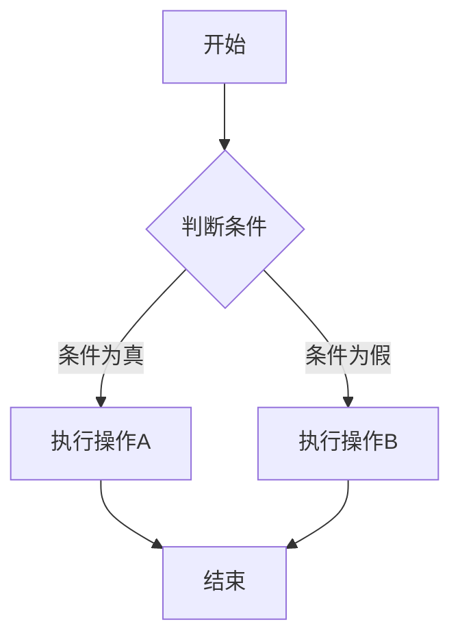
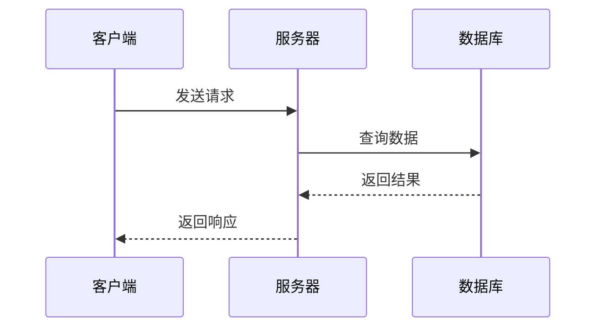
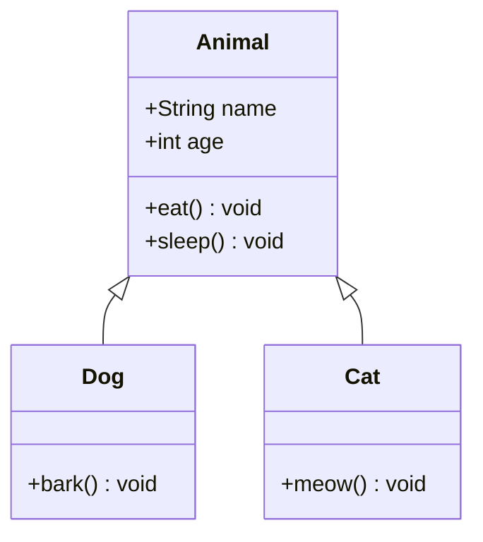
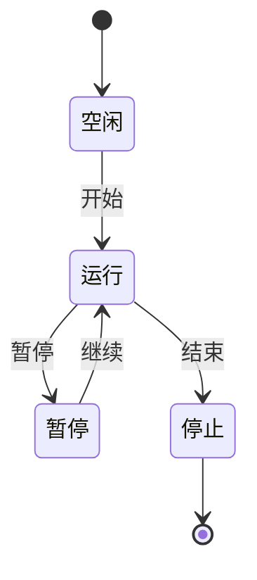
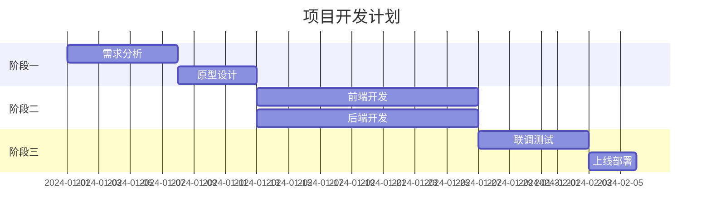
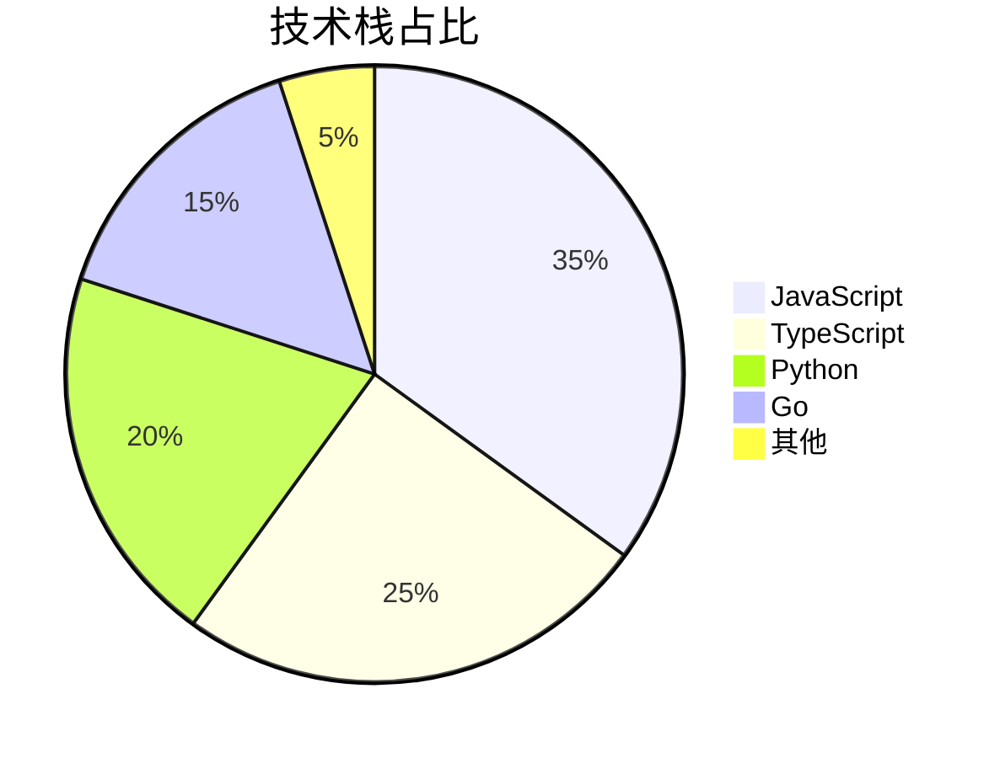

## 三、高级语法

### 3.1 HTML 嵌入

Markdown 可以直接嵌入 HTML 标签：

```markdown
<div style="color: red; font-size: 20px;">
  这是红色大字
</div>

<details>
  <summary>点击展开更多内容</summary>
  
  这里是折叠的内容，默认隐藏。
  
  - 可以包含列表
  - 可以包含代码
</details>

<kbd>Ctrl</kbd> + <kbd>C</kbd> 复制

<mark>这是高亮文字</mark>（HTML方式）

<abbr title="HyperText Markup Language">HTML</abbr>
```

**注意**：HTML 块级元素前后需要空行。部分平台（如 GitHub）出于安全考虑会过滤一些 HTML 标签。

### 3.2 脚注（GFM 扩展）

```markdown
这是一个带脚注的文字[^1]。

这是一个非常长的脚注[^longnote]。

[^1]: 这是脚注的内容，可以是多段文字。

    脚注第二段需要缩进 4 个空格。

[^longnote]: 这是一个带有多个段落的脚注示例。

    可以继续写更多内容，支持 Markdown 语法。
```

### 3.3 数学公式（LaTeX）

需要在支持 MathJax 或 KaTeX 的平台使用。

#### 行内公式

```markdown
勾股定理：$a^2 + b^2 = c^2$

欧拉公式：$e^{i\pi} + 1 = 0$

行内分数：$\frac{1}{2}$
```

#### 块级公式

```markdown
$$
\int_{0}^{\infty} e^{-x^2} dx = \frac{\sqrt{\pi}}{2}
$$

$$
\begin{pmatrix}
  a & b \\
  c & d
\end{pmatrix}
$$

$$
\begin{cases}
  x + y = 5 \\
  2x - y = 1
\end{cases}
$$

$$
\sum_{i=1}^{n} i = \frac{n(n+1)}{2}
$$
```

常用 LaTeX 符号速查：

| 符号 | 代码 | 说明 |
|:-----|:-----|:-----|
| $\alpha$ | `\alpha` | 希腊字母 Alpha |
| $\beta$ | `\beta` | 希腊字母 Beta |
| $\infty$ | `\infty` | 无穷大 |
| $\sqrt{x}$ | `\sqrt{x}` | 平方根 |
| $\sqrt[n]{x}$ | `\sqrt[n]{x}` | n次方根 |
| $\frac{a}{b}$ | `\frac{a}{b}` | 分数 |
| $\sum$ | `\sum` | 求和 |
| $\prod$ | `\prod` | 求积 |
| $\int$ | `\int` | 积分 |
| $\lim$ | `\lim` | 极限 |
| $\leq$ | `\leq` | 小于等于 |
| $\geq$ | `\geq` | 大于等于 |
| $\neq$ | `\neq` | 不等于 |
| $\approx$ | `\approx` | 约等于 |
| $\times$ | `\times` | 乘号 |
| $\div$ | `\div` | 除号 |
| $\pm$ | `\pm` | 正负号 |
| $\cdot$ | `\cdot` | 点乘 |
| $\Rightarrow$ | `\Rightarrow` | 向右箭头 |
| $\Leftarrow$ | `\Leftarrow` | 向左箭头 |
| $\Leftrightarrow$ | `\Leftrightarrow` | 双向箭头 |

**字母字体变体**：

```
$\mathbb{R}$  黑板粗体 ℝ
$\mathbf{A}$  粗体 A
$\mathcal{L}$ 花体 ℒ
$\mathit{abc}$ 数学斜体 abc
$\mathrm{xyz}$ 正体 xyz
$\mathsf{ABC}$ 无衬线体 ABC
$\mathtt{ABC}$ 打字机体 ABC
```

### 3.4 图表（Mermaid）

Mermaid 是 Markdown 中最流行的图表工具，支持流程图、时序图、甘特图等多种类型。

#### 流程图

````markdown

````

#### 时序图

````markdown

````

#### 类图

````markdown

````

#### 状态图

````markdown

````

#### 甘特图

````markdown

````

#### 饼图

````markdown

````

### 3.5 目录（TOC）

部分编辑器支持自动生成目录：

```markdown
[[toc]]
```

或使用：

```markdown
[TOC]
```

**VuePress 提示**：VuePress/vdoing 自动在侧边栏生成目录，不需要手动添加 TOC。

### 3.6 Emoji 表情

GFM 支持短代码表情：

| 短代码 | 表情 | 短代码 | 表情 |
|--------|------|--------|------|
| `:smile:` | 😄 | `:heart:` | ❤️ |
| `:+1:` | 👍 | `:fire:` | 🔥 |
| `:rocket:` | 🚀 | `:bulb:` | 💡 |
| `:warning:` | ⚠️ | `:white_check_mark:` | ✅ |
| `:x:` | ❌ | `:tada:` | 🎉 |
| `:books:` | 📚 | `:memo:` | 📝 |
| `:bug:` | 🐛 | `:wrench:` | 🔧 |
| `:zap:` | ⚡ | `:star:` | ⭐ |
| `:package:` | 📦 | `:lock:` | 🔒 |
| `:key:` | 🔑 | `:hourglass:` | ⏳ |

完整列表参考 [Emoji Cheat Sheet](https://www.webfx.com/tools/emoji-cheat-sheet/)。

### 3.7 定义列表

部分 Markdown 处理器支持定义列表：

```markdown
Markdown
: 一种轻量级标记语言，由 John Gruber 创建。

HTML
: 超文本标记语言，用于创建网页。

CSS
: 层叠样式表，用于描述网页的外观。
```

### 3.8 缩写

```markdown
在文档中可以使用 HTML 缩写标签：

HTML 规范由 <abbr title="World Wide Web Consortium">W3C</abbr> 制定。
```

### 3.9 键盘按键

```markdown
使用 <kbd>Ctrl</kbd> + <kbd>C</kbd> 复制文本。

使用 <kbd>Cmd</kbd> + <kbd>Shift</kbd> + <kbd>P</kbd> 打开命令面板。
```

### 3.10 上标和下标

```markdown
水分子：H<sub>2</sub>O

面积：10 m<sup>2</sup>

勾股定理：a<sup>2</sup> + b<sup>2</sup> = c<sup>2</sup>

多项式：x<sub>1</sub> + x<sub>2</sub> + ... + x<sub>n</sub>
```

### 3.11 视频嵌入

```markdown
<!-- HTML5 Video -->
<video src="demo.mp4" controls width="100%"></video>

<!-- YouTube / Bilibili 等使用 iframe -->
<iframe 
  src="//player.bilibili.com/player.html?bvid=BV1xx411c7mD" 
  scrolling="no" 
  border="0" 
  frameborder="no" 
  framespacing="0" 
  allowfullscreen="true"
  width="100%"
  height="500">
</iframe>
```

### 3.12 折叠内容（Details/Summary）

```markdown
<details>
<summary>点击查看详细内容</summary>

这里是折叠的内容，点击上方文字即可展开/收起。

- 支持列表
- 支持代码块
- 支持任意 Markdown 语法

```python
print("Hello, World!")
```

</details>
```

---
