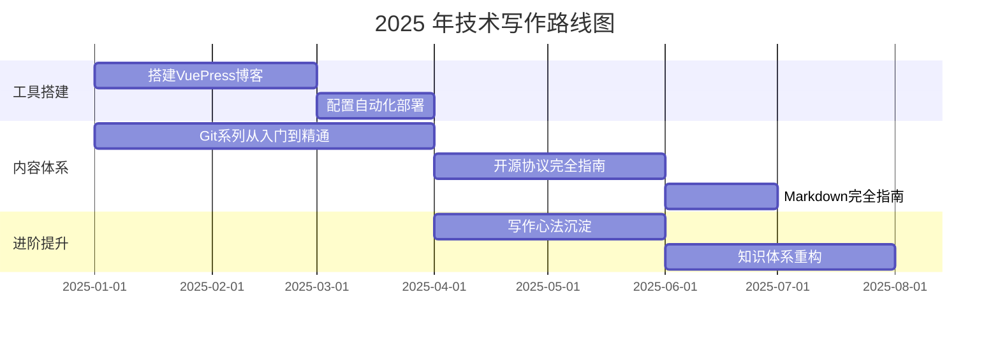
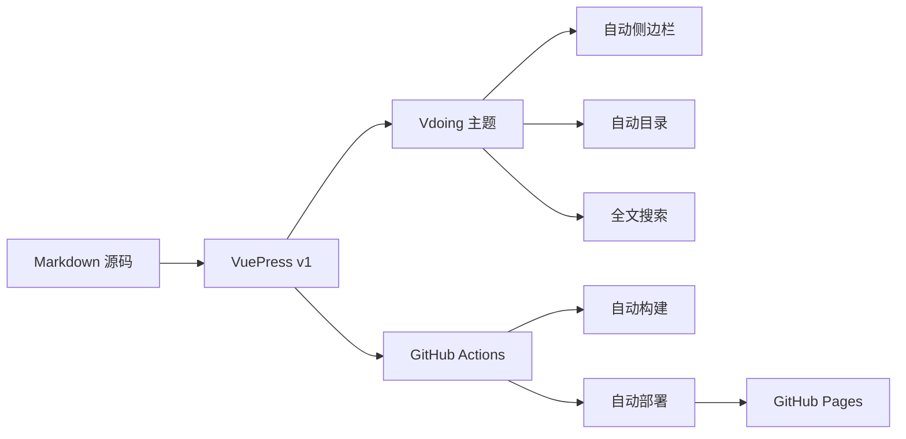
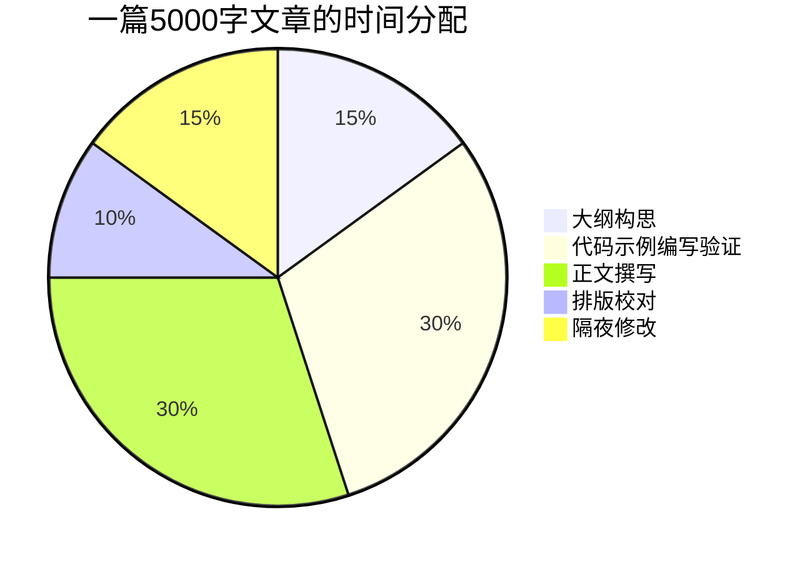
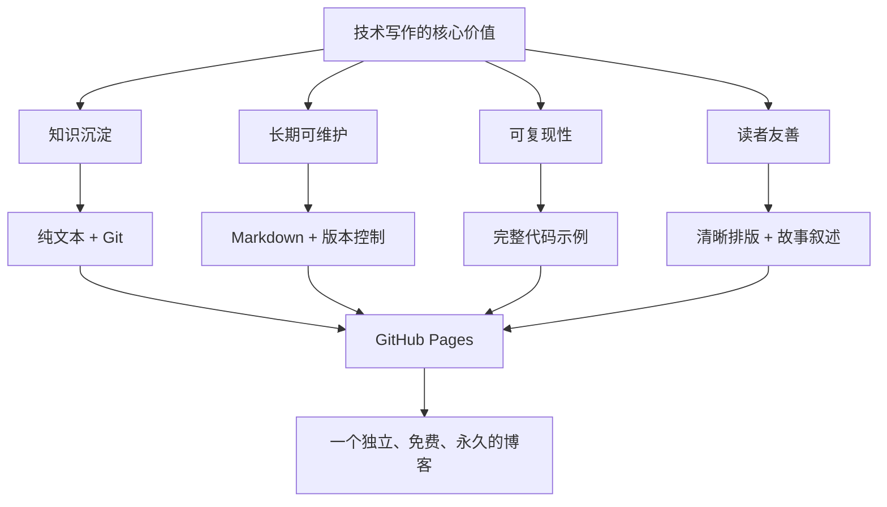

# 综合案例：我的写作之路

> 这篇文章既是 Markdown 的终极综合案例，也是一段真实的技术人生故事。文中的每一个排版元素都是为了向你证明：**Markdown 足以承载一段完整的叙述。**

---

## 一、缘起

### 1.1 那一夜，我删掉了第 47 版草稿

2024 年深秋的一个凌晨，我盯着 Word 里一个叫 `Spring源码分析_v47_final_真的不改了.docx` 的文件发呆。

**四十七个版本**。两百多页。横跨一整年。但当我鼓起勇气从头读——

:x: 第 3 页的时序图跑到了第 15 页

:x: 第 22 页的代码块字体变成了 Times New Roman

:x: 第 38 页的表格裂成了三页

:x: 最致命的是——每次 Word 版本升级，排版就崩一次

我删掉了那个文件。

<details>
<summary><b>🕰️ 点击展开：那些年我用过的写作工具</b></summary>

| 工具 | 使用时长 | 致命缺陷 |
|:-----|:--------|:---------|
| Word | 8 年 | 版本升级排版崩溃 |
| Google Docs | 2 年 | 图片多时卡到怀疑人生 |
| Notion | 1 年 | 导出 PDF 格式全乱 |
| 语雀 | 6 个月 | 迁移成本高，怕平台关停 |
| **Markdown + Git** | **至今** | **暂无** |

</details>

那一刻我下定决心：**以后的每一行技术笔记，都必须是纯文本。**

---

## 二、我的技术写作元年

### 2.1 2025 年，我做了什么



### 2.2 数据说话

以下是截至 2025 年 6 月的写作统计：

| 指标 | 数值 | 说明 |
|:-----|:----:|:-----|
| 原创文章 | 35 篇 | 不含转载和翻译 |
| 总字数 | 约 18 万字 | 平均每篇 5000 字 |
| Markdown 文件 | 68 个 | 含 README 和索引 |
| Git 提交次数 | 400+ | 持续更新中 |
| 技术领域 | 6 个 | Git、开源协议、Markdown、Node.js、博客搭建、业务架构 |

### 2.3 我的技术栈

这是一个 Markdown 驱动的博客的技术架构：



---

## 三、我的 Markdown 写作流

### 3.1 一个文件的诞生

`Editor（VS Code） → Markdown书写 → Git提交 → GitHub Actions → 自动部署 → 线上可见`

每次写作的完整流程：

- [x] **Step 1**：在 `docs/` 下创建 `.md` 文件
- [x] **Step 2**：写上 Frontmatter（标题、日期、分类、标签）
- [x] **Step 3**：先写大纲（H2 标题列表）
- [x] **Step 4**：依序填充内容
- [x] **Step 5**：在终端用 `npx markdownlint` 检查语法
- [x] **Step 6**：`git add` → `git commit` → `git push`
- [x] **Step 7**：GitHub Actions 自动构建 → 部署上线

### 3.2 我的 Frontmatter 模板

```yaml
---
title: 文章标题
date: 2025-06-07 00:00:00
permalink: /pages/xxxxx/
categories:
  - 技术
  - 分类A
  - 子分类B
tags:
  - 标签1
  - 标签2
author:
  name: 杨充
  link: https://github.com/yangchong211
description: 一句话描述，用于SEO和社交分享
---
```

### 3.3 写作环境

一台 MacBook Pro，安装了以下工具：

| 工具 | 用途 |
|:-----|:-----|
| **VS Code** | 主力编辑器 |
| `Markdown All in One` 插件 | 快捷键、目录、预览 |
| `markdownlint` 插件 | 实时语法检查 |
| `Markdown Preview Enhanced` 插件 | 增强预览 |
| **iTerm2** | 运行 `git`、`npm` 命令 |
| **Chrome DevTools** | 调试部署后的效果 |

---

## 四、技术难点与解决方案

### 4.1 VuePress 的 Markdown 扩展

VuePress 对标准 Markdown 做了不少增强，这些是我常用的：

**自定义容器（`:::` 语法）**：

```markdown
::: tip 提示
这是一个提示信息，蓝色背景。
:::

::: warning 警告
这是一个警告信息，黄色背景。
:::

::: danger 危险
这是一个危险警告，红色背景。
:::

::: theorem 牛顿第一定律
一切物体在没有受到外力作用时，总保持匀速直线运动状态或静止状态。
:::
```

渲染效果：

::: tip 提示
这是一个提示信息，蓝色背景。
:::

**代码块行高亮**：

````markdown
```javascript{1,4-5}
const config = {                 // ← 第1行高亮
  theme: 'vdoing',
  port: 8080
};
console.log(config.theme);      // ← 第4行高亮
console.log(config.port);       // ← 第5行高亮
```
````

**导入代码片段**（VuePress 特有，引用外部文件的特定行）：

```markdown
@[code{2-6}](../../package.json)
```

### 4.2 数学公式在技术博客中的运用

写算法分析时，时间复杂度用 LaTeX 表达最清晰：

递归的时间复杂度递推公式：

$$
T(n) = 
\begin{cases}
O(1) & n = 1 \\[6pt]
2T\left(\dfrac{n}{2}\right) + O(n) & n > 1
\end{cases}
$$

解这个递推式，使用主定理（Master Theorem）：

$$
\because a = 2,\; b = 2,\; f(n) = O(n) = O(n^{\log_2 2}) = O(n^1)
$$

$$
\therefore T(n) = \Theta(n \log n)
$$

**这就是 Markdown + LaTeX 的威力：复杂公式写在源码里清晰可读，渲染出来专业美观。**

### 4.3 如何管理大量 Markdown 文件

68 个 Markdown 文件，我是这样组织的：

```
docs/
├── README.md                     ← 站点首页
├── 01.关于我/                     ← 个人介绍
│   └── README.md
├── 02.生活/                       ← 读书、随笔
│   ├── README.md
│   └── 2025/
├── 03.技术/                       ← 技术文章
│   ├── README.md
│   ├── 01.技术文档/
│   ├── 02.GitHub技巧/
│   ├── 03.Nodejs/
│   ├── 04.博客搭建/
│   ├── 05.Git从入门精通/          ← 已完成的系列
│   │   ├── README.md
│   │   ├── 01.版本控制诞生.md
│   │   ├── 02.单人工作流.md
│   │   ├── ...
│   │   └── 09.常见操作实践.md
│   ├── license/                   ← 开源协议系列
│   └── markdown/                  ← Markdown 系列
└── index.md
```

VuePress 的 Vdoing 主题会自动读取目录结构生成侧边栏，**目录名就是导航名**，不需要额外配置。

### 4.4 自动部署流水线

每次 `git push` 后，GitHub Actions 自动执行：

```yaml
# .github/workflows/deploy.yml
name: Deploy Blog

on:
  push:
    branches: [master]

jobs:
  build-and-deploy:
    runs-on: ubuntu-latest
    steps:
      - uses: actions/checkout@v3

      - uses: actions/setup-node@v3
        with:
          node-version: '18'

      - name: Install Dependencies
        run: npm ci

      - name: Build
        run: npm run build

      - name: Deploy to GitHub Pages
        uses: JamesIves/github-pages-deploy-action@v4
        with:
          branch: gh-pages
          folder: dist
```

这个流程的核心在于：**写完 Markdown → 推送 Git → 一切的构建和部署都是自动的**。你只需要专注内容，不需要管任何基础设施。

---

## 五、写作心法

### 5.1 写作的三重境界

```mermaid
stateDiagram-v2
    [*] --> 第一重：写得清楚
    第一重：写得清楚 --> 第二重：写得完整
    第二重：写得完整 --> 第三重：写得动人
    第三重：写得动人 --> [*]

    note right of 第一重：读者能复现你的步骤
    note right of 第二重：读者不会在中间卡住
    note right of 第三重：读者读完想转发
```

**第一重：写得清楚。** 读者能无歧义地理解你说的是什么，能复现你的操作步骤。

**第二重：写得完整。** 从背景到方案到结果，覆盖读者的全部疑问。预判"如果我是读者，这里会卡在哪？"

**第三重：写得动人。** 有故事、有情绪、有共鸣。这需要阅读量的积累和个人风格的养成。

目前我的目标是 **第一重和第二重之间**。

### 5.2 我坚持的七条写作原则

1. **一篇文章只解决一个问题**——不贪大求全，聚焦产生深度

2. **先结构后内容**——列大纲 15 分钟，填充内容 2 小时，修改 45 分钟

3. **每个概念配一个最小示例**——读者能复制粘贴运行的最好

4. **换位思考**——每写完一段，问自己"第一次接触这个的读者能看懂吗？"

5. **用故事开头，用表格收尾**——开头降低门槛，结尾方便查阅

6. **中英文之间永远加空格**——`这是 English 单词`，`价格是 100 元`，细节决定品质

7. **写完隔夜再发**——第二天早上重读一遍，删掉所有可有可无的内容

### 5.3 写作时间分配

以一篇 5000 字的技术文章为例：



> :bulb: **最大的时间陷阱**：很多人把 60% 的时间花在排版上。在 Markdown 中，排版是自动的——你把精力还给内容本身。

---

## 六、建站的初心

### 6.1 为什么不做公众号、知乎，而要自己建站？

$$
\text{内容所有权} > \text{流量分发}
$$

我是一个对"数字资产"极其在意的人。在知乎、公众号、掘金上发文章，看似流量大，实则有三个致命问题：

| 平台 | 问题 |
|:-----|:-----|
| 公众号 | 内容无法被搜索引擎检索；历史文章淹没在折叠里 |
| 知乎 | 算法推荐不稳定；被删帖无预警；不能自定义排版 |
| 掘金 | 文章归属感弱；平台可能某天关停或改变策略 |

**自己建站**意味着：

- :key: **我的内容永远在我的域名下**——`https://yangchong211.github.io`
- :lock: **我的数据永远在我的 Git 仓库里**——纯文本，永不丢失
- :art: **我的排版永远由我决定**——不受平台限制
- :mag: **我的文章被 Google 索引**——五年后还有人搜到

### 6.2 用数字说明平台依赖的风险

| 事件 | 时间 | 后果 |
|:-----|:-----|:-----|
| 某问答社区下架大量历史内容 | 2023 | 10 万+回答消失 |
| 某写作平台关闭免费导出 | 2022 | 用户笔记被锁定 |
| 某笔记应用创始人退出 | 2024 | 用户恐慌性迁移 |

**并非危言耸听，上述事件都在近三年真实发生。**

### 6.3 我的技术价值观



---

## 七、给同样想写作的你

### 7.1 最小可行起步

如果你想开始技术写作，这是**绝对的最小成本方案**：

**第一天**：安装 <kbd>VS Code</kbd>，新建 `第一篇笔记.md`，写 500 字。

**第二天**：在 [GitHub](https://github.com) 新建仓库，把 `.md` 文件 push 上去。

**第三天**：安装 VuePress[^1]，用一条命令生成博客站点。

**第一周**：配置 GitHub Actions，实现自动部署到 GitHub Pages。

**第一个月**：保持每周一篇的节奏，感受写作的复利效应。

### 7.2 推荐的起步工具组合

| 工具 | 用途 | 难度 |
|:-----|:-----|:----:|
| VS Code | 编辑器 | :star: |
| Markdown | 写作语法 | :star: |
| Git + GitHub | 版本控制 + 托管 | :star::star: |
| VuePress | 静态站点生成 | :star::star: |
| GitHub Actions | 自动部署 | :star::star: |
| GitHub Pages | 免费托管 | :star: |

[^1]: VuePress 是 Vue 驱动的静态站点生成器，由 Vue.js 核心团队维护。

### 7.3 技术博客平台对比

| 特性 | 自己建站 | 第三方平台 |
|:-----|:--------:|:----------:|
| 内容所有权 | :white_check_mark: 完全自有 | :x: 归属平台 |
| SEO | :white_check_mark: Google 索引 | :white_check_mark: 平台内搜索 |
| 排版自由 | :white_check_mark: 完全自定义 | :warning: 受限于编辑器 |
| 流量获取 | :warning: 需要自己推广 | :white_check_mark: 平台分发 |
| 学习成本 | :warning: 初次较高 | :white_check_mark: 开箱即用 |
| 长期维护 | :white_check_mark: 纯文本不怕过时 | :x: 平台风险 |
| 数据迁移 | :white_check_mark: `.md` 文件随便搬 | :x: 导出受限 |

### 7.4 起步建议

- :memo: **先从 GitHub README 写起**——你会惊讶地发现，写 README 和写博客用的是同一种技能
- :books: **系列化你的内容**——Git 从入门到精通就是 9 篇系列文章，远比 9 篇孤立的文章有力量
- :rocket: **写完就发**——完美主义是技术写作的最大敌人
- :hourglass: **坚持 6 个月**——前 3 个月没人看是正常的，第 4 个月开始有搜索流量，第 6 个月开始有人留言

---

## 八、写给一年后的自己

> 嘿，一年后的我：
>
> 当你看到这篇文章时，希望你已经写了 **50+ 篇**文章，GitHub 仓库的 commit 数超过了 **1000**，博客的月访问量突破了我们的第一个目标。
>
> 但更重要的是——**你是否还在坚持「纯文本 + 版本控制」这条路线？**
>
> 我希望是的。因为这意味着：
> - 你的内容永远可迁移，不受任何平台绑架
> - 你的修改历史一笔一划都在 Git 里，随时可以复盘
> - 你的读者搜索任何一个关键词，都能定位到你的文章
> - 你不会在某一天打开某个笔记工具，发现它已经停止运营
>
> 技术写作是一场马拉松，不是你跑得多快，而是你能不能一直跑下去。
>
> 共勉。
>
> —— 2025 年 6 月的杨充

---

## 九、附录

### 9.1 本案例运用到的 Markdown 语法清单

| 语法 | 本文出现位置 |
|:-----|:------------|
| **H1~H6 标题** | 全文各级标题 |
| **粗体 / 斜体 / 粗斜体** | "那一夜"章节 |
| **删除线** | ~~被删除的文字~~（"那一夜"章节） |
| **行内代码** | 全文 `code` 引用 |
| **代码块 + 语法高亮** | `yaml`、`mermaid`、`javascript` 等 |
| **行号高亮** | `javascript{1,4-5}` |
| **无序/有序列表** | 全文 |
| **任务列表（`- [x]`）** | "我的 Markdown 写作流" |
| **引用（`>`）** | "写给一年后的自己" |
| **嵌套引用（`>>`）** | 未使用（示例在第1篇中） |
| **表格（对齐、嵌套代码）** | 全文多处 |
| **分隔线（`---`）** | 全文分节 |
| **链接（行内/引用式）** | "给同样想写作的你" |
| **图片（``）** | 未使用（在建站案例中更侧重代码） |
| **HTML 嵌入（`<br>`、`<details>`）** | "那一夜"章节的折叠块 |
| **折叠内容（`<details>/<summary>`）** | :point_up: 同上 |
| **键盘按键（`<kbd>`）** | `Ctrl+C` 在最小方案中 |
| **上标/下标（`<sup>`/`<sub>`）** | 数学公式中的上下标（同时用了 LaTeX） |
| **脚注（`[^1]`）** | VuePress 脚注 |
| **Emoji 短代码** | :x: :white_check_mark: :rocket: 等 |
| **Mermaid 甘特图** | "2025 年，我做了什么" |
| **Mermaid 流程图** | "我的技术栈" |
| **Mermaid 状态图** | "写作的三重境界" |
| **Mermaid 饼图** | "写作时间分配" |
| **LaTeX 数学公式** | 时间复杂度分析 |
| **Badge** | 未在本文使用（第3篇中有示例） |
| **Frontmatter** | 文件顶部 |
| **自定义容器（`:::`）** | "VuePress 的 Markdown 扩展" |
| **HTML注释（`<!-- -->`）** | 未在本文可见部分使用 |
| **转义字符** | 未在本文使用 |
| **视频嵌入** | 未在本文使用 |
| **Diff 代码块** | 未在本文使用 |
| **定义列表** | 未在本文使用 |
| **TOC 目录** | VuePress 自动生成，无需手写 |

### 9.2 关于作者

杨充（yangchong），全栈工程师，技术写作者。

- 2023 年开始系统性地整理技术笔记
- 2024 年将个人博客从第三方平台迁移到自建站点
- 2025 年完成「Git 从入门到精通」「开源协议完全指南」「Markdown 从零到一」三个系列

---

> **这篇文章的源代码就是一个行走的 Markdown 语法示例。** 每一段正文、每一个代码块、每一个图表、每一个表格，都是你在前三篇教程中学到的知识点的综合应用。如果你看到这里，请把它当作你的 Markdown 毕业作业——**打开这份源码，逐行对比，看看每一个语法是怎么用的。**
>
> **祝你写作愉快。** :rocket:
