# Mermaid 时序图完全指南

## 一、时序图解决什么问题

当你需要描述**多个对象之间按时间顺序的交互**时，时序图是最佳选择。

典型场景：
- API 请求的完整链路（客户端 → 网关 → 服务 → 数据库）
- OAuth 登录流程（用户 → 浏览器 → 授权服务器 → 资源服务器）
- 微服务之间的 RPC 调用链
- 消息队列的发布/消费

---

## 二、基本语法

### 2.1 参与者（Participant）

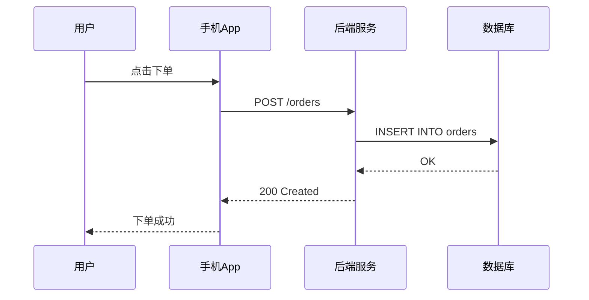

```markdown
participant 别名 as 显示名称    显式声明
participant 别名                仅别名（名称=别名）
```

### 2.2 六种消息箭头

| 语法 | 含义 | 说明 |
|:-----|:-----|:-----|
| `->>` | 实线实心箭头 | 同步请求/调用 |
| `-->>` | 虚线实心箭头 | 响应/返回 |
| `->` | 实线无箭头 | 数据传递 |
| `-->` | 虚线无箭头 | 异步消息 |
| `-x` | 实线叉箭头 | 失败/异常 |
| `-)` | 实线半圆箭头 | 异步消息（另一种） |

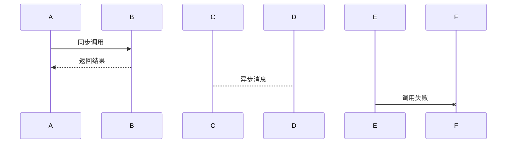

### 2.3 激活（Activations）

`+` 和 `-` 控制参与者的生命线激活：

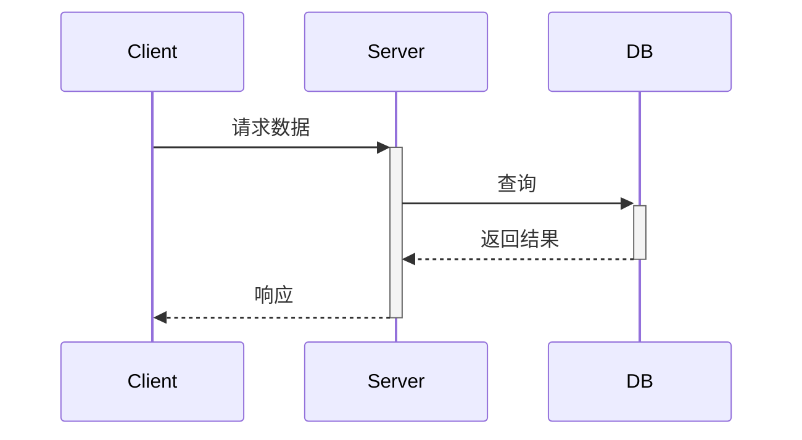

| 语法 | 效果 |
|:-----|:-----|
| `->>+B` | 调用 B，激活 B |
| `-->>-B` | 返回结果，**同时**关闭 B 的激活 |
| `activate B` | 仅激活 B |
| `deactivate B` | 仅关闭 B |

---

## 三、注释（Notes）

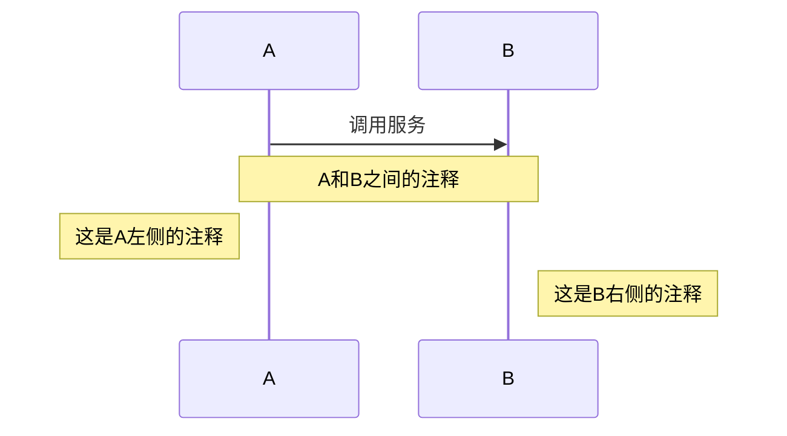

```markdown
Note over A,B: 覆盖A和B
Note left of A: A左侧
Note right of B: B右侧
```

---

## 四、循环（Loop）

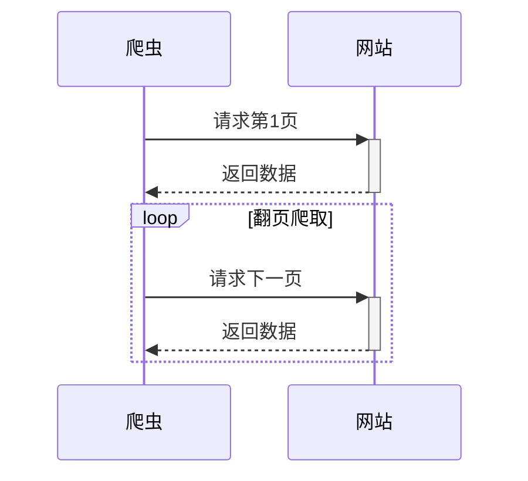

```markdown
loop 循环说明
    消息体
end
```

---

## 五、条件分支（Alt / Else / Opt）

### 5.1 Alt：二选一

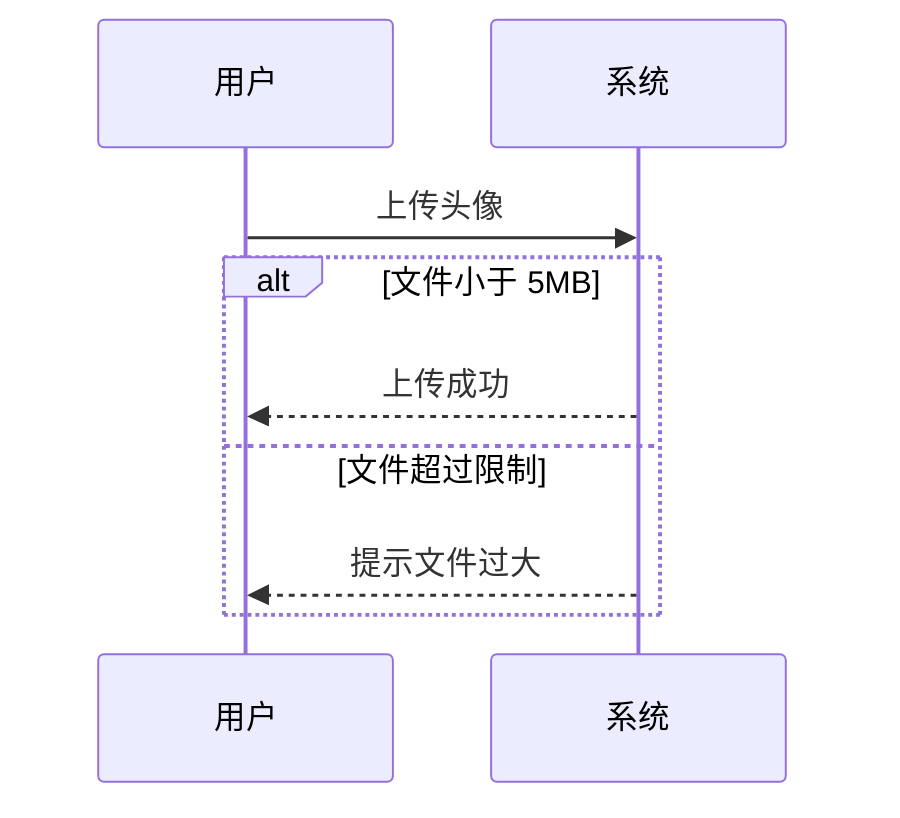

### 5.2 Opt：可选分支

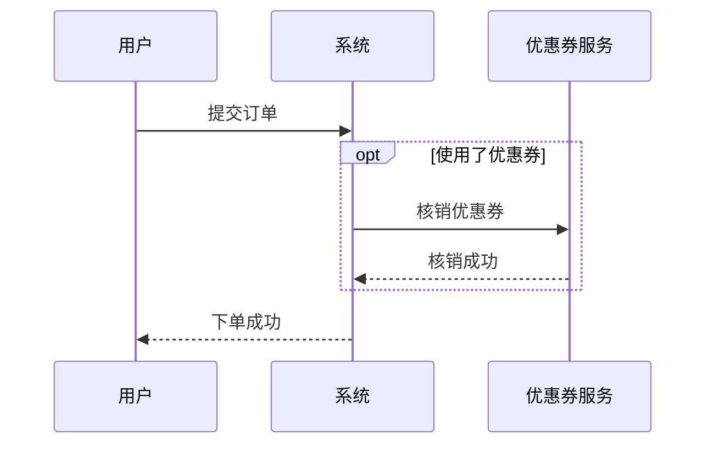

---

## 六、并发（Par / And / Critical）

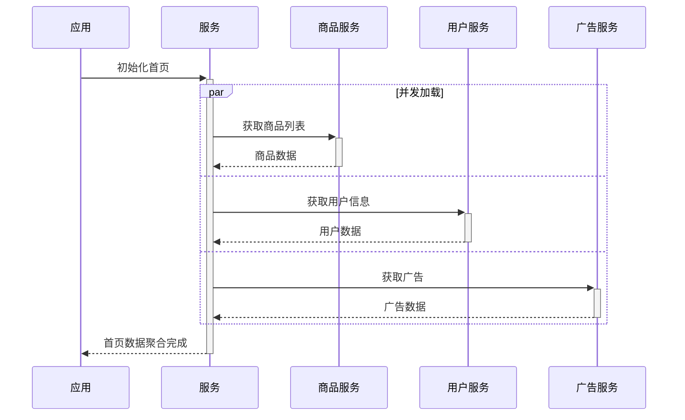

```markdown
par [说明]
    并发操作1
and
    并发操作2
end
```

---

## 七、实战：OAuth 2.0 授权码流程

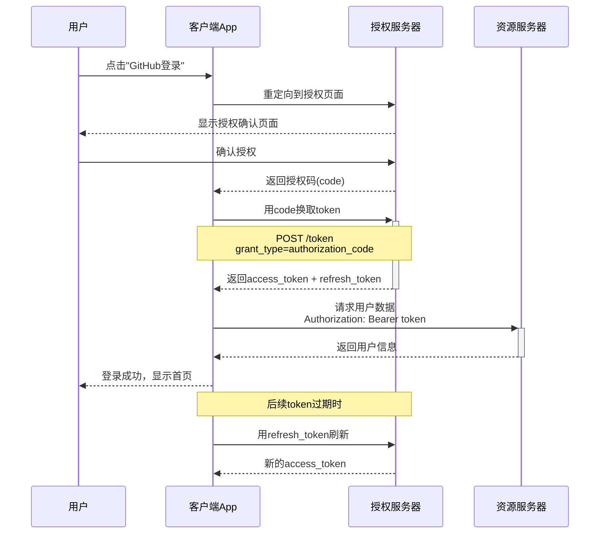

---

## 八、自动编号

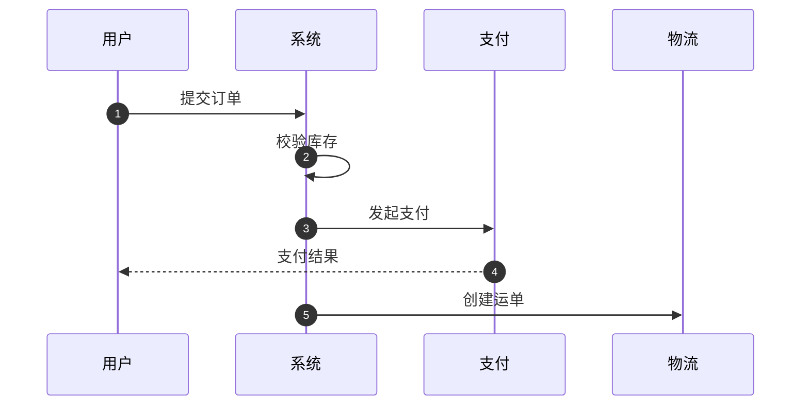

```markdown
autonumber     从1开始自动编号
```

---

## 九、实战：微服务下单全链路

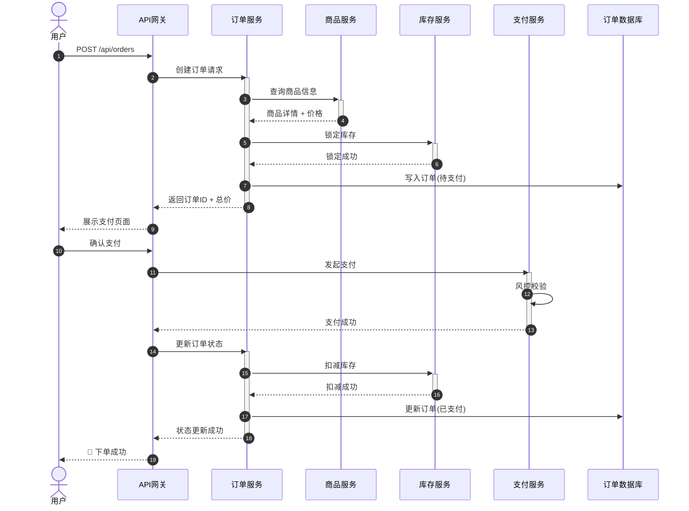

---

## 十、速查卡片

```
┌──────────────────────────────────────────────┐
│              Mermaid 时序图速查               │
├──────────────────────────────────────────────┤
│ 参与者：participant 别名 as 显示名            │
│         actor 别名 as 显示名（人物图标）       │
│                                              │
│ 消息：  ->>  同步调用                         │
│        -->>  返回/响应                        │
│         ->  无箭头                            │
│         -x  异常                              │
│                                              │
│ 激活：  ->>+B  激活B                         │
│        -->>-B  返回并关闭激活                  │
│                                              │
│ 注释：  Note over A,B: 文字                   │
│        Note left of A: 文字                   │
│                                              │
│ 控制：  loop ... end         循环             │
│        alt ... else ... end  条件             │
│        opt ... end           可选             │
│        par ... and ... end   并发             │
│        critical ... end      临界区           │
│        break ... end         中断             │
│                                              │
│ 编号：  autonumber                            │
└──────────────────────────────────────────────┘
```

> 🏃 下一篇：[类图与ER图](./04.类图与ER图.md)——类定义、继承、组合、聚合、泛型、实体关系。
