# 01.计算机组成结构原理

#### 目录介绍
- [01.工作案例引入](#01工作案例引入)
  - [1.1 一次线上事故](#11-一次线上事故)
  - [1.2 为什么要学硬件](#12-为什么要学硬件)
- [02.计算机底层知识](#02计算机底层知识)
  - [2.1 计算机基础组成](#21-计算机基础组成)
  - [2.2 应该怎么学](#22-应该怎么学)
  - [2.3 计算机发展历程](#23-计算机发展历程)
- [03.计算机基本硬件](#03计算机基本硬件)
  - [3.1 基本硬件组成](#31-基本硬件组成)
  - [3.2 输入输出设备](#32-输入输出设备)
  - [3.3 硬件协作流程](#33-硬件协作流程)
- [04.冯诺依曼体系结构](#04冯诺依曼体系结构)
  - [4.1 存储程序计算机](#41-存储程序计算机)
  - [4.2 冯诺依曼计算机](#42-冯诺依曼计算机)
  - [4.3 抽象计算机框架](#43-抽象计算机框架)
  - [4.4 冯诺依曼体系](#44-冯诺依曼体系)
  - [4.5 理解案例概念](#45-理解案例概念)
  - [4.6 数据交互层设计](#46-数据交互层设计)
  - [4.7 数据流动层设计](#47-数据流动层设计)
  - [4.8 控制层面设计](#48-控制层面设计)
  - [4.9 一道练习题](#49-一道练习题)
- [05.计算机组成原理](#05计算机组成原理)
  - [5.1 计算机知识地图](#51-计算机知识地图)
  - [5.2 计算机基本组成](#52-计算机基本组成)
  - [5.3 控制器](#53-控制器)
  - [5.4 存储器](#54-存储器)
  - [5.5 输入设备](#55-输入设备)
  - [5.6 输出设备](#56-输出设备)
  - [5.7 运算器](#57-运算器)
  - [5.8 五大部件协作](#58-五大部件协作)
- [06.深入冯诺依曼架构](#06深入冯诺依曼架构)
  - [6.1 为什么存储程序](#61-为什么存储程序)
  - [6.2 哈佛vs冯诺依曼](#62-哈佛vs冯诺依曼)
  - [6.3 现代混合架构](#63-现代混合架构)
  - [6.4 冯诺依曼瓶颈](#64-冯诺依曼瓶颈)
  - [6.5 突破瓶颈思路](#65-突破瓶颈思路)
- [07.计算机性能功耗](#07计算机性能功耗)
  - [7.1 如何衡量性能](#71-如何衡量性能)
  - [7.2 性能公式推导](#72-性能公式推导)
  - [7.3 功耗墙问题](#73-功耗墙问题)
  - [7.4 阿姆达尔定律](#74-阿姆达尔定律)
- [08.如何学习原理](#08如何学习原理)
  - [8.1 知识体系太大](#81-知识体系太大)
  - [8.2 如何学该专栏](#82-如何学该专栏)
- [09.综合案例按键显示](#09综合案例按键显示)
  - [9.1 场景背景](#91-场景背景)
  - [9.2 完整流程分解](#92-完整流程分解)
  - [9.3 五大部件角色](#93-五大部件角色)
  - [9.4 性能公式复盘](#94-性能公式复盘)
- [10.思考题与作业](#10思考题与作业)
  - [10.1 基础思考题](#101-基础思考题)
  - [10.2 进阶思考题](#102-进阶思考题)
  - [10.3 动手作业](#103-动手作业)


## 01.工作案例引入

### 1.1 一次线上事故

**场景**：小李是一名工作三年的后端工程师。有天凌晨三点被电话吵醒——线上某个"核心接口"的响应时间从平均 20ms 飙升到 2s，监控告警此起彼伏。值班同事已经把能重启的服务都重启了一遍，无效。

小李登上生产机，`top` 一看：

```
%Cpu(s):  5.2 us,  3.1 sy,  0.0 ni, 20.5 id, 71.0 wa,  0.0 hi,  0.2 si
                                             ^^^^^^^^
                                         等待 I/O 的时间占了 71%
```

**疑惑**：CPU 其实很闲（id+wa=91%），那为什么接口这么慢？为什么 `wa`（I/O wait）这么高，到底在等什么？为什么重启服务不管用？

继续追查发现：同机房的一块 SSD 出现预警，磁盘随机读延迟从 100μs 涨到了 80ms，而这个接口每次请求都要读几十次小文件。

**追问链**：

- "为什么 CPU 很闲，接口却很慢？" → 因为 CPU 在等磁盘，**CPU 和外设速度差 10 万倍**
- "为什么 CPU 不能直接读硬盘，要通过内存？" → 因为**冯·诺依曼架构**规定 CPU 只和内存打交道
- "那为什么内存断电数据就丢了？" → 因为内存是 DRAM，存储机制决定了它的易失性
- "为什么不全用 SSD 当内存？" → 因为速度差百倍、寿命有限——这就是**存储层次**的设计权衡
- "为什么告警出现后，业务先卡的是这一个接口？" → 因为这个接口的**指令执行路径**上堆了大量 I/O 指令，其他接口走了别的路径

这一连串追问，答案都写在"计算机组成原理"这本书里。

**从事故到原理的映射**：上面的每个"为什么"，本质上都在问你计算机是怎么组织的：

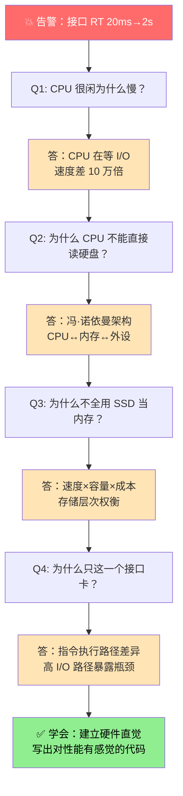

**核心洞察**：小李这次事故的根本问题不是代码写错了，而是**对硬件没有感觉**。他知道 Java 调优参数，但不知道一次磁盘读要 10ms，不知道缓存命中率下降 10% 对吞吐的影响。**计算机组成原理就是帮他建立"代码在硬件上的成本模型"**。

### 1.2 为什么要学硬件

小李这次事故的根本问题不是代码写错了，而是**对硬件没有感觉**。他写的是 Java，平时关心的是 Spring、MyBatis、线程池，但系统真正的性能曲线是由下面这些硬件特性决定的：

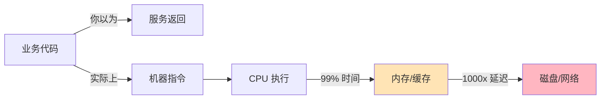

**不懂硬件会付出什么代价？** 以下四个典型场景，几乎每个后端工程师都会遇到：

| 场景 | 表层现象 | 底层根因 | 对应本章知识点 |
|------|---------|---------|--------------|
| 接口突然变慢 | CPU 使用率很低但 RT 很高 | 磁盘 I/O 阻塞，CPU 空等 | §4.6 数据交互层 |
| 多线程性能不如预期 | 核数翻倍但吞吐没涨 | 阿姆达尔定律，串行部分拖累 | §7.4 阿姆达尔定律 |
| 缓存穿透击垮数据库 | 缓存一过期 CPU 打满 | 大量请求绕过缓存直击磁盘/DB | §6.4 冯·诺依曼瓶颈 |
| 大对象频繁 GC | 堆内存分代频繁回收 | 内存不足触发磁盘交换（swap）| §5.4 存储层次 |

**程序员应该建立哪三样硬件直觉？**

1. **速度金字塔**：寄存器 > L1 > L2 > L3 > 内存 > SSD > HDD > 网络，每差一级慢 10-1000 倍。记住它，你看到"循环里读文件"就会浑身不舒服。
2. **瓶颈不只在 CPU**：程序的慢 9 成不在"算得慢"，而在"等数据"。优化方向应该是"减少数据搬运"而不是"加快运算"。
3. **指令的真实成本**：一行 `x.y = z` 可能触发多次内存访问、一次缓存失效、一次 TLB miss——它背后走的硬件路径决定了这句代码的实际耗时。

本章的目标，就是把"计算机"这台机器拆开给你看，让你建立起最基本的硬件直觉：

- 它由哪些部件组成？
- 这些部件的速度差异有多大？
- 为什么要这样设计，能不能改？
- 程序员写的每一行代码，在这个硬件模型里会走哪条路径？

带着这五个问题，我们开始。


## 02.计算机底层知识

### 2.1 计算机基础组成

计算机是由 CPU、内存、显示器这些设备组成的硬件。目前，大部分程序员都是从事各种软件开发工作。显然，在硬件和软件之间需要一座桥梁，而**"计算机组成原理"就扮演了这样一个角色**，它既隔离了软件和硬件，也提供了让软件无需关心硬件，就能直接操作硬件的接口。

**软硬件之间的抽象层次**：

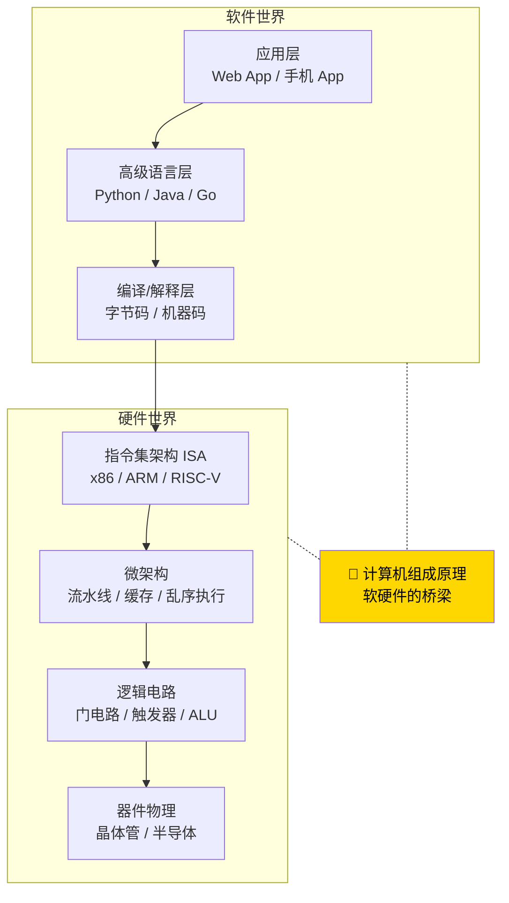

只需要对硬件有原理性的理解，就可以信赖硬件的可靠性，用高级语言来写程序。无论是写操作系统和编译器这样的硬核代码，还是写 Web 应用和手机 App 这样的应用层代码，都可以做到心里有底。

无论你想要学习计算机的哪一门核心课程，之前都应该先学习一下"计算机组成原理"，这样无论是对计算机的硬件原理，还是软件架构，对计算机方方面面的知识都会有一个全局的了解。

**疑惑：为什么软件开发者也需要了解硬件？**

很多程序员觉得自己只写上层代码，不需要关心底层硬件。但实际上，你写的每一行代码最终都要在硬件上运行。比如：

- 为什么同样的算法，在不同的数据结构上性能差距巨大？——因为**内存访问模式**影响了 CPU 缓存命中率
- 为什么并发程序会出现诡异的 Bug？——因为 CPU 多核**缓存一致性**、**指令重排序**
- 为什么某些 I/O 操作特别慢？——因为磁盘寻道、DMA 传输机制
- 为什么 `LinkedList` 遍历比 `ArrayList` 慢几倍？——因为指针跳转导致 CPU 预取失效，每次访问都可能触发缓存 miss

理解了这些，你才能写出真正高性能的代码。

### 2.2 应该怎么学

说了这么多计算机组成原理的重要性，但到底该怎么学呢？"买书如山倒，读书如抽丝"。从业这么多年，周围想要好好学一学组成原理的工程师不少，但是真的坚持下来学完、学好的却不多。

对这些问题，从学习和工作的经验看，找到了三个主要原因。

- 第一，广。组成原理中的概念非常多，每个概念的信息量也非常大。比如想要理解 CPU 中的算术逻辑单元（也就是 ALU）是怎么实现加法的，需要牵涉到如何把整数表示成二进制，还需要了解这些表示背后的电路、逻辑门、CPU 时钟、触发器等知识。
- 第二，深。组成原理中的很多概念，阐述开来就是计算机学科的另外一门核心课程。比如，计算机的指令是怎么从你写的 C、Java 这样的高级语言，变成计算机可以执行的机器码的？如果我们展开并深入讲解这个问题，就会变成《编译原理》这样一门核心课程。
- 第三，学不能致用。学东西是要拿来用的，但因为这门课本身的属性，很多人在学习时，常常沉溺于概念和理论中，无法和自己日常的开发工作联系起来，以此来解决工作中遇到的问题，所以，学习往往没有成就感，就很难有动力坚持下去。

### 2.3 计算机发展历程

**疑惑：计算机是怎么从笨重的机器一步步演变到今天轻薄的笔记本和手机的？**

计算机的发展经历了五个主要阶段，每一代的核心变化都在于**计算元器件的演进**：

| 代际 | 时间 | 核心元件 | 特点 | 代表 |
|------|------|---------|------|------|
| 第一代 | 1946-1958 | 电子管 | 体积巨大、耗电量大、易损坏 | ENIAC |
| 第二代 | 1958-1964 | 晶体管 | 体积缩小、可靠性提高 | IBM 7090 |
| 第三代 | 1964-1971 | 集成电路（IC） | 小型化、成本降低 | IBM 360 |
| 第四代 | 1971-至今 | 大规模/超大规模集成电路 | 微处理器诞生 | Intel 4004 → 现代CPU |
| 第五代 | 探索中 | 量子计算/光计算/生物计算 | 突破经典计算极限 | 量子计算机 |

**关键里程碑**：
- 1946年 ENIAC：第一台通用电子计算机，重达30吨，占地170平方米
- 1947年 晶体管发明：贝尔实验室，奠定了现代电子学的基础
- 1958年 集成电路：Jack Kilby 发明，可以在一块芯片上集成多个晶体管
- 1971年 Intel 4004：第一款微处理器，2300个晶体管
- 2024年 Apple M4：约280亿个晶体管

**器件演进与晶体管数量变化趋势**：

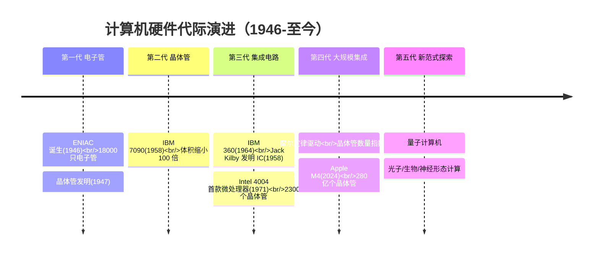

**论证——摩尔定律**：Intel 创始人之一戈登·摩尔在1965年预言：集成电路上可容纳的晶体管数量，约每隔18-24个月翻一番。这条定律驱动了半个多世纪的芯片产业发展，但如今已经接近物理极限（原子尺度约0.1nm），行业正在探索3D堆叠、新材料等方式继续提升。

**从发展历程中得到的启示**：计算机架构的演进始终在回答同一个问题——**"如何用更小的空间、更少的功耗，完成更快的计算？"** 理解这个主线，你就能明白为什么今天我们看到 CPU 从"堆主频"转向"堆核心"，从"同构"转向"异构"（如 ARM big.LITTLE）。


## 03.计算机基本硬件

### 3.1 基本硬件组成

早年，要自己组装一台计算机，要先有三大件，CPU、内存和主板。

CPU，它是计算机最重要的核心配件，全名你肯定知道，叫中央处理器（Central Processing Unit）。为什么说 CPU 是"最重要"的呢？因为计算机的所有"计算"都是由 CPU 来进行的。自然，CPU 也是整台计算机中造价最昂贵的部分之一。

内存（Memory），你撰写的程序、打开的浏览器、运行的游戏，都要加载到内存里才能运行。程序读取的数据、计算得到的结果，也都要放在内存里。内存越大，能加载的东西自然也就越多。

主板，存放在内存里的程序和数据，需要被 CPU 读取，CPU 计算完之后，还要把数据写回到内存。然而 CPU 不能直接插到内存上，反之亦然。于是，就带来了最后一个大件——主板（Motherboard）。

**主板的核心作用**：主板是所有硬件的"交通枢纽"。它上面有各种总线（Bus）、芯片组（Chipset）、各种接口插槽。总线就像城市的道路，数据通过总线在 CPU、内存、硬盘、显卡之间流转。芯片组则像交通调度中心，控制着数据的路由方向。

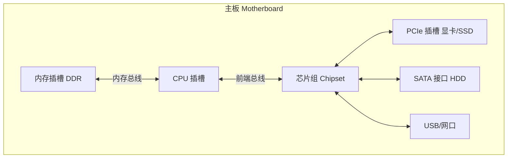

### 3.2 输入输出设备

有了三大件，只要配上电源供电，计算机差不多就可以跑起来了。但是现在还缺少各类输入（Input）/ 输出（Output）设备，也就是我们常说的 I/O 设备。

如果你用的是自己的个人电脑，那显示器肯定必不可少，只有有了显示器我们才能看到计算机输出的各种图像、文字，这也就是所谓的输出设备。

同样的，鼠标和键盘也都是必不可少的配件。这样我才能输入文本，写下这篇文章。它们也就是所谓的输入设备。

**I/O 设备的分类全景**：

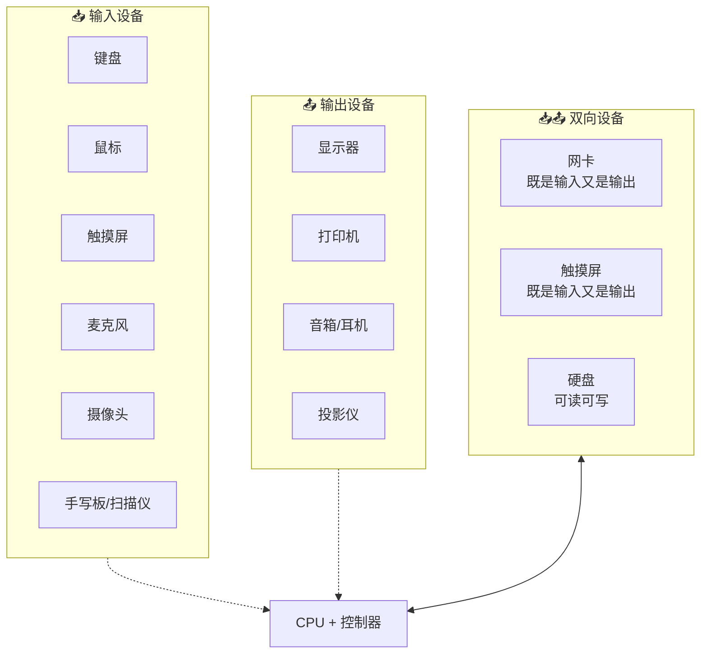

**I/O 设备的本质差异**：

| 维度 | 输入设备 | 输出设备 | 双向设备 |
|------|---------|---------|---------|
| 数据方向 | 外部 → 计算机 | 计算机 → 外部 | 双向 |
| 信号转换 | 物理量 → 数字信号 (A/D) | 数字信号 → 物理量 (D/A) | 两种转换均有 |
| 关键设计问题 | 采样精度、去抖 | 刷新率、色彩空间 | 速率匹配、协议 |
| 常见接口 | USB / PS2 / Bluetooth | HDMI / DP / VGA | PCIe / SATA / Ethernet |

**思考：为什么网卡既算输入设备又算输出设备？**

因为数据包从你的电脑发出时（上传/发送），网卡执行的是输出功能；数据包从网络到达时（下载/接收），网卡执行的是输入功能。这种双向设备在现代计算机中占比越来越高——**云服务器的"网络 I/O 吞吐"往往是系统瓶颈，而不是 CPU 计算**。

### 3.3 硬件协作流程

**疑惑：这些硬件是怎么协同工作的？它们之间是什么关系？**

我们通过一个"打开浏览器访问网页"的完整过程来理解：

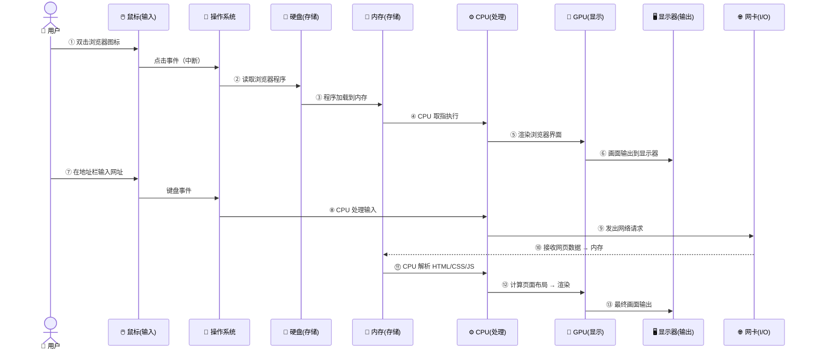

**从流程中提取的三个关键规律**：

1. **数据永远绕不开内存**：硬盘数据要先搬进内存才能被 CPU 使用，网卡收到的数据也要先写内存。从第④步到第⑬步，内存始终是数据的中转站。**这就是冯·诺依曼架构的核心约束**。

2. **中断是硬件协作的号角**：鼠标点击、键盘输入、网卡收包——外设不主动"告诉"CPU，CPU 按固定节奏去"问"外设（轮询）会让 CPU 100% 空转。**中断机制**让外设有事才叫 CPU，其余时间 CPU 可以歇着或者干别的。

3. **角色分工明确**：CPU 算布局，GPU 画像素，硬盘存程序，网卡传数据——**没有哪个部件能包打天下**。设计上的"术业有专攻"让整体效率最大化。

**结论**：所有硬件各司其职，通过总线互联互通，由 CPU 统一调度协调。这就是冯·诺依曼体系结构的实际体现。


## 04.冯诺依曼体系结构

### 4.1 存储程序计算机

无论是个人电脑、服务器、智能手机，还是 Raspberry Pi 这样的微型卡片机，都遵循着同一个"计算机"的抽象概念。

这是怎么样一个"计算机"呢？这其实就是，计算机祖师爷之一冯·诺依曼（John von Neumann）提出的冯·诺依曼体系结构（Von Neumann architecture），也叫存储程序计算机。

什么是存储程序计算机呢？这里面其实暗含了两个概念，一个是"可编程"计算机，一个是"存储"计算机。

> 1.说到"可编程"，估计你会有点懵，你可以先想想，什么是"不可编程"。

计算机是由各种门电路组合而成的，然后通过组装出一个固定的电路板，来完成一个特定的计算程序。一旦需要修改功能，就要重新组装电路。这样的话，计算机就是"不可编程"的，因为程序在计算机硬件层面是"写死"的。

最常见的就是老式计算器，电路板设好了加减乘除，做不了任何计算逻辑固定之外的事情。

> 2.再来看"存储"计算机。这其实是说，程序本身是存储在计算机的内存里，可以通过加载不同的程序来解决不同的问题。

有"存储程序计算机"，自然也有不能存储程序的计算机。

典型的就是早年的"Plugboard"这样的插线板式的计算机。整个计算机就是一个巨大的插线板，通过在板子上不同的插头或者接口的位置插入线路，来实现不同的功能。

这样的计算机自然是"可编程"的，但是编写好的程序不能存储下来供下一次加载使用，不得不每次要用到和当前不同的"程序"的时候，重新插板子，重新"编程"。

**"存储程序"前后的本质区别**：

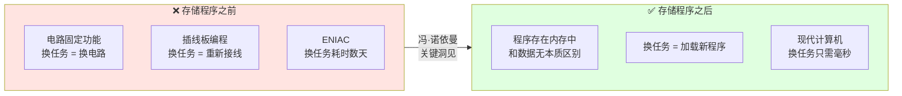

**疑惑：为什么"存储程序"这个概念如此重要？**

**答疑**：在存储程序出现之前，"程序"和"数据"是分离的。程序硬编码在电路中（或者通过插线板配置），数据从外部输入。这意味着每换一个计算任务，就要重新接线。

**论证**：ENIAC 就是这样的机器，每次更换计算任务需要数天时间重新接线。而冯·诺依曼提出的关键洞见是：**程序本身也是数据**。既然数据可以存储在内存中，程序也可以！这样，切换计算任务就变成了"加载不同的程序到内存"，几秒钟就能完成。

**结论**：这个看似简单的想法，奠定了现代计算机的基石。你的手机能同时运行微信、浏览器、音乐播放器，本质上就是因为这些程序都以数据的形式存储在内存中，CPU 按需执行。

### 4.2 冯诺依曼计算机

冯祖师爷，描述了他心目中的一台计算机应该长什么样。

- 首先是一个包含算术逻辑单元（Arithmetic Logic Unit，ALU）和处理器寄存器（Processor Register）的处理器单元（Processing Unit），用来完成各种算术和逻辑运算。因为它能够完成各种数据的处理或者计算工作，因此也有人把这个叫作数据通路（Datapath）或者运算器。
- 然后是一个包含指令寄存器（Instruction Register）和程序计数器（Program Counter）的控制器单元（Control Unit/CU），用来控制程序的流程，通常就是不同条件下的分支和跳转。在现在的计算机里，上面的算术逻辑单元和这里的控制器单元，共同组成了我们说的 CPU。
- 接着是用来存储数据（Data）和指令（Instruction）的内存。以及更大容量的外部存储，在过去，可能是磁带、磁鼓这样的设备，现在通常就是硬盘。
- 最后就是各种输入和输出设备，以及对应的输入和输出机制。我们现在无论是使用什么样的计算机，其实都是和输入输出设备在打交道。个人电脑的鼠标键盘是输入设备，显示器是输出设备。我们用的智能手机，触摸屏既是输入设备，又是输出设备。而跑在各种云上的服务器，则是通过网络来进行输入和输出。这个时候，网卡既是输入设备又是输出设备。

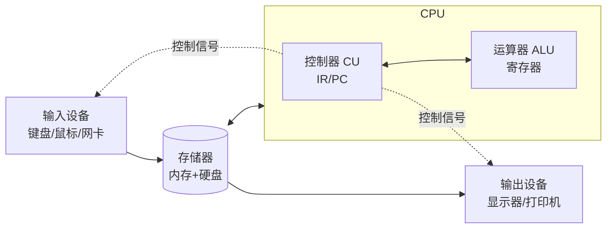

### 4.3 抽象计算机框架

任何一台计算机的任何一个部件都可以归到运算器、控制器、存储器、输入设备和输出设备中，而所有的现代计算机也都是基于这个基础架构来设计开发的。

而所有的计算机程序，也都可以抽象为从输入设备读取输入信息，通过运算器和控制器来执行存储在存储器里的程序，最终把结果输出到输出设备中。

我们所有撰写的无论高级还是低级语言的程序，也都是基于这样一个抽象框架来进行运作的。

**冯·诺依曼架构的抽象框架**：

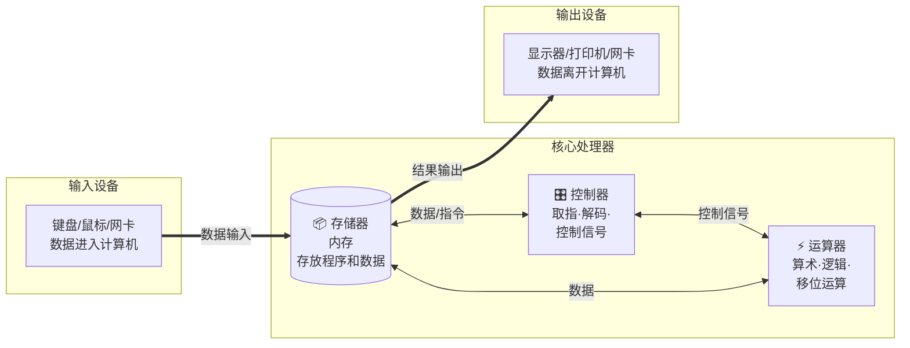

冯·诺依曼结构也称作普林斯顿结构，是一种将程序和数据存放在同一存储器不同地址的设计概念，其核心特点如下：

- 计算机由运算器、控制器、存储器、输入和输出设备五个部分组成
- 数据和程序均以二进制代码形式不加区分地存放在存储器中，具体位置由存储器地址决定
- 顺序执行程序，即计算机工作时，先把要执行的程序和处理的数据存入存储器 (内存)，然后自动并按顺序从存储器中取出指令逐一执行

**用一张表格总结冯·诺依曼架构的核心设计原则**：

| 原则 | 含义 | 现代体现 |
|------|------|---------|
| 二进制表示 | 所有数据和指令都用二进制编码 | 0和1对应电路高低电平 |
| 存储程序 | 程序和数据统一存储在内存中 | RAM中加载的进程 |
| 顺序执行 | 默认按地址顺序逐条执行指令 | 程序计数器PC自动+1 |
| 五大部件 | 运算器+控制器+存储器+输入+输出 | CPU+内存+硬盘+键鼠+显示器 |

### 4.4 冯诺依曼体系

冯·诺依曼体系结构确立了我们现在每天使用的计算机硬件的基础架构。因此，学习计算机组成原理，其实就是学习和拆解冯·诺依曼体系结构。

具体来说，学习组成原理，其实就是学习控制器、运算器的工作原理，也就是 CPU 是怎么工作的，以及为何这样设计；学习内存的工作原理，从最基本的电路，到上层抽象给到 CPU 乃至应用程序的接口是怎样的；学习 CPU 是怎么和输入设备、输出设备打交道的。

学习组成原理，就是在理解从控制器、运算器、存储器、输入设备以及输出设备，从电路这样的硬件，到最终开放给软件的接口，是怎么运作的，为什么要设计成这样，以及在软件开发层面怎么尽可能用好它。

**冯·诺依曼架构的三大设计哲学**：

| 哲学 | 说明 | 对程序员的启示 |
|------|------|--------------|
| **中心化** | 以 CPU 为唯一控制核心，存储器为唯一数据枢纽 | 所有计算都经过 CPU，不需要操心"谁在算" |
| **线性地址空间** | 程序和数据共用同一地址空间，靠地址区分 | 指针和数据的边界由程序员保证，系统不区分 |
| **顺序指令流** | 默认逐条取指 → 解码 → 执行 → 写回 | 跳转和分支是"例外"而非"常态"，需要特殊控制 |

### 4.5 理解案例概念

假设在一个假期中，小杨突然想起了一个许久没有联系的朋友，随即在电脑中打开了QQ，在对话框中输入了要发送的消息，随即向朋友发送了过去。

通过该综合案例理解冯诺依曼体系结构：

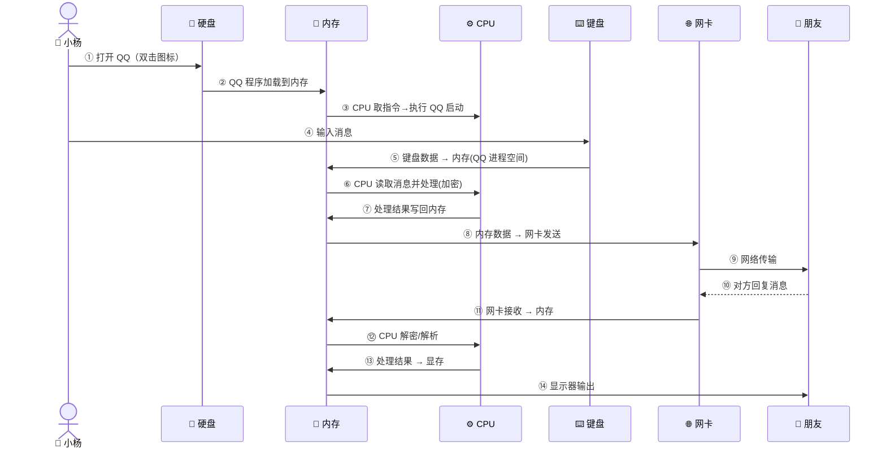

逐步骤对应冯·诺依曼五大部件：

1. **步骤①-②**：QQ 程序从硬盘加载到内存（存储器：硬盘→内存）。**CPU 不直接读硬盘**——由体系结构决定的。
2. **步骤③**：CPU 从内存取指令执行 QQ 启动（运算器+控制器：CPU）。程序已编译成二进制指令，CPU 根据指令集比对后执行。
3. **步骤④-⑤**：小杨通过键盘输入消息，这是 **I/O 过程**。键盘数据以二进制形式写入内存，涉及内存和外设交互。
4. **步骤⑥-⑨**：CPU 处理消息（加密/序列化），结果写回内存，再通过网卡发出。**CPU 始终只和内存打交道**。
5. **步骤⑩-⑭**：对方收到消息，数据先入内存，CPU 解密处理后写回显存，最终输出到显示器。

### 4.6 数据交互层设计

冯诺依曼体系结构，在数据交互层面是如何设计的。CPU不会和外设直接打交道，只会和内存交互。所有的外设如果有数据需要载入只能载入到内存，内存写出的数据也一定是写到外设中去。

**疑惑：为什么 CPU 不直接和硬盘、键盘等外设交互，非要通过内存中转？**

**答疑**：这其实是一个"木桶原理"的问题。

| 设备 | 速度量级 | 比喻 |
|------|---------|------|
| CPU 寄存器 | ~0.3ns | 闪电 |
| 内存（DRAM） | ~100ns | 快递小哥 |
| SSD 硬盘 | ~100μs | 骑自行车 |
| 机械硬盘 | ~10ms | 走路 |
| 网络请求 | ~100ms | 坐火车 |

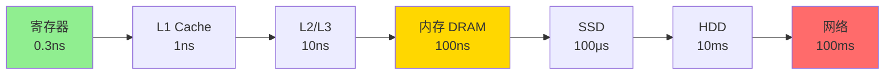

如果 CPU 直接读硬盘，就像让"闪电"等"走路的人"——CPU 99% 的时间都在空等。通过内存做中间层，操作系统可以提前把数据从硬盘搬到内存（预取），CPU 需要时直接从内存拿，速度差从 10 万倍缩小到 100 倍。

**论证**：这也是为什么"程序运行前要先加载到内存"的根本原因。不是内存想抢硬盘的活，而是 CPU 太快了，硬盘太慢了，内存是两者之间最合适的"中间人"。

### 4.7 数据流动层设计

举例现在你在和你的网友进行QQ聊天，你发了一条消息到网友接收到消息中间经历了那些硬件？

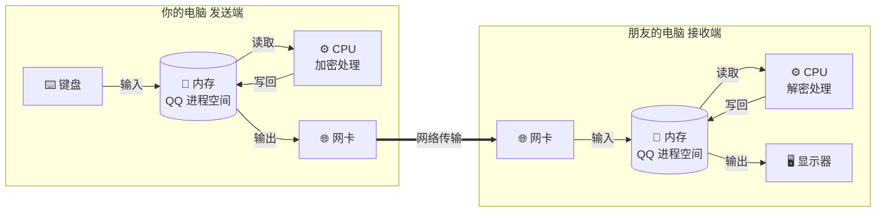

完整的数据流动是什么样的，首先你将消息通过键盘输入，载入到内存中属于QQ的那块空间，然后通过CPU对消息进行处理(加密之类的）然后再写回内存中，内存将数据写到网卡中。

通过网络发送到网友电脑的网卡，然后将接收到的数据写入内存，CPU处理后再写回内存，从内存再写到显示器上。

**注意每一步数据都要经过内存，CPU 永远只和内存打交道**——这就是冯·诺依曼体系的精髓。

### 4.8 控制层面设计

当我们通过键盘将数据输入，内存是如何知道外设中有数据需要加载到内存中呢？当内存中的数据要往磁盘写的话是什么时候写的（肯定不是随时写的，太慢了）也就是缓冲区是什么时候清空的呢。

这里的控制信号由CPU的控制器负责发出。控制器又是在执行谁的指令来控制这些外设和内存呢？实际是操作系统(Operating System)，操作系统是在幕后一直帮助CPU进行决策的。

**深入理解控制流程**：

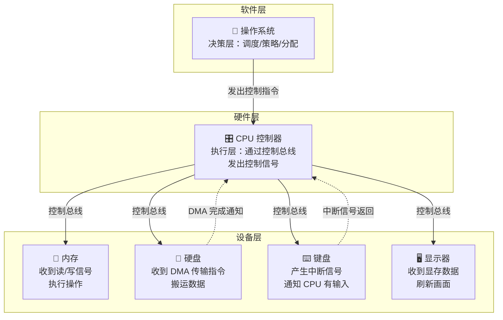

这里涉及两个重要机制：

- **中断机制**：外设不会一直占用CPU，而是有数据时发中断通知CPU。"按下键盘"、"网卡收到包"本质都是外设向 CPU 发了一个中断信号。CPU 收到后暂停当前工作，转去处理中断服务程序（ISR），处理完再回到原来的工作。**没有中断机制，你的电脑只能一次做一件事，而且必须轮询每个外设"你有数据吗？"——CPU 100% 空转**。
- **DMA 机制**：大块数据传输（如硬盘到内存）不需要CPU逐字节搬运，由 DMA 控制器代劳。CPU 只需告诉 DMA："把这块数据从硬盘地址 X 搬到内存地址 Y"，然后就可以去干别的。DMA 完成后回到 CPU 发一个中断说"搬完了"。

**中断 vs DMA 的分工**：

| 机制 | 适用场景 | CPU 参与方式 | 典型应用 |
|------|---------|-------------|---------|
| 中断 | 小数据量 / 事件通知 | CPU 亲自处理 | 按键、网卡收包中断 |
| DMA | 大数据块传输 | CPU 只下达指令，不参与搬运 | 硬盘读写、PCIe 传输 |
| 轮询（无中断） | 高吞吐低延迟 | CPU 100% 空转轮询 | 高性能网卡 DPDK |

### 4.9 一道练习题

例题：冯诺依曼机的基本工作方式是：A.控制流驱动方式；B.多指令多数据流方式；C.微程序控制方式；D.数据流驱动方式

答案：A；冯·诺依曼机工作方式，可称为控制流(指令流)驱动方式。即按照指令的执行序列，依次读取指令，然后根据指令所含的控制信息，调用数据进行处理。

B属于多处理机，冯诺依曼机是单指令流和单数据流系统；数据流驱动方式指：只有当一条或一组指令所需的操作数全部准备好时，才能激发相应指令的一次执行，执行结果又流向等待这一数据的下一条或一组指令，以驱动该条或该组指令的执行。

因此，程序中各条指令的执行顺序仅仅是由指令间的数据依赖关系决定的。

存储程序的概念是指将指令以代码形式事先输入计算机的主存储器，然后按其在存储器中的首地址执行程序的第一条指令，以后就按程序的规定顺序执行其他指令，直至程序执行结束。


## 05.计算机组成原理

### 5.1 计算机知识地图

从这张图可以看出来，整个计算机组成原理，就是围绕着计算机是如何组织运作展开的。

知识地图可以划分为四大模块：

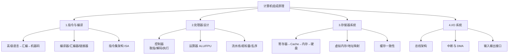

### 5.2 计算机基本组成

计算机是由哪些硬件组成的。这些硬件，又是怎么对应到经典的冯·诺依曼体系结构中的，也就是运算器、控制器、存储器、输入设备和输出设备这五大基本组件。

除此之外，你还需要了解计算机的两个核心指标，性能和功耗。性能和功耗也是我们在应用和设计五大基本组件中需要重点考虑的因素。

在计算机指令部分，需要搞明白，我们每天撰写的一行行 C、Java、PHP 程序，是怎么在计算机里面跑起来的。

这里面，你既需要了解我们的程序是怎么通过编译器和汇编器，变成一条条机器指令这样的编译过程（如果把编译过程展开的话，可以变成一门完整的编译原理课程），还需要知道我们的操作系统是怎么链接、装载、执行这些程序的（这部分知识如果再深入学习，又可以变成一门操作系统课程）。

而这一条条指令执行的控制过程，就是由计算机五大组件之一的控制器来控制的。

在计算机的计算部分，要从二进制和编码开始，理解我们的数据在计算机里的表示，以及我们是怎么从数字电路层面，实现加法、乘法这些基本的运算功能的。

实现这些运算功能的 ALU（Arithmetic Logic Unit/ALU），也就是算术逻辑单元，其实就是我们计算机五大组件之一的运算器。

### 5.3 控制器

控制器是计算机的指挥中心，由其指挥各部件自动协调地进行工作。控制器由程序计数器PC、指令寄存器IR和控制单元CU组成。

PC用于存放当前欲执行指令的地址，可自动+1以形成下一条指令的地址，与主存的MAR之间有一条直接通路。

IR用来存放当前的指令，其内容来自主存的MDR。指令中的操作码OP（IR）送至CU，用以分析指令并发出各种微操作命令序列；地址码Ad(IR)送往MAR，用以取操作数。（操作码表示机器所执行的各种操作，地址码表示参加运算的数在存储器内的位置）

**控制器的工作流程（指令周期）**：

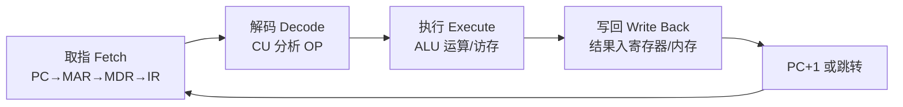

这个循环就叫做**指令周期（Instruction Cycle）**，CPU 从开机到关机，就在不停地执行这个循环。

### 5.4 存储器

存储器是计算机的存储部件，用来存放程序和数据。

存储器分为主存储器（主存，内存储器，内存）和辅助存储器（辅存，外存储器，外存）。CPU能够直接访问的存储器是主存。辅存用于帮助主存记忆更多信息，辅存中的信息必须调入主存后，才能被CPU访问。

**存储层次全景（Memory Hierarchy）**：

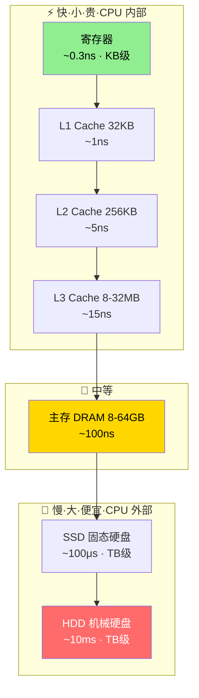

主存包括存储体M、各种逻辑部件及控制电路等。

- 存储体由许多存储单元组成，每个存储单元包含若干存储元件（或称存储基元、存储元），每个存储元件存储一位二进制代码 0 or 1。
- 因此存储单元可存储一串二进制代码，称这串代码为存储字，称这串代码的位数为存储字长，存储字长可以是1B或是字节的偶数倍。一个存储字既可代表数，也可代表一串字符，也可代表指令等。
- 主存的工作方式为：按存储单元的地址进行存取，这种存取方式称为按地址存取方式，即按地址访问存储器（简称按地址寻访，访存）。

存储体存放二进制信息

- 地址寄存器（MAR）存放访存地址，经过地址译码后找到所选的存储单元。
- 数据寄存器（MDR）用于暂存要从存储器中读或写的信息，时序控制逻辑用于产生存储器操作所需的各种时序信号。

**存储层次的本质——"时间局部性"与"空间局部性"**：

为什么缓存在工程上有效？因为程序表现出两种访问规律：

1. **时间局部性**：刚访问过的数据很可能再次访问（比如循环变量 `i` 在每次迭代都被用到）。L1/L2 专门捕获这种规律。
2. **空间局部性**：访问地址 X 之后，地址 X+1 很可能马上被访问（比如遍历数组）。Cache Line（通常 64 字节）一次预取连续的 64 个字节，后面的访问直接命中缓存。

**对程序员的启示**：遍历 `int[10000][10000]` 时，按行遍历 `for(i) for(j) arr[i][j]` 比按列遍历 `for(j) for(i) arr[i][j]` 快 10-20 倍——因为前者连续访问内存地址，后者每次访问都跳一行，几乎每次 Cache Miss。

### 5.5 输入设备

输入设备的主要功能是将程序和数据以机器所能识别和接受的信息形式输入计算机。

常见的输入设备有键盘、鼠标、扫描仪、摄像机等。

**输入设备的关键设计问题**：

| 设计问题 | 说明 | 例子 |
|---------|------|------|
| 信号转换 | 物理量 → 数字信号（A/D 转换） | 麦克风：声波 → PCM 采样；摄像头：光 → 像素矩阵 |
| 采样精度 | 用多少二进制位表示一个信号 | 8位=256灰阶，16位=65536灰阶，24位=1670万色 |
| 采样频率 | 每秒采集多少次 | 音频 44.1kHz，鼠标 125-1000Hz 轮询率 |
| 去抖/消抖 | 机械触点抖动产生假信号 | 键盘加 5-20ms 的消抖延迟 |
| 接口协议 | 数据怎么传到计算机 | USB HID 协议、蓝牙 HID Profile |

**思考——为什么按一下键盘，屏幕上有延迟？**

从手指按下到字符出现在屏幕上，整个过程涉及：手指触动 → 按键物理接触 → 触点抖动（~5ms）→ 键盘控制器消抖 → 扫描码生成 → USB 轮询（每 1ms）→ 操作系统中断处理 → 输入法匹配 → 应用接收 → 渲染 → 显示器刷新（16.7ms@60Hz）→ 像素响应。**这链条上有超过 10 个环节，任何一环的延迟都会叠加到总体验上**。

### 5.6 输出设备

输出设备的任务是将计算机处理的结果以人们所能接受的形式或其他系统所要求的信息形式输出。

常用的输出设备有显示器、打印机等。计算机的I/O设备是计算机与外界联系的桥梁。

**输出设备的核心原理——显示器为例**：


**关键参数**：

| 参数 | 含义 | 典型值 |
|------|------|--------|
| 分辨率 | 水平和垂直的像素数量 | 1920×1080 / 3840×2160 |
| 刷新率 | 每秒刷新画面的次数 | 60Hz / 144Hz / 240Hz |
| 色彩深度 | 每个像素用多少位表示颜色 | 8-bit（1670万色）/ 10-bit（10.7亿色） |
| 像素响应时间 | 液晶分子从一种状态切换到另一种的速度 | 1ms（TN）/ 4ms（IPS）/ 0.1ms（OLED） |
| 色域覆盖率 | 能显示的色彩范围 | sRGB 100% / DCI-P3 95% |

**输出设备的本质**：把数字信号（存储在内存或显存中的二进制数据）转换成人类能感知的物理信号（光、声音、纸面油墨）。这个过程叫**D/A 转换**（Digital to Analog）。显示器每秒钟做百万次 D/A，打印机每页做一次大规模的 D/A。

### 5.7 运算器

运算器是计算机的执行部件，用于进行算术运算和逻辑运算。

算术运算是按算术运算规则进行的运算，如加、减、乘、除；逻辑运算包括与、或、非、异或、比较、移位等运算。

运算器的核心是算术逻辑单元ALU（Arithmetic and Logical Unit）。运算器包含若干通用寄存器，用于暂存操作数和中间结果，如累加器ACC，乘商寄存器MQ，操作数寄存器X，变址寄存器IX，基址寄存器BR等，其中ACC, MQ, X是必须有的。

运算器内还有程序状态寄存器PSW，也称标志寄存器，用于存放ALU运算得到的一些标志信息或处理机的状态信息。

**深入理解ALU——用一个加法来说明**：

当执行 `3 + 5` 时，在 ALU 内部发生了什么？

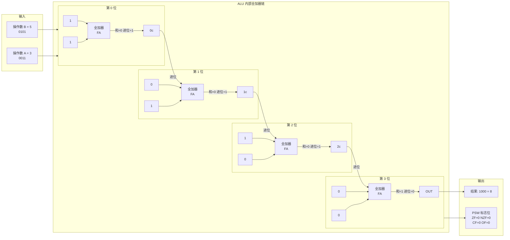

**逐位运算过程**：

| 位 | A | B | 输入进位 | 全加器输出和 | 输出进位 |
|----|---|---|---------|-----------|---------|
| 第0位 | 1 | 1 | 0 | 0 | 1 |
| 第1位 | 1 | 0 | 1 | 0 | 1 |
| 第2位 | 0 | 1 | 1 | 0 | 1 |
| 第3位 | 0 | 0 | 1 | 1 | 0 |

结果 `1000`（二进制）= `8`（十进制），PSW 更新标志位（零标志 ZF=1、进位 CF=0、溢出 OF=0）。

**从 ALU 到程序员**：此时 PSW 的状态对高级语言程序员是透明的——你用 `int c = a + b;` 不会直接看到标志位。但在底层，**每条算术指令都在悄悄地更新 PSW**，条件跳转（`if` / `for` / `while`）完全依赖这些标志位来判断"是否继续循环"、"是否走分支"。

### 5.8 五大部件协作

**疑惑：五大部件是如何协同执行一条指令的？**

以执行 `a = b + c`（假设 b=3, c=5）为例，完整的硬件级别流程：

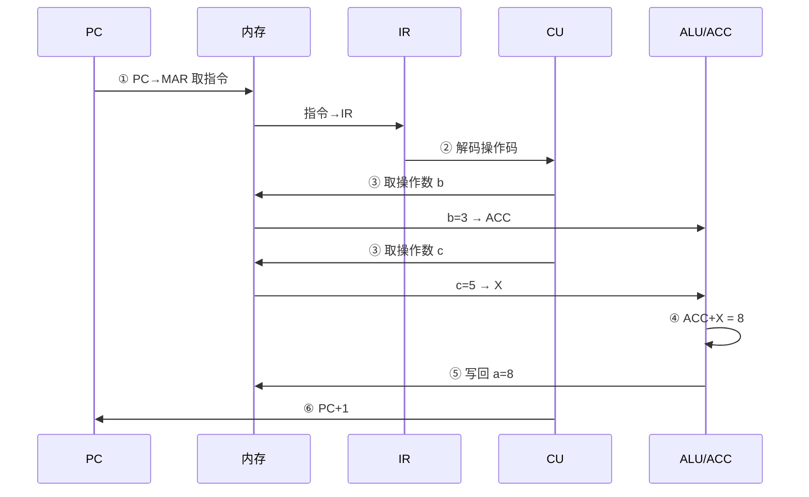


## 06.深入冯诺依曼架构

### 6.1 为什么存储程序

**疑惑：存储程序的概念看起来理所当然，为什么它被认为是计算机科学最伟大的发明之一？**

**答疑**：在存储程序之前，"计算机"和"计算器"并没有本质区别——它们都只能执行预设好的固定功能。存储程序的革命性在于：

1. **程序即数据**：程序以二进制形式存储在内存中，与数据没有本质区别
2. **自我修改**：程序可以修改自身（虽然现代编程不推荐这样做）
3. **通用性**：同一台硬件通过加载不同程序，可以完成截然不同的任务

```mermaid
flowchart LR
    subgraph NO[❌ 固定功能计算机]
        HW1[硬件电路<br/>固定逻辑] --> OUT1[只能做一件事<br/>换任务 = 换机器]
    end
    subgraph YES[✅ 存储程序计算机]
        MEM[(内存<br/>存放程序)]
        HW2[通用硬件<br/>CPU + 总线] --> MEM
        MEM --> OUT2[同一台机器<br/>加载什么程序<br/>就做什么事]
    end
    NO -.->|突破| YES
    style NO fill:#FFE4E1
    style YES fill:#E0FFE0
```

类比理解：
- 没有存储程序 = 只会炒一道菜的厨师（换菜需要换厨师）
- 有了存储程序 = 有菜谱的厨师（换菜只需要换菜谱）
- "菜谱"就是程序，"菜谱架"就是内存

### 6.2 哈佛vs冯诺依曼

**疑惑：计算机架构只有冯·诺依曼一种吗？**

**答疑**：不是。与之对应的还有**哈佛架构（Harvard Architecture）**。

| 特性 | 冯·诺依曼架构 | 哈佛架构 |
|------|-------------|---------|
| 存储方式 | 指令和数据共用一个存储器 | 指令和数据分开存储 |
| 总线 | 共用一条总线 | 指令总线和数据总线分离 |
| 优点 | 设计简单、灵活性高 | 可以同时取指令和读数据，效率更高 |
| 缺点 | 取指令和读数据不能同时进行 | 硬件复杂度更高、成本更高 |
| 典型应用 | 通用计算机（PC、服务器） | 嵌入式系统、DSP、单片机 |

哈佛架构的核心优势在于：指令和数据可以**并行访问**。因为它们在物理上走的是不同的"通道"。

**两种架构的直观对比**：

```mermaid
flowchart LR
    subgraph VN[冯·诺依曼架构]
        direction TB
        VCPU[CPU]
        VBUS[统一总线<br/>一条通道]
        VMEM[(统一存储器<br/>指令+数据混放)]
        VCPU <-->|取指令<br/>+<br/>读数据<br/>串行| VBUS
        VBUS <--> VMEM
    end
    subgraph HV[哈佛架构]
        direction TB
        HCPU[CPU]
        IBUS[指令总线]
        DBUS[数据总线]
        IMEM[(指令存储器)]
        DMEM[(数据存储器)]
        HCPU <-->|取指令| IBUS --> IMEM
        HCPU <-->|读/写数据| DBUS <--> DMEM
    end
    style VN fill:#FFF3CD
    style HV fill:#D1ECF1
```

**关键差异**：冯·诺依曼架构下，CPU 要先取指令再读数据——两个操作**串行**。哈佛架构可以让这两个操作同时进行——**并行**。对于嵌入式实时系统（如无人机飞控），每条指令的执行时间必须确定且最短，哈佛架构的并行优势就是必需的。

### 6.3 现代混合架构

**结论：现代CPU其实是混合架构**。

在CPU外部（内存侧），使用的是冯·诺依曼架构：指令和数据混合存放在同一个内存中。

但在CPU内部（缓存侧），使用的是哈佛架构：L1 Cache 分为指令缓存（I-Cache）和数据缓存（D-Cache），分别存储指令和数据，可以并行访问。

```mermaid
flowchart TB
    subgraph CPU[CPU 内部 - 哈佛架构]
        IC[I-Cache 指令缓存]
        DC[D-Cache 数据缓存]
        L2[L2 Cache 统一]
        IC --> L2
        DC --> L2
    end
    L2 --> MEM[(内存 RAM<br/>冯·诺依曼架构<br/>指令+数据混合)]
```

### 6.4 冯诺依曼瓶颈

**疑惑：冯·诺依曼架构有什么根本性的缺陷？**

冯·诺依曼架构有一个著名的瓶颈——**冯·诺依曼瓶颈（Von Neumann Bottleneck）**：

CPU 和内存之间的数据传输通道（总线）带宽有限。无论 CPU 多快，它处理数据的速度最终受限于从内存获取数据的速度。

```mermaid
flowchart LR
    CPU2[⚡ CPU<br/>执行速度 ~10GHz<br/>每秒百亿次操作] -->|窄通道| BUS[总线<br/>带宽 ~50GB/s<br/>实际吞吐远低于此]
    BUS -->|瓶颈在此| MEM2[(📝 内存<br/>供给速度跟不上<br/>CPU 只能等待)]
    
    style BUS fill:#FF6B6B,color:#fff,stroke:#333,stroke-width:3px
```

```
CPU 处理速度:  ~10 GHz（每秒100亿次操作）
内存带宽:      ~50 GB/s
实际瓶颈:      CPU 大量时间在"等数据"——称为"内存墙"(Memory Wall)
```

这就像一个天才厨师配了一个慢吞吞的传菜员——厨师炒菜极快，但食材送来太慢，厨师只能干等着。

**瓶颈在不同场景的表现**：

| 场景 | 瓶颈表现 | 用户感受 |
|------|---------|----------|
| 大循环处理数组 | 每次迭代等数据填满 Cache Line | CPU 使用率显示"高"但有效进度慢 |
| 数据库全表扫描 | 每条记录都要从内存/磁盘取 | 查询慢，CPU 实际在等 I/O |
| 机器学习训练 | 数据搬进 GPU 显存的速度跟不上 | GPU 利用率低，训练时间长 |
| 视频播放 | 解码后的帧要搬到显存再输出 | 掉帧、画面卡顿 |

### 6.5 突破瓶颈思路

工程师们用了多种方法来缓解这个瓶颈：

| 方法 | 原理 | 效果 |
|------|------|------|
| CPU缓存（L1/L2/L3） | 在CPU内部存储常用数据 | 减少90%+的内存访问 |
| 预取（Prefetch） | 提前将可能需要的数据加载到缓存 | 隐藏内存延迟 |
| 多通道内存 | 增加并行的内存通道 | 增加带宽 |
| 乱序执行 | CPU在等数据时先执行其他指令 | 提高CPU利用率 |
| DMA | I/O数据传输不经过CPU | CPU专注计算 |
| 近内存计算（PIM） | 把计算单元放到内存芯片上 | 从根本上减少数据搬运 |

**各种对策的层次关系**：

```mermaid
flowchart TB
    BOTTLENECK[冯·诺依曼瓶颈<br/>CPU 快·内存慢]
    BOTTLENECK --> L1[层 1: 缓存<br/>L1/L2/L3 Cache<br/>把热数据拉到 CPU 门口]
    BOTTLENECK --> L2[层 2: 智能预取<br/>推测未来访问<br/>提前搬数据]
    BOTTLENECK --> L3[层 3: 架构优化<br/>乱序执行/超标量<br/>等数据时干别的]
    BOTTLENECK --> L4[层 4: 带宽扩容<br/>多通道内存/DDR5<br/>增加管道宽度]
    BOTTLENECK --> L5[层 5: 卸载任务<br/>DMA 绕过 CPU<br/>让专用部件搬数据]
    BOTTLENECK --> L6[层 6: 颠覆式<br/>存内计算/PIM<br/>数据不动 计算动]
    
    style BOTTLENECK fill:#FF6B6B,color:#fff
    style L1 fill:#90EE90
    style L6 fill:#87CEEB
```

**各层对策的收益与代价**：

| 层 | 性能提升 | 代价 |
|----|---------|------|
| 缓存 | 10-100x | 晶体管面积 + 功耗 |
| 预取 | 2-10x（命中时）| 误预取浪费带宽、污染缓存 |
| 乱序执行 | 1.5-3x | 功耗、设计复杂度、Spectre类安全漏洞 |
| 多通道 | 2-4x | 主板布线成本、内存条价格 |
| DMA | 解放CPU | 一致性管理复杂 |
| PIM | 10-100x（特定场景）| 软件生态不成熟、标准未定 |


## 07.计算机性能功耗

### 7.1 如何衡量性能

**疑惑：我们经常说某台电脑"性能好"，但性能到底是什么，怎么量化？**

性能可以从两个维度来看：

**响应时间（Latency）**：完成一个任务需要多长时间。比如编译一个项目需要30秒。

**吞吐量（Throughput）**：单位时间内能完成多少任务。比如一个Web服务器每秒能处理1000个请求。

**"性能"的两个维度是鱼和熊掌**：

```mermaid
flowchart LR
    subgraph LATENCY[响应时间 Latency]
        L1[单个任务耗时<br/>如：编译 30 秒]
    end
    subgraph THROUGHPUT[吞吐量 Throughput]
        T1[单位时间完成量<br/>如：1000 req/s]
    end
    LATENCY -.->|"流水线技术：<br/>延迟不变但吞吐翻倍"| THROUGHPUT
    style LATENCY fill:#D1ECF1
    style THROUGHPUT fill:#FFF3CD
```

对于 CPU 来说，最基本的性能指标是：

```
CPU 执行时间 = 指令数 × CPI × 时钟周期

其中：
  指令数：程序包含多少条指令（由编译器决定）
  CPI (Cycles Per Instruction)：每条指令平均需要几个时钟周期（由CPU微架构决定）
  时钟周期 = 1 / 主频（由芯片制程和设计决定）
```

**三个维度的跨层分工**：

```mermaid
flowchart TB
    FORMULA[CPU 执行时间]
    FORMULA --> IC[指令数 Instruction Count<br/>👨‍💻 程序员 + 编译器<br/>算法选择、编译优化级别]
    FORMULA --> CPI[周期数/指令 Cycles Per Instruction<br/>🏗️ CPU 架构师<br/>流水线、超标量、分支预测]
    FORMULA --> CCT[时钟周期 Clock Cycle Time<br/>🔬 芯片工程师<br/>制程工艺、电路设计]
    
    style IC fill:#E0FFE0
    style CPI fill:#FFE4B5
    style CCT fill:#FFB6C1
```

### 7.2 性能公式推导

**为什么理解这个公式很重要？** 因为它告诉我们优化性能有三个方向：

| 优化方向 | 方法 | 谁负责 |
|---------|------|--------|
| 减少指令数 | 更好的算法、编译器优化 | 程序员 + 编译器 |
| 降低CPI | 流水线、超标量、分支预测 | CPU 架构师 |
| 缩短时钟周期 | 提高主频、更先进的制程 | 芯片工程师 |

举个实际例子：

```
场景：排序100万个整数

方案A（冒泡排序）：
  指令数: ~10^12    CPI: 2    主频: 3GHz
  时间 = 10^12 × 2 / (3×10^9) ≈ 667 秒

方案B（快速排序）：
  指令数: ~2×10^7   CPI: 3    主频: 3GHz
  时间 = 2×10^7 × 3 / (3×10^9) ≈ 0.02 秒

虽然快排的 CPI 更高（因为有递归、分支），
但指令数减少了5万倍，总体快了3万多倍。
```

**结论**：减少指令数（选对算法）往往比硬件优化更有效。

### 7.3 功耗墙问题

**疑惑：为什么CPU的主频在2005年前后就停止大幅增长了？**

**答疑**：这就是著名的"功耗墙（Power Wall）"问题。

CPU的功耗公式：

```
动态功耗 ∝ 电容负载 × 电压² × 频率
```

主频翻倍，功耗至少翻倍（实际上因为电压也要提高，功耗可能增长4-8倍）。当功耗增大，散热就成问题：

```mermaid
flowchart LR
    subgraph TREND[主频与功耗增长]
        direction TB
        T1["2000 年<br/>Pentium 4<br/>1.5GHz · 55W"]
        T2["2004 年<br/>Pentium 4<br/>3.8GHz · 115W"]
        T3["2024 年<br/>i9-14900K<br/>6.0GHz(睿频) · 253W"]
        T1 -->|"主频 ↑2.5x<br/>功耗 ↑2x"| T2
        T2 -->|"主频 ↑1.6x<br/>功耗 ↑2.2x"| T3
    end
    TREND --> WALL[🧱 功耗墙<br/>若 10GHz → 功耗 > 500W<br/>= 一台电暖器！]
    
    style WALL fill:#FF6B6B,color:#fff
```

```
2000年: Pentium 4 — 主频 1.5GHz, 功耗 ~55W
2004年: Pentium 4 — 主频 3.8GHz, 功耗 ~115W
2024年: i9-14900K — 主频 6.0GHz(睿频), 功耗 ~253W
```

**论证**：如果按照2000年的增长趋势继续提高主频到 10GHz，CPU功耗将超过 500W——这几乎等于一个电暖器！所以行业转向了多核、异构计算等方向。

**功耗墙推动的两大转向**：

| 转向 | 做法 | 代表 |
|------|------|------|
| 多核 | 用多个低频核心替代一个高频核心 | Intel Core 2 Duo (2006) |
| 异构计算 | 不同任务交给不同效率的核心 | ARM big.LITTLE、Apple M 系列 |
| 暗硅 (Dark Silicon) | 芯片上部分区域不通电以提高能效 | 现代 GPU、AI 加速器 |

### 7.4 阿姆达尔定律

**疑惑：既然单核遇到瓶颈，那堆核心数就能线性提升性能吗？**

**答疑**：不能。这就是阿姆达尔定律（Amdahl's Law）告诉我们的：

```
加速比 = 1 / ((1-P) + P/N)

其中：
  P = 程序中可并行化的比例
  N = 处理器核心数
```

假设一个程序 90% 的代码可以并行化（P=0.9）：

```mermaid
xychart-beta
    title "阿姆达尔定律：加速比随核心数变化 (P=0.9)"
    x-axis "核心数 N" [1, 2, 4, 8, 16, 32, 64, 128]
    y-axis "加速比" 1 --> 10.5
    line [1, 1.82, 3.08, 4.71, 6.40, 7.80, 8.77, 9.28]
```

| 核心数N | 理论加速比 | 提升效果 |
|--------|-----------|---------|
| 1 | 1.0x | 基准 |
| 2 | 1.82x | 82% ↑ |
| 4 | 3.08x | 208% ↑ |
| 8 | 4.71x | 371% ↑ |
| 16 | 6.40x | 540% ↑ |
| 64 | 8.77x | 趋近饱和 |
| ∞ | 10.0x | **理论极限** |

**关键规律——边际收益递减**：

- 从 1 核到 2 核：加速 82%，每核成本换 82% 收益 → 划算
- 从 32 核到 64 核：加速仅从 7.80 到 8.77，增加 32 核只换 0.97x → 极不划算
- 从 64 核到 ∞：最多只能再从 8.77 到 10.0，不值得

**结论**：即使有无限多的核心，由于 10% 的串行部分的存在，加速比最多只能达到 10 倍。这就是为什么 CPU 不会无限增加核心数的原因。优化那 10% 的串行代码，比增加 100 个核心更有效。

**对程序员的启示**：并行化之前，先用 profiler 分析串行瓶颈在哪里。把 10% 的串行部分优化完，再考虑加核心——顺序不能反。


## 08.如何学习原理

### 8.1 知识体系太大

相较于整个计算机科学中的其他科目，计算机组成原理更像是整个计算机学科里的"纲要"。这门课里任何一个知识点深入挖下去，都可以变成计算机科学里的一门核心课程。

比如说，程序怎样从高级代码变成指令在计算机里面运行，对应着"编译原理"和"操作系统"这两门课程；计算实现背后则是"数字电路"；如果要深入 CPU 和存储器系统的优化，必然要深入了解"计算机体系结构"。

**知识关联图谱**：

```mermaid
flowchart TB
    ROOT[计算机组成原理<br/>本课程]
    ROOT --> A[编译原理<br/>指令生成]
    ROOT --> B[操作系统<br/>程序管理]
    ROOT --> C[数字电路<br/>硬件实现]
    A --> ARCH[计算机体系结构<br/>高级 CPU 设计]
    B --> ARCH
    C --> ARCH
    ARCH --> X[并行计算]
    ARCH --> Y[嵌入式系统]
    ARCH --> Z[计算机网络]
```

### 8.2 如何学该专栏

首先，学会提问自己来串联知识点。学完一个知识点之后，可以从下面两个方面，问一下自己。

- 我写的程序，是怎样从输入的代码，变成运行的程序，并得到最终结果的？
- 整个过程中，计算器层面到底经历了哪些步骤，有哪些地方是可以优化的？

以教带学的方式内化知识，无论是程序的编译、链接、装载和执行，以及计算时需要用到的逻辑电路、ALU，乃至 CPU 自发为你做的流水线、指令级并行和分支预测，还有对应访问到的硬盘、内存，以及加载到高速缓存中的数据，这些都对应着我们学习中的一个个知识点。

建议自己脑子里过一遍，最好是口头表述一遍或者写下来，这样对彻底掌握这些知识点都会非常有帮助。

写一些示例程序来验证知识点，计算机科学是一门实践的学科。计算机组成中的大量原理和设计，都对应着"性能"这个词。因此，通过把对应的知识点，变成一个个性能对比的示例代码程序记录下来，是把这些知识点融汇贯通的好方法。

**推荐的学习路径**：

```mermaid
timeline
    title 计算机组成原理六阶段学习路线
    第一阶段 建立全景(本章) : 冯·诺依曼架构五大部件 : 指令执行基本流程 : 硬件协作直觉
    第二阶段 二进制与编码 : 二进制·补码·浮点数 : 数据在计算机中的表示 : 理解"0和1的规则"
    第三阶段 指令系统 : 指令格式·寻址方式 : 高级语言→机器码 : 编译器的工作
    第四阶段 处理器设计 : CPU 内部结构 : 流水线·分支预测 : ALU 如何计算
    第五阶段 存储系统 : 存储层次结构 : 缓存设计·虚拟内存 : 数据从哪来
    第六阶段 I/O系统 : 总线·中断·DMA : I/O 模型 : 数据到哪去
```

```
第一阶段：建立全景（本章）
  → 理解冯·诺依曼架构五大部件
  → 理解指令执行的基本流程

第二阶段：深入二进制与编码
  → 二进制、补码、浮点数
  → 理解数据在计算机中的表示

第三阶段：理解指令系统
  → 指令格式、寻址方式
  → 从高级语言到机器码

第四阶段：处理器设计
  → CPU 内部结构
  → 流水线、缓存一致性

第五阶段：存储系统
  → 存储层次结构
  → 缓存设计、虚拟内存

第六阶段：I/O系统
  → 总线、中断、DMA
  → I/O模型
```

**贯穿全章的三个核心问题**（每学完一个阶段回来回答一次，看答案是否有深化）：

1. **数据去哪了？** → 从输入设备 → 内存 → Cache → 寄存器 → ALU → 寄存器 → Cache → 内存 → 输出设备。整章的核心就是这个闭环。
2. **谁在做控制？** → 控制器（PC → IR → CU）+ 操作系统，从取指到写回，每一步都由 CU 发出的控制信号驱动。
3. **哪里最慢？** → 从寄存器(0.3ns)到网络(100ms)，区间差 3 亿倍。性能优化的本质是"把数据往金字塔尖搬，把计算往数据就近放。"


## 09.综合案例按键显示

现在用一个完整案例把全章五大部件、性能公式、冯·诺依曼瓶颈全部串起来。

### 9.1 场景背景

你在文本编辑器里按下键盘上的 `A` 键，屏幕上随即出现一个 `A` 字符。这个看似瞬时的动作，其实让计算机的**五大部件全部参与**，并且走完了一整条指令流、数据流、控制流。

我们把这 50 毫秒左右的过程慢放给你看。

**"按 A 键"事件的硬件全景**：

```mermaid
flowchart LR
    YOU[👤 你<br/>按下 A 键] -->|机械动作| KEY[⌨️ 键盘<br/>① 扫描码 0x1E<br/>② 去抖 ~5ms]
    KEY -->|USB 中断| CPU[⚙️ CPU<br/>③ 中断响应<br/>④ 保存现场<br/>⑤ 查中断向量]
    CPU -->|DMA| RAM[(📝 内存<br/>⑥ 键盘缓冲区<br/>⑦ 字体位图数据<br/>⑧ 显存帧缓冲)]
    RAM -->|PCIe Bus| GPU[🎨 GPU<br/>⑨ 处理位图<br/>⑩ 输出显示信号]
    GPU -->|HDMI/DP| LCD[🖥️ 显示器<br/>⑪ 液晶像素响应<br/>⑫ 你看到了 A]
```

### 9.2 完整流程分解

```mermaid
sequenceDiagram
    participant KB as 键盘(输入)
    participant USB as USB 控制器
    participant CPU as CPU
    participant MEM as 内存
    participant GPU as 显存
    participant DSP as 显示器(输出)
    Note over KB: T=0ms ① 扫描码 0x1E
    KB->>USB: 按键事件
    USB->>CPU: ② T=0.1ms IRQ 中断
    Note over CPU: 保存 PC/PSW，查中断向量
    CPU->>MEM: ③ T=0.3ms 写入键盘缓冲区
    Note over CPU,MEM: ④ T=1ms 唤醒编辑器进程<br/>ALU 算字符位图
    CPU->>GPU: ⑤ T=5ms PCIe+DMA 传位图
    GPU->>DSP: ⑥ T=16.7ms HDMI 扫描
    Note over DSP: 像素点亮，看到 A
```

### 9.3 五大部件角色

| 部件 | 具体承担者 | 这次按键中的动作 | 对应的冯·诺依曼术语 |
|------|-----------|-----------------|-------------------|
| 输入设备 | 键盘 | 把机械动作转成扫描码 | I/O Input |
| 控制器 | CPU 控制单元 CU + 中断控制器 | 接收中断、查向量表、调度进程 | Control Unit |
| 运算器 | CPU ALU | 字符编码转换、字体坐标计算 | Arithmetic Logic Unit |
| 存储器 | 内存 + 显存 | 保存扫描码、进程状态、像素位图 | Memory |
| 输出设备 | 显示器 | 把显存里的像素点亮成图像 | I/O Output |

**关键观察**：

1. CPU 从始至终只和"内存"打交道——扫描码、进程数据、像素位图都是先落到内存，再通过总线转给下一个部件。这正是**冯·诺依曼架构的核心规定**。
2. 整个过程中 **CPU 真正算"正事"的时间不到 1ms**，剩下的时间都是总线传输和等待外设——这就是**冯·诺依曼瓶颈**的直观体现。
3. 如果没有中断机制，CPU 必须轮询键盘控制器，假设以 1kHz 轮询，则键盘响应延迟至少 1ms 且 CPU 100% 空转；有了中断，CPU 平时可以跑别的程序。
4. 如果没有 DMA，位图数据（几 KB）需要 CPU 逐字节往显存搬，会把 CPU 锁死几毫秒；DMA 让 CPU 只下达"搬运指令"后就可以去干别的。

### 9.4 性能公式复盘

回忆 7.2 节的性能公式：`CPU执行时间 = 指令数 × CPI × 时钟周期`。把这次按键的耗时拆开：

```
端到端延迟 ≈ 键盘→USB(0.1ms)
           + 中断响应(0.2ms)
           + CPU 处理字符(0.7ms)  ← 这里才是 CPU 真正干活
           + PCIe 传显存(4ms)
           + 显示器刷新等待(≤16.7ms)
           + 液晶像素响应(5~16ms)
           ≈ 30~50ms
```

**时延拆解**：

```mermaid
pie title 按键到显示的各环节耗时占比 (总计 50ms)
    "显示器刷新等待" : 16.7
    "液晶像素响应" : 12
    "PCIe 传显存" : 4
    "键盘去抖+USB" : 5
    "中断响应" : 0.2
    "CPU 真正干活" : 0.7
    "其他(调度等)" : 11.4
```

**结论三连**：

- **瓶颈不在 CPU**：CPU 只花了 0.7ms，占整体 <2%。盲目提升 CPU 主频对这条路径毫无帮助。
- **瓶颈在传输和等待**：总线、显示器刷新率、液晶响应才是决定"按键到看到字"延迟的关键。这就是为什么电竞显示器主打 240Hz 刷新率和 1ms 响应。
- **对程序员的启示**：当你优化自己代码的用户体验时，也要学会把"端到端时间"拆成这几类组件，不要只盯着 CPU 算得快不快。**95% 的"感觉慢"不是 CPU 的问题，而是路径上的等待和传输**。


## 10.思考题与作业

### 10.1 基础思考题

1. **五大部件对号入座**：请把下列硬件分别归入冯·诺依曼五大部件（运算器/控制器/存储器/输入/输出）：
   - 机械硬盘 / SSD / RAM / CPU 的 ALU / CPU 的程序计数器 PC / 键盘 / 打印机 / 触摸屏 / 网卡 / GPU

2. **为什么程序必须先加载到内存才能运行？** 请从"CPU 只和内存打交道"这个约束出发回答，并说明如果允许 CPU 直接读硬盘会有什么问题。

3. **指令周期四个阶段**（取指/解码/执行/写回）分别由哪些部件参与？请画出一次 `a = b + c` 指令在五大部件之间的数据流动图。

4. **冯·诺依曼架构和哈佛架构的本质区别是什么？** 为什么现代 CPU 在 L1 缓存层用哈佛架构，在内存层用冯·诺依曼架构？

### 10.2 进阶思考题

1. **Amdahl 定律的现实应用**：假设你的程序 80% 可并行，现在从 4 核机器换到 32 核机器，理论上能提速多少？如果你能把可并行部分的比例从 80% 优化到 95%，效果和"堆核心"相比如何？

2. **功耗墙与多核的因果关系**：为什么 2005 年前后主频停止大幅提升，行业转向了多核？请从功耗公式 `P ∝ V² × f` 解释，并说明"小核 + 大核"（ARM big.LITTLE）这种异构设计是怎么进一步优化功耗的。

3. **冯·诺依曼瓶颈的现代对策**：列出至少 3 种现代 CPU/系统为缓解"CPU 比内存快 100 倍"这个差距所做的设计，并说明各自的权衡。

4. **给老板的解释**：如果你是 1.1 节故事里的小李，老板第二天问你"下次怎么避免这种事故"，请用"计算机组成原理"的视角给出一个结构化回答，而不是简单说"换 SSD"。

### 10.3 动手作业

**作业一（必做）**：在自己电脑上实测存储层次速度差。

- 用 C 或 Java 写一个程序：分别测量"访问 L1 内数组"、"访问超过 L3 的数组"、"随机读一个 1GB 文件"的每次操作平均耗时。
- 把测量结果填入一张表，和本章 4.6 节给的理论值对比。
- 思考：你实测到的速度差和理论值一致吗？如果不一致，可能是哪些因素（编译器优化、Page Cache、预取）造成的？

**作业二（选做）**：读一段汇编。

- 写一个最简单的 C 程序 `int main(){ int a=3, b=5; return a+b; }`，用 `gcc -S -O0` 生成汇编。
- 对照本章 5.8 节"五大部件协作"流程，指出汇编里哪几行对应取指、取操作数、ALU 运算、写回。
- 再用 `-O2` 编译一次，看看编译器是怎么把这段代码"优化没"的——对比冯·诺依曼架构"按顺序执行每条指令"的朴素模型，你会对"真实 CPU 的行为"有全新认识。

**作业三（拓展）**：给一个你熟悉的业务画"冯·诺依曼数据流图"。

- 选一个你最熟悉的接口或功能（比如"发一条微信消息"、"一次数据库查询"、"视频播放 1 秒"）。
- 仿照 9.2 节，把它从"用户动作"到"最终结果"的全过程，拆解到"哪个部件做了什么"。
- 标出每一步的时延量级（ns / μs / ms），找出瓶颈在哪一段。这是建立硬件直觉最有效的练习。

