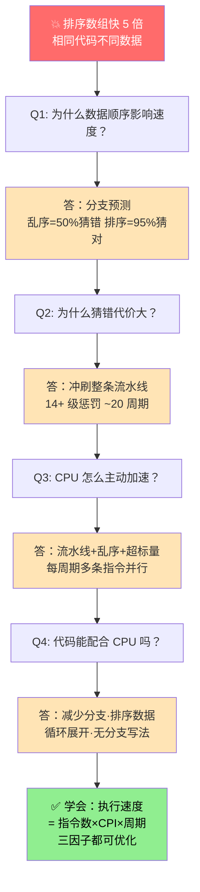
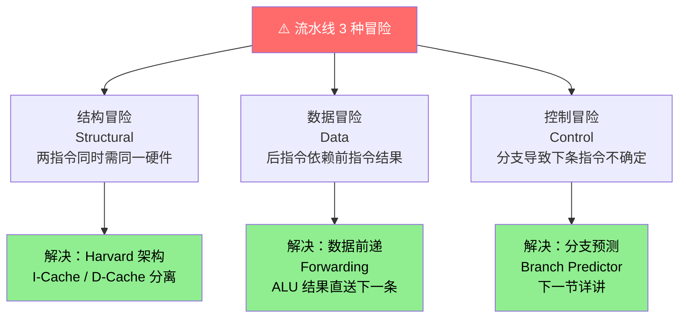
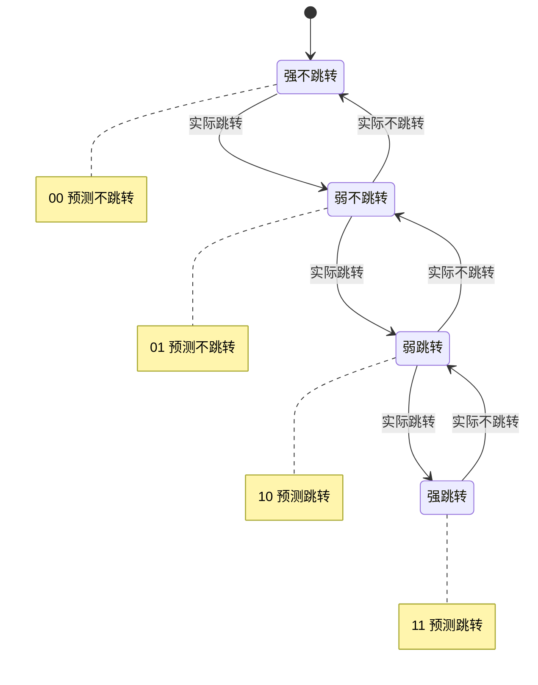
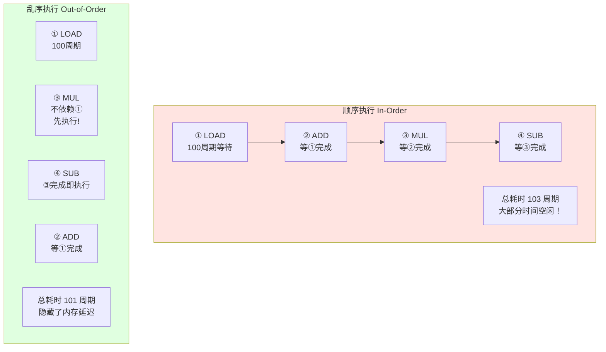
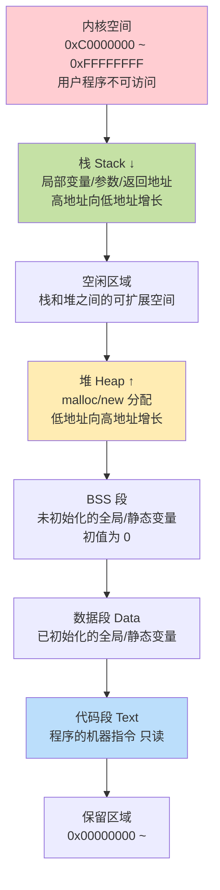
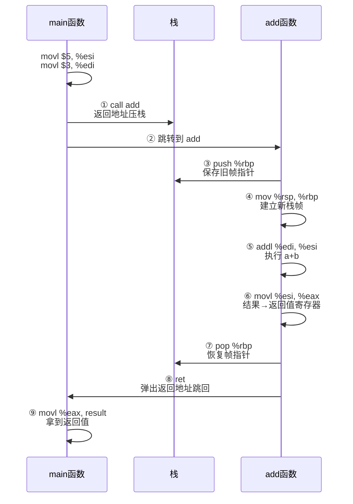

# 08.计算机程序如何执行
#### 目录介绍
- [01.工作案例引入](#01工作案例引入)
  - [1.1 排序数组遍历更快](#11-排序数组遍历更快)
  - [1.2 初步结论](#12-初步结论)
  - [1.3 本文要回答的问题](#13-本文要回答的问题)
- [02.程序执行的全景](#02程序执行的全景)
  - [2.1 双击图标到运行](#21-双击图标到运行)
  - [2.2 程序执行的本质](#22-程序执行的本质)
  - [2.3 指令周期](#23-指令周期)
- [03.CPU流水线设计](#03cpu流水线设计)
  - [3.1 为什么需要流水线](#31-为什么需要流水线)
  - [3.2 经典五级流水线](#32-经典五级流水线)
  - [3.3 流水线加速原理](#33-流水线加速原理)
  - [3.4 流水线的冒险](#34-流水线的冒险)
- [04.分支预测](#04分支预测)
  - [4.1 为什么需要分支预测](#41-为什么需要分支预测)
  - [4.2 静态预测](#42-静态预测)
  - [4.3 动态预测](#43-动态预测)
  - [4.4 对性能的影响](#44-对性能的影响)
- [05.乱序执行](#05乱序执行)
  - [5.1 为什么需要乱序](#51-为什么需要乱序)
  - [5.2 乱序执行原理](#52-乱序执行原理)
  - [5.3 Tomasulo算法](#53-tomasulo算法)
  - [5.4 与程序正确性](#54-与程序正确性)
- [06.超标量与多发射](#06超标量与多发射)
  - [6.1 超标量架构](#61-超标量架构)
  - [6.2 超长指令字VLIW](#62-超长指令字vliw)
  - [6.3 同时多线程SMT](#63-同时多线程smt)
- [07.程序运行内存布局](#07程序运行内存布局)
  - [7.1 进程的内存空间](#71-进程的内存空间)
  - [7.2 栈的工作原理](#72-栈的工作原理)
  - [7.3 堆的工作原理](#73-堆的工作原理)
  - [7.4 函数调用过程](#74-函数调用过程)
- [08.程序性能优化](#08程序性能优化)
  - [8.1 CPU与IO密集型](#81-cpu与io密集型)
  - [8.2 利用流水线优化](#82-利用流水线优化)
  - [8.3 减少分支跳转](#83-减少分支跳转)
- [09.综合案例HTTP请求](#09综合案例http请求)
  - [9.1 一次请求的执行](#91-一次请求的执行)
  - [9.2 流水线机制价值](#92-流水线机制价值)
  - [9.3 可操作建议](#93-可操作建议)
- [10.思考题与作业](#10思考题与作业)
  - [10.1 基础理解题](#101-基础理解题)
  - [10.2 进阶思考题](#102-进阶思考题)
  - [10.3 动手作业](#103-动手作业)


## 01.工作案例引入

### 1.1 排序数组遍历更快

2012 年 StackOverflow 有一个传奇问题："为什么处理一个**排序后的数组**比处理一个乱序数组更快？"——问题下面的最高票答案成为整个问答网站最著名的回答之一，至今 3 万多赞。

这段代码几乎人人看过，但很少有人真正在生产里把它当回事：

```java
int[] data = new int[32_768];
Random r = new Random();
for (int i = 0; i < data.length; i++) data[i] = r.nextInt(256);

// 不排序
long t1 = System.nanoTime();
long sum = 0;
for (int iter = 0; iter < 100_000; iter++) {
    for (int c = 0; c < data.length; c++) {
        if (data[c] >= 128) sum += data[c];
    }
}
long elapsed1 = System.nanoTime() - t1;   // 约 11 秒

// 先排序
Arrays.sort(data);
long t2 = System.nanoTime();
sum = 0;
for (int iter = 0; iter < 100_000; iter++) {
    for (int c = 0; c < data.length; c++) {
        if (data[c] >= 128) sum += data[c];
    }
}
long elapsed2 = System.nanoTime() - t2;   // 约 2 秒
```

**同样的循环、同样的判断、同样的 CPU**，只是数据顺序不同，性能差了 **5~6 倍**。排序本身又是 O(n log n) 的额外开销，居然还是更快。

### 1.2 初步结论

原因不在算法、不在缓存、不在 GC。**原因在 CPU 的分支预测器**：

- 乱序数组里 `if (data[c] >= 128)` 的分支走向基本是 50/50 的硬币，预测器怎么猜都对一半、错一半；
- 排序后数组里分支走向在前半段全是 `false`、后半段全是 `true`，有极强的规律，预测器准确率逼近 100%；
- 预测错一次的代价是**冲刷整条 14+ 级流水线**、重新取指、重新解码——在现代 CPU 上相当于**浪费 15~20 个时钟周期**。

这个结果告诉我们一个反直觉的事实：

> "程序执行的速度不只取决于你写了多少指令，更取决于 CPU 的**流水线、分支预测、乱序执行、超标量**这些微观机制能为你工作多好。"

### 1.3 本文要回答的问题

- 一条指令从进入 CPU 到执行完毕，内部到底经历了什么？
- 流水线为什么快？它会遇到哪些"冒险"，CPU 又是怎么解决的？
- 分支预测为什么能做到 95%+ 的准确率？
- 乱序执行在保证正确性的前提下，是怎么把依赖拆开、并行执行的？
- volatile、内存屏障这些"多线程绝招"的底层为什么是"因为 CPU 会乱序执行"？
- 从这些底层机制出发，我们能在代码层面做哪些**对流水线友好的优化**？

**从 Bug 到执行原理的追问链**：



文末我们会用"一次 HTTP 请求处理"把全章的机制串起来，看看当你在 Spring Controller 里写下 `if (user.isVip())` 时，CPU 内部到底在并行做多少事。


## 02.程序执行的全景

### 2.1 双击图标到运行

**疑惑：当你双击一个程序图标时，到底发生了什么？**


### 2.2 程序执行的本质

从CPU的角度看，执行程序就是不断重复一个简单的循环：

```
while (计算机开机) {
    instruction = 内存[PC];     // 1. 取指：从PC指向的地址取出指令
    decoded = decode(instruction); // 2. 解码：分析这条指令要做什么
    execute(decoded);              // 3. 执行：执行操作
    PC = PC + 1;                   // 4. 更新PC（或跳转到其他地址）
}
```

CPU不知道自己在执行什么程序，也不知道这些指令有什么含义。它只是机械地取指、解码、执行——像一个永不疲倦的工人。

### 2.3 指令周期

一条指令从开始到结束执行，经历的时间称为**指令周期**。


图注：IF/ID/EX/MEM/WB 是经典 RISC 的五级指令周期。不是每条指令都会走完这 5 步——ADD 这样的纯寄存器运算可跳过 MEM 阶段。

```
指令周期的组成：

┌──────┐ ┌──────┐ ┌──────┐ ┌──────┐ ┌──────┐
│ 取指  │→│ 解码  │→│ 执行  │→│ 访存  │→│ 写回  │
│Fetch │ │Decode│ │Execute│ │Memory│ │Write │
│      │ │      │ │      │ │Access│ │Back  │
└──────┘ └──────┘ └──────┘ └──────┘ └──────┘

取指（IF）：从内存读取指令
解码（ID）：分析操作码和操作数
执行（EX）：ALU执行计算
访存（MEM）：如果需要，读写内存
写回（WB）：将结果写入目标寄存器

注意：不是每条指令都需要所有阶段
  ADD R1, R2, R3  → IF → ID → EX → WB（不需要访存）
  LOAD R1, [addr] → IF → ID → EX → MEM → WB（需要访存）
```


## 03.CPU流水线设计

### 3.1 为什么需要流水线

**疑惑：一条指令要经过5个阶段才能完成，有没有办法加速？**

**答疑**：流水线！

```mermaid
gantt
    title 流水线 vs 非流水线 执行 5 条指令对比
    dateFormat X
    axisFormat %s

    section 非流水线
    指令1: 0, 5
    指令2: 5, 10
    指令3: 10, 15

    section 流水线
    指令1: 0, 5
    指令2: 1, 6
    指令3: 2, 7
    指令4: 3, 8
    指令5: 4, 9
```



图注：同样 5 条指令，非流水线需要 25 个周期，流水线只需 9 个周期——这就是"流水线满载后每周期完成一条指令"的本质，理论加速比接近级数 K。

```
没有流水线（单周期CPU）：
  时间:  1    2    3    4    5    6    7    8    9    10
  指令1: [IF] [ID] [EX] [MEM][WB]
  指令2:                          [IF] [ID] [EX] [MEM][WB]
  
  每5个时钟周期执行1条指令，CPU大部分部件在空闲！

有了流水线：
  时间:  1    2    3    4    5    6    7    8    9
  指令1: [IF] [ID] [EX] [MEM][WB]
  指令2:      [IF] [ID] [EX] [MEM][WB]
  指令3:           [IF] [ID] [EX] [MEM][WB]
  指令4:                [IF] [ID] [EX] [MEM][WB]
  指令5:                     [IF] [ID] [EX] [MEM][WB]
  
  流水线满载后，每个时钟周期完成1条指令！
  5级流水线理论上加速5倍
```

**类比**：洗衣服的流水线

```
非流水线：
  洗衣→烘干→叠好→放好 → 洗衣→烘干→叠好→放好
  第1批                   第2批

流水线：
  第1批: 洗衣→烘干→叠好→放好
  第2批:      洗衣→烘干→叠好→放好
  第3批:           洗衣→烘干→叠好→放好
  
  虽然每批衣服的处理时间没变，
  但单位时间内处理的总量大幅增加！
```

### 3.2 经典五级流水线

```
┌──────┐  ┌──────┐  ┌──────┐  ┌──────┐  ┌──────┐
│  IF  │→ │  ID  │→ │  EX  │→ │ MEM  │→ │  WB  │
│取指令│  │解码  │  │执行  │  │访问  │  │写回  │
│      │  │      │  │      │  │内存  │  │      │
└──────┘  └──────┘  └──────┘  └──────┘  └──────┘

每个阶段由不同的硬件单元完成：
  IF: 程序计数器 + 指令存储器
  ID: 指令译码器 + 寄存器文件
  EX: ALU
  MEM: 数据存储器
  WB: 寄存器文件（写端口）
```

### 3.3 流水线加速原理

```
加速比 = 非流水线时间 / 流水线时间

理想情况（N条指令，K级流水线）：
  非流水线时间 = N × K × T（T是每级的时间）
  流水线时间   = (K + N - 1) × T
  
  当N很大时：加速比 ≈ K
  即 5 级流水线理论加速 5 倍

实际上达不到理想值，因为存在"流水线冒险"
```

### 3.4 流水线的冒险

**疑惑：流水线听起来很美好，实际有什么问题？**

有三种"冒险"（Hazard）会打断流水线：



**1. 结构冒险（Structural Hazard）**：

```
两条指令同时需要使用同一个硬件单元

  指令1: [IF] [ID] [EX] [MEM][WB]
  指令4:                [IF]  ← 取指需要访问内存
                        指令1的MEM也要访问内存
                        冲突！
  
  解决：Harvard架构——指令缓存和数据缓存分离
```

**2. 数据冒险（Data Hazard）**：

```
后面的指令依赖前面指令的结果

  ADD R1, R2, R3    ; 指令1：R1 = R2 + R3
  SUB R4, R1, R5    ; 指令2：R4 = R1 - R5  ← 需要指令1的R1结果！
  
  但指令1还没写回R1，指令2就已经在读R1了！
  
  解决方案：
    a. 插入气泡（Bubble/NOP）：等待
    b. 数据前递（Forwarding）：直接把ALU的结果转发给下一条指令
    c. 编译器重排：让编译器在两条指令之间插入不相关的指令
```

**3. 控制冒险（Control Hazard）**：

```
分支指令导致不确定接下来执行哪条指令

  BEQ R1, R2, label  ; 如果R1==R2，跳转到label
  ADD ...             ; 这条指令该不该执行？不知道！
  SUB ...             ; 必须等分支结果出来才知道
  
  解决方案：分支预测（下一节详细讲）
```


## 04.分支预测

### 4.1 为什么需要分支预测

```
典型程序中分支指令的比例：约 15-25%

如果每遇到分支就停下来等：
  流水线效率损失 = 分支比例 × 分支惩罚周期
  假设 20%分支, 3周期惩罚: 损失 = 20% × 3 = 60%！
  
  流水线几乎毫无意义了。

分支预测的思路：猜！
  猜对了：流水线正常运行，没有损失
  猜错了：丢弃已执行的指令（冲刷流水线），从正确的地方重新开始
  只要猜对率足够高（>90%），总体性能就大幅提升
```

### 4.2 静态预测

不依赖历史信息，用固定规则预测。

```
策略1：总是预测不跳转
  分支指令后面的指令预先执行
  如果实际不跳转 → 猜对了
  如果实际跳转 → 猜错了，冲刷流水线

策略2：向后跳转预测为跳转，向前跳转预测为不跳转
  循环通常是向后跳转（回到循环头部），循环体大概率会再次执行
  准确率约 65-70%
```

### 4.3 动态预测

根据历史执行情况来预测，准确率可达 95% 以上。



图注：这是最经典的**2 位饱和计数器**。它的巧妙之处是有"缓冲区"——偶尔猜错一次不会立刻翻盘，对大部分"规律性 + 偶尔波动"的分支（如循环结束、try-catch）特别友好。

```
2位饱和计数器（最常用的简单方案）：

  4个状态：
    00 = 强不跳转
    01 = 弱不跳转
    10 = 弱跳转
    11 = 强跳转

  每次实际跳转：计数器+1
  每次实际不跳转：计数器-1

  预测规则：计数器 >= 10 → 预测跳转
           计数器 < 10 → 预测不跳转

  循环执行100次的情况：
    第1次：预测不跳转，实际跳转 → 错误（计数器 00→01）
    第2次：预测不跳转，实际跳转 → 错误（计数器 01→10）
    第3-99次：预测跳转，实际跳转 → 正确 ×97次
    第100次：预测跳转，实际不跳转 → 错误
    
    准确率 = 97/100 = 97%
```

### 4.4 对性能的影响

```java
// 经典面试题：为什么排序后的数组遍历更快？
int[] data = new int[100000];
// ... 填充随机数

// 不排序的情况
for (int i = 0; i < data.length; i++) {
    if (data[i] >= 128) {  // 分支完全随机
        sum += data[i];     // CPU无法预测，猜对率≈50%
    }
}

// 排序后
Arrays.sort(data);
for (int i = 0; i < data.length; i++) {
    if (data[i] >= 128) {  // 前半段全是 < 128，后半段全是 >= 128
        sum += data[i];     // 分支模式规律，CPU猜对率≈99%
    }
}

// 排序后的循环可能快 5-6 倍！
// 原因就是分支预测准确率的差异
```


## 05.乱序执行

### 5.1 为什么需要乱序



### 5.2 乱序执行原理


关键：前端顺序取指、中间乱序执行、后端顺序提交——三阶段各自独立，用 ROB 保障最终一致性。

### 5.3 Tomasulo算法

这是乱序执行的经典算法，由IBM工程师Robert Tomasulo在1967年提出。

```
核心思想：
  1. 寄存器重命名：消除"假"数据依赖
  2. 保留站：操作数就绪后立即执行
  3. 公共数据总线：广播执行结果

什么是"假依赖"？
  ① ADD R1, R2, R3     ; R1 = R2 + R3
  ② MUL R4, R1, R5     ; R4 = R1 × R5  ← 真依赖（需要①的R1）
  ③ ADD R1, R6, R7     ; R1 = R6 + R7  ← 名字依赖（也写R1，但和①②无关）
  
  ③并不依赖①②的结果，但因为都用了R1这个名字，
  看起来有依赖关系 → 这就是"假依赖"（WAW: Write After Write）
  
  寄存器重命名解决方案：
  ① ADD T1, R2, R3     ; T1 = R2 + R3（R1重命名为T1）
  ② MUL R4, T1, R5     ; R4 = T1 × R5
  ③ ADD T2, R6, R7     ; T2 = R6 + R7（R1重命名为T2）
  
  现在③和①②完全没有依赖了，可以并行执行！
```

### 5.4 与程序正确性

**疑惑：CPU乱序执行，程序结果还能正确吗？**

**答疑**：对于单线程程序，CPU保证乱序执行的结果与顺序执行完全一致（通过ROB顺序提交）。但在多线程程序中，由于不同核心的乱序执行，可能导致内存可见性问题。这就是为什么我们需要**内存屏障（Memory Barrier）**和**volatile关键字**。

```java
// Java中volatile的底层原理就是内存屏障
// 它告诉CPU：在这个点之前的写操作必须先完成，
// 之后的读操作必须在之后执行

volatile boolean ready = false;
int data = 0;

// 线程A
data = 42;           // 写数据
ready = true;        // volatile写 → 插入内存屏障
                     // 保证CPU不会把 data=42 重排到 ready=true 之后

// 线程B
if (ready) {         // volatile读 → 插入内存屏障
    System.out.println(data);  // 保证能看到 data=42
}
```


## 06.超标量与多发射

### 6.1 超标量架构

流水线让CPU每周期完成1条指令。**超标量（Superscalar）**更进一步：每周期完成多条指令。

```
标量流水线（每周期最多1条）：
  周期: 1    2    3    4    5
  指令1: IF   ID   EX   MEM  WB
  指令2:      IF   ID   EX   MEM  WB

2-发射超标量（每周期最多2条）：
  周期: 1    2    3    4    5
  指令1: IF   ID   EX   MEM  WB
  指令2: IF   ID   EX   MEM  WB    ← 两条指令同时执行！
  指令3:      IF   ID   EX   MEM  WB
  指令4:      IF   ID   EX   MEM  WB

实现方式：CPU内部有多组ALU、多个取指单元
  现代Intel CPU：每周期可以发射 4-6 条微操作
  Apple M系列：每周期可以发射 8 条微操作
```

### 6.2 超长指令字VLIW

```
超标量：硬件自动寻找可并行的指令（复杂但灵活）
VLIW：编译器提前打包可并行的指令（简单但对编译器要求高）

VLIW指令格式：
  ┌────────┬────────┬────────┬────────┐
  │ ALU操作 │ 乘法操作│ 加载操作│ 存储操作│  ← 一条"超长指令"
  │ ADD... │ MUL... │ LOAD...│ STORE..│    包含多个操作
  └────────┴────────┴────────┴────────┘

代表：Intel Itanium (IA-64)
```

### 6.3 同时多线程SMT

```
超标量的问题：有时找不到足够多的可并行指令
  
  线程A的指令: [ADD] [???] [MUL] [???] [???]
  CPU的执行槽:  槽1   槽2   槽3   槽4   槽5
               ✓    空    ✓    空    空    ← 利用率只有40%

SMT（Simultaneous Multi-Threading）的思路：
  让多个线程共享同一个CPU核心的执行单元
  
  线程A的指令: [ADD]       [MUL]
  线程B的指令:       [SUB]       [DIV] [AND]
  CPU的执行槽:  槽1   槽2   槽3   槽4   槽5
               A-ADD B-SUB A-MUL B-DIV B-AND ← 利用率100%

这就是 Intel 的"超线程技术"（Hyper-Threading）
  物理上1个核心，逻辑上表现为2个核心
  性能提升：约 20-30%（不是翻倍，因为共享执行单元）
```


## 07.程序运行内存布局

### 7.1 进程的内存空间



图注：每一个进程启动时 OS 都会为它分配这样一份"虚拟地址空间"。栈和堆相向生长，中间的空闲区域就是它们的"成长缓冲"，理解这张图能解决大部分内存越界/栈溢出类的 Bug。

```
高地址
┌───────────────┐ 0xFFFFFFFF
│   内核空间     │ ← 操作系统使用，用户程序不可访问
├───────────────┤ 0xC0000000 (32位Linux)
│     栈 ↓      │ ← 函数调用的局部变量、参数、返回地址
│               │    从高地址向低地址增长
│   (空闲区域)   │
│               │
│     堆 ↑      │ ← malloc/new 分配的动态内存
│               │    从低地址向高地址增长
├───────────────┤
│   BSS段       │ ← 未初始化的全局/静态变量（填0）
├───────────────┤
│   数据段       │ ← 已初始化的全局/静态变量
├───────────────┤
│   代码段(Text) │ ← 程序的机器指令（只读）
├───────────────┤
│   保留区域     │
└───────────────┘ 0x00000000
低地址
```

### 7.2 栈的工作原理

```
栈是函数调用的核心数据结构。

每调用一个函数，就在栈上"压入"一个栈帧（Stack Frame）：
  - 函数参数
  - 返回地址（函数执行完后跳回哪里）
  - 保存的寄存器
  - 局部变量

void funcA() {
    int x = 1;
    funcB(x);
}
void funcB(int a) {
    int y = 2;
    funcC(y);
}
void funcC(int b) {
    int z = 3;
}

栈的变化：
  调用funcA:  [funcA的栈帧: x=1]
  调用funcB:  [funcA的栈帧: x=1] [funcB的栈帧: a=1, y=2]
  调用funcC:  [funcA的栈帧] [funcB的栈帧] [funcC的栈帧: b=2, z=3]
  funcC返回:  [funcA的栈帧] [funcB的栈帧]
  funcB返回:  [funcA的栈帧]
  funcA返回:  (空)
```

### 7.3 堆的工作原理

```
堆用于动态内存分配，生命周期由程序员（或GC）控制。

C语言：
  int *p = malloc(100);  // 分配100字节
  free(p);               // 必须手动释放

Java：
  Object obj = new Object();  // 在堆上分配
  // 不需要手动释放，GC会自动回收不再使用的对象

堆内存管理的挑战：
  1. 碎片化：反复分配释放后，空闲内存变成零散的小块
  2. 内存泄漏：分配了但忘记释放
  3. 野指针：释放了但还在使用
```

### 7.4 函数调用过程

下面这段最简单的 C 代码，展示了 CPU 层面一次完整函数调用的所有动作：

```c
int add(int a, int b) { return a + b; }
int main() {
    int result = add(3, 5);
    return 0;
}
```




## 08.程序性能优化

### 8.1 CPU与IO密集型

```
CPU密集型程序：大部分时间在做计算
  - 科学计算、加密解密、视频编码、AI推理
  - 优化方向：减少指令数、提高缓存命中率、利用SIMD

I/O密集型程序：大部分时间在等待I/O
  - Web服务器、数据库、文件处理
  - 优化方向：异步I/O、减少阻塞、批量处理
```

### 8.2 利用流水线优化

```c
// 循环展开——减少分支指令，让流水线更高效
// 原始循环
for (int i = 0; i < 1000; i++) {
    sum += arr[i];
}

// 4倍展开
for (int i = 0; i < 1000; i += 4) {
    sum += arr[i];
    sum += arr[i+1];
    sum += arr[i+2];
    sum += arr[i+3];
}
// 分支指令从1000次减少到250次
// 现代编译器会自动做这个优化（gcc -O2）
```

### 8.3 减少分支跳转

```c
// 用条件移动代替分支（帮助分支预测）

// 不友好的写法（包含分支）
if (a > b) max = a;
else max = b;

// 友好的写法（无分支）
max = (a > b) ? a : b;
// 编译器可能将其编译为CMOV指令（条件移动），没有分支

// 更激进的无分支写法（位运算）
int diff = a - b;
int mask = diff >> 31;  // 如果a<b，mask全1；否则全0
max = a - (diff & mask); // 无分支实现max
```

```java
// 利用分支预测友好的数据排列
// 在需要频繁做条件判断的场景，预先排序可以大幅提升性能

// 慢：数据随机，分支预测准确率低
for (User user : randomUsers) {
    if (user.isVIP()) {
        processVIP(user);
    }
}

// 快：数据排序后，分支预测准确率高
Collections.sort(users, Comparator.comparing(User::isVIP));
for (User user : users) {
    if (user.isVIP()) {
        processVIP(user);
    }
}
```


## 09.综合案例HTTP请求

我们把开头的"排序数组问题"升级成一个**真实业务场景**：Spring Boot 后端的一个 Controller 处理一次用户请求，看 CPU 内部发生了什么。

```java
@GetMapping("/order/list")
public List<OrderVO> list(@RequestParam Long uid) {
    List<Order> raw = orderMapper.queryByUser(uid);     // ① DB 查询
    List<OrderVO> result = new ArrayList<>(raw.size());
    for (Order o : raw) {                                // ② 循环
        if (o.getStatus() == PAID) {                     // ③ 分支
            result.add(convert(o));                      // ④ 函数调用
        }
    }
    return result;                                        // ⑤ 返回
}
```

### 9.1 一次请求的执行

| 阶段 | 发生了什么 | 对应本章章节 |
|---|---|---|
| 线程从 Tomcat 线程池被唤醒 | OS 调度，恢复线程的**栈帧**和 PC 寄存器 | 6.1, 6.2 |
| JVM 进入 `list()` 方法 | 在线程栈上**压入新栈帧**：参数 uid、局部变量 raw、result、o | 6.2, 6.4 |
| `orderMapper.queryByUser` | 一次 I/O 等待（网络到 MySQL），CPU **切换到其他线程**跑别的请求 | 7.1 |
| 等待期间，乱序执行单元已经把 for 循环前的代码 **投机执行** 了一部分 | Tomasulo + 保留站 | 4.1~4.3 |
| ② for 循环进入流水线 | 每轮循环 5~7 条指令，**流水线满载**后 IPC > 3 | 2.x |
| ③ `if (status == PAID)` | 分支预测器根据历史猜"走 if 分支" | 3.x |
| 如果订单都已支付（实际业务中常见） | 预测连续命中，流水线不冒泡 | 3.4 |
| 如果订单状态随机 | 预测失败，**冲刷整个流水线**，重来 | 2.4, 3.4 |
| ④ `convert(o)` | `call` 指令把返回地址压栈，跳转到 convert 的代码页 | 6.4 |
| `convert` 访问 `o.getUid()` | 先查 TLB → 查 L1 → L2 → L3 → 内存 | 05 章 + 04 章 |
| 若堆里的 Order 对象**刚被 GC 复制到新位置**，L1 冷启动 | 多付几百个周期的 Cache Miss 代价 | 04 章 |
| ⑤ return | 栈帧弹出，`ret` 指令跳回 Tomcat 处理器 | 6.4 |

### 9.2 流水线机制价值

假设这次请求总共执行 **2,000 万条指令**，对比两种极端场景：

| 场景 | 有效 IPC | 耗时 (3 GHz CPU) |
|---|---|---|
| 没有流水线 (每 5 周期 1 指令) | 0.2 | 33 ms |
| 有流水线但分支预测差 (IPC ≈ 0.8) | 0.8 | 8.3 ms |
| 流水线 + 分支预测 95% + 乱序执行 | ≈ 3.5 | 1.9 ms |
| + SIMD + 友好的 convert（无分支） | ≈ 4.5 | 1.5 ms |

**同一份 Java 代码，同一台机器**，仅仅因为微观执行机制不同，耗时差 20 倍。生产上我们常说"这个接口只要 2ms"——这 2ms 不是编程语言免费送你的，是 CPU 的**流水线 + 分支预测 + 乱序执行**一起撑起来的。

### 9.3 可操作建议

1. **热点循环里尽量减少 if**，或者让 if 的走向有规律（如先排序再遍历）；
2. **能用三元 / `Math.max` 的，就不用 if-else**（编译器会生成 `cmov`，无分支）；
3. **避免深层方法调用在最内层循环**，内联友好的函数对流水线更友好；
4. **多线程共享可变变量一定要 `volatile` 或 `AtomicXxx`**——因为 CPU 的乱序执行对单线程透明、对多线程不透明。


## 10.思考题与作业

### 10.1 基础理解题

1. 非流水线、流水线、超标量三种架构的 IPC 上限分别是多少？加速来源分别是什么？
2. 流水线的三种冒险（结构、数据、控制）各是怎么形成的？分别有什么解决方案？
3. 2 位饱和计数器的预测准确率为什么在循环场景能达到 97%+？它对"奇偶交替"的分支表现如何？
4. 乱序执行的 CPU 如何保证单线程程序的结果与顺序执行完全一致？"ROB 顺序提交"起到了什么作用？
5. 同时多线程（SMT / Hyper-Threading）为什么只能带来 20~30% 的性能提升，而不是翻倍？

### 10.2 进阶思考题

1. 如果一个循环体内部有两条依赖链（`a = a + arr[i]; b = b + arr[i]`），手动改成**多条独立累加器**（`a, b, c, d` 各自累加再合并）为什么会更快？这考察了什么概念？
2. `volatile` 只保证可见性和有序性，不保证原子性。为什么 CPU 的乱序执行对单线程透明，却会导致多线程可见性问题？用本章的术语解释。
3. 代码注入攻击为什么要靠 ROP (Return-Oriented Programming) 而不是直接注入 shellcode？NX 位 + ASLR 联合起来后对攻击者意味着什么？
4. 分支预测器被"污染"是近年 Spectre/Meltdown 漏洞的根源，你能用本章的机制解释为什么"推测执行会泄露数据"吗？
5. 在高性能网络框架（如 DPDK、Netty 零拷贝路径）里，常见的"尽量让热路径无分支、无函数调用、无堆分配"原则，背后对应了本章哪些机制？

### 10.3 动手作业

**作业 1：复现"排序后的数组更快"**

把文首的 Java 代码本地跑一遍，用 `-XX:+PrintCompilation` 观察 JIT 的优化。进一步尝试：

- 改成 C 语言版本，用 `perf stat -e branches,branch-misses ./a.out` 观察乱序数组和排序数组的 branch-miss 率；
- 把 `if (data[c] >= 128)` 改成 `sum += data[c] * (data[c] >= 128)`（无分支版本），对比耗时。

**作业 2：观察流水线冒险对性能的影响**

写两段功能完全相同但存在**依赖链长度差异**的代码：

```c
// 版本 A：一条长依赖链
for (int i = 0; i < N; i++) s = s + arr[i];

// 版本 B：4 条独立依赖链
long a=0,b=0,c=0,d=0;
for (int i = 0; i < N; i += 4) {
    a += arr[i]; b += arr[i+1]; c += arr[i+2]; d += arr[i+3];
}
long s = a + b + c + d;
```

用 `perf stat` 分别测 IPC 和耗时，思考超标量 CPU 为什么能在版本 B 里加速。

**作业 3：画一张函数调用时的栈帧变化图**

在纸上手绘以下代码在 x86-64 下的栈变化（从 main 调用 f → f 调用 g → g 返回 → f 返回）：

```c
int g(int a) { int y = a + 1; return y; }
int f(int x) { int z = g(x); return z + 1; }
int main() { return f(10); }
```

标出每一步的 `%rsp`、`%rbp`、返回地址、局部变量在栈上的位置。这是面试时"函数调用栈"问题的标准答案。

