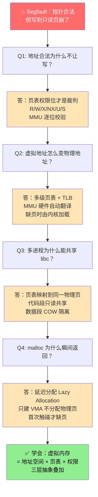
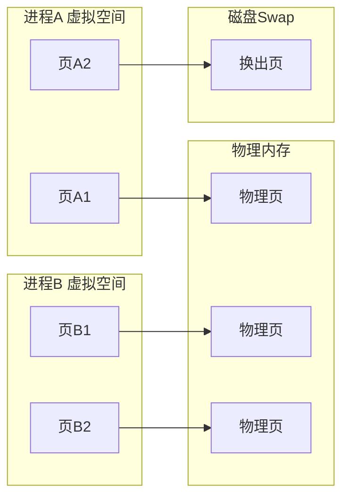
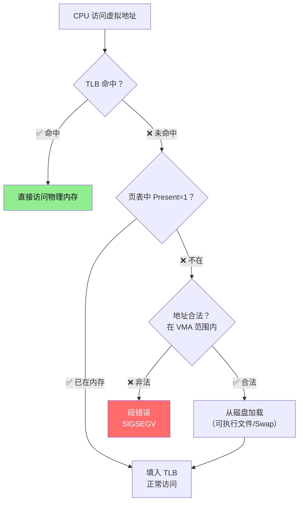
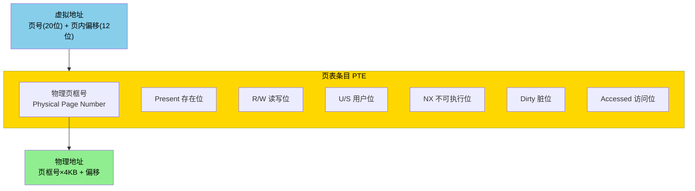
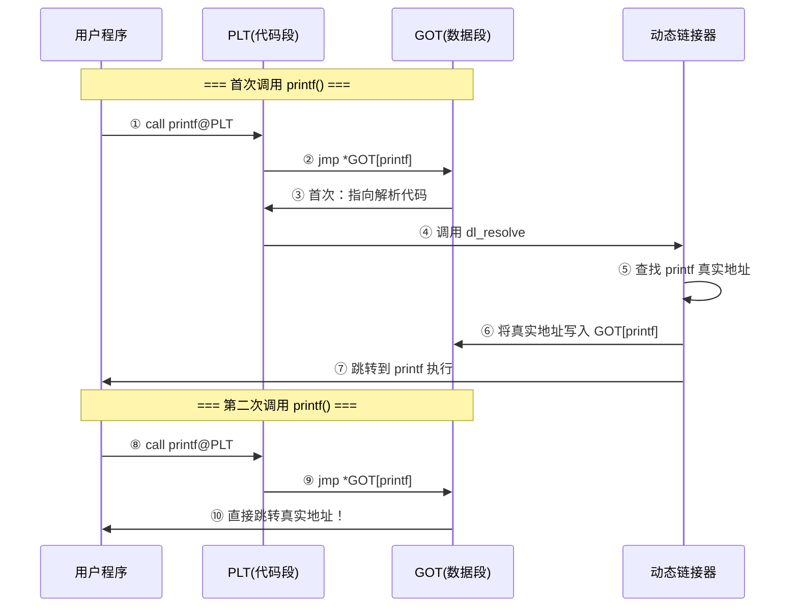
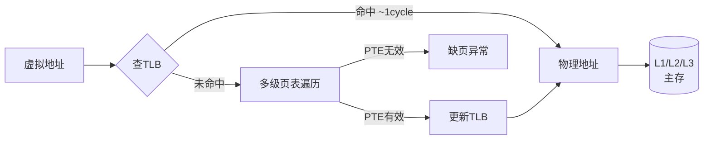
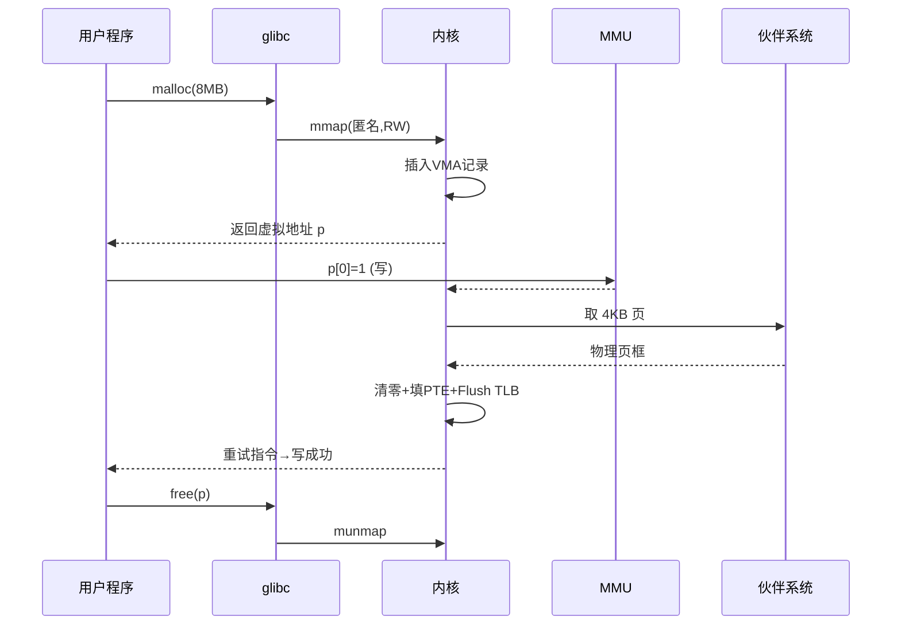

# 09.计算机内存设计原理
#### 目录介绍
- [01.工作案例引入](#01工作案例引入)
  - [1.1 诡异Segfault排查](#11-诡异segfault排查)
  - [1.2 初步结论](#12-初步结论)
  - [1.3 本文要回答的问题](#13-本文要回答的问题)
- [02.程序装载的挑战](#02程序装载的挑战)
  - [2.1 看一个实际场景](#21-看一个实际场景)
  - [2.2 程序装载到内存](#22-程序装载到内存)
  - [2.3 虚拟和物理内存](#23-虚拟和物理内存)
  - [2.4 什么是物理内存](#24-什么是物理内存)
  - [2.5 什么是虚拟内存](#25-什么是虚拟内存)
  - [2.6 为何设计虚拟内存](#26-为何设计虚拟内存)
  - [2.7 程序装载的挑战](#27-程序装载的挑战)
- [03.内存的设计技术](#03内存的设计技术)
  - [3.1 内存的特点](#31-内存的特点)
  - [3.2 物理内存设计](#32-物理内存设计)
  - [3.3 虚拟内存设计](#33-虚拟内存设计)
  - [3.4 内存分段设计](#34-内存分段设计)
  - [3.5 内存分页设计](#35-内存分页设计)
  - [3.6 解决装载挑战](#36-解决装载挑战)
- [04.程序内部共享内存](#04程序内部共享内存)
  - [4.1 思考一个问题](#41-思考一个问题)
  - [4.2 节省运行内存](#42-节省运行内存)
  - [4.3 静态链接](#43-静态链接)
  - [4.4 动态链接](#44-动态链接)
  - [4.5 共享内存地址](#45-共享内存地址)
  - [4.6 PLT和GOT方案](#46-plt和got方案)
- [05.页表与地址翻译](#05页表与地址翻译)
  - [5.1 为何需要页表](#51-为何需要页表)
  - [5.2 页表基本结构](#52-页表基本结构)
  - [5.3 多级页表设计](#53-多级页表设计)
  - [5.4 TLB快表加速](#54-tlb快表加速)
  - [5.5 页表遍历过程](#55-页表遍历过程)
- [06.内存保护与安全](#06内存保护与安全)
  - [6.1 内存访问隔离](#61-内存访问隔离)
  - [6.2 页表的权限位](#62-页表的权限位)
  - [6.3 内存隔离机制](#63-内存隔离机制)
  - [6.4 ASLR地址随机化](#64-aslr地址随机化)
  - [6.5 内存泄漏与OOM](#65-内存泄漏与oom)
- [07.综合案例malloc之旅](#07综合案例malloc之旅)
  - [7.1 malloc真的分配了吗](#71-malloc真的分配了吗)
  - [7.2 首次写入触发什么](#72-首次写入触发什么)
  - [7.3 memset的执行](#73-memset的执行)
  - [7.4 free的执行](#74-free的执行)
  - [7.5 知识对号入座](#75-知识对号入座)
  - [7.6 数字感真实代价](#76-数字感真实代价)
- [08.思考题与作业](#08思考题与作业)
  - [8.1 基础理解题](#81-基础理解题)
  - [8.2 进阶思考题](#82-进阶思考题)
  - [8.3 动手作业](#83-动手作业)

## 01.工作案例引入

### 1.1 诡异Segfault排查

C++ 后台同学小王排查一个线上偶发崩溃：QPS 不到一万的服务，每天凌晨总有那么三五次会触发 core dump，堆栈指向一个很老的缓存模块：

```cpp
void Cache::put(const std::string& key, const char* value, size_t len) {
    Entry* e = entries_ + hash(key) % capacity_;
    memcpy(e->buf, value, len);       // 这里 Segfault
    e->len = len;
}
```

coredump 里 `e->buf` 的地址看起来合法、`value` 也非空，`len` 也不大（才 32 字节）。单测和压测都复现不出来。

最后靠 `/proc/<pid>/maps` + `addr2line` 才定位：`entries_` 的底层内存是一段 mmap 出来的 **可执行匿名映射**，部分环境下内核启用了 **W^X** 策略（页要么可写、要么可执行，不能同时）。但这个模块为了复用对象，又把同一段内存 `mprotect` 成 `PROT_READ|PROT_EXEC` 用来当 JIT trampoline，忘记在"写缓存"路径上切回 `PROT_READ|PROT_WRITE`。

直到凌晨一个特殊请求触发了这条路径，就**写到只读页**上，页表权限校验失败，MMU 产生保护异常 → 内核发 `SIGSEGV`。

### 1.2 初步结论

排查过程让小王深刻理解了三件事：

1. **"指针看起来合法" ≠ "能读写"**。页表里的权限位（R/W/X/U）才是最终裁判。
2. **Segfault 不总是野指针**，很可能是"地址对、但权限错"。
3. **虚拟内存是一层抽象**，它把"内存"拆成了"虚拟地址 / 物理地址 / 页表 / 权限 / 是否在内存 / 是否共享 / 是否随机化"等一堆独立的概念，每一个都可能在某个瞬间触发奇怪的行为。

### 1.3 本文要回答的问题

- 为什么要在物理内存之上抽象出"虚拟内存"？它解决了哪些工程问题？
- 程序启动时，几 GB 的可执行文件是一下子加载进内存的吗？
- 为什么多个进程跑同一个 bash，只需要一份物理代码段？
- 每次访问内存都要查页表，会不会太慢？TLB 是怎么救场的？
- 页表里的 R/W/X/NX/U/S 位各自是做什么用的？ASLR 是什么？
- 为什么 `malloc(10MB)` 可能瞬间返回，但第一次访问时才真正分配物理内存？

**从 Bug 到内存原理的追问链**：



文末我们用一次 `malloc + memset` 的完整"内存之旅"把本章串起来。


## 02.程序装载的挑战

### 2.1 看一个实际场景

在 Java 这样使用虚拟机的编程语言里面，我们写的程序是怎么装载到内存里面来的呢？

加载程序是通过内存分页和内存交换的方式加载到内存里面来的么？

程序中某个类创建了对象，对象存储在内存中，这里的内存有何特点？

### 2.2 程序装载到内存

多个文件合并成一个最终可执行文件。

在运行这些可执行文件的时候，我们其实是通过一个装载器，解析 ELF 或者 PE 格式的可执行文件。装载器会把对应的指令和数据加载到内存里面来，让 CPU 去执行。

说起来只是装载到内存里面这一句话的事儿，实际上装载器需要满足两个要求。

1. 第一，可执行程序加载后占用的内存空间应该是连续的。执行指令的时候，程序计数器是顺序地一条一条指令执行下去。这也就意味着，这一条条指令需要连续地存储在一起。
2. 第二，同时加载很多个程序，并且不能让程序自己规定在内存中加载的位置。虽然编译出来的指令里已经有了对应的各种各样的内存地址，但是实际加载的时候，我们其实没有办法确保，这个程序一定加载在哪一段内存地址上。因为我们现在的计算机通常会同时运行很多个程序，可能你想要的内存地址已经被其他加载了的程序占用了。

如何满足这两个基本的要求

那就是我们可以在内存里面，找到一段连续的内存空间，然后分配给装载的程序，然后把这段连续的内存空间地址，和整个程序指令里指定的内存地址做一个映射。

### 2.3 虚拟和物理内存

把指令里用到的内存地址叫作虚拟内存地址（Virtual Memory Address），实际在内存硬件里面的空间地址，我们叫物理内存地址（Physical Memory Address）。

重点看虚拟内存：程序里有指令和各种内存地址，我们只需要关心虚拟内存地址就行了。对于任何一个程序来说，它看到的都是同样的内存地址。

虚拟指向物理映射表：我们维护一个虚拟内存到物理内存的映射表，这样实际程序指令执行的时候，会通过虚拟内存地址，找到对应的物理内存地址，然后执行。

内存连续：因为是连续的内存地址空间，所以我们只需要维护映射关系的起始地址和对应的空间大小就可以了。

看到这里思考几个问题？

为什么程序，不可以设计成直接操作物理内存？

创建对象，对象放到堆内存中，引用放到栈里，调用对象是通过引用地址找到具体的值。这个如何用虚拟内存和物理内存来解释？

### 2.4 什么是物理内存

物理内存是计算机系统中实际存在的内存，也称为主存储器或随机存取存储器（RAM）。

它是计算机用于存储正在运行的程序和数据的物理硬件。物理内存的容量决定了计算机可以同时存储的数据量。

物理内存由一组存储单元组成，每个存储单元都有一个唯一的地址。这些存储单元以字节为单位进行编址，可以存储和读取数据。

计算机系统中的所有程序和数据都必须加载到物理内存中才能被CPU访问和处理。

当程序执行时，CPU从物理内存中读取指令和数据，并将计算结果写回到物理内存中。

### 2.5 什么是虚拟内存

虚拟内存是一种扩展物理内存的技术，它允许计算机系统在物理内存不足时使用硬盘空间作为辅助存储。

虚拟内存将物理内存和硬盘空间结合起来，形成一个更大的地址空间供程序使用。虚拟内存的容量可以远远大于物理内存的容量。

虚拟内存的工作原理如下

1. 分页：虚拟内存将程序和数据划分为固定大小的页面（Page），通常是4KB或8KB。这些页面被映射到物理内存或硬盘上的页面框（Page Frame）。
2. 页面置换：当物理内存不足时，操作系统会将一部分不常用的页面从物理内存中换出到硬盘上的页面文件（Page File）。这样，物理内存中就有空间来加载新的页面。
3. 页面调度：当程序需要访问一个不在物理内存中的页面时，操作系统会将该页面从硬盘加载到物理内存中，并更新页面表（Page Table）以反映页面的新位置。

虚拟内存（Virtual Memory）是计算机系统中的一种技术，它允许操作系统将物理内存（RAM）和磁盘空间结合起来，为运行的程序提供一个抽象的、虚拟的内存空间。

1. 虚拟内存的主要目的是扩展可用的内存容量，使得运行的程序可以使用比物理内存更大的内存空间。 
2. 它通过将不常用的数据从物理内存转移到磁盘上的虚拟内存空间，从而释放物理内存供其他程序使用。

虚拟内存的工作原理

1. 地址映射：每个运行的程序都有自己的虚拟地址空间，它是连续的、从0开始的地址范围。操作系统负责将程序的虚拟地址映射到物理内存或磁盘上的虚拟内存页（Virtual Memory Page）。
2. 页面访问权限：操作系统可以为每个内存页设置访问权限，如只读、读写、执行等。这样可以提供内存保护和安全性，防止程序越界访问或恶意代码执行。



### 2.6 为何设计虚拟内存

**疑惑**：如果每个程序直接使用物理内存地址，不是更简单更快吗？为什么要搞一层虚拟内存增加复杂度？

**答疑**：虚拟内存的设计解决了多个关键问题，没有它，现代操作系统根本无法运行。

**问题1：地址冲突**

假设没有虚拟内存，程序A编译时指定了内存地址0x1000-0x2000，程序B也使用了0x1000-0x2000。两个程序不能同时运行，因为会相互覆盖数据。

有了虚拟内存后，每个程序都认为自己独占整个地址空间。程序A的0x1000和程序B的0x1000实际映射到不同的物理地址。

```
程序A的虚拟地址 0x1000  ──映射──>  物理地址 0x50000
程序B的虚拟地址 0x1000  ──映射──>  物理地址 0x80000
```

**问题2：内存保护**

没有虚拟内存，一个恶意或有bug的程序可以直接读写任意物理地址，破坏其他程序甚至操作系统的数据。

虚拟内存通过页表的权限位实现内存保护：每个页可以设置读、写、执行权限，并区分用户态和内核态。

**问题3：内存不够用**

物理内存是有限的（比如8GB），但用户可能同时运行占用20GB内存的程序。

虚拟内存允许将不常用的内存页换出（Swap）到磁盘，需要时再换入，使得程序可以使用超过物理内存大小的地址空间。

**问题4：内存碎片**

程序的启动和退出会在物理内存中留下大量不连续的空闲区域（碎片）。可能总空闲内存有500MB，但没有任何一块连续区域大于100MB。

虚拟内存的分页机制将内存按固定大小（4KB）的页管理，不需要物理上连续的内存，消除了外部碎片。

**论证**：虚拟内存带来的核心价值

| 价值 | 没有虚拟内存 | 有虚拟内存 |
|------|-------------|-----------|
| 地址空间 | 所有程序共享物理地址 | 每个程序独立的虚拟地址空间 |
| 内存保护 | 程序间可互相读写 | 严格隔离，非法访问触发段错误 |
| 内存容量 | 受限于物理内存大小 | 可使用磁盘扩展（Swap） |
| 内存碎片 | 外部碎片严重 | 分页消除外部碎片 |
| 编程简便 | 程序员需自行管理物理地址 | 使用统一的虚拟地址，链接器自动分配 |

### 2.7 程序装载的挑战

有了虚拟内存的概念后，程序装载需要面对以下核心挑战：

**挑战1：内存空间不够**

一个程序的可执行文件可能非常大（几百MB甚至几GB），但物理内存可能远小于此。操作系统不可能一次性把整个程序都加载到内存。

**解决方案**：按需加载（Demand Loading）。只有当程序真正访问某个地址时，才将对应的页面从磁盘加载到物理内存。这就是**缺页中断**（Page Fault）机制。



**挑战2：多个程序共享代码**

操作系统中运行了10个bash进程，每个bash的代码段都是一样的。如果每个进程都在物理内存中保存一份代码，就浪费了9份内存。

**解决方案**：共享页面。10个bash进程的虚拟地址都映射到同一块物理内存中的代码页（只读），每个进程的数据页则各自独立。

**挑战3：位置无关代码**

程序编译时不知道自己会被加载到哪个虚拟地址（尤其是动态链接库），如何保证代码中的地址引用是正确的？

**解决方案**：位置无关代码（PIC, Position Independent Code）+ 重定位。这也是后面动态链接部分要详细讨论的内容。


## 03.内存的设计技术

### 3.1 内存的特点

内存（Memory），也叫主存（Main Memory）或随机存取存储器（RAM），是计算机系统中CPU可以直接寻址和访问的存储器。

内存的核心特点：

1. **随机访问**：可以直接访问任意地址的数据，时间复杂度O(1)，不像磁盘需要寻道
2. **易失性**：断电后数据丢失（这是DRAM的物理特性，电容放电后数据消失）
3. **速度适中**：比CPU缓存慢，比磁盘快（访问延迟约100ns）
4. **字节寻址**：以字节为最小寻址单位

**疑惑**：既然内存是字节寻址的，为什么还要分页管理？

**答疑**：如果操作系统以字节为单位管理内存，那一个4GB的地址空间就需要4×10^9个映射条目，管理开销巨大。以4KB为单位（一页），只需要约100万个条目，大幅降低管理成本。

### 3.2 物理内存设计

物理内存的硬件组织方式：

```
┌─────────────────────────────────┐
│          DRAM 芯片               │
│                                  │
│  ┌───┬───┬───┬───┬───┬───┐     │
│  │   │   │   │   │   │   │ 行0  │
│  ├───┼───┼───┼───┼───┼───┤     │
│  │   │   │   │   │   │   │ 行1  │
│  ├───┼───┼───┼───┼───┼───┤     │
│  │   │   │   │   │   │   │ 行2  │
│  ├───┼───┼───┼───┼───┼───┤     │
│  │   │   │ ● │   │   │   │ 行3  │
│  └───┴───┴─│─┴───┴───┴───┘     │
│    列0 列1 列2 列3 列4 列5       │
│            │                     │
│         行3列2 = 某个存储单元     │
└─────────────────────────────────┘
```

DRAM通过行地址和列地址定位存储单元：
1. 行地址选通（RAS）：先选中一行
2. 列地址选通（CAS）：再选中一列
3. 读取/写入该单元的数据

物理内存的地址是连续编号的，从0开始到最大地址。操作系统需要管理哪些物理页面被使用了，哪些是空闲的。

### 3.3 虚拟内存设计

虚拟内存系统的整体架构：

```
┌──────────────────────────────────────────────┐
│                 进程的虚拟地址空间              │
│                                               │
│  0xFFFFFFFF ┌──────────────┐                  │
│             │  内核空间      │ ← 用户程序不可访问 │
│  0xC0000000 ├──────────────┤                  │
│             │  栈（Stack）   │ ← 局部变量、函数调用│
│             │  ↓ 向下增长    │                  │
│             │              │                  │
│             │  ↑ 向上增长    │                  │
│             │  堆（Heap）   │ ← malloc/new分配  │
│             ├──────────────┤                  │
│             │  BSS段        │ ← 未初始化全局变量  │
│             ├──────────────┤                  │
│             │  数据段（Data）│ ← 已初始化全局变量  │
│             ├──────────────┤                  │
│             │  代码段（Text）│ ← 程序指令（只读）  │
│  0x08048000 ├──────────────┤                  │
│             │  保留区域      │                  │
│  0x00000000 └──────────────┘                  │
└──────────────────────────────────────────────┘
```

每个进程都有自己独立的虚拟地址空间（32位系统为4GB，64位系统为256TB）。虚拟地址到物理地址的转换由**MMU（Memory Management Unit，内存管理单元）**硬件完成。

### 3.4 内存分段设计

分段（Segmentation）是最早的虚拟内存管理方式。

**基本思想**：将程序按照逻辑功能划分为若干段（代码段、数据段、栈段等），每段有独立的基址和长度。

```
虚拟地址 = 段号 + 段内偏移

段表：
┌──────┬──────────┬───────┐
│ 段号 │ 基址      │ 段长   │
├──────┼──────────┼───────┤
│  0   │ 0x10000  │ 4KB   │  代码段
│  1   │ 0x20000  │ 8KB   │  数据段
│  2   │ 0x50000  │ 2KB   │  栈段
└──────┴──────────┴───────┘

物理地址 = 段表[段号].基址 + 段内偏移
```

**分段的优点**：
- 符合程序的逻辑结构（代码、数据、栈天然分离）
- 便于共享和保护（以段为单位设置权限）

**分段的缺点——外部碎片**：

```
物理内存状态：
│█████│    │██│      │███│    │
│ A段 │空闲│B段│ 空闲  │C段│空闲│

空闲总量 = 空闲1 + 空闲2 + 空闲3 = 10KB
但无法分配一个 8KB 的连续段！这就是外部碎片。
```

解决外部碎片需要"内存紧凑"（Memory Compaction），即移动已分配的段来合并空闲区域。但这个操作非常耗时。

### 3.5 内存分页设计

分页（Paging）是现代操作系统的主流内存管理方式，解决了分段的外部碎片问题。

**核心思想**：将虚拟地址空间和物理内存都划分为固定大小的块——虚拟空间中称为**页（Page）**，物理内存中称为**页框（Page Frame）**。典型大小为4KB。

```
虚拟地址结构（32位，4KB页）：
┌──────────────────┬────────────┐
│  虚拟页号（20位）  │ 页内偏移（12位）│
└──────────────────┴────────────┘
    2^20 = 1M 个页     2^12 = 4KB

物理地址 = 页表[虚拟页号].物理页框号 × 4KB + 页内偏移
```

**页表的结构——每个 PTE 不仅存地址，还是权限控制器**：



**分页 vs 分段**：

| 对比维度 | 分段 | 分页 |
|----------|------|------|
| 块大小 | 可变（按逻辑划分） | 固定（通常4KB） |
| 外部碎片 | 有 | 无 |
| 内部碎片 | 无 | 有（页内最后不满的部分浪费） |
| 对程序员可见 | 是（段有逻辑含义） | 否（程序员不感知页） |
| 现代使用 | 很少单独使用 | 主流方案 |

**论证**：为什么分页能消除外部碎片？

因为所有的页大小都相同（4KB），任何一个空闲页框都可以分配给任何一个虚拟页。不存在"有空闲但放不下"的情况。代价是可能有少量内部碎片（一页的最后部分未使用），但这通常很小（平均浪费半页 = 2KB）。

### 3.6 解决装载挑战

结合分页和虚拟内存，可以完美解决前面提到的所有装载挑战：

**按需分页（Demand Paging）**：

程序启动时，操作系统不需要将整个可执行文件加载到内存。只需要建立虚拟地址到磁盘文件的映射关系（在页表中标记为"不在内存"）。当CPU访问某个虚拟页时：

1. MMU查页表，发现该页不在内存（有效位=0）
2. 触发**缺页异常**（Page Fault）
3. 操作系统的缺页处理程序：
   a. 找一个空闲物理页框
   b. 从磁盘读取该页内容到物理页框
   c. 更新页表映射
   d. 重新执行触发缺页的指令

**页面置换（Page Replacement）**：

当物理内存满了，需要换出一个页面：

| 算法 | 策略 | 特点 |
|------|------|------|
| OPT（最优） | 换出最久不会被访问的页 | 理论最优，无法实现 |
| FIFO | 换出最早进入的页 | 简单，但可能换出频繁使用的页 |
| LRU | 换出最近最少使用的页 | 接近最优，实现成本较高 |
| Clock | LRU的近似算法 | 实现简单，性能接近LRU |

实际操作系统中，Linux使用的是改进的Clock算法（二次机会算法），结合了活跃/非活跃链表来管理页面。


## 04.程序内部共享内存

### 4.1 思考一个问题

操作系统中有100个进程都在使用C标准库（libc），libc的代码段大约1MB。如果每个进程都在物理内存中保存一份libc的副本，就需要100MB的物理内存。

但实际上，所有进程使用的libc代码是完全相同的。能不能只在物理内存中保存一份，让所有进程共享？

### 4.2 节省运行内存

答案是肯定的。关键在于区分**只读共享**和**私有可写**：

- **代码段（Text）**：只读，所有进程可以共享同一份物理内存
- **数据段（Data/BSS）**：可写，每个进程必须有自己的副本
- **写时复制（Copy-on-Write，COW）**：初始共享，写入时才复制

```
进程A的虚拟空间          物理内存          进程B的虚拟空间
┌────────────┐     ┌──────────┐     ┌────────────┐
│ libc代码页  │────>│ libc代码  │<────│ libc代码页  │  共享
├────────────┤     ├──────────┤     ├────────────┤
│ libc数据页  │────>│ A的libc数据│     │ libc数据页  │  各自独立
├────────────┤     ├──────────┤     ├────────────┤
│ 自己的代码  │────>│ A的代码   │     │ 自己的代码  │
└────────────┘     ├──────────┤     └────────────┘
                   │ B的libc数据│<────────────────┘
                   ├──────────┤
                   │ B的代码   │<────────────────┘
                   └──────────┘
```

### 4.3 静态链接

**静态链接**：在编译时将程序引用的所有库代码复制一份，合并到最终的可执行文件中。

```
编译过程：
main.o + libc.a + libm.a  ──链接器──>  my_program（完整的可执行文件）
```

**优点**：
- 可执行文件自包含，部署简单（不依赖外部库）
- 运行时无需加载额外的库，启动速度快

**缺点**：
- **文件体积大**：每个可执行文件都包含一份库代码
- **内存浪费**：即使100个程序用同一个库，物理内存中也有100份副本
- **更新困难**：库有bug修复，需要重新编译所有程序

### 4.4 动态链接

**动态链接**：程序在运行时才加载所需的共享库（.so/.dll），多个程序共享同一份库的代码。

```
运行时加载：
my_program 启动
    ├── 动态链接器（ld-linux.so）介入
    ├── 加载 libc.so 到内存
    ├── 加载 libm.so 到内存
    ├── 解析符号引用（函数地址）
    └── 开始执行 main()
```

**优点**：
- **节省内存**：多个进程共享同一份库代码的物理内存
- **节省磁盘**：可执行文件体积小
- **易于更新**：更新库文件后，所有程序自动使用新版本

**缺点**：
- 运行时链接有一定开销（首次调用函数时需要解析地址）
- 依赖管理复杂（"DLL Hell"问题）

### 4.5 共享内存地址

**疑惑**：动态链接库在不同进程中被加载到不同的虚拟地址，库中的代码如何正确地引用数据和函数？

如果libc.so在进程A中加载到虚拟地址0x7F000000，在进程B中加载到0x7E000000，那么libc中引用全局变量的指令地址就不能写死。

**答疑**：这就需要**位置无关代码（PIC，Position Independent Code）**。PIC代码中的所有地址引用都是相对于当前指令地址的偏移量，而不是绝对地址。

```
非PIC代码（位置相关）：
  mov eax, [0x12345678]    ← 绝对地址，只有加载到特定位置才正确

PIC代码（位置无关）：
  lea rbx, [rip + offset]  ← 相对于当前指令的偏移，在任何地址都正确
  mov eax, [rbx]
```

### 4.6 PLT和GOT方案

**GOT（Global Offset Table，全局偏移表）**和**PLT（Procedure Linkage Table，过程链接表）**是实现PIC动态链接的核心机制。



这种"首次调用时才解析地址"的策略叫**延迟绑定（Lazy Binding）**——首次查表+写入，后续直接跳转，省去启动时解析所有符号的开销。


## 05.页表与地址翻译

### 5.1 为何需要页表

CPU执行每条指令都可能需要1-2次内存访问（取指令 + 取数据）。如果每次访问都要先查页表（页表也在内存中），那性能岂不是直接减半？

**答疑**：是的，如果每次都查内存中的页表，性能确实不可接受。所以CPU中有一个专用硬件缓存——**TLB（Translation Lookaside Buffer，快表）**，缓存最近使用的页表条目，命中率通常在95%以上。

### 5.2 页表基本结构

最简单的页表是一个线性数组，以虚拟页号为索引，存储对应的物理页框号：

```
32位系统，4KB页，单级页表：
- 虚拟地址空间 = 4GB = 2^32
- 页大小 = 4KB = 2^12
- 页表条目数 = 2^32 / 2^12 = 2^20 = 1,048,576 个
- 每个条目 4 字节
- 页表大小 = 4MB
```

**问题**：每个进程需要4MB的页表。100个进程就是400MB，仅仅用于存储页表本身。而且大多数条目可能是无效的（程序通常只使用地址空间的很小一部分）。

### 5.3 多级页表设计

**解决方案**：多级页表（Multi-level Page Table）。核心思想是"只为使用的地址空间分配页表"。

```
二级页表（32位系统）：
虚拟地址 = [一级页号(10位)] [二级页号(10位)] [页内偏移(12位)]

         一级页表                二级页表
        ┌─────────┐
  索引0 │ 指针 ──────────────>┌─────────┐
        ├─────────┤           │ 物理页框 │ ← 索引0
  索引1 │  NULL   │           │ 物理页框 │ ← 索引1
        ├─────────┤           │   ...    │
  索引2 │ 指针 ─────────┐    └─────────┘
        ├─────────┤     │
  索引3 │  NULL   │     └──>┌─────────┐
        ├─────────┤          │ 物理页框 │
   ...  │  ...    │          │   ...    │
        └─────────┘          └─────────┘
```

**为什么多级页表节省内存？**

- 一级页表只有2^10 = 1024个条目，占4KB
- 只有被使用的一级条目才会分配二级页表
- 如果程序只使用了地址空间的1%，则只需约40KB的页表（而非4MB）

**64位系统的四级页表（x86-64）**：

```
虚拟地址（48位有效）：
[PML4(9位)] [PDPT(9位)] [PD(9位)] [PT(9位)] [偏移(12位)]

CR3寄存器 → PML4表 → PDPT表 → PD表 → PT表 → 物理页框
```

### 5.4 TLB快表加速

TLB是CPU中的一个小型缓存（通常64-1024个条目），用于加速虚拟地址到物理地址的翻译。



**TLB的性能影响**：

| TLB命中率 | 平均内存访问时间（假设TLB=1ns，页表遍历=50ns，内存=100ns） |
|-----------|--------------------------------------------------------|
| 99% | 0.99×(1+100) + 0.01×(50+100) = 101.49ns |
| 95% | 0.95×(1+100) + 0.05×(50+100) = 103.45ns |
| 80% | 0.80×(1+100) + 0.20×(50+100) = 110.80ns |

TLB命中率从99%降到80%，性能下降约9%。这就是为什么程序的内存访问局部性对性能非常重要。

### 5.5 页表遍历过程

以x86-64的四级页表为例，将虚拟地址0x00007F4A_12345678翻译为物理地址：

```
虚拟地址：0x00007F4A12345678

步骤1：从CR3寄存器获取PML4表的物理基地址

步骤2：取虚拟地址的[47:39]位作为PML4索引
        → 找到PDPT表的物理基地址

步骤3：取虚拟地址的[38:30]位作为PDPT索引
        → 找到PD表的物理基地址

步骤4：取虚拟地址的[29:21]位作为PD索引
        → 找到PT表的物理基地址

步骤5：取虚拟地址的[20:12]位作为PT索引
        → 找到物理页框号

步骤6：物理地址 = 物理页框号 × 4KB + 虚拟地址[11:0]
```

每一步都需要一次内存访问，共4次。这就是为什么TLB未命中时页表遍历如此昂贵。


## 06.内存保护与安全

### 6.1 内存访问隔离

我们在编程时偶尔会遇到"Segmentation Fault"（段错误），这是怎么回事？为什么操作系统不让我访问某个地址？

**答疑**：虚拟内存系统天然实现了内存保护。每个进程有自己独立的页表，进程A的页表中根本没有映射到进程B数据的条目。即使进程A猜到了进程B的物理地址，也无法通过虚拟地址访问到。

### 6.2 页表的权限位

每个页表条目除了物理页框号，还包含多个控制位：

| 位 | 名称 | 作用 |
|----|----|------|
| Present | 存在位 | 该页是否在物理内存中 |
| R/W | 读写位 | 0=只读，1=可读写 |
| U/S | 用户/内核位 | 0=仅内核可访问，1=用户可访问 |
| NX | 不可执行位 | 1=该页不可执行（防止代码注入） |
| Dirty | 脏位 | 该页是否被写过 |
| Accessed | 访问位 | 该页是否被访问过 |

当CPU访问内存时，MMU会检查这些权限位。违反权限会触发不同的异常：
- 访问不存在的页 → 缺页异常（可能是正常的按需加载）
- 写入只读页 → 保护异常（可能触发COW或段错误）
- 用户态访问内核页 → 保护异常（段错误）
- 执行NX标记的页 → 保护异常（段错误）

### 6.3 内存隔离机制

操作系统通过以下层次实现内存隔离：

1. **进程间隔离**：每个进程有独立的页表，无法访问其他进程的物理页
2. **用户/内核隔离**：内核空间的页表条目标记为U/S=0，用户态程序无法访问
3. **代码/数据隔离**：代码段标记为只读+可执行，数据段标记为可读写+不可执行

```
进程A的地址空间         进程B的地址空间
┌────────────┐        ┌────────────┐
│ 内核空间    │        │ 内核空间    │  ← 映射到相同的物理内存
│ (U/S=0)    │        │ (U/S=0)    │    但用户态不可访问
├────────────┤        ├────────────┤
│ 用户空间    │        │ 用户空间    │  ← 映射到不同的物理内存
│ (U/S=1)    │        │ (U/S=1)    │    完全隔离
└────────────┘        └────────────┘
```

### 6.4 ASLR地址随机化

**ASLR（Address Space Layout Randomization）**是现代操作系统的安全机制，每次程序启动时将代码段、数据段、堆、栈、动态库的加载地址随机化。

```
不使用ASLR：                使用ASLR：
每次运行，栈都在0xBF000000   每次运行，栈地址都不同
每次运行，堆都在0x08500000   每次运行，堆地址都不同
                            攻击者无法预测目标地址
```

ASLR让攻击者无法提前知道关键数据结构的地址，大幅提高了缓冲区溢出等攻击的难度。结合NX位（防止执行数据页上的代码）和Stack Canary（检测栈溢出），形成多层防护体系。

### 6.5 内存泄漏与OOM

**内存泄漏（Memory Leak）**：程序申请的内存不再使用但没有释放，导致可用内存越来越少。

```c
// C语言中的内存泄漏
void process() {
    char *buf = malloc(1024);
    // 使用buf处理数据...
    // 忘记 free(buf)
    return;  // buf指针丢失，但内存未释放
}
```

**OOM Killer（Out Of Memory Killer）**：当系统内存耗尽时，Linux内核的OOM Killer会选择并杀死占用内存最多的进程来释放内存。

如何避免OOM：
1. 及时释放不再使用的内存
2. 使用内存池管理频繁分配的小对象
3. 使用gc的语言中避免持有不必要的引用
4. 合理设置进程的内存限制（如cgroup）

**结论**：内存管理是操作系统最复杂也最精妙的子系统之一。从虚拟内存到分页、从页表到TLB、从内存保护到ASLR，每一层设计都是为了在性能、安全和资源利用之间找到最佳平衡。


## 07.综合案例malloc之旅

让我们跟踪一段看起来最普通的 C 代码，把本章所有概念串成一条清晰的链路：

```c
#include <stdlib.h>
#include <string.h>

int main(void) {
    char *p = malloc(8 * 1024 * 1024);   // 申请 8 MB
    p[0] = 1;                             // 第一次触碰首字节
    memset(p + 4096, 0xCC, 4096);         // 写第 2 个 4KB 页
    free(p);
    return 0;
}
```

### 7.1 malloc真的分配了吗

不。glibc 的 `malloc` 对大于 `M_MMAP_THRESHOLD`（默认 128KB）的请求会调用 `mmap(NULL, 8MB, PROT_READ|PROT_WRITE, MAP_PRIVATE|MAP_ANONYMOUS, -1, 0)`。

内核做的事：

1. 在进程 `mm_struct` 的 **VMA 链表** 中插入一条新记录：`[0x7f8000000000, 0x7f8000800000)`，权限 RW。
2. **不分配任何物理页**，也不建立 PTE 映射。
3. `malloc` 返回一个虚拟地址给用户态。

此时 `top` 看到的 **VSZ +8MB，但 RSS 不变**——因为物理内存还没动。



### 7.2 首次写入触发什么

CPU 向地址 `0x7f8000000000` 发出写请求 → MMU 查 **TLB 未命中** → 查多级页表 → **PTE 不存在 (Present=0)** → **触发缺页异常 (#PF)**。

内核的缺页处理程序：

1. 在 VMA 链表里查到这个地址属于一条合法的 RW 匿名映射 → 不是非法访问。
2. 从 **伙伴系统**（buddy allocator）拿一个空闲 4KB 页框。
3. 把它清零（`clear_page`），防止泄露前一个进程的数据。
4. 在页表里填入 PTE：`虚拟页 → 这个物理页框, Present=1, RW=1, NX=1, U=1, Dirty=0`。
5. **Flush TLB**，恢复指令重新执行。

这一步结束后：`p[0] = 1` 才真正写进 DRAM；`RSS +4KB`。

### 7.3 memset的执行

第 2 个 4KB 页是一个**全新虚拟页**，重复上一步：缺页 → 分配物理页 → 填 PTE → TLB 更新。

注意这两次缺页**只让 2 页进入物理内存**。剩下的 6MB+ 直到被触碰才会被分配——这就是 **Lazy Allocation / Demand Paging**。

### 7.4 free的执行

glibc 判断这块是 mmap 得来的，直接调用 `munmap`。内核：

1. 从 VMA 链表删掉这段记录。
2. 扫描对应的页表，**归还已分配的物理页**给 buddy。
3. 清空相关 TLB entries。

`free` 立即把 RSS 降回来。对比之下，如果是小块 `malloc/free`（< 128KB），glibc 通常只是挂回自己的 free list，不会归还给内核。

### 7.5 知识对号入座

| 阶段 | 用到的本章概念 |
|---|---|
| `malloc → mmap` 只更新 VMA，不碰物理内存 | 虚拟内存、按需分页（2.6, 3.6） |
| 第一次访问触发缺页 | 缺页异常机制（2.7） |
| MMU 查 TLB → 多级页表 | 分页、页表、TLB（5.1~5.5） |
| 新页清零再给用户 | 页表权限位中的"不泄露"策略（6.2） |
| 多个进程都 malloc 一块匿名映射 | 各自独立 VMA，代码页反而能共享（4.2） |
| 动态库 `libc.so` 的 `malloc` 代码段 | 多进程 **共享同一份物理页**（4.3, 4.4） |
| 栈越界写入只读代码段 | 触发保护异常，`SIGSEGV`（6.2, §1 案例） |
| glibc 防止被二次映射成可执行 | NX 位（6.2），防止 §1 案例那种 W^X 问题 |
| 程序启动地址不固定 | ASLR（6.4） |

### 7.6 数字感真实代价

| 动作 | 物理内存消耗 | 系统调用 | TLB 影响 |
|---|---|---|---|
| `malloc(8MB)` | 0 | 1 次 `mmap` | 0 |
| 触碰每个 4KB 页 | +4KB | 1 次 `#PF` | flush 1 条 |
| 触碰完整 8MB | +8MB（2048 页） | 2048 次 `#PF` | 2048 次 flush |
| `free(p)` | −8MB | 1 次 `munmap` | 批量 flush |

这就是为什么**一次性 `malloc` 一个大数组然后懒触碰 vs 多次 `malloc` 小块再触碰**，在系统调用次数、缺页次数、TLB 抖动三个维度上截然不同。高并发服务里的大多数性能问题，往上追几层都能落在这张表里。


## 08.思考题与作业

### 8.1 基础理解题

1. 虚拟内存解决了哪 4 个核心问题？没有它，现代操作系统会遇到什么难题？
2. 分段和分页的主要区别是什么？为什么现代操作系统选了分页？
3. 多级页表比单级页表节省内存的原因是什么？64 位系统为什么要 4~5 级？
4. TLB 命中率从 99% 降到 95%，性能大约会下降多少？为什么程序的局部性对性能如此关键？
5. 页表里的 Present / R/W / U/S / NX / Dirty / Accessed 位分别起什么作用？缺一个会怎样？

### 8.2 进阶思考题

1. 解释 §1 案例中 "指针合法但 Segfault" 的原因。如果我只想让一段页在某段时间只读，应该用哪个系统调用？
2. 在写 Go / Java 服务时经常听到 "RSS 不等于 heap"，用本章的概念解释 RSS、Heap、VSZ、Committed、Resident 的差别。
3. COW（写时复制）的典型应用场景有哪些？fork + exec 为什么那么便宜？
4. 为什么动态链接库一定要用 PIC？如果不用 PIC，同一份 `.so` 在两个进程里还能共享物理页吗？
5. 进程 A 申请了 100GB 虚拟内存（`mmap` + `MAP_NORESERVE`），实际只写了 1GB，操作系统会给它算多少内存？如果别的进程也这么干，会不会引发 OOM？

### 8.3 动手作业

**作业 1：观察"虚拟 ≠ 物理"**

运行下列程序，在不同阶段用 `ps -o pid,vsz,rss -p <pid>` 观察 VSZ 与 RSS：

```c
#include <stdio.h>
#include <stdlib.h>
#include <unistd.h>
#include <string.h>
int main() {
    printf("after start, pid=%d\n", getpid()); sleep(5);
    char *p = malloc(100L * 1024 * 1024);           // 申请 100MB
    printf("after malloc\n"); sleep(5);
    for (size_t i = 0; i < 50L*1024*1024; i += 4096) p[i] = 1;  // 只触碰一半
    printf("after half touch\n"); sleep(5);
    memset(p, 0, 100L*1024*1024);                   // 触碰全部
    printf("after full touch\n"); sleep(30);
    return 0;
}
```

记录四个阶段的 VSZ / RSS，解释为什么差异这么大。

**作业 2：手绘一次缺页的完整时序图**

画一张时序图，包含：用户程序、CPU、MMU、TLB、页表、缺页处理程序、伙伴系统、DRAM 这 8 个角色，表现出"`p[0] = 1` 触发的缺页"从指令重试到页被映射的完整过程。

**作业 3：用 `perf` 观察 TLB Miss**

写一个在大数组上做**顺序遍历**和**随机跳跃遍历**的程序，用 `perf stat -e dTLB-loads,dTLB-load-misses ./a.out` 对比两者的 TLB miss 率和耗时。进一步思考 HugePage 在这种场景下能带来多少收益。


## 参考资料

- 《深入理解计算机系统》（CSAPP）第9章 虚拟内存
- 《操作系统导论》（OSTEP）虚拟化部分
- 《现代操作系统》- Andrew S. Tanenbaum
- Linux内核源码：mm/memory.c, mm/mmap.c


