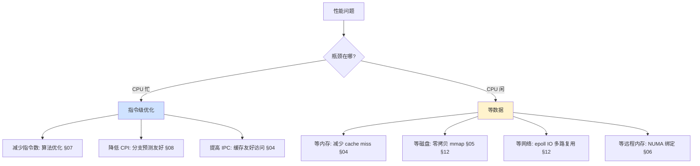

# 计算机组成原理 · 全系列总结

> 12 篇组成原理文章的核心提炼。每篇一张速通卡、一段展开、一句话带走。

---

> 🎯 **为什么要懂计算机组成原理？**
>
> 你写 `count++`，机器在背后跑 MESI 协议抢缓存行；你写 `0.1 + 0.2`，IEEE 754 决定它不精确；你写 `malloc(1GB)`，Lazy Allocation 让它瞬间返回；你写 `read(fd, buf, size)`，DMA 在替你搬运数据。
>
> **不懂组成原理的程序员，是用"魔法思维"写代码**——以为计算机是公平的、线性的、可预测的。而真相是，计算机是一台由物理约束支配的精密机器：缓存命中 vs 缓存缺失差 100 倍，本地内存 vs 远程内存差 2 倍，顺序访问 vs 随机访问差 10 倍，零拷贝 vs 传统 IO 差 6 倍。
>
> **本系列的野心**：让你从"不知道不知道"进化到"知道并能说出为什么"——不是背术语，而是建立**对硬件的直觉**：一行代码在 CPU 上到底花了多少皮秒、数据在存储金字塔的第几层、瓶颈在冯·诺依曼的哪一段。
>
> ---

> 🗺️ **这篇总结怎么用？**
>
> - **速查**：直接跳 §0 按症状找到对应篇章
> - **面试**：先读 §14 数据一页纸 → §15 诊断表 → §[新增] 面试热点
> - **串讲**：读 §13 贯通三句话 → §[新增] 跨篇主题串联 → §[新增] 核心术语速查
> - **回顾**：每篇只看 §N.1 速通卡 + §N.3 一句话拎走
>
> ---

## 0.阅读导航

### 0.1 按场景读

| 你遇到了什么 | 先读哪篇 |
|---|---|
| 线上接口突然变慢，CPU 很闲但 RT 很高 | → **§01 组成结构**（冯·诺依曼瓶颈）→ **§05 I/O 设备** |
| 多线程计数器值总是少 | → **§03 CPU 设计**（缓存一致性/MESI） |
| 同样的循环换个嵌套顺序性能差 10 倍 | → **§04 CPU 缓存**（缓存友好编程） |
| `0.1 + 0.2 != 0.3`，对账差钱 | → **§10 二进制和字节**（浮点数） |
| 文件下载服务 QPS 上不去 | → **§12 I/O 操作**（零拷贝/epoll） |
| C 程序偶发 Segfault，查不到原因 | → **§09 内存设计**（虚拟内存/mprotect） |
| NuMA 机器上进程性能不稳定 | → **§06 总线系统**（numactl） |
| 不知道指令集、流水线、乱序是什么 | → **§07 指令** → **§08 程序执行** |
| 想从头建立硬件直觉 | → **§01** → **§02** → 按顺序读完 |

### 0.2 按层次读

```
第 0 层·语言基础  →  §10 二进制和字节
第 1 层·全景图    →  §01 组成结构原理
第 2 层·指令      →  §07 指令编程  →  §08 程序执行
第 3 层·处理器    →  §03 CPU 设计  →  §04 CPU 缓存
第 4 层·存储      →  §02 存储器    →  §09 内存设计
第 5 层·互联      →  §06 总线系统
第 6 层·外设      →  §05 I/O 设备  →  §12 I/O 模型
第 7 层·容错      →  §11 异常处理
```

每层向上依赖：看懂 §08 需要 §07 的指令概念，看懂 §04 需要 §02 的局部性原理。

---

## 1.第 01 篇·计算机组成结构原理

### 1.1 速通卡

| 维度 | 内容 |
|---|---|
| **遇到场景** | 凌晨 3 点线上告警：接口 RT 从 20ms 飙升到 2s，`top` 显示 CPU 闲（id+wa=91%），但磁盘 `wa` 高达 71% |
| **暴露问题** | 小李知道 Java 调优参数，但不知道一次磁盘读要 10ms——**对硬件没有感觉**，无法建立"代码在硬件上的成本模型" |
| **根因** | SSD 随机读延迟从 100μs 涨到 80ms，接口每次请求读几十次小文件——**CPU 在等磁盘，不是算得慢** |
| **核心知识** | 冯·诺依曼五大部件（运算器/控制器/存储器/输入/输出）、存储程序概念、哈佛 vs 冯·诺依曼架构、性能公式、功耗墙、阿姆达尔定律 |
| **架构主线** | 不可编程 → 可编程（插线板）→ 存储程序（冯·诺依曼）→ 现代混合架构（CPU 内部哈佛 + 外部冯·诺依曼） |
| **加深理解** | 如果你写的程序在 `htop` 上 CPU 100%，你该高兴还是该排查？——**CPU 打满说明没在等 I/O，等 I/O 才真正浪费时间** |

### 1.2 展开：冯·诺依曼架构的五根支柱

**五大部件**：运算器（ALU）→ 控制器（CU，含 PC/IR）→ 存储器（内存+硬盘）→ 输入设备 → 输出设备。**CPU 永远只和内存打交道**，外设数据必须先入内存。

**存储程序**：程序 = 数据，存在内存中，换任务 = 换加载的程序。ENIAC 换任务需数天重新接线，现代计算机只需毫秒级进程切换。

**性能公式**：`CPU 执行时间 = 指令数 × CPI × 时钟周期`。三个变量分别由程序员（算法）、CPU 架构师（微架构）、芯片工程师（制程）决定。

**瓶颈定律**：
- **冯·诺依曼瓶颈**：CPU（~10GHz 级）vs 内存（~50GB/s），CPU 大量时间在等数据
- **功耗墙**：`P ∝ V² × f`，主频翻倍功耗至少翻倍，行业转向多核/异构
- **阿姆达尔定律**：`加速比 = 1/((1-P)+P/N)`，串行 10% 意味着无限核也只能加速 10 倍

**三层直觉**：① 速度金字塔（寄存器 0.3ns → 网络 100ms，跨 3 亿倍）② 瓶颈不只在 CPU（95% 的慢是等数据）③ 指令有真实成本（一行 `x.y = z` 可能触发多次缓存 miss）

### 1.2b 诊断信号灯

| 信号 | 你可能该读的章节 |
|---|---|
| 接口慢、CPU 闲 | §01（瓶颈不在 CPU）→ §05（I/O） |
| 多线程加核不加速 | §01（阿姆达尔）→ §03（MESI） |
| 不知道程序在硬件上花了多少钱 | §01（全篇就是建立这个直觉的） |

### 1.3 一句话拎走

> 计算机是一台"按地址取指令、顺序执行、数据经内存中转"的机器。**记住这三个约束，你就懂了计算机怎么跑。**

---

## 2.第 02 篇·计算机存储器的原理

### 2.1 速通卡

| 维度 | 内容 |
|---|---|
| **遇到场景** | Android 购物车 Bug——用户反馈商品偶尔消失，根因：`SharedPreferences.apply()` 只到 Page Cache 未落盘 |
| **暴露问题** | 程序员以为"写完了"不等于数据真的在磁盘上——**存储层次每两层的"持久化承诺"完全不同** |
| **核心矛盾** | 速度 / 容量 / 成本 **不可能三角**——快的不够大，大的不够快，又大又快又便宜不存在 |
| **核心知识** | 存储层次金字塔、局部性原理、SRAM vs DRAM、DDR 演进、mmap 零拷贝 |
| **加深理解** | 你程序里 `write(fd, buf, 4096)` 写完后，数据现在在 CPU 寄存器/内存/Page Cache/磁盘控制器的哪个位置？——答不上来说明你不懂存储层次 |

### 2.2 展开：存储层次的设计密码

**局部性原理是整个缓存体系的基石**：
- **时间局部性**：刚访问过的数据很可能再次访问（循环变量 `i` 每次迭代用到）
- **空间局部性**：访问地址 X 后 X+1 很可能被访问（顺序遍历数组）

**SRAM vs DRAM 的电路级差异**：SRAM（6 晶体管/bit，~1ns）快但贵；DRAM（1T+1C/bit，~100ns）慢但便宜——Cache 用 SRAM，内存用 DRAM。

**mmap 的零拷贝魔法**：传统读写 4 次拷贝（磁盘→内核→用户→内核→磁盘），mmap 将文件映射到虚拟地址空间后"写内存 ≈ 写磁盘"，省去用户态拷贝。

**综合案例日志之旅**：四种方案实测对比——方案 D（mmap + 批量写）比方案 C（FileChannel.write）快 160 倍（50ms vs 8000ms）。

### 2.2b 诊断信号灯
| 信号 | 可能原因 |
|---|---|
| 程序重启后数据丢了 | 写到了 Page Cache 未 fsync |
| 随机访问大数组比顺序慢几十倍 | 缓存友好 vs 缓存敌对——§04 |
| `top` 的 buff/cache 特别大 | 操作系统利用剩余内存做 Page Cache，正常 |

### 2.3 一句话拎走

> 存储层次是计算机最优雅的折中设计。**你写的每一行代码，数据都在这个金字塔里上上下下——让热点数据待在塔尖，是性能优化的第一性原理。**

---

## 3.第 03 篇·计算机基础 CPU 设计

### 3.1 速通卡

| 维度 | 内容 |
|---|---|
| **遇到场景** | `count++` 多线程值总是少——从 `AtomicLong` CAS 自旋到 `LongAdder` 分桶，性能差 10 倍 |
| **暴露问题** | `volatile` + `AtomicLong` 在低竞争下还行，高竞争下 CAS 空转的 CPU 时间比真正的计算还多——**多核不是免费午餐** |
| **核心矛盾** | 多核 CPU 共享数据 vs 缓存一致性协议开销——**核越多，协同越贵** |
| **核心知识** | CPU 微架构、CISC/RISC、MESI 协议、伪共享、缓存行填充 |
| **加深理解** | 你写的 `synchronized` 块里，底层有多少个 CPU 在抢同一个缓存行？——如果你看不到 MESI 的 S 态变 I 态的过程，你就不理解锁的真正开销 |

### 3.2 展开：CPU 设计的三重门

**CISC vs RISC**：x86（CISC）指令变长 1-15 字节、支持内存直接操作数；ARM（RISC）定长 32 位、Load/Store 架构。现代 x86 外 CISC 内 RISC——解码时拆成 μops。

**MESI 协议**：Modified / Exclusive / Shared / Invalid 四种状态，是多核缓存一致性的核心机制。两个核同时写同一缓存行时，协议通过总线嗅探（Snooping）让缓存行在两个核的 L1 之间来回"弹跳"。

**伪共享（False Sharing）**：两个线程各自修改同一缓存行的不同变量，虽然逻辑上不冲突，但 MESI 协议迫使缓存行在 Modified 和 Invalid 之间反复切换——性能可差 10 倍。

**LongAdder 解法**：`@Contended` 注解 + 分桶策略，让每个核心往专属的 cell 里累加，把"多核抢一个缓存行"变成"各核写各自的缓存行"。

### 3.2b 诊断信号灯
| 信号 | 可能原因 |
|---|---|
| `AtomicLong` 高并发下吞吐不涨 | CAS 空循环，缓存行在多核间弹跳 |
| 两个独立 `volatile` 变量并发修改互相拖慢 | 伪共享——它们在同一缓存行 |
| 加核后吞吐反而下降 | MESI 协议开销超过并行收益 |

### 3.3 一句话拎走

> CPU 看着是"一颗"，实际是几十亿晶体管组成的复杂系统。**多核不是你写多线程就自动加速——缓存一致性、伪共享、CAS 自旋，每一个都可能在偷你的性能。**

---

## 4.第 04 篇·系统 CPU 缓存的设计

### 4.1 速通卡

| 维度 | 内容 |
|---|---|
| **开篇场景** | 灰度化 10000×10000 图像——`for i / for j`（按行）vs `for j / for i`（按列）性能差 15 倍 |
| **根因** | 按列遍历每次跳一整行，每次访问几乎必然 Cache Miss；按行遍历连续访问，Cache Line 预取命中率接近 100% |
| **核心知识** | 三级缓存结构、64 字节缓存行、三种地址映射、LRU/伪 LRU 替换策略 |
| **终极优化** | 矩阵乘法：循环交换 + 分块（Tiling）+ SIMD + 预取 = **15 倍加速（12 秒 → 0.8 秒）** |

### 4.2 展开：缓存设计的四个关键抉择

**缓存行为什么是 64 字节？** DDR 一次突发传输（Burst Length=8）× 数据总线宽度 8 字节 = 64 字节。多于 64 浪费带宽，少于 64 没充分利用。

**三种地址映射**：直接映射（冲突多但电路简单）→ 全相联（无冲突但比较器太贵）→ **组相联（8 路是黄金折中）**。

**替换策略**：精确 LRU 需要记录访问顺序（硬件代价大），伪 LRU（二叉树算法）用 N-1 bit 达到 LRU 95% 的效果——实际 CPU 全用伪 LRU。

**LRU 的致命缺陷**：当工作集刚好大于缓存容量时，LRU 命中率直接跌到 0%（刚淘汰的恰好是下一次要用的）。这就是**颠簸（Thrashing）**。

### 4.3 一句话拎走

> CPU 缓存不是一个"通用的快箱子"，而是一个**对访问模式极度敏感的系统**。**连续访问友好、随机访问敌对——你的循环嵌套顺序决定性能。**

---

## 5.第 05 篇·计算机输入输出设备

### 5.1 速通卡

| 维度 | 内容 |
|---|---|
| **遇到场景** | 500MB 文件下载服务——`read+write` 40 秒，换 `transferTo`（sendfile 零拷贝）后只 5 秒 |
| **暴露问题** | 同样的功能，同样的数据，4 次拷贝 vs 2 次 DMA——**数据传输的路径决定了吞吐上限，而不是 CPU 频率** |
| **根因** | 传统读写 4 次数据拷贝 + 4 次上下文切换；sendfile 缩减为 2 次 DMA + 2 次切换 |
| **核心知识** | 四种 I/O 控制方式（查询/中断/DMA/通道）、I/O 接口四大功能、中断全流程 |
| **控制演进** | 程序查询（CPU 100% 空转）→ 中断（按需唤醒）→ DMA（批量搬运绕过 CPU）→ 通道（独立 I/O 处理器） |
| **加深理解** | 你代码里 `Thread.sleep(10)` 等 I/O——这 10ms 里 DMA 搬了几百万字节，CPU 可以干几千万次运算。**等 I/O 是最高昂的 CPU 闲置** |

### 5.2 展开：I/O 的四个核心机制

**I/O 接口解决四大差异**：速度差（CPU GHz vs 键盘 Hz）、格式差（并行 vs 串行）、宽度差（总线 64 位 vs 外设 8 位）、时序差（同步 vs 异步）。

**中断处理五步**：请求 → 响应（保存 PC/PSW）→ 查中断向量表 → 执行 ISR → 恢复现场返回。

**一次磁盘 I/O ≈ 1 亿次 CPU 时钟周期**。程序慢几乎永远不是因为 CPU 算得慢，而是等 I/O。

**零拷贝的三级跳**：`read+write`（4 拷贝）→ `mmap`（3 拷贝）→ `sendfile`（2 次 DMA，0 次 CPU 拷贝）。Linux 2.4 后 sendfile 直接从 Page Cache 到网卡，CPU 只做控制不做搬运。

### 5.2b 诊断信号灯
| 信号 | 行动 |
|---|---|
| 文件传输类服务 CPU 低但慢 | 检查拷贝次数，上 sendfile |
| 磁盘读写多用户态/内核态切换 | `iostat` 看 `%iowait`，高了必查 I/O 路径 |
| 你写的 I/O 代码在哪个时间烧掉的？ | 拷贝 > 上下文切换 > 中断 > DMA——先砍大头 |

### 5.3 一句话拎走

> I/O 是计算机五个部件里最慢的——**CPU 和磁盘差 10 万倍，和网络差 300 万倍**。优化 I/O 比优化计算更值钱。

---

## 6.第 06 篇·计算机总线系统设计

### 6.1 速通卡

| 维度 | 内容 |
|---|---|
| **遇到场景** | MySQL 双实例同机部署，B 实例 p99 比 A 高 30%——根因：NUMA 跨节点内存访问（本地 80ns vs 远程 150ns） |
| **暴露问题** | 物理上同机不等于性能上同机——**数据放在哪个 CPU 的内存条上，决定了访问延迟差一倍** |
| **核心矛盾** | 速度 × 宽度 × 距离——并行总线受串扰限制频率上限，串行总线用差分信号突破 GHz |
| **核心知识** | 三组总线信号、串行取代并行的原因、PCIe 分层架构、NUMA、QPI/UPI |
| **演进路径** | ISA（8 位）→ PCI（32 位并行）→ PCIe（串行差分）→ QPI/UPI（CPU 直连） |
| **加深理解** | `numactl --hardware` 看一下你有几个 NUMA 节点——然后 `numactl --cpunodebind=0 --membind=0` 绑一次你的服务，对比 p99 |

### 6.2 展开：总线设计的三个时代

**并行时代的终结**：PCI 总线 64 位并行，因线间串扰无法突破 133MHz。PCIe 采用串行差分信号，单 Lane 即达 GHz 级。

**PCIe 分层架构**：事务层（TLP 包）→ 数据链路层（ACK/重传）→ 物理层（差分信号），**完全像网络协议栈**。

**NUMA 核心概念**：每个 CPU 有自己的本地内存，访问远程内存走 QPI/UPI 总线——延迟翻倍。`numactl --cpunodebind=0 --membind=0` 将进程绑在同一个 NUMA 节点上。

**NVMe 读 4KB 穿越 10 段总线路径**：从 SSD 的 PCIe Lane → Root Complex → CPU → 内存控制器 → DRAM，每一步都是带宽的串联瓶颈。

### 6.2b 诊断信号灯
| 信号 | 行动 |
|---|---|
| 同机多进程性能差距大 | `numactl --show` 确认 NUMA 策略 |
| PCIe 设备带宽跑不满 | 检查 PCIe 链路协商速率（`lspci -vv`） |
| 跨 Socket 通信频繁 | 把相关进程绑同一 NUMA 节点 |

### 6.3 一句话拎走

> 总线是计算机的"神经系统"，决定了数据能在多快的时间内从 A 部件跑到 B 部件。**NUMA 架构下，"数据离 CPU 近不近"比"CPU 快不快"更重要。**

---

## 7.第 07 篇·计算机指令编程原理

### 7.1 速通卡

| 维度 | 内容 |
|---|---|
| **遇到场景** | 音视频 SDK 在 x86 正常、ARM 上波形"锯齿"——`unsigned char` 在 ARM AAPCS 下被 promotion 为 `int`，丢失溢出保护 |
| **根因** | CISC 和 RISC 平台对整数提升的处理机制不同——**同样的 C 代码，不同的指令集，不同的执行结果** |
| **核心知识** | 指令格式（操作码+地址码）、六种寻址方式、编译四阶段、CISC/RISC 设计哲学 |
| **六种寻址** | 立即 → 直接 → 间接 → 寄存器 → 基址 → 变址，从左到右灵活性递增、速度递减 |
| **暴露问题** | 同样 C 代码编译给 x86 和 ARM，指令序列完全不同——**你写的"同一行代码"底层是两套指令在跑** |
| **加深理解** | `gcc -S -O2 test.c` 看一眼汇编，数一下 `printf("hello")` 变成了几条指令——**一条 C 语句不等于一条机器指令** |

### 7.2 展开：从 C 代码到机器码的完整旅程

**编译四阶段**：预处理（`#include` 展开）→ 编译（C → 汇编）→ 汇编（汇编 → 目标文件 `.o`）→ 链接（多 `.o` + 库 → 可执行文件）。

**寻址方式的选择逻辑**：
- 常数操作数 → 立即寻址（最快，值在指令里）
- 全局变量 → 直接寻址（地址在指令里）
- 数组循环 → 基址 + 变址（灵活但需额外计算）

**CISC vs RISC 的胜负手**：纯 CISC 和纯 RISC 都没赢。现代 CPU 全走融合路线——x86 外 CISC 内 RISC（解码为 μops），ARM 从 RISC 出发不断加复杂指令（如 NEON SIMD）。

**为什么记住 RISC-V？** 开源指令集，没有专利负担，模块化设计（基础+扩展），正在吃掉嵌入式 → 加速器 → 轻度服务器市场。

### 7.2b 诊断信号灯
| 信号 | 行动 |
|---|---|
| x86 程序跑 ARM 上结果不对 | 检查整数 promotion 和未定义行为差异 |
| 不确定编译器做了什么 | `objdump -d binary` 对比 O0 和 O2 |
| 想理解一条语句的真实成本 | 看它生成的汇编指令数量和类型 |

### 7.3 一句话拎走

> 指令集是软硬件的契约。**你的 `if` / `for` / 函数调用最终都变成一串机器码——编译器负责翻译，但性能上限由指令集和微架构共同决定。**

---

## 8.第 08 篇·计算机程序如何执行

### 8.1 速通卡

| 维度 | 内容 |
|---|---|
| **遇到场景** | StackOverflow 传奇——排序后数组遍历比乱序快 5~6 倍，根因：分支预测准确率差异（排序后 ~99%，乱序 ~50%） |
| **暴露问题** | "同样的数据、同样的循环、同样的次数"耗时差 6 倍——**CPU 不是公平的：它对你代码的未来走向有"猜测"，猜对了快，猜错了慢** |
| **核心矛盾** | 顺序的假象 vs 并行的真相——CPU 在"假装顺序执行"的外表下疯狂并行 |
| **核心知识** | 五级流水线、三种冒险、分支预测（2 位饱和计数器）、乱序执行（ROB）、超标量、SMT |
| **IPC 对照** | 无流水线 IPC≈0.2 → 五级流水 IPC≈1 → 乱序+超标量 IPC≈4.5，**纯架构优化提速 20 倍** |
| **加深理解** | `perf stat -e branch-misses,branch-instructions ./your_program` 看分支预测失误率——超过 5% 就该重构分支逻辑 |

### 8.2 展开：CPU 执行流水线的秘密

**五级流水线**：IF（取指）→ ID（解码）→ EX（执行）→ MEM（访存）→ WB（写回）。每个时钟周期同时跑五条指令的不同阶段。

**三种冒险与解法**：
- **结构冒险**（两条指令抢同一硬件）→ 拆分 I-Cache/D-Cache（哈佛架构）
- **数据冒险**（后一条依赖前一条结果）→ **Forwarding（旁路）**，ALU 结果不等写回直接转发
- **控制冒险**（分支指令未决）→ 2 位饱和计数器分支预测

**乱序执行的秘密武器**：保留站 + ROB（重排序缓冲区）= "前端顺序取指、中间乱序执行、后端顺序提交"。CPU 把串行指令流重新排成最优执行序列。

### 8.2b 诊断信号灯
| 信号 | 行动 |
|---|---|
| 循环中 `if/else` 分支规律性差 | 改成查表、位运算、无分支写法 |
| `perf` 显示 branch-misses 高 | 让判断条件有方向性，或去掉不可预测分支 |
| 超线程核跑满但真实吞吐不涨 | SMT 共享执行单元，两个线程互抢——绑一个 |

**超线程（SMT）**：单核暴露两套"寄存器状态"，同时跑两个线程——操作系统看是两个核，实际共享一套执行单元。性能提升 20-30%。

### 8.3 一句话拎走

> 你以为的"顺序执行"是 CPU 精心表演的假象。**流水线、乱序、超标量、分支预测——这四个词是 CPU 性能的秘密引擎，也是 Meltdown/Spectre 类安全漏洞的温床。**

---

## 9.第 09 篇·计算机内存设计原理

### 9.1 速通卡

| 维度 | 内容 |
|---|---|
| **遇到场景** | C++ 缓存模块偶发 Segfault——mmap 出内存后被 `mprotect` 改成只执行权限，写入时 MMU 权限校验失败 |
| **暴露问题** | 你以为所有地址都是"可以写的"，但 MMU 按页表逐页检查——**不是所有的"指针"都指向可写内存** |
| **核心矛盾** | 物理内存有限 vs 多进程同时运行——虚拟内存让每个进程以为自己独占 4GB |
| **核心知识** | 虚拟内存、分页（4KB/2MB/1GB）、多级页表、TLB、COW、Lazy Allocation |
| **演进路径** | 裸物理地址 → 分段（外部碎片）→ 分页 → 多级页表（空间换空间）→ TLB 加速 |
| **加深理解** | `malloc(100MB)` 后立即 `top` 看 RES——几乎没涨。再写一遍数组后 `top` 再看——涨了。**这就是 Lazy Allocation** |

### 9.2 展开：虚拟内存的四重门

**虚拟内存解决四大问题**：
1. **地址冲突**：两个进程的 `0x400000` 映射到不同物理页，互不干扰
2. **内存保护**：页表项的 R/W/U/S 标志位让 OS 拒绝非法访问
3. **内存不够用**：不常用页换出到磁盘——这就是 swap
4. **内存碎片**：分页将物理内存切成 4KB 固定块，外部碎片消除

**多级页表的智慧**：x86-64 四级页表（PGD→PUD→PMD→PTE），只为实际使用的地址空间分配页表——4KB 页的页表开销从 4MB 降到 ~20KB。

**TLB 是页表的 Cache**：TLB 命中率从 99% 降到 80%，性能下降约 9%——因为每次 TLB Miss 要走完四级页表的内存访问（4×~100ns）。

**Lazy Allocation**：`malloc(1GB)` 瞬间返回，并不真正分配物理内存——首次写入才触发缺页异常分配物理页。`top` 看 VIRT 和 RES 的巨大差距就是这个机制。

### 9.2b 诊断信号灯
| 信号 | 行动 |
|---|---|
| Segfault 但 `gdb` 指向合法地址 | 检查 `mprotect` 或 NX bit 的权限设置 |
| VIRT 巨大 RES 很小 | Lazy Allocation 正常，也可能是内存泄漏（VIRT 不停涨）|
| 多进程 fork 后性能先好后差 | COW 触发后各自复制页面，内存翻倍 |

### 9.3 一句话拎走

> 虚拟内存是现代操作系统最伟大的抽象。**你的程序以为自己独占 4GB 连续内存，实际上它的数据被切成了成千上万个 4KB 碎片散落在物理内存各处——TLB 就是拼图快照。**

---

## 10.第 10 篇·计算机二进制和字节

### 10.1 速通卡

| 维度 | 内容 |
|---|---|
| **遇到场景** | 财务对账差 0.01 元——`DOUBLE` 累加 12 万次后精度误差被不断放大，应改用 `DECIMAL` |
| **暴露问题** | 0.1 在二进制里是无限循环小数——**浮点数的"不精确"是数学定理决定的，硬件是清白的** |
| **加深理解** | `htons(1)` 在 x86 上返回 `0x0100` 还是 `0x0001`？——答不上来说明没理解大小端 |
| **根因** | 0.1 和 0.2 在二进制中是无限循环小数，存储时被截断——**浮点数不精确是数学定理，不是 bug** |
| **核心知识** | 二进制物理基础、补码（模运算）、IEEE 754 浮点数、UTF-8 编码、大端/小端 |
| **编码演进** | 原码（0 双重表示）→ 反码 → **补码（让 CPU 只用加法器做减法）** |

### 10.2 展开：二进制世界的设计智慧

**为什么选二进制？** 不是因为数学最优——三进制在信息密度上更优（e≈2.718 在理论上最优）。二进制的胜出是**物理实现的胜利**：只需区分高低电平，容错空间远大于多值逻辑。

**补码的数学本质**：模 2^n 加法群。`A - B = A + (-B 的补码)`，CPU 的加法器天然支持减法——**一套电路，两套语义**。

**`0.1 + 0.2 ≠ 0.3` 的底层原因**：IEEE 754 单精度 - 1 位符号 + 8 位阶码 + 23 位尾数。0.1 的尾数无限循环，截断后丢失精度。金融计算永远不要用浮点。

**UTF-8 的巧妙设计**：
- ASCII（0x00-0x7F）：1 字节，**完全向后兼容**
- 中文（0x4E00-0x9FFF）：3 字节，以 `1110xxxx` 开头
- 自同步性：从任意字节开始，最多 3 字节内找到下一个字符边界

**大端 vs 小端**：大端（网络字节序，高位在低地址）vs 小端（x86，低位在低地址）。两种格式并存是历史遗产——ARPA 选了网络序，Intel 选了主机序。

### 10.2b 诊断信号灯
| 信号 | 行动 |
|---|---|
| 金额运算结果差 0.01 | 浮点→DECIMAL/BigDecimal |
| `0.1+0.2 != 0.3` 让你惊讶 | 读 §10 的 IEEE 754 部分 |
| 网络通信结构体字节序错乱 | 发端/收端的大小端不一致——`htonl/ntohl` |

### 10.3 一句话拎走

> **二进制不是计算机的选择，是三极管的宿命。** 开关只有通和断，所以计算机只有 0 和 1。后面的一切——整数、浮点、字符、图片、视频——全是这些 0 和 1 的排列组合游戏。

---

## 11.第 11 篇·计算机异常处理机制

### 11.1 速通卡

| 维度 | 内容 |
|---|---|
| **遇到场景** | Java 推送服务 QPS 降为 0——JNI 本地库 SIGSEGV 被自定义处理器"吞了"，线程池耗尽，进程不死不活 |
| **暴露问题** | Java 的 `NullPointerException` 底层是 CPU 的 #PF → OS 的 SIGSEGV → JVM——**你的 try-catch 背后是三级接力** |
| **根因** | JNI 异常处理器忽略了信号，Java 层不知道底层已崩溃，线程卡在 native 调用永不返回 |
| **核心知识** | 四种异常（中断/陷阱/故障/终止）、IDT、信号机制、JVM 异常底层原理 |
| **安全基石** | Stack Canary / ASLR / NX / CFI 都建立在异常机制和 MMU 之上 |
| **加深理解** | `try { obj.method(); } catch (NullPointerException e) {}` 如果 `obj==null`，这行代码实际触发了 #PF→SIGSEGV→JVM信号处理→创建异常对象→catch捕获——**猜一下这中间 CPU 做了多少次上下文切换？** |

### 11.2 展开：从 CPU 异常到语言异常的完整链条

**四种异常的精确区分**：
| 类型 | 触发 | 同步/异步 | 可恢复？ | 返回位置 | 典型例子 |
|------|------|----------|---------|---------|---------|
| 中断 | 外部设备 | 异步 | 是 | 下一条 | 键盘按键、网卡收包 |
| 陷阱 | `int 0x80` | 同步 | 是 | 下一条 | 系统调用 |
| 故障 | 指令执行出错 | 同步 | **可能** | 当前指令 | 缺页异常、除零 |
| 终止 | 硬件严重错误 | 同步 | **否** | 不返回 | 硬件故障、双重故障 |

**缺页异常是"可恢复故障"的典范**：
1. CPU 发现页不在内存 → #PF 异常
2. 异常处理器检查访问合法性 → 分配物理页 → 从磁盘读入 → 更新页表
3. 返回重新执行触发指令——这次页在内存了，指令成功。**整个过程对程序完全透明**。

**Java `NullPointerException` 的底层**：`obj.method()` 当 `obj==null` 时，CPU 尝试访问地址 `0x0` → MMU 发现页表无映射 → #PF → OS 发 SIGSEGV → JVM 信号处理器识别为 NPE → 创建 `NullPointerException` 对象 → 抛出到 Java 栈。**从 CPU 异常到 Java 异常的接力，经过了 MMU → OS → JVM 三层**。

**异常的开销**：Java 每秒抛几万次异常会引发 GC 压力（异常对象 + 栈轨迹字符串）。**异常应该是"异常"，不应该是控制流**。

### 11.2b 诊断信号灯
| 信号 | 行动 |
|---|---|
| JNI 调用后线程卡死 | 检查 native 层信号处理器是否吞了致命信号 |
| 用异常做控制流（`try` 代替 `if`） | 每秒 >1万次异常就会引发 GC——改用返回值 |
| Segfault 后 core dump 看不懂 | 读 `dmesg`，IDT 向量编号会指向具体异常类型 |

### 11.3 一句话拎走

> 异常不是 bug，是计算机的免疫系统。**从 CPU 的 #PF 到 Java 的 NullPointerException，中间经过 MMU → 操作系统 → JVM 三层接力——理解这条链，你才能写出"崩溃时能留下线索"的程序。**

---

## 12.第 12 篇·计算机 I/O 操作和原理

### 12.1 速通卡

| 维度 | 内容 |
|---|---|
| **遇到场景** | Netty 静态资源服务卡在 QPS 3000——`FileInputStream.read` 阻塞 IO + 双拷贝，换 `DefaultFileRegion`（sendfile）后飙到 18000+ |
| **暴露问题** | 同一个文件、同一个网络——换一条数据搬运路径，QPS 差了 6 倍。**IO 模型的选型决定了架构的天花板** |
| **核心矛盾** | 高并发连接 vs 每连接一个线程——C10K 问题催生了 IO 多路复用 |
| **核心知识** | 四种 I/O 模型、epoll（红黑树+就绪链表）、零拷贝、Reactor/Proactor、io_uring |
| **架构演进** | Apache 多进程（C10K 上限）→ Nginx epoll + sendfile → io_uring（共享环形缓冲区，终极异步）|
| **加深理解** | 你的 Web 服务能处理多少并发连接？1K/10K/100K/1M？答不上来说明没理解 IO 模型决定并发上限。**C10K 的答案在 epoll 的 O(1) 就绪事件获取里** |

### 12.2 展开：I/O 模型的四象限

**同步/异步 × 阻塞/非阻塞**四象限：
```
              阻塞          非阻塞
同步    BIO（accept 等）   NIO 轮询（浪费 CPU）
        IO 多路复用（select/poll/epoll）——高效等待
异步    AIO（Windows IOCP / Linux io_uring）
```

**epoll 为什么快得不可理喻**：
- `select`/`poll`：每次调用传全部 fd 集合到内核遍历 → O(n)，最大 1024
- `epoll`：红黑树存所有 fd + 就绪链表只存活跃 fd → **O(1) 获取就绪事件**，无 fd 数限制
- `epoll_create`（创建实例）→ `epoll_ctl`（增删 fd 进红黑树）→ `epoll_wait`（只从就绪链表取）

**Reactor vs Proactor**：
- **Reactor**（epoll）：内核通知"可读了"，应用自己调用 `read`——**同步非阻塞**
- **Proactor**（io_uring）：内核读完后通知"数据在缓冲区 X，拿去用"——**真异步**

**io_uring：Linux AIO 的终局**。共享环形缓冲区（SQ/CQ），应用往 SQ 丢请求，内核完成后往 CQ 写结果——**零系统调用 + 零拷贝 + 批量提交**。

### 12.2b 诊断信号灯
| 信号 | 行动 |
|---|---|
| 文件服务 QPS 瓶颈不在 CPU | 检查是否阻塞 IO——切 sendfile |
| select/poll 到 1024 fd 截断 | 切 epoll |
| 网络+磁盘双密集但没用到 io_uring | 考虑 Proactor，Linux 5.1+ 可用 |
| 大量短连接 TIME_WAIT | 调整 `tcp_tw_reuse`+连接池复用 |

### 12.3 一句话拎走

> 从 BIO 到 NIO 到 epoll 到 io_uring，I/O 模型的进化史就是"**让 CPU 的等待时间趋近于零**"的历史。选择一个好的 I/O 模型，比优化算法更能提升系统吞吐。

---

## 13.全系列·贯通三句话

### 13.1 速度金字塔——一切性能问题的根源

```
寄存器(0.3ns) → L1(1ns) → L2(5ns) → L3(15ns) → 内存(100ns)
→ SSD(100μs) → HDD(10ms) → 网络(100ms)
差 3 亿倍
```

**程序员的肌肉记忆**：遍历连续数组（缓存友好）和随机链表（缓存敌对）性能可差 100 倍；循环里开文件句柄（每次 I/O）和批量读写差 1000 倍。

### 13.2 局部性原理——所有硬件优化的公理

- **时间局部性** → Cache、TLB、分支预测
- **空间局部性** → Cache Line 64B 预取、DDR Burst Length=8

你的代码如果同时满足两条局部性，硬件会拼尽全力帮你加速；如果两条都不满足，再好的硬件也救不了。

### 13.3 分层抽象——计算机科学的终极方法论

| 层 | 隐藏的复杂性 |
|------|------------|
| 高级语言 | 寄存器分配、指令调度 |
| 指令集 ISA | 流水线、乱序执行、分支预测 |
| 虚拟内存 | 物理页分配、磁盘交换 |
| VFS | 具体文件系统（ext4/xfs/nfs） |
| Socket API | TCP 重传、拥塞控制、网卡中断 |

**每一层都向上一层隐藏复杂性，同时定义了性能的上限。写出对硬件有感觉的代码，就是透过抽象看清真实的物理成本。**

---

### 13.4 跨篇主题串联一：并发编程的硬件真相

为什么多线程不是你"开了就快"？因为并发编程的每一坑，根都在硬件：

```
你写的                    硬件层发生了什么                    相关篇章
──────────────────────────────────────────────────────────────────
synchronized(obj) { }    多个核抢同一缓存行，MESI 协议
                         让缓存行在核间"弹跳"                  §03

AtomicLong.increment()   高竞争下 CAS 自旋空转
                         CPU 在"空转等待"而非"计算"           §03 §08

两个线程各改不同 volatile  伪共享——两个变量恰好在同一缓存行
变量，性能互相拖慢         MESI 强制来回 Invalid               §03 §04

Thread.sleep(1) 等 I/O   CPU 等 1ms = 空转 300 万周期
                         DMA 替你搬数据，CPU 闲置              §05 §12

CountDownLatch.await()   底层是 volatile + CAS + 线程调度
                         最终靠 CPU 的 Lock 前缀指令            §03 §11
```

**核心认知**：**并发的代价不在"线程切换"，在"缓存一致性"。**
锁竞争的本质是 MESI 协议的 Modified→Invalid 来回切换——每一次都是一个总线事务。

### 13.5 跨篇主题串联二：安全漏洞的硬件根源

Spectre / Meltdown / RowHammer 这些"世纪漏洞"的根不在软件——在 CPU 的推测执行和缓存时序侧信道：

```
漏洞          硬件机制             攻击原理                    相关篇章
──────────────────────────────────────────────────────────────────
Meltdown      乱序执行 + 不检查权限  推测执行读了内核内存，
              的 load              缓存留下了痕迹               §08 §09

Spectre       分支预测 + 训练污染    恶意训练分支预测器，
                                  让它猜错→推测执行泄露数据    §08

RowHammer     DRAM 电容漏电         反复读写同一位线邻近行，
                                  让邻居 bit 翻转              §02 §09

栈溢出攻击     函数调用栈 + 无边界检查  覆盖返回地址跳转到 shellcode   §07 §11

ASLR 绕过     MMU 页表 + 地址随机化  利用信息泄露 + 固定偏移
                                  计算随机化后的基址            §09 §11
```

**核心认知**：**安全问题不是"代码写得不好"，是物理硬件的"副作用通道"。**
理解了流水线、分支预测、缓存、页表的实现，你才能理解：为什么 CPU 会成为侧信道攻击的"无意帮凶"。

### 13.6 跨篇主题串联三：性能优化的硬件认知框架

所有性能优化，归根结底是让数据在正确的时间待在正确的硬件位置：



**三条实践口诀**：
1. **减少跨越金字塔层级的次数**——寄存器→L1→内存→磁盘，每跨一层代价 10-1000 倍
2. **连续访问=缓存友好=快**（§04）、**随机访问=缓存敌对=慢**（§02）
3. **永远先定位瓶颈再优化**——CPU 100% 和 CPU 10% 的优化方向完全不同（§01 性能公式）

### 13.7 跨篇主题串联四：为什么 C 语言"快"？

"C 快"不是语言本身的魔法——是它离硬件的抽象层级最薄：

```
Java:   a = b + c
        → JVM 字节码 → JIT 编译 → 寄存器分配 → x86 指令
        → 中间有 GC、边界检查、虚方法调用

C:      a = b + c
        → 编译 → 寄存器分配 → x86 指令
        → 几乎直接翻译——没有运行时开销

Python: a = b + c
        → 解释器 dispatch → 类型检查 → 对象分配 → 引用计数
        → 每一步都是数十条 C 指令，开销是 C 的 10-100 倍
```

| 语言 | 到硬件的层数 | 每层开销 | 相关篇章 |
|------|------------|---------|---------|
| C | 编译 → 指令 → CPU | ~1x | §07 §08 |
| C++ | 编译 → 指令 → CPU（+ vtable） | ~1.5x | §07 §08 |
| Java | 字节码 → JIT → 指令 → CPU（+ GC） | ~2-3x | §07 §08 §11 |
| Python | 解释器 → C → 指令 → CPU | ~50-100x | §07 §08 |
| Rust | 编译 → 指令 → CPU（+ 无 GC） | ~1x | §07 §08 |

**核心认知**：**语言的"快慢"不是开发效率问题——是抽象层数决定的物理成本问题。**

---

## 14.全系列数据一页纸

| 篇 | 数据 | 含义 |
|------|------|------|
| 01 | 5 部件 / 3 瓶颈 | 冯·诺依曼架构 + 性能公式 + 阿姆达尔 |
| 02 | 7 层金字塔 | 寄存器 0.3ns ↔ 网络 100ms，差 3 亿倍 |
| 03 | MESI 4 态 | 多核缓存一致性：Modified/Exclusive/Shared/Invalid |
| 04 | 15 倍 | 矩阵乘法：循环交换 + 分块 + SIMD 的优化幅度 |
| 05 | 1 亿次 | 1 次磁盘 I/O ≈ 1 亿次 CPU 时钟周期 |
| 06 | 2 倍 | NUMA 本地 80ns vs 远程 150ns |
| 07 | 6 种寻址 | 立即/直接/间接/寄存器/基址/变址 |
| 08 | IPC 20 倍 | 无流水线 0.2 → 全优化 4.5 |
| 09 | 4 级页表 | x86-64：PGD→PUD→PMD→PTE，每级 9 bit |
| 10 | 0.1+0.2≠0.3 | IEEE 754 浮点精度限制，非 bug 是定理 |
| 11 | 4 类异常 | 中断/陷阱/故障/终止，从 CPU 到语言异常 3 层接力 |
| 12 | 18000 QPS | sendfile 零拷贝 vs 传统 IO 的 6 倍吞吐差距 |

---

## 15.全系列症状诊断表

> 对照你的代码症状，直接跳到对应篇章。

| 你看到的症状 | 第一反应读这篇 | 第二篇 |
|---|---|---|
| 接口慢、CPU 闲、`%iowait` 高 | **§01** 瓶颈不在 CPU → **§05** I/O 设备 | **§12** sendfile/epoll |
| `volatile` 变量间互相拖慢 | **§03** 伪共享 → **§04** 缓存行 | |
| 遍历二维数组 `i/j` vs `j/i` 差 10 倍 | **§04** 空间局部性 → **§02** 缓存行 | |
| 多线程计数器不准、`AtomicLong` CAS 空转 | **§03** MESI → **§03** LongAdder | |
| `malloc(1GB)` 瞬间返回但 `top` RES 很小 | **§09** Lazy Allocation | |
| C++ 程序偶发 Segfault，`dmesg` 看得到 | **§11** 异常分类 → **§09** 虚拟内存保护 | |
| 财务对账差 0.01 | **§10** IEEE 754 → DECIMAL | |
| NUMA 机器上进程性能不稳定 | **§06** numactl → **§02** 存储局部性 | |
| `0.1 + 0.2 != 0.3` | **§10** 浮点原理 | |
| 循环里开 `new FileInputStream` | **§12** BIO vs NIO → **§05** DMA | |
| 服务 QPS 卡在 3000 不上不下 | **§12** epoll + sendfile | |
| 分支多的循环特别慢 | **§08** 分支预测 → 改无分支写法 | |
| `gcc -O0` 和 `-O2` 生成代码完全不一样 | **§07** 编译四阶段 → **§08** 乱序执行 | |
| 小程序 RES 几个 G | **§09** 虚拟内存 → 可能是泄漏 | |

---

## 16.学习路径建议

**如果你想两天速通**：读 §0 导航 → 每篇只看 §N.1 速通卡 + §N.3 一句话拎走 → 遇到具体问题再展开。

**如果你想系统建立硬件直觉**：按层次顺序读（§10→§01→§07→§08→§03→§04→§02→§09→§06→§05→§12→§11），每读完一篇在脑海里跑一遍"我写的 `a = b + c` 到屏幕上看到结果之间经过了哪些部件"。

**如果你正在排查性能问题**：先看 §15 症状诊断表找到对应篇章，看速通卡确认方向，看信号灯验证假设，再看展开加深理解。

**自测——每篇读完的标准**：合上文档后能对着空气讲一遍"这篇的核心矛盾是什么、最重要的设计取舍是什么、给我一句能带到下周工作中的话"。

---

## 17.面试高频考点速查

> 组成原理在面试中比重逐年增加。对照这张表，备考效率翻倍。

| 问题 | 考察点 | 参考篇章 | 难度 |
|------|--------|---------|------|
| **CPU 缓存行为什么是 64 字节？** | DDR 突发传输 / 空间局部性 | §04 §02 | ⭐⭐ |
| **为什么 `0.1 + 0.2 != 0.3`？** | IEEE 754 浮点表示 | §10 | ⭐⭐ |
| **什么是伪共享？怎么解决？** | MESI 协议 / 缓存行 / LongAdder | §03 §04 | ⭐⭐⭐ |
| **虚拟内存解决了什么问题？** | 隔离/保护/swap/碎片（四重门） | §09 | ⭐⭐⭐ |
| **TLB 是什么？TLB miss 代价多大？** | 页表加速 / 内存访问 ×4 | §09 | ⭐⭐⭐ |
| **select / poll / epoll 区别？** | O(n) vs O(1) / 红黑树+就绪链表 | §12 | ⭐⭐⭐ |
| **什么是零拷贝？sendfile 怎么做到的？** | DMA + scatter-gather | §05 §12 | ⭐⭐⭐ |
| **缓存一致性问题——MESI 各态含义？** | Modified/Exclusive/Shared/Invalid | §03 | ⭐⭐⭐ |
| **流水线三种冒险及解决方案？** | 结构/数据/控制 → Harvard/Forwarding/BranchPredict | §08 | ⭐⭐⭐⭐ |
| **大小端是什么？怎么判断？** | 字节序 / `htonl` | §10 | ⭐⭐ |
| **CISC vs RISC 核心区别？** | 定长vs变长 / Load/Store / μops | §07 §03 | ⭐⭐⭐ |
| **Lazy Allocation 是什么？** | malloc 不立即分配 / 缺页异常延迟 | §09 | ⭐⭐⭐ |
| **DMA 和中断的区别？** | 批量搬运 vs 事件通知 | §05 | ⭐⭐ |
| **分支预测器怎么工作？** | 2 位饱和计数器 / 分支历史表 | §08 | ⭐⭐⭐⭐ |
| **io_uring 比 epoll 强在哪？** | 共享环形缓冲区 / 真异步 / 批量 | §12 | ⭐⭐⭐⭐ |
| **NUMA 架构下怎么绑核绑内存？** | numactl / 本地vs远程延迟 | §06 | ⭐⭐ |
| **UTF-8 怎么变长编码？自同步怎么做到的？** | 1-4 字节 / 前缀标识 / 边界检测 | §10 | ⭐⭐⭐ |
| **缺页异常的全流程？** | #PF → ISR → 分配物理页 → 更新页表 → 重试 | §09 §11 | ⭐⭐⭐⭐ |
| **COW（写时复制）原理和应用？** | fork / 页面共享 → 写时触发缺页拷贝 | §09 | ⭐⭐⭐ |
| **一次 HTTPS 请求经过了哪些硬件？** | 跨篇综合：网卡DMA→内存→CPU解密→内存→网卡DMA | §01 §05 §10 §12 | ⭐⭐⭐⭐ |

**面试准备策略**：
- **一面**（基础知识）：⭐ ⭐ 级先吃透，确保零失误
- **二面**（深度追问）：⭐ ⭐ ⭐ 级深入，准备"追问一"和"追问二"
- **三面**（系统设计）：⭐ ⭐ ⭐ ⭐ 级串联，用一张图画出完整链路

---

## 18.核心术语速查表

> 12 篇文章出现的核心缩写和术语，一网打尽。

| 术语 | 全称 | 篇章位置 | 一句话解释 |
|------|------|---------|-----------|
| **ALU** | Arithmetic Logic Unit | §01 | 运算器，做加减乘除逻辑运算 |
| **CU** | Control Unit | §01 | 控制器，PC+IR 指挥取指执行 |
| **PC** | Program Counter | §01 §08 | 存下一条指令地址 |
| **IR** | Instruction Register | §01 §07 | 存当前正在执行的指令 |
| **CPI** | Cycles Per Instruction | §01 | 每条指令平均时钟周期数 |
| **IPC** | Instructions Per Cycle | §08 | CPI 的倒数，衡量指令级并行效率 |
| **SRAM** | Static RAM | §02 | 6T/bit，快但贵，Cache 用 |
| **DRAM** | Dynamic RAM | §02 | 1T+1C/bit，慢但便宜，内存用 |
| **DDR** | Double Data Rate | §02 | 时钟上下沿都传数据，翻倍带宽 |
| **MESI** | Modified/Exclusive/Shared/Invalid | §03 | 四种缓存行状态，多核缓存一致性协议 |
| **SMP** | Symmetric Multi-Processing | §03 | 对称多处理，所有核平等访问内存 |
| **SMT** | Simultaneous Multi-Threading | §08 | 超线程，单核暴露两套寄存器伪装双核 |
| **μop / uop** | Micro-Operation | §07 §08 | x86 CISC 指令解码后的 RISC-like 微操作 |
| **TLB** | Translation Lookaside Buffer | §09 | 页表专用 Cache，加速虚拟→物理地址转换 |
| **MMU** | Memory Management Unit | §09 | 内存管理单元，做地址翻译+权限检查 |
| **PTE** / **PGD** / **PUD** / **PMD** | Page Table Entry / Page Global Directory... | §09 | 多级页表的各级表项 |
| **COW** | Copy-On-Write | §09 | 写时复制，fork 后父子共享物理页直到写入 |
| **ASLR** | Address Space Layout Randomization | §09 §11 | 地址空间随机化，增加攻击难度 |
| **NX / XD** | No-Execute / Execute Disable | §09 §11 | 页表标记-栈不可执行，防止 shellcode |
| **CAS** | Compare-And-Swap | §03 | 原子比较交换，无锁编程基石 |
| **CISC** | Complex Instruction Set Computer | §07 | x86，变长指令，Load/Store+内存操作数 |
| **RISC** | Reduced Instruction Set Computer | §07 | ARM/RISC-V，定长指令，纯 Load/Store |
| **ISA** | Instruction Set Architecture | §07 | 指令集架构，软硬件的分界线 |
| **SIMD** | Single Instruction Multiple Data | §04 §07 | 一条指令操作多个数据，NEON/AVX |
| **BHT** | Branch History Table | §08 | 分支历史表，分支预测器的核心组件 |
| **ROB** | ReOrder Buffer | §08 | 重排序缓冲区，乱序执行后顺序提交保证 |
| **DMA** | Direct Memory Access | §05 | 直接内存访问，外设→内存绕过 CPU |
| **HAL** | Hardware Abstraction Layer | §06 | 硬件抽象层 |
| **PCIe** | Peripheral Component Interconnect Express | §06 | 串行差分总线，1-16 Lane |
| **NUMA** | Non-Uniform Memory Access | §06 | 非一致内存访问，本地快远程慢 |
| **QPI / UPI** | QuickPath / UltraPath Interconnect | §06 | Intel CPU 间直连总线 |
| **IOCP** | I/O Completion Port | §12 | Windows 异步 IO 模型 |
| **IDT** | Interrupt Descriptor Table | §11 | 中断描述符表，异常向量→处理函数 |
| **ISR** | Interrupt Service Routine | §05 §11 | 中断服务程序 |
| **#PF** | Page Fault | §09 §11 | 缺页异常，虚拟内存的基石 |
| **IEEE 754** | — | §10 | 浮点数表示标准 |
| **UTF-8** | Unicode Transformation Format - 8 bit | §10 | 变长 Unicode 编码，兼容 ASCII |
| **BCD** | Binary-Coded Decimal | §10 | 用 4 bit 表示 1 位十进制数 |
| **BIO / NIO / AIO** | Blocking / Non-blocking / Async IO | §12 | 同步阻塞/同步非阻塞/异步 IO |
| **C10K** | 10000 Concurrent Connections | §12 | 经典高并发问题，催生 epoll |

---

## 19.从"知道"到"做到"——出发清单

学完 12 篇后，你不是要背下来每一处细节——而是建立以下**肌肉记忆**：

### 19.1 日常编码时

```
1. 写循环时三问自己：
   - 遍历方向对不对？（§04 缓存友好）
   - 分支能不能去掉？（§08 分支预测）
   - 有没有每次迭代都 new 对象？（§02 局部性）

2. 写多线程时三问自己：
   - 两个 volatile 是不是在同一缓存行？（§03 伪共享）
   - CAS 高竞争下要不要换 LongAdder？（§03）
   - 缓存一致性的开销是不是超过了并行收益？（§03 阿姆达尔-§01）

3. 写 I/O 时三问自己：
   - 能不能用零拷贝？（§05 §12 sendfile）
   - 能不能批量读写而不是逐条读写？（§12 epoll）
   - DMA 在替我干活还是我在等 DMA？（§05 I/O 控制方式）

4. 写数学时两问自己：
   - 涉及金额吗？→ 换 Decimal，别用浮点（§10）
   - 涉及大小写比较吗？→ 用 Locale.ROOT（避免土耳其 I 陷阱）
```

### 19.2 排查线上问题时

```
1. CPU 100%：
   → 看 perf top，热点函数是什么？
   → 是计算密集（优化算法/换 SIMD §07）还是锁竞争（§03 MESI）？

2. CPU 低但 RT 高（最常见）：
   → iostat 看 %iowait → §05 I/O 设备
   → strace 看系统调用热点 → §12 epoll vs BIO
   → /proc/pid/status 看 VmRSS → §09 Lazy Allocation 或泄漏

3. 多线程吞吐不涨：
   → perf stat 看 cache-misses → §04 缓存
   → 检查 jstack 线程状态 → 是 BLOCKED（§03 MESI）还是 WAITING（§12 BIO）？
   → numastat 看 NUMA miss → §06 绑核
```

### 19.3 一句话收尾

> 计算机组成原理不是"学过就忘"的大学课程——它是你职业生涯中**每天都在生效的物理定律**。你写的每一行代码，都在这 12 篇的某个篇章里有一个对应的硬件真相。**找出它、理解它、驯服它**——这就是高级工程师和普通程序员的本质分界线。
