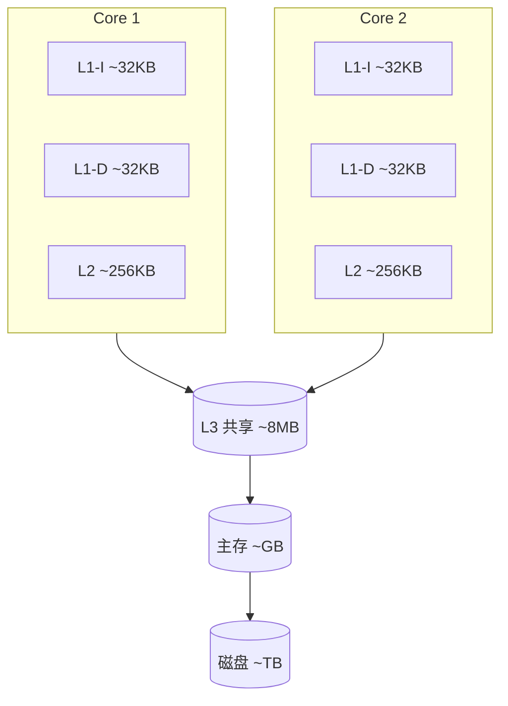
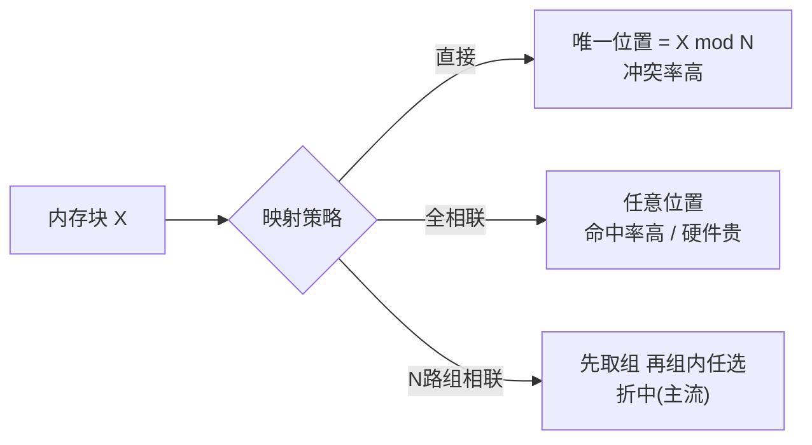

# 04.系统CPU缓存设计思想
#### 目录介绍
- [01.工作案例引入](#01工作案例引入)
  - [1.1 两行代码差10倍](#11-两行代码差10倍)
  - [1.2 怪题的提问](#12-怪题的提问)
- [02.理解CPU高速缓存](#02理解cpu高速缓存)
  - [2.1 理解存储器结构](#21-理解存储器结构)
  - [2.2 为何要CPU高速缓存](#22-为何要cpu高速缓存)
  - [2.3 CPU三级缓存结构](#23-cpu三级缓存结构)
  - [2.4 缓存为何有作用](#24-缓存为何有作用)
- [03.CPU缓存设计思想](#03cpu缓存设计思想)
  - [3.1 CPU三级缓存](#31-cpu三级缓存)
  - [3.2 数据加载的流程](#32-数据加载的流程)
  - [3.3 L1缓存设计思想](#33-l1缓存设计思想)
  - [3.4 L2缓存设计思想](#34-l2缓存设计思想)
  - [3.5 L3缓存设计思想](#35-l3缓存设计思想)
- [04.CPU中Cache单位](#04cpu中cache单位)
  - [4.1 CPU缓存行设计](#41-cpu缓存行设计)
  - [4.2 CPU容量单位](#42-cpu容量单位)
  - [4.3 通用缓存设计思路](#43-通用缓存设计思路)
  - [4.4 缓存行为何64字节](#44-缓存行为何64字节)
- [05.内存Cache地址映射](#05内存cache地址映射)
  - [5.1 如何查找缓存位置](#51-如何查找缓存位置)
  - [5.2 CPU映射方案](#52-cpu映射方案)
  - [5.3 直接映射](#53-直接映射)
  - [5.4 全相联映射](#54-全相联映射)
  - [5.5 组相联映射](#55-组相联映射)
  - [5.6 为何选组相联](#56-为何选组相联)
- [06.Cache块替换策略](#06cache块替换策略)
  - [6.1 缓存替换策略背景](#61-缓存替换策略背景)
  - [6.2 常见替换策略](#62-常见替换策略)
  - [6.3 随机法](#63-随机法)
  - [6.4 FIFO法](#64-fifo法)
  - [6.5 LRU最近最少法](#65-lru最近最少法)
  - [6.6 LRU是最佳策略吗](#66-lru是最佳策略吗)
- [07.缓存设计编程实践](#07缓存设计编程实践)
  - [7.1 缓存命中率性能](#71-缓存命中率性能)
  - [7.2 数组遍历优化](#72-数组遍历优化)
  - [7.3 缓存友好数据结构](#73-缓存友好数据结构)
  - [7.4 工程缓存设计启示](#74-工程缓存设计启示)
- [08.综合案例矩阵乘法](#08综合案例矩阵乘法)
  - [8.1 案例背景](#81-案例背景)
  - [8.2 基线朴素ijk](#82-基线朴素ijk)
  - [8.3 优化循环交换ikj](#83-优化循环交换ikj)
  - [8.4 优化分块Tiling](#84-优化分块tiling)
  - [8.5 优化SIMD预取](#85-优化simd预取)
  - [8.6 看懂缓存命中率](#86-看懂缓存命中率)
- [09.思考题与作业](#09思考题与作业)
  - [9.1 基础思考题](#91-基础思考题)
  - [9.2 进阶思考题](#92-进阶思考题)
  - [9.3 动手作业](#93-动手作业)


## 01.工作案例引入

### 1.1 两行代码差10倍

**场景**：小吴是一名 C++ 后端工程师，负责做图像处理流水线里的一个"灰度化"模块。输入是一张 10000×10000 的图片，需要把每个像素从 RGB 转成灰度。代码再简单不过：

```cpp
for (int i = 0; i < N; i++) {
    for (int j = 0; j < N; j++) {
        gray[i][j] = (r[i][j] + g[i][j] + b[i][j]) / 3;
    }
}
```

开发机上跑一次 0.8 秒，没问题。小吴提交代码，测试同事反馈：在测试环境耗时 **12 秒**。同样的硬件、同样的输入。

唯一的差别是：测试同事的 benchmark 代码写成了：

```cpp
// 注意循环交换了一下
for (int j = 0; j < N; j++) {
    for (int i = 0; i < N; i++) {      // <── 就这一行换了顺序
        gray[i][j] = (r[i][j] + g[i][j] + b[i][j]) / 3;
    }
}
```

**两份代码结果完全相同，但性能差 15 倍**。小吴 CPU-Z 看主频没降，`htop` 看 CPU 占用拉满，磁盘 I/O 没飙。那为啥差这么多？

### 1.2 怪题的提问

这种"代码逻辑相同但性能天差地别"的现象，99% 源自一个被多数业务开发忽视的层次：**CPU Cache**。

- "CPU 这么快，内存才 100ns，换个循环顺序能差多少？" → 其实 CPU 和内存差 100 倍，能不能"命中"缓存直接决定性能量级
- "为什么按列访问就慢？" → 因为 C++ 的二维数组按**行连续存储**，按列跳着访问，**每次都踩到新的缓存行**
- "那 L1 这么小怎么加速这么大的数组？" → 靠**缓存行（Cache Line）一次加载 64 字节**，利用空间局部性
- "为什么主流 CPU 用 8 路组相联而不是全相联？" → 因为比较器数量和命中率之间要平衡
- "LRU 替换一定最优吗？" → 不是，当工作集刚好大过缓存，LRU 命中率可以掉到 0%

本章就是带你拆开 L1/L2/L3 这三层缓存：结构怎么设计、数据怎么映射、块怎么替换、代码怎么写才能让缓存真正帮你提速。最后，我们会在第 8 节把小吴这个矩阵乘法用本章所有技术**从 12 秒优化到 0.8 秒**，你会看到每一次优化背后都对应本章的一个知识点。


## 02.理解CPU高速缓存
### 2.1 理解存储器结构

现代计算机系统为了寻求容量、速度和价格最大的性价比会采用分层架构，从 "CPU 寄存器 - CPU 高速缓存 - 内存 - 硬盘"自上而下容量逐渐增大，速度逐渐减慢，单位价格也逐渐降低。

- 1、CPU 寄存器： 存储 CPU 正在使用的数据或指令；
- 2、CPU 高速缓存： 存储 CPU 近期要用到的数据和指令；
- 3、内存： 存储正在运行或者将要运行的程序和数据；
- 4、硬盘： 存储暂时不使用或者不能直接使用的程序和数据。

### 2.2 为何要CPU高速缓存

**1.弥补 CPU 和内存的速度差（主要）：**

由于 CPU 和内存的速度差距太大，为了拉平两者的速度差，现代计算机会在两者之间插入一块速度比内存更快的高速缓存。

只要将近期 CPU 要用的信息调入缓存，CPU 便可以直接从缓存中获取信息，从而提高访问速度；

**2.减少 CPU 与 I/O 设备争抢访存：**

由于 CPU 和 I/O 设备会竞争同一条内存总线，有可能出现 CPU 等待 I/O 设备访存的情况。而如果 CPU 能直接从缓存中获取数据，就可以减少竞争，提高 CPU 的效率。

### 2.3 CPU三级缓存结构

**CPU缓存结构演变的过程**

在 CPU Cache 的概念刚出现时，CPU 和内存之间只有一个缓存，随着芯片集成密度的提高，现代的 CPU Cache 已经普遍采用 L1/L2/L3 多级缓存的结构来改善性能。

自顶向下容量逐渐增大，访问速度也逐渐降低。当缓存未命中时，缓存系统会向更底层的层次搜索。

**CPU三级缓存结构**

1. L1 Cache： 在 CPU 核心内部，分为指令缓存和数据缓存，分开存放 CPU 使用的指令和数据；
2. L2 Cache： 在 CPU 核心内部，尺寸比 L1 更大；
3. L3 Cache： 在 CPU 核心外部，所有 CPU 核心共享同一个 L3 缓存。



### 2.4 缓存为何有作用

**疑惑**：缓存的容量远小于内存（L1只有64KB，内存可能有16GB），为什么这么小的缓存就能显著提升性能？

**答疑**：因为**局部性原理（Principle of Locality）**——程序访问数据的模式不是随机的，而是有规律的。

**时间局部性（Temporal Locality）**：最近被访问过的数据，很快还会被再次访问。

```c
// 循环中的变量sum被反复访问——时间局部性
int sum = 0;
for (int i = 0; i < 1000000; i++) {
    sum += arr[i];  // sum在每次迭代中都被访问
}
```

**空间局部性（Spatial Locality）**：被访问数据的附近数据，很快也会被访问。

```c
// 数组顺序访问——空间局部性
for (int i = 0; i < N; i++) {
    process(arr[i]);  // arr[i]被访问后，arr[i+1]很快也会被访问
}
```

**论证**：用实际数据说明缓存的威力

典型程序的缓存命中率：
- L1 Cache命中率：约 95%
- L2 Cache命中率：约 80%（L1未命中时）
- L3 Cache命中率：约 90%（L2未命中时）

假设L1访问1ns，L2访问4ns，L3访问12ns，内存100ns：

```
平均访问时间 = 0.95×1 + 0.05×(0.80×4 + 0.20×(0.90×12 + 0.10×100))
            = 0.95 + 0.05×(3.2 + 0.20×(10.8 + 10))
            = 0.95 + 0.05×(3.2 + 4.16)
            = 0.95 + 0.368
            ≈ 1.32ns
```

只有1.32ns，接近L1的速度！而没有缓存的情况下每次都要100ns。缓存使内存访问速度提升了约**75倍**。

## 03.CPU缓存设计思想

### 3.1 CPU三级缓存

**CPU三级缓存**

1. 三级缓存：CPU 缓存是一个三级结构，其中 L0、L1、L2 是每个处理核心独立的，而 L3 是一颗 CPU 的多个处理器共用的； 
2. 背景：CPU 处理器的运算速度与内存存取速度、磁盘 I/O 速度不匹配（相差了几个数量级）; 
3. 目的：提高 CPU 吞吐量； 
4. 方案：增加一个缓存层来协调两者的速度差，即：在 CPU 和内存中间增加一层 「高速缓存」，缓存的存取速度尽可能接近。

**为何要设计CPU三级缓存**

由于 CPU 和内存的速度差距太大，为了拉平两者的速度差，现代计算机会在两者之间插入一块速度比内存更快的高速缓存，CPU 缓存是分级的，有 L1 / L2 / L3 三级缓存。

由于单核 CPU 的性能遇到瓶颈（主频与功耗的矛盾），芯片厂商开始在 CPU 芯片里集成多个 CPU 核心，每个核心有各自的 L1 / L2 缓存。 其中 L1 / L2 缓存是核心独占的，而 L3 缓存是多核心共享的。

**这里罗列Glide加载图片三级缓存的案例，其实设计思路和理念都差不多，都是为了提高性能**

1. 背景：在移动应用中，加载网络图片可能会面临网络延迟和带宽限制等问题，为了提高用户体验，需要对图片进行缓存，以便在需要时能够快速加载。
2. 目的：Glide的三级缓存旨在实现快速加载图片、减少网络请求和节省带宽。它通过在本地存储和内存中缓存图片，以及利用网络缓存，实现了高效的图片加载和展示。
3. 方案设计
    - 第一级缓存是内存缓存，Glide会将最近使用的图片缓存在内存中，以便快速读取和展示。这样可以避免频繁的网络请求和磁盘读写操作。
    - 第二级缓存是磁盘缓存，Glide会将图片缓存在设备的磁盘上，以便在应用关闭后仍然可以快速加载已缓存的图片。这样可以减少对网络的依赖，提高离线浏览的能力。
    - 第三级缓存是网络缓存，Glide会利用HTTP协议中的缓存机制，如HTTP缓存头信息（例如ETag和Last-Modified），来判断图片是否已经被修改，从而决定是否从网络加载最新的图片。

通过这三级缓存的组合，Glide能够在图片加载过程中高效地利用本地缓存和网络缓存，提供快速、流畅的图片加载体验，并减少对网络资源的消耗。

### 3.2 数据加载的流程

数据加载的流程如下：

- 1、将程序和数据从磁盘加载到内存中；
- 2、将程序和数据从内存加载到缓存中（三级缓存，数据加载顺序：L3->L2->L1）；
- 3、CPU将缓存中的数据加载到寄存器中（L0），并进行运算；
- 4、CPU将数据同步回缓存，并在一定的时间周期之后同步回内存。 

CPU 往往需要重复读取同一个数据块，而缓存容量的增大，可以大幅度提升 CPU 内部读取数据的命中率，以此提升 CPU 吞吐量。


### 3.3 L1缓存设计思想

为什么 L1 要将指令缓存和数据缓存分开？ 这个策略叫分离缓存，与之相对应的叫统一缓存：

1. 分离缓存： 指令和数据分别存放在不同缓存中。指令缓存（Instruction Cache，I-Cache） ，数据缓存（Data Cache，D-Cache）
2. 统一缓存： 指令和数据统一存放在一个缓存中。

那么，为什么 L1 缓存要把指令和数据分开呢？我认为有 2 个原因：

原因 1 - 避免取指令单元和取数据单元争夺访缓存（主要）：

1. 在 CPU 内核中，取指令和取数据指令是由两个不同的单元完成的。
2. 如果使用统一缓存，当 CPU 使用超前控制或流水线控制（并行执行）的控制方式时，会存在取指令操作和取数据操作同时争用同一个缓存的情况，降低 CPU 运行效率；

原因 2 - 内存中数据和指令是相对聚簇的，分离缓存能提高命中率：

1. 在现代计算机系统中，内存中的指令和数据并不是随机分布的，而是相对聚集地分开存储的。因此，CPU Cache 中也采用分离缓存的策略更符合内存数据的现状；

### 3.4 L2缓存设计思想

为什么 L1 采用分离缓存而 L2 采用统一缓存？

原因 1： L1 采用分离缓存后已经解决了取指令单元和取数据单元的争夺访缓存问题，所以 L2 是否使用分离缓存没有影响；

原因 2： 当缓存容量较大时，分离缓存无法动态调节分离比例，不能最大化发挥缓存容量的利用率。例如数据缓存满了，但是指令缓存还有空闲，而 L2 使用统一缓存则能够保证最大化利用缓存空间。

### 3.5 L3缓存设计思想

L3 缓存是多核心共享的，放在芯片外有区别吗？

集成在芯片内部的缓存称为片内缓存，集成在芯片外部（主板）的缓存称为片外缓存。

最初，由于受到芯片集成工艺的限制，片内缓存不可能很大，因此 L2 / L3 缓存都是设计在主板上，而不是在芯片内的。

后来，L2 / L3 才逐渐集成到 CPU 芯片内部后的。片内缓冲和片外缓存是有区别的，主要体现在 2 个方面：

1. 区别 1 - 片内缓存物理距离更短： 片内缓存与取指令单元和取数据单元的物理距离更短，速度更快；
2. 区别 2 - 片内缓存不占用系统总线： 片内缓存使用独立的 CPU 片内总线，可以减轻系统总线的负担。

L3缓存的设计思想是通过提供扩展容量、共享与互斥、权衡访问速度与延迟、高效替换策略和高速写入等手段，以提高CPU对数据的访问效率和性能，并满足多核心共享缓存的需求。

## 04.CPU中Cache单位

### 4.1 CPU缓存行设计

CPU Cache 在读取内存数据时，每次不会只读一个字或一个字节，而是一块块地读取，这每一小块数据也叫 CPU 缓存行（CPU Cache Line）。

这也是对局部性原理的应用，当一个指令或数据被访问过之后，与它相邻地址的数据有很大概率也会被访问，将更多可能被访问的数据存入缓存，可以提高缓存命中率。

当然，块长也不是越大越好（一般是取 4 到 8 个字长，如 64 字节）：

1. 前期：当块长由小到大增长时，随着局部性原理的影响使得命中率逐渐提高；
2. 后期：但随着块长继续增大，导致缓存中承载的块个数减少，很可能内存块刚刚装入缓存就被新的内存块覆盖，命中率反而下降。而且，块长越长，追加的部分距离被访问的字越远，近期被访问的可能性也更低，无济于事。

### 4.2 CPU容量单位

几种容量单位：

1. 字节（Byte）： 字节是计算机数据存储的基本单位，即使存储 1 个位也需要按 1 个字节存储；
2. 字（Word）： 字长是 CPU 在单位时间内能够同时处理的二进制数据位数。多少位 CPU 就是指 CPU 的字长是多少位（比如 64 位 CPU 的字长就是 64 位）；
3. 块（Block）： 块是 CPU Cache 管理数据的基本单位，也叫 CPU 缓存行；
4. 段（Segmentation）/ 页（Page）： 段 / 页是操作系统管理虚拟内存的基本单位。

### 4.3 通用缓存设计思路

事实上，CPU 在访问内存数据的时候，与计算机中对于 "缓存设计" 的一般性规律是相同的：

1. 对于基于 Cache 的系统，对数据的读取和写入总会先访问 Cache，检查要访问的数据是否在 Cache 中。
2. 如果命中则直接使用 Cache 上的数据，否则先将底层的数据源加载到 Cache 中，再从 Cache 读取数据。

通用缓存设计思路是什么


### 4.4 缓存行为何64字节

**疑惑**：为什么主流CPU的缓存行（Cache Line）大小都是64字节？为什么不是16字节或256字节？

**答疑**：缓存行大小是在多个因素之间取得平衡的结果：

**缓存行太小（如16字节）**：
- 空间局部性利用不充分，命中率低
- 标签（Tag）开销占比高（每16字节就需要一个Tag）
- 内存总线传输效率低（每次传输的有效数据少）

**缓存行太大（如256字节）**：
- 缓存能容纳的行数变少，时间局部性利用不充分
- 加载不需要的数据，浪费带宽（"缓存污染"）
- 伪共享问题更严重（更多变量可能落在同一行）

**64字节恰好平衡**：
- 内存总线通常64位（8字节）宽，64字节=8次突发传输（Burst Transfer）
- DDR内存的突发长度（Burst Length）恰好是8，一次突发传输正好填满一个缓存行
- 大多数常用数据结构的大小在64字节以内

```
DDR内存突发传输（BL=8）：
│─── 8B ───│─── 8B ───│─── 8B ───│ ... │─── 8B ───│
│  传输1   │  传输2   │  传输3   │     │  传输8   │
└─────────────────────────────────────────────────┘
                    = 64字节 = 一个缓存行
```

## 05.内存Cache地址映射

### 5.1 如何查找缓存位置

CPU 怎么知道要访问的内存数据是否在 CPU Cache 中，在 CPU 中的哪个位置，以及是不是有效的呢？

这就是下面要讲的内存地址与 Cache 地址的映射问题。

无论对 Cache 数据检查、读取还是写入，CPU 都需要知道访问的内存数据对应于 Cache 上的哪个位置，这就是内存地址与 Cache 地址的映射问题。

事实上，因为内存块和缓存块的大小是相同的，所以在映射的过程中，我们只需要考虑 "内存块索引 - 缓存块索引" 之间的映射关系，而具体访问的是块内的哪一个字，则使用相同的偏移在块中寻找。

### 5.2 CPU映射方案

目前，主要有 3 种映射方案：

1. 直接映射（Direct Mapped Cache）： 固定的映射关系；
2. 全相联映射（Fully Associative Cache）： 灵活的映射关系； 
3. 组相联映射（N-way Set Associative Cache）： 前两种方案的折中方法。

CPU映射方案如下所示




### 5.3 直接映射

直接映射是三种方式中最简单的映射方式，直接映射的策略是： 在内存块和缓存块之间建立起固定的映射关系，一个内存块总是映射到同一个缓存块上。

1、将内存块索引对 Cache 块个数取模，得到固定的映射位置。例如 13 号内存块映射的位置就是 13 % 8 = 5，对应 5 号 Cache 块；

2、由于取模后多个内存块会映射到同一个缓存块上，产生块冲突，所以需要在 Cache 块上增加一个 组标记（TAG），标记当前缓存块存储的是哪一个内存块的数据。其实，组标记就是内存块索引的高位，而 Cache 块索引就是内存块索引的低 4 位（8 个字块需要 4 位）；

3、由于初始状态 Cache 块中的数据是空的，也是无效的。为了标识 Cache 块中的数据是否已经从内存中读取，需要在 Cache 块上增加一个 有效位（Valid bit） 。如果有效位为 0，则 CPU 可以直接读取 Cache 块上的内容，否则需要先从内存读取内存块填入 Cache 块，再将有效位改为 1。

直接映射


### 5.4 全相联映射

理解了直接映射的方式后，我们发现直接映射存在 2 个问题：

问题 1 - 缓存利用不充分： 每个内存块只能映射到固定的位置上，即使 Cache 上有空闲位置也不会使用；

问题 2 - 块冲突率高： 直接映射会频繁出现块冲突，影响缓存命中率。

基于直接映射的缺点，全相联映射的策略是：

允许内存块映射到任何一个 Cache 块上。 这种方式能够充分利用 Cache 的空间，块冲突率也更低，但是所需要的电路结构物更复杂，成本更高。

具体方式：

1. 当 Cache 块上有空闲位置时，使用空闲位置；
2. 当 Cache 被占满时则替换出一个旧的块腾出空闲位置；
3. 由于一个 Cache 块会映射所有内存块，因此组标记 TAG 需要扩大到与主内存块索引相同的位数，而且映射的过程需要沿着 Cache 从头到尾匹配 Cache 块的 TAG 标记。

### 5.5 组相联映射

组相联映射是直接映射和全相联映射的折中方案，组相联映射的策略是：

将 Cache 分为多组，每个内存块固定映射到一个分组中，又允许映射到组内的任意 Cache 块。显然，组相联的分组为 1 时就等于全相联映射，而分组等于 Cache 块个数时就等于直接映射。

### 5.6 为何选组相联

三种映射方式的对比：

| 映射方式 | 命中率 | 硬件复杂度 | 查找速度 | 应用 |
|----------|--------|-----------|---------|------|
| 直接映射 | 低 | 简单 | 最快 | L1 TLB |
| 全相联映射 | 最高 | 最复杂 | 最慢 | 小容量场景 |
| N路组相联 | 较高 | 适中 | 较快 | L1/L2/L3 Cache |

**为什么不用全相联？**

全相联映射需要同时比较所有Cache块的Tag，假设Cache有1024块，就需要1024个比较器并行工作。硬件成本极高，而且比较器的延迟也会增加。

**为什么不用直接映射？**

直接映射冲突率太高。假设两个频繁访问的变量恰好映射到同一个Cache块，就会发生"乒乓效应"——两个变量反复驱逐对方，导致命中率极低。

**组相联的平衡**：

典型的8路组相联：Cache被分为多组，每组8个Cache块。一个内存块固定映射到某一组（通过地址取模），但可以放在组内任意8个位置。查找时只需要8个比较器，兼顾了命中率和硬件成本。

```
8路组相联示例：
内存块 X 的映射位置 = X mod 组数

组0: │ 块 │ 块 │ 块 │ 块 │ 块 │ 块 │ 块 │ 块 │ ← 8个位置
组1: │ 块 │ 块 │ 块 │ 块 │ 块 │ 块 │ 块 │ 块 │
组2: │ 块 │ 块 │ 块 │ 块 │ 块 │ 块 │ 块 │ 块 │
...

内存块映射到固定的组，但可以放在组内任意位置
查找只需比较8个Tag，而非所有Cache块
```

## 06.Cache块替换策略

### 6.1 缓存替换策略背景

缓存替换策略是在计算机系统中用于管理缓存的一种策略。

缓存是一种用于存储临时数据的高速存储器，其目的是提高数据访问速度和系统性能。当缓存已满并且需要为新数据腾出空间时，缓存替换策略决定哪些数据应该被替换掉。缓存替换策略的选择是为了优化缓存的性能和效率。

### 6.2 常见替换策略

常见的缓存替换策略包括最近最少使用（LRU）、最不经常使用（LFU）、先进先出（FIFO）等。每种策略都有其优点和局限性，适用于不同的应用场景和需求。

### 6.3 随机法

随机法： 使用一个随机数生成器随机地选择要被替换的 Cache 块，实现简单，缺点是没有利用 "局部性原理"，无法提高缓存命中率；

### 6.4 FIFO法

FIFO 先进先出法： 记录各个 Cache 块的加载事件，最早调入的块最先被替换，缺点同样是没有利用 "局部性原理"，无法提高缓存命中率；

### 6.5 LRU最近最少法

LRU 最近最少使用法： 记录各个 Cache 块的使用情况，最近最少使用的块最先被替换。这种方法相对比较复杂，也有类似的简化方法，即记录各个块最近一次使用时间，最久未访问的最先被替换。与前 2 种策略相比，LRU 策略利用了 "局部性原理"，平均缓存命中率更高。

### 6.6 LRU是最佳策略吗

**疑惑**：LRU看起来很合理，但它一定是最好的替换策略吗？有没有LRU表现不好的场景？

**答疑**：LRU在大多数场景表现优秀，但存在**缓存污染**问题。

考虑这个场景：你有4个Cache块（A、B、C、D），程序按照 A→B→C→D→E→A→B→C→D→E 的顺序循环访问5个数据块。

```
LRU替换过程（4个Cache块，5个数据循环访问）：

时间:  1  2  3  4  5  6  7  8  9  10
访问:  A  B  C  D  E  A  B  C  D  E
Cache: A  AB ABC ABCD BCDE CDEA DEAB EABC ABCD BCDE
命中:  ×  ×  ×   ×   ×   ×   ×   ×    ×    ×
命中率: 0% ！！
```

每次访问都未命中！因为循环的长度（5）刚好大于缓存容量（4），LRU总是把即将要用的数据换出去。

**改进方案**：
- **LRU-K**：记录最近K次访问时间，而非仅看最后一次
- **2Q（Two Queue）**：新数据先进入FIFO队列，被再次访问后才进入LRU队列
- **ARC（Adaptive Replacement Cache）**：自适应地在LRU和LFU之间调整

实际CPU中使用的是**伪LRU（Pseudo-LRU）**算法，用一棵二叉树的指针来近似追踪最近最少使用的块，硬件实现比精确LRU简单得多。


## 07.缓存设计编程实践

### 7.1 缓存命中率性能

缓存命中率对程序性能的影响远超大多数程序员的想象。下面通过实验数据说明：

```c
// 实验：二维数组遍历，行优先 vs 列优先

#define N 10000

int matrix[N][N];

// 方式A：行优先遍历（缓存友好）
for (int i = 0; i < N; i++)
    for (int j = 0; j < N; j++)
        sum += matrix[i][j];

// 方式B：列优先遍历（缓存不友好）
for (int j = 0; j < N; j++)
    for (int i = 0; i < N; i++)
        sum += matrix[i][j];
```

两种方式的性能差异：

| 遍历方式 | Cache未命中率 | 执行时间 |
|----------|-------------|---------|
| 行优先 | ~1.5% | ~50ms |
| 列优先 | ~15% | ~200ms |

行优先快了**4倍**！因为C/C++/Java中二维数组按行存储，行优先遍历是连续访问内存（空间局部性好），缓存行可以被充分利用；列优先遍历则跳跃式访问，每个缓存行只用了其中一个元素就被替换。

### 7.2 数组遍历优化

**矩阵乘法优化**是经典的缓存优化案例：

```c
// 朴素矩阵乘法 - 缓存不友好
for (int i = 0; i < N; i++)
    for (int j = 0; j < N; j++)
        for (int k = 0; k < N; k++)
            C[i][j] += A[i][k] * B[k][j];  // B[k][j]是列访问，缓存不友好

// 优化：循环交换（ikj顺序）- 缓存友好
for (int i = 0; i < N; i++)
    for (int k = 0; k < N; k++)
        for (int j = 0; j < N; j++)
            C[i][j] += A[i][k] * B[k][j];  // B[k][j]变成行访问

// 更进一步：分块（Blocking/Tiling）
for (int ii = 0; ii < N; ii += BLOCK)
    for (int jj = 0; jj < N; jj += BLOCK)
        for (int kk = 0; kk < N; kk += BLOCK)
            // 在小块内计算，数据留在缓存中
            for (int i = ii; i < ii+BLOCK; i++)
                for (int k = kk; k < kk+BLOCK; k++)
                    for (int j = jj; j < jj+BLOCK; j++)
                        C[i][j] += A[i][k] * B[k][j];
```

分块优化的核心思想：将大矩阵切分为缓存能放下的小块，在小块内完成计算。这样数据在缓存中停留更久，减少缓存未命中次数。

### 7.3 缓存友好数据结构

不同数据结构的缓存友好性差异很大：

| 数据结构 | 内存布局 | 缓存友好性 | 适用场景 |
|----------|---------|-----------|---------|
| 数组（Array） | 连续 | 极好 | 顺序访问、随机访问 |
| 链表（Linked List） | 分散 | 差 | 频繁插入删除 |
| 哈希表（Hash Map） | 较分散 | 一般 | 键值查找 |
| B+树 | 节点内连续 | 较好 | 数据库索引 |

**为什么数据库选择B+树而非二叉搜索树？**

B+树的每个节点包含多个键值（如几百个），一个节点的大小通常等于一个磁盘页（4KB）或缓存行的倍数。查找时，在节点内的搜索是对连续内存的顺序访问，缓存命中率远高于在堆中分散存储的二叉树节点。

### 7.4 工程缓存设计启示

CPU缓存的设计思想可以推广到软件工程中：

| CPU缓存概念 | 软件工程中的对应 |
|-------------|-----------------|
| L1/L2/L3多级缓存 | 本地缓存 → Redis → MySQL |
| 缓存行（预取） | 数据库的批量查询 |
| 缓存替换策略（LRU） | Redis的内存淘汰策略 |
| 缓存一致性（MESI） | 分布式缓存一致性（Cache Aside模式） |
| 写回策略 | 写入缓冲/异步刷盘 |
| 局部性原理 | 热点数据缓存 |

**结论**：理解CPU缓存的设计原理，不仅有助于编写高性能代码，更能培养一种"缓存思维"——在任何存在速度差距的系统中，都可以通过引入中间缓存层来提升性能。这是一种通用的架构智慧。


## 08.综合案例矩阵乘法

把本章所有知识（缓存层次 / 缓存行 / 组相联 / 替换策略 / 局部性）串起来的最好方法，就是实战一个能看到数量级性能差距的例子。

### 8.1 案例背景

**题目**：计算两个 1024×1024 的 float 矩阵相乘 `C = A × B`。数据量：每个矩阵 4MB，三个矩阵 12MB，远超 L1（32KB）和 L2（256KB）。

硬件假设：Intel i7 级别，L1D 32KB、L2 256KB、L3 8MB、缓存行 64B。

### 8.2 基线朴素ijk

```cpp
for (int i = 0; i < N; i++)
    for (int j = 0; j < N; j++)
        for (int k = 0; k < N; k++)
            C[i][j] += A[i][k] * B[k][j];
```

访问模式分析：

| 数组 | 内层循环访问模式 | 缓存友好度 |
|------|-----------------|-----------|
| `A[i][k]` | 固定 i，k 顺序 | **好**，连续 |
| `B[k][j]` | 固定 j，k 顺序 | **差**，每行跳 4KB |
| `C[i][j]` | 固定 i,j | **好**，在寄存器 |

问题集中在 `B[k][j]`：每访问一次就跳一行（`4 × 1024 = 4KB`），每次都是新缓存行。N=1024 次内层循环，**1024 次 cache miss**。

```mermaid
flowchart LR
    subgraph A矩阵[A矩阵(按行连续)]
      A1[A行 i]:::good
    end
    subgraph B矩阵[B矩阵]
      B1[B 0,j]:::bad
      B2[B 1,j]:::bad
      B3[B 2,j]:::bad
      B1 -->|跳4KB| B2 -->|跳4KB| B3
    end
    classDef good fill:#bfb
    classDef bad fill:#fbb
```

**实测：12 秒**。

### 8.3 优化循环交换ikj

```cpp
for (int i = 0; i < N; i++)
    for (int k = 0; k < N; k++)       // ← 把 k 提到 j 外面
        for (int j = 0; j < N; j++)
            C[i][j] += A[i][k] * B[k][j];
```

重新分析访问模式：

| 数组 | 内层循环（j）访问模式 | 缓存友好度 |
|------|--------------------|-----------|
| `A[i][k]` | 完全固定（不变） | **极好**，寄存器级 |
| `B[k][j]` | 固定 k，j 顺序 | **好**，连续 |
| `C[i][j]` | 固定 i，j 顺序 | **好**，连续 |

**实测：3 秒**。提升 4 倍。**没改算法，没减一条指令**，只是让数据访问连续起来。

### 8.4 优化分块Tiling

即使 ikj，N=1024 时 `B` 矩阵一行就有 4KB，三个矩阵活动集合约 12KB，但跨 `i` 循环后 `B` 的前面行已经被挤出 L1。解决办法：**分块**。

```cpp
const int BS = 64;  // block size，64×64 float = 16KB，恰好放进 L1
for (int ii = 0; ii < N; ii += BS)
    for (int kk = 0; kk < N; kk += BS)
        for (int jj = 0; jj < N; jj += BS)
            for (int i = ii; i < ii+BS; i++)
                for (int k = kk; k < kk+BS; k++)
                    for (int j = jj; j < jj+BS; j++)
                        C[i][j] += A[i][k] * B[k][j];
```

核心思想：把大矩阵切成"能放进 L1 的小块"，在小块里把乘加做完，让每个块被读入 Cache 后，该干的活全干完再换下一块。

**实测：1.4 秒**。在 ikj 基础上再提升 2 倍。

### 8.5 优化SIMD预取

分块后再叠加两项硬件级优化：

- **SIMD 向量化**：用 AVX-256 一次处理 8 个 float，编译器自动向量化或手写 `_mm256_fmadd_ps`
- **硬件预取提示**：`__builtin_prefetch(&B[k+8][j])` 告诉 CPU 提前加载后续缓存行

```cpp
for (int j = jj; j < jj+BS; j += 8) {
    __m256 vc = _mm256_load_ps(&C[i][j]);
    __m256 va = _mm256_set1_ps(A[i][k]);
    __m256 vb = _mm256_load_ps(&B[k][j]);
    vc = _mm256_fmadd_ps(va, vb, vc);
    _mm256_store_ps(&C[i][j], vc);
    __builtin_prefetch(&B[k+8][j]);   // 预取下一条缓存行
}
```

**实测：0.8 秒**。从 12 秒到 0.8 秒，**15 倍加速**。

### 8.6 看懂缓存命中率

| 版本 | 代码变化 | L1 命中率 | 耗时 | 用到的本章知识 |
|------|---------|----------|------|--------------|
| 基线 ijk | 列访问 B | ~40% | 12.0s | 1.4 空间局部性 |
| ikj | 循环交换 | ~85% | 3.0s | 6.1 遍历顺序 |
| Tiling | 64×64 分块 | ~97% | 1.4s | 6.2 分块优化 |
| +SIMD/Prefetch | 向量化+预取 | ~99% | 0.8s | 3.4 缓存行+预取 |

把这个案例放回到小吴开头的"图像灰度化"问题——测试同事那份 `for j / for i` 的代码，本质就是基线 ijk；而小吴的开发机版本碰巧走在行优先方向上，是 ikj 级的缓存友好。

**一句话总结**：算法复杂度决定了性能的"上限"，缓存访问模式决定了你能距离上限多近。在现代硬件上，两者的影响经常是同一量级的。


## 09.思考题与作业

### 9.1 基础思考题

1. **存储层次速度金字塔**：请从寄存器到磁盘，写出每一层的大致延迟（ns/μs/ms 单位）。相邻两层的速度差大约是多少倍？

2. **为什么缓存行是 64 字节？** 从 DDR 突发传输、Tag 开销、伪共享三个角度分别说明"太大太小"的权衡。

3. **三种映射方式对号入座**：直接映射、全相联、组相联各适合什么场景？为什么 TLB 常用全相联，而 L1/L2 用组相联？

4. **空间局部性和时间局部性**：请分别在下面这段代码中圈出哪里利用了时间局部性、哪里利用了空间局部性：

   ```c
   for (int i = 0; i < N; i++) {
       int sum = 0;
       for (int j = 0; j < M; j++) {
           sum += arr[i][j];
       }
       result[i] = sum;
   }
   ```

5. **LRU 的反例**：在什么样的访问模式下，LRU 的命中率会降到 0%？现实中的数据库和 JVM 是怎么解决这个问题的？

### 9.2 进阶思考题

1. **0.1 节怪事的完整解释**：回到小吴开头的案例，请用本章 1.4、3.1、6.1 三个知识点，写一段技术解释，回答"为什么两行代码差 15 倍"。

2. **为什么 L1 分 I-Cache 和 D-Cache，L2 不分？** 从流水线并行、分离缓存的动态平衡角度分析。

3. **Write-Through vs Write-Back**：现代 CPU 的 L1 大多用 write-back，但一些嵌入式 MCU 还在用 write-through。这种选择差异背后的权衡是什么？

4. **多核共享 L3 的利弊**：L3 被多核心共享，相比"每核独立 L3"的设计，各自的优势和代价是什么？

5. **伪共享与缓存行对齐**：如果两个线程分别写 `struct { long a; long b; }` 的 `a` 和 `b`，按本章知识分析为什么会慢？怎么改？

### 9.3 动手作业

**作业一（必做）**：复现 7.2~7.5 的优化过程。

- 写一个 1024×1024 矩阵乘法的基线版本，用 `perf stat` 测 L1/L2/L3 miss 率
- 逐步应用循环交换、分块、SIMD 三项优化
- 每一步都记录耗时和 miss 率，画出对比曲线
- 找出你机器上"分块大小"的最优值，并解释为什么这个值最优（提示：跟 L1 大小相关）

**作业二（选做）**：测你电脑的缓存层次边界。

写一个测试程序，对不同大小的数组做随机访问（步长 64B 跳着走），画出"数组大小 vs 平均访问时间"的曲线。你会看到在 L1、L2、L3 边界附近有三个明显的阶跃：

```
访问时间 (ns)
   100│                        ┌──────── 内存
      │                   ┌────┘
    20│           ┌───────┘ L3
      │      ┌────┘
     4│──────┘ L2
       └──── L1
       32K  256K   8M    数组大小
```

**作业三（拓展）**：把"缓存思维"用到你熟悉的业务里。

选一个你平时写的业务场景（比如用户画像查询、订单列表加载），分析它有没有"缓存友好"的优化空间：

- 数据结构：是不是用了链表/Map 导致内存分散？能不能换成数组？
- 访问模式：批处理时有没有"按列访问"的反模式？
- 缓存策略：Redis 的 LRU 是不是最适合你的业务？要不要换成 LFU/ARC？

把你的分析和改造方案写成一篇小结——你会发现 CPU Cache 里的设计哲学，在业务缓存层同样适用。


