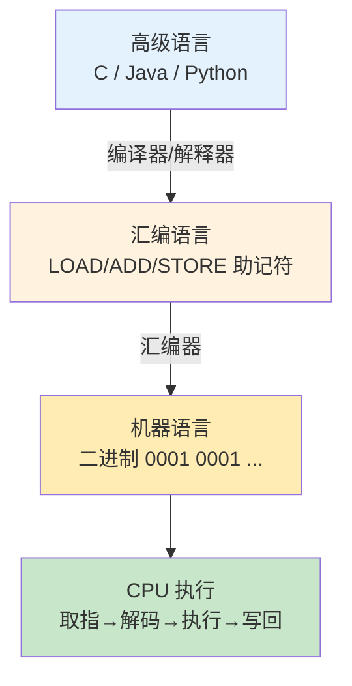
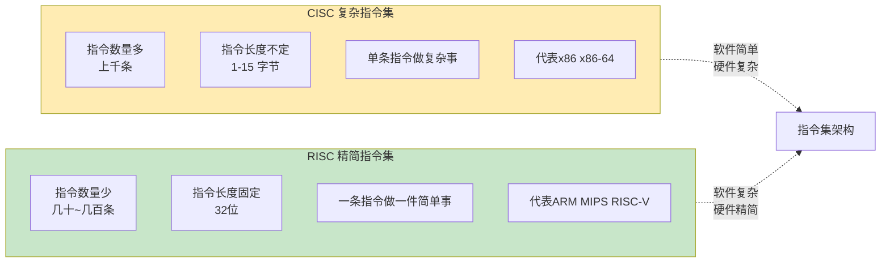

# 07.计算机指令编程原理
#### 目录介绍
- [01.工作案例引入](#01工作案例引入)
  - [1.1 跨架构结果差异](#11-跨架构结果差异)
  - [1.2 排查与结论](#12-排查与结论)
  - [1.3 本文要回答的问题](#13-本文要回答的问题)
- [02.指令的基本概念](#02指令的基本概念)
  - [2.1 什么是机器指令](#21-什么是机器指令)
  - [2.2 指令的格式](#22-指令的格式)
  - [2.3 从代码到指令](#23-从代码到指令)
- [03.指令的组成](#03指令的组成)
  - [3.1 操作码](#31-操作码)
  - [3.2 地址码](#32-地址码)
  - [3.3 指令字长](#33-指令字长)
  - [3.4 指令格式举例](#34-指令格式举例)
- [04.寻址方式](#04寻址方式)
  - [4.1 什么是寻址](#41-什么是寻址)
  - [4.2 立即寻址](#42-立即寻址)
  - [4.3 直接寻址](#43-直接寻址)
  - [4.4 间接寻址](#44-间接寻址)
  - [4.5 寄存器寻址](#45-寄存器寻址)
  - [4.6 基址变址寻址](#46-基址变址寻址)
  - [4.7 寻址方式对比](#47-寻址方式对比)
- [05.指令类型](#05指令类型)
  - [5.1 数据传送指令](#51-数据传送指令)
  - [5.2 算术运算指令](#52-算术运算指令)
  - [5.3 逻辑运算指令](#53-逻辑运算指令)
  - [5.4 控制转移指令](#54-控制转移指令)
  - [5.5 输入输出指令](#55-输入输出指令)
- [06.高级语言到机器码](#06高级语言到机器码)
  - [6.1 编译完整过程](#61-编译完整过程)
  - [6.2 预处理阶段](#62-预处理阶段)
  - [6.3 编译阶段](#63-编译阶段)
  - [6.4 汇编阶段](#64-汇编阶段)
  - [6.5 链接阶段](#65-链接阶段)
  - [6.6 完整例子演示](#66-完整例子演示)
- [07.CISC与RISC](#07cisc与risc)
  - [7.1 两种设计哲学](#71-两种设计哲学)
  - [7.2 CISC的特点](#72-cisc的特点)
  - [7.3 RISC的特点](#73-risc的特点)
  - [7.4 现代CPU的融合](#74-现代cpu的融合)
  - [7.5 RISC-V的崛起](#75-risc-v的崛起)
- [08.综合案例a加b](#08综合案例a加b)
  - [8.1 四步编译链](#81-四步编译链)
  - [8.2 x86与ARM对比](#82-x86与arm对比)
  - [8.3 指令生命周期](#83-指令生命周期)
  - [8.4 回看开头Bug](#84-回看开头bug)
- [09.思考题与作业](#09思考题与作业)
  - [9.1 基础理解题](#91-基础理解题)
  - [9.2 进阶思考题](#92-进阶思考题)
  - [9.3 动手作业](#93-动手作业)


## 01.工作案例引入

### 1.1 跨架构结果差异

小郑在公司负责一款音视频 SDK 的跨平台维护。同一份代码在 x86 服务器上测试全绿，但发到客户的 ARM 边缘盒子上，一段滤波器的输出波形却出现了诡异的"锯齿"。复现代码简化后如下：

```c
int accumulate(unsigned char *buf, int n) {
    int sum = 0;
    for (int i = 0; i < n; i++) {
        sum += (buf[i] - 128) * (buf[i] - 128);   // 差值的平方
    }
    return sum;
}
```

在 x86 上一切正常；但在 ARM 上，当 `buf[i]` 是一个很大的 `unsigned char`（比如 250）时，`buf[i] - 128` 居然**直接变成了 122 而不是预期的 int**，后续的乘法和累加也跟着错。

### 1.2 排查与结论

用 `objdump -d` 对比两份汇编，发现：

```
// x86 gcc -O2:
movzbl (%rdi,%rcx,1), %eax    ; 零扩展到 32 位寄存器
subl   $128, %eax              ; 32 位减法，结果带符号
imull  %eax, %eax              ; 32 位乘法

// ARM gcc -O2（出问题版本）:
ldrb   w2, [x0, x1]           ; 加载 8 位到 32 位寄存器
sub    w2, w2, #128            ; ???
                               ; 编译器选择了 8 位减法或截断逻辑
```

原因是 **`unsigned char` 在不同 ABI 上的默认 promotion 行为和指令集宽度选择不同**。修复方式也很朴素——显式写成 `(int)(buf[i]) - 128`，让编译器生成明确的 32 位运算。

这个 bug 最后被总结成一行话：

> "C 代码不是你真正执行的东西。你真正在 CPU 上跑的，是**编译器翻译出来的指令**。不同 CPU 的指令集不同、同一个编译器在不同目标上的选择也不同，结果就可能不一样。"

### 1.3 本文要回答的问题

- `a + b` 这样一行 C 代码，到底被翻译成了哪些机器指令？
- 指令由什么组成？寻址方式为什么有好多种？
- 为什么 x86 是"复杂指令集"，而 ARM/RISC-V 是"精简指令集"？它们的哲学差异是什么？
- 从源码到可执行文件经历了预处理、编译、汇编、链接 4 个阶段，每一步究竟在做什么？
- 为什么现代 x86 CPU 外壳是 CISC，内部却是 RISC？

我们会在文末用一个"从 `int c = a + b;` 到 CPU 执行"的完整综合案例把全章串起来。


## 02.指令的基本概念

### 2.1 什么是机器指令

机器指令（Machine Instruction）是CPU能够直接理解和执行的命令。每条指令告诉CPU做一件具体的事情：取一个数据、做一次加法、跳转到某个位置……

**疑惑：我们写的 Java/Python/C 代码，CPU能直接执行吗？**

**答疑**：不能。CPU只认识机器指令（一串0和1）。高级语言必须经过**编译或解释**，最终转换成机器指令，CPU才能执行。

```
你写的代码:           int a = 3 + 5;

编译后的汇编:         MOV  R1, #3        ; 把3放到寄存器R1
                     ADD  R1, R1, #5    ; R1 = R1 + 5
                     STR  R1, [a]       ; 把结果存到变量a

CPU看到的机器码:       1110 0011 1010 0000 0001 0000 0000 0011
(二进制)              1110 0010 1000 0001 0001 0000 0000 0101
                     ...
```

### 2.2 指令的格式

一条机器指令由两部分组成：

```
┌──────────────┬──────────────────────┐
│   操作码      │       地址码          │
│  (Opcode)    │   (Operand/Address)   │
├──────────────┼──────────────────────┤
│  做什么操作   │  对谁操作/数据在哪     │
│  加法？减法？  │  操作数的地址          │
│  跳转？存储？  │  或直接是操作数本身     │
└──────────────┴──────────────────────┘
```

### 2.3 从代码到指令



图注：人写的是高级语言，CPU 认的是二进制，"编译器 + 汇编器"是这两者之间的翻译链。理解这条链路才能看懂 Bug 为什么只在某种架构上出现。

```
高级语言（C/Java/Python）
    │
    ↓ 编译器/解释器
汇编语言（人可读的指令助记符）
    │
    ↓ 汇编器
机器语言（CPU直接执行的二进制）
    │
    ↓
CPU 取指 → 解码 → 执行

示例：
  C语言:    a = b + c;
  汇编:     LOAD  R1, [b]     ; 从内存加载b到R1
            LOAD  R2, [c]     ; 从内存加载c到R2
            ADD   R3, R1, R2  ; R3 = R1 + R2
            STORE R3, [a]     ; 将R3存回内存a
  机器码:   0001 0001 ...     (每条汇编对应一串二进制)
```


## 03.指令的组成

### 3.1 操作码

操作码（Opcode）指定了CPU要执行的操作类型。

```
常见操作类型：
  0000 → 加法 (ADD)
  0001 → 减法 (SUB)
  0010 → 逻辑与 (AND)
  0011 → 加载 (LOAD)
  0100 → 存储 (STORE)
  0101 → 跳转 (JUMP)
  0110 → 比较 (CMP)
  ...

操作码的位数决定了指令集的大小：
  4位操作码 → 最多16种操作
  8位操作码 → 最多256种操作
  
x86架构有上千条指令，所以操作码用变长编码
```

### 3.2 地址码

地址码指定了操作数的来源和结果的去向。

```
按操作数个数分类：

三地址指令：  ADD  R3, R1, R2    ; R3 = R1 + R2
             ┌──────┬────┬────┬────┐
             │ ADD  │ R3 │ R1 │ R2 │
             │操作码│目标│源1 │源2 │
             └──────┴────┴────┴────┘

二地址指令：  ADD  R1, R2         ; R1 = R1 + R2
             ┌──────┬────┬────┐
             │ ADD  │ R1 │ R2 │
             │操作码│目标│源  │
             └──────┴────┴────┘

一地址指令：  INC  R1             ; R1 = R1 + 1
             ┌──────┬────┐
             │ INC  │ R1 │
             └──────┴────┘

零地址指令：  NOP                 ; 什么也不做
             ┌──────┐
             │ NOP  │
             └──────┘
```

### 3.3 指令字长

指令字长是一条指令的总位数。

```
定长指令：所有指令长度相同
  RISC(ARM): 每条指令固定32位
  优点：取指简单，流水线高效
  缺点：某些简单指令浪费空间

变长指令：不同指令长度不同
  CISC(x86): 指令长度从1字节到15字节不等
  MOV AL, 0x61   → 2字节
  ADD EAX, [ESI+EBX*4+0x12345678] → 7字节
  优点：编码紧凑，省空间
  缺点：取指和解码复杂
```

### 3.4 指令格式举例

```
ARM指令（32位定长）：
  ┌────┬──┬──┬────┬────┬──────────────┐
  │条件│类│  │Rn  │Rd  │   操作数2     │
  │4位 │2 │  │4位 │4位 │   12位        │
  └────┴──┴──┴────┴────┴──────────────┘

  ADD R3, R1, R2 的编码：
  1110 00 0 0100 0 0001 0011 00000000 0010
  │     │         │    │              │
  条件   数据处理   R1   R3            R2

x86指令（变长）：
  ADD EAX, 5
  → 05 05 00 00 00  （5字节）
  
  NOP
  → 90             （1字节）
```


## 04.寻址方式

### 4.1 什么是寻址

寻址方式（Addressing Mode）是指CPU如何找到操作数的方法。

**疑惑：操作数不就在指令里写着吗，为什么还需要"寻找"？**

**答疑**：操作数可以在很多不同的地方：
- 直接写在指令里
- 在某个寄存器中
- 在内存的某个地址中
- 地址本身可能也在寄存器中
- 地址可能需要计算才能得到

不同的"找数据的方式"就是不同的寻址方式。

### 4.2 立即寻址

操作数直接包含在指令中。

```
MOV R1, #100    ; 把数字100直接放到R1中
                ; 操作数100就在指令里，不需要"找"

┌──────┬────┬─────────┐
│ MOV  │ R1 │   100   │ ← 操作数就是100
└──────┴────┴─────────┘

优点：速度最快（不需要访问内存）
缺点：操作数范围受指令长度限制
适用：赋常量值
```

### 4.3 直接寻址

指令中给出操作数在内存中的地址。

```
LOAD R1, [0x1000]  ; 从内存地址0x1000读取数据到R1

┌──────┬────┬─────────┐
│ LOAD │ R1 │  0x1000 │ ← 这是地址，不是数据
└──────┴────┴─────────┘
                │
                ↓ 去内存0x1000处取数据
           内存[0x1000] = 42 → R1 = 42

优点：简单直观
缺点：寻址范围受地址字段位数限制
```

### 4.4 间接寻址

指令中的地址指向的内存单元里存放的不是操作数，而是操作数的地址。

```
LOAD R1, @[0x1000]  ; 间接寻址

┌──────┬────┬─────────┐
│ LOAD │ R1 │  0x1000 │
└──────┴────┴─────────┘
                │
                ↓ 先去内存0x1000
           内存[0x1000] = 0x2000  ← 这里存的是另一个地址
                │
                ↓ 再去内存0x2000
           内存[0x2000] = 42 → R1 = 42

类比：你要找张三，但地址簿上只写了"去居委会问"
      到了居委会，才告诉你张三的真实地址

优点：可以用固定长度的地址字段寻址更大范围
缺点：需要两次内存访问，更慢
适用：指针、链表等数据结构的实现
```

### 4.5 寄存器寻址

操作数在寄存器中。

```
ADD R3, R1, R2    ; R3 = R1 + R2
                  ; 操作数在寄存器中，不需要访问内存

优点：速度最快（寄存器在CPU内部）
缺点：寄存器数量有限
适用：频繁使用的变量
```

### 4.6 基址变址寻址

**基址寻址**：基址寄存器的值 + 指令中的偏移量 = 有效地址

```
LOAD R1, [R2 + 100]  ; 有效地址 = R2 + 100

假设 R2 = 0x1000
有效地址 = 0x1000 + 100 = 0x1064
从内存[0x1064]取数据到R1

适用：访问数组元素、结构体成员

C语言映射：
  struct Person { char name[100]; int age; };
  Person p;
  p.age → 基址(p的地址) + 偏移(100)
```

**变址寻址**：和基址类似，但变址寄存器经常变化，适合循环遍历。

```
// C语言数组遍历
int arr[100];
for (int i = 0; i < 100; i++) {
    sum += arr[i];
}

// 编译后的核心指令（伪汇编）
// R5 = arr的基地址, R6 = i（变址寄存器）
LOOP:
  LOAD R1, [R5 + R6*4]   ; 有效地址 = 基地址 + i*4
  ADD  R0, R0, R1         ; sum += arr[i]
  ADD  R6, R6, #1         ; i++
  CMP  R6, #100
  BLT  LOOP               ; 如果 i < 100，继续循环
```

### 4.7 寻址方式对比

| 寻址方式 | 速度 | 灵活性 | 内存访问次数 | 典型用途 |
|---------|------|--------|------------|---------|
| 立即寻址 | 最快 | 最低 | 0 | 常量赋值 |
| 寄存器寻址 | 最快 | 低 | 0 | 局部变量 |
| 直接寻址 | 快 | 中 | 1 | 全局变量 |
| 间接寻址 | 慢 | 高 | 2 | 指针 |
| 基址寻址 | 快 | 高 | 1 | 结构体成员 |
| 变址寻址 | 快 | 高 | 1 | 数组遍历 |


## 05.指令类型

### 5.1 数据传送指令

在不同的存储位置之间移动数据。

```
MOV  R1, R2         ; 寄存器 → 寄存器
LOAD R1, [addr]     ; 内存 → 寄存器
STORE R1, [addr]    ; 寄存器 → 内存
PUSH R1             ; 寄存器 → 栈
POP  R1             ; 栈 → 寄存器
```

### 5.2 算术运算指令

执行数学运算。

```
ADD  R1, R2, R3     ; 加法: R1 = R2 + R3
SUB  R1, R2, R3     ; 减法: R1 = R2 - R3
MUL  R1, R2, R3     ; 乘法: R1 = R2 * R3
DIV  R1, R2, R3     ; 除法: R1 = R2 / R3
INC  R1             ; 自增: R1 = R1 + 1
DEC  R1             ; 自减: R1 = R1 - 1
```

### 5.3 逻辑运算指令

执行位运算和逻辑运算。

```
AND  R1, R2, R3     ; 按位与
OR   R1, R2, R3     ; 按位或
XOR  R1, R2, R3     ; 按位异或
NOT  R1, R2         ; 按位取反
SHL  R1, R2, #3     ; 逻辑左移3位（等价于 ×8）
SHR  R1, R2, #2     ; 逻辑右移2位（等价于 ÷4）
```

**疑惑：位运算在实际编程中有什么用？**

```java
// 位运算的实际应用
// 1. 权限管理
int READ  = 0b001;  // 1
int WRITE = 0b010;  // 2
int EXEC  = 0b100;  // 4

int permission = READ | WRITE;  // 0b011 = 3，拥有读写权限
boolean canRead = (permission & READ) != 0;  // true

// 2. 快速乘除2的幂
int x = 10;
int y = x << 3;   // y = 10 * 8 = 80（左移3位 = ×2³）
int z = x >> 1;   // z = 10 / 2 = 5 （右移1位 = ÷2）

// 3. HashMap中计算索引（JDK源码）
int index = hash & (capacity - 1);  // 等价于 hash % capacity（当capacity是2的幂时）
```

### 5.4 控制转移指令

改变程序执行的顺序。

```
JMP  label          ; 无条件跳转
BEQ  label          ; 相等时跳转 (Branch if Equal)
BNE  label          ; 不等时跳转
BLT  label          ; 小于时跳转
BGT  label          ; 大于时跳转
CALL function       ; 函数调用（保存返回地址，跳转到函数）
RET                 ; 函数返回（跳回调用点）
```

```c
// C语言的 if-else 对应的指令
if (a > b) {
    c = a;
} else {
    c = b;
}

// 编译后的汇编（伪码）：
    CMP  R1, R2         ; 比较 a 和 b
    BLE  else_branch    ; 如果 a <= b，跳到else
    MOV  R3, R1         ; c = a
    JMP  end            ; 跳过else
else_branch:
    MOV  R3, R2         ; c = b
end:
    ...
```

### 5.5 输入输出指令

与I/O设备通信。

```
IN   R1, port       ; 从I/O端口读数据到寄存器
OUT  port, R1       ; 将寄存器数据写到I/O端口
```


## 06.高级语言到机器码

### 6.1 编译完整过程


图注：`gcc hello.c -o hello` 一行背后其实藏着 4 个独立工具，每一步都可以用 `gcc -E/-S/-c` 单独触发，便于定位问题出在哪一步。

```
            hello.c（源文件）
               │
    ┌──────────┴──────────┐
    │    1. 预处理器(cpp)   │  → hello.i（展开宏、头文件）
    └──────────┬──────────┘
    ┌──────────┴──────────┐
    │    2. 编译器(cc1)     │  → hello.s（汇编代码）
    └──────────┬──────────┘
    ┌──────────┴──────────┐
    │    3. 汇编器(as)      │  → hello.o（目标文件，机器码）
    └──────────┬──────────┘
    ┌──────────┴──────────┐
    │    4. 链接器(ld)      │  → hello（可执行文件）
    └─────────────────────┘
```

### 6.2 预处理阶段

```c
// 源文件 hello.c
#include <stdio.h>
#define MAX 100

int main() {
    printf("Max is %d\n", MAX);
    return 0;
}

// 预处理后 hello.i
// #include被替换为stdio.h的全部内容（几千行）
// MAX被替换为100
// 注释被删除
int main() {
    printf("Max is %d\n", 100);
    return 0;
}
```

### 6.3 编译阶段

编译器将C代码翻译成汇编代码。这是最复杂的阶段，包括词法分析、语法分析、语义分析、代码优化。

```
编译过程：
  源代码 → 词法分析（拆成token）→ 语法分析（构建语法树）
       → 语义分析（类型检查等）→ 中间代码生成
       → 代码优化 → 目标代码生成（汇编）
```

### 6.4 汇编阶段

汇编器将汇编代码翻译成机器码（二进制的目标文件）。

```
汇编代码:        MOV R1, #5
                   ↓ 汇编器查表翻译
机器码:           1110 0011 1010 0000 0001 0000 0000 0101
```

### 6.5 链接阶段

**疑惑：为什么编译后还需要"链接"？**

**答疑**：因为一个程序通常由多个源文件组成，而且还会用到标准库。链接器的工作就是把所有的目标文件和库文件"拼接"成一个完整的可执行文件。

```
你的代码: main.o  ←→  调用了 printf
标准库:   libc.a  ←→  包含 printf 的实现
                 │
                 ↓ 链接器
          hello（可执行文件）
          
链接器做了两件事：
1. 符号解析：找到 printf 的定义在 libc.a 中
2. 地址重定位：把所有函数和变量分配到最终的内存地址
```

### 6.6 完整例子演示

```c
// add.c
int add(int a, int b) {
    return a + b;
}

// main.c
#include <stdio.h>
extern int add(int, int);

int main() {
    int result = add(3, 5);
    printf("Result: %d\n", result);
    return 0;
}
```

```bash
# 编译完整过程
gcc -E main.c -o main.i       # 预处理
gcc -S main.i -o main.s       # 编译为汇编
gcc -c main.s -o main.o       # 汇编为目标文件
gcc -c add.c -o add.o         # 编译add.c
gcc main.o add.o -o program   # 链接

# 或者一步完成
gcc main.c add.c -o program
```

```
main.s 中 add 函数调用部分（x86-64 汇编）：

  movl  $5, %esi          ; 第2个参数 b=5
  movl  $3, %edi          ; 第1个参数 a=3
  call  add               ; 调用add函数
  movl  %eax, -4(%rbp)    ; 返回值(在eax中)存到局部变量result
```


## 07.CISC与RISC

### 7.1 两种设计哲学

**疑惑：指令集为什么会分成"复杂"和"精简"两派？它们解决什么问题？**

**答疑**：这是一场关于"在哪里做复杂性"的哲学之争。



图注：两派的本质区别是把复杂性放在硬件还是编译器。现代 x86 CPU 其实已经是"外 CISC 内 RISC"——解码时再把复杂指令拆成简单的 μops。

```
CISC的哲学："让硬件替软件分担工作"
  一条指令 = 一个复杂操作
  减少指令数 → 减少内存访问 → 在内存昂贵时代这很重要

RISC的哲学："让软件和编译器来优化"
  一条指令 = 一个简单操作
  指令简单 → 流水线高效 → 时钟频率可以更高
```

### 7.2 CISC的特点

```
特点：
  指令数量多（上千条）
  指令长度不固定（1-15字节）
  单条指令可以完成复杂操作
  有专用的复杂指令（如字符串操作、BCD运算）

代表：x86/x86-64（Intel, AMD）

示例：x86的REP MOVSB指令
  一条指令就能完成"把N个字节从源地址复制到目标地址"
  如果用简单指令实现，需要循环+加载+存储 多条指令
```

### 7.3 RISC的特点

```
特点：
  指令数量少（几十到几百条）
  指令长度固定（通常32位）
  每条指令只做一个简单操作
  只有LOAD/STORE能访问内存（计算指令只能操作寄存器）
  大量通用寄存器（32个以上）

代表：ARM, MIPS, RISC-V

ARM的同样操作需要多条指令：
  LDR R0, [src]       ; 加载
  STR R0, [dst]       ; 存储
  ADD src, src, #1     ; 源地址+1
  ADD dst, dst, #1     ; 目标地址+1
  SUBS count, count, #1 ; 计数-1
  BNE loop             ; 不为0则继续
```

### 7.4 现代CPU的融合

**结论：现代CPU实际上已经融合了两种设计。**

```
现代x86 CPU（如Intel Core）的做法：
  
  外部接口：CISC（兼容x86指令集）
       │
       ↓ 解码阶段
  内部执行：RISC（将复杂指令拆分为简单的"微操作"μops）
  
  一条复杂的x86指令 → 被拆成 → 多条微操作 → 在RISC流水线中执行
  
  这样既保持了x86的软件兼容性，
  又享受了RISC流水线的高效率。
```

### 7.5 RISC-V的崛起

**疑惑：已经有ARM了，为什么还需要RISC-V？**

```
ARM：
  架构优秀，但需要向ARM公司付费购买授权
  指令集不能自由修改和扩展

RISC-V：
  完全开源免费的指令集架构
  模块化设计（基础指令集 + 可选扩展）
  任何人都可以自由实现、修改和发布

RISC-V 的模块化指令集：
  RV32I  — 基础整数指令集（必选）
  M扩展  — 乘法/除法
  A扩展  — 原子操作
  F扩展  — 单精度浮点
  D扩展  — 双精度浮点
  C扩展  — 压缩指令（16位短指令）
  V扩展  — 向量运算
  
  按需组合，如 RV64IMAFDC = 64位基础 + 乘除 + 原子 + 单双精度浮点 + 压缩

应用：
  阿里平头哥 玄铁处理器
  中科院 "香山"高性能处理器
  开源社区大量RISC-V芯片实现
```


## 08.综合案例a加b

我们用一段再简单不过的 C 函数，把本章讲过的"指令格式 / 寻址 / 编译链 / CISC vs RISC"串成一张完整的图。

```c
// sum.c
int add(int a, int b) {
    return a + b;
}

int main(void) {
    int r = add(3, 5);
    return r;
}
```

### 8.1 四步编译链

```
 sum.c
   │ gcc -E        （预处理：展宏/头文件，去注释）
   ▼
 sum.i
   │ gcc -S        （编译：C → 汇编，核心阶段，含优化）
   ▼
 sum.s                ← 人类可读的指令助记符
   │ as            （汇编：文本助记符 → 二进制机器码）
   ▼
 sum.o                ← ELF 目标文件，含重定位记录
   │ ld            （链接：合并 libc，符号解析，重定位）
   ▼
 a.out                ← 可执行文件，入口 `_start` → main
```

### 8.2 x86与ARM对比

```asm
; x86-64  (gcc -O2 sum.c -S)
add:                               ; 二地址指令，寄存器寻址
    leal  (%rdi,%rsi), %eax        ; r = a + b  (借 LEA 做加法，1 条搞定)
    ret

main:
    movl  $8, %eax                 ; 编译器常量折叠 3+5=8，零地址寻址 + 立即数
    ret
```

```asm
; ARM64   (aarch64-linux-gnu-gcc -O2 sum.c -S)
add:
    add   w0, w0, w1               ; 三地址指令: w0 = w0 + w1
    ret
main:
    mov   w0, #8                    ; 立即寻址
    ret
```

可以看到：

- x86 的 `leal` 是**一条指令完成加法**——典型的 CISC 思维；
- ARM64 必须先 `mov` 再 `add`，但指令定长、寄存器 31 个，流水线友好。
- 两个编译器在 `-O2` 下都做了常量折叠，把运行时的 `add(3, 5)` 优化成了立即数 `8`。

### 8.3 指令生命周期

| 阶段 | 发生了什么 | 对应本章章节 |
|---|---|---|
| 源码 `a + b` | C 层面的加法表达式 | 1.3 |
| 词法/语法分析 | 被识别为 `BinaryOp(+, a, b)` AST 节点 | 5.3 |
| 选择指令 | 编译器为 int + int 选中 `ADD` 操作码 | 2.1 |
| 选择寻址 | `a`、`b` 都是寄存器变量 → 寄存器寻址 | 3.5 |
| 选择编码 | x86 的 `add r/m32, r32` → 2 字节机器码 `01 D8` | 2.4 |
| 链接 | 函数 `add` 被赋予最终虚拟地址 `0x4005a0` | 5.5 |
| 加载 | 程序启动时，loader 按需把代码页加载进内存 | 07 后续章节 |
| 取指 | CPU PC 指向 `0x4005a0`，把 `01 D8` 拉进取指单元 | — |
| 解码 | 硬件把 `01 D8` 拆成**内部微操作（μops）**：`r_tmp = %eax + %ebx` | 6.4 |
| 执行 | ALU 在流水线的 EX 阶段算出结果，写回 `%eax` | 4.2 |

### 8.4 回看开头Bug

回到 §0 那个 `(buf[i] - 128) * (buf[i] - 128)` 的 Bug：

- x86 编译器把 `unsigned char` **零扩展**到 32 位寄存器（`movzbl`），之后的减法是 32 位有符号运算，所以 `250 - 128 = 122`，没问题；
- ARM 编译器在某些优化场景下**保留 8 位语义**再做减法，溢出发生在 8 位里，导致结果错乱。

修复的核心是**不要假设"高级语言的类型"和"机器指令的宽度"一一对应**——这正是本章反复强调的：写 C 代码时，你的脑海里应该能同时看到"源代码"和"它可能翻译成的指令形状"。


## 09.思考题与作业

### 9.1 基础理解题

1. 指令由哪两部分组成？各自的长度如何影响指令集的规模和可扩展性？
2. 立即寻址、寄存器寻址、直接寻址、间接寻址、基址寻址、变址寻址各自的典型用途是什么？
3. 为什么 RISC 里只有 `LOAD/STORE` 能访问内存，其他指令只能操作寄存器？这带来什么好处？
4. x86 的变长指令（1~15 字节）相比 ARM 32 位定长，分别有什么取舍？
5. "现代 x86 外壳是 CISC、内部是 RISC" 这句话具体是什么意思？解码单元起到了什么作用？

### 9.2 进阶思考题

1. 为什么 `a = b * 8` 可以被编译成移位指令（`shl $3`），而 `a = b * 7` 不行？但编译器仍然可以用 `(b<<3) - b` 做优化，这属于什么技术？
2. 尝试在 Godbolt 上把同一段 C 代码分别用 `gcc -O0`、`-O1`、`-O2` 编译，观察生成的汇编差异。哪些优化是"等价变换"？哪些是"放弃可读性换取性能"？
3. 一条 `rep movsb`（x86 的字符串复制）指令在现代 CPU 上真的比 `memcpy` 的 SIMD 实现快吗？为什么？
4. RISC-V 的模块化指令集（`RV64IMAFDC`）给芯片设计带来了什么灵活性？相比 ARM 的商业授权模式，它在嵌入式/AI 加速场景有什么独特优势？
5. 静态链接和动态链接在"启动时间"、"内存占用"、"部署复杂度"、"安全更新"上各有什么权衡？为什么 Go 默认倾向静态链接而 Linux 发行版倾向动态链接？

### 9.3 动手作业

**作业 1：用 Godbolt 对比三种架构的汇编**

访问 <https://godbolt.org>，贴入下列代码，分别选 `x86-64 gcc 13`、`ARM64 gcc 13`、`RISC-V rv64gc gcc 13`，都开 `-O2`：

```c
int mul7(int x) { return x * 7; }
int branch(int x) { return x > 0 ? 1 : -1; }
int loop(int n) {
    int s = 0;
    for (int i = 0; i < n; i++) s += i;
    return s;
}
```

列一张表，对比三种架构下每个函数的指令条数和关键优化手段。

**作业 2：手动完成编译四步骤**

用命令行分步执行，观察每一步产物：

```bash
gcc -E hello.c -o hello.i      # 看 hello.i 里是不是塞了几千行 stdio.h
gcc -S hello.i -o hello.s      # 看 hello.s 里的 call printf
gcc -c hello.s -o hello.o      # readelf -r hello.o 看重定位记录
gcc hello.o -o hello           # 链接后，objdump -d hello 看 printf 有没有真地址
```

**作业 3：观察延迟绑定**

写一个调用了 `printf` 的 C 程序，用 `LD_DEBUG=bindings ./a.out` 运行，观察动态链接器何时解析 `printf` 的真实地址。然后用 `LD_BIND_NOW=1 ./a.out` 对比启动时间差异，思考"延迟绑定"在大型程序里的意义。

