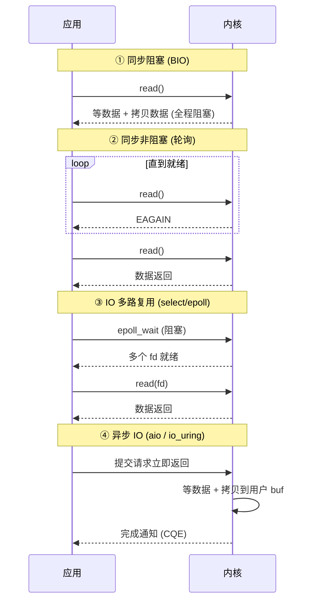
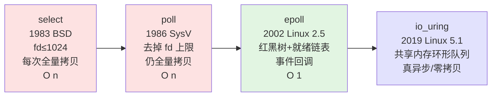
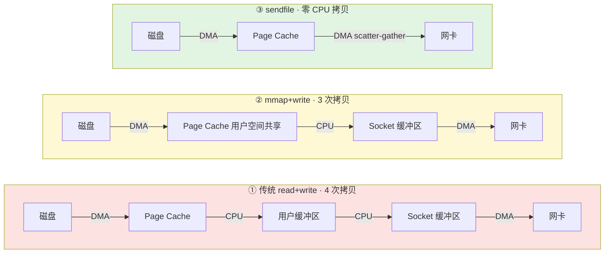

# 12.计算机IO操作和原理
#### 目录介绍
- [01.工作案例引入](#01工作案例引入)
  - [1.1 CPU闲但QPS不涨](#11-cpu闲但qps不涨)
  - [1.2 初步结论](#12-初步结论)
  - [1.3 本文要回答的问题](#13-本文要回答的问题)
- [02.IO基础概念理解](#02io基础概念理解)
  - [2.1 什么是IO操作](#21-什么是io操作)
  - [2.2 为何IO是瓶颈](#22-为何io是瓶颈)
  - [2.3 IO操作的分类](#23-io操作的分类)
  - [2.4 用户态与内核态](#24-用户态与内核态)
  - [2.5 IO操作本质流程](#25-io操作本质流程)
- [03.阻塞与非阻塞IO](#03阻塞与非阻塞io)
  - [3.1 读文件时CPU在做啥](#31-读文件时cpu在做啥)
  - [3.2 阻塞IO模型](#32-阻塞io模型)
  - [3.3 非阻塞IO模型](#33-非阻塞io模型)
  - [3.4 阻塞非阻塞区别](#34-阻塞非阻塞区别)
  - [3.5 餐厅点餐类比](#35-餐厅点餐类比)
- [04.同步与异步IO](#04同步与异步io)
  - [4.1 非阻塞与异步区别](#41-非阻塞与异步区别)
  - [4.2 同步IO的定义](#42-同步io的定义)
  - [4.3 异步IO的定义](#43-异步io的定义)
  - [4.4 四种IO模型对比](#44-四种io模型对比)
  - [4.5 系统调用本质差异](#45-系统调用本质差异)
- [05.IO多路复用解析](#05io多路复用解析)
  - [5.1 一线程处理万连接](#51-一线程处理万连接)
  - [5.2 IO多路复用由来](#52-io多路复用由来)
  - [5.3 select机制详解](#53-select机制详解)
  - [5.4 poll机制详解](#54-poll机制详解)
  - [5.5 epoll机制详解](#55-epoll机制详解)
  - [5.6 三者对比](#56-三者对比)
  - [5.7 kqueue与IOCP](#57-kqueue与iocp)
  - [5.8 从select到epoll](#58-从select到epoll)
- [06.零拷贝技术原理](#06零拷贝技术原理)
  - [6.1 为何要拷贝四次](#61-为何要拷贝四次)
  - [6.2 传统IO拷贝路径](#62-传统io拷贝路径)
  - [6.3 mmap内存映射](#63-mmap内存映射)
  - [6.4 sendfile系统调用](#64-sendfile系统调用)
  - [6.5 splice与tee](#65-splice与tee)
  - [6.6 框架中的零拷贝](#66-框架中的零拷贝)
- [07.文件系统与IO](#07文件系统与io)
  - [7.1 文件描述符本质](#71-文件描述符本质)
  - [7.2 VFS虚拟文件系统](#72-vfs虚拟文件系统)
  - [7.3 Page Cache页缓存](#73-page-cache页缓存)
  - [7.4 直接IO与缓冲IO](#74-直接io与缓冲io)
  - [7.5 文件IO写入保证](#75-文件io写入保证)
- [08.网络IO架构演进](#08网络io架构演进)
  - [8.1 高并发服务器设计](#81-高并发服务器设计)
  - [8.2 多进程模型](#82-多进程模型)
  - [8.3 多线程模型](#83-多线程模型)
  - [8.4 Reactor模式](#84-reactor模式)
  - [8.5 Proactor模式](#85-proactor模式)
  - [8.6 主流框架IO选择](#86-主流框架io选择)
  - [8.7 Apache到Nginx](#87-apache到nginx)
- [09.IO性能优化实践](#09io性能优化实践)
  - [9.1 IO性能衡量指标](#91-io性能衡量指标)
  - [9.2 磁盘IO优化策略](#92-磁盘io优化策略)
  - [9.3 网络IO优化策略](#93-网络io优化策略)
  - [9.4 语言中的IO优化](#94-语言中的io优化)
- [10.综合案例Nginx响应](#10综合案例nginx响应)
  - [10.1 全景时序图](#101-全景时序图)
  - [10.2 逐步拆解](#102-逐步拆解)
  - [10.3 完整响应性能账](#103-完整响应性能账)
  - [10.4 与阻塞IO对比](#104-与阻塞io对比)
  - [10.5 一句话串联本章](#105-一句话串联本章)
- [11.思考题与作业](#11思考题与作业)
  - [11.1 基础理解题](#111-基础理解题)
  - [11.2 进阶思考题](#112-进阶思考题)
  - [11.3 动手作业](#113-动手作业)


## 01.工作案例引入

### 1.1 CPU闲但QPS不涨

工作第三年的小吕接手了一个 Netty 写的静态资源分发服务，压测时出现了诡异现象：

- QPS 卡在约 3,000 就上不去了，客户端延迟被拉到 800ms+
- `top` 看 CPU 利用率只有 **15%**，远没跑满
- `vmstat 1` 发现 `wa`（IO wait）列一直在 30~40%
- `jstack` 抓出来，Netty 的 worker 线程 **大部分在 `FileInputStream.read` 这一行上**，状态是 `RUNNABLE`（实际陷入内核态不可中断睡眠）

翻代码一看，业务把文件发出去的写法是这样的：

```java
// ❌ 传统的 用户态 read + write 双拷贝
try (FileInputStream fis = new FileInputStream(file)) {
    byte[] buf = new byte[8 * 1024];
    int n;
    while ((n = fis.read(buf)) > 0) {
        ctx.writeAndFlush(Unpooled.wrappedBuffer(buf, 0, n));
    }
}
```

小吕把它改成 Netty 的 `DefaultFileRegion`（底层是 `sendfile` 零拷贝）：

```java
// ✅ 零拷贝：内核直接把 Page Cache 送到网卡
ctx.write(new DefaultFileRegion(file, 0, file.length()));
ctx.writeAndFlush(LastHttpContent.EMPTY_LAST_CONTENT);
```

再压一次，QPS 直接从 3,000 飙到 **18,000+**，CPU 使用率反而下降到 10%，`wa` 接近 0。

### 1.2 初步结论

这个案例把本章几乎所有关键词都牵出来了：

| 现象 | 背后的 IO 知识点 |
|---|---|
| `read()` 卡住，线程处于 `D` 状态 | **阻塞 IO**、用户态 → 内核态切换 |
| CPU 闲但 QPS 低 | IO 是瓶颈，CPU 在等磁盘/网卡 |
| `buf` 数组的 read/write | **用户态缓冲区 ↔ 内核 Page Cache** 两次拷贝 |
| 改成 `FileRegion` 后提升 6 倍 | **零拷贝（sendfile）**，数据不再过用户态 |
| 一个 EventLoop 扛 18K QPS | **IO 多路复用（epoll）+ Reactor 模型** |

你会发现：**同样一段 "把文件发出去" 的代码，在内核里可能要跑两次拷贝+四次上下文切换，也可能一次拷贝+两次切换都不需要**——能把这两个版本之间的差别讲清楚，就是这章的目的。

### 1.3 本文要回答的问题

读完本章，你应该能回答：

1. 一次 `read()` 调用在内核里到底走了哪些路？为什么 "CPU 闲 + wa 高" 就说明是 IO 瓶颈？
2. 阻塞 / 非阻塞 / 同步 / 异步 这四个词到底怎么组合？为什么 Java NIO 是 "同步非阻塞" 而不是 "异步"？
3. `select`、`poll`、`epoll` 到底差在哪？为什么 C10K 问题能用 epoll 破解？
4. 零拷贝（mmap / sendfile / splice）省掉了哪几次拷贝和切换？Kafka / Nginx / RocketMQ 各用了哪种？
5. Reactor 和 Proactor 的本质区别是什么？Linux 上为什么多数框架只能做到 Reactor？

带着这些问题继续往下读，你会发现本章每一节都对应着上面故障案例里的某一个"为什么"。


## 02.IO基础概念理解

### 2.1 什么是IO操作

IO（Input/Output，输入/输出）是计算机系统中最基本也是最关键的操作之一。广义上说，凡是涉及数据在不同设备或不同层次之间传输的操作，都属于IO操作。

从计算机体系结构的角度看，IO操作包括：

1. **磁盘IO**：程序读写文件、数据库操作
2. **网络IO**：网络数据的收发（Socket通信）
3. **设备IO**：键盘输入、屏幕显示、打印机输出
4. **内存IO**：DMA传输、内存映射文件

从程序员的视角看，IO操作可以简化为两个核心动作：

```
读（Read）：  外部设备 → 内存 → 进程
写（Write）： 进程 → 内存 → 外部设备
```

### 2.2 为何IO是瓶颈

**疑惑**：CPU的运算速度已经如此之快，为什么程序还是会"卡"？

**答疑**：因为CPU再快，也需要等数据。而数据的来源——磁盘和网络——比CPU慢了好几个数量级。

各组件的速度对比（以CPU一个时钟周期≈0.3ns为基准类比）：

| 操作 | 实际耗时 | 类比（CPU=1秒） |
|------|----------|-----------------|
| CPU寄存器访问 | ~0.3ns | 1秒 |
| L1 Cache | ~1ns | 3秒 |
| L2 Cache | ~4ns | 12秒 |
| L3 Cache | ~12ns | 36秒 |
| 内存访问 | ~100ns | 5分钟 |
| SSD随机读 | ~100μs | 4天 |
| HDD随机读 | ~10ms | 1年 |
| 网络（同机房） | ~500μs | 19天 |
| 网络（跨城市） | ~50ms | 5年 |

这就是为什么IO优化是性能优化中最重要的课题——**IO是绝大多数程序的性能瓶颈**。

### 2.3 IO操作的分类

按照不同维度，IO可以分为多种类型：

**按数据流向**：
- 输入（Input）：数据从外部进入程序
- 输出（Output）：数据从程序输出到外部

**按设备类型**：
- 块设备IO（Block I/O）：以固定大小的块为单位传输，如硬盘、SSD
- 字符设备IO（Character I/O）：以字符（字节）为单位传输，如键盘、串口
- 网络设备IO（Network I/O）：通过网络协议栈传输，如网卡

**按行为模式**：
- 阻塞IO / 非阻塞IO
- 同步IO / 异步IO
- 直接IO / 缓冲IO

### 2.4 用户态与内核态

理解IO操作的关键前提是理解**用户态（User Mode）**和**内核态（Kernel Mode）**。

```
┌──────────────────────────────────────┐
│           用户空间（User Space）       │
│  ┌──────────┐  ┌──────────┐          │
│  │  应用程序A │  │  应用程序B │         │
│  └─────┬────┘  └─────┬────┘          │
│        │              │               │
│  ======│==============│=========      │
│        │ 系统调用接口  │               │
│  ======│==============│=========      │
│        ▼              ▼               │
│           内核空间（Kernel Space）      │
│  ┌──────────────────────────────┐    │
│  │   VFS / 网络协议栈 / 设备驱动  │    │
│  └──────────────┬───────────────┘    │
│                 ▼                     │
│  ┌──────────────────────────────┐    │
│  │       硬件设备层              │    │
│  │   磁盘  网卡  键盘  显示器     │    │
│  └──────────────────────────────┘    │
└──────────────────────────────────────┘
```

为什么要区分用户态和内核态？

1. **安全隔离**：应用程序不能直接操作硬件，防止恶意或错误的程序破坏系统
2. **资源管理**：操作系统统一管理硬件资源，协调多个程序的IO请求
3. **抽象封装**：应用程序通过统一的系统调用接口访问不同硬件，无需关心硬件细节

每次IO操作都需要从用户态切换到内核态，这个切换本身就有开销（保存/恢复寄存器、切换页表等），这也是IO优化需要考虑的重要因素。

### 2.5 IO操作本质流程

以"程序读取文件数据"为例，完整流程如下：

```
1. 应用程序调用 read() 系统调用
2. CPU 从用户态切换到内核态
3. 内核检查 Page Cache 是否有该数据
   ├── 命中：直接从 Page Cache 拷贝到用户缓冲区
   └── 未命中：
       a. 内核向磁盘控制器发出读取命令
       b. DMA 将数据从磁盘读到内核缓冲区（Page Cache）
       c. 数据从内核缓冲区拷贝到用户缓冲区
4. CPU 从内核态切换回用户态
5. read() 返回，应用程序获得数据
```

注意关键点：**数据需要经过两次拷贝**——从硬件到内核缓冲区，再从内核缓冲区到用户缓冲区。这是后面零拷贝技术要解决的核心问题。


## 03.阻塞与非阻塞IO

### 3.1 读文件时CPU在做啥

当一个程序执行 `read()` 读取磁盘文件时，如果数据还没有准备好（比如磁盘还在寻道），CPU在做什么？是傻等着还是去做别的事情？

这个问题的答案取决于IO模型的选择——阻塞还是非阻塞。

### 3.2 阻塞IO模型

**阻塞IO（Blocking I/O）**是最简单、最原始的IO模型。

工作流程：

```
应用程序                    内核
    │                        │
    │─── read() ────────────>│
    │                        │ 等待数据准备...
    │     （进程被挂起）       │ 磁盘寻道、DMA传输...
    │     （不占用CPU）        │
    │                        │ 数据准备好
    │                        │ 从内核拷贝到用户空间
    │<── 返回数据 ───────────│
    │                        │
```

特点分析：

1. **简单直观**：代码逻辑清晰，容易编写和理解
2. **进程挂起**：在等待数据期间，进程被操作系统挂起，不占用CPU
3. **一对一**：一个线程同时只能处理一个IO操作

代码示例（C语言）：

```c
// 阻塞IO - 最简单的文件读取
int fd = open("/data/log.txt", O_RDONLY);
char buf[4096];
ssize_t n = read(fd, buf, sizeof(buf));  // 阻塞在这里，直到数据就绪
// 到这里时，数据已经在buf中了
process_data(buf, n);
```

代码示例（Java）：

```java
// Java的传统IO默认就是阻塞IO
FileInputStream fis = new FileInputStream("/data/log.txt");
byte[] buf = new byte[4096];
int n = fis.read(buf);  // 阻塞，直到读到数据或EOF
processData(buf, n);
```

### 3.3 非阻塞IO模型

**非阻塞IO（Non-blocking I/O）**不会让线程挂起等待，而是立即返回。

工作流程：

```
应用程序                    内核
    │                        │
    │─── read() ────────────>│
    │<── EAGAIN（没准备好）──│ 数据未就绪
    │                        │
    │  （做其他事情）          │
    │                        │
    │─── read() ────────────>│
    │<── EAGAIN（没准备好）──│ 数据仍未就绪
    │                        │
    │  （做其他事情）          │
    │                        │
    │─── read() ────────────>│
    │                        │ 数据已就绪
    │                        │ 从内核拷贝到用户空间
    │<── 返回数据 ───────────│
    │                        │
```

代码示例（C语言）：

```c
// 非阻塞IO - 需要轮询
int fd = open("/data/log.txt", O_RDONLY | O_NONBLOCK);
char buf[4096];
ssize_t n;

while (1) {
    n = read(fd, buf, sizeof(buf));
    if (n > 0) {
        process_data(buf, n);
        break;
    } else if (n == -1 && errno == EAGAIN) {
        // 数据未就绪，可以做其他事情
        do_other_work();
    } else {
        // 真正的错误或EOF
        break;
    }
}
```

非阻塞IO的问题：**需要不断轮询（Polling）**，浪费CPU资源。这就引出了IO多路复用技术。

### 3.4 阻塞非阻塞区别

| 对比维度 | 阻塞IO | 非阻塞IO |
|----------|--------|----------|
| 数据未就绪时 | 线程挂起，让出CPU | 立即返回错误码 |
| CPU利用 | 等待期间不占CPU | 轮询会浪费CPU |
| 编程复杂度 | 简单直观 | 需要处理重试逻辑 |
| 适用场景 | 简单应用、低并发 | 需配合IO多路复用 |
| 本质 | 调用方等待被调用方完成 | 调用方不等待，主动查询 |

### 3.5 餐厅点餐类比

用餐厅点餐来类比：

**阻塞IO**：你到餐厅点了一份牛排，然后就坐在位置上等着，什么都不干，直到服务员把牛排端上来。如果厨师做了30分钟，你就干等了30分钟。

**非阻塞IO**：你到餐厅点了一份牛排，然后每隔2分钟就跑去问一次"好了没？""好了没？""好了没？"。虽然你没有干等，但是不停地跑去问也很累（CPU轮询开销）。

那有没有更好的方式？——餐厅给你一个呼叫器，做好了会响（这就是IO多路复用）。或者餐厅直接送到你桌上（这就是异步IO）。


## 04.同步与异步IO

### 4.1 非阻塞与异步区别

很多人会把"非阻塞"和"异步"搞混。非阻塞IO不就是不等待吗？那它和异步IO有什么区别？

**答疑**：关键在于**谁来完成数据从内核到用户空间的拷贝**：
- **同步IO**（包括阻塞和非阻塞）：最终的数据拷贝需要应用程序参与（调用read()完成拷贝）
- **异步IO**：整个IO操作（包括数据拷贝）都由内核完成，完成后通知应用程序

### 4.2 同步IO的定义

同步IO（Synchronous I/O）：应用程序发起IO操作后，必须等待或主动查询IO操作是否完成，并且最终由应用程序的线程来完成数据的拷贝。

阻塞IO和非阻塞IO都属于同步IO，因为最终都需要应用程序调用 `read()` 来完成数据从内核缓冲区到用户缓冲区的拷贝。

### 4.3 异步IO的定义

异步IO（Asynchronous I/O）：应用程序发起IO操作后，立即返回，不等待IO完成。内核在整个IO操作完成后（包括数据拷贝到用户空间），通过信号或回调通知应用程序。

```
应用程序                    内核
    │                        │
    │─── aio_read() ────────>│
    │<── 立即返回 ───────────│
    │                        │ 内核自己完成所有工作：
    │  （做任何其他事情）       │   等待数据...
    │  （完全不用管IO）        │   DMA传输...
    │                        │   数据拷贝到用户空间...
    │                        │
    │<── 信号/回调通知 ──────│ 全部完成！
    │                        │
```

代码示例（Linux AIO，C语言）：

```c
#include <aio.h>

struct aiocb cb;
memset(&cb, 0, sizeof(cb));
cb.aio_fildes = fd;
cb.aio_buf = buf;
cb.aio_nbytes = sizeof(buf);
cb.aio_offset = 0;

// 发起异步读取，立即返回
aio_read(&cb);

// 做其他事情...
do_other_work();

// 检查是否完成（也可以用信号通知）
while (aio_error(&cb) == EINPROGRESS) {
    // 还在进行中
}

ssize_t n = aio_return(&cb);
process_data(buf, n);
```

### 4.4 四种IO模型对比

综合阻塞/非阻塞和同步/异步两个维度，形成四种IO模型：

```
                    同步                           异步
            ┌─────────────────────┬─────────────────────┐
   阻塞     │  同步阻塞IO          │      （不存在）       │
            │  最简单，性能最差     │                      │
            │  如：传统read()      │                      │
            ├─────────────────────┼─────────────────────┤
   非阻塞   │  同步非阻塞IO        │  异步非阻塞IO        │
            │  轮询，CPU浪费       │  最高效，编程最复杂    │
            │  如：O_NONBLOCK     │  如：aio_read()       │
            │  通常配合IO多路复用   │  如：Windows IOCP    │
            └─────────────────────┴─────────────────────┘
```

四种模型的调用时序差异，用 mermaid 对照一下最直观：



### 4.5 系统调用本质差异

从系统调用的角度，同步和异步的本质差异一目了然：

**同步IO系统调用**（以read为例）：

```c
// 这个调用返回时，数据已经在buf中了
ssize_t n = read(fd, buf, count);
// 不管是阻塞等待，还是非阻塞轮询
// 最终都是这个 read() 调用完成了数据拷贝
```

**异步IO系统调用**（以io_uring为例，Linux 5.1+）：

```c
// 提交IO请求，立即返回
io_uring_submit(&ring);

// 做其他事情...

// 等待完成事件（数据已经在buf中了，内核帮你拷贝好了）
io_uring_wait_cqe(&ring, &cqe);
```

**结论**：
- 同步IO = 应用程序主导数据传输
- 异步IO = 内核主导数据传输，完成后通知应用程序


## 05.IO多路复用解析

### 5.1 一线程处理万连接

传统的网络服务器模型是"一个连接一个线程"。如果有10000个客户端连接，就需要10000个线程。线程的创建、销毁、上下文切换都有开销，这种方案在高并发场景下完全不可行。

那么，有没有一种方法，让一个线程就能同时监控多个IO连接？

**答疑**：有，这就是**IO多路复用（I/O Multiplexing）**。核心思想是：用一个线程监控多个文件描述符（fd），当任意一个fd就绪时，通知应用程序进行处理。

### 5.2 IO多路复用由来

IO多路复用的"多路"指的是多个IO通道（多个Socket连接），"复用"指的是复用同一个线程。

```
传统模型：                    IO多路复用模型：

线程1 ──── fd1                    ┌── fd1
线程2 ──── fd2                    │── fd2
线程3 ──── fd3               线程 ─┤── fd3
  ...       ...                   │── fd4
线程N ──── fdN                    └── ...fdN
```

它的工作流程：

```
应用程序                    内核
    │                        │
    │── select/epoll() ────>│  注册监控多个fd
    │                        │
    │   （进程阻塞等待）       │  内核监控所有fd
    │                        │  某个fd数据就绪！
    │<── 返回就绪的fd ──────│
    │                        │
    │── read(就绪fd) ──────>│  读取数据
    │<── 返回数据 ──────────│
    │                        │
```

### 5.3 select机制详解

`select` 是最早的IO多路复用机制（1983年，4.2BSD Unix）。

**基本原理**：

```c
int select(int nfds,
           fd_set *readfds,    // 监控可读的fd集合
           fd_set *writefds,   // 监控可写的fd集合
           fd_set *exceptfds,  // 监控异常的fd集合
           struct timeval *timeout);
```

工作流程：
1. 应用程序将感兴趣的fd放入fd_set位图（bitmap）
2. 调用select()，将fd_set从用户空间拷贝到内核空间
3. 内核遍历所有fd，检查是否有就绪的
4. 如果没有就绪的fd，进程休眠，等待事件或超时
5. 有fd就绪后，内核修改fd_set标记就绪的fd
6. select()返回，应用程序遍历fd_set找出就绪的fd

代码示例：

```c
fd_set readfds;
FD_ZERO(&readfds);
FD_SET(sock1, &readfds);
FD_SET(sock2, &readfds);
FD_SET(sock3, &readfds);

int maxfd = max(sock1, max(sock2, sock3));
int ret = select(maxfd + 1, &readfds, NULL, NULL, NULL);

if (ret > 0) {
    if (FD_ISSET(sock1, &readfds)) {
        // sock1 可读，处理数据
    }
    if (FD_ISSET(sock2, &readfds)) {
        // sock2 可读，处理数据
    }
}
```

**select的局限性**：

1. **fd数量限制**：fd_set是固定大小的位图，通常最多1024个fd（FD_SETSIZE）
2. **每次调用都要拷贝**：每次调用select，都需要将fd_set从用户空间拷贝到内核空间
3. **线性扫描**：内核需要遍历所有fd来检查就绪状态，时间复杂度O(n)
4. **重复初始化**：每次调用后fd_set会被修改，下次调用需要重新设置

### 5.4 poll机制详解

`poll`（1986年，System V）解决了select的fd数量限制问题。

```c
struct pollfd {
    int   fd;         // 文件描述符
    short events;     // 注册的事件（输入）
    short revents;    // 实际发生的事件（输出）
};

int poll(struct pollfd *fds, nfds_t nfds, int timeout);
```

**相比select的改进**：
- 使用pollfd数组代替位图，没有fd数量限制
- 输入（events）和输出（revents）分离，不需要每次重新初始化

**仍然存在的问题**：
- 每次调用仍需将整个数组从用户空间拷贝到内核空间
- 内核仍需线性遍历所有fd，O(n)时间复杂度

### 5.5 epoll机制详解

`epoll`（2002年，Linux 2.5.44）是Linux特有的IO多路复用机制，解决了select/poll的所有核心问题。

**epoll的三个系统调用**：

```c
// 1. 创建epoll实例
int epoll_create(int size);

// 2. 注册/修改/删除监控的fd
int epoll_ctl(int epfd, int op, int fd, struct epoll_event *event);

// 3. 等待就绪事件
int epoll_wait(int epfd, struct epoll_event *events, int maxevents, int timeout);
```

**epoll的核心设计**：

```
┌───────────────────────────────────────────┐
│              内核空间                       │
│                                            │
│  ┌──────────────────┐                     │
│  │  epoll 实例       │                     │
│  │                   │                     │
│  │  红黑树（所有fd）  │ ←── epoll_ctl 增删改  │
│  │  ┌─────────────┐ │                     │
│  │  │  fd1        │ │                     │
│  │  │  fd2        │ │                     │
│  │  │  ...        │ │                     │
│  │  └─────────────┘ │                     │
│  │                   │                     │
│  │  就绪链表         │ ──→ epoll_wait 返回   │
│  │  ┌─────────────┐ │                     │
│  │  │  fd3(就绪)   │ │                     │
│  │  │  fd7(就绪)   │ │                     │
│  │  └─────────────┘ │                     │
│  └──────────────────┘                     │
│                                            │
│  当fd就绪时，通过回调函数                     │
│  将fd加入就绪链表（不需要遍历）                │
└───────────────────────────────────────────┘
```

**epoll为什么高效？**

| 设计要点 | 实现方式 | 对比select/poll |
|----------|----------|-----------------|
| fd管理 | 红黑树（内核持久化） | 不需要每次传入所有fd |
| 就绪通知 | 回调机制 + 就绪链表 | 不需要遍历所有fd |
| 数据拷贝 | mmap共享内存 | 减少用户/内核数据拷贝 |
| fd数量 | 仅受系统资源限制 | 突破1024限制 |

**epoll的两种触发模式**：

**水平触发（LT，Level Triggered）**——默认模式：
- 只要fd的缓冲区有数据可读，每次调用epoll_wait都会返回该fd
- 类比：水位计警报，只要水位超标就一直报警
- 编程简单，不会丢数据

**边缘触发（ET，Edge Triggered）**——高性能模式：
- 只有当fd的状态发生变化时（新数据到达），才会返回该fd
- 类比：水位计警报，只在水位超标的瞬间报警一次
- 必须一次性读完所有数据（循环读直到EAGAIN），否则可能丢失通知
- 性能更高，减少epoll_wait的返回次数

```c
// 边缘触发模式下的正确读取方式
while (1) {
    int n = epoll_wait(epfd, events, MAX_EVENTS, -1);
    for (int i = 0; i < n; i++) {
        if (events[i].events & EPOLLIN) {
            // ET模式下必须循环读完所有数据
            while (1) {
                ssize_t count = read(events[i].data.fd, buf, sizeof(buf));
                if (count == -1) {
                    if (errno == EAGAIN) break;  // 数据读完了
                    // 处理错误
                }
                if (count == 0) {
                    // 连接关闭
                    break;
                }
                process_data(buf, count);
            }
        }
    }
}
```

### 5.6 三者对比

| 特性 | select | poll | epoll |
|------|--------|------|-------|
| 时间复杂度 | O(n) | O(n) | O(1)就绪事件 |
| fd数量限制 | 1024（FD_SETSIZE） | 无限制 | 无限制 |
| fd传递方式 | 每次全量拷贝 | 每次全量拷贝 | 内核持久化（红黑树） |
| 就绪检测 | 线性遍历 | 线性遍历 | 回调 + 就绪链表 |
| 触发方式 | 水平触发 | 水平触发 | 水平/边缘触发 |
| 适用场景 | 少量fd | 少量fd | 大量fd（高并发） |
| 跨平台 | 是 | 是 | 仅Linux |

### 5.7 kqueue与IOCP

epoll是Linux的方案，其他操作系统有各自的高性能IO多路复用机制：

**kqueue（FreeBSD/macOS）**：
- 功能和epoll类似，甚至更灵活
- 支持监控文件变化、进程事件等
- macOS上的高性能网络框架（如libuv）底层使用kqueue

**IOCP（Windows，I/O Completion Ports）**：
- Windows的异步IO模型
- 严格意义上是真正的异步IO，不是IO多路复用
- 内核完成IO后通知应用程序，是Proactor模式的典型实现

**跨平台抽象**：
- **libevent/libev/libuv**：封装了不同平台的IO多路复用机制，提供统一API
- Node.js底层的libuv：在Linux上用epoll，macOS上用kqueue，Windows上用IOCP

### 5.8 从select到epoll

```
1983年 select诞生（4.2BSD）
  │   痛点：fd数量限制1024，每次全量拷贝，线性遍历
  ▼
1986年 poll出现（System V）
  │   改进：去掉fd数量限制
  │   痛点：仍需全量拷贝和线性遍历
  ▼
2002年 epoll登场（Linux 2.5.44）
  │   革命性改进：红黑树 + 回调 + 就绪链表
  │   实现了O(1)的就绪事件获取
  ▼
2019年 io_uring出现（Linux 5.1）
      终极方案：真正的异步IO
      共享内存环形队列，零拷贝提交
      性能碾压epoll
```

换成 mermaid 时间线，演化路径一目了然：



**为什么进化方向是从遍历走向事件驱动？**

**论证**：假设有10000个连接，但某一时刻只有10个连接有数据到达。

- **select/poll**：遍历10000个fd，找出10个就绪的。浪费了9990次无效检查
- **epoll**：直接从就绪链表取出10个就绪的fd。不做任何无效检查

当连接数越大、活跃连接比例越低时，epoll的优势就越明显。这就是为什么高并发服务器（Nginx、Redis等）都使用epoll。


## 06.零拷贝技术原理

### 6.1 为何要拷贝四次

一个Web服务器要把磁盘上的文件发送给客户端，看似简单的操作，底层到底发生了什么？

传统方式的代码：

```c
char buf[4096];
read(file_fd, buf, sizeof(buf));    // 从文件读到用户缓冲区
write(socket_fd, buf, sizeof(buf)); // 从用户缓冲区写到Socket
```

这两行代码背后的数据流动：

```
磁盘 ──DMA拷贝──> 内核Page Cache ──CPU拷贝──> 用户缓冲区
                                              │
用户缓冲区 ──CPU拷贝──> Socket缓冲区 ──DMA拷贝──> 网卡

总计：4次拷贝 + 4次上下文切换
```

| 步骤 | 拷贝方式 | 方向 |
|------|----------|------|
| 1 | DMA拷贝 | 磁盘 → 内核Page Cache |
| 2 | CPU拷贝 | 内核Page Cache → 用户缓冲区 |
| 3 | CPU拷贝 | 用户缓冲区 → Socket缓冲区 |
| 4 | DMA拷贝 | Socket缓冲区 → 网卡 |

其中第2步和第3步完全是多余的——数据在用户空间"溜了一圈"又回到了内核空间。

### 6.2 传统IO拷贝路径

为什么传统IO要绕这么大一圈？

**答疑**：因为操作系统的安全模型要求用户程序不能直接访问内核缓冲区。read()必须把数据拷贝到用户空间，write()又必须从用户空间拷贝到内核空间。

但对于"读文件发网络"这种场景，应用程序根本不需要处理数据的内容，只是做一个"中转站"。零拷贝技术就是为了消除这种不必要的中转。

### 6.3 mmap内存映射

**mmap（Memory Mapped I/O）**将文件映射到用户空间的虚拟地址，用户空间和内核空间共享同一块物理内存，减少一次拷贝。

```c
// mmap + write
void *addr = mmap(NULL, file_size, PROT_READ, MAP_PRIVATE, file_fd, 0);
write(socket_fd, addr, file_size);
munmap(addr, file_size);
```

数据流动：

```
磁盘 ──DMA拷贝──> 内核Page Cache ──CPU拷贝──> Socket缓冲区 ──DMA拷贝──> 网卡
                       ↕
              用户空间（通过mmap共享）

总计：3次拷贝（减少1次CPU拷贝）+ 4次上下文切换
```

mmap的优势和适用场景：
- 减少一次CPU拷贝
- 适合需要在用户空间读取/修改文件内容的场景
- Java的MappedByteBuffer就是基于mmap实现

### 6.4 sendfile系统调用

**sendfile()** 直接在两个文件描述符之间传输数据，数据完全不经过用户空间。

```c
// 一个系统调用搞定
sendfile(socket_fd, file_fd, &offset, count);
```

数据流动（Linux 2.4+，支持DMA scatter/gather）：

```
磁盘 ──DMA拷贝──> 内核Page Cache ──DMA拷贝──> 网卡
                       │
              （只传递fd和偏移量给Socket缓冲区）

总计：2次DMA拷贝 + 2次上下文切换（真正的零CPU拷贝！）
```

| 技术方案 | 拷贝次数 | 上下文切换 | CPU参与拷贝 |
|----------|----------|------------|-------------|
| 传统 read+write | 4次 | 4次 | 2次 |
| mmap + write | 3次 | 4次 | 1次 |
| sendfile | 2次 | 2次 | 0次 |

这三条路径的数据流用 mermaid 对照画，差异非常明显：



### 6.5 splice与tee

**splice()**：在两个文件描述符之间移动数据，不需要数据经过用户空间。和sendfile不同的是，splice的两个fd中至少有一个必须是管道（pipe）。

```c
// 通过管道中转
int pipefd[2];
pipe(pipefd);
splice(file_fd, NULL, pipefd[1], NULL, len, SPLICE_F_MOVE);
splice(pipefd[0], NULL, socket_fd, NULL, len, SPLICE_F_MOVE);
```

**tee()**：在两个管道之间复制数据，数据不会被消耗（可以实现"一份数据发给多个目标"）。

### 6.6 框架中的零拷贝

零拷贝并不是一个高深莫测的技术，它已经被广泛应用在主流框架和中间件中：

| 框架/中间件 | 零拷贝技术 | 应用场景 |
|-------------|-----------|---------|
| Kafka | sendfile | 消费者读取消息 |
| Nginx | sendfile | 静态文件服务 |
| Netty | FileRegion(sendfile) | 文件传输 |
| Java NIO | transferTo/transferFrom | 文件通道传输 |
| RocketMQ | mmap | 消息存储与读取 |

Java示例：

```java
// Java NIO的零拷贝
FileChannel sourceChannel = new FileInputStream("data.bin").getChannel();
SocketChannel socketChannel = SocketChannel.open(new InetSocketAddress("server", 8080));

// transferTo 底层调用sendfile
sourceChannel.transferTo(0, sourceChannel.size(), socketChannel);
```


## 07.文件系统与IO

### 7.1 文件描述符本质

在Unix/Linux中，一切皆文件。文件描述符（File Descriptor，fd）是一个非负整数，是进程访问文件的"句柄"。

```
进程的文件描述符表：
┌────┬──────────────────────────┐
│ fd │ 指向的内核文件对象          │
├────┼──────────────────────────┤
│  0 │ stdin  （标准输入）        │
│  1 │ stdout （标准输出）        │
│  2 │ stderr （标准错误）        │
│  3 │ /data/log.txt             │
│  4 │ socket (192.168.1.1:8080) │
│  5 │ /dev/null                 │
└────┴──────────────────────────┘
```

每个进程启动时默认打开0、1、2三个fd。后续打开的文件、Socket、管道等都会分配新的fd编号。

**疑惑**：为什么Socket也是文件描述符？

**答疑**：这是Unix"一切皆文件"哲学的体现。网络连接、设备、管道等都被抽象为文件，统一通过read/write/close等操作。这种抽象极大地简化了编程模型——你不需要为不同类型的IO学习不同的API。

### 7.2 VFS虚拟文件系统

VFS（Virtual File System）是Linux内核中的一个抽象层，它为不同的文件系统（ext4、XFS、NFS、procfs等）提供统一的接口。

```
应用程序:  open()  read()  write()  close()
              │       │       │       │
              ▼       ▼       ▼       ▼
         ┌─────────────────────────────┐
         │        VFS 抽象层            │
         │  (统一的文件操作接口)          │
         └──┬──────┬──────┬──────┬────┘
            │      │      │      │
            ▼      ▼      ▼      ▼
          ext4   XFS    NFS   procfs
           │      │      │      │
           ▼      ▼      ▼      ▼
         磁盘   磁盘   网络   内核数据
```

VFS的设计思想和面向对象编程中的"接口"概念完全一致——定义统一的抽象操作，由具体的文件系统实现。

### 7.3 Page Cache页缓存

Page Cache是Linux内核在内存中维护的文件数据缓存，是文件IO性能的关键。

**工作原理**：

1. **读取时**：内核先检查Page Cache，命中则直接返回，未命中则从磁盘读取并缓存
2. **写入时**：数据先写入Page Cache（标记为脏页），由pdflush守护进程异步写回磁盘
3. **内存不足时**：通过LRU算法淘汰不常用的缓存页

**疑惑**：既然数据先写到Page Cache再异步刷盘，那如果断电了数据不就丢了？

**答疑**：是的，这就是数据一致性和性能之间的权衡。对于需要严格数据安全的场景（如数据库），可以使用`fsync()`强制将Page Cache刷写到磁盘：

```c
write(fd, data, len);  // 数据写到Page Cache
fsync(fd);             // 强制刷到磁盘，确保数据持久化
```

### 7.4 直接IO与缓冲IO

**缓冲IO（Buffered I/O）**——默认方式：
- 数据经过Page Cache
- 利用缓存提高重复访问性能
- 适合大多数场景

**直接IO（Direct I/O）**：
- 数据绕过Page Cache，直接在用户空间和磁盘之间传输
- 适合有自己缓存管理策略的应用（如数据库）

```c
// 直接IO
int fd = open("/data/db.dat", O_RDWR | O_DIRECT);
// 注意：直接IO要求内存地址和读写长度都要对齐（通常512字节或4K）
```

MySQL的InnoDB存储引擎就使用直接IO，因为它有自己的Buffer Pool来管理缓存，不需要操作系统的Page Cache再缓存一次。

### 7.5 文件IO写入保证

从应用程序写数据到数据真正落盘，经历多个层次的缓冲：

```
应用程序缓冲区（如Java BufferedOutputStream）
      │  flush()
      ▼
C运行时库缓冲区（stdio buffer）
      │  fflush()
      ▼
内核Page Cache
      │  fsync() / fdatasync()
      ▼
磁盘控制器缓存
      │  （磁盘内部行为，应用程序无法直接控制）
      ▼
磁盘物质（盘片/闪存颗粒）
```

不同级别的刷新保证：

| 操作 | 保证级别 | 说明 |
|------|----------|------|
| write() | 数据到达内核Page Cache | 可能还没写到磁盘 |
| fsync(fd) | 数据+元数据写到磁盘 | 最强保证 |
| fdatasync(fd) | 只保证数据写到磁盘 | 比fsync快（不刷元数据） |
| sync() | 所有脏页写到磁盘 | 全局刷新 |


## 08.网络IO架构演进

### 8.1 高并发服务器设计

一个Web服务器需要同时处理几万甚至几十万个并发连接。最简单的方式是每个连接一个线程（或进程），但这种方式在高并发时会消耗大量资源。有没有更好的架构？

### 8.2 多进程模型

最早的网络服务器模型：每来一个连接，fork一个子进程处理。

```c
while (1) {
    int conn_fd = accept(listen_fd, ...);
    if (fork() == 0) {
        // 子进程处理连接
        handle_connection(conn_fd);
        exit(0);
    }
    close(conn_fd);  // 父进程关闭连接fd
}
```

**优点**：编程简单，进程隔离性好（一个进程崩溃不影响其他）
**缺点**：进程创建和切换开销大，资源消耗多

**代表**：早期的Apache HTTP Server（prefork模式）

### 8.3 多线程模型

用线程代替进程，减少资源消耗。

```c
while (1) {
    int conn_fd = accept(listen_fd, ...);
    pthread_create(&tid, NULL, handle_connection, conn_fd);
}
```

改进：线程池模型，避免频繁创建销毁线程。

**优点**：比多进程轻量
**缺点**：线程数仍有上限，上下文切换开销随连接数增长

### 8.4 Reactor模式

Reactor模式是目前最主流的高性能网络IO模型，基于IO多路复用 + 事件驱动。

核心思想：**不要等待IO就绪，而是注册感兴趣的事件，就绪后再处理**。

```
┌────────────────────────────────────────┐
│              Reactor 模式               │
│                                         │
│  ┌──────────┐    事件分发                │
│  │  Reactor  │───────────────────>       │
│  │ (事件循环) │                           │
│  │           │  ┌──────────────────┐    │
│  │  epoll_   │  │ Handler1(读处理)  │    │
│  │  wait()   │  │ Handler2(写处理)  │    │
│  │           │  │ Handler3(连接处理) │    │
│  └──────────┘  └──────────────────┘    │
└────────────────────────────────────────┘
```

**单Reactor单线程**（如Redis 6.0以前）：

```
Reactor线程: epoll_wait → 接受连接 → 读数据 → 业务处理 → 写数据
```

**单Reactor多线程**：

```
Reactor线程: epoll_wait → 接受连接 → 读数据
                                      │
                                      ▼
Worker线程池: 业务处理 → 写回数据
```

**主从Reactor多线程**（Netty默认模式）：

```
主Reactor线程: epoll_wait → 接受新连接 → 分配给从Reactor
                                          │
从Reactor线程1: epoll_wait → 读写IO      │
从Reactor线程2: epoll_wait → 读写IO      │
                      │                   │
                      ▼
             Worker线程池: 业务处理
```

### 8.5 Proactor模式

Proactor模式是基于异步IO的架构，与Reactor模式的本质区别：

| 维度 | Reactor | Proactor |
|------|---------|----------|
| IO类型 | 同步IO（IO多路复用） | 异步IO |
| 工作方式 | 内核通知"可以读了"，应用程序执行read | 内核完成读取，通知"读完了" |
| 复杂度 | 较低 | 较高 |
| 代表实现 | Linux epoll | Windows IOCP |
| 框架 | Netty, libevent | Boost.Asio(模拟), IOCP |

### 8.6 主流框架IO选择

| 框架/软件 | IO模型 | 具体实现 |
|-----------|--------|----------|
| Nginx | 主从Reactor | epoll(Linux), kqueue(BSD) |
| Redis | 单Reactor单线程 → 6.0+多线程IO | epoll |
| Netty | 主从Reactor多线程 | epoll(Linux), kqueue(Mac) |
| Node.js | 单线程事件循环 | libuv(epoll/kqueue/IOCP) |
| Go | goroutine + netpoller | epoll/kqueue |
| Tomcat NIO | 多Reactor | Java NIO(底层epoll) |

### 8.7 Apache到Nginx

```
Apache（多进程/多线程模型）
│  每个连接一个进程/线程
│  C10K问题：当连接数超过1万时性能急剧下降
│  
│  为什么？
│  - 1万个线程 × 每线程8MB栈 = 80GB内存
│  - 上下文切换开销巨大
│  - 大部分线程在等IO，CPU利用率低
│
▼
Nginx（事件驱动 + IO多路复用）
│  少量Worker进程（通常=CPU核心数）
│  每个Worker用epoll处理数万连接
│  
│  为什么能解决C10K？
│  - 4个Worker进程只占几十MB内存
│  - 没有上下文切换开销
│  - CPU利用率极高（只处理有数据的连接）
│
│  结果：轻松处理C10K，甚至C100K、C1000K
▼
现代方案
│  io_uring（Linux 5.1+）
│  真正的异步IO，比epoll更高效
│  正在被各大框架逐步采用
```

**结论**：网络IO架构的演进方向是——**用更少的线程处理更多的连接，让CPU只做有用功**。


## 09.IO性能优化实践

### 9.1 IO性能衡量指标

衡量IO性能主要看以下指标：

**磁盘IO指标**：
- **IOPS**（I/O Operations Per Second）：每秒IO操作数，衡量随机读写能力
- **吞吐量**（Throughput）：每秒传输的数据量（MB/s），衡量顺序读写能力
- **延迟**（Latency）：单次IO操作的耗时

**网络IO指标**：
- **带宽**（Bandwidth）：网络的最大传输能力
- **QPS**（Queries Per Second）：每秒处理的请求数
- **并发连接数**：同时保持的连接数量
- **响应时间**：从请求发出到收到响应的时间

### 9.2 磁盘IO优化策略

1. **顺序访问代替随机访问**：HDD顺序读比随机读快100倍以上，SSD也有数倍差距

```
设计启示：
- 日志系统使用追加写（append-only），如Kafka
- 数据库使用WAL（Write-Ahead Log）先顺序写日志
- LSM-Tree将随机写转换为顺序写
```

2. **利用Page Cache**：频繁读取的文件会被缓存在内存中

3. **批量IO**：将多次小IO合并为一次大IO，减少系统调用次数

4. **异步IO**：不等待IO完成，提高并发度

### 9.3 网络IO优化策略

1. **使用IO多路复用**：epoll/kqueue处理大量并发连接
2. **使用零拷贝**：sendfile传输静态文件
3. **连接复用**：HTTP Keep-Alive、连接池
4. **减少数据传输量**：压缩、协议优化
5. **批量操作**：Pipeline（如Redis Pipeline）

### 9.4 语言中的IO优化

不同编程语言提供了不同层次的IO抽象：

**Java**：
```java
// 传统IO（阻塞）
InputStream is = new FileInputStream("data.txt");

// NIO（IO多路复用）
Selector selector = Selector.open();
channel.register(selector, SelectionKey.OP_READ);

// NIO.2 / AIO（异步IO，Java 7+）
AsynchronousFileChannel channel = AsynchronousFileChannel.open(path);
channel.read(buffer, 0, null, new CompletionHandler<>() {
    public void completed(Integer result, Object attachment) {
        // 读取完成的回调
    }
});
```

**Go**：
```go
// Go的goroutine + runtime的netpoller
// 看起来是同步阻塞的代码，底层是epoll
conn, _ := net.Dial("tcp", "server:8080")
buf := make([]byte, 4096)
n, _ := conn.Read(buf)  // 底层是epoll，但对程序员来说是"阻塞"的
```

Go的设计哲学非常值得学习：**编程模型是同步的（容易理解），底层实现是异步的（高性能）**。这通过goroutine调度器和netpoller的配合实现。

**Python**：
```python
# asyncio（基于事件循环 + 协程）
import asyncio

async def handle_client(reader, writer):
    data = await reader.read(4096)  # 非阻塞，但写法像同步
    writer.write(data)
    await writer.drain()

async def main():
    server = await asyncio.start_server(handle_client, '0.0.0.0', 8080)
    await server.serve_forever()
```

**总结**：现代编程语言的IO设计趋势是——**提供同步的编程接口，隐藏异步的底层实现**，兼顾易用性和高性能。


## 10.综合案例Nginx响应

到这里，本章所有概念都可以用**一次真实的 HTTP 请求**串起来。场景：浏览器访问 `https://example.com/cat.jpg`（800KB），Nginx 作为静态资源服务器返回该文件。我们从 epoll 说起，一路走到网卡。

### 10.1 全景时序图

```
┌── 客户端 ───┐                   ┌──── Linux 内核 ────────────┐  ┌── 磁盘/网卡 ──┐
│            │                   │                            │  │               │
│  SYN ────> │ ① 三次握手完成，连接进入 accept 队列            │  │               │
│            │                   │                            │  │               │
│            │  worker 进程：epoll_wait() 阻塞等事件          │  │               │
│            │     │                                          │  │               │
│            │     └─ ② listen fd 可读 → accept() 拿到 connfd │  │               │
│            │                   │   epoll_ctl(ADD connfd, EPOLLIN) │          │
│            │                   │                            │  │               │
│  HTTP GET ─> │ ③ connfd 可读 → read() 拿到 Request         │  │               │
│            │                   │                            │  │               │
│            │     ④ open("cat.jpg") → fd=10                 │  │               │
│            │     ⑤ 检查 Page Cache：Miss → 发 IO 请求       │>─│→ DMA 读扇区  │
│            │                   │                            │  │               │
│            │     ⑥ 磁盘中断唤醒 worker，Page Cache 已装入   │<─│  800KB 就位  │
│            │                   │                            │  │               │
│            │     ⑦ sendfile(connfd, filefd, 0, 800KB)      │  │               │
│            │                   │   ├─ DMA: Page Cache → NIC  │>─│→ DMA scatter│
│            │                   │   └─ 不经过用户态！          │  │   /gather   │
│            │                   │                            │  │               │
│  <── 200 OK + cat.jpg ──       │ ⑧ TCP 分段发送，FIN        │  │               │
└────────────┘                   └────────────────────────────┘  └───────────────┘
```

### 10.2 逐步拆解

| 步骤 | 发生的事情 | 系统调用/机制 | 对应本章章节 |
|---|---|---|---|
| ① | TCP 三次握手，连接放入 accept queue | 内核 TCP 协议栈 | 7.x 网络 IO 架构 |
| ② | worker 被 epoll 唤醒，listen fd 就绪 | `epoll_wait` 返回 | 4.5 epoll |
| ③ | 读取 HTTP 请求头 | `read(connfd, buf, ...)` | 1.5 IO 本质流程 |
| ④ | 打开磁盘文件 | `open("cat.jpg")` | 6.1 文件描述符、6.2 VFS |
| ⑤ | 检索 Page Cache，Miss → 触发真实磁盘 IO，worker 继续处理其他连接 | `read` / `pread` / Page Cache 缺失 | 6.3 Page Cache |
| ⑥ | 磁盘 DMA 完成，中断处理函数唤醒等待队列 | 硬件中断 + `wake_up` | 2.2 阻塞 IO 底层、第 11 章异常中断 |
| ⑦ | 零拷贝直接把 Page Cache 通过网卡发出去 | `sendfile(out_fd, in_fd, ...)` | 5.4 sendfile |
| ⑧ | TCP 分段、TSO 卸载、TLS 加密（可选） | 内核 TCP/IP 栈 + 网卡 offload | 5.6 零拷贝的应用 |

### 10.3 完整响应性能账

假设 cat.jpg 冷命中（Page Cache miss），在万兆网 + NVMe SSD 的机器上典型耗时：

| 阶段 | 耗时 | 说明 |
|---|---|---|
| accept + 解析 HTTP | 2 µs | 用户态逻辑 |
| open + 查 inode | 5 µs | VFS / 文件系统 |
| Page Cache miss + 磁盘 DMA | 80 µs | 实际 IO |
| sendfile (Page Cache → NIC) | 10 µs | 零拷贝，不走用户态 |
| 网络传输 800KB | 650 µs | 10 Gbps 网口 |
| **合计** | **~750 µs** | **一个 worker 能扛 ~1,300 QPS/单文件** |

如果是 **热文件**（命中 Page Cache），第三步直接省掉，QPS 可以轻松上到 **20,000+**。这也解释了为什么 Nginx 在提供静态资源时，**内存大小往往比 CPU 重要**——Page Cache 才是真正的性能引擎。

### 10.4 与阻塞IO对比

如果 Nginx 换成 "Apache prefork + read/write" 的老做法：

| 指标 | Apache prefork（传统 IO） | Nginx（epoll + sendfile） |
|---|---|---|
| 每连接开销 | 一个进程/线程，MB 级内存 | 一个 fd，KB 级内存 |
| 上下文切换 | 每次 IO 都要切换进程 | worker 只在 epoll_wait 切一次 |
| 数据拷贝 | 4 次（磁盘→内核→用户→内核→NIC） | 2 次（磁盘→内核→NIC） |
| C10K | 几千连接就力不从心 | 单机 10W+ 连接轻松 |

这也正好回到开头小吕的案例：他的 Netty 服务其实已经是 epoll 模型了，**IO 多路复用**解决了"连接数"问题，但**用户态 buf**那一层仍然把数据拷到了进程空间；换成 `FileRegion/transferTo` 才补上了最后一块零拷贝。

### 10.5 一句话串联本章

> **一次磁盘文件 → 网卡的发送 = epoll（多路复用） + sendfile（零拷贝） + Page Cache（缓冲IO） + Reactor（架构模式）**
>
> 少了任何一个，都不叫"现代高性能 IO"。


## 11.思考题与作业

### 11.1 基础理解题

1. 用户态 `read(fd, buf, 4096)` 在内核里至少发生几次数据拷贝、几次上下文切换？分别是哪几次？
2. 为什么 "CPU 利用率低 + IO wait 高" 就可以判定为 IO 瓶颈？`wa` 这一指标反映的是什么？
3. 同步非阻塞和异步这两种 IO 模型的**本质区别**是什么？（提示：对"数据从内核拷到用户态"这一步谁来完成）
4. `select`、`poll`、`epoll` 的时间复杂度分别是多少？为什么 epoll 不再需要每次把 fd 集合从用户态拷到内核态？
5. 零拷贝（sendfile）是"完全 0 次拷贝"吗？如果不是，还剩哪几次？分别是 CPU 拷贝还是 DMA 拷贝？

### 11.2 进阶思考题

1. Java NIO 的 Selector 在 Linux 上底层是 epoll，它对外提供的 API 却是"同步"的——这会不会降低性能？为什么？
2. `mmap` 读文件在什么场景下比 `read` 快？又在什么场景下反而比 `read` 慢？（提示：随机/顺序、冷/热、文件大小）
3. 为什么 Kafka 写入使用 `mmap`，读取使用 `sendfile`？把两者换过来会出什么问题？
4. Reactor 和 Proactor 的本质差别是什么？为什么 Linux 上长期以来都是 Reactor（epoll）为主，Windows 上主流是 Proactor（IOCP）？`io_uring` 改变了什么？
5. `fsync` 和 `fdatasync` 的区别？在数据库场景（如 MySQL `innodb_flush_log_at_trx_commit=1`）中为什么调用 `fsync` 而不是 `write` 就够了？

### 11.3 动手作业

1. **阻塞 vs 非阻塞**：用 C 或 Python 写一个最小 TCP echo server，分别实现：
   - 阻塞 + 多线程版（每连接一线程）
   - 非阻塞 + epoll 单线程版
   用 `wrk -c 1000 -t 4 -d 30s` 压测，对比 QPS、延迟分布、内存占用。
2. **零拷贝实测**：写一个下载 1GB 文件的 HTTP 服务，分别实现：
   - 传统方式：`FileInputStream + byte[] + OutputStream`
   - Netty `FileRegion`（sendfile）
   用 `strace -c` 统计两边的系统调用次数，用 `perf stat` 看 context-switches 差了多少倍。
3. **Page Cache 观察**：
   - 创建 1 个 2GB 文件；
   - `echo 3 > /proc/sys/vm/drop_caches` 清空缓存；
   - 分别连续跑 3 次 `time cat file > /dev/null`，观察第一次和后两次的耗时差别；
   - 用 `vmtouch file` 查看缓存占用变化。记录所有结果，并解释第一次为什么慢。

> 💡 做完这三个作业，你对本章"阻塞 / 多路复用 / 零拷贝 / Page Cache"这四条主线会有手感上的理解，而不只是概念。


## 参考资料

- 《UNIX网络编程 卷1：套接字联网API》- W. Richard Stevens
- 《Linux高性能服务器编程》- 游双
- 《深入理解Linux内核》- Daniel P. Bovet
- Linux man pages: select(2), poll(2), epoll(7), sendfile(2), io_uring(7)
- 《The C10K Problem》- Dan Kegel
