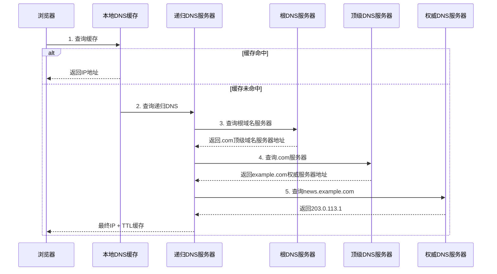
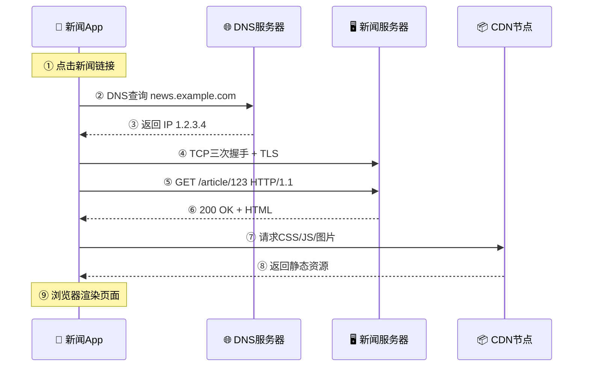

#### 目录介绍
- [01.工作案例引入](#01工作案例引入)
  - [1.1 新闻突然看不了](#11-新闻突然看不了)
  - [1.2 为何学网络协议](#12-为何学网络协议)
- [02.HTTP请求准备](#02HTTP请求准备)
  - [2.1 确定网络协议](#21-确定网络协议)
  - [2.2 构建请求URL](#22-构建请求URL)
  - [2.3 DNS解析流程](#23-DNS解析流程)
  - [2.4 HTTP请求准备](#24-HTTP请求准备)
  - [2.5 建立网络连接](#25-建立网络连接)
- [03.HTTP请求构建](#03HTTP请求构建)
  - [3.1 请求报文规范](#31-请求报文规范)
  - [3.2 创建请求行](#32-创建请求行)
  - [3.3 设置请求头](#33-设置请求头)
  - [3.4 添加请求体](#34-添加请求体)
- [04.HTTP请求发送](#04HTTP请求发送)
  - [4.1 建立网络链接](#41-建立网络链接)
  - [4.2 发送请求头](#42-发送请求头)
  - [4.3 发送请求体](#43-发送请求体)
  - [4.4 等待服务器响应](#44-等待服务器响应)
- [05.HTTP返回构建](#05HTTP返回构建)
  - [5.1 构建响应码](#51-构建响应码)
  - [5.2 构建响应头](#52-构建响应头)
  - [5.3 构建响应体](#53-构建响应体)
  - [5.4 发送响应数据](#54-发送响应数据)
- [06.页面加载和渲染](#06页面加载和渲染)
  - [6.1 解析HTML](#61-解析HTML)
  - [6.2 加载外部资源](#62-加载外部资源)
  - [6.3 渲染页面](#63-渲染页面)
  - [6.4 布局和绘制](#64-布局和绘制)
  - [6.5 页面加载完成](#65-页面加载完成)
- [07.网络协议深度分析](#07网络协议深度分析)
  - [7.1 TCP连接的细节](#71-TCP连接的细节)
  - [7.2 HTTP协议的演进](#72-HTTP协议的演进)
  - [7.3 浏览器的并发策略](#73-浏览器的并发策略)
  - [7.4 网络请求的性能指标](#74-网络请求的性能指标)
- [08.常见网络问题排查](#08常见网络问题排查)
  - [8.1 DNS解析失败](#81-DNS解析失败)
  - [8.2 连接超时分析](#82-连接超时分析)
  - [8.3 请求缓慢排查](#83-请求缓慢排查)
  - [8.4 抓包分析方法](#84-抓包分析方法)
- [09.思考题与作业](#09思考题与作业)
  - [9.1 基础思考题目](#91-基础思考题目)
  - [9.2 进阶思考题目](#92-进阶思考题目)
  - [9.3 动手实践作业](#93-动手实践作业)
## 01.工作案例引入

### 1.1 新闻突然看不了

**场景**：小张是一名工作两年的客户端工程师，负责公司新闻App的网络模块。某天用户大量投诉：**"首页一直在转圈圈，刷不出新闻"**。

小张从代码层面排查了一遍——接口URL是对的，数据格式没有变，本地缓存正常清理了，应用也重启过了。但问题依旧。

```bash
# 小张在服务器上排查
$ curl -I https://api.news.com/headlines
curl: (6) Could not resolve host: api.news.com

# ping 域名
$ ping api.news.com
ping: cannot resolve api.news.com: Unknown host

# 直接 ping IP 是通的
$ ping 8.8.8.8
64 bytes from 8.8.8.8: icmp_seq=1 ttl=117 time=12.3 ms
```

**疑惑**：网络明明是通的（能 ping 通 8.8.8.8），为什么 `api.news.com` 这个域名解析不了？昨天还好好的，今天什么都没改，怎么就崩了？

**追问链**：

- "网络能 ping 通不等于服务是好的" → 对，ping 用的是 ICMP 协议，和 HTTP 是两回事
- "那 DNS 解析失败是怎么发生的？" → DNS 查询走 UDP 53 端口，可能被运营商拦截、缓存污染、或 DNS 服务器挂了
- "为什么昨天能用，今天不能用？" → 可能运营商 DNS 服务器的缓存过期了，上游递归解析链路出了问题
- "那直接换 DNS 服务器呢？" → 把本机 DNS 改成 8.8.8.8（Google 公共 DNS），解析立刻恢复了
- "为什么改个 DNS 就好了？DNS 到底是怎么把域名解析成 IP 的？" → 这就是本章要回答的第一个问题
- "那从输入 api.news.com 到页面最终渲染出新闻，中间经历了哪些网络协议？" → DNS→TCP→TLS→HTTP→CDN→渲染，每个环节都有协议在背后工作

小张最后只用了一行命令修复——把系统的 DNS 从"自动获取"改成 `8.8.8.8`——就解决了这个让全栈工程师熬夜两小时的问题。但如果不是 DNS 问题，而是其他环节（TCP 连接、HTTPS 证书、CDN 回源）呢？

这一串追问，答案全部写在网络协议的知识体系里。

### 1.2 为何学网络协议


你每天打开新闻网站、刷短视频、网购，背后是多个网络协议在一秒内接力完成的。但大部分开发者只看到 `fetch()` 或 `axios` 这一层，从不去想：

- 为什么有时候刷不出页面，但微信还能发？
- 为什么同一个 App 在公司 WiFi 飞快，切 4G 就卡？
- 为什么加了 CDN 后页面快了很多？CDN 是怎么"加速"的？
- 为什么 HTTPS 比 HTTP 安全？多花的那些时间值不值？
- 为什么打开一个页面要发几十个 HTTP 请求？

本章的目标，就是用一个"看新闻"的全流程串联 TCP/IP 协议栈的每一层：

- **应用层**：HTTP 请求和响应是怎么构造的？状态码、请求头、Cookie 背后是什么？
- **传输层**：TCP 怎么保证可靠性？三次握手为什么是三次？Keep-Alive 怎么复用？
- **网络层**：IP 地址怎么找到目标服务器？DNS 怎么把域名变成 IP？
- **协议演进**：为什么会有 HTTP/2、HTTP/3？每一代解决了什么问题？
- **问题排查**：当网站打不开时，怎么用所学知识一步步定位根因？

带着这五个问题，我们从一个 DNS 事故开始，跟着一次"看新闻"的请求流程层层深入。


## 02.HTTP请求准备

### 2.0 核心原理：HTTP的本质

HTTP全称是超文本传输协议（HyperText Transfer Protocol），但这个名字掩盖了它真正的设计理念。HTTP的本质不是"传输超文本"，而是**一种无状态的、基于请求-响应模型的、可扩展的应用层协议**。

**无状态**意味着服务器不会记住你上次请求了什么——每次请求都是独立的。这听起来像缺点，但正是这个设计让HTTP可以无限水平扩展（任何服务器都能处理任何请求，不需要共享会话状态）。Cookie和Session是后来在应用层补上的状态机制，不是协议本身的能力。

**请求-响应模型**意味着通信永远是客户端发起，服务器被动响应。在HTTP/2之前，如果你不主动请求，服务器无法主动推送数据给你——这是WebSocket诞生的根本原因（见第16篇）。

**可扩展性**体现在HTTP Header的设计上：通过增加新的Header字段（如`X-Forwarded-For`），可以在不改变协议核心的情况下扩展功能。HTTP/1.1到HTTP/3经历三十年的演进，Header机制几乎没有变过——这是协议设计中最成功的部分。

### 2.1 确定网络协议

当用户访问新闻网站时，从输入URL到页面完全渲染，背后涉及一系列复杂的技术流程。

本文将以访问 www.163.com 为例，详细描述整个网络请求流程，涵盖DNS解析、TCP/TLS连接、HTTP协议通信、服务器处理、客户端渲染等关键环节。

### 2.1 确定网络协议

HTTP协议，几乎是每个人上网用的第一个协议，同时也是很容易被人忽略的协议。

既然说看新闻，咱们就先登录 http://www.163.com。http://www.163.com 是个URL，叫作统一资源定位符。之所以叫统一，是因为它是有格式的。

HTTP称为协议，www.163.com 是一个域名，表示互联网上的一个位置。有的URL会有更详细的位置标识，

例如 http://www.163.com/index.html 正是因为这个东西是统一的，所以当你把这样一个字符串输入到浏览器的框里的时候，浏览器才知道如何进行统一处理。

### 2.2 构建请求URL

浏览器首先对用户输入的URL进行解析：

```javascript
// 示例URL结构
https://163.com:443/headlines/2024?category=politics#breaking-news
```

- **协议方案**：`https`（默认端口443）
- **主机名**：`163.com`
- **端口**：`:443`（HTTPS默认，可省略）
- **路径**：`/headlines/2024`
- **查询参数**：`category=politics`
- **片段标识**：`#breaking-news`（客户端定位用）

### 2.3 DNS解析流程

浏览器会将 www.163.com 这个域名发送给DNS服务器，让它解析为IP地址。有关DNS的过程，其实非常复杂，这里先不管，反正它会被解析成为IP地址。

浏览器需要将域名转换为IP地址：



**详细步骤**：

1. **浏览器缓存检查**：检查最近访问过的域名缓存
2. **系统缓存检查**：`/etc/hosts`文件及系统DNS缓存
3. **路由器缓存**：家用路由器可能缓存DNS记录
4. **ISP DNS服务器**：互联网服务提供商的递归DNS查询
5. **递归查询链**：根DNS→顶级域→权威DNS

### 2.4 HTTP请求准备

那接下来是发送HTTP请求吗？不是的，HTTP是基于TCP协议的，当然是要先建立TCP连接了，怎么建立呢？还记得三次握手吗？

目前使用的HTTP协议大部分都是1.1。在1.1的协议里面，默认是开启了Keep-Alive的，这样建立的TCP连接，就可以在多次请求中复用。

学习了TCP之后，你应该知道，TCP的三次握手和四次挥手，还是挺费劲的。如果好不容易建立了连接，然后就做了一点儿事情就结束了，有点儿浪费人力和物力。

### 2.5 建立网络连接

TCP三次握手建立连接

```text
# TCP三次握手流程
客户端 -> 服务器: SYN, Seq=1000, Win=65535
服务器 -> 客户端: SYN-ACK, Seq=2000, Ack=1001, Win=65535
客户端 -> 服务器: ACK, Seq=1001, Ack=2001, Win=65535
# 连接建立，MSS=1460字节
```

TLS握手建立安全连接

```yaml
# TLS 1.3握手流程（简化）：
1. ClientHello:
   - 支持的TLS版本
   - 客户端随机数
   - 支持的密码套件
   - SNI: news.example.com

2. ServerHello:
   - 选择的TLS版本
   - 服务器随机数
   - 选择的密码套件
   - 服务器证书链
   - 公钥

3. 密钥交换:
   - 客户端生成预主密钥
   - 用服务器公钥加密传输
   - 双方生成会话密钥

4. 完成握手:
   - ChangeCipherSpec通知
   - Finished消息验证
```

## 03.HTTP请求构建

### 3.1 请求报文规范

建立了连接以后，浏览器就要发送HTTP的请求，请求的格式就像这样。

（图示：HTTP请求报文的三部分结构——请求行、请求头、请求正文）

HTTP的报文大概分为三大部分。

第一部分是请求行，第二部分是请求的首部，第三部分才是请求的正文实体。

```http
GET /headlines/2024?category=politics HTTP/1.1
Host: 163.com
User-Agent: Mozilla/5.0 (Windows NT 10.0; Win64; x64) AppleWebKit/537.36
Accept: text/html,application/xhtml+xml,application/xml;q=0.9,image/webp,*/*;q=0.8
Accept-Encoding: gzip, deflate, br
Accept-Language: zh-CN,zh;q=0.9,en;q=0.8
Connection: keep-alive
Upgrade-Insecure-Requests: 1
Sec-Fetch-Dest: document
Sec-Fetch-Mode: navigate
Sec-Fetch-Site: none
Cache-Control: max-age=0
Cookie: session_id=abc123; user_pref=dark_mode
```

### 3.2 创建请求行

在请求行中，URL就是 http://www.163.com，版本为HTTP 1.1。这里要说一下的，就是方法。方法有几种类型呢？

对于访问网页来讲，最常用的类型就是GET。顾名思义，GET就是去服务器获取一些资源。对于访问网页来讲，要获取的资源往往是一个页面。其实也有很多其他的格式，比如说返回一个JSON字符串，到底要返回什么，是由服务器端的实现决定的。

另外一种类型叫做POST。它需要主动告诉服务端一些信息，而非获取。要告诉服务端什么呢？一般会放在正文里面。正文可以有各种各样的格式。常见的格式也是JSON。

还有一种类型叫PUT，就是向指定资源位置上传最新内容。但是，HTTP的服务器往往是不允许上传文件的，所以PUT和POST就都变成了要传给服务器东西的方法。

在实际使用过程中，这两者还会有稍许的区别。POST往往是用来创建一个资源的，而PUT往往是用来修改一个资源的。例如，云主机已经创建好了，我想对这个云主机打一个标签，说明这个云主机是生产环境的，另外一个云主机是测试环境的。那怎么修改这个标签呢？往往就是用PUT方法。

再有一种常见的就是DELETE。这个顾名思义就是用来删除资源的。例如，我们要删除一个云主机，就会调用DELETE方法。

### 3.3 设置请求头

请求行下面就是我们的首部字段。首部是key value，通过冒号分隔。这里面，往往保存了一些非常重要的字段。

1. 例如，Accept-Charset，表示客户端可以接受的字符集，防止传过来的是另外的字符集，从而导致出现乱码。
2. 再如，Content-Type是指正文的格式。例如，我们进行POST的请求，如果正文是JSON，那么我们就应该将这个值设置为JSON。

这里需要重点说一下的就是缓存。为啥要使用缓存呢？

那是因为一个非常大的页面有很多东西。例如，我浏览一个商品的详情，里面有这个商品的价格、库存、展示图片、使用手册等等。商品的展示图片会保持较长时间不变，而库存会根据用户购买的情况经常改变。如果图片非常大，而库存数非常小，如果我们每次要更新数据的时候都要刷新整个页面，对于服务器的压力就会很大。

在HTTP头里面，Cache-control是用来控制缓存的。当客户端发送的请求中包含max-age指令时，如果判定缓存层中，资源的缓存时间数值比指定时间的数值小，那么客户端可以接受缓存的资源；当指定max-age值为0，那么缓存层通常需要将请求转发给应用集群。

目前为止，我们仅仅是拼凑起来了HTTP请求的报文格式，接下来，浏览器会把它交给下一层传输层。怎么交给传输层呢？其实也无非是用Socket这些东西，只不过用的浏览器里，这些程序不需要你自己写，有人已经帮你写好了。

### 3.4 添加请求体

请求体（Request Body）是 HTTP 请求中携带实际数据的部分，主要用于 POST、PUT 等方法。

**什么时候需要请求体？**

- GET 请求通常不包含请求体，参数通过 URL 的 query string 传递
- POST 请求的参数放在请求体中，更适合传递大量数据或敏感信息
- PUT 请求的请求体用于传递需要更新的完整资源内容

**请求体的常见格式**

| Content-Type | 格式说明 | 典型场景 |
|---|---|---|
| `application/json` | JSON格式 | REST API交互 |
| `application/x-www-form-urlencoded` | 键值对，`&`分隔 | 表单提交 |
| `multipart/form-data` | 多部分表单 | 文件上传 |
| `text/xml` | XML格式 | SOAP接口 |

以表单提交为例，请求体的格式如下：

```http
POST /login HTTP/1.1
Host: www.example.com
Content-Type: application/x-www-form-urlencoded
Content-Length: 35

username=zhangsan&password=abc123
```

以 JSON 格式为例：

```http
POST /api/users HTTP/1.1
Host: www.example.com
Content-Type: application/json
Content-Length: 52

{"username":"zhangsan","email":"zs@example.com"}
```

请求体和请求头之间必须有一个**空行**作为分隔，这是 HTTP 协议的硬性规定。没有这个空行，服务器无法区分头部和正文的边界。


## 04.HTTP请求发送

### 4.1 建立网络链接

浏览器使用TCP/IP协议与服务器建立网络连接。这涉及到解析主机名为IP地址、建立TCP连接等步骤。

在HTTP中，建立网络连接涉及到客户端和服务器之间的通信过程。以下是HTTP建立网络连接的一般步骤：

1. 客户端发起连接：客户端（例如浏览器）向服务器发起连接请求。这通常是通过建立TCP连接来实现的，使用服务器的IP地址和端口号。 
2. 服务器响应连接：服务器接收到客户端的连接请求后，可以选择接受或拒绝连接。如果服务器接受连接，它会发送一个确认响应给客户端。 
3. TCP握手：一旦服务器确认连接，客户端和服务器之间进行TCP握手。这是一个三次握手的过程，用于建立可靠的双向通信通道。

### 4.2 发送请求头

浏览器将构建好的HTTP请求头发送给服务器。发送请求头是客户端向服务器发送包含请求信息的头部字段的过程。常见的请求头部字段包括：

1. User-Agent：标识客户端的用户代理，通常是浏览器的名称和版本号。 
2. Accept：指定客户端能够接受的响应内容类型，如文本、图像、视频等。 
3. Content-Type：指定请求体中的数据类型，如表单数据、JSON、XML等。 
4. Authorization：用于身份验证的凭据，如基本身份验证的用户名和密码。 
5. Cookie：包含客户端的Cookie信息，用于会话跟踪和状态管理。 
6. Referer：指示请求的来源页面的URL。 
7. Cache-Control：指定缓存策略，如是否允许缓存、缓存的有效期等。

添加其他自定义头部字段：根据需要，可以添加其他自定义的头部字段，以传递额外的请求信息。

将请求头部字段添加到请求中：将构建好的请求头部字段添加到HTTP请求中。这通常是通过在请求的头部部分添加相应的字段行来实现的。

发送请求：将包含请求头部的完整HTTP请求发送给服务器。这可以通过TCP连接发送请求报文来实现。

### 4.3 发送请求体

1. 构建请求体数据：根据需要，构建包含请求数据的请求体。请求体可以是各种格式的数据，如表单数据、JSON、XML等。
2. 编码请求体数据：根据请求体的数据格式，对数据进行适当的编码。例如，对表单数据可以使用URL编码，对JSON数据可以使用JSON编码。
3. 设置Content-Type头部字段：在请求头部中设置Content-Type字段，指定请求体数据的类型。例如，对于表单数据，Content-Type可以是application/x-www-form-urlencoded；对于JSON数据，可以是application/json。
4. 将编码后的请求体数据添加到请求中：将编码后的请求体数据添加到HTTP请求中的请求体部分。这通常是在请求的头部和请求体之间使用一个空行分隔，然后将请求体数据放置在空行之后。
5. 发送请求：将包含请求体的完整HTTP请求发送给服务器。这可以通过TCP连接发送请求报文来实现。

### 4.4 等待服务器响应

在HTTP中，发送请求后，客户端通常需要等待服务器的响应。以下是一般的等待服务器响应的过程：

1. 发送请求：客户端将构建好的HTTP请求发送给服务器。这可以通过TCP连接发送请求报文来实现。
2. 等待服务器响应：一旦请求发送完成，客户端会进入等待状态，等待服务器的响应。这期间，客户端的连接保持打开状态，以便接收服务器的响应。
3. 服务器处理请求：服务器接收到客户端的请求后，会根据请求的内容和服务器上的资源进行处理。这可能涉及数据库查询、计算、文件读写等操作，具体处理时间取决于服务器的性能和负载情况。 
4. 生成响应：服务器处理完请求后，会生成相应的HTTP响应。响应包括状态码、头部字段和响应体。

到了第四步之后，就会去返回构建信息。

## 05.HTTP返回构建

### 5.1 构建响应码

| 类别 | 状态码 | 说明 | 常见示例 |
|------|--------|------|----------|
| 1xx | 100-199 | 信息响应 | 100 Continue |
| 2xx | 200-299 | 成功响应 | 200 OK, 201 Created |
| 3xx | 300-399 | 重定向 | 301 Moved, 304 Not Modified |
| 4xx | 400-499 | 客户端错误 | 404 Not Found, 403 Forbidden |
| 5xx | 500-599 | 服务器错误 | 500 Internal Error |

### 5.2 构建响应头

服务器返回响应时，会在响应头中包含大量控制信息：

```http
HTTP/1.1 200 OK
Date: Fri, 10 Apr 2026 08:00:00 GMT
Server: nginx/1.24.0
Content-Type: text/html; charset=utf-8
Content-Length: 52680
Content-Encoding: gzip
Cache-Control: max-age=300
ETag: "abc123def456"
Connection: keep-alive
Set-Cookie: session_id=xyz; Path=/; HttpOnly; Secure
```

重要响应头字段说明：

| 字段 | 作用 |
|------|------|
| Content-Type | 告诉浏览器返回内容的类型和编码 |
| Content-Encoding | 数据压缩方式（gzip/br），减少传输体积 |
| Cache-Control | 缓存策略，控制浏览器是否缓存以及缓存多久 |
| ETag | 资源的唯一标识，用于协商缓存 |
| Set-Cookie | 服务器向浏览器写入Cookie |
| Connection | keep-alive表示保持TCP连接，复用于后续请求 |

### 5.3 构建响应体

响应体是服务器返回的实际内容。对于新闻网站首页来说，响应体通常是一段HTML文档：

```html
<!DOCTYPE html>
<html>
<head>
    <meta charset="utf-8">
    <title>网易新闻</title>
    <link rel="stylesheet" href="/css/main.css">
</head>
<body>
    <header>导航栏</header>
    <main>
        <article>新闻标题和内容...</article>
    </main>
    <script src="/js/app.js"></script>
</body>
</html>
```

响应体的传输有两种方式：

1. **Content-Length方式**：预先告知内容长度，浏览器接收指定长度后即认为传输完成
2. **Chunked Transfer方式**：分块传输，适用于动态生成内容（服务器事先不知道总长度）

### 5.4 发送响应数据

服务器构建好响应后，通过以下步骤发送给客户端：

1. **TCP分段**：响应数据可能很大（如一个HTML页面有几十KB），TCP层会将其分成多个报文段（Segment），每个段不超过MSS（通常1460字节）
2. **IP封装**：每个TCP段加上IP头，形成IP数据包
3. **逐跳转发**：数据包沿着路由路径，一跳一跳地回到客户端
4. **TCP重组**：客户端的TCP层根据序列号将收到的段重新组装成完整的响应数据
5. **交付应用层**：组装完成后，TCP将数据交给浏览器的HTTP处理模块

## 06.页面加载和渲染

### 6.1 解析HTML

浏览器收到HTML响应后，开始解析。解析器将HTML文本转化为**DOM树**（Document Object Model）：

```text
HTML文本 → 词法分析（Tokenizer）→ 生成Token → 构建DOM树

DOM树示例：
Document
  └── html
        ├── head
        │     ├── meta
        │     ├── title → "网易新闻"
        │     └── link (rel="stylesheet")
        └── body
              ├── header → "导航栏"
              ├── main
              │     └── article → "新闻内容..."
              └── script (src="/js/app.js")
```

解析过程中有两个关键行为：

1. **遇到`<link>`标签**：浏览器会发起新的HTTP请求去加载CSS文件，但不会阻塞HTML的继续解析
2. **遇到`<script>`标签**：浏览器会暂停HTML解析，先下载并执行JS脚本（因为JS可能修改DOM结构）

### 6.2 加载外部资源

一个典型的新闻页面需要加载的外部资源：

| 资源类型 | 数量级 | 加载方式 |
|---------|--------|---------|
| CSS文件 | 3~10个 | 并行下载，不阻塞DOM解析 |
| JS文件 | 5~20个 | 默认阻塞DOM解析，async/defer可异步 |
| 图片 | 20~100张 | 延迟加载，滚动到可视区域才加载 |
| 字体 | 1~3个 | 异步加载 |

浏览器加载外部资源遵循以下规则：

1. **同域名并发限制**：HTTP/1.1下，浏览器对同一域名最多保持6个TCP连接
2. **资源优先级**：CSS和主要JS的优先级高于图片
3. **预加载提示**：`<link rel="preload">`可以告诉浏览器提前加载关键资源

HTTP/2通过**多路复用**解决了并发限制问题：在一个TCP连接上可以同时传输多个资源。

### 6.3 渲染页面

浏览器的渲染过程：

```text
DOM树 + CSSOM树 → 渲染树（Render Tree）→ 布局（Layout）→ 绘制（Paint）→ 合成（Composite）
```

详细步骤：

1. **构建CSSOM**：解析CSS文件，生成CSS对象模型（CSSOM树）
2. **合并渲染树**：将DOM树和CSSOM树合并，生成渲染树。渲染树只包含可见元素（`display:none`的元素不包含在内）
3. **计算样式**：确定每个元素的最终样式（包括继承、层叠等规则）

### 6.4 布局和绘制

**布局（Layout/Reflow）**：计算渲染树中每个元素的精确位置和大小。

布局需要计算的信息：

- 元素的位置（x, y坐标）
- 元素的尺寸（宽度、高度）
- 元素之间的关系（浮动、定位、flex布局）

**绘制（Paint）**：将布局结果转化为屏幕上的像素。绘制分为多个图层：

```text
背景色 → 背景图 → 边框 → 子元素 → 轮廓
```

**合成（Composite）**：将多个图层合成为最终的页面图像。GPU加速的CSS属性（如`transform`、`opacity`）会单独分配图层，提高渲染性能。

性能提示：避免频繁触发布局（Reflow），因为布局的计算成本远高于绘制。

### 6.5 页面加载完成

页面加载完成会触发一系列事件：

1. **DOMContentLoaded事件**：HTML解析完成，DOM树构建完毕（此时CSS和图片可能还在加载）
2. **load事件**：所有资源（CSS、图片、字体等）全部加载完成
3. **First Contentful Paint（FCP）**：浏览器首次渲染出内容（文字或图片）
4. **Largest Contentful Paint（LCP）**：最大内容元素渲染完成

从输入URL到页面完全展示的时间线总结：

```text
0ms     DNS解析（通常有缓存，<1ms）
5ms     TCP三次握手（~1 RTT）
10ms    TLS握手（HTTPS，~1-2 RTT）
15ms    发送HTTP请求
20ms    服务器处理请求（数据库查询等）
50ms    接收HTTP响应（HTML文档）
55ms    解析HTML，开始并行加载CSS/JS
100ms   CSS加载完成，开始渲染
150ms   首次内容绘制（FCP）
500ms   图片等资源陆续加载
1000ms  页面完全加载（load事件）
```


## 07.网络协议深度分析

### 7.1 TCP连接的细节

当浏览器访问新闻网站时，TCP连接的建立和管理涉及许多细节。

**疑惑：为什么TCP握手是三次而不是两次？**

**答疑**：两次握手无法确认双方的收发能力都正常。假设只有两次握手：

```text
两次握手的问题：
  客户端发送SYN → 在网络中延迟
  客户端以为超时，重新建立连接并完成通信
  很久之后，第一个SYN到达服务端
  服务端以为是新请求，回复SYN+ACK → 两次握手完成
  服务端等待数据... 但客户端根本不会发数据
  → 服务端白白浪费资源维护一个"幽灵连接"

三次握手解决：
  第三次握手由客户端确认，客户端知道自己不需要这个连接
  所以不会发送第三个ACK，服务端不会建立虚假连接
```

**TCP连接复用与HTTP Keep-Alive**：

```text
不使用Keep-Alive（HTTP/1.0默认）：
  请求1：TCP握手 → HTTP请求/响应 → TCP挥手
  请求2：TCP握手 → HTTP请求/响应 → TCP挥手
  请求3：TCP握手 → HTTP请求/响应 → TCP挥手
  每次请求都有3RTT的连接建立/释放开销

使用Keep-Alive（HTTP/1.1默认）：
  TCP握手 → HTTP请求1/响应1 → HTTP请求2/响应2 → ... → TCP挥手
  多次请求复用同一个TCP连接，只需一次握手
  
  效果：加载一个包含50个资源的页面
  不用Keep-Alive：50次握手 = 150RTT额外开销
  使用Keep-Alive：6次握手（6个并发连接）= 18RTT
```

### 7.2 HTTP协议的演进

从HTTP/1.0到HTTP/3，每一代协议都在解决上一代的性能瓶颈：

```text
HTTP/1.0 → HTTP/1.1（1997年）
  解决：短连接问题
  方案：默认Keep-Alive，连接复用

HTTP/1.1 → HTTP/2（2015年）
  解决：队头阻塞、头部冗余
  方案：二进制帧、多路复用、头部压缩、服务器推送

HTTP/2 → HTTP/3（2022年）
  解决：TCP层的队头阻塞
  方案：基于QUIC（UDP），0-RTT连接，独立流
```

**以访问新闻页面为例的对比**：

| 特性 | HTTP/1.1 | HTTP/2 | HTTP/3 |
|------|---------|--------|--------|
| 连接数 | 6个TCP连接 | 1个TCP连接 | 1个QUIC连接 |
| 请求并发 | 6个并行 | 无限并行 | 无限并行 |
| 头部大小 | 完整发送（~800B） | 压缩后（~20B） | 压缩后（~20B） |
| 首次连接延迟 | 1RTT(TCP) | 1RTT(TCP)+1RTT(TLS) | 1RTT(含加密) |
| 丢包影响 | 阻塞当前连接 | 阻塞整个TCP连接 | 仅阻塞丢包的流 |

### 7.3 浏览器的并发策略

浏览器在加载页面资源时采用了精心设计的并发策略：

```text
浏览器资源加载优先级：

最高优先级：
  HTML文档本身
  CSS文件（首屏渲染依赖）
  首屏内嵌的JS

高优先级：
  JS文件（通常阻塞DOM解析）
  字体文件

中优先级：
  图片（首屏可见区域内的）

低优先级：
  图片（非首屏的，如懒加载）
  预加载资源（prefetch）
  Analytics等非关键脚本
```

**HTTP/1.1的域名分片技术**：

由于HTTP/1.1下浏览器对同一域名限制最多6个并发连接，聪明的做法是将资源分布到多个域名上：

```text
主站：   www.news.com     → HTML、核心JS/CSS
静态资源：static.news.com  → 图片、字体
CDN 1：  img1.news.com    → 商品图片
CDN 2：  img2.news.com    → 广告图片

每个域名6个连接 × 4个域名 = 24个并发请求
```

HTTP/2下这种技巧反而有害——多个TCP连接会增加握手开销且无法共享头部压缩上下文。HTTP/2建议将资源集中在同一个域名下。

### 7.4 网络请求的性能指标

衡量一个网页的网络性能，需要关注以下核心指标：

| 指标 | 缩写 | 含义 | 目标值 |
|------|------|------|--------|
| DNS解析时间 | - | 域名到IP的解析耗时 | < 20ms |
| TCP连接时间 | - | 三次握手耗时 | < 50ms |
| TLS握手时间 | - | 安全连接建立耗时 | < 100ms |
| 首字节时间 | TTFB | 发送请求到收到第一个字节 | < 200ms |
| 首次内容绘制 | FCP | 第一个内容元素出现 | < 1.8s |
| 最大内容绘制 | LCP | 最大可见内容渲染完成 | < 2.5s |
| 累积布局偏移 | CLS | 页面元素的视觉稳定性 | < 0.1 |

**使用浏览器开发者工具分析网络性能**：

```text
Chrome DevTools → Network面板：

每个请求的时间线组成：
  Queueing    → 请求在队列中等待
  Stalled     → 请求被阻塞（等待TCP连接）
  DNS Lookup  → DNS解析
  Initial Connection → TCP握手
  SSL         → TLS握手
  Request sent → 发送请求
  Waiting (TTFB) → 等待服务器响应
  Content Download → 下载响应内容

重点关注：
  TTFB过高 → 服务器处理慢或网络延迟大
  Content Download过高 → 响应体积太大或带宽不足
  Queueing过高 → 并发请求太多，被浏览器排队
```


## 08.常见网络问题排查

### 8.1 DNS解析失败

DNS问题是最常见的网络故障之一，表现为"网站打不开"但网络本身是通的。

```text
DNS故障排查步骤：

1. 确认是否是DNS问题
   ping www.163.com  → 如果解析失败，说明是DNS问题
   ping 8.8.8.8      → 如果成功，说明网络本身是通的

2. 检查DNS配置
   查看当前DNS服务器设置
   尝试手动指定DNS：nslookup www.163.com 8.8.8.8

3. 清除DNS缓存
   Windows: ipconfig /flushdns
   macOS:   dscacheutil -flushcache
   Chrome:  chrome://net-internals/#dns → Clear host cache

4. 常见原因和解决
   运营商DNS故障 → 换用公共DNS（8.8.8.8 / 223.5.5.5）
   DNS被劫持     → 使用DoH加密DNS
   hosts文件篡改 → 检查并清理hosts文件
```

### 8.2 连接超时分析

连接超时通常发生在TCP握手阶段或TLS握手阶段。

```text
连接超时的常见原因：

1. 服务器端口未开放
   SYN包发出后收不到SYN+ACK → 多次重试后超时
   排查：telnet host port 或 nc -zv host port

2. 防火墙拦截
   数据包被中间防火墙丢弃
   排查：traceroute查看在哪一跳丢失

3. 服务器负载过高
   accept队列满（backlog不够），新连接被丢弃
   排查：检查服务器netstat -s中的overflowed计数

4. 网络拥塞
   数据包在传输过程中丢失
   排查：ping检查丢包率和延迟
```

### 8.3 请求缓慢排查

页面加载慢不一定是网络问题，需要定位具体瓶颈：

| 阶段 | 慢的表现 | 可能原因 | 排查方法 |
|------|---------|---------|---------|
| DNS | TTFB前有长时间等待 | DNS服务器慢 | dig命令查耗时 |
| 连接 | Initial Connection耗时长 | 服务器距离远 | ping查看RTT |
| 等待 | TTFB高 | 服务端处理慢 | 查看服务端日志 |
| 下载 | Content Download长 | 响应体太大 | 启用压缩/减小体积 |
| 渲染 | 白屏时间长 | JS阻塞渲染 | 使用defer/async |

### 8.4 抓包分析方法

当常规手段无法定位问题时，抓包分析是终极武器。

```text
常用抓包工具：

1. Chrome DevTools Network
   适合：Web页面调试
   优点：可视化好，支持筛选
   局限：只能看HTTP层

2. Wireshark
   适合：深入协议分析
   优点：能看到TCP/IP每一层的细节
   常用过滤器：
     tcp.port == 443         → 过滤HTTPS流量
     dns                     → 只看DNS
     tcp.analysis.retransmission → 找重传包

3. tcpdump
   适合：服务器端抓包
   常用命令：
     tcpdump -i eth0 port 80 -w capture.pcap
     然后用Wireshark打开pcap文件分析
```

**一个典型的慢请求抓包分析案例**：

```text
通过Wireshark分析发现：
  SYN → SYN+ACK 延迟200ms（正常应<50ms）
  → 说明服务器响应慢或距离远
  
  服务器返回的数据分成了很多小包（每个<100字节）
  → 说明服务端没有合并响应，Nagle算法可能被禁用
  
  有3次TCP重传
  → 说明网络存在丢包，可能是链路质量差

结论：需要将服务器迁移到离用户更近的位置（或使用CDN）
```

通过访问一个新闻网站的完整流程分析，我们将网络协议从理论到实践做了一次完整的串联。每一个环节——从DNS解析到TCP连接，从HTTP请求到页面渲染——都是网络协议知识的真实应用场景。

---

## 10.综合案例：从看新闻到排查全链路

### 10.1 回到起点

回到开篇的场景：你在手机上点开一条新闻链接，结果页面一直转圈不显示。现在你已经读完了这台"传输机器"的全部零件，我们来把这个故障完整走一遍。



### 10.2 故障诊断树

新闻打不开？按这个顺序排查，每一步对应本章的一个知识点：

| 步骤 | 检查项 | 对应本章 | 常见原因 |
|---|---|---|---|
| ① | 手机有网吗？ | §2.1 网络协议基础 | WiFi断开、移动数据关闭 |
| ② | DNS能解析吗？ | §2.3 DNS解析流程 | DNS服务器故障、域名过期 |
| ③ | TCP能连上吗？ | §2.5 建立网络连接 | 服务器宕机、防火墙拦截 |
| ④ | HTTP请求发出去了吗？ | §3-4 HTTP请求构建/发送 | 请求格式错误、超时 |
| ⑤ | 服务器响应了吗？ | §5 HTTP返回构建 | 500内部错误、后端崩溃 |
| ⑥ | 页面资源加载了吗？ | §6 页面加载 | CDN故障、JS阻塞渲染 |

### 10.3 全章知识串联

本章从一次"新闻打不开"的日常故障出发，把`HTTP`的完整生命周期拆成了九个环节：**输入URL → DNS解析 → TCP连接 → TLS握手 → HTTP请求 → 服务器处理 → HTTP响应 → 资源加载 → 页面渲染**。每一步都有对应的网络层次和协议。下次排查问题时，不要凭直觉乱试，对着这个链条逐环排查——定位速度至少快三倍。

## 09.思考题与作业

### 9.1 基础思考题目

1. **DNS 解析过程**：画出一张图，从浏览器输入 `www.163.com` 到获得 IP 地址，列出每一步涉及的 DNS 服务器类型。如果本地 `/etc/hosts` 文件中配置了 `127.0.0.1 www.163.com`，DNS 查询会怎么走？

2. **TCP 三次握手**：为什么是三次不是两次？为什么不是四次？假设一个客户端发送 SYN 后，收到了 SYN+ACK，但最后一个 ACK 在网络中丢失了——这个连接在服务端和客户端分别是什么状态？

3. **HTTP 请求流程**：列出一次 `GET https://www.163.com/index.html` 从输入到页面加载完成，涉及的所有协议（从应用层到链路层），并标注每层的主要职责。

4. **HTTP 状态码**：以下场景分别返回什么状态码：
   - 请求的资源不存在
   - 请求的资源被永久移到了新 URL
   - 服务器内部抛出异常
   - 请求的资源未修改（缓存可用）
   - 请求的 URL 需要登录才能访问

5. **Keep-Alive 的作用**：HTTP/1.1 默认开启 Keep-Alive。如果一个页面上有 100 个资源（图片、CSS、JS），在 Keep-Alive 开启和关闭两种情况下，分别需要多少个 TCP 连接？假设浏览器对同一域名的并发连接限制为 6 个。

### 9.2 进阶思考题目

1. **1.1 节复盘**：小张的新闻 App DNS 故障。如果换成 HTTPS，DNS 劫持是否还会影响？HTTPS 能防 DNS 劫持吗？（提示：区分"域名解析"和"通信加密"两个层面）

2. **CDN 加速原理**：新闻网站的图片通常通过 CDN 分发。CDN 是怎么知道"北京的用户从最近的节点拿图片"的？全局负载均衡（GSLB）是怎么通过 DNS 实现的？和 1.1 节的 DNS 故障有什么关系？

3. **HTTP/2 多路复用的真相**：都说 HTTP/2 解决了 HTTP/1.1 的队头阻塞，但 HTTP/2 在 TCP 层面仍有队头阻塞——为什么？HTTP/3 的 QUIC 又是怎么彻底解决这个问题的？

4. **tcpdump 抓包分析**：如果你在服务器上执行 `curl https://www.163.com`，用 `tcpdump -i eth0 port 443` 抓包，你会看到哪些包的交互序列？请从 TCP 三次握手、TLS 握手、HTTP 请求响应三个阶段分别写出期望看到的包类型。

5. **移动端网络优化**：新闻 App 在弱网环境（如地铁、电梯）下，用户经常看到"加载中"转圈。从网络协议的角度，你能给出哪些优化方案？（提示：考虑 DNS 预解析、连接复用、预加载、HTTP/2 Server Push）

### 9.3 动手实践作业

**作业一（必做）**：用开发者工具分析真实页面。

```bash
# 打开 Chrome DevTools → Network 面板
# 访问 https://www.163.com
# 截图并回答以下问题：
1. 总共发了多少个 HTTP 请求？
2. 使用了多少个不同的域名？
3. 首字节时间（TTFB）是多少？
4. 有没有使用 HTTP/2？（查看 Protocol 列）
5. 有没有资源通过 CDN 加载？（查看 IP 归属）
```

**作业二（选做）**：DNS 排查实战。

```bash
# 1. 用 dig 命令查看 www.163.com 的 DNS 解析过程
dig www.163.com +trace

# 2. 用 nslookup 分别使用 8.8.8.8 和 223.5.5.5（阿里 DNS）查询同一个域名
nslookup www.163.com 8.8.8.8
nslookup www.163.com 223.5.5.5

# 3. 对比两次查询结果的时间差异
# 如果两个 DNS 服务器返回了不同的 IP，说明了什么？
```

**作业三（选做）**：模拟 1.1 节的 DNS 故障。

```bash
# 1. 修改 /etc/hosts 文件（需要 root），把 www.163.com 指向一个错误的 IP
echo "127.0.0.2 www.163.com" >> /etc/hosts

# 2. 用 curl 访问，观察返回结果
curl -v https://www.163.com

# 3. 然后用正确的 IP 替换回来，再次对比
# 4. 分析：为什么 hosts 文件的优先级比 DNS 高？这个机制的设计初衷是什么？
```

**作业四（架构思考）**：对你当前负责的一个服务，画出它的"网络协议全景图"。

- 从"用户请求"到"服务返回"，中间经过了哪些网络设备和协议层？
- 标注每一个环节的协议、延迟量级（如 DNS 20ms、TCP 30ms、TLS 50ms）
- 当前瓶颈在哪？如果流量增加 10 倍，哪个环节会先扛不住？为什么？
