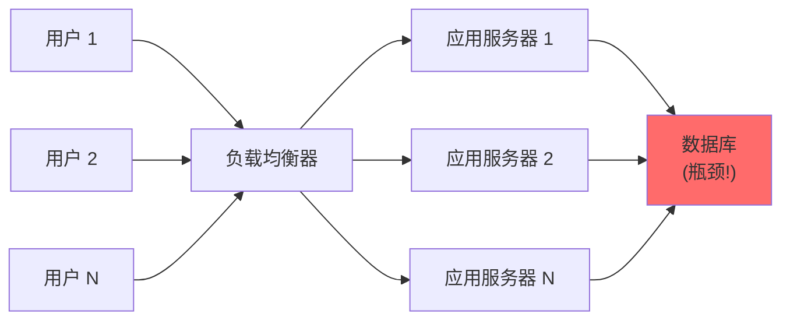
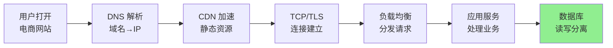
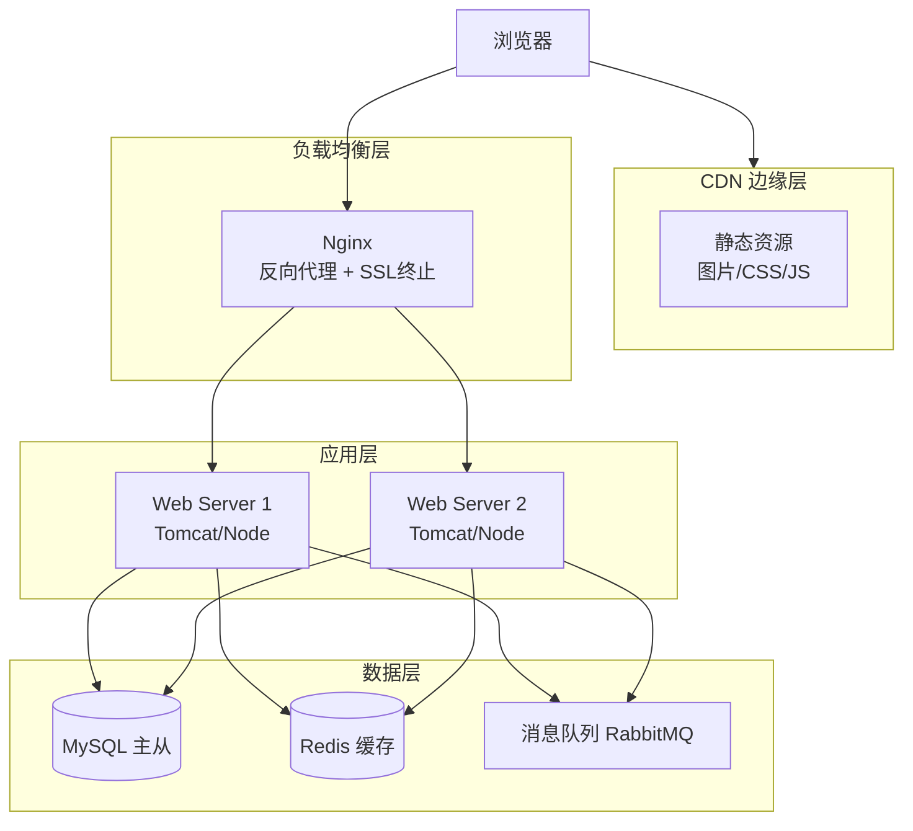

# 04.从0到1部署电商网站
#### 目录介绍
- [01.工作案例引入](#01工作案例引入)
  - [1.1 双11宕机事故](#11-双11宕机事故)
  - [1.2 为什么要学部署电商](#12-为什么要学部署电商)
- [02.部署电商平台](#02部署电商平台)
  - [2.1 部署多个站点](#21-部署多个站点)
  - [2.2 搭建服务器](#22-搭建服务器)
  - [2.3 配置路由策略](#23-配置路由策略)
  - [2.4 创建数据管理](#24-创建数据管理)
  - [2.5 部署代码程序](#25-部署代码程序)
  - [2.6 负载均衡设置](#26-负载均衡设置)
- [03.告诉全网我是谁](#03告诉全网我是谁)
  - [3.1 购买域名](#31-购买域名)
  - [3.2 BGP路由协议](#32-BGP路由协议)
  - [3.3 了解交换机](#33-了解交换机)
  - [3.4 路由器](#34-路由器)
  - [3.5 运营商连接](#35-运营商连接)
- [04.域名解析去上网](#04域名解析去上网)
  - [4.1 域名认证和鉴权](#41-域名认证和鉴权)
  - [4.2 分配ip地址](#42-分配ip地址)
  - [4.3 域名解析流程](#43-域名解析流程)
  - [4.4 DNS和负载均衡](#44-DNS和负载均衡)
  - [4.5 采用HTTPDNS服务](#45-采用HTTPDNS服务)
- [05.查看详情和下单](#05查看详情和下单)
  - [5.1 静态资源CDN](#51-静态资源CDN)
  - [5.2 TCP连接的建立](#52-TCP连接的建立)
  - [5.3 HTTP请求和响应](#53-HTTP请求和响应)
  - [5.4 下单重定向到登陆](#54-下单重定向到登陆)
  - [5.5 数据加密传输](#55-数据加密传输)
- [06.数据包装和发送](#06数据包装和发送)
  - [6.1 数据源和封包](#61-数据源和封包)
  - [6.2 分层封装流程](#62-分层封装流程)
  - [6.3 路由转发过程](#63-路由转发过程)
- [07.网站性能优化](#07网站性能优化)
  - [7.1 前端性能优化](#71-前端性能优化)
  - [7.2 网络传输优化](#72-网络传输优化)
  - [7.3 服务端性能优化](#73-服务端性能优化)
  - [7.4 数据库性能优化](#74-数据库性能优化)
- [08.网站安全体系](#08网站安全体系)
  - [8.1 传输层安全](#81-传输层安全)
  - [8.2 应用层安全](#82-应用层安全)
  - [8.3 DDoS防护](#83-DDoS防护)
  - [8.4 安全架构总览](#84-安全架构总览)
- [09.思考题与作业](#09思考题与作业)
  - [9.1 基础思考题目](#91-基础思考题目)
  - [9.2 进阶思考题目](#92-进阶思考题目)
  - [9.3 动手实践作业](#93-动手实践作业)
## 01.工作案例引入


### 1.0 核心原理：Web部署架构的三层模型

任何一个Web应用的部署，归根结底都是三层模型的实例化：

**接入层**：负责接收外部请求、SSL终止、静态文件服务。对应Nginx/HAProxy。这一层的核心指标是**并发连接数**和**TLS握手速率**。

**应用层**：负责业务逻辑处理。对应Tomcat/Node/Go服务。这一层的核心指标是**请求处理延迟**（P50/P99）和**错误率**。

**数据层**：负责持久化存储和缓存。对应MySQL/Redis/消息队列。这一层的核心指标是**QPS**和**复制延迟**。

三层解耦的意义：任何一层可以独立扩容。接入层加机器不影响应用层代码，数据层换集群不影响业务逻辑。记住这个三层模型，你就不会把Nginx配置和应用代码耦合在一起。

### 1.1 双11宕机事故

**场景**：小林是一名工作五年的架构师，在一家电商公司负责系统架构。双11零点刚过，监控大屏上的数字突然停止跳动——**订单系统挂了**。

小林的第一反应是打开服务器监控：

```text
# 服务器监控面板
CPU: 98%       ← 满负荷
内存: 72%      ← 还行
磁盘IO: 95%    ← 快满了
网络带宽: 99%  ← 跑满了
连接数: 45000  ← 远超设计上限（10000）
```

再看Nginx日志：

```text
[error] 12345#0: *67890 connect() failed (111: Connection refused)
while connecting to upstream, client: 10.0.0.1, upstream: "http://10.0.1.50:8080"
```

**疑惑**：不到一分钟，流量从平时的 2000 QPS 暴涨到 50000 QPS——服务器扛不住了。扩容也来不及，新服务器从申请到上线至少需要 10 分钟，而这 10 分钟内用户已经刷不出页面了。

继续排查发现更严重的问题：即使增加了服务器，新流量仍然涌向同一个数据库，数据库连接池被打满，大量请求排队等待数据库响应，形成了"请求堆积 → 响应变慢 → 用户重试 → 更多请求"的恶性循环。



**追问链**：

- "为什么流量突然翻了几十倍？" → 双11大促，用户在零点集中下单。平时 2000 QPS，峰值 50000 QPS——这就是**流量洪峰**
- "多加点服务器不就行了？" → 加服务器后，数据库连接池被打满，响应变慢。**加应用服务器不等于加数据库容量**
- "那数据库怎么扛住？" → 需要**读写分离、分库分表、缓存**三管齐下。但在此之前，要先保证请求能正确到达数据库
- "从用户电脑到服务器的数据，一路上经历了什么？" → DNS解析→CDN加速→TCP连接→HTTP请求→负载均衡→应用服务器→缓存→数据库
- "怎么优化整个链路？" → CDN缓存静态资源、HTTP/2减少连接数、Redis缓存热点数据、数据库读写分离——每一个环节都要优化

小林总结了三个最关键的问题：
1. **网络架构**：DNS 解析、CDN 加速、负载均衡策略是否正确？
2. **数据包装和传输**：从客户端到服务器的数据，经过哪些网络层？延迟主要在哪里？
3. **安全和优化**：HTTPS 加解密有没有成为性能瓶颈？服务端架构能否弹性伸缩？

这一串追问，全部写在"从0到1部署电商网站"的知识体系里。

### 1.2 为什么要学部署电商



你每天在淘宝、京东上买东西，背后的技术链路比想象中复杂得多。作为后端工程师，你可能只关注某个微服务，但系统真正的问题往往出在链路中的其他环节：

- 为什么双11零点瞬间涌入的流量不会冲垮服务器？——**负载均衡**和**限流降级**在背后起作用
- 为什么你在北京打开京东，图片加载飞快？——**CDN**在最靠近你的机房缓存了资源
- 为什么下订单时偶尔会看到"系统繁忙"？——**数据库**成了瓶颈，请求在排队等待
- 为什么 HTTPS 网站没有比 HTTP 慢很多？——**TLS 1.3** 和**会话复用**把开销降到最小
- 为什么黑客不能直接攻击数据库服务器？——**多层安全防护**把数据库藏在最内层

本章的目标，就是通过"从0到1部署电商网站"这个完整案例，把网络协议的所有知识串起来：

- **基础设施**：服务器怎么部署？网络怎么配置？域名怎么购买和解析？
- **数据传输**：HTTP 请求从浏览器到服务器的完整包装和传输过程
- **性能优化**：CDN、HTTP/2、缓存、数据库优化——每一个环节怎么加速？
- **安全体系**：从传输加密到应用层防护，如何构建纵深防御？
- **架构演进**：从单机到微服务，电商系统的架构是如何一步步演进的？

带着这五个问题，我们从一次双11宕机事故开始，跟着一个订单的完整生命周期走一遍。

## 02.部署电商平台

### 2.1 部署多个站点

假设你要创建一个电商网站，就像一个真实的商业帝国，你需要规划"办公地点"。在互联网世界里，这些办公地点就是数据中心和服务器集群。

**疑惑：为什么一个电商网站需要部署在多个地方？**

一个简单的实验就能说明问题：如果服务器在北京，那么广州的用户访问时，数据需要经过上千公里的物理距离，光是网络延迟就可能达到30~50ms。而如果在广州也有服务器，延迟可以降到5ms以下。

**答疑：多站点部署的核心目的**

| 目的 | 说明 |
|------|------|
| 降低延迟 | 用户就近访问最近的数据中心 |
| 高可用 | 一个机房故障，其他机房接管流量 |
| 容灾备份 | 数据在多地备份，防止数据丢失 |
| 分担负载 | 将流量分散到多个集群 |

### 2.2 搭建服务器

**疑惑：为什么一个电商网站需要这么多种类的服务器？不能用一台机器搞定吗？**

**答疑**：早期电商确实用一台服务器搞定所有服务。但随着流量增长，你会发现：

```text
只要一台服务器：
  用户1万 → Web服务占20%CPU + 数据库占70%CPU → 数据库慢了，Web也跟着卡
  用户10万 → 内存不够用，数据库频繁用Swap → 磁盘IO打满 → 全线崩溃

分工之后：
  Web服务器只管接受请求和返回页面
  应用服务器专门算业务逻辑
  数据库服务器专注存储和查询
  缓存服务器把热点数据放内存里
  文件服务器管图片视频

这样各司其职，任何一个组件出问题都不会拖垮全局
```

服务器是网站运行的物理基础。一个电商网站至少需要以下几类服务器：

```text
前端服务器（Web Server）：接受用户HTTP请求，返回页面
应用服务器（App Server）：处理业务逻辑，如下单、支付
数据库服务器（DB Server）：存储商品、订单、用户数据
缓存服务器（Cache Server）：Redis/Memcached，加速热点数据访问
文件服务器（File Server）：存储图片、视频等静态资源
```

搭建服务器的第一步是配置网络。每台服务器都需要：

1. **IP地址**：服务器在网络中的唯一标识
2. **子网掩码**：划分网络范围，区分局域网内外
3. **网关地址**：通往外部网络的出口
4. **DNS服务器**：将域名解析为IP地址

### 2.3 配置路由策略

服务器搭建好之后，需要让它们能互相通信，也能被外部用户访问。这就需要配置路由策略。

路由策略决定了数据包从源到目的地的路径选择：

```text
内部路由：同一数据中心内，服务器之间的通信
  ├── 前端服务器 → 应用服务器（走内网交换机，延迟<1ms）
  ├── 应用服务器 → 数据库服务器（走内网，通常同一机架）
  └── 应用服务器 → 缓存服务器（走内网）

外部路由：用户请求从互联网进入数据中心
  用户 → 运营商网络 → 数据中心边界路由器 → 负载均衡器 → 前端服务器
```

### 2.4 创建数据管理

电商网站的核心是数据。数据库的选型和架构设计直接影响系统的性能和可靠性。

常见的架构方案：

| 组件 | 技术选型 | 作用 |
|------|---------|------|
| 关系数据库 | MySQL/PostgreSQL | 存储订单、用户等结构化数据 |
| 缓存层 | Redis | 热点商品、会话数据、购物车 |
| 搜索引擎 | Elasticsearch | 商品搜索、全文检索 |
| 消息队列 | Kafka/RabbitMQ | 异步处理订单、库存扣减 |
| 对象存储 | MinIO/S3 | 商品图片、视频等大文件 |

数据库通常采用主从复制的架构，主库负责写操作，从库负责读操作，实现读写分离。

### 2.5 部署代码程序

代码部署是将开发好的程序发布到服务器上运行的过程。现代的部署流程：

```text
开发提交代码 → 自动化构建（CI）→ 自动化测试 → 打包镜像 → 部署到服务器（CD）
```

部署时需要考虑的网络因素：

1. **端口配置**：Web服务通常监听80（HTTP）或443（HTTPS）端口
2. **防火墙规则**：只开放必要的端口，其他全部关闭
3. **健康检查**：负载均衡器定期检测服务器状态
4. **灰度发布**：先将新版本部署到少量服务器，确认无误后再全量发布

### 2.6 负载均衡设置

当网站流量增大时，单台服务器无法承受，需要将流量分发到多台服务器。这就是负载均衡。

**疑惑：负载均衡的层级越往上越好吗？为什么不全用应用层负载均衡？**

**答疑**：不是层级越高越好，这是一个性能和功能的权衡：

```text
L4（传输层）负载均衡（如LVS）：
  - 只看到IP和端口，不看HTTP内容
  - 转发极快（纯内核态操作）
  - 但不能做URL路由、Cookie保持

L7（应用层）负载均衡（如Nginx）：
  - 能解析HTTP报文，做高级路由
  - 功能丰富（SSL卸载、缓存、重写）
  - 但性能只有L4的1/5~1/10

大型电商的做法：L4做第一层分流 → L7做第二层精细路由
```

负载均衡可以在不同的网络层实现：

| 层级 | 实现方式 | 特点 |
|------|---------|------|
| DNS层（L3） | DNS轮询 | 简单但不够灵活，无法做健康检查 |
| 传输层（L4） | LVS/F5 | 基于IP+端口转发，性能极高 |
| 应用层（L7） | Nginx/HAProxy | 基于HTTP内容转发，功能丰富 |

常见的负载均衡算法：

- **轮询**：依次分配，最简单
- **加权轮询**：性能好的服务器分配更多请求
- **最少连接**：将请求分给当前连接数最少的服务器
- **IP哈希**：同一用户总是访问同一服务器，利于会话保持


## 03.告诉全网我是谁

### 3.1 购买域名

网站搭建好了，但用户无法通过IP地址来访问——谁也记不住一串数字。这时候就需要域名。

**疑惑：有了IP地址为什么还需要域名？用IP访问不行吗？**

**答疑**：理论上可以，但实践中有一堆问题：

```text
1. 记不住：140.205.220.96 和 140.205.220.97 哪个是淘宝？
2. 会变化：服务器迁移、换机房，IP就变了，所有用户都得记新IP
3. 没法做负载均衡：一个域名可以对应多个IP（轮询、地域分流）
4. 没法做容灾：一台服务器挂了，DNS可以把域名指到备用IP

所以域名的作用就三个：
  好记  → 人类友好
  灵活  → IP变了不用通知用户
  扩展  → 一个域名背后能站一群服务器
```

域名是互联网世界的"门牌号"，它是有层次结构的：

```text
www.taobao.com
 │     │     │
 │     │     └── 顶级域名（Top-Level Domain）：.com
 │     └──────── 二级域名（Second-Level Domain）：taobao
 └────────────── 三级域名（子域名）：www
```

购买域名后，需要在域名注册商处配置DNS记录，将域名指向服务器的IP地址。

### 3.2 BGP路由协议

**疑惑：为什么从北京访问一个在上海的网站，数据包能正确到达？**

互联网是由成千上万个自治系统（AS，Autonomous System）组成的，每个运营商、大型企业都是一个AS。BGP（Border Gateway Protocol，边界网关协议）就是这些AS之间交换路由信息的协议。

```text
用户（北京联通AS）→ 联通骨干网 → 电信骨干网 → 阿里云AS → 淘宝服务器（上海电信）
```

BGP的设计思想：

1. **路径矢量协议**：每个AS通告自己能到达的网络及路径
2. **策略路由**：运营商可以根据商业关系决定路由策略
3. **增量更新**：只通告变化的路由信息，减少带宽消耗

### 3.3 了解交换机

交换机工作在数据链路层（L2），负责在局域网内转发数据帧。

交换机的核心是**MAC地址表**：它记录了每个端口连接的设备的MAC地址。当收到一个数据帧时，交换机查找MAC地址表，将数据帧转发到正确的端口。

```text
数据帧到达交换机
  → 查看目标MAC地址
  → 在MAC地址表中查找对应端口
  → 如果找到：转发到该端口（单播）
  → 如果未找到：广播到所有端口（泛洪）
```

在数据中心里，通常采用**三层交换架构**：

- **接入层**（Access）：直接连接服务器
- **汇聚层**（Distribution）：汇聚多个接入交换机的流量
- **核心层**（Core）：高速骨干，连接各汇聚层和外部网络

### 3.4 路由器

路由器工作在网络层（L3），负责不同网络之间的数据包转发。

交换机和路由器的核心区别：

| 特性 | 交换机 | 路由器 |
|------|--------|--------|
| 工作层级 | 数据链路层（L2） | 网络层（L3） |
| 转发依据 | MAC地址 | IP地址 |
| 工作范围 | 局域网内部 | 不同网络之间 |
| 广播域 | 不隔离广播 | 隔离广播域 |

路由器通过**路由表**来决定数据包的转发方向。路由表的来源：

1. **直连路由**：路由器接口直接连接的网络
2. **静态路由**：管理员手动配置
3. **动态路由**：通过路由协议（OSPF、BGP等）自动学习

### 3.5 运营商连接

你的数据中心需要接入运营商网络，才能让全球用户访问。

```text
                    ┌──── 中国电信
                    │
你的数据中心 ────────┼──── 中国联通
                    │
                    └──── 中国移动
```

接入方式：

1. **单线接入**：只接一家运营商，成本低但跨网访问慢
2. **双线接入**：接两家运营商，通过策略路由选择最优线路
3. **BGP多线**：通过BGP协议自动选择最优路径，体验最好
4. **CDN加速**：在各运营商部署缓存节点，用户就近访问


## 04.域名解析去上网

### 4.1 域名认证和鉴权

域名购买后，需要进行实名认证。域名注册商会验证域名所有者的身份信息。

域名鉴权是证明你拥有这个域名的控制权。常见的鉴权方式：

1. **DNS验证**：在DNS中添加一条指定的TXT记录
2. **文件验证**：在网站根目录放置一个指定的文件
3. **邮箱验证**：向域名管理邮箱发送验证邮件

这一步对于SSL证书的申请尤为重要——CA机构需要确认你确实是域名的所有者。

### 4.2 分配ip地址

服务器上线后需要分配公网IP地址。IP地址的分配遵循层级结构：

```text
IANA（全球互联网地址分配机构）
  └── APNIC（亚太地区）
        └── CNNIC（中国）
              └── 各运营商/云服务商
                    └── 分配给用户/企业
```

IP地址分为公网IP和私网IP：

- **公网IP**：全球唯一，可在互联网上直接访问
- **私网IP**：仅在局域网内有效，通过NAT转换访问公网

### 4.3 域名解析流程

当用户在浏览器输入`www.taobao.com`时，DNS解析的完整流程：

```text
1. 浏览器缓存 → 有记录则直接使用
2. 操作系统缓存（hosts文件）→ 有记录则直接使用
3. 本地DNS服务器 → 有缓存则返回
4. 根DNS服务器 → 返回".com"顶级域服务器地址
5. 顶级域服务器 → 返回"taobao.com"权威DNS地址
6. 权威DNS服务器 → 返回最终的IP地址
7. 本地DNS缓存结果并返回给浏览器
```

### 4.4 DNS和负载均衡

DNS不仅做域名解析，还能实现负载均衡。同一个域名可以配置多条A记录，指向不同的IP地址：

```text
www.taobao.com  →  IP1（北京机房）
www.taobao.com  →  IP2（上海机房）
www.taobao.com  →  IP3（广州机房）
```

**智能DNS**会根据用户的地理位置返回最近的服务器IP：

- 北京用户 → 返回北京机房IP
- 上海用户 → 返回上海机房IP
- 广州用户 → 返回广州机房IP

这就是**GeoDNS**（地理感知DNS），是CDN的基础技术之一。

### 4.5 采用HTTPDNS服务

传统DNS存在一些问题：

| 问题 | 说明 |
|------|------|
| DNS劫持 | 运营商篡改DNS结果，插入广告 |
| 解析延迟 | 多级查询导致首次解析较慢 |
| 缓存过期 | TTL过期后需要重新解析 |
| 调度不精准 | Local DNS可能不在用户附近 |

**HTTPDNS**通过HTTP协议直接向专用DNS服务器发起查询，绕过了运营商的Local DNS：

```text
传统DNS：App → 运营商LocalDNS → 递归查询 → 返回IP
HTTPDNS：App → HTTP请求 → HTTPDNS服务器 → 直接返回IP
```

HTTPDNS的优势：防劫持、更精准的调度、更快的解析速度、支持预解析。


## 05.查看详情和下单

### 5.1 静态资源CDN

用户打开商品详情页时，页面中的图片、CSS、JS等静态资源通常由CDN（Content Delivery Network）提供。

**疑惑：CDN节点缓存了资源，但怎么保证用户拿到的是最新的？文件更新了怎么办？**

**答疑**：CDN通过**缓存策略**来解决更新问题。一般做法如下：

```text
策略1：设置合理的TTL
  图片、CSS等设置较长TTL（如7天）
  访问时如果TTL未过期 → 直接从CDN拿（极快）
  TTL过期了 → CDN回源站校验文件有没有变化

策略2：文件指纹（最常用）
  部署时，文件名带上内容的Hash值
  app.abc123.js  → 内容变了 → app.xyz789.js
  因为URL变了，CDN一定回源拿新的
  这叫"cache busting"——用URL变化强制刷新缓存

策略3：主动刷新
  运营编辑换了首页Banner图
  手动调用CDN接口，强制清除该图的缓存
  下次访问时CDN就会回源拿新图
```

CDN的工作流程：

```text
用户请求图片 → DNS解析到CDN节点
  → CDN节点有缓存 → 直接返回（缓存命中）
  → CDN节点无缓存 → 回源到源站获取 → 缓存后返回
```

CDN的核心思想：**将内容缓存到离用户最近的节点**。这样用户访问图片时，不需要跨越千里去源站获取，而是从最近的CDN节点获取，极大降低延迟。

### 5.2 TCP连接的建立

浏览器拿到服务器IP后，需要建立TCP连接。这是著名的三次握手过程：

```text
客户端                    服务器
  │── SYN (Seq=x) ──────→ │   第一次：客户端请求连接
  │                        │
  │←── SYN+ACK ───────── │   第二次：服务器确认并请求连接
  │    (Seq=y, Ack=x+1)   │
  │                        │
  │── ACK (Ack=y+1) ────→ │   第三次：客户端确认
  │                        │
  │     连接建立完成         │
```

如果是HTTPS，TCP连接建立后还需要进行TLS握手，协商加密参数和密钥。

### 5.3 HTTP请求和响应

连接建立后，浏览器发送HTTP请求获取商品详情：

```http
GET /product/12345 HTTP/1.1
Host: www.taobao.com
Accept: application/json
Cookie: session_id=abc123
```

服务器处理请求的过程：

1. **Nginx接收请求**：反向代理，转发到后端应用服务器
2. **应用服务器处理**：查询商品信息、价格、库存
3. **数据库查询**：从MySQL读取商品数据，从Redis读取缓存
4. **组装响应**：将数据封装成JSON或HTML返回

```http
HTTP/1.1 200 OK
Content-Type: application/json
Cache-Control: max-age=60

{"name":"iPhone","price":5999,"stock":100}
```

### 5.4 下单重定向到登陆

用户点击"立即购买"，但如果未登录，服务器会返回重定向响应：

```http
HTTP/1.1 302 Found
Location: https://login.taobao.com/member/login.jhtml?redirectURL=...
```

浏览器收到302状态码后，自动跳转到登录页面。登录成功后，服务器设置Cookie：

```http
HTTP/1.1 200 OK
Set-Cookie: session_id=new_session; Path=/; Secure; HttpOnly
```

之后的每次请求，浏览器都会带上这个Cookie，服务器据此识别用户身份。

### 5.5 数据加密传输

下单和支付涉及敏感信息，必须使用HTTPS加密传输。

HTTPS = HTTP + TLS，TLS握手的核心流程：

1. 客户端发送支持的加密套件列表
2. 服务器选择加密套件，返回证书
3. 客户端验证证书合法性
4. 双方协商出对称加密密钥
5. 使用对称密钥加密后续所有通信

这样即使数据包被截获，攻击者也无法解密其中的内容。


## 06.数据包装和发送

### 6.1 数据源和封包

当用户提交订单后，应用层生成了HTTP请求数据。这个数据在从客户端到服务器的传输过程中，会经过层层封装。

**疑惑：为什么要分层封装？能不能直接把HTTP报文扔到网线上？**

**答疑**：你不能直接把HTTP数据扔进网线，因为网线不认识什么是HTTP。每一层都只认自己的"信封"：

```text
类比：寄快递

应用层：写好一封信（HTTP请求）
传输层：把信装进公司的内部信封（TCP头：写上收发人部门）
网络层：把内部信封再装进公司总部的信封（IP头：写上公司地址）
数据链路层：把公司信封装进快递袋（帧头：写上快递站分拣码）
物理层：快递员骑着电动车送出去（比特流：0101...）

每层的"邮递员"只看自己该看的那个信封：
  快递员只关心快递单号（MAC地址）
  总部只看公司地址（IP地址）
  收发室只看内部部门号（端口号）
```

这就是为什么每一层都有自己的头部——每个"邮递员"只读自己能读的那层信封，其他的都不管。

每一层都会在数据前面添加自己的头部信息：

```text
应用层：HTTP报文（请求行 + 请求头 + 请求体）
  ↓ 添加TCP头
传输层：TCP报文段（TCP头 + HTTP数据）
  ↓ 添加IP头
网络层：IP数据包（IP头 + TCP报文段）
  ↓ 添加帧头帧尾
数据链路层：以太网帧（帧头 + IP数据包 + 帧尾）
  ↓ 转为电信号
物理层：比特流（01010101...）
```

### 6.2 分层封装流程

以下单请求为例，详细说明每层的封装：

**应用层**：生成HTTP POST请求

```text
POST /order/create HTTP/1.1 + 请求头 + {"product_id":12345,"count":1}
```

**传输层**：添加TCP头部

```text
源端口: 52000（浏览器随机端口）
目标端口: 443（HTTPS）
序列号: 1001
确认号: 2001
窗口大小: 65535
```

**网络层**：添加IP头部

```text
源IP: 192.168.1.100（用户内网IP，经NAT转换为公网IP）
目标IP: 140.205.220.96（淘宝服务器IP）
TTL: 64
协议: TCP(6)
```

**数据链路层**：添加以太网帧头

```text
源MAC: AA:BB:CC:DD:EE:FF（用户网卡MAC）
目标MAC: 11:22:33:44:55:66（网关MAC，注意不是服务器MAC）
类型: IPv4(0x0800)
```

### 6.3 路由转发过程

数据包从客户端出发后，经历以下路由过程：

```text
用户电脑 → 家庭路由器 → 运营商接入设备 → 城域网 → 骨干网 → 目标数据中心 → 服务器
```

**关键理解**：在整个传输过程中，IP头中的源IP和目标IP保持不变，但每经过一个路由器，MAC地址都会改变。

```text
第一跳：用户电脑 → 家庭路由器
  MAC: 用户MAC → 路由器MAC
  IP:  用户IP → 服务器IP（不变）

第二跳：家庭路由器 → 运营商设备
  MAC: 路由器MAC → 运营商设备MAC（MAC地址改变了！）
  IP:  用户IP → 服务器IP（依然不变）

...每一跳MAC地址都在变化，但IP地址始终不变...

最后一跳：目标机房路由器 → 服务器
  MAC: 路由器MAC → 服务器MAC
  IP:  用户IP → 服务器IP（不变）
```

这就是网络分层设计的精妙之处：每一层各司其职，IP层负责端到端的寻址，MAC层负责逐跳的传输。服务器收到数据包后，逐层解封装，最终将HTTP请求交给应用程序处理。


## 07.网站性能优化

### 7.1 前端性能优化

用户感知的速度主要取决于前端加载时间。一个电商网站的页面加载时间每增加1秒，转化率可能下降7%。

**疑惑：为什么前端加载慢，用户就不买了？瓶颈到底在哪？**

**答疑**：我们可以把一个页面加载过程拆开看：

```text
一个电商详情页的加载时间分布（3G网络下）：

DNS解析:        ~50ms  (2%)
TCP连接:        ~80ms  (3%)
TLS握手:        ~200ms (8%)
发送请求:        ~20ms  (1%)
等待首字节:      ~300ms (12%)
下载HTML:        ~50ms  (2%)
下载CSS:         ~200ms (8%)
下载JS:          ~400ms (16%)
下载图片(50张):  ~1200ms (48%)

总计: ~2.5s

发现了吗？最慢的不是服务器处理（12%），而是"下载图片"（48%）！
这就是为什么前端优化的核心是"减少资源体积和请求数"。
```

前端性能优化的核心策略：

1. 减少HTTP请求数
   - CSS Sprite：将多个小图标合并为一张图
   - 文件合并：将多个JS/CSS文件合并为一个
   - 内联关键CSS：首屏渲染需要的CSS直接内嵌到HTML中
   - 图标字体/SVG：用字体或SVG替代图片图标

2. 减小资源体积
   - 代码压缩：JS/CSS/HTML压缩（删除空格、注释、缩短变量名）
   - 图片优化：WebP格式、响应式图片、懒加载
   - Gzip/Brotli压缩：服务端对文本资源启用压缩（通常减少70%体积）
   - Tree Shaking：打包时去除未使用的代码

3. 利用浏览器缓存
   - 强缓存：Cache-Control: max-age=31536000（一年）
   - 协商缓存：ETag + If-None-Match
   - 文件指纹：app.abc123.js（内容变化时文件名变化）

4. 优化关键渲染路径
   - CSS放在head中（尽早下载）
   - JS放在body底部或使用defer/async
   - 预加载关键资源：<link rel="preload">
   - DNS预解析：<link rel="dns-prefetch">
```

### 7.2 网络传输优化

网络传输是用户和服务器之间的"最后一公里"，优化空间巨大。

```text
网络传输优化策略：

1. CDN加速
   静态资源部署到CDN → 用户就近获取 → 减少80%的延迟
   
2. HTTP/2升级
   多路复用：一个TCP连接并行传输多个资源
   头部压缩：HPACK算法压缩HTTP头部（减少约30%）
   服务器推送：主动推送关键资源

3. 连接优化
   开启TCP Keep-Alive：复用连接，避免反复握手
   TCP Fast Open：首次握手时就携带数据（减少1RTT）
   TLS 1.3：握手只需1RTT（TLS 1.2需要2RTT）

4. 数据传输优化
   接口数据精简：只返回前端需要的字段
   分页加载：大列表分页，而非一次性返回全部
   增量更新：只传输变化的数据（如长轮询、WebSocket）
```

**一个典型电商页面的加载时间优化效果**：

| 优化手段 | 优化前 | 优化后 | 提升 |
|---------|--------|--------|------|
| 启用CDN | 200ms | 30ms | 85% |
| 启用Gzip | 500KB | 150KB | 70% |
| HTTP/2多路复用 | 6个TCP连接 | 1个TCP连接 | 连接数减少83% |
| 图片懒加载 | 首屏3MB | 首屏800KB | 73% |
| 总体页面加载 | 3.5s | 1.2s | 66% |

### 7.3 服务端性能优化

当电商网站的流量从每日千人增长到百万级时，服务端架构需要持续演进：

```text
服务端架构演进路径：

阶段1：单机架构
  一台服务器跑所有服务（Web + App + DB）
  适用：日访问量 < 1万

阶段2：应用与数据分离
  Web服务器 + 独立数据库服务器 + 独立缓存服务器
  适用：日访问量 1万~10万

阶段3：集群化
  Nginx负载均衡 → 多台应用服务器 → 主从数据库
  适用：日访问量 10万~100万

阶段4：微服务化
  服务拆分（用户服务、商品服务、订单服务、支付服务）
  服务间通过RPC/消息队列通信
  适用：日访问量 100万+

阶段5：弹性伸缩
  容器化（Docker/Kubernetes）
  自动扩缩容（根据CPU/内存/QPS自动增减实例）
  适用：流量波动大的场景（如双11大促）
```

**服务端关键优化点**：

1. **缓存为王**：热门商品信息缓存到Redis（命中率>95%，响应从50ms降到1ms）
2. **异步解耦**：下单后通过消息队列异步处理库存扣减、发送通知等
3. **数据库优化**：读写分离、索引优化、分库分表
4. **连接池**：数据库连接池、HTTP连接池，避免频繁创建销毁连接

### 7.4 数据库性能优化

数据库是电商系统中最容易成为瓶颈的组件：

```text
数据库优化策略：

1. 读写分离
   写操作 → 主库（Master）
   读操作 → 从库（Slave，可有多个）
   适用：读多写少（电商场景读写比通常为10:1）

2. 分库分表
   垂直拆分：按业务拆分（用户库、商品库、订单库）
   水平拆分：按数据量拆分（订单表按用户ID取模分到多个库）
   
   拆分前：单表1亿条数据，查询>500ms
   拆分后：每表100万条数据，查询<10ms

3. 缓存策略
   Cache Aside模式：
     读：先查缓存 → 命中返回；未命中查DB → 写入缓存 → 返回
     写：先更新DB → 删除缓存
     
   为什么是"删除缓存"而不是"更新缓存"？
   因为并发场景下，两个写请求可能导致缓存中存储旧数据

4. 索引优化
   为查询条件创建合适的索引
   避免全表扫描
   使用EXPLAIN分析慢查询
```


## 08.网站安全体系

### 8.1 传输层安全

电商网站必须全站HTTPS，保护用户的隐私和交易数据：

```text
HTTPS部署要点：

1. 证书选择
   DV证书（域名验证）：最快获取，适合一般网站
   OV证书（组织验证）：验证企业身份，适合电商
   EV证书（扩展验证）：最高等级，浏览器显示绿色企业名

2. TLS配置最佳实践
   最低版本：TLS 1.2（禁用TLS 1.0/1.1）
   推荐加密套件：ECDHE-RSA-AES256-GCM-SHA384
   启用HSTS：Strict-Transport-Security: max-age=31536000
   启用OCSP Stapling：加速证书验证

3. 证书链完整性
   服务器证书 → 中间CA证书 → 根CA证书
   必须配置完整的证书链，否则某些客户端可能验证失败
```

### 8.2 应用层安全

电商网站面临的主要应用层安全威胁：

| 攻击类型 | 原理 | 防御措施 |
|---------|------|---------|
| SQL注入 | 恶意SQL拼接到查询 | 参数化查询、ORM框架 |
| XSS | 注入恶意脚本到页面 | 输入过滤、输出转义、CSP策略 |
| CSRF | 伪造用户的请求 | Token验证、SameSite Cookie |
| 越权访问 | 绕过权限检查 | 服务端权限校验、RBAC模型 |
| 支付篡改 | 篡改订单金额 | 服务端校验金额、签名验证 |

### 8.3 DDoS防护

电商大促期间（如双11），不仅有真实流量洪峰，还可能遭受DDoS攻击：

```text
DDoS攻击类型及防御：

1. 网络层DDoS（SYN Flood、UDP Flood）
   攻击：发送海量SYN包消耗服务器连接资源
   防御：SYN Cookie、限速、上游ISP清洗

2. 应用层DDoS（HTTP Flood、CC攻击）
   攻击：发送大量看似正常的HTTP请求
   防御：Web应用防火墙(WAF)、人机验证(CAPTCHA)、限流

3. CDN/高防IP
   将攻击流量引流到CDN节点或高防IP
   正常用户不受影响
   CDN节点分布式吸收攻击流量
```

### 8.4 安全架构总览

一个完整的电商网站安全架构：

```text
                    用户
                     │
              ┌──────┴──────┐
              │   CDN/WAF    │  ← DDoS清洗、CC防护、Bot识别
              └──────┬──────┘
                     │
              ┌──────┴──────┐
              │   HTTPS      │  ← TLS加密、HSTS
              └──────┬──────┘
                     │
              ┌──────┴──────┐
              │   API网关    │  ← 限流、认证、鉴权
              └──────┬──────┘
                     │
         ┌───────────┼───────────┐
         │           │           │
    ┌────┴────┐ ┌────┴────┐ ┌───┴────┐
    │用户服务  │ │商品服务  │ │订单服务 │  ← 参数校验、权限控制
    └────┬────┘ └────┬────┘ └───┬────┘
         │           │           │
    ┌────┴───────────┴───────────┴────┐
    │           数据库（加密存储）       │  ← 敏感数据加密、审计日志
    └─────────────────────────────────┘
```



```mermaid
flowchart TB
    ROOT["从0到1部署电商网站<br/>知识图谱"]

    ROOT --> A["部署基础设施<br/>02-部署电商平台"]
    ROOT --> B["网络接入<br/>03-告诉全网我是谁"]
    ROOT --> C["域名与DNS<br/>04-域名解析去上网"]
    ROOT --> D["请求与响应<br/>05-查看详情和下单"]
    ROOT --> E["数据传输<br/>06-数据包装和发送"]
    ROOT --> F["性能优化<br/>07-网站性能优化"]
    ROOT --> G["安全防护<br/>08-网站安全体系"]

    A --> A1["多站点部署<br/>就近访问+高可用"]
    A --> A2["服务器集群<br/>Web/App/DB/Cache"]
    A --> A3["负载均衡<br/>L4+L7分发"]

    B --> B1["域名注册<br/>层级结构"]
    B --> B2["BGP路由<br/>自治系统互联"]
    B --> B3["交换机与路由器<br/>MAC+IP转发"]

    C --> C1["DNS递归查询<br/>缓存+权威"]
    C --> C2["GeoDNS<br/>地域调度"]
    C --> C3["HTTPDNS<br/>防劫持"]

    D --> D1["CDN加速<br/>就近缓存"]
    D --> D2["TCP/TLS握手<br/>三次握手"]
    D --> D3["HTTP请求响应<br/>状态码+Cookie"]

    E --> E1["分层封装<br/>应用→传输→网络→链路"]
    E --> E2["路由转发<br/>逐跳MAC变化"]
    E --> E3["NAT转换<br/>私网→公网"]

    F --> F1["前端优化<br/>压缩+缓存+CDN"]
    F --> F2["HTTP/2<br/>多路复用"]
    F --> F3["服务端优化<br/>读写分离+缓存"]

    G --> G1["传输层安全<br/>TLS+HSTS"]
    G --> G2["应用层防御<br/>SQLi+XSS+CSRF"]
    G --> G3["DDoS防护<br/>SYN Cookie+WAF"]

    style ROOT fill:#90EE90
    style A fill:#ffe4b5
    style B fill:#ffe4b5
    style C fill:#ffe4b5
    style D fill:#87CEEB
    style E fill:#87CEEB
    style F fill:#FFD700
    style G fill:#FFB6C1
```

从输入URL到完成一笔订单，涉及DNS解析、TCP连接、TLS加密、HTTP通信、负载均衡、CDN加速、数据库查询、消息队列处理等数十个环节。每一个环节都是网络协议知识的实际应用。通过"从0到1部署电商网站"这个完整案例，我们将网络协议的理论知识串联成了一个有机的整体。

**回顾整个案例**，我们可以总结出"从0到1部署电商网站"时，最值得关注的三个核心方法论：

1. **分层思维**：每一层只关心自己的职责——网络层只做路由，传输层只做可靠性保障，应用层只做业务逻辑。理解了这个，你就知道问题出在哪一层。
2. **缓存为王**：从浏览器缓存到CDN，从Redis到数据库查询缓存，每一个环节都有缓存在加速。80%的性能问题可以通过加缓存解决。
3. **安全纵深**：单层防护不够——CDN防DDoS、HTTPS防窃听、WAF防注入、权限防越权。多层防御，层层递进。

---

## 10.综合案例：电商网站全栈部署复盘

### 10.1 架构全景

把本章所有知识点串起来，一个完整电商网站的部署架构长这样：



### 10.2 部署清单

| 组件 | 作用 | 对应本章 | 关键配置 |
|---|---|---|---|
| Nginx | 反向代理 + SSL + 静态文件 | §03-04 | `proxy_pass`, `ssl_certificate` |
| Tomcat/Node | 运行业务逻辑 | §05 | 线程池大小 = CPU核数×2 |
| MySQL | 持久化订单/用户数据 | §06 | 主从复制、慢查询日志 |
| Redis | 缓存热点商品 | §07 | 内存淘汰策略 `allkeys-lru` |
| CDN | 分发静态资源 | §07 | 缓存头 `Cache-Control: max-age=86400` |
| HTTPS | 全站加密 | §08 | TLS 1.3 + HSTS |

### 10.3 章节串联

本章从零搭建了一个电商网站：**DNS配置 → Nginx反向代理 → 应用服务器部署 → 数据库选型 → 缓存加速 → CDN分发 → HTTPS全站加密**。七个步骤，每一步都有对应的章节详解。如果你正在部署自己的第一个Web服务，这张清单可以直接作为Checklist。

## 09.思考题与作业

### 9.1 基础思考题目

1. **DNS 解析全过程**：当用户在浏览器输入 `www.taobao.com` 时，从浏览器缓存到权威 DNS 服务器，经历了多少次查询？每一步中，如果缓存命中或未命中，分别怎么处理？

2. **CDN 加速原理**：CDN 是如何知道"北京的用户应该从北京的 CDN 节点获取资源"的？GeoDNS 和 Anycast 两种 CDN 调度方式有什么区别？

3. **TCP 三次握手**：假设一个 HTTP 请求的往返时间（RTT）是 50ms，TCP 三次握手耗时多少？如果在 HTTPS 场景下，TLS 1.2 完整握手（2-RTT）额外增加多少时间？从 TCP 开始到收到第一个字节总共需要多少时间？

4. **数据链路层封装**：IP 数据包大小为 1500 字节，以太网帧最大传输单元（MTU）是 1500 字节，IP 头和 TCP 头各占 20 字节。一次 HTTP 请求能携带多少应用层数据？如果超过这个值，TCP 层会做什么？

5. **负载均衡算法**：轮询、加权轮询、最少连接、IP 哈希四种算法各适用于什么场景？如果电商网站的接口有状态（需要保持 Session），应该选择哪种算法？

### 9.2 进阶思考题目

1. **1.1 节复盘**：小林的双11 宕机事故。如果让你在双11之前做全链路压测，你会压测哪些环节？压测发现数据库是瓶颈后，短期（小时级）和长期（月级）的解决方案分别是什么？

2. **读写分离的陷阱**：电商网站通常采用"主库写、从库读"的读写分离架构。但如果用户下单后立即查看订单详情，可能会发现"订单不存在"——为什么？MySQL 主从复制延迟会导致什么问题？如何解决？

3. **数据库缓存策略**：缓存（Redis）虽然快，但引入缓存后带来了数据一致性问题。Cache Aside 模式下，为什么是"删除缓存"而不是"更新缓存"？如果并发场景下删缓存失败，会出现什么后果？

4. **HTTP/2 多路复用的代价**：HTTP/2 多路复用解决了 HTTP/1.1 的队头阻塞问题，但在 TCP 层仍然存在队头阻塞。为什么？什么场景下 HTTP/2 比 HTTP/1.1 表现更差？（提示：考虑高丢包率的弱网环境）

5. **全站 HTTPS 的性能代价**：电商网站全站 HTTPS 后，TLS 握手增加了延迟。对于首次访问的用户，TLS 1.2 完整握手需要 2-RTT，加上 TCP 的 1-RTT，总共 3-RTT。如果一个用户访问首页需要加载 100 个资源，TLS 握手的开销占比多少？Session Ticket 和 TLS 1.3 的 0-RTT 分别能节省多少？

### 9.3 动手实践作业

**作业一（必做）**：用 dig 命令分析真实网站的 DNS 解析。

```bash
# 1. 查询 www.taobao.com 的 A 记录
dig www.taobao.com

# 2. 查看 DNS 解析的完整链路
dig www.taobao.com +trace

# 3. 对比使用不同 DNS 服务器的解析结果
dig www.taobao.com @8.8.8.8       # Google DNS
dig www.taobao.com @223.5.5.5     # 阿里 DNS

# 4. 回答：
#    - 淘宝使用了几个 IP 地址？为什么会有多个？
#    - 不同 DNS 服务器返回的 IP 是否相同？为什么？
```

**作业二（选做）**：用 curl 分析 HTTP 请求的完整过程。

```bash
# 1. 查看 HTTP 请求的响应头
curl -I https://www.taobao.com

# 2. 查看完整请求耗时
curl -w "TCP连接: %{time_connect}s
TLS握手: %{time_appconnect}s
首字节: %{time_starttransfer}s
总耗时: %{time_total}s
" -o /dev/null -s https://www.taobao.com

# 3. 对比 HTTP/1.1 和 HTTP/2 的性能差异
curl --http1.1 -w "HTTP1.1 总耗时: %{time_total}s
" -o /dev/null -s https://www.taobao.com
curl --http2 -w "HTTP2 总耗时: %{time_total}s
" -o /dev/null -s https://www.taobao.com
```

**作业三（选做）**：模拟双11流量洪峰。

```bash
# 1. 用 ab（Apache Bench）模拟高并发访问
# 1000 个并发，总共 10000 个请求
ab -n 10000 -c 1000 https://your-server.com/

# 2. 观察服务器在压力下的表现
#    - 请求失败率（Failed requests）
#    - 平均响应时间（Time per request）
#    - 吞吐量（Requests per second）

# 3. 开启限流后再次测试，对比结果
```

**作业四（架构思考）**：对你当前负责的一个服务，画出"请求全链路图"。

- 从"用户请求"到"返回响应"，中间经过了哪些组件？（DNS → CDN → 负载均衡 → 应用服务器 → 缓存 → 数据库）
- 标注每个环节的平均耗时和瓶颈可能性
- 如果流量突然增长 50 倍，哪个环节会先崩溃？你的应急预案是什么？
