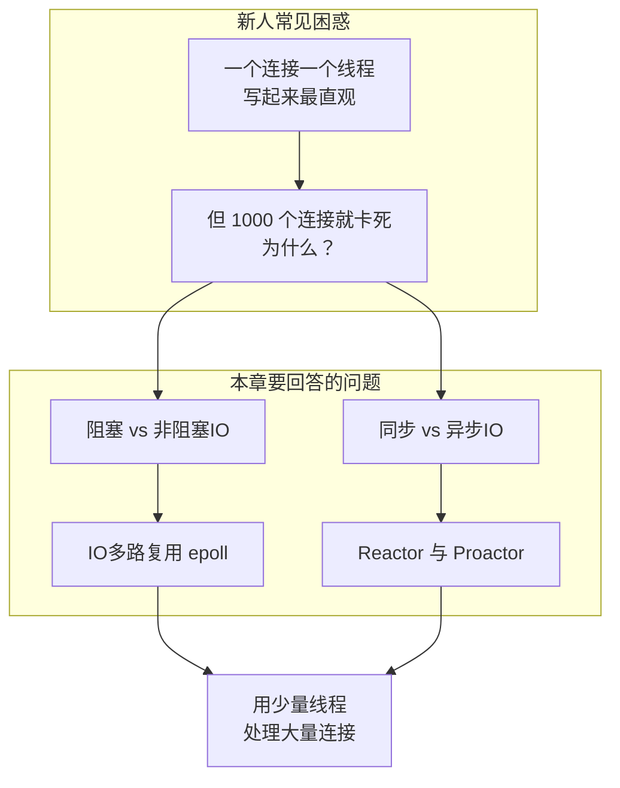
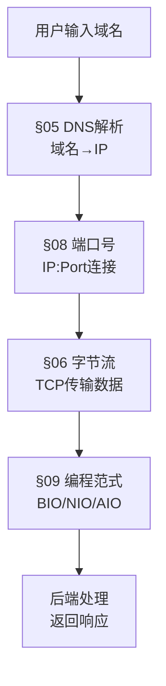

# 05.网络编程模型的概念
- 01.工作案例引入
  - 1.1 万人聊天室项目崩了
  - 1.2 为什么要学网络编程模型
- 02.客户端和服务端
  - 2.1 网络编程概念
  - 2.2 什么叫客户端
  - 2.3 什么叫服务端
  - 2.4 客户端到服务端流程
- 03.IP和端口
  - 3.1 为何需要IP和端口
  - 3.2 理解IP地址
  - 3.3 理解端口号
  - 3.4 套接字的出现
- 04.保留网段和子网
  - 4.1 保留网络是何物
  - 4.2 子网掩码是什么
- 05.全球域名系统
  - 5.1 域名解析IP
  - 5.2 DNS域名系统
  - 5.3 DNS服务分类
  - 5.4 域名解析缓存
  - 5.5 域名解析流程
  - 5.6 DNS负载均衡
- 06.数据和字节流
  - 6.1 认识数据传输
  - 6.2 TCP的应用场景
  - 6.3 UDP的应用场景
  - 6.4 字节流的设计
- 07.IP地址深度剖析
  - 7.1 IPv4地址分类
  - 7.2 CIDR与超网
  - 7.3 NAT地址转换
  - 7.4 IPv6的设计
- 08.端口号设计原理
  - 8.1 知名端口分配
  - 8.2 临时端口与范围
  - 8.3 端口复用设计
  - 8.4 端口扫描与防护
- 09.网络编程范式
  - 9.1 阻塞与非阻塞IO
  - 9.2 同步与异步IO
  - 9.3 Reactor模式
  - 9.4 Proactor模式
- 10.思考题与作业
  - 10.1 基础思考题目
  - 10.2 进阶思考题目
  - 10.3 动手实践作业

## 01.工作案例引入

### 1.1 万人聊天室项目崩了

**场景**：小陈是一名刚入职半年的后端开发，Leader交给他一个任务——写一个聊天室服务器，支持1万人同时在线聊天。

小陈心想：这不就是"每个客户端连上来就开一个线程处理"吗？两天就写完了。

```python
# 小陈的第一版聊天服务器（伪代码）
def handle_client(sock):
    while True:
        data = sock.recv(4096)       # 等着收消息
        if not data: break
        broadcast(data)              # 群发给所有人

server = create_server(port=8888)
while True:
    client = server.accept()         # 等着新连接
    threading.Thread(target=handle_client, args=(client,)).start()
```

上线测试，100个用户——稳。500个用户——还行。1000个用户——服务器卡死了。

```bash
$ ps aux | grep chat_server
yc  12345  3.2  1.5  2.1g  120m  ...  chat_server
# 2000个线程，光是线程栈就占了 2GB 内存

$ netstat -an | grep 8888 | wc -l
987  # 连接数还不到1000

$ top -b -n 1 | grep chat_server
    PID USER      PR  NI    VIRT    RES    SHR S  %CPU %MEM
  12345 yc        20   0   2.1g  1.2g  1.1g D  98.7  3.2
# 状态 D（不可中断睡眠），CPU 100%
```

**疑惑**：每来一个用户就开一个线程，多简单多直观——为什么一上千人就扛不住了？难道"一个连接一个线程"的做法有什么问题？线程多了会怎样？

**追问链**：

- "为什么每个线程只开一个连接，1000个线程就撑不住了？" → 每个线程默认栈 1~8MB，1000个线程光是栈就占 1~8GB 内存——**线程本身是有成本的**
- "那是不是可以用线程池？" → 线程池限制最大线程数，但阻塞IO意味着每个线程在 `recv()` 时都会挂起等待数据，如果 1000 个连接同时活跃，池里的线程都被占满，新的请求进不来——**阻塞IO的瓶颈**
- "那有没有办法用一个线程处理多个连接？" → 这就是**IO多路复用**的方案：一个线程可以同时监视几百上千个 socket，谁有数据就处理谁
- "为什么 `recv()` 会阻塞？阻塞和非阻塞IO背后是什么原理？" → 阻塞IO调用会引发进程上下文切换到内核态，内核等待数据到达后复制到用户空间才返回——**这就是系统调用的代价**
- "那 IO 多路复用（select/poll/epoll）是怎么工作的？它和 Reactor 模式、Proactor 模式是什么关系？" → 这就是本章要回答的核心问题

> 小陈后来把代码改成了 epoll + 非阻塞IO + 事件驱动，只用 4 个线程就支撑住了 1 万用户。但他花了整整一周才搞懂背后的原理——这就是我们为什么要学网络编程模型的原因。

### 1.2 为什么要学网络编程模型



新手写网络程序时几乎都会踩进同一个坑：**以为"每连接每线程"是万能方案**。这个坑背后的知识体系正是网络编程模型要解决的核心问题：

1. **IO模型**：阻塞IO、非阻塞IO、IO多路复用、异步IO——它们的区别是什么？各自适合什么场景？
2. **系统原理**：`accept()`、`recv()` 这些系统调用在操作系统层到底做了什么？
3. **并发模型**：Reactor 和 Proactor 模式怎么解决"大量连接、少量线程"的问题？
4. **协议设计**：TCP 的字节流特性为什么会导致"粘包"？应用层该怎么设计？

带着这四个问题，我们从"万人聊天室"的崩塌开始，逐一拆解网络编程中最重要的这几个概念。


### 1.5 核心原理：Socket的本质

Socket不是一种协议，是操作系统提供的一个**编程抽象**。它把复杂的TCP/UDP协议栈封装成类似文件操作的接口——`socket()`创建，`bind()`绑定，`listen()`监听，`accept()`接收，`read()/write()`读写。这个比喻极其强大：一旦你理解了"网络连接就是一个特殊的文件描述符"，epoll/select/kqueue这些I/O多路复用技术就变得自然了——它们本质上是在"同时监控多个文件描述符"。

## 02.客户端和服务端

### 2.1 网络编程概念

在谈论网络编程时，首先需要建立一个概念，也就是今天的主题“客户端 - 服务器”。

拿我们常用的网络购物来说，我们在手机上的每次操作，都是作为客户端向服务器发送请求，并收到响应的例子。

无论是客户端，还是服务器端，它们运行的单位都是进程（process），而不是机器。

1. 一个客户端，比如我们的手机终端，同一个时刻可以建立多个到不同服务器的连接，比如同时打游戏，上知乎，逛天猫；
2. 服务器端更是可能在一台机器上部署运行了多个服务，比如同时开启了 SSH 服务和 HTTP 服务。

### 2.2 什么叫客户端

客户端相对来说更为简单，它向服务器端的监听端口发起连接请求，连接建立之后，通过连接通路和服务器端进行通信。

### 2.3 什么叫服务端

服务器端需要在一开始就监听在一个众所周知的端口上，等待客户端发送请求，一旦有客户端连接建立，服务器端就会消耗一定的计算机资源为它服务，服务器端是需要同时为成千上万的客户端服务的。

### 2.4 客户端到服务端流程

1. 当一个客户端需要服务时，比如网络购物下单，它会向服务器端发送一个请求。注意，这个请求是按照双方约定的格式来发送的，以便保证服务器端是可以理解的；

2. 服务器端收到这个请求后，会根据双方约定的格式解释它，并且以合适的方式进行操作，比如调用数据库操作来创建一个购物单；

3. 服务器端完成处理请求之后，会给客户端发送一个响应，比如向客户端发送购物单的实际付款额，然后等待客户端的下一步操作；

4. 客户端收到响应并进行处理，比如在手机终端上显示该购物单的实际付款额，并且让用户选择付款方式。

**这就是著名的请求-响应模型（Request-Response Model）**：

```text
客户端                                 服务端
  │                                     │
  │──── 1.发送请求(Request) ──────→     │
  │                                     │ 2.处理请求
  │                                     │   解析→路由→业务逻辑→响应
  │ ←── 3.返回响应(Response) ─────      │
  │                                     │
  │  4.处理响应（展示给用户）            │
  │                                     │
```

**疑惑：客户端和服务端的角色是固定的吗？**

**答疑**：不是。在微服务架构中，一个服务可能同时扮演两种角色：它是前端的服务端，也是数据库服务的客户端。角色取决于某次具体通信中谁发起请求、谁处理请求。

## 03.IP和端口

### 3.1 为何需要IP和端口

正如寄信需要一个地址一样，在网络世界里，同样也需要地址的概念。在 TCP/IP 协议栈中，IP 用来表示网络世界的地址。

前面我们提到了，在一台计算机上是可以同时存在多个连接的，那么如何区分出不同的连接呢？这里就必须提到端口这个概念。

拿住酒店举例子，酒店的地址是唯一的，每间房间的号码是不同的，类似的，计算机的 IP 地址是唯一的，每个连接的端口号是不同的。

### 3.2 理解IP地址

IP地址：用于标识网络中的主机或设备。IP地址可以是IPv4（例如：192.168.0.1）或IPv6（例如：2001:0db8:85a3:0000:0000:8a2e:0370:7334）格式。

**IPv4地址的组成**：

IPv4地址由32位二进制数组成，通常用点分十进制表示：

```text
二进制：11000000 10101000 00000001 00000001
十进制：   192   .  168   .   1    .   1

每一段（8位）称为一个"八位组"（Octet），范围0~255
```

**疑惑：既然IP地址只有32位（约43亿个），全世界这么多设备怎么够用？**

**答疑**：确实不够用。IPv4地址已经在2011年基本耗尽。实际使用中通过以下方式缓解：
1. **NAT（网络地址转换）**：多个设备共享一个公网IP
2. **私有地址**：内部网络使用保留地址段（192.168.x.x等）
3. **IPv6**：128位地址空间，彻底解决地址不够的问题

### 3.3 理解端口号

端口号是一个 16 位的整数，最多为 65536。当一个客户端发起连接请求时，客户端的端口是由操作系统内核临时分配的，称为临时端口；然而，前面也提到过，服务器端的端口通常是一个众所周知的端口。

端口号是一个16位的数字，范围从0到65535。其中，0到1023的端口号被保留用于一些特定的服务，而1024到65535的端口号可以由应用程序自由使用。

**疑惑：为什么端口号最大是65535而不是更大？**

**答疑**：因为TCP和UDP头部中，端口号字段占16位。2^16 = 65536，所以端口号范围是0~65535。这是协议设计时的决定。

16位对于实际使用已经足够了——单台机器很少需要同时建立超过几万个独立服务。而作为客户端的临时端口，通过四元组（源IP、源端口、目标IP、目标端口）的组合，同一个端口可以连接不同的目标，所以实际并发连接数远超65535。

**端口号与进程的关系**：

```text
端口号 ← 1:N → 进程

一个端口通常由一个进程监听
但一个进程可以监听多个端口

例如：Nginx可以同时监听80和443端口
     一个进程也可以创建多个连接（每个连接有不同的四元组）
```

### 3.4 套接字的出现

一个连接可以通过客户端 - 服务器端的 IP 和端口唯一确定，这叫做套接字对，按照下面的四元组表示：

```
（clientaddr:clientport, serveraddr: serverport)
```

## 04.保留网段和子网

### 4.1 保留网络是何物

一个比较常见的现象是，我们所在的单位或者组织，普遍会使用诸如 10.0.x.x 或者 192.168.x.x 这样的 IP 地址，你可能会纳闷，这样的 IP 到底代表了什么呢？不同的组织使用同样的 IP 会不会导致冲突呢?

背后的原因是这样的，国际标准组织在 IPv4 地址空间里面，专门划出了一些网段，这些网段不会用做公网上的 IP，而是仅仅保留作内部使用，我们把这些地址称作保留网段。

保留的私有IPv4地址范围：

```text
10.0.0.0 到 10.255.255.255
172.16.0.0 到 172.31.255.255
192.168.0.0 到 192.168.255.255
```

本地回环地址（Loopback）：本地回环地址用于在同一台计算机上进行进程间通信，用于测试和诊断网络应用程序。

```text
127.0.0.0 到 127.255.255.255
```

还有其他一些保留网段用于特殊目的，如多播地址范围（224.0.0.0 到 239.255.255.255）和广播地址（255.255.255.255），用于多播和广播通信。

在互联网协议（IP）地址空间中，被保留并不用于分配给特定设备或网络的一组IP地址。这些保留的IP地址范围被指定为特定目的，例如私有网络、回环地址、广播地址等。

这些保留网络的存在是为了确保IP地址的有效分配和避免冲突。它们有助于网络管理员和设备开发者在设计和配置网络时遵循一致的规范，并确保互联网的正常运行。

### 4.2 子网掩码是什么

在网络 IP 划分的时候，我们需要区分两个概念。

第一是网络（network）的概念，直观点说，它表示的是这组 IP 共同的部分，比如在 192.168.1.1~192.168.1.255 这个区间里，它们共同的部分是 192.168.1.0。

第二是主机（host）的概念，它表示的是这组 IP 不同的部分，上面的例子中 1~255 就是不同的那些部分，表示有 255 个可用的不同 IP。

例如 IPv4 地址，192.0.2.12，我们可以说前⾯3 个字节（byte） 是⼦⽹（subnet），最后 1 个字节是主机，或者换个⽅式，我们能说主机为 8 位，⼦⽹掩码为 192.0.2.0/24（255.255.255.0）。

具体看：https://blog.csdn.net/qq_37756660/article/details/133862522

## 05.全球域名系统
### 5.1 域名解析IP

如果每次要访问一个服务，都要记下这个服务对应的 IP 地址，无疑是一种枯燥而繁琐的事情，就像你要背下 200 多个好友的电话号码一般无聊。

正如电话簿记录了好友和电话的对应关系一样，域名（DNS）也记录了网站和 IP 的对应关系。

域名解析IP是指将域名（例如www.example.com）转换为对应的IP地址（例如192.0.2.1）的过程。

当我们在浏览器中输入一个域名时，浏览器需要将该域名解析为对应的IP地址，以便能够建立与目标服务器的连接。这个过程涉及到域名解析IP。

### 5.2 DNS域名系统

DNS是域名系统(DomainNameSystem)的缩写，该系统用于命名组织到域层次结构中的计算机和网络服务。

域名是由圆点分开一串单词或缩写组成的，每一个域名都对应一个惟一的IP地址，在Internet上域名与IP地址之间是一一对应的，DNS就是进行域名解析的服务器。

DNS命名用于Internet等TCP/IP网络中，通过用户友好的名称查找计算机和服务。DNS是因特网的一项核心服务,它作为可以将域名和IP地址相互映射的一个分布式数据库。

DNS的概念，DNS用途是干什么的？ 域名解析，www.xxx.com 转换成ip，能够使用户更方便的访问互联网，而不用去记住能够被机器直接读取的ip数串。

DNS服务器，在网络世界，也是这样的。你肯定记得住网站的名称，但是很难记住网站的 IP 地址，因而也需要一个地址簿，就是DNS 服务器。

由此可见，DNS 在日常生活中多么重要。每个人上网，都需要访问它，但是同时，这对它来讲也是非常大的挑战。一旦它出了故障，整个互联网都将瘫痪。

另外，上网的人分布在全世界各地，如果大家都去同一个地方访问某一台服务器，时延将会非常大。因而，DNS服务器，一定要设置成高可用、高并发和分布式的。

### 5.3 DNS服务分类

大概可以分成这几类：

- 根 DNS 服务器 ：返回顶级域 DNS 服务器的 IP 地址
- 顶级域 DNS 服务器：返回权威 DNS 服务器的 IP 地址
- 权威 DNS 服务器 ：返回相应主机的 IP 地址

DNS服务可以分为两类：递归DNS服务用于解析用户请求的域名，而权威DNS服务用于存储和提供特定域名的IP地址和其他相关信息。

### 5.4 域名解析缓存

域名解析缓存是指在进行域名解析时，将已解析的域名和对应的IP地址暂时存储在本地系统或网络设备中，以便在后续的查询中快速获取结果，避免重复的解析过程。

域名解析缓存可以存在于多个层级，包括操作系统的本地缓存、浏览器的缓存、路由器的缓存等。不同层级的缓存具有不同的生存时间（TTL），即缓存的有效期。一旦缓存过期或被清除，系统将重新进行域名解析并更新缓存。

通过使用域名解析缓存，可以显著提高域名解析的速度和网络访问的效率，减少对DNS服务器的负载，特别是对于频繁访问相同域名的情况。

### 5.5 域名解析流程

域名解析是将人类可读的域名（如 yccoding.com）转换为计算机可理解的IP地址（如192.0.2.1）的过程。以下是域名解析的整体流程：

1. 用户输入域名：用户在浏览器或其他应用程序中输入要访问的域名，例如 yccoding.com。
2. 本地域名解析：操作系统首先会检查本地的DNS缓存，看是否已经解析过该域名。如果有缓存，且尚未过期，操作系统会直接返回缓存的IP地址，跳过后续步骤。
3. 本地域名服务器查询：如果本地缓存中没有找到对应的IP地址，操作系统会向本地配置的域名服务器（通常由ISP提供）发送DNS查询请求。本地域名服务器可能会有自己的缓存，如果有缓存，它会返回缓存的IP地址。
4. 递归查询：如果本地域名服务器没有缓存或无法提供IP地址，它会作为客户端向根域名服务器发送递归查询请求。根域名服务器是DNS系统的顶级，它存储了顶级域名服务器的地址。
5. 顶级域名服务器查询：根域名服务器收到递归查询请求后，会返回顶级域名服务器的地址给本地域名服务器。
6. 权威域名服务器查询：本地域名服务器接收到顶级域名服务器的地址后，会向顶级域名服务器发送查询请求。顶级域名服务器会返回该域名的权威域名服务器的地址。
7. 解析域名：本地域名服务器向权威域名服务器发送查询请求，权威域名服务器会返回该域名对应的IP地址。
8. 返回结果：本地域名服务器收到IP地址后，将其缓存，并将结果返回给操作系统。操作系统将IP地址返回给应用程序，如浏览器。
9. 建立连接：应用程序使用获取到的IP地址与服务器建立TCP连接，并发送HTTP请求。

### 5.6 DNS负载均衡

站在客户端角度，这是一次DNS递归查询过程。因为本地 DNS 全权为它效劳，它只要坐等结果即可。在这个过程中，DNS 除了可以通过名称映射为 IP地址，它还可以做另外一件事，就是负载均衡。

以访问“外婆家”为例。它可能有很多地址，因为它在杭州可以有很多家。所以，如果一个人想去吃“外婆家”，他可以就近找一家店，而不用大家都去同一家，这就是负载均衡。

**DNS 首先可以做内部负载均衡**。

- 例如，一个应用要访问数据库，在这个应用里面应该配置这个数据库的 IP 地址，还是应该配置这个数据库的域名呢？
- 显然应该配置域名，因为一旦这个数据库，因为某种原因，换到了另外一台机器上，而如果有多个应用都配置了这台数据库的话，一换IP地址，就需要将这些应用全部修改一遍。但是如果配置了域名，则只要在 DNS 服务器里，将域名映射为新的 IP 地址，这个工作就完成了，大大简化了运维。
- 在这个基础上可以再进一步。例如，某个应用要访问另外一个应用，如果配置另外一个应用的 IP地址，那么这个访问就是一对一的。但是当被访问的应用撑不住的时候，我们其实可以部署多个。但是，访问它的应用，如何在多个之间进行负载均衡？只要配置成为域名就可以了。在域名解析的时候，我们只要配置策略，这次返回第一个 IP，下次返回第二个 IP，就可以实现负载均衡了。

**DNS还可以做全局负载均衡**。

- 为了保证我们的应用高可用，往往会部署在多个机房，每个地方都会有自己的 IP 地址。当用户访问某个域名的时候，这个 IP 地址可以轮询访问多个数据中心。
- 如果一个数据中心因为某种原因挂了，只要在DNS 服务器里面，将这个数据中心对应的 IP 地址删除，就可以实现一定的高可用。
- 另外，我们肯定希望北京的用户访问北京的数据中心，上海的用户访问上海的数据中心，这样，客户体验就会非常好，访问速度就会超快。这就是全局负载均衡的概念。

## 06.数据和字节流
### 6.1 认识数据传输

TCP，又被叫做字节流套接字（Stream Socket），注意我们这里先引入套接字 socket，套接字 socket 将被反复提起，因为它实际上是网络编程的核心概念。

Stream sockets 是可靠的、双向连接的通讯串流。比如以“1-2-3”的顺序将字节流输出到套接字上，它们在另一端一定会以“1-2-3”的顺序抵达，而且不会出错。

UDP 也有一个类似的叫法, 数据报套接字（Datagram Socket）。Datagram Sockets 有时称为“无连接的 sockets”（connectionless sockets）。

一般分别以“SOCK_STREAM”与“SOCK_DGRAM”分别来表示 TCP 和 UDP 套接字。

### 6.2 TCP的应用场景

平时使用浏览器访问网页，或者在手机端用天猫 App 购物时，使用的都是字节流套接字。

### 6.3 UDP的应用场景

UDP 在很多场景也得到了极大的应用，比如多人联网游戏、视频会议，甚至聊天室。

想象一下，一个有上万人的联网游戏，如果要给每个玩家同步游戏中其他玩家的位置信息，而且丢失一两个也不会造成多大的问题，那么 UDP 是一个比较经济合算的选择。

还有一种叫做广播或多播的技术，就是向网络中的多个节点同时发送信息，这个时候，选择 UDP 更是非常合适的。

### 6.4 字节流的设计

**疑惑：TCP是面向字节流的，UDP是面向数据报的，这有什么本质区别？**

面向字节流意味着TCP把应用层交下来的数据看作一连串无结构的字节序列。TCP不关心应用层消息的边界，它可能把多条消息合并成一个段发送，也可能把一条消息拆分成多个段。

面向数据报意味着UDP保留了应用层消息的边界。应用层发送一个数据报，UDP就封装成一个UDP数据报发送，接收方也是一次接收一个完整的数据报。

```text
TCP字节流示意：
应用层：|消息A|消息B|消息C|
TCP层：  |段1：消息A+消息B的前半|段2：消息B的后半+消息C|
→ 接收方需要自己处理消息边界（粘包问题）

UDP数据报示意：
应用层：|消息A|消息B|消息C|
UDP层：  |报文1：消息A|报文2：消息B|报文3：消息C|
→ 接收方每次收到的就是完整的一条消息
```

**论证：字节流设计带来的"粘包"问题如何解决？**

由于TCP不保留消息边界，接收方必须自己判断一条消息从哪里开始、到哪里结束。常见方案：

| 方案 | 说明 | 示例 |
|------|------|------|
| 固定长度 | 每条消息固定N字节 | 定长协议 |
| 分隔符 | 用特殊字符标记消息边界 | HTTP用\r\n分隔头部 |
| 长度前缀 | 消息头部写明消息长度 | HTTP的Content-Length |
| 自描述格式 | 协议自身能标识边界 | JSON的花括号匹配 |

**结果：字节流设计的优势**

虽然字节流设计增加了应用层的复杂度，但它带来了巨大的灵活性：TCP可以自由地决定何时发送数据、每次发送多少数据，从而实现更好的网络利用率。Nagle算法就利用了这一特性，将多个小包合并成一个大包发送，减少网络中小包的数量。


## 07.IP地址深度剖析

### 7.1 IPv4地址分类

IPv4地址最初被设计为分类寻址（Classful Addressing），分为A、B、C、D、E五类：

```text
A类：0xxxxxxx.xxxxxxxx.xxxxxxxx.xxxxxxxx
     网络号(7位) + 主机号(24位)
     范围：1.0.0.0 ~ 126.255.255.255
     每个网络：2^24 - 2 = 16,777,214 台主机
     适用：大型组织

B类：10xxxxxx.xxxxxxxx.xxxxxxxx.xxxxxxxx
     网络号(14位) + 主机号(16位)
     范围：128.0.0.0 ~ 191.255.255.255
     每个网络：2^16 - 2 = 65,534 台主机
     适用：中型组织

C类：110xxxxx.xxxxxxxx.xxxxxxxx.xxxxxxxx
     网络号(21位) + 主机号(8位)
     范围：192.0.0.0 ~ 223.255.255.255
     每个网络：2^8 - 2 = 254 台主机
     适用：小型组织

D类：1110xxxx（224.0.0.0 ~ 239.255.255.255）→ 多播地址
E类：11110xxx（240.0.0.0 ~ 255.255.255.255）→ 保留

注意：主机号减2是因为全0表示网络地址，全1表示广播地址
```

**疑惑：为什么现在很少提到IP地址分类了？**

**答疑**：分类寻址存在严重的地址浪费问题。一个需要300台主机的组织，C类不够（254台），只能分配B类（65534台），浪费了99.5%的地址。这导致IPv4地址迅速耗尽。CIDR的出现替代了分类寻址。

### 7.2 CIDR与超网

**CIDR（Classless Inter-Domain Routing，无类别域间路由）**打破了传统的分类限制，允许任意长度的网络前缀：

```text
CIDR表示法：IP地址/前缀长度

192.168.1.0/24  → 网络部分24位，主机部分8位，254台主机
192.168.1.0/25  → 网络部分25位，主机部分7位，126台主机
10.0.0.0/16     → 网络部分16位，主机部分16位，65534台主机
10.0.0.0/8      → 网络部分8位，主机部分24位，约1600万台主机

CIDR的核心优势：
- 可以精确地分配所需数量的地址
- 路由聚合（把多个连续网段合并成一条路由）
- 大幅减少路由表大小
```

**路由聚合示例**：

```text
某ISP分配了4个/24网段给不同客户：
  192.168.0.0/24
  192.168.1.0/24
  192.168.2.0/24
  192.168.3.0/24

路由聚合为一条：192.168.0.0/22
（前22位相同，覆盖了上面4个网段）

路由表从4条变为1条，大幅减少路由器的内存和查找开销
```

### 7.3 NAT地址转换

**NAT（Network Address Translation，网络地址转换）**是解决IPv4地址不够用的关键技术：

```text
NAT的工作原理：

私有网络                    NAT设备                     公网
192.168.1.10:5000 ─→  转换为 203.0.113.1:10001 ─→  目的服务器
192.168.1.20:6000 ─→  转换为 203.0.113.1:10002 ─→  目的服务器
192.168.1.30:7000 ─→  转换为 203.0.113.1:10003 ─→  目的服务器

多个私有IP共享一个公网IP（通过端口号区分）
NAT设备维护一张转换表：
  (192.168.1.10:5000) ←→ (203.0.113.1:10001)
  (192.168.1.20:6000) ←→ (203.0.113.1:10002)
```

**NAT的类型**：

| 类型 | 说明 | 特点 |
|------|------|------|
| Full Cone NAT | 端口映射对所有外部主机开放 | 最宽松，P2P友好 |
| Restricted Cone NAT | 只允许之前通信过的IP | 中等限制 |
| Port Restricted Cone NAT | 只允许之前通信过的IP+端口 | 较严格 |
| Symmetric NAT | 每个目标分配不同的外部端口 | 最严格，P2P困难 |

**NAT的影响**：NAT打破了IP端到端通信的设计初衷，给P2P应用（如VoIP、在线游戏、文件共享）带来了很大困难。需要使用NAT穿越技术（如STUN、TURN、ICE）来建立直接连接。

### 7.4 IPv6的设计

IPv6用128位地址替代IPv4的32位地址，从根本上解决了地址不够的问题：

```text
IPv4地址空间：2^32 ≈ 43亿个地址
IPv6地址空间：2^128 ≈ 3.4 × 10^38 个地址
（大约等于地球上每平方米分配6.5 × 10^23个地址）

IPv6地址格式：
2001:0db8:85a3:0000:0000:8a2e:0370:7334

简化规则：
- 前导零可以省略：0db8 → db8
- 连续的全零段可以用::替代（只能用一次）
2001:db8:85a3::8a2e:370:7334
```

**IPv6相比IPv4的改进**：

| 特性 | IPv4 | IPv6 |
|------|------|------|
| 地址长度 | 32位 | 128位 |
| 头部长度 | 可变（20~60字节） | 固定40字节 |
| 分片 | 路由器可以分片 | 只有发送方可以分片 |
| 校验和 | 有（IP头校验和） | 无（交给上层协议） |
| NAT | 广泛使用 | 不需要（地址足够） |
| IPSec | 可选 | 内置支持 |
| 自动配置 | 需要DHCP | SLAAC自动配置 |


## 08.端口号设计原理

### 8.1 知名端口分配

端口号的分配由IANA（互联网号码分配机构）管理：

```text
端口号范围划分：

0~1023：系统端口（Well-Known Ports）
  由IANA严格管理，运行在这些端口的服务通常需要root权限
  
  常见端口：
  20/21  FTP（数据/控制）
  22     SSH
  23     Telnet
  25     SMTP（发送邮件）
  53     DNS
  67/68  DHCP
  80     HTTP
  110    POP3（接收邮件）
  143    IMAP
  443    HTTPS
  3306   MySQL（虽然>1023，但已成为事实标准）

1024~49151：注册端口（Registered Ports）
  由IANA记录，不强制管理
  如：3306(MySQL), 5432(PostgreSQL), 6379(Redis), 8080(HTTP Proxy)

49152~65535：动态/临时端口（Dynamic/Ephemeral Ports）
  操作系统自动分配给客户端连接
```

### 8.2 临时端口与范围

当客户端建立连接时，操作系统从临时端口范围中分配一个端口号：

```text
各操作系统的默认临时端口范围：

Linux：     32768 ~ 60999
           可通过 /proc/sys/net/ipv4/ip_local_port_range 修改
           
macOS：     49152 ~ 65535

Windows：   49152 ~ 65535
```

**疑惑：临时端口数量有限（约3万个），高并发时会不会不够用？**

**答疑**：一个端口号不是只能用于一个连接。端口号是四元组 `(源IP, 源端口, 目标IP, 目标端口)` 的一部分。同一个源端口可以连接不同的目标地址。但在大量短连接场景下（如HTTP短连接），TIME_WAIT状态会占用端口长达4分钟，确实可能耗尽临时端口。

解决方案：
1. 使用连接池复用连接
2. 调整TIME_WAIT回收策略
3. 扩大临时端口范围
4. 使用SO_REUSEADDR/SO_REUSEPORT

### 8.3 端口复用设计

**SO_REUSEADDR**和**SO_REUSEPORT**是两个重要的套接字选项：

```text
SO_REUSEADDR：
  允许在TIME_WAIT状态的端口上绑定新的监听
  场景：服务器重启时，旧连接可能还在TIME_WAIT
        没有SO_REUSEADDR会报"Address already in use"

SO_REUSEPORT（Linux 3.9+）：
  允许多个进程/线程绑定同一个端口
  内核会自动将连接均衡分配给各个监听者
  
  效果：
    进程1 → listen(80) ─┐
    进程2 → listen(80) ─┼── 内核负载均衡 ← 客户端连接
    进程3 → listen(80) ─┘
    
  Nginx 1.9.1+ 支持 reuseport 选项
  性能提升可达2~3倍（减少锁竞争）
```

### 8.4 端口扫描与防护

端口扫描是网络安全中最基本的侦查手段：

```text
常见的端口扫描类型：

1. TCP Connect扫描
   完成完整的三次握手
   最可靠但最容易被检测

2. SYN扫描（半开扫描）
   只发SYN，收到SYN-ACK说明端口开放
   不完成握手，比较隐蔽

3. UDP扫描
   发送UDP包，收到ICMP端口不可达说明关闭
   没有响应可能是开放（不确定）

防护措施：
├── 防火墙规则：只开放必要的端口
├── 入侵检测系统（IDS）：检测异常的扫描行为
├── 端口隐藏：对未授权的源IP不响应
└── 限速：限制单IP的连接请求频率
```


## 09.网络编程范式

### 9.1 阻塞与非阻塞IO

**阻塞IO（Blocking I/O）**：调用IO操作时，如果数据没有准备好，线程会一直等待（被挂起），直到数据到达。

```text
阻塞IO流程：
  
  应用程序               内核
     │                    │
     │── recvfrom() ──→   │
     │                    │ 等待数据到达...
     │   （线程阻塞）      │ ...
     │                    │ 数据到达！
     │                    │ 复制数据到用户空间
     │ ←── 返回数据 ──    │
     │                    │
```

**非阻塞IO（Non-Blocking I/O）**：调用IO操作时，如果数据没准备好，立即返回错误码（EAGAIN/EWOULDBLOCK），应用程序需要反复轮询。

```text
非阻塞IO流程：
  
  应用程序                    内核
     │                        │
     │── recvfrom() ──→       │ 数据没准备好
     │ ←── EAGAIN ─────       │
     │── recvfrom() ──→       │ 数据没准备好
     │ ←── EAGAIN ─────       │
     │── recvfrom() ──→       │ 数据准备好了！
     │ ←── 返回数据 ────       │
     │                        │
  
  优点：线程不会被阻塞
  缺点：需要忙轮询（busy polling），浪费CPU
```

### 9.2 同步与异步IO

同步IO和异步IO的本质区别在于**谁执行数据拷贝**：

```text
同步IO：应用程序发起IO操作，需要等待内核完成数据拷贝
  包括：阻塞IO、非阻塞IO、IO多路复用
  
异步IO：应用程序发起IO操作，内核在后台完成所有工作后通知应用
  包括：Linux aio、io_uring

关键区别示意：

同步IO（即使是IO多路复用）：
  epoll_wait() → 数据就绪 → recv()等待内核拷贝 → 处理数据
                                ↑ 这一步仍然是同步的

异步IO：
  aio_read() → 立即返回 → 做其他事 → 收到完成通知 → 直接处理数据
                                        ↑ 内核已经完成了拷贝
```

### 9.3 Reactor模式

Reactor模式是网络编程中最常用的并发模型：

```text
Reactor模式的核心思想：
  "不要调用我，让我来调用你"（好莱坞原则）

  Reactor（反应器）负责监听事件
  当事件就绪时，调用对应的事件处理器（Handler）

单Reactor单线程（Redis模式）：
  ┌────────────────────────┐
  │       Reactor           │
  │  ┌──────────────┐      │
  │  │  事件分离器   │      │  一个线程处理所有事件
  │  │  (epoll)     │      │  简单但CPU密集型任务会阻塞
  │  └──────┬───────┘      │
  │         │              │
  │    ┌────┼────┐         │
  │    ↓    ↓    ↓         │
  │  读处理 写处理 连接处理  │
  └────────────────────────┘

主从Reactor多线程（Netty模式）：
  ┌──────────────────┐    ┌──────────────────────────┐
  │   Main Reactor    │    │      Sub Reactor Pool     │
  │  负责接受连接     │    │  负责读写事件             │
  │  accept() → 分发  │───→│  Reactor1: 处理连接1,3,5  │
  │                  │    │  Reactor2: 处理连接2,4,6  │
  └──────────────────┘    │  Reactor3: 处理连接7,8,9  │
                          └──────────────────────────┘
```

### 9.4 Proactor模式

Proactor模式是**真正的异步IO**模型：

```text
Proactor vs Reactor：

Reactor（同步非阻塞）：
  1. Reactor监听到可读事件
  2. 调用Handler
  3. Handler同步调用read()读取数据
  4. Handler处理数据

Proactor（异步）：
  1. Handler发起异步读操作
  2. 操作系统在后台执行读取
  3. 读取完成后，操作系统通知Proactor
  4. Proactor调用Handler的完成回调
  5. Handler直接处理已经准备好的数据

Proactor的优势：应用程序完全不参与IO操作
Proactor的挑战：需要操作系统的异步IO支持
  - Windows：IOCP（成熟）
  - Linux：io_uring（Linux 5.1+，较新）
```

**总结：网络编程模型的演进**

```text
演进方向：从简单到高效

阻塞IO + 多线程      →  简单，但资源消耗大
非阻塞IO + 轮询      →  不阻塞，但浪费CPU
IO多路复用 + Reactor  →  高效，主流方案
异步IO + Proactor     →  理论最优，实现复杂

实际选择：
  高并发服务器 → IO多路复用（epoll/kqueue）+ Reactor
  极致性能     → io_uring + Proactor
  简单应用     → 阻塞IO + 线程池
```


---

## 11.综合案例：从单机到集群的架构演进

### 11.1 四代演进

把本章的IP、端口、DNS、字节流知识串成一次架构演进：

| 阶段 | 架构 | 瓶颈 | 解决方案 | 对应本章 |
|---|---|---|---|---|
| V1 单机 | 1台服务器, 1个端口 | 单点故障 | — | §03 IP和端口 |
| V2 主备 | 2台服务器, 虚拟IP漂移 | 资源浪费 | 保留网段做心跳 | §04 保留网段 |
| V3 DNS轮询 | 多台服务器, DNS返回多个IP | 负载不均 | 加权轮询 | §05 全球域名系统 |
| V4 负载均衡 | Nginx + 多后端, 统一入口 | 单LB瓶颈 | 多级LB + Anycast | §06-09 |

### 11.2 知识点对照



### 11.3 全章知识串联

本章从"客户端怎么找到服务端"这个最基本的问题出发：**IP地址（机器在哪）→ 端口号（找哪个程序）→ 子网划分（网络规划）→ DNS（名字到IP的映射）→ Socket（编程接口）→ I/O模型（怎么高效收发数据）**。这六个概念构成了所有网络编程的基础。记住一句话：**IP定位机器，端口定位进程，DNS把名字翻译成IP**。

## 10.思考题与作业

### 10.1 基础思考题目

1. **阻塞与非阻塞的区别**：请用你自己的话解释，当调用 `recv()` 但数据还没到达时，阻塞模式和非阻塞模式下分别发生了什么？从"进程状态"和"系统调用返回值"两个角度说明。

2. **同步异步区分**：很多人把"阻塞"等同于"同步"，把"非阻塞"等同于"异步"。这种说法准确吗？请用"数据拷贝由谁完成"这个关键维度重新区分这四个概念。

3. **IO多路复用对比**：select、poll、epoll 三者都是 IO 多路复用机制。请说明：
   - 每次调用时需要拷贝什么数据？
   - 能处理的最大连接数分别是多少？
   - 就绪事件的通知方式有什么不同？

4. **Reactor模式**：请画出"单 Reactor 单线程"和"主从 Reactor 多线程"的结构图，并说明各自的优缺点和适用场景。

5. **粘包问题**：TCP 是面向字节流的协议，不保留消息边界。当用 TCP 发送两条消息时，接收方可能一次收到两条、也可能分多次收到。请列出至少3种解决粘包问题的方案，并说明各自的优缺点。

### 10.2 进阶思考题目

1. **复习案例**：回到 1.1 节中小陈的"万人聊天室"案例。他的第一版代码用了"每连接每线程 + 阻塞IO"。请分析：
   - 当连接数增长到 1000 时，系统为什么会卡死？（从内存、CPU 上下文切换、线程调度三个角度）
   - 如果改用"线程池 + 阻塞IO"，能解决吗？为什么？
   - 最终用"epoll + 非阻塞IO + 事件驱动"的方案为什么能用 4 个线程处理 1 万用户？

2. **epoll 的边缘触发 vs 水平触发**：epoll 支持两种触发模式。请说明它们的区别，并分析在什么场景下应该选择哪种模式。一个常见的 Bug 是在边缘触发模式下没有读完所有数据就继续等待——这会导致什么问题？

3. **io_uring 的革新**：Linux 5.1 引入的 io_uring 被称为"下一代异步IO"方案。它与 epoll 最大的不同是什么？为什么说它（而不是 epoll）才是真正的"异步IO"？请从"提交队列"和"完成队列"的共享内存设计角度分析。

4. **零拷贝与网络编程**：sendfile() 系统调用可以把一个文件直接从磁盘发送到 socket，不需要经过用户空间。请说明它的工作流程，并分析它在"阻塞 vs 非阻塞"这个维度上属于哪种IO模型。如果用 io_uring 来实现零拷贝，会有什么优势？

5. **Netty 中的三种 Reactor 模式**：Netty 支持单线程模型、多线程模型、主从多线程模型。请画出这三种模型的线程模型图，并说明各适合什么类型的应用（如：Redis vs Nginx vs Netty 默认配置）。

### 10.3 动手实践作业

**作业一（必做）**：自己动手验证阻塞与非阻塞的区别。

- 写一个简单的 Python 或 C 程序：创建两个 socket，分别设置为阻塞模式和非阻塞模式。连接一个不存在的 IP（如 10.255.255.1:9999），观察两种模式下的行为和返回时间差异。
- 用 `strace`（Linux）或 `dtruss`（macOS）跟踪系统调用，看看阻塞模式下 `connect()` 和 `recv()` 到底停在哪个内核函数上。

**作业二（必做）**：用 epoll 重写万人聊天室。

- 参考 1.1 节中小陈的最终方案，用 epoll（或 kqueue，macOS 用户）实现一个简单的 echo 服务器：接收客户端消息，原样返回。
- 注意处理以下边界情况：`EAGAIN`/`EWOULDBLOCK` 错误、消息分片（粘包）、客户端断开连接。
- 用 `ab`（Apache Bench）或自己写客户端并发工具压测，对比"每连接每线程"和"epoll"两种实现分别在 100/500/1000 并发下的资源消耗（内存和 CPU）。

**作业三（选做）**：抓包分析 TCP 流。

- 用 Wireshark 或 tcpdump 抓取一次 HTTP 请求的 TCP 数据流。
- 观察 TCP 是如何把应用层的数据拆分成多个段的（wireshark 中可以看到 "TCP segment of a reassembled PDU"）。
- 对照 5.4 节"字节流的设计"中的粘包分析，验证 TCP 确实不保留消息边界。

**作业四（拓展）**：深入理解一种 Reactor 框架。

- 选择一个开源 Reactor 框架阅读其核心源码，如：libevent（C）、Netty（Java）、muduo（C++）。
- 画出它们的线程模型图，标注清楚 Reactor（事件分发器）、Handler（事件处理器）和 Worker（业务处理线程池）之间的交互关系。
- 说明它们在处理"慢业务"（如数据库查询）时，是如何避免阻塞 Reactor 线程的。
