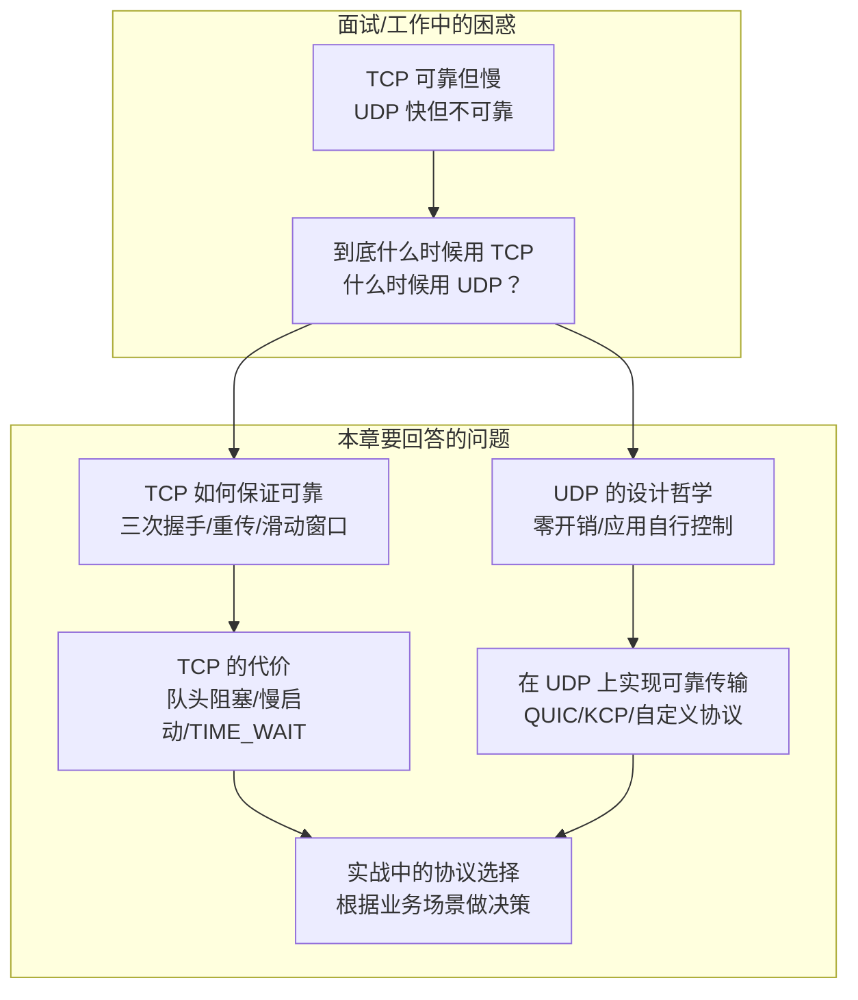
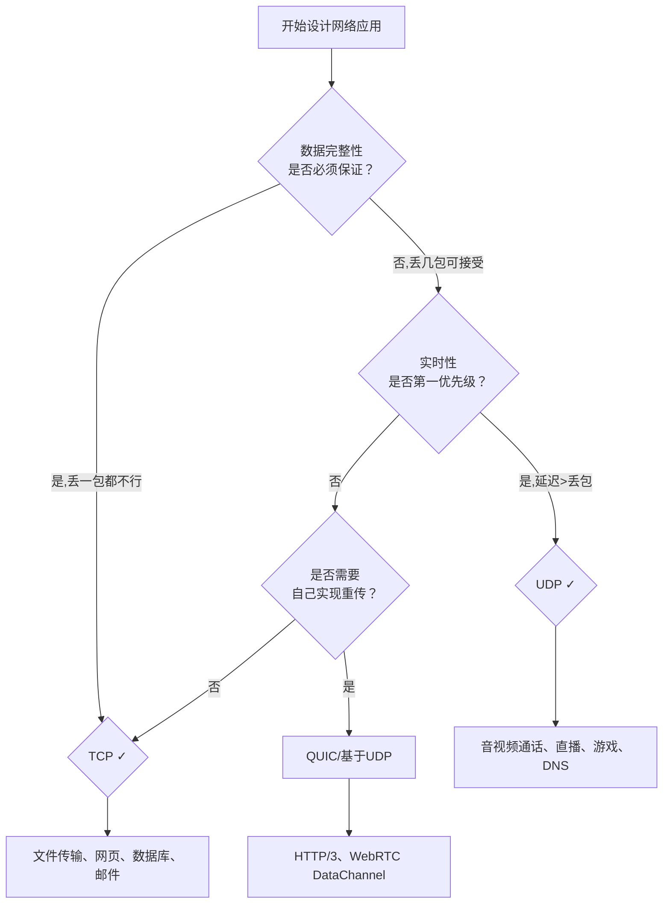

# 06.传输协议TCP和UDP
#### 目录介绍
- [01.工作案例引入](#01工作案例引入)
  - [1.1 直播平台的马赛克事故](#11-直播平台的马赛克事故)
  - [1.2 为什么要学传输层协议](#12-为什么要学传输层协议)
- [02.传输协议场景](#02传输协议场景)
  - [2.1 应用TCP的场景](#21-应用TCP的场景)
  - [2.2 应用UDP的场景](#22-应用UDP的场景)
  - [2.3 一些有争议场景](#23-一些有争议场景)
  - [2.4 TCP发送案例分析](#24-TCP发送案例分析)
  - [2.5 UPD发送案例分析](#25-UPD发送案例分析)
- [03.TCP基础概念](#03TCP基础概念)
  - [3.1 TCP的特点](#31-TCP的特点)
  - [3.2 TCP对应的协议](#32-TCP对应的协议)
  - [3.3 一些常见概念](#33-一些常见概念)
  - [3.4 TCP报文结构](#34-TCP报文结构)
  - [3.5 报文重点概念](#35-报文重点概念)
  - [3.6 TCP连接最大值](#36-TCP连接最大值)
  - [3.7 能同时发起握手](#37-能同时发起握手)
- [04.TCP靠谱协议](#04TCP靠谱协议)
  - [4.1 如何建立连接](#41-如何建立连接)
  - [4.2 三次握手连接](#42-三次握手连接)
  - [4.3 四次挥手断开](#43-四次挥手断开)
  - [4.4 如何保证可靠](#44-如何保证可靠)
  - [4.5 如何保证顺序](#45-如何保证顺序)
  - [4.6 如何避免丢包](#46-如何避免丢包)
  - [4.7 如何连接维护](#47-如何连接维护)
  - [4.8 如何控制流量](#48-如何控制流量)
  - [4.9 如何避免拥塞](#49-如何避免拥塞)
  - [4.10 停止等待操作](#410-停止等待操作)
- [05.UDP基础概念](#05UDP基础概念)
  - [5.1 什么是UDP](#51-什么是UDP)
  - [5.2 UDP对应的协议](#52-UDP对应的协议)
  - [5.3 UDP的特点](#53-UDP的特点)
  - [5.4 UDP包数据](#54-UDP包数据)
  - [5.5 一些常见概念](#55-一些常见概念)
  - [5.6 UDP也能握手吗](#56-UDP也能握手吗)
- [06.UDP不可靠协议](#06UDP不可靠协议)
  - [6.1 为何无连接](#61-为何无连接)
  - [6.2 如何限制大小](#62-如何限制大小)
  - [6.3 丢包怎么办](#63-丢包怎么办)
- [07.TCP和UDP实践](#07TCP和UDP实践)
  - [7.1 TCP实践案例](#71-TCP实践案例)
  - [7.2 UDP实践案例](#72-UDP实践案例)
- [08.TCP与UDP的设计哲学](#08TCP与UDP的设计哲学)
  - [8.1 可靠vs效率的权衡](#81-可靠vs效率的权衡)
  - [8.2 TCP的设计代价](#82-TCP的设计代价)
  - [8.3 基于UDP的可靠传输](#83-基于UDP的可靠传输)
  - [8.4 如何选择TCP还是UDP](#84-如何选择TCP还是UDP)
- [09.思考题与作业](#09思考题与作业)
  - [9.1 基础思考题目](#91-基础思考题目)
  - [9.2 进阶思考题目](#92-进阶思考题目)
  - [9.3 动手实践作业](#93-动手实践作业)
## 01.工作案例引入

### 1.1 直播平台的"马赛克"事故

**场景**：小杨是一名刚接手公司直播业务的运维工程师。最近用户投诉越来越多——**"直播画面卡成PPT"**、**"声音和画面对不上"**、**"主播说话5秒后观众才听到"**。技术Leader让小杨负责排查。

小杨登录直播服务器，查看日志和监控：

```bash
# 查看网络状况
$ netstat -s | grep -E "segments|retransmit|loss"
    12345678 segments sent
      987654 retransmitted        # 重传率接近 8%！
       12345 segments retransmited
    98765432 segments received
      567890 duplicate ACKs       # 大量重复确认

# 查看服务进程的线程模型
$ ps -eLf | grep live_stream | wc -l
2567   # 2500+ 个线程！每个 TCP 连接一个线程
```

**疑惑**：直播用的不是 RTMP 协议吗？RTMP 基于 TCP，TCP 是"可靠"的——那为什么直播画面还会卡？TCP 保证数据可靠到达，但为什么"可靠"反而导致了直播的卡顿？

小杨做了个实验：用 tcpdump 抓包，发现每当网络有轻微抖动时，TCP 就会主动降低发送速度（拥塞控制），而且因为 TCP 要求数据有序到达，只要一个包丢了，后面即使收到的包也要等重传——画面就卡住了。

```bash
# 抓包分析
$ tcpdump -i eth0 -A port 1935 | head -20
# 发现大量的 TCP Dup ACK 和 Fast Retransmit
# 以及 TCP ZeroWindow（接收窗口为0，通知发送端停止发送）
```

**追问链**：

- "TCP 不是最靠谱的协议吗？为什么直播用 TCP 还会卡？" → 因为 TCP 的"可靠"是**牺牲了实时性**换来的——它要保证数据**有序、不丢、不重**，但在网络抖动时，**队头阻塞**会让后续数据包干等
- "那为什么不能换 UDP？UDP 不是不可靠吗？" → **UDP 的"不可靠"正是它低延迟的原因**——丢了就丢了，不需要重传，不需要排序，数据到了就直接交给应用层
- "但直播中关键的帧（如 I 帧）不能丢啊，丢了画面就花屏了" → 所以需要在 UDP 之上自己做**应用层可靠传输**，只对关键帧做重传，非关键帧（P/B 帧）丢了就跳过——这就是**选择性可靠**
- "那淘宝直播、抖音、快手他们也是这么做的吗？" → 是的，主流直播平台都基于 UDP 实现了自己的传输协议（如阿里云的 ARP、腾讯的 TCC），在 UDP 之上做了**可定制的可靠层**
- "那什么时候该用 TCP，什么时候该用 UDP？有没有一种协议能兼顾两者？" → 这正是本章要回答的核心问题

> 小杨后来把直播传输层改成了基于 UDP 的自定义协议——关键帧（I 帧）做可靠传输 + 非关键帧（P/B 帧）直接发不管丢不丢，配合前向纠错（FEC），直播卡顿率从 15% 降到了 1%。但他花了两周才搞懂 TCP 和 UDP 的本质差异——这就是为什么要学传输层协议的原因。

### 1.2 为什么要学传输层协议



绝大多数开发者初学网络时都听说过这句话：**"TCP 可靠，UDP 不可靠"**。

但如果真的去选择传输协议，你会发现事情远没那么简单：
- 实时直播用 TCP → 卡顿（可靠的代价是队头阻塞）
- 文件下载用 UDP → 太复杂（应用层自己实现可靠性）
- 网页浏览用 TCP → 慢启动让短连接很慢
- 在线游戏用 UDP → 还得自己处理丢包

本章的目标，就是把这层关系彻底讲清楚：

1. **TCP 的可靠机制**：三次握手、四次挥手、滑动窗口、拥塞控制——它到底是怎么做到的？
2. **UDP 的简单哲学**：为什么零状态的设计在某些场景下反而是优势？
3. **TCP 的代价**：队头阻塞、慢启动、TIME_WAIT——因为什么牺牲了性能？
4. **在 UDP 之上构建可靠**：QUIC、KCP——新的趋势为什么都在 UDP 上"重新造轮子"？
5. **实战选择**：你的业务场景到底该用 TCP 还是 UDP？

带着这五个问题，我们从直播平台的"马赛克"事故开始，一步步拆解传输层协议的设计哲学。


## 02.传输协议场景
### 2.1 应用TCP的场景

1. 网络通信：TCP广泛用于客户端和服务器之间的通信，例如网页浏览、电子邮件传输、文件传输等。它提供可靠的数据传输，确保数据的完整性和顺序性。
2. 文件传输：TCP协议可用于大文件的可靠传输，例如FTP（文件传输协议）和TFTP（简单文件传输协议）等。
3. 数据库访问：当客户端需要与数据库服务器进行通信时，TCP协议通常用于建立可靠的连接，并传输查询和结果数据。
4. 实时流媒体：TCP协议也可用于实时流媒体应用，如音频和视频流的传输。虽然UDP更常用于实时应用，但TCP可以提供更可靠的传输，适用于某些特定的流媒体场景。

### 2.2 应用UDP的场景

1. 实时通信：UDP适用于实时通信应用，如语音通话、视频聊天和实时游戏。由于UDP不需要建立连接和维护状态，它具有较低的延迟和较小的开销，适合快速传输实时数据。
2. 广播和多播：UDP支持广播和多播功能，可以将数据报发送给多个接收者。这在实时流媒体、在线直播和网络广播等场景中非常有用。
3. DNS（域名系统）：UDP常用于DNS查询，用于将域名解析为IP地址。由于DNS查询通常是短暂的、小数据量的请求，UDP的低延迟和较小的开销使其成为DNS协议的理想选择。

### 2.3 一些有争议场景

**1.现在直播比较火，那直播到底使用TCP还是UDP呢？这个看具体场景**

直播协议多使用 RTMP，而这个 RTMP 协议也是基于 TCP 的。TCP 的严格顺序传输要保证前一个收到了，下一个才能确认，如果前一个收不到，下一个就算包已经收到了，在缓存里面，也需要等着。

对于直播来讲，这显然是不合适的，因为老的视频帧丢了其实也就丢了，就算再传过来用户也不在意了，他们要看新的了，如果老是没来就等着，卡顿了，那就会丢失客户，所以直播，实时性比较比较重要，宁可丢包，也不要卡顿的。

另外，对于丢包，其实对于视频播放来讲，有的包可以丢，有的包不能丢，因为视频的连续帧里面，有的帧重要，有的不重要，如果必须要丢包，隔几个帧丢一个，其实看视频的人不会感知，但是如果连续丢帧，就会感知了，因而在网络不好的情况下，应用希望选择性的丢帧。

还有就是当网络不好的时候，TCP 协议会主动降低发送速度，这对本来当时就卡的看视频来讲是要命的，应该应用层马上重传，而不是主动让步。因而，很多直播应用，都基于 UDP 实现了自己的视频传输协议。

### 2.4 TCP发送案例分析

以一个HTTP请求为例，分析TCP的完整发送过程：

```text
客户端要发送的HTTP数据：
POST /api/order HTTP/1.1\r\n
Content-Length: 50\r\n
\r\n
{"product_id":1001,"count":2,"price":199.00}

总数据大小约150字节，小于MSS(1460字节)，所以只需一个TCP段即可承载。
```

发送过程：

1. **应用层调用send()**：将HTTP数据交给TCP发送缓冲区
2. **TCP封装**：添加TCP头部（源端口、目标端口、序列号等），形成TCP段
3. **IP封装**：添加IP头部，形成IP数据包
4. **发送并等待ACK**：数据包发出后，TCP启动超时计时器
5. **收到ACK**：对方确认收到，从发送缓冲区移除该数据
6. **未收到ACK**：超时后重传，指数退避增加重传间隔

如果发送的数据超过MSS，TCP会进行分段：

```text
假设要发送5000字节数据，MSS=1460：
段1：Seq=1,     数据=1460字节
段2：Seq=1461,  数据=1460字节
段3：Seq=2921,  数据=1460字节
段4：Seq=4381,  数据=619字节
```

### 2.5 UPD发送案例分析

以DNS查询为例，分析UDP的发送过程：

```text
DNS查询报文（约50字节）：
查询：www.example.com 的A记录
```

发送过程：

1. **应用层调用sendto()**：将DNS查询数据交给UDP
2. **UDP封装**：添加UDP头部（仅8字节：源端口、目标端口、长度、校验和）
3. **IP封装**：添加IP头部，形成IP数据包
4. **直接发送**：没有握手、没有确认、没有重传

UDP和TCP发送过程的对比：

| 特性 | TCP | UDP |
|------|-----|-----|
| 发送前 | 需要三次握手建立连接 | 直接发送 |
| 数据分段 | TCP自动分段 | 应用层自己控制 |
| 发送确认 | 需要等待ACK | 不需要确认 |
| 数据丢失 | 自动重传 | 应用层自行处理 |
| 发送顺序 | 保证有序到达 | 不保证顺序 |


## 03.TCP基础概念

### 3.1 TCP的特点

具备的特点

- TCP是面向连接的传输层协议。
- TCP连接是点对点的（套接字--IP:Port到套接字）。
- TCP提供可靠交付的服务。
- TCP提供全双工通信。
- 面向字节流。

### 3.2 TCP对应的协议

**TCP对应的协议**

1. FTP：定义了文件传输协议，使用21端口。常说某某计算机开了FTP服务便是启动了文件传输服务。下载文件，上传主页，都要用到FTP服务。
2. Telnet：它是一种用于远程登陆的端口，用户可以以自己的身份远程连接到计算机上，通过这种端口可以提供一种基于DOS模式下的通信服务。如以前的BBS是-纯字符界面的，支持BBS的服务器将23端口打开，对外提供服务。
3. SMTP：定义了简单邮件传送协议，现在很多邮件服务器都用的是这个协议，用于发送邮件。如常见的免费邮件服务中用的就是这个邮件服务端口，所以在电子邮件设置-中常看到有这么SMTP端口设置这个栏，服务器开放的是25号端口。
4. POP3：它是和SMTP对应，POP3用于接收邮件。通常情况下，POP3协议所用的是110端口。也是说，只要你有相应的使用POP3协议的程序（例如Fo-xmail或Outlook），就可以不以Web方式登陆进邮箱界面，直接用邮件程序就可以收到邮件（如是163邮箱就没有必要先进入网易网站，再进入自己的邮-箱来收信）。 
5. HTTP协议：是从Web服务器传输超文本到本地浏览器的传送协议。

### 3.3 一些常见概念

`发送缓存和接受缓存`：

用来临时保存双向通信的数据。在发送时，应用程序将数据传送给TCP发送缓存后，就可以做自己的事情，TCP在合适的时候发送数据；在接受数据时，TCP把发送的数据放入缓存，上层应用在合适的时候读取缓存即可。

`滑动窗口`：

TCP的滑动窗口以字节为单位，用3个指针进行表示。当窗口内连续报文段被确认收到后，可以将窗口向前滑动。窗口大小应小于等于缓存区的大小。

`滑动窗口协议`：

只有在接收窗口向前滑动时（与此同时也发送了确认），发送窗口才有可能向前滑动。收发两端的窗口按照以上规律不断地向前滑动，因此这种协议又称为滑动窗口协议。

1. 当发送窗口和接收窗口的大小都等于 1时，就是停止等待协议。
2. 当发送窗口大于1，接收窗口等于1时，就是回退N步协议。
3. 当发送窗口和接收窗口的大小均大于1时，就是选择重发协议。


### 3.4 TCP报文结构

结构图如下所示，摘自网络

（图示：TCP报文结构——源端口、目的端口、序列号、确认号、状态位、窗口大小等字段布局）

报文结构如下所示

- 源端口、目的端口：16位长。标识出远端和本地的端口号。
- 序列号：32位长。表明了发送的数据报的顺序，不一定从0开始。
- 确认号：32位长。希望收到的下一个数据报的序列号，表明到序列号`N-1`为止的所有数据已经正确收到。
- TCP协议数据报头长：4位长。表明TCP头中包含多少个32位字。
- 接下来的6位未用。
- ACK：**ACK位置1表明确认号是合法的**。如果ACK为0，那么数据报不包含确认信息，确认字段被省略。
- PSH：表示是带有PUSH标志的数据。接收方因此请求数据报一到便可送往应用程序而不必等到缓冲区装满时才传送。
- RST：用于复位由于主机崩溃或其它原因而出现的错误的连接。还可以用于拒绝非法的数据报或拒绝连接请求。
- SYN：用于建立连接。
- FIN：用于释放连接。
- 窗口大小：16位长。窗口大小字段表示在确认了字节之后还可以发送多少个字节。
- 校验和：16位长。是为了确保高可靠性而设置的。它校验头部、数据和伪TCP头部之和。
- 紧急指针：`URG=1`时才有意义。
- 可选项：长度可变，最长40个字节。
  - MMS
  - SACK：选择确认。
  - 时间戳：计算往返时间；用于处理TCP序号超过`2^32`的情况，又称为防止序号回绕（PAWS）。
- TCP最小长度为20个字节。


### 3.5 报文重点概念

**端口号**

源端口号和目标端口号是不可少的，这一点和UDP是一样的。如果没有这两个端口号。数据就不知道应该发给哪个应用。

**包的序号**

为什么要给包编号呢？当然是为了解决乱序的问题。不编好号怎么确认哪个应该先来，哪个应该后到呢。编号是为了解决乱序问题。既然是社会老司机，做事当然要稳重，一件件来，面临再复杂的情况，也临危不乱。

**确认序号**

确认序号。发出去的包应该有确认，要不然我怎么知道对方有没有收到呢？如果没有收到就应该重新发送，直到送达。这个可以解决不丢包的问题。作为老司机，做事当然要靠谱，答应了就要做到，暂时做不到也要有个回复。

**状态位**

接下来有一些状态位。例如 SYN 是发起一个连接，ACK 是回复，RST 是重新连接，FIN 是结束连接等。TCP 是面向连接的，因而双方要维护连接的状态，这些带状态位的包的发送，会引起双方的状态变更。

**窗口大小**

还有一个重要的就是窗口大小。TCP要做流量控制，通信双方各声明一个窗口，标识自己当前能够的处理能力，别发送的太快，撑死我，也别发的太慢，饿死我。

除了做流量控制以外，TCP还会做拥塞控制，对于真正的通路堵车不堵车，它无能为力，唯一能做的就是控制自己，也即控制发送的速度。不能改变世界，就改变自己嘛。

### 3.6 TCP连接最大值

当时读到一篇讨论服务器可以承受多少 TCP 连接（就是 C10k 问题）的文章时，还觉得奇怪，不是端口范围只有 0~65535 吗？为什么还会有几十万上百万连接呢？

这就是没有意识到，连接是四元组（源IP地址、源端口号、目标IP地址和目标端口号），并不是单纯的源端口或者目的端口。那么多个数相乘，这个乘积当然可以远远超过 65535 了。

先不谈论海量级网站的场景，就算我们维护一台 Web 服务器，假如当前有 10 万台客户端连着你，平均每个客户端跟你有 6 个连接（这很常见），那么就是 60 万个连接了，是不是也早就超过 6 万了？

在限定场景下，一个客户端（假设只有一个出口 IP）和一个服务端（假设也只有一个 IP 和一个服务端口），那么确实只能最多发起 6 万多个连接。

### 3.7 能同时发起握手

思考一个问题，tcp 能同时发起握手吗？在TCP协议中，同时发起握手是不可能的。

由于TCP的连接建立过程需要依次进行握手，因此在任何给定的时间点，一台主机只能处于三次握手的其中一步。这意味着在TCP中，连接的建立是按顺序进行的，而不是同时发起的。

同时发起握手可能会导致连接状态的混乱和不一致，因此TCP协议规定了按照顺序进行握手的过程，以确保连接的可靠性和正确性。

## 04.TCP靠谱协议

TCP 是靠谱的协议，但是这不能说明它面临的网络环境好。从IP层面来讲，如果网络状况的确那么差，是没有任何可靠性保证的，而作为IP的上一层TCP也无能为力，唯一能做的就是更加努力，不断重传，通过各种算法保证。

也就是说，对于TCP来讲，IP层你丢不丢包，我管不着，但是我在我的层面上，会努力保证可靠性。

通过对 TCP 头的解析，我们知道要掌握 TCP 协议，重点应该关注以下几个问题：

- 顺序问题 ，稳重不乱；
- 丢包问题，承诺靠谱；
- 连接维护，有始有终；
- 流量控制，把握分寸；
- 拥塞控制，知进知退。

### 4.1 如何建立连接

**疑惑：TCP为什么需要"建立连接"？直接发数据不行吗？**

UDP就是直接发数据的，它不需要建立连接。TCP之所以要先建立连接，是因为它要做以下几件事：

1. **确认双方可达**：确保对方存在且愿意通信
2. **协商初始参数**：序列号、窗口大小、MSS等
3. **建立状态机**：双方维护连接状态，为后续可靠传输做准备

连接的本质是什么？不是物理上的一根线，而是**双方内存中各自维护的一组数据结构**（包括序列号、确认号、窗口大小、重传计时器等）。

TCP的连接状态变迁：

```text
客户端状态：CLOSED → SYN_SENT → ESTABLISHED → FIN_WAIT_1 → FIN_WAIT_2 → TIME_WAIT → CLOSED
服务端状态：CLOSED → LISTEN → SYN_RCVD → ESTABLISHED → CLOSE_WAIT → LAST_ACK → CLOSED
```

连接建立的核心是三次握手（详见3.2节），断开的核心是四次挥手（详见3.3节）。
### 4.2 三次握手连接

一般来说 TCP 连接是标准的 TCP 三次握手完成的：第一次客户端发送 SYN；第二次服务端收到 SYN 后，回复 SYN+ACK；第三次客户端收到 SYN+ACK 后，回复 ACK。

1. 第一次：客户端，发送SNY=1表示此次握手是请求建立连接的，然后seq生成一个客户端的随机数X
2. 第二次：服务端收到客户端数据后，服务端，发送SNY=1,ACK=1表示是回复请求建立连接的，然后ack=客户端的seq+1（这样客户端收到后就能确认是之前想要连接的那个服务端），然后把服务端也生成一个代表自己的随机数seq=Y发给客户端。
3. 第三次：客户端收到服务端数据，客户端回复，ACK=1。seq=客户端随机数+1，ack=服务端随机数+1（这样服务端就知道是刚刚那个客户端了）

（图示：TCP三次握手流程——SYN→SYN+ACK→ACK）

1. 第一次握手，C端发了个连接请求消息到S端，S端收到后S端就知道自己与C端是可以连接成功的
2. 第二次握手，C端此时并不知道S端是否接收到这个消息，所以S端接收到消息后得应答，C端得到S端的回复后，才能确定自己与S端是可以连接上的。C端只有确定了自己能与S端连接上才能开始发数据。所以两次握手肯定是最基本的。 
3. 那么为什么需要第三次握手呢？假设一下如果没有第三次握手，而是两次握手后我们就认为连接建立，那么会发生什么？

`问题：为什么建立连接需要三次握手？`

**第三次握手是为了防止已经失效的连接请求报文段突然又传到服务端，因而产生错误**。具体情况就是：

C端发出去的第一个网络连接请求由于某些原因在网络节点中滞留了，导致延迟，直到连接释放的某个时间点才到达S端，这是一个早已失效的报文，但是此时S端仍然认为这是C端的建立连接请求第一次握手，于是S端回应了C端，第二次握手。

如果只有两次握手，那么到这里，连接就建立了，但是此时C端并没有任何数据要发送，而S端就会傻傻的等待着，造成很大的资源浪费。所以需要第三次握手，只有C端再次回应一下，就可以避免这种情况。

### 4.3 四次挥手断开

（图示：TCP四次挥手流程——FIN→ACK→FIN→ACK）

如图所示：经过上面的建立连接图的解析，这个图应该不难看懂，这里主要有一个问题：为什么比建立连接时多了一次握手？

简单说来是"先关读，后关写"，一共需要四个阶段：服务器读通道关闭->客户机写通道关闭->客户机读通道关闭->服务器写通道关闭。这样就变成了四次握手了。

1. 第一步（客户端发送FIN）：客户端发送一个带有FIN（终止）标志的TCP报文段给服务器，表示客户端不再发送数据。
2. 第二步（服务器发送ACK）：服务器收到客户端的FIN后，发送一个确认ACK（确认）报文段给客户端，表示已收到客户端的终止请求。
3. 第三步（服务器发送FIN）：服务器发送一个带有FIN标志的TCP报文段给客户端，表示服务器也不再发送数据。
4. 第四步（客户端发送ACK）：客户端收到服务器的FIN后，发送一个确认ACK报文段给服务器，表示已收到服务器的终止请求。

`问题：看到这里服务端的ACK(回复客户端)和FIN(终止)消息并不是同时发出的，为何这样？`

先ACK，然后再FIN，这也很好理解，当客户端要求断开连接时，此时服务端可能还有未发送完的数据，所以先ACK，然后等数据发送完再FIN。

由于TCP连接是全双工的，因此每个方向都必须单独关闭。客户端在数据发送完毕后发送一个结束数据段FIN，且服务端也返回确认数据段ACK，此时结束了客户端到服务端的连接；然后客户端接收到服务端发送的FIN，且服务端也收到了ACK之后，自此双方的数据通信完全结束。

`问题：TCP采用四次挥手关闭连接如图所示为什么建立连接协议是三次握手，而关闭连接却是四次握手呢？`

这是因为服务端的LISTEN状态下的SOCKET当收到SYN报文的建连请求后，它可以把ACK和SYN（ACK起应答作用，而SYN起同步作用）放在一个报文里来发送。

但关闭连接时，当收到对方的FIN报文通知时，它仅仅表示对方没有数据发送给你了；但未必你所有的数据都全部发送给对方了，所以你可以未必会马上会关闭SOCKET，也即你可能还需要发送一些数据给对方之后，再发送FIN报文给对方来表示你同意现在可以关闭连接了，所以它这里的ACK报文和FIN报文多数情况下都是分开发送的。

### 4.4 如何保证可靠

TCP（传输控制协议）通过以下机制来保证可靠传输：

它在面对网络丢包、延迟、拥塞等问题时能够自适应地调整传输行为，以保证数据的可靠传输。

1. 序列号和确认应答：应用数据被分割成 TCP 认为最适合发送的数据块，将每个发送的数据包进行编号，接收方通过发送确认应答（ACK）来确认已接收到的数据，并且接收方对数据包进行排序。
2. 超时重传：TCP使用超时重传机制来处理丢失的数据包。如果发送方在一定时间内未收到确认应答，它会假设数据包已丢失，并重新发送该数据包。
3. 校验和：TCP 将保持它首部和数据的检验和。这是一个端到端的检验和，目的是检测数据在传输过程中的任何变化。如果收到段的检验和有差错，TCP 将丢弃这个报文段和不确认收到此报文段。
4. 滑动窗口：TCP使用滑动窗口机制来控制发送方和接收方之间的数据流量。滑动窗口大小可以根据网络状况进行动态调整，以确保发送方不会发送过多的数据，超出接收方的处理能力。
5. 流量控制：TCP 连接的每一方都有固定大小的缓冲空间，TCP的接收端只允许发送端发送接收端缓冲区能接纳的数据。当接收方来不及处理发送方的数据，能提示发送方降低发送的速率，防止包丢失。TCP 使用的流量控制协议是可变大小的滑动窗口协议。
6. 拥塞控制：TCP使用拥塞控制机制来避免网络拥塞。它通过动态调整发送速率，根据网络的拥塞程度来控制发送方的数据发送速度，以保持网络的稳定性。
7. 停止等待协议：也是为了实现可靠传输的，它的基本原理就是每发完一个分组就停止发送，等待对方确认。在收到确认后再发下一个分组。

### 4.5 如何保证顺序

核心的设计思想：TCP通过使用序列号、确认应答和接收窗口等机制，确保数据包按照发送顺序到达接收方，从而保证传输顺序的可靠性。

第一步：设计序列号来确保顺序。TCP为每个发送的数据包分配一个唯一的序列号。这个序列号用于标识数据包的顺序。接收方根据序列号来确定数据包的顺序。

第二步：确认应答方式来确保数据传输可靠。接收方会发送确认应答（ACK）来告知发送方已成功接收到数据。发送方根据接收到的ACK来确认数据包的传输成功。如果发送方未收到确认应答，它会重新发送数据包，以确保数据的可靠传输。

第三步：接收窗口来控制发送和接收数据量。TCP使用接收窗口来控制接收方的数据处理能力。接收窗口的大小表示接收方当前能够接收的数据量。发送方根据接收窗口的大小来控制发送的数据量，确保不会超过接收方的处理能力。接收方可以通过调整接收窗口的大小来告知发送方自己的处理能力。

### 4.6 如何避免丢包

TCP能够有效地避免数据包的丢失。它通过序列号、确认应答、超时重传、滑动窗口和拥塞控制等机制，保证数据的可靠传输，减少丢包的风险。

超时重传：如果发送方在一定时间内未收到确认应答，它会假设数据包已丢失，并重新发送该数据包。通过超时重传机制，TCP能够在数据包丢失时重新发送，以确保数据的可靠性。

### 4.7 如何连接维护

TCP连接建立后，如何知道连接是否还有效？这就是连接维护的问题。

**Keep-Alive机制**：

当TCP连接空闲（没有数据传输）一段时间后，一方可以发送Keep-Alive探测包来确认对方是否还在。

```text
Keep-Alive参数（Linux默认值）：
tcp_keepalive_time  = 7200秒（2小时空闲后开始探测）
tcp_keepalive_intvl = 75秒（每次探测间隔）
tcp_keepalive_probes = 9次（连续探测失败次数）
```

如果连续9次探测都没有收到回复，则认为连接已断开，内核会通知应用层。

**疑惑：为什么默认2小时才开始探测？**

因为Keep-Alive探测会消耗网络资源。大部分连接在空闲一段时间后就会有新的数据传输，不需要Keep-Alive。2小时的默认值是在资源消耗和及时发现故障之间的一个平衡。

**实际应用中的心跳机制**：

很多应用不依赖TCP的Keep-Alive，而是在应用层实现自己的心跳机制：

1. **更灵活**：可以自定义心跳间隔（如30秒一次）
2. **更及时**：比TCP Keep-Alive的2小时更快发现故障
3. **携带信息**：心跳包可以附带业务状态信息
### 4.8 如何控制流量

流量控制指点对点通信量的控制，是端到端正的问题。**流量控制所要做的就是抑制发送端发送数据的速率，以便使接收端来得及接收。这里是通过滑动窗口机制来实现的**。发送方的发送窗口不能超过接收方的接收窗口。TCP的窗口单位是字节，不是报文段。

（图示：TCP滑动窗口流量控制——窗口从300→100→0的三次调整过程）

这上图中B一共进行了三次流量控制：第一次将窗口减小到`300`，第二次减小到`100`，最后减小到`0`，这时发送方暂停发送知道B发送一个新的窗口值为止。

如果B发送了一个新的窗口值到A，但是A并没有收到，就会造成死锁。为解决这个问题，TCP为每个链接设置有一个持续计时器。只要TCP收到一个0窗口，就启动计时器。若计时器设置的时间到了，就发送一个探测报文，而接收方在确认的时候会给出一个现在的窗口值。


### 4.9 如何避免拥塞

**防止过多的数据注入到网络中，这样可以使网络中的路由器或链路不致过载**。

拥塞控制所要做的都有一个前提：网络能够承受现有的网络负荷。拥塞控制是一个全局性的过程，涉及到所有的主机、路由器，以及与降低网络传输性能有关的所有因素。

**1.慢开始和拥塞避免**。发送方维持一个拥塞窗口`cwnd`的状态变量。**发送方让自己的发送窗口小于等于拥塞窗口**。

（图示：TCP慢开始与拥塞避免——cwnd指数增长到ssthresh后线性增长，遇到拥塞后cwnd置1重新开始）

- `慢开始`：**由小到大的逐渐增大拥塞窗口**。首先将cwnd设置为一个最大报文段MMS，在收到一个对新的报文段的确认后，把拥塞窗口增加一个MMS。——指数增长
- `拥塞避免`：当慢开始到门限值（ssthresh）后，使用拥塞避免算法（cwnd每次加1）。当发现网络拥塞后，将cwnd置为1，ssthresh减半，再次执行慢开始。

**2.快重传和快恢复**

`快重传`：**当接收方收到一个失序报文段后就立即发送重复确认而不要等到自己发送数据时捎带确认**。当发送方连续收到三个重复确认时，应立即重传接收方尚未收到的报文段。

`快恢复`：与快重传结合使用。

- 在连续收到三个重复确认时，将慢开始的ssthresh减半，这是为了防止网络拥塞（ ** 接下来并不执行慢开始 ** ）。
- 由于发送方现在认为 *网络很可能没有拥塞*，于是接下来不执行慢开始，而是将cwnd值设置为ssthresh减半后的值，然后执行拥塞避免。

### 4.10 停止等待操作

无差错情况
- 发送方发送分组,接收方在规定时间内收到,并且回复确认.发送方再次发送。
  - （图示：停止等待协议无差错情况——发送方发送分组→接收方确认→发送方再次发送）

出现差错情况
- 停止等待协议中超时重传是指只要超过一段时间仍然没有收到确认，就重传前面发送过的分组（认为刚才发送过的分组丢失了）。因此每发送完一个分组需要设置一个超时计时器，其重转时间应比数据在分组传输的平均往返时间更长一些。这种自动重传方式常称为 **自动重传请求 ARQ** 。另外在停止等待协议中若收到重复分组，就丢弃该分组，但同时还要发送确认。**连续 ARQ 协议** 可提高信道利用率。发送维持一个发送窗口，凡位于发送窗口内的分组可连续发送出去，而不需要等待对方确认。接收方一般采用累积确认，对按序到达的最后一个分组发送确认，表明到这个分组位置的所有分组都已经正确收到了。
  - （图示：超时重传与自动重传请求ARQ——超时后重传分组，连续ARQ可提高信道利用率）

**确认丢失和确认迟到**


**确认丢失**：确认消息在传输过程丢失

（图示：确认丢失——A发送M1，B回复确认但丢失，A超时重传M1，B丢弃重复并重发确认）

当A发送M1消息，B收到后，B向A发送了一个M1确认消息，但却在传输过程中丢失。而A并不知道，在超时计时过后，A重传M1消息，B再次收到该消息后采取以下两点措施：

1.丢弃这个重复的M1消息，不向上层交付。

2.向A发送确认消息。（不会认为已经发送过了，就不再发送。A能重传，就证明B的确认消息丢失）。

**确认迟到** ：确认消息在传输过程中迟到

（图示：确认迟到——A发送M1，B确认迟到导致A超时重传，双方各收到2份消息后丢弃重复）

A发送M1消息，B收到并发送确认。在超时时间内没有收到确认消息，A重传M1消息，B仍然收到并继续发送确认消息（B收到了2份M1）。此时A收到了B第二次发送的确认消息。接着发送其他数据。过了一会，A收到了B第一次发送的对M1的确认消息（A也收到了2份确认消息）。处理如下：

1.A收到重复的确认后，直接丢弃。

2.B收到重复的M1后，也直接丢弃重复的M1。


## 05.UDP基础概念
### 5.1 什么是UDP

* 面向无连接
* 每个数据报的大小在限制在64k内
* 因为是面向无连接，所以是不可靠协议
* 不需要建立连接，速度快

### 5.2 UDP对应的协议

UDP对应的协议：

- DNS：用于域名解析服务，将域名地址转换为IP地址。DNS用的是53号端口。
- SNMP：简单网络管理协议，使用161号端口，是用来管理网络设备的。由于网络设备很多，无连接的服务就体现出其优势。
- FTP：简单文件传输协议，该协议在熟知端口69上使用UDP服务。

### 5.3 UDP的特点

第一，沟通简单，不需要一肚子花花肠子（大量的数据结构、处理逻辑、包头字段）。前提是它相信网络世界是美好的，秉承性善论，相信网络通路默认就是很容易送达的，不容易被丢弃的。

第二，轻信他人。它不会建立连接，虽然有端口号，但是监听在这个地方，谁都可以传给他数据，他也可以传给任何人数据，甚至可以同时传给多个人数据。

第三，愣头青，做事不懂权变。不知道什么时候该坚持，什么时候该退让。它不会根据网络的情况进行发包的拥塞控制，无论网络丢包丢成啥样了，它该怎么发还怎么发。

### 5.4 UDP包数据

- 当我发送的 UDP 包到达目标机器后，发现 MAC 地址匹配，于是就取下来，将剩下的包传给处理 IP 层的代码。把 IP 头取下来，发现目标 IP 匹配，接下来呢？这里面的数据包是给谁呢？
- 发送的时候，我知道我发的是一个 UDP 的包，收到的那台机器咋知道的呢？所以在 IP 头里面有个 8 位协议，这里会存放，数据里面到底是 TCP 还是 UDP，当然这里是 UDP。于是，如果我们知道 UDP 头的格式，就能从数据里面，将它解析出来。解析出来以后呢？数据给谁处理呢？
- 处理完传输层的事情，内核的事情基本就干完了，里面的数据应该交给应用程序自己去处理，可是一台机器上跑着这么多的应用程序，应该给谁呢？
- 无论应用程序写的使用 TCP传数据，还是UDP传数据，都要监听一个端口。正是这个端口，用来区分应用程序，要不说端口不能冲突呢。两个应用监听一个端口，到时候包给谁呀？所以，按理说，无论是 TCP 还是 UDP 包头里面应该有端口号，根据端口号，将数据交给相应的应用程序。
  - （图示：UDP数据包结构——源端口号、目标端口号、数据长度、校验和等字段）
- 当我们看到 UDP 包头的时候，发现的确有端口号，有源端口号和目标端口号。因为是两端通信嘛，这很好理解。但是你还会发现，UDP 除了端口号，再没有其他的了。


### 5.5 一些常见概念

**UDP的最大数据长度**

UDP头部的长度字段是16位，所以UDP数据报的最大长度是65535字节（包括UDP头部8字节），即最大数据载荷为65527字节。但在实际网络中，由于IP层的MTU限制（通常1500字节），超过MTU的UDP包会在IP层被分片，增加丢包的风险。

**UDP校验和**

虽然UDP是不可靠的协议，但它提供了可选的校验和机制。校验和覆盖UDP头部和数据部分，用于检测数据在传输过程中是否被篡改。在IPv6中，UDP校验和是强制的。

**UDP的端口复用**

多个应用程序可以绑定到同一个UDP端口上（通过设置SO_REUSEADDR或SO_REUSEPORT选项）。这在多播和广播场景中很常见。

**无连接的含义**

UDP的无连接意味着：
1. 不需要握手就能发送数据
2. 没有连接状态需要维护
3. 每个数据报都是独立的，互不关联
4. 一个UDP套接字可以与多个对端通信
### 5.6 UDP也能握手吗

UDP本身是一种无连接的协议，不提供内置的握手机制。应用程序可以在UDP通信的开始阶段自行定义握手过程，以确保通信双方能够互相确认彼此的可用性和准备就绪状态。


## 06.UDP不可靠协议
### 6.1 为何无连接

**疑惑：UDP为什么被设计成无连接的？**

UDP的设计哲学是"简单即美"。在互联网的早期，并非所有应用都需要TCP那样复杂的可靠传输机制。有些应用对实时性的要求远高于可靠性。

无连接的好处：

1. **零延迟启动**：不需要三次握手，数据可以立即发送
2. **极低开销**：不需要维护连接状态（序列号、确认号、窗口等）
3. **支持广播/多播**：连接是点对点的，而无连接可以一对多
4. **服务器资源消耗小**：不需要为每个客户端维护连接状态

### 6.2 如何限制大小

UDP数据报的大小受多个因素限制：

| 限制因素 | 大小 | 说明 |
|---------|------|------|
| UDP头部长度字段 | 65535字节 | 16位字段的最大值 |
| IP层MTU | 1500字节（以太网） | 超过MTU会触发IP分片 |
| 实际推荐值 | ≤1472字节 | 1500(MTU) - 20(IP头) - 8(UDP头) |
| 安全值 | ≤512字节 | 避免任何网络环境下的分片 |

**论证：为什么超过MTU的UDP包更容易丢失？**

当UDP数据报超过MTU时，IP层会将其分成多个IP分片。只要其中任何一个分片丢失，整个UDP数据报就无法重组，全部作废。如果一个UDP包被分成3片，每片丢包率为1%，那么整个包的丢失率约为3%，远高于单片的丢失率。

### 6.3 丢包怎么办

UDP本身不处理丢包，它把这个责任交给了应用层。应用层可以根据业务需求选择不同的策略：

**策略1：不处理（容忍丢包）**
- 适用场景：实时视频、语音通话
- 丢一两帧画面人眼几乎察觉不到

**策略2：应用层重传**
- 适用场景：在线游戏、QUIC协议
- 应用层自己实现确认和重传机制，比TCP更灵活

**策略3：冗余编码（FEC，前向纠错）**
- 适用场景：实时音视频
- 发送额外的冗余数据，接收方可以利用冗余数据恢复丢失的包

```text
FEC示例：发送3个数据包 + 1个冗余包
数据包1: A
数据包2: B  
数据包3: C
冗余包:  A XOR B XOR C

如果包2丢失，可通过 A XOR C XOR 冗余包 = B 恢复
```

**策略4：QUIC协议的方案**

Google设计的QUIC协议基于UDP，但在UDP之上实现了类似TCP的可靠传输机制，同时保留了UDP的快速连接建立优势。QUIC已被标准化为HTTP/3的传输层协议。


## 07.TCP和UDP实践

### 7.1 TCP实践案例

以一个简单的聊天服务为例，展示TCP通信的完整生命周期：

```text
场景：客户端连接聊天服务器，发送消息，接收回复，断开连接

时间线：
t0: 客户端发起连接（三次握手）
t1: 客户端发送 "Hello Server"
t2: 服务端回复 "Hello Client, welcome!"
t3: 客户端发送 "bye"
t4: 服务端回复 "Goodbye!"
t5: 客户端发起断开（四次挥手）
```

TCP服务端的核心流程：

```text
1. 创建Socket          → socket(AF_INET, SOCK_STREAM, 0)
2. 绑定地址和端口       → bind(sockfd, addr, addrlen)
3. 开始监听            → listen(sockfd, backlog)
4. 接受客户端连接       → accept(sockfd, addr, addrlen)  ← 阻塞等待
5. 读取客户端数据       → read(connfd, buf, len)
6. 发送响应数据        → write(connfd, buf, len)
7. 关闭连接            → close(connfd)
```

TCP客户端的核心流程：

```text
1. 创建Socket          → socket(AF_INET, SOCK_STREAM, 0)
2. 连接服务端          → connect(sockfd, addr, addrlen)  ← 触发三次握手
3. 发送数据            → write(sockfd, buf, len)
4. 读取响应            → read(sockfd, buf, len)
5. 关闭连接            → close(sockfd)  ← 触发四次挥手
```

**TCP编程中的关键注意事项：**

1. **粘包问题**：TCP是字节流协议，没有消息边界。连续发送的两条消息可能被合并为一次接收。解决方案是在应用层定义消息边界（定长、分隔符、长度前缀）。

2. **半关闭状态**：调用`close()`会同时关闭读和写，而`shutdown()`可以只关闭一个方向。在某些场景下（如HTTP响应结束但还要读取数据），需要使用`shutdown()`。

3. **连接超时**：`connect()`默认超时时间很长（通常75秒到几分钟），在实际应用中通常需要设置更短的超时时间。

4. **端口复用**：服务重启时可能遇到"Address already in use"错误，因为上一次的连接还处于TIME_WAIT状态。设置`SO_REUSEADDR`选项可以解决这个问题。

**TCP服务端的并发模型演进：**

```text
模型1：单进程串行
  → 一次只能服务一个客户端，其他客户端排队
  → 适用场景：几乎没有

模型2：多进程/多线程
  → 每个连接分配一个进程或线程
  → 问题：C10k时，万级线程的上下文切换开销巨大

模型3：I/O多路复用（select/poll/epoll）
  → 单线程管理大量连接，事件驱动
  → Nginx、Redis采用此模型

模型4：多线程 + I/O多路复用（Reactor模式）
  → 主线程accept，工作线程处理I/O
  → Netty、Memcached采用此模型
```

### 7.2 UDP实践案例

以DNS查询和在线游戏为例，展示UDP的典型应用：

**案例1：模拟DNS查询过程**

```text
DNS查询流程（基于UDP端口53）：

客户端：
1. 创建UDP Socket   → socket(AF_INET, SOCK_DGRAM, 0)
2. 构造DNS查询报文   → 查询 www.example.com 的A记录
3. 发送到DNS服务器   → sendto(sockfd, query, len, 0, dns_addr, addrlen)
4. 等待响应          → recvfrom(sockfd, buf, len, 0, NULL, NULL)
5. 解析DNS响应       → 得到IP地址 93.184.216.34

注意：
- 如果超过2秒没有收到响应，客户端会重试
- 通常最多重试3次，然后尝试下一个DNS服务器
- 如果响应超过512字节，DNS会切换到TCP（DNS over TCP）
```

**案例2：在线游戏状态同步**

在线游戏是UDP最经典的应用场景之一。游戏中的状态同步对延迟极其敏感，丢失一两个位置更新包远不如延迟100ms严重。

```text
游戏客户端每秒发送20次位置更新：

包结构（约50字节）：
┌─────────┬──────────┬──────────┬──────────┬──────────┐
│ 序列号   │ 时间戳    │ 玩家X坐标 │ 玩家Y坐标 │ 动作状态  │
│ 4字节    │ 8字节     │ 4字节     │ 4字节     │ 4字节    │
└─────────┴──────────┴──────────┴──────────┴──────────┘

服务器处理策略：
- 收到旧序列号的包 → 直接丢弃（已经有更新的数据了）
- 收到乱序的包    → 只保留最新的（不需要排序）
- 丢失了几个包    → 无所谓，下一个包马上就来
```

**UDP编程中的关键注意事项：**

1. **包大小控制**：尽量将UDP包控制在MTU以内（推荐≤1472字节），避免IP分片带来的丢包风险。

2. **应用层可靠性**：如果业务需要可靠传输，必须在应用层自行实现确认和重传机制。

3. **NAT穿透**：UDP在NAT环境下的穿透比TCP更复杂。常用技术包括STUN、TURN和ICE协议。

4. **安全性**：UDP容易被用于反射放大攻击（如DNS放大攻击），服务端应做好速率限制和来源验证。


### 7.5 核心原理：TCP的四个设计支柱

TCP之所以能在不可靠的IP网络上提供可靠传输，靠的是四个精妙设计：

**1. 确认与重传（ACK & RTO）**：接收方每收到数据段就回复ACK告知"下一个期望的字节序号"。RTO通过Jacobson算法动态计算——`RTO = SRTT + 4 × RTTVAR`，自适应网络波动。

**2. 滑动窗口（Sliding Window）**：不发一包等一包，维护"允许发送但未确认"的窗口。窗口越大吞吐越高，但不能无限大否则压垮网络。

**3. 拥塞控制**：慢启动→拥塞避免→快重传→快恢复。这个算法模型自1988年被Jacobson提出后三十年没有本质变化。

**4. 流量控制**：接收方在ACK中通告剩余缓冲区大小（rwnd），防止发送方把接收方"淹死"。当rwnd=0时停止发送并定期探测。

四个机制协同：**ACK+RTO保证不丢，滑动窗口保证吞吐，拥塞控制保证不堵，流量控制保证不撑**。

## 08.TCP与UDP的设计哲学

### 8.1 可靠vs效率的权衡

**疑惑：为什么不设计一个既可靠又高效的传输协议？**

这个问题触及了计算机科学中最基本的设计权衡之一。可靠性和效率在传输协议设计中是一对天然矛盾：

```text
可靠性的代价：
┌──────────────┬────────────────────┬──────────────┐
│ 可靠性机制    │ 带来的开销          │ 延迟影响      │
├──────────────┼────────────────────┼──────────────┤
│ 三次握手      │ 1.5个RTT的建连延迟  │ +数十~数百ms  │
│ 序列号/确认号 │ 每个包多12字节开销   │ 微小          │
│ 超时重传      │ 丢包时等待超时       │ +200ms~数秒  │
│ 流量控制      │ 发送速率被限制       │ 吞吐量下降    │
│ 拥塞控制      │ 慢启动阶段发送缓慢   │ 前期吞吐量低  │
│ 有序交付      │ 队头阻塞            │ 后续包等待    │
└──────────────┴────────────────────┴──────────────┘
```

TCP和UDP代表了这个光谱的两个极端：

- **TCP**：极致可靠，不惜一切代价保证数据完整有序到达
- **UDP**：极致简单，将所有控制权交给应用层

**论证：为什么这种两极分化的设计是合理的？**

不同应用对可靠性的需求差异巨大。以下是几个典型场景的对比：

| 应用场景 | 对丢包的容忍度 | 对延迟的敏感度 | 适合的协议 |
|---------|--------------|--------------|-----------|
| 文件传输 | 零容忍（丢1字节文件就损坏） | 不敏感 | TCP |
| 网页浏览 | 零容忍 | 中等敏感 | TCP |
| 语音通话 | 可容忍5%丢包 | 极其敏感（>150ms就有明显延迟） | UDP |
| 在线游戏 | 可容忍部分丢包 | 极其敏感 | UDP |
| DNS查询  | 零容忍 | 敏感 | UDP（应用层重试） |
| 视频直播 | 可容忍少量丢包 | 敏感 | UDP |

一个"万能协议"要么在简单场景下过于臃肿，要么在复杂场景下功能不足。分层设计让应用可以根据自身需求选择最合适的传输策略。

### 8.2 TCP的设计代价

TCP为了可靠性付出了哪些代价？理解这些代价有助于我们在合适的场景选择合适的协议。

**代价1：连接建立的开销**

每个TCP连接在操作系统内核中需要维护一组数据结构：

```text
每个TCP连接的内核开销：
- socket结构体：约400~700字节
- 发送缓冲区：默认16KB~128KB
- 接收缓冲区：默认16KB~128KB  
- 定时器：多个定时器（重传、Keep-Alive、TIME_WAIT等）

粗略估算：
1万个空闲TCP连接 ≈ 消耗约500MB~1GB内存
10万个连接 ≈ 消耗约5GB~10GB内存
```

这就是C10K问题的本质——不是带宽不够，而是连接状态的维护成本太高。

**代价2：队头阻塞（Head-of-Line Blocking）**

TCP保证数据有序交付，这意味着如果中间的一个包丢了，后面已经收到的包也不能交给应用层，必须等丢失的包重传到达后才能按序交付。

```text
发送方发送：Pkt1  Pkt2  Pkt3  Pkt4  Pkt5
接收方收到：Pkt1  ----  Pkt3  Pkt4  Pkt5
                   ↑
                 Pkt2丢失

此时Pkt3、4、5虽然已经到达，但必须等Pkt2重传成功后才能交给应用层
这段等待时间 ≈ 1个RTT（重传的往返时间）

在HTTP/2中，这个问题更严重：
- 多个HTTP请求复用一个TCP连接
- 一个包的丢失会阻塞所有请求的响应
- 这正是HTTP/3改用QUIC（基于UDP）的主要原因
```

**代价3：慢启动的影响**

TCP连接建立后不会立即全速发送，而是通过慢启动逐渐探测网络容量：

```text
慢启动过程（假设cwnd初始为1MSS=1460字节）：
RTT 1: 发送 1MSS  = 1.4KB
RTT 2: 发送 2MSS  = 2.9KB
RTT 3: 发送 4MSS  = 5.8KB
RTT 4: 发送 8MSS  = 11.7KB
RTT 5: 发送 16MSS = 23.4KB
...

要发送一个100KB的资源，即使带宽充足，也需要约7个RTT才能全部发出
如果RTT=50ms，仅慢启动就需要350ms
```

对于短连接（如HTTP请求），慢启动的影响尤为显著——连接还没到全速就结束了。这也是HTTP Keep-Alive和HTTP/2连接复用的重要动机。

**代价4：TIME_WAIT状态**

TCP连接关闭后，主动关闭方会进入TIME_WAIT状态，持续2MSL（通常60秒~4分钟）。在此期间，这个四元组（源IP、源端口、目标IP、目标端口）不能被复用。

```text
高并发短连接场景：
- Web服务器每秒处理1000个请求
- 每个请求用完就关闭连接
- TIME_WAIT持续60秒
- 同时存在60000个TIME_WAIT状态的连接
- 几乎耗尽了可用端口（65535个）
```

### 8.3 基于UDP的可靠传输

既然TCP有这些代价，能否在UDP上自己实现可靠传输，同时避免TCP的某些缺陷？答案是可以的，而且已经有很多成功的实践。

**方案1：QUIC协议**

QUIC是Google设计的新一代传输协议，现已标准化为HTTP/3的传输层。它在UDP之上实现了可靠传输，同时解决了TCP的多个痛点。

```text
QUIC vs TCP 的核心改进：

1. 连接建立：
   TCP:  3次握手(1.5RTT) + TLS握手(1-2RTT) = 2.5~3.5RTT
   QUIC: 首次连接1RTT，恢复连接0RTT

2. 队头阻塞：
   TCP:  一个包丢失阻塞所有数据流
   QUIC: 多个独立流，一个流丢包不影响其他流

3. 连接迁移：
   TCP:  IP变化（如WiFi切4G）连接断开
   QUIC: 基于连接ID，IP变化不影响连接

4. 拥塞控制：
   TCP:  内核实现，升级困难
   QUIC: 用户态实现，可以快速迭代算法
```

**方案2：KCP协议**

KCP是一个纯算法实现的可靠传输协议，专注于低延迟场景。它以10%~20%的带宽浪费为代价，换取了30%~40%的延迟降低。

KCP的核心设计选择：

1. **更激进的重传策略**：不等待超时，收到2个重复ACK就立即重传（而TCP需要3个）
2. **无延迟ACK**：收到数据立即发送ACK，不像TCP那样等待捎带确认
3. **选择性重传**：只重传丢失的包，不像TCP的Go-Back-N那样可能重传已收到的包
4. **可调的拥塞控制**：允许应用关闭拥塞控制，在内网等可信环境下获得更高速率

**方案3：游戏行业的自定义可靠UDP**

很多大型在线游戏实现了自己的可靠UDP层，典型的设计模式如下：

```text
消息分为三类，使用不同的传输策略：

1. 可靠有序消息（如聊天、交易操作）
   → 序列号 + 确认 + 重传，类似TCP
   
2. 可靠无序消息（如技能释放、物品掉落）
   → 确认 + 重传，但不要求有序
   → 比有序消息延迟更低

3. 不可靠消息（如位置同步、动画状态）
   → 直接发送，不确认不重传
   → 延迟最低，但可能丢失
```

**各方案对比：**

| 特性 | TCP | QUIC | KCP | 自定义UDP |
|------|-----|------|-----|----------|
| 可靠传输 | 内置 | 内置 | 内置 | 可选 |
| 连接建立 | 1.5RTT | 0~1RTT | 无需握手 | 自定义 |
| 队头阻塞 | 有 | 无（多流） | 有 | 取决于设计 |
| 拥塞控制 | 保守 | 可插拔 | 可关闭 | 自定义 |
| 实现复杂度 | 操作系统提供 | 较高 | 中等 | 较高 |
| 适用场景 | 通用 | Web/移动端 | 游戏/实时 | 特定场景 |

### 8.4 如何选择TCP还是UDP

在实际项目中选择TCP还是UDP，可以按以下决策路径来判断：

```text
选择决策树：

你的应用需要可靠传输吗？
├── 是 → 你能接受队头阻塞带来的延迟吗？
│   ├── 是 → 用TCP（最简单，生态最好）
│   └── 否 → 你的团队有能力实现可靠UDP吗？
│       ├── 是 → 用UDP + 自实现可靠层（KCP/自定义）
│       └── 否 → 考虑用QUIC（有成熟库）
└── 否 → 你的数据有实时性要求吗？
    ├── 是 → 用UDP（如语音、视频、游戏状态同步）
    └── 否 → 用TCP（没有特别理由就用TCP）
```

**具体场景的选择建议：**

| 应用类型 | 推荐协议 | 理由 |
|---------|---------|------|
| Web应用（HTTP） | TCP或QUIC | 需要可靠传输，QUIC可减少延迟 |
| 文件传输 | TCP | 必须保证完整性 |
| 数据库通信 | TCP | 必须保证完整性和顺序 |
| 实时语音 | UDP | 延迟敏感，可容忍丢包 |
| 实时视频 | UDP | 延迟敏感，可容忍丢包 |
| 在线游戏 | UDP（+可靠层） | 需要低延迟，部分数据需要可靠 |
| 物联网传感器 | UDP | 数据量小、频率高、设备资源有限 |
| DNS查询 | UDP | 请求小、响应快、无状态 |
| 消息推送 | TCP | 需要可靠送达 |

**结果：没有万能的协议**

TCP和UDP的存在并非设计上的冗余，而是对不同需求的精确回应。TCP是"操心型"协议，替你处理好一切可靠性问题；UDP是"放手型"协议，给你最大的自由度。现代的趋势是在UDP之上构建可定制的传输层（如QUIC），既避免TCP的固有缺陷，又获得应用所需的可靠性保证。

理解TCP和UDP的设计哲学，不仅有助于做出正确的技术选型，更能帮助我们理解分层设计、权衡取舍这些通用的工程思维。协议的选择本质上是在问：对于我的业务场景，可靠性和效率之间的最佳平衡点在哪里？


---

## 10.综合案例：TCP和UDP的实战抉择

### 10.1 选择决策树

回到开篇场景——你在设计一个网络应用，该选TCP还是UDP？



### 10.2 实战对比

| 场景 | 选TCP还是UDP | 为什么 | 本章对应 |
|---|---|---|---|
| 在线支付 | TCP | 丢一包=丢一笔钱，不可接受 | §03 可靠传输 |
| 视频会议 | UDP | 丢几帧画面人眼无感，但延迟>200ms就卡顿 | §05 低延迟 |
| DNS查询 | UDP为主 | 单包请求/响应，超时重试即可 | §08 设计哲学 |
| 文件下载 | TCP | 少一个字节文件就损坏 | §03 可靠传输 |
| 游戏同步 | UDP | 玩家位置更新100ms前的数据已经没用了 | §05 低延迟 |
| IoT传感器 | UDP | 单条温度数据丢失不影响统计趋势 | §08 设计哲学 |

### 10.3 全章知识串联

本章从TCP和UDP的底层实现差异出发，贯穿了传输层的核心设计：**三次握手/四次挥手 → 滑动窗口 & 拥塞控制 → 可靠传输 vs 尽力而为 → 选择策略**。TCP像一个细心的快递员，UDP像一个急性子的邮差——没有谁比谁更好，只有谁更适合你的场景。记住这把尺子：**要可靠选TCP，要速度选UDP，两个都要就用QUIC**。

## 09.思考题与作业

### 9.1 基础思考题目

1. **三次握手的必要性**：为什么 TCP 建立连接需要三次握手而不是两次？请从"防止已失效的连接请求到达服务器"和"确保双方都有收发能力"两个角度回答。

2. **四次挥手为什么比三次握手多一次**：关闭连接时，为什么服务端的 ACK 和 FIN 不能合并在一个报文里发送？什么情况下它们才会合并？

3. **TCP 流量控制和拥塞控制的区别**：请说明这两个概念的本质区别。流量控制的"窗口"和拥塞控制的"窗口"分别是谁负责计算的？如果网络很好但接收方处理很慢，哪个机制会起作用？

4. **UDP 为什么有长度限制**：UDP 数据报的最大长度是 65535 字节。这个限制来自哪里？为什么实际使用中建议不要超过 1472 字节（以太网 MTU）？

5. **TCP 的队头阻塞问题**：请用一句话描述什么是"队头阻塞"。为什么它在 HTTP/2 多路复用场景下尤其严重？HTTP/3（基于 QUIC）是怎么解决这个问题的？

### 9.2 进阶思考题目

1. **复习案例**：回到 1.1 节中直播平台的"马赛克"事故。小杨发现 TCP 的重传率高达 8%，而卡顿的直接原因是 TCP 的队头阻塞和拥塞控制。请分析：
   - 如果直播平台改用 UDP，但什么应用层机制都不加，会出现什么问题？
   - 如果对关键帧（I 帧）做可靠传输，对非关键帧（P/B 帧）不做，如何在应用层实现这种"选择性可靠"？
   - 前向纠错（FEC）是怎么工作的？为什么它比单纯的重传更适合实时流媒体？

2. **TIME_WAIT 的危害与对策**：在高并发短连接场景下（如 Web 服务器），TIME_WAIT 状态会导致端口耗尽。请说明 TIME_WAIT 为什么要等待 2MSL（而不是更短）？列举至少 3 种缓解 TIME_WAIT 问题的方法。

3. **QUIC 为什么比 TCP 快**：QUIC 在连接建立上比 TCP 少了多少个 RTT？QUIC 是如何实现"无队头阻塞"的多路复用的？为什么说 QUIC 的"连接迁移"特性对移动端应用至关重要？

4. **SYN Flood 攻击的原理**：攻击者发送大量 SYN 包但不完成三次握手，导致服务器维护大量半连接。请从"服务器的连接表"和"内存消耗"两个角度分析攻击原理，并说明 SYN Cookie 是如何防御的。

5. **KCP 的激进重传策略**：KCP 选择了"收到 2 个重复 ACK 就重传"（TCP 需要 3 个）。这种激进的策略在什么场景下是优势？在什么场景下可能浪费带宽？如果网络中有大量乱序包，KCP 会有什么问题？

### 9.3 动手实践作业

**作业一（必做）**：抓包分析 TCP 三次握手和四次挥手。

- 用 Wireshark 或 tcpdump 抓取一次 HTTP 请求的完整 TCP 流。
- 在抓包结果中找出三次握手的三个包（SYN / SYN+ACK / ACK），标注它们的序列号、确认号和窗口大小。
- 再找出四次挥手的四个包（FIN / ACK / FIN / ACK），观察 TIME_WAIT 状态的持续时间。
- 思考：如果三次握手中的第二次握手丢了（SYN+ACK 丢失），从抓包中能看到什么？

**作业二（必做）**：对比 TCP 和 UDP 的传输延迟差异。

- 写一个小程序（Python/C），分别用 TCP 和 UDP 发送 1000 条长度为 100 字节的消息到本地回环地址（127.0.0.1）。
- 测量从发送到收到回复的平均 RTT，对比 TCP 和 UDP 的差异。
- 再把发送方和接收方放在两台真实的机器上（中间经过一个路由器），重新测试。UDP 的延迟优势在跨网络时是否更明显？

**作业三（选做）**：模拟 TCP 拥塞控制实验。

- 编写一个简单的网络模拟程序（或使用 Mininet），模拟一个带宽受限、有随机丢包的链路。
- 在链路上跑 TCP 流量，监控 cwnd（拥塞窗口）的变化曲线。画出 cwnd 随时间的变化图，标注出慢启动、拥塞避免、快重传/快恢复的阶段。
- 改变丢包率（0.1%、1%、5%），观察 TCP 吞吐量的变化。思考：在高丢包率下，为什么 TCP 的表现极差？

**作业四（拓展）**：动手搭建一个简单的 QUIC 服务。

- 使用 quic-go（Go 语言）或 aioquic（Python）搭建一个简单的 HTTP/3 服务端和客户端。
- 对比 HTTP/1.1（基于 TCP）和 HTTP/3（基于 QUIC）在同一网络条件下的首屏加载时间。
- 把对比结果整理成表格，分析 QUIC 在哪些环节节省了时间（连接建立、队头阻塞消除等）。
