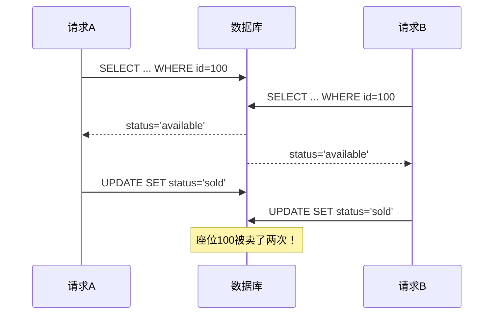
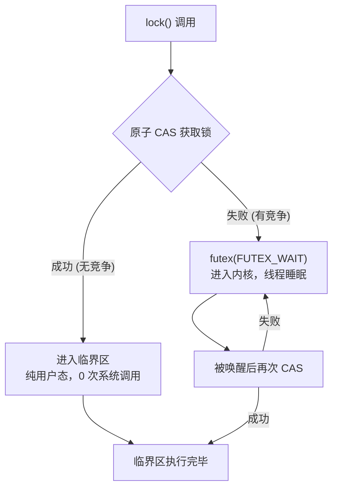
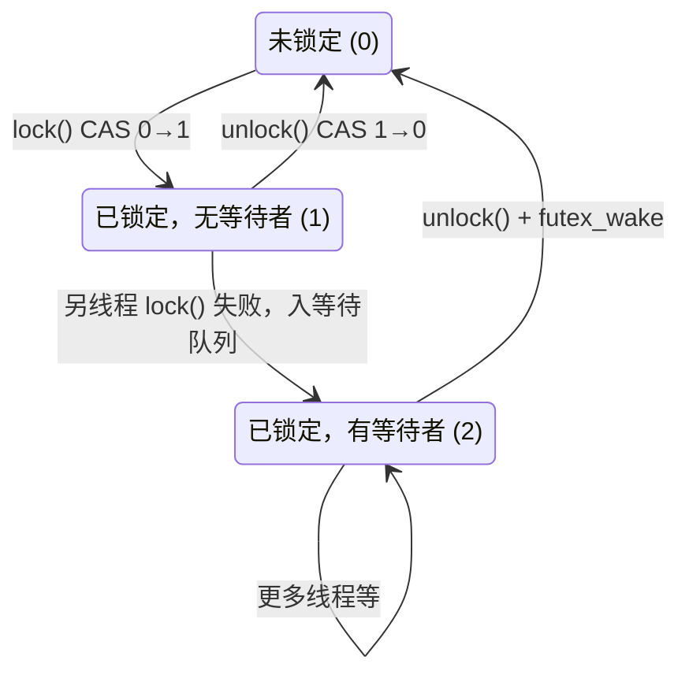
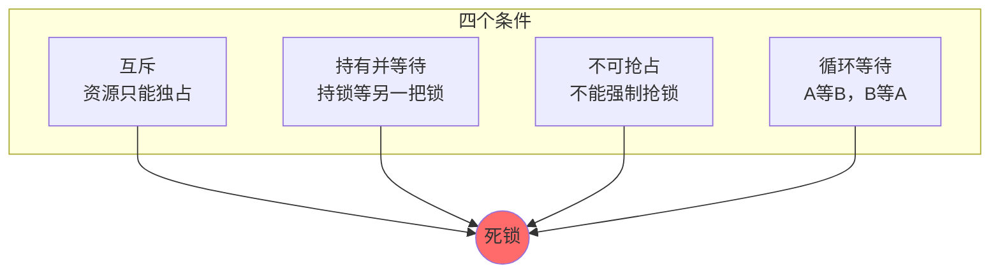

# OS同步与互斥机制

> 锁/条件变量/信号量/死锁四条件/银行家算法——并发编程的地基

#### 目录介绍
- [1. 案例引入](#1-案例引入)
  - [1.1 一天卖了两次票](#11-一天卖了两次票)
  - [1.2 顺藤摸到根因](#12-顺藤摸到根因)
  - [1.3 我们要回答什么](#13-我们要回答什么)
- [2. 架构概览](#2-架构概览)
  - [2.1 同步互斥全景图](#21-同步互斥全景图)
  - [2.2 为什么这么切](#22-为什么这么切)
  - [2.3 并发编程的形式化基础](#23-并发编程的形式化基础)
- [3. 硬件原子根基](#3-硬件原子根基)
  - [3.1 关中断方案为何不通用](#31-关中断方案为何不通用)
  - [3.2 TAS与自旋锁](#32-tas与自旋锁)
  - [3.3 CAS的威力](#33-cas的威力)
  - [3.4 futex双路径设计](#34-futex双路径设计)
- [4. 互斥锁体系](#4-互斥锁体系)
  - [4.1 自旋锁的代价模型](#41-自旋锁的代价模型)
  - [4.2 互斥锁的状态机](#42-互斥锁的状态机)
  - [4.3 自旋vs睡眠怎么选](#43-自旋vs睡眠怎么选)
  - [4.4 读写锁与写者饥饿](#44-读写锁与写者饥饿)
  - [4.5 递归锁是止疼药](#45-递归锁是止疼药)
- [5. 条件变量与信号量](#5-条件变量与信号量)
  - [5.1 锁不够用](#51-锁不够用)
  - [5.2 条件变量的三纪律](#52-条件变量的三纪律)
  - [5.3 丢失唤醒的根因](#53-丢失唤醒的根因)
  - [5.4 信号量作为同步原语](#54-信号量作为同步原语)
  - [5.5 信号量与条件变量](#55-信号量与条件变量)
- [6. 经典同步问题](#6-经典同步问题)
  - [6.1 生产者消费者模型](#61-生产者消费者模型)
  - [6.2 读者写者三变体](#62-读者写者三变体)
  - [6.3 哲学家就餐与三解法](#63-哲学家就餐与三解法)
  - [6.4 理发师与线程池](#64-理发师与线程池)
- [7. 死锁全貌](#7-死锁全貌)
  - [7.1 死锁四条件](#71-死锁四条件)
  - [7.2 死锁预防四法](#72-死锁预防四法)
  - [7.3 银行家算法推演](#73-银行家算法推演)
  - [7.4 数据库死锁检测](#74-数据库死锁检测)
  - [7.5 活锁与饥饿的辨识](#75-活锁与饥饿的辨识)
- [8. 内存序与可见性](#8-内存序与可见性)
  - [8.1 指令重排的三层来源](#81-指令重排的三层来源)
  - [8.2 四种内存序的实验](#82-四种内存序的实验)
  - [8.3 锁的内存序本质](#83-锁的内存序本质)
  - [8.4 DCL双检锁的修复史](#84-dcl双检锁的修复史)
- [9. 实战排查武器库](#9-实战排查武器库)
  - [9.1 死锁定位](#91-死锁定位)
  - [9.2 perf与锁竞争热点](#92-perf与锁竞争热点)
  - [9.3 数据竞争检测](#93-数据竞争检测)
  - [9.4 火焰图与并发诊断](#94-火焰图与并发诊断)
- [10. 综合案例串讲](#10-综合案例串讲)
  - [10.1 案例真相揭晓](#101-案例真相揭晓)
  - [10.2 转账三种方案](#102-转账三种方案)
  - [10.3 设计哲学回扣](#103-设计哲学回扣)
  - [10.4 同步互斥速查](#104-同步互斥速查)


## 1. 案例引入

### 1.1 一天卖了两次票

先看一段在生产环境造成的**资损事故**——一个热门演唱会的售票接口在国庆黄金周前夜出现重复出票，同一个座位被卖给了两个用户：

```
后台数据:
  座位 ID=100, 状态 status='available'
  
  请求 A 于 20:00:00.001 到达 → SELECT status FROM seats WHERE id=100
  请求 B 于 20:00:00.003 到达 → SELECT status FROM seats WHERE id=100
  请求 A 于 20:00:00.050 → status='available' → UPDATE SET status='sold'
  请求 B 于 20:00:00.052 → status='available' → UPDATE SET status='sold'
  
结果: 座位 100 被卖了两次，客服电话被打爆，公关连夜发道歉声明。
```

问题代码——一段看似无辜的库存扣减：

```go
func buyTicket(seatID int) error {
    seat := db.Query("SELECT status FROM seats WHERE id = ?", seatID)
    if seat.Status == "available" {
        db.Exec("UPDATE seats SET status = 'sold' WHERE id = ?", seatID)
        return nil
    }
    return errors.New("seat not available")
}
```



**现象**：
- 单线程测试：**100% 通过**（压根没有并发）
- 压测 100 QPS：**偶尔复现**（概率 ~0.1%）
- 大促零点 5000 QPS：**批量重复**（概率 ~5%）

### 1.2 顺藤摸到根因

带着这条线往下挖，追问链一步步深入：

- 假设 1：加个进程内锁？—— 加了 `sync.Mutex`，但线上是 8 个进程实例，**进程内锁挡不住跨进程并发**
- 假设 2：那用数据库悲观锁 `SELECT ... FOR UPDATE`？—— 可以，但大促 5000 QPS 下大量事务排队，**吞吐量掉 80%**
- 假设 3：有没有乐观的方案？—— **用 CAS 思想**：`UPDATE seats SET status='sold' WHERE id=? AND status='available'`，靠 WHERE 条件做原子判断，返回 `affected_rows=0` 表示被别人抢了
- 假设 4：这就是 CAS 啊！那 ABA 问题呢？—— 这个场景不担心 ABA（状态只有 available/sold 两种），但在**无锁栈**里 ABA 会致命——被删除的节点被复用，CAS 误判为"没变"
- 假设 5：如果两个座位互锁呢？—— 如果 A 先锁座位 1 等座位 2，B 先锁座位 2 等座位 1 → **死锁**

看似"先查后改"的代码没毛病在逻辑，**毛病在没有意识到并发环境里"查"和"改"之间可以被另一个线程插入**——这不是业务逻辑的坑，是**同步与互斥机制**的坑。

这一段事故里藏着 8 个原理点：

```
① 竞态到底怎么产生的？CPU 指令层面拆开看        → 第 2 章
② 自旋锁 vs 互斥锁怎么选？差在哪？               → 第 4 章
③ CAS 是什么？它的原子性谁来保证？               → 第 3 章
④ futex 为什么是高性能锁的基石？                  → 第 3.4 节
⑤ 条件变量解决什么问题？为什么不能只用锁？        → 第 5 章
⑥ 信号量 vs 条件变量，什么时候用哪个？            → 第 5 章
⑦ 死锁四个条件是什么？银行家算法怎么算？          → 第 7 章
⑧ 指令重排怎么破坏并发？内存序怎么选？            → 第 8 章
```

### 1.3 我们要回答什么

这个事故就是本篇的**主线案例**。我们带着上面 8 个问号往下走，每讲完一段原理就解开一两个；最后在第 10 章把案例及高并发转账系统一起剖开。

本篇路线：

```
硬件原子根基 (第 3 章) → 解开"lock 的底层靠什么保证原子性"
   ↓
互斥锁体系 (第 4 章) → 解开"五种锁怎么选"
   ↓
条件变量与信号量 (第 5 章) → 解开"如何等资源、等事件"
   ↓
经典同步问题 (第 6 章) → 四模型映射到现实系统
   ↓
死锁全貌 (第 7 章) → 预防/避免/检测/恢复四层防线
   ↓
内存序 (第 8 章) → 解开"锁为什么能保证可见性"
   ↓
实战武器库 (第 9 章) → 工具链
   ↓
综合案例 (第 10 章) → 售票 + 转账 + 设计哲学
```

> 📌 **本篇定位**：这是操作系统系列的**并发地基篇**。第 01-03 篇讲的进程线程、调度、IPC，本质都是"谁在跑、谁在等、谁在通讯"；本篇回答"**跑的时候怎么保证不出乱子**"。读完本篇后，再看任何多线程代码，都能立刻回答："**这里安全吗？用什么保护？**"


## 2. 架构概览

### 2.1 同步互斥全景图

我们把操作系统提供的并发控制体系切成**三层**：

```
┌──────────────────────────────────────────────────────────┐
│                    应用层 (业务代码)                       │
│   pthread_mutex_lock / sem_wait / atomic_compare_exchange│
├──────────────────────────────────────────────────────────┤
│                    内核层 (OS 同步原语)                    │
│  ┌──────────┐ ┌──────────┐ ┌──────────┐ ┌──────────────┐│
│  │ 互斥锁   │ │ 条件变量  │ │ 信号量   │ │ futex        ││
│  │ Mutex    │ │ CondVar  │ │ Semaphore│ │ (FastUsersp) ││
│  └──────────┘ └──────────┘ └──────────┘ └──────────────┘│
│  ┌──────────┐ ┌──────────┐ ┌──────────┐ ┌──────────────┐│
│  │ 自旋锁   │ │ 读写锁   │ │ 屏障     │ │ RCU          ││
│  │ Spinlock │ │ Rwlock   │ │ Barrier  │ │ (ReadCopyUp) ││
│  └──────────┘ └──────────┘ └──────────┘ └──────────────┘│
├──────────────────────────────────────────────────────────┤
│                    硬件层 (原子指令)                       │
│  ┌──────────┐ ┌──────────┐ ┌──────────┐ ┌──────────────┐│
│  │ Test&Set │ │ Compare  │ │ Fetch&Add│ │ LL/SC        ││
│  │ (xchg)   │ │ &Swap    │ │ (lock xadd)│ │(LoadLinked) ││
│  └──────────┘ └──────────┘ └──────────┘ └──────────────┘│
│  ┌──────────────────────────────────────────────────────┐│
│  │         内存屏障 (mfence/lfence/sfence)               ││
│  └──────────────────────────────────────────────────────┘│
└──────────────────────────────────────────────────────────┘
```

三层核心关系：

| 层 | 职责 | 核心产物 | 与上层关系 |
|---|---|---|---|
| 硬件 | 提供原子指令 | TAS / CAS / FAA / 内存屏障 | 所有锁的根基 |
| 内核 | 封装原子指令为系统调用 | futex / 睡眠 / 唤醒 | 用户态锁的"慢路径" |
| 应用 | 组合同步原语 | Mutex / CondVar / Rwlock | 最终消费者 |

### 2.2 为什么这么切

为什么把同步机制切成三层，而不是直接给一把"万能锁"？

**疑惑**：直接给一种锁，程序加锁就能互斥，不行吗？

**论证**：

1. **硬件层是"原子性"的物理保证**——TAS 靠锁内存总线，CAS 靠缓存一致性协议（MESI），内存屏障靠 CPU store buffer 冲刷。**没有这一层，任何软件锁都是空中楼阁**。
2. **内核层解决"睡眠决定权"问题**——自旋锁空转 CPU，互斥锁让线程睡眠。**谁来决定睡眠？只有内核有调度器**。所以 futex 的设计：无竞争时用户态 CAS 搞定（不走内核），有竞争时 futex 系统调用让线程睡眠——**快路径不花钱，慢路径才花钱**。
3. **应用层解决"语义匹配"**——拿锁等条件？条件变量。控制 N 个资源？信号量。读多写少？读写锁。极限性能？无锁 CAS。**每一层封装都解决一个特定的使用场景**。
4. 反向验证：如果只有一把万能锁会怎样？所有读操作互斥 → 读多写少的缓存系统吞吐量掉 100 倍。**锁的种类之所以多，是因为并发的"读/写/等/通知"各有最优解**。

**结论**：三层分层不是为了"好看"，而是把**原子性、睡眠决策、语义匹配**三个独立维度各自解决——每一层只需要关注自己的问题。这是 OS 设计的经典"分层解耦"哲学。

下面我们从最底层的"硬件原子指令"开始，看锁的第一块砖是怎么烧出来的。

### 2.3 并发形式化基础

在进入具体机制之前，先建立两个理论支柱——它们贯穿全文。

#### 2.3.1 Data Race 与 Race Condition 的区别

这两个概念常被混淆，但有严格的区分：

| | Data Race（数据竞争） | Race Condition（竞态条件） |
|---|---|---|
| **定义** | 两个线程同时访问同一内存，至少一个是写，且无同步 | 程序正确性依赖于事件的发生顺序 |
| **检测** | 可通过 happens-before 关系机械检测（ThreadSanitizer 做的事） | 需要理解程序语义 |
| **关系** | Data Race 是 Race Condition 的子集 | 可能无 Data Race 但仍存在 Race Condition |

**无 Data Race 但有 Race Condition 的例子**：

```c
_Atomic int flag = 0;
int resource = 0;

// 线程1
void t1() {
    resource = 42;                          // 非原子写
    atomic_store(&flag, 1);                 // 原子写
}

// 线程2
void t2() {
    if (atomic_load(&flag) == 1) {          // 原子读
        printf("%d\n", resource);           // 可能看到 0！
    }
}
// 两个线程都用了原子操作 → 没有 Data Race
// 但如果编译器/CPU 重排 → 线程2 看到 flag==1 但 resource==0
// → 这是 Race Condition，不是 Data Race
```

**核心理解**：Data Race 是技术层面的（内存访问冲突），Race Condition 是逻辑层面的（时序依赖）。用原子操作消除 Data Race 是第一步，用内存屏障消除 Race Condition 是第二步。

#### 2.3.2 Happens-Before 形式化模型

Leslie Lamport (1978) 提出的 **happens-before** 是并发正确性的理论基础：

**定义**：事件 a **happens-before** 事件 b（记作 a → b）当且仅当：
1. **程序顺序**（Program Order）：同一线程中 a 在 b 之前
2. **同步顺序**（Synchronization Order）：a 是 unlock(M)，b 是后续的 lock(M)
3. **传递闭包**：若 a → b 且 b → c，则 a → c

**竞态判定定理**：对共享变量 x 的两次访问 a 和 b（至少一个是写），如果 a → b 和 b → a 都不成立（即它们**并发**），则存在 Data Race。

```
Thread1: W(x,1) ──→ R(y)
                        ↘ 无 happens-before → 并发 → Data Race！
                        ↗
Thread2: W(y,1) ──→ R(x)
```

**工程意义**：
- Java JMM 和 C11 内存模型都基于 happens-before
- `mutex.unlock()` happens-before `mutex.lock()` — 锁保证可见性
- `atomic_store(release)` happens-before `atomic_load(acquire)` 若读到该值 — 无锁编程的可见性基础


## 3. 硬件原子根基

### 3.1 关中断为何不通用

在单核 CPU 上，关闭中断是最简单的互斥方案——没有时钟中断就没有线程切换：

```c
void lock()  { cli(); }   // 关中断 (Clear Interrupt)
void unlock(){ sti(); }   // 开中断 (Set Interrupt)
```

**为什么现代系统不用了？**

1. **多核无效**——关中断只影响当前核心，其他核心上的线程照跑
2. **特权指令**——`cli`/`sti` 是 Ring 0 指令，用户态程序无法执行
3. **中断丢失**——关太久会导致网络包丢失、时钟不准
4. **性能灾难**——关中断期间，所有 I/O 事件被堆积

**结论**：关中断只能用于**内核极短临界区**（几微秒），用户态必须另寻他法——于是硬件提供了**原子指令**。

### 3.2 TAS与自旋锁

Test-and-Set（TAS）是最简单的硬件原子指令——**原子地"读出一个值，并写入一个新值"**：

```text
; x86 的 TAS 等效实现——XCHG
test_and_set:
    mov  eax, 1              ; 想要设置为 1
    xchg eax, [lock_var]     ; 原子交换：eax ← 旧值, [lock_var] ← 1
    test eax, eax            ; 检查旧值是否为 0
    ret
; 旧值=0 → 锁空闲，获取成功
; 旧值=1 → 锁已被占用
```

**原子性如何保证？** `XCHG` 指令自动带 `LOCK` 前缀（Intel Manual Vol.2）——执行期间**锁住内存总线或缓存行**，其他核心的访存请求被阻塞，直到指令完成。

用 TAS 实现自旋锁：

```c
typedef struct { int locked; } spinlock_t;

void spin_lock(spinlock_t *lock) {
    while (1) {
        if (test_and_set(&lock->locked) == 0)
            break;
        __builtin_ia32_pause();  // x86 PAUSE: 提示 CPU 这是自旋循环
    }                            // 降低功耗、避免内存序违规
}

void spin_unlock(spinlock_t *lock) {
    lock->locked = 0;  // 普通写即可，不需要原子
}
```

**深入一问**：为什么 `spin_unlock` 里 `lock->locked = 0` 不是原子操作也能行？

```
因为锁的语义是"独占"——只有持锁的线程会写 0。
但需要内存屏障保证：在写 0 之前，临界区内的所有修改对其他核心可见。
x86 的 mov 指令自带"写释放"语义（TSO 内存模型），但在 ARM/RISC-V 
的弱内存模型下，spin_unlock 需要显式 barrier。
```

#### 3.2.1 x86 vs ARM：两种原子哲学

TAS/CAS 在 x86 上是原生指令，但 ARM/RISC-V 走的是一条不同的路——**LL/SC（Load-Linked / Store-Conditional）**：

```
x86 方案: 硬件帮你"读-改-写"一步完成（CMPXCHG 指令）
  → 优势：一条指令，使用简单
  → 代价：需要锁缓存行/总线

ARM 方案: 硬件只提供"监视"，软件自己组合（LDAXR / STLXR 配对）
  → LDAXR r0, [addr]    // Load-Linked: 加载值 + 设置监视标记
  → ... 计算新值 ...
  → STLXR w1, r0, [addr] // Store-Conditional: 若监视标记还在则写入
  → w1==0 表示成功，w1!=0 表示期间有其他写入
```

**LL/SC 的优势**：
1. **不锁总线**——只在 STLXR 时检查监视标记，无冲突时零开销
2. **不受 ABA 限制**——硬件监视的是"地址是否被写过"，不是"值是否相同"

**LL/SC 的 CAS 等价实现**：

```text
; ARM 上用 LL/SC 实现 CAS
cas:
    LDAXR w2, [x0]        ; LL: 加载 *ptr 到 w2，设置监视
    cmp   w2, w1           ; 和 expected 比较
    b.ne  fail             ; 不相等 → 失败
    STLXR w3, w2, [x0]    ; SC: 尝试写入 desired
    cbnz  w3, cas          ; w3!=0 → 监视失效，重试
    mov   w0, #1           ; 返回 true
    ret
fail:
    STLXR w3, w2, [x0]     ; 清除监视（写回旧值）
    mov   w0, #0           ; 返回 false
    ret
```

**关键区别**：ARM 的 LL/SC 天然免疫 ABA——如果地址被写过，监视标记自动清除，`STLXR` 必定失败。x86 的 CAS 只看"值是否相等"，不管"中间被改过多少次"。所以 x86 无锁编程需要用双宽 CAS（`CMPXCHG16B`）加版本号来解决 ABA。

#### 3.2.2 共识数与无锁层级

Maurice Herlihy (1991) 提出了一个根本性问题：**不同原子指令的能力有上限吗？**

**共识数（Consensus Number）**：一个原子操作能解决**最多多少个线程**的共识问题（所有线程对某个值达成一致）。

| 原子操作 | 共识数 | 说明 |
|---|---|---|
| `read` / `write` | 1 | 无法解决 2 线程共识 |
| `Test-and-Set`、`Fetch-and-Add`、`Swap` | 2 | 只能解决 2 线程，3 线程不行 |
| `Compare-and-Swap`、`LL/SC` | **∞** | 可解决任意线程数 |

**推论**：
- **CAS 是"通用"的原子原语**——用 CAS 可以实现任何其他原子操作的 wait-free 版本
- TAS 只能实现 2 线程的 wait-free 算法
- 这就是为什么 **CAS 是无锁编程的"一等公民"**，Java `AtomicReference`、C++ `std::atomic<T>` 的核心都是 CAS
- 也是为什么 Linux 内核的 `cmpxchg()` 是最核心的原语——内核中的无锁数据结构全部基于 CAS

```
实践含义：
  - 如果你只用 TAS → 你写不出真正的 wait-free 多线程数据结构
  - 如果你有 CAS → 理论上你可以实现任何无锁数据结构
  - 但"可以实现" ≠ "容易实现"——ABA、内存回收仍然是难题
```

### 3.3 CAS的威力

CAS 比 TAS 更强大——**不是无条件写入，而是"比较相等才写入"**：

```
CAS(ptr, expected, desired):
    原子地执行:
        if *ptr == expected:
            *ptr = desired
            return true
        else:
            expected = *ptr     // 把实际值写回 expected
            return false
```

**CAS 的三种经典用法**：

**用法 1 · 无锁计数器**：

```c
void atomic_inc(int *ptr) {
    int old, new_val;
    do {
        old = __atomic_load_n(ptr, __ATOMIC_RELAXED);
        new_val = old + 1;
    } while (!__atomic_compare_exchange_n(ptr, &old, new_val,
               /*weak=*/0, __ATOMIC_RELEASE, __ATOMIC_RELAXED));
    // 失败时 old 已被更新为当前值 → 直接用新 old 再算 new_val
}
```

**用法 2 · 无锁栈 push**：

```c
void push(Node **head, Node *node) {
    do {
        node->next = *head;          // 读当前栈顶
    } while (!CAS(head, &node->next, node));
}   // 如果期间其他线程改了 head → CAS 失败 → 重试
```

**用法 3 · 乐观锁**（售票场景修复）：

```sql
-- 不需要 SELECT FOR UPDATE, 直接原子 UPDATE
UPDATE seats SET status='sold' WHERE id=? AND status='available';
-- 返回 affected_rows=1 → 抢到座位
-- 返回 affected_rows=0 → 被别人抢了
```

**ABA 问题——CAS 的阿喀琉斯之踵**：

```
线程 A: 读取栈顶 head → node X
线程 B: pop X → push Y → pop Y → push X  (X 被回收后又被复用)
线程 A: CAS(head, X, X->next) → 成功！但 X->next 已经指向已释放的内存！
```

**三种修复方案**：

| 方案 | 做法 | 代价 |
|---|---|---|
| 双宽 CAS | 同时比较指针+版本号（x86 `cmpxchg16b`） | 需硬件支持 |
| 危险指针 | 延迟回收（等所有线程离开临界区） | 内存延迟释放 |
| RCU | 读者无锁，写者等待 grace period | 写者性能稍差 |

### 3.4 futex双路径设计

**疑惑**：互斥锁能睡眠——但睡眠是系统调用，很慢，怎么做到又快又愿意睡眠？

**论证**：Linux 的 `futex`（Fast Userspace Mutex）给出了教科书级答案——**双路径设计**：



```
Fast Path（无竞争，>99% 的情况）:
  lock():   用户态 atomic CAS 0→1 → 成功 → 不需要内核 → ~25ns
  unlock(): 用户态 atomic CAS 1→0 → 成功 → 不需要内核

Slow Path（有竞争，<1% 的情况）:
  lock():   用户态 CAS 失败 → futex(FUTEX_WAIT) → 线程睡眠 → ~2μs
  unlock(): 发现有等待者 → futex(FUTEX_WAKE) → 唤醒队首线程
```

**futex 的三个精妙设计**：

1. **锁变量在用户态**——CAS 操作直接读内存，不需要系统调用就能判断"有没有人"
2. **等待队列在内核态**——睡眠调度只有内核能做，futex 把"需要调度的部分"交给内核
3. **无竞争 0 开销**——没有线程在等时，lock+unlock 全程不碰内核

**这就是高性能并发库的共同基因**：Go `sync.Mutex`（先自旋再 futex）、Java `ReentrantLock`、Rust `std::sync::Mutex`——全都借鉴这个思想。

#### 3.4.1 优先级反转与 futex PI 锁

futex 能解决互斥问题，但有一个隐蔽的陷阱——**优先级反转（Priority Inversion）**：

```
场景：三个线程，优先级 H > M > L
  T1: L 线程拿到锁 → 进临界区
  T2: H 线程尝试拿锁 → futex_wait 睡眠
  T3: M 线程持续运行（优先级比 L 高，抢占 L）

结果：L 持锁但没机会跑（被 M 抢占），H 等 L 放锁 → 
      高优先级的 H 实际上被中优先级的 M 阻塞了！
      → 优先级反转：H 等 L，L 被 M 阻塞，H 的优先级被"反转"到了 M 下面
```

**火星探路者事故（1997）**：火星车因优先级反转导致 `select()` 调用反复触发看门狗复位，差点丢失探测器。这就是优先级反转最著名的工程案例。

**修复：优先级继承（Priority Inheritance）**

Linux 的 **PI-futex**（`FUTEX_LOCK_PI` / `FUTEX_UNLOCK_PI`）：

```
1. H 线程 futex_wait 时：内核把 L 的优先级临时提升到 H
2. L 不会被 M 抢占 → 能快速跑完临界区 → 释放锁
3. H 被唤醒，拿锁
4. L 的优先级恢复为原始值

效果：H 的等待时间 = L 临界区时间（有 H 的优先级保护），不会因为 M 而无限延长
```

```c
// PI-futex 的使用（glibc 的 PTHREAD_PRIO_INHERIT 属性）
pthread_mutexattr_t attr;
pthread_mutexattr_init(&attr);
pthread_mutexattr_setprotocol(&attr, PTHREAD_PRIO_INHERIT);  // 启用优先级继承
pthread_mutex_init(&mutex, &attr);
```

**工程实践**：普通应用很少遇到（因为没有实时优先级需求），但**实时系统（RT-Linux、汽车 ECU、航空电子）必须使用 PI 锁**。这也是为什么 Linux 内核的 `rt_mutex` 默认支持优先级继承。


## 4. 互斥锁体系

### 4.1 自旋锁的代价模型

自旋锁的代价**不是"浪费了 CPU 时间"**——是**浪费了 CPU 时间的同时阻止了其他线程用这个 CPU**：

```
假设临界区 50ns，上下文切换 2μs，线程数=核数=8：

场景 A（自旋锁，争用率 10%）:
  每次争用：自旋 200ns → 获取锁
  吞吐 = 1 / (0.9×50ns + 0.1×250ns) ≈ 14M ops/s

场景 B（互斥锁，争用率 10%）:
  每次争用：睡眠 2μs + 唤醒 2μs = 4μs
  吞吐 = 1 / (0.9×50ns + 0.1×4050ns) ≈ 2.2M ops/s

→ 自旋锁 6.3 倍于互斥锁！
```

**自旋锁适用判定表**：

| 条件 | 自旋锁 | 互斥锁 |
|---|---|---|
| 临界区 < 1μs | ✅ 最优 | ⚠️ 开销偏大 |
| 临界区 1~10μs | ⚠️ 看竞争程度 | ✅ 安全 |
| 临界区 > 10μs | ❌ CPU 空转 | ✅ |
| 单核 | ❌ 自旋=死循环 | ✅ |
| 中断上下文 | ✅ 唯一选择 | ❌ 睡眠非法 |
| 线程数 > 核数 | ❌ 饥饿 | ✅ |

#### 4.1.1 自旋锁的物理代价：MESI 协议与缓存行弹跳

自旋锁的"自旋"不是简单的 CPU 空转——在**缓存一致性协议**层面有真实的物理代价。

**MESI 协议**维护多核之间缓存行的一致性，每行有四种状态：

| 状态 | 含义 | 锁变量处于该态的场景 |
|------|------|---------------------|
| **M**odified | 仅本核心有，且已修改（脏） | 持锁线程刚执行 `locked=1` |
| **E**xclusive | 仅本核心有，与内存一致 | 无竞争时第一个获取锁的线程读 |
| **S**hared | 多核心共享，一致 | 多个线程自旋读 `locked==1` |
| **I**nvalid | 本核心缓存行无效 | 锁被释放后，其他核心的旧缓存被 invalidation 广播打掉 |

**自旋锁在 MESI 上的完整流程**：

```
核0 持锁: locked=1，缓存行 M 态
核1 自旋: Read → 核0 响应 → 核1 S 态，核0 → S 态
核2 自旋: Read → 已在多核 S 态 → 无总线流量
...（N 个核都在 S 态自旋，此时仅读，无竞争代价）

核0 释放锁: 写 locked=0 → 必须先发 Invalidate 给所有核!
  → 所有自旋核的缓存行 → I 态（失效）
  → 下一获取锁的核：Read Miss → 总线请求 → ~100ns

== 这就是缓存行弹跳（Cache Line Bouncing）==
每次锁释放 → 所有自旋核的缓存行全部失效
获取锁的核重新拉缓存行 → 一次总线事务
N 个核竞争同一把自旋锁 → N-1 次无效的失效/重载
```

**量化影响**：
```
1 核自旋：解锁 ~10ns
8 核自旋：解锁 ~150ns（8 次失效广播 + 8 次重载）
```

**解法：MCS 锁（Mellor-Crummey-Scott）**——每个线程在**自己的**缓存行上自旋：

```c
// MCS 锁节点：每个线程有自己的独立节点
typedef struct mcs_node {
    struct mcs_node *next;    // 后继等待者
    int locked;               // 在自己的节点上自旋！
} mcs_node_t;

// 每个线程只在各自的 mcs_node.locked 上自旋
// 释放锁时只 Invalidate 下一个线程的节点
// → 没有缓存行弹跳问题
// → Linux 内核的 qspinlock 是 MCS 锁的优化变体
```

#### 4.1.2 伪共享（False Sharing）——性能的隐形杀手

伪共享是**两个线程操作不同的变量，但由于它们恰好在同一缓存行（64B），CPU 把它们当作"共享"处理**：

```c
struct {
    int counter_a;  // 线程A 频繁写
    int counter_b;  // 线程B 频繁写  ← 和 counter_a 紧挨着！
} data;             // 两个变量大概率在同一 64 字节缓存行

// 线程A: data.counter_a++ → 缓存行拉到 M 态
// 线程B: data.counter_b++ → 先 Invalidate 线程A 的缓存行!
//                            → 线程A 下次操作又要 Invalidate 线程B
//                            → 来回乒乓，吞吐跌 10~100 倍
```

**检测**：`perf stat -e cache-misses` 如果 `L1-dcache-load-misses` 异常高且访问模式是两个线程操作相邻变量 → 伪共享。

**修复**：填充到独立缓存行：

```c
struct {
    alignas(64) int counter_a;
    alignas(64) int counter_b;   // 保证不共享缓存行
} data;
```

**工程案例**：Linux 内核的 `struct page` 大量使用 `____cacheline_aligned`、Java 的 `@Contended` 注解、Go 的 `_ [64]byte` padding——都是防御伪共享。

### 4.2 互斥锁的状态机

互斥锁不只是"锁住/解锁"两种状态——完整状态机：



**三种状态对应的内核行为**：

```
FREE → LOCKED:  纯用户态 CAS，0 系统调用
LOCKED → FREE:  纯用户态 CAS，0 系统调用
LOCKED → CONTENDED: 竞争的线程 futex_wait → 系统调用
CONTENDED → FREE: 释放的线程 futex_wake → 系统调用
```

**这就是为什么"无竞争的锁极快、有竞争的锁需要内核"**。

### 4.3 自旋vs睡眠怎么选

**决策公式**：

```
如果: 临界区时间 < 上下文切换时间 × 2  AND  核数足够
  选自旋锁
否则:
  选互斥锁
```

**量化参考**：

| 平台 | 上下文切换 | 自旋安全上限 |
|---|---|---|
| Linux x86-64 | ~2μs | ≤ 4μs 临界区 |
| macOS ARM | ~3μs | ≤ 6μs 临界区 |
| 典型虚拟机 | ~10μs | ≤ 20μs 临界区 |

**Go 的混合策略**（最值得借鉴的工程方案）：

```
Go 1.13+ sync.Mutex:
  模式 1 (正常): 先自旋 4 次 → 失败 → 睡眠等待
  模式 2 (饥饿): 等待超过 1ms → 直接睡眠（不自旋）
  
设计哲学: 90% 的锁竞争在 4 次自旋内解决，
         剩下 10% 是长时间竞争，自旋浪费 CPU，直接睡眠。
```

### 4.4 读写锁与写者饥饿

读写锁的本质：**允许读-读并发，禁止读-写和写-写并发**。

```
锁状态              读锁请求       写锁请求
─────────────────────────────────────────
无人持锁              允许           允许
有读者                允许           等待
有写者                等待           等待
```

**写者饥饿的经典场景**：

```
时刻 读者数  写者等待
T0   0        W1 到达 → 获取写锁
T1   W1 释放 → R1,R2,R3 到达 → 获取读锁
T2   3        W2 到达 → 等待
T3   3        R4,R5 到达 → 获取读锁（此时已有 5 个读者）
T4   5        W2 仍在等待
... 持续有读者 → W2 永远等不到 → 写者饥饿
```

**三种策略对比**：

| 策略 | 做法 | 饿死谁 | 适用 |
|---|---|---|---|
| 读者优先 | 只要有读者就放行 | 写者 | 读密集、写不紧急 |
| **写者优先** | 写者到达后阻塞新读者 | 读者 | **推荐默认** |
| 公平 | FIFO 队列，先到先得 | 都不饿 | 延迟敏感 |

### 4.5 递归锁是止疼药

**疑惑**：同一个线程 lock 两次会发生什么？

**论证**：

```
普通互斥锁：
  lock() → 成功（0→1）
  lock() → 检测到锁已被自己持有（locked=1）→ 等自己释放 → 死锁！
  
递归锁：
  lock() → 成功（0→1, owner=me, count=1）
  lock() → 检测到 owner==me → count++ (count=2)
  unlock() → count-- (count=1)
  unlock() → count-- (count=0) → 真正释放
```

```c
pthread_mutex_t mutex;
pthread_mutexattr_t attr;
pthread_mutexattr_settype(&attr, PTHREAD_MUTEX_RECURSIVE);
pthread_mutex_init(&mutex, &attr);

void outer() {
    pthread_mutex_lock(&mutex);
    inner();                       // 同线程再次加锁 → 不会死锁
    pthread_mutex_unlock(&mutex);
}
void inner() {
    pthread_mutex_lock(&mutex);    // 引用计数 +1
    /* ... */
    pthread_mutex_unlock(&mutex);  // 引用计数 -1
}
```

**为什么说它是"止疼药"？**

递归锁掩盖了**设计问题**——函数 `inner()` 不知道自己是否已被加锁，说明"加锁的职责"不明确。正确的做法是：**拆分 locked 版本和 unlocked 版本**：

```c
// 好的设计：区分 locked 和 unlocked 版本
void inner_locked() { /* 调用方已加锁 */ }
void inner() {
    pthread_mutex_lock(&mutex);
    inner_locked();
    pthread_mutex_unlock(&mutex);
}
```

**结论**：递归锁是技术债的糖衣——能用普通锁就不要用递归锁。


## 5. 条件变量与信号量

### 5.1 锁不够用

**疑惑**：已经有锁了，为什么还需要条件变量？

**论证**：锁解决"**互斥**"，不解决"**等待条件**"——这两个是不同的问题。

```
互斥问题: "同一时刻只让一个人改"              → 锁
等待问题: "队列里有数据了吗？没有就等他放"     → 条件变量
```

**只用锁的错误写法——忙等**：

```c
pthread_mutex_lock(&mutex);
while (queue_is_empty()) {
    pthread_mutex_unlock(&mutex);   // 释放，让生产者放数据
    usleep(100);                     // ❌ 拍脑袋：100μs? 1ms?
    pthread_mutex_lock(&mutex);     // 重新拿锁
}
// 问题: usleep(100) 太小 → CPU 空转; 太大 → 响应延迟高
```

**条件变量的正确写法**：

```c
pthread_mutex_lock(&mutex);
while (queue_is_empty()) {
    pthread_cond_wait(&cond, &mutex);  // 原子释放锁 + 睡眠
}
// 条件满足 → 自动重新持锁 → 处理数据
pthread_mutex_unlock(&mutex);
```

### 5.2 条件变量的三纪律

```c
pthread_mutex_t mutex = PTHREAD_MUTEX_INITIALIZER;
pthread_cond_t  cond  = PTHREAD_COND_INITIALIZER;
int ready = 0;

// 等待方
void *waiter(void *arg) {
    pthread_mutex_lock(&mutex);
    while (!ready) {                         // 纪律 ①: while 不是 if!
        pthread_cond_wait(&cond, &mutex);    // 纪律 ②: wait 必须带 mutex
    }
    do_work();
    pthread_mutex_unlock(&mutex);
}

// 通知方
void *signaler(void *arg) {
    pthread_mutex_lock(&mutex);
    ready = 1;
    pthread_cond_signal(&cond);              // 纪律 ③: signal 前必须持锁
    pthread_mutex_unlock(&mutex);
}
```

**三条纪律的根因**：

| 纪律 | 违反后果 | 为什么 |
|---|---|---|
| `while` 不是 `if` | 虚假唤醒后条件不满足 | OS 可能无故唤醒；多消费者场景下另一个消费者抢了资源 |
| wait 带 mutex | 数据竞争或死锁 | 检查条件和睡眠必须是原子的；唤醒后必须重获锁 |
| signal 前持锁 | 丢失唤醒 | 等待方可能还没进入 wait，信号已发出 |

### 5.3 丢失唤醒的根因

**丢失唤醒的经典时序**：

```
等待方 (消费者)                    通知方 (生产者)
─────────────────                  ─────────────────
                                   pthread_mutex_lock(&mutex);
                                   ready = 1;
pthread_mutex_lock(&mutex);        ← 等锁
                                   pthread_cond_signal(&cond);
                                   pthread_mutex_unlock(&mutex);
pthread_mutex_lock 成功
while (!ready)                     ← ready 已经是 1
    pthread_cond_wait() 不进入      ← 但 signal 已发出了！
    
→ 消费者完全没"等"——因为生产者先改了 ready 再 signal
→ 这就是为什么 signal 前必须持锁：保证消费者要么在 sleep、要么还在 try_lock
```

**虚假唤醒的原因**：POSIX 标准明确允许 `pthread_cond_wait` 在没有 signal 的情况下返回——因为内核可能因为信号处理、`fork` 等事件"顺便"唤醒线程。**`while` 是防这一切的唯一方式**。

#### 5.3.1 Hoare 语义 vs Mesa 语义——两种条件变量哲学

条件变量有两种截然不同的设计哲学，它们的差异决定了你写 `while` 还是 `if`：

| | **Hoare 语义**（1974） | **Mesa 语义**（1980） |
|---|---|---|
| **signal 后** | 立即把 CPU 交给被唤醒的线程 | signal 线程继续执行，被唤醒者等待调度 |
| **条件状态** | 被唤醒时**保证**条件为真 | 被唤醒时条件**可能**已被其他线程改变 |
| **等待循环** | `if (!ready) wait()` | `while (!ready) wait()` |
| **实现复杂度** | 高（需要立即上下文切换） | 低（只需把线程移到就绪队列） |
| **实际系统** | 几乎无（仅学术系统） | POSIX、Java、Win32、Linux futex |

**为什么所有实际系统都选 Mesa？**
1. **实现简单**：signal 线程不需要立即出让 CPU——操作系统的调度器自然决定谁跑
2. **性能好**：signal 线程可以先做完自己的事再解锁，减少上下文切换
3. **鲁棒性**：即使发生虚假唤醒，`while` 循环是天然的防御

**Hoare 语义的代价**：signal 线程必须立即暂停、切换到被唤醒线程、被唤醒线程执行完毕后再切回来——**两次额外的上下文切换**，而这恰是条件变量想避免的开销。

```c
// Hoare 语义下可以安全地用 if（但你没机会用到）：
if (!ready) cond_wait();  // 被唤醒时保证 ready==true

// Mesa 语义下必须用 while（所有实际系统）：
while (!ready) cond_wait();  // 被唤醒后重新检查条件
```

**深层理解**：`while` 不是"POSIX 的一个怪癖"，而是 Mesa 语义的**必然推论**。所有基于 Mesa 语义的系统（pthread、Java `Object.wait`、C# `Monitor.Wait`）都要求 `while`。

### 5.4 信号量同步原语

信号量 = 计数器 + 等待队列 + 两个原子操作：

```c
sem_t sem;
sem_init(&sem, 0, 3);  // 3 个可用资源

sem_wait(&sem);  // 原子地: if (sem>0) sem-- else 睡眠
sem_post(&sem);  // 原子地: sem++; 有等待者则唤醒
```

**经典用法——线程同步屏障**：

```c
sem_t barrier;
sem_init(&barrier, 0, 0);  // 初始 0

// 线程 A：等待线程 B 完成初始化
void *thread_a(void *arg) {
    sem_wait(&barrier);      // sem=0 → 阻塞，等 B post
    read_config();
}

void *thread_b(void *arg) {
    init_database();
    sem_post(&barrier);      // sem++ → 唤醒 A
}
```

### 5.5 信号量与条件变量

| 维度 | 信号量 | 条件变量 |
|---|---|---|
| 状态记忆 | **有**：post 后值+1，即使无等待者 | **无**：无人 wait 时 signal 丢失 |
| 使用复杂度 | 低：post/wait | 中：需配合 mutex + while |
| 语义 | "N 个资源可用" | "某个条件成立" |
| 典型场景 | 连接池、缓冲区 | 事件通知、状态变更 |
| 跨进程 | POSIX 命名信号量支持 | 不支持 |

**选择公式**：

```
需要"计数"语义（池子有几个空闲连接）→ 信号量
需要"状态"语义（配置是否加载完了）  → 条件变量
不需要计数、不需要跨进程              → 条件变量优先（更清晰）
```


## 6. 经典同步问题

### 6.1 生产者消费者模型

固定大小缓冲区的经典问题——核心用**两个信号量做流控**：

```
sem_empty = N   (空位数)
sem_full  = 0   (已填充数)
sem_mutex = 1   (保护 buffer)

生产者循环:
  sem_wait(&empty)     ← 等空位
  sem_wait(&mutex)     ← 锁 buffer
  buffer[in] = item; in = (in+1) % N
  sem_post(&mutex)
  sem_post(&full)      ← 通知消费者

消费者循环:
  sem_wait(&full)      ← 等数据
  sem_wait(&mutex)
  item = buffer[out]; out = (out+1) % N
  sem_post(&mutex)
  sem_post(&empty)     ← 通知生产者
```

**现实中它就是**：Kafka Producer/Consumer、Go channel、线程池任务队列——**所有"缓冲解耦"设计的原型**。

#### 6.1.1 有界缓冲区的形式化分析

从形式化角度看，有界缓冲区需要满足三个不变量：

```
不变量 I1: 0 ≤ in - out ≤ N         (缓冲区不溢出，不读空)
不变量 I2: items[0..out-1] 已消费   (数据一致性)
不变量 I3: items[out..in-1] 待消费   (数据完整性)
```

其中信号量方案的本质——**用信号量的值编码不变量边界**：

```
sem_empty = N - (in - out)  → 保证 I1 的上界（不会溢出）
sem_full  = in - out        → 保证 I1 的下界（不会读空）
```

**为什么 mutex 必须在 sem_wait 之后？**

```
错误顺序：sem_wait(&mutex) → sem_wait(&empty)
  → 消费者先拿锁再等空位 → 而生产者因为没有空位信号不生产
  → 但消费者拿锁在等空位 → 生产者永远拿不到锁 → 死锁

正确顺序：sem_wait(&empty) → sem_wait(&mutex)
  → 消费者先等空位（无需锁） → 空位来了再拿锁 → 生产者也能正常拿锁生产
```

#### 6.1.2 无锁 SPSC 环形缓冲区——极致性能方案

当只有**单生产者单消费者（SPSC）**时，可以用无锁方案：

```c
#define BUF_SIZE 1024
// 必须是 2 的幂，方便用 & 代替 % 取模
_Static_assert((BUF_SIZE & (BUF_SIZE - 1)) == 0, "must be power of 2");

typedef struct {
    alignas(64) int buffer[BUF_SIZE];  // padding 防伪共享
    alignas(64) _Atomic int write_idx; // 生产者只写这个
    alignas(64) _Atomic int read_idx;  // 消费者只写这个
} spsc_queue_t;

// 生产者——无锁！
bool spsc_push(spsc_queue_t *q, int val) {
    int w = atomic_load_explicit(&q->write_idx, memory_order_relaxed);
    int r = atomic_load_explicit(&q->read_idx,  memory_order_acquire);
    if (w - r >= BUF_SIZE) return false;   // 满了
    
    q->buffer[w & (BUF_SIZE - 1)] = val;
    atomic_store_explicit(&q->write_idx, w + 1, memory_order_release);
    return true;
}

// 消费者——无锁！
bool spsc_pop(spsc_queue_t *q, int *val) {
    int r = atomic_load_explicit(&q->read_idx,  memory_order_relaxed);
    int w = atomic_load_explicit(&q->write_idx, memory_order_acquire);
    if (r >= w) return false;        // 空了
    
    *val = q->buffer[r & (BUF_SIZE - 1)];
    atomic_store_explicit(&q->read_idx, r + 1, memory_order_release);
    return true;
}
```

**为什么 SPSC 可以无锁？**

```
关键洞察：生产者只写 write_idx，消费者只写 read_idx
  → 两个线程永不冲突写入同一变量
  → 不需要 mutex！只需要 acquire/release 保证可见性
  
生产者：写 buffer → release write_idx  ← 消费者 acquire 读 write_idx → 读 buffer
消费者：读 buffer ← acquire write_idx   ← 消费者 release read_idx 后，生产者不一定立即可见
```

**性能对比**（每元素操作延迟）：
| 方案 | 延迟 | 说明 |
|------|------|------|
| Mutex + 信号量 | ~200ns | 至少 2 次系统调用可能 |
| 仅 mutex | ~50ns | 用户态互斥 |
| 无锁 CAS | ~30ns | 单 CAS 循环 |
| **SPSC 无锁** | **~10ns** | **纯 load/store** |

**这在现实中就是**：Linux `perf ring buffer`、DPDK 的数据面、音频/视频实时处理管道。

### 6.2 读者写者三变体

核心矛盾：读操作是安全的（不修改数据），但写操作需要独占。

```
变体 1 (读者优先): 有读者在 → 放行新读者 → 写者可能永久等待
变体 2 (写者优先): 有写者在等 → 阻挡新读者 → 读者可能饥饿
变体 3 (公平):     FIFO 队列，先到先得
```

```c
// 读者优先核心逻辑
sem_t rw_mutex = 1;  // 保护文件
sem_t r_mutex  = 1;  // 保护 reader_count
int reader_count = 0;

void reader() {
    sem_wait(&r_mutex);
    if (++reader_count == 1) sem_wait(&rw_mutex);   // 第一个读者拿文件锁
    sem_post(&r_mutex);
    read_file();
    sem_wait(&r_mutex);
    if (--reader_count == 0) sem_post(&rw_mutex);   // 最后一个读者放文件锁
    sem_post(&r_mutex);
}
```

**现实中它就是**：MySQL 的读写锁、Linux 内核的 `rwlock`、`pthread_rwlock_t`。

### 6.3 哲学家三解法

5 个哲学家，5 根筷子——每人需两根才能吃饭。如果都先拿左边→死锁。

**三种解法**：

| 方案 | 做法 | 打破的条件 | 代价 |
|---|---|---|---|
| 限制人数 | 最多 4 人同时拿筷子 | 循环等待 | 并发度降到 80% |
| 非对称 | 奇数先左，偶数先右 | 循环等待 | 零额外开销 |
| 原子拿 | 全局 mutex 保护"拿筷子" | 持有并等待 | 串行化拿筷子 |

```c
// 同时拿两根（全局 mutex 版——最简单）
sem_t mutex = 1;
sem_t chopstick[5] = {1,1,1,1,1};

void philosopher(int i) {
    think();
    sem_wait(&mutex);                    // 原子地
    sem_wait(&chopstick[i]);             // 拿左
    sem_wait(&chopstick[(i+1)%5]);       // 拿右
    sem_post(&mutex);
    eat();
    sem_post(&chopstick[i]);
    sem_post(&chopstick[(i+1)%5]);
}
```

**现实中它就是**：数据库事务等两把行锁、分布式事务锁资源。

### 6.4 理发师与线程池

**场景**：一个理发师（工作线程）、N 把等候椅（任务队列）。没客人时睡觉（阻塞），客人来了叫醒。

```c
sem_t customers = 0;   // 等待的客人
sem_t barber    = 0;   // 理发师是否就绪
sem_t mutex     = 1;   // 保护 waiting
int waiting = 0;
#define CHAIRS 5

void *barber_thread(void *arg) {
    while (1) {
        sem_wait(&customers);        // 等客人（没客人就睡）
        sem_wait(&mutex);
        waiting--;
        sem_post(&barber);           // 告诉客人"我准备好了"
        sem_post(&mutex);
        cut_hair();                  // 理发
    }
}

void *customer_thread(void *arg) {
    sem_wait(&mutex);
    if (waiting < CHAIRS) {
        waiting++;
        sem_post(&customers);        // 通知理发师
        sem_post(&mutex);
        sem_wait(&barber);           // 等理发师就位
        get_haircut();
    } else {
        sem_post(&mutex);            // 没座了，走人
    }
}
```

**现实中它就是**：线程池的原始模型——`barber_thread` = 工作线程，`CHAIRS` = 任务队列容量，`customers` = 任务信号量。


## 7. 死锁全貌

### 7.1 死锁四条件

死锁是并发编程**最难排查的 bug**——它不是崩溃，而是**系统活着但永远卡住**。

**四个必要条件**（缺一不死锁）：



**资源分配图判定法**：

```
进程 A → 锁 X  (A 持有 X)
进程 B → 锁 Y  (B 持有 Y)
进程 A ──→ 锁 Y  (A 在等 Y)
进程 B ──→ 锁 X  (B 在等 X)

图中存在环 → 死锁！
```

```c
// 最简死锁模板
pthread_mutex_t lockA, lockB;

// 线程1: lockA → lockB
// 线程2: lockB → lockA
// 两个线程各持一把、互等另一把 → 死锁
```

#### 7.1.1 资源分配图（RAG）形式化理论

死锁的判定可以从"直觉"变成**数学**——资源分配图（Resource Allocation Graph, RAG）：

```
RAG 是一个有向二分图：
  节点 = {进程} ∪ {资源}
  边:
    申请边 (Request):  进程 → 资源    (进程在等待该资源)
    分配边 (Assignment): 资源 → 进程  (资源已分配给该进程)

判定定理：
  - 如果 RAG 无环 → 系统无死锁
  - 如果 RAG 有环：
      - 每类资源只有 1 个实例 → 有死锁
      - 某类资源有多个实例 → 可能死锁，需进一步分析
```

**死锁检测算法——图约简（Graph Reduction）**：

```
算法: 重复以下步骤直到无法继续:
  1. 找到一个"不阻塞"的进程 Pi (即所有 Request 边都能满足)
  2. 删除 Pi 的所有 Request 和 Assignment 边 (模拟 Pi 完成并释放资源)

结果判定:
  - 所有进程都被删除 → 无死锁
  - 剩余进程无法被删除 → 它们构成了死锁集合

复杂度: O(n²)，n = 进程数
```

**工程实例**——检测 3 进程 2 资源的场景：

```
初始状态:
  P1 持有 R1, 等待 R2
  P2 持有 R2, 等待 R1
  P3 持有 R1 (1个), 等待 R1 (还需1个)  ← R1 有 2 个实例

图约简:
  检查 P1: 等 R2，但 R2 被 P2 持有 → 阻塞
  检查 P2: 等 R1，但所有 R1 被 P1+P3 持有 → 阻塞
  检查 P3: 持有 1 个 R1，等 1 个 R1 → 但由于无空闲 R1 → 阻塞

→ 所有进程都被阻塞 → 图中有环 → 死锁！
```

**为什么 OS 不做这个检测？**
时间复杂度 O(n²)，而操作系统中的进程数 n 可达数千——每次锁请求都做图分析不可接受。所以 OS 选择"预防"而非"检测"。数据库（如 InnoDB）做检测，是因为：
- 事务数相对少（n 通常 < 100）
- 死锁概率高（复杂的多表 JOIN）
- 恢复代价低（回滚重试）

### 7.2 死锁预防四法

| 打破条件 | 方法 | 实用性 | 代价 |
|---|---|---|---|
| 互斥 | 把资源改成可共享（读写锁、无锁） | ⚠️ 不通用 | 写操作必须有互斥 |
| 持有并等待 | 一次性申请所有锁 | ⚠️ 低并发 | 提前锁住不需要的资源 |
| 不可抢占 | `try_lock` + 释放已持锁 | ✅ 可行 | 活锁风险 |
| **循环等待** | **强制锁顺序** | ✅ **最实用** | 需全局知道锁排序 |

**锁顺序法——最推荐的工程方案**：

```c
// 按地址排序，确保所有线程以相同顺序加锁
void transfer(Account *a, Account *b, int amount) {
    Account *first  = (uintptr_t)a < (uintptr_t)b ? a : b;
    Account *second = (uintptr_t)a < (uintptr_t)b ? b : a;
    lock(first); lock(second);
    // ... 转账 ...
    unlock(second); unlock(first);  // 解锁顺序无关紧要
}
```

**try_lock + 退避——无法排序时的备选**：

```c
while (1) {
    lock(&a->lock);
    if (try_lock(&b->lock) == 0) break;  // 两把都拿到了
    unlock(&a->lock);
    usleep(rand() % 100);   // 随机退避，打破同步节奏
}
```

### 7.3 银行家算法推演

**疑惑**：能不能不预防死锁，而是动态判断每次分配是否安全？

**论证**：银行家算法（Dijkstra, 1965）——为每个进程预先声明**最大需求**，分配前模拟检查：

```
假设 5 个进程 P0~P4，3 类资源 A/B/C：

Allocation      Max           Need = Max - Allocation
    A B C       A B C            A B C
P0  0 1 0       7 5 3            7 4 3
P1  2 0 0       3 2 2            1 2 2
P2  3 0 2       9 0 2            6 0 0
P3  2 1 1       2 2 2            0 1 1
P4  0 0 2       4 3 3            4 3 1

Available = (10,5,7) - ΣAllocation = (3,3,2)

安全性检查:
  Work = (3,3,2)
  找到 P1 (Need ≤ Work): Work += P1.Alloc → (5,3,2)
  找到 P3 (Need ≤ Work): Work += P3.Alloc → (7,4,3)
  找到 P4 (Need ≤ Work): Work += P4.Alloc → (7,4,5)
  找到 P2 (Need ≤ Work): Work += P2.Alloc → (10,4,7)
  找到 P0 (Need ≤ Work): Work += P0.Alloc → (10,5,7)
  
所有进程都能完成 → 当前状态是安全的！
```

**为什么通用 OS 不实现银行家算法？**

1. **进程需预先声明最大需求**——现实中不可能精确预知
2. **资源数量动态变化**——热插拔设备、内存 ballooning
3. **O(n²) 检查开销**——每次分配都检查不现实

**但数据库实现了**——因为事务启动时资源需求可预知，且事务可回滚。

### 7.4 数据库死锁检测

**OS 不检测死锁，数据库检测死锁——为什么？**

```
OS 的锁 (Mutex/Semaphore):
  - 持有时间：微秒级
  - 死锁概率：极低
  - 恢复代价：极高（杀进程 = 丢工作）
  → 选择"预防"而非"检测"

MySQL InnoDB 的行锁:
  - 持有时间：秒级（事务）
  - 死锁概率：较高（多表 JOIN、多行 UPDATE）
  - 恢复代价：低（回滚一个事务，重试即可）
  → 选择"检测 + 回滚"
```

**InnoDB 死锁检测流程**：

```sql
-- InnoDB 维护锁等待图 (wait-for graph)
-- 每当事务等待锁时，检测图中是否有环
-- 有环 → 选择 undo log 最小的事务回滚

-- 查看最近一次死锁
SHOW ENGINE INNODB STATUS\G
-- LATEST DETECTED DEADLOCK 部分:

-- *** (1) TRANSACTION:
-- UPDATE orders SET status='paid' WHERE id=100
-- *** (1) WAITING FOR THIS LOCK TO BE GRANTED:
-- RECORD LOCKS ... on table `products`
-- *** (2) TRANSACTION:
-- UPDATE products SET stock=stock-1 WHERE id=200
-- *** (2) WAITING FOR THIS LOCK TO BE GRANTED:
-- RECORD LOCKS ... on table `orders`
-- *** WE ROLL BACK TRANSACTION (2)
```

**代价与开关**：死锁检测是 O(n) 操作（n=等待队列长度），高并发下会变慢。MySQL 5.7+ 提供 `innodb_deadlock_detect=OFF` + `innodb_lock_wait_timeout` 替代——用超时代替检测，牺牲死锁时效性换 CPU。

### 7.5 活锁与饥饿的辨识

| | 死锁 | 活锁 | 饥饿 |
|---|---|---|---|
| 线程状态 | 阻塞（睡眠） | **正在运行**但无进展 | 就绪但永远不被调度 |
| 表现 | CPU 0% | CPU 100% | CPU 低 |
| 自愈 | 不能 | 有时能 | 不能 |
| 典型案例 | lockA→lockB 互等 | 两个线程不断重试又冲突 | 低优先级线程永不被调度 |
| 修复 | 锁顺序 | **随机退避+指数增长** | 公平调度（FIFO/CFS） |

**活锁的指数退避修复**：

```c
int backoff = 1;  // μs
while (1) {
    lock(&a->lock);
    if (try_lock(&b->lock) == 0) break;
    unlock(&a->lock);
    usleep(backoff);
    backoff = min(backoff * 2, 1000000);  // 指数增长，上限 1s
    backoff += rand() % 1000;              // 加随机因子
}
```


## 8. 内存序与可见性

### 8.1 指令重排三层来源

**疑惑**：代码按顺序写，CPU 就一定按顺序执行吗？

**论证**：不。重排可以发生在**三个层面**：

```
层面 1: 编译器重排 (Compiler Reordering)
  → 优化：把不相关的指令调换顺序以提高流水线效率
  
层面 2: CPU 乱序执行 (Out-of-Order Execution)
  → 优化：CPU 内部动态调度微指令顺序

层面 3: Store Buffer 延迟 (Memory Ordering)
  → 优化：写操作不直接进缓存，先进 CPU 本地 store buffer
  → 其他核心可能暂时看不到这个写
```

**经典翻车场景**：

```c
// 线程1: 初始化数据
data = 42;       // ①
ready = 1;       // ②

// 线程2: 等待初始化完成
while (!ready);  // ③
print(data);     // ④ 可能打印 0 而不是 42！

// 原因：如果 ② 被重排到 ① 之前：
// 线程2 看到 ready=1 → 跳出循环 → 读 data → 此时 ① 可能还没执行
```

#### 8.1.1 x86-TSO vs ARM：两种内存模型的根本差异

不是所有 CPU 对内存重排一视同仁——x86 和 ARM 的内存模型**本质不同**：

**形式化定义——Sequential Consistency (SC)**：

Lamport 定义的 SC 是理想内存模型：**所有处理器的操作按某种全局顺序执行，每个处理器自己的操作按程序顺序**。这是最直观的模型——写代码的顺序就是执行顺序。

**真实 CPU 的内存模型**：

| CPU | 内存模型 | Store-Load 重排 | Store-Store 重排 | Load-Load 重排 | Load-Store 重排 |
|---|---|---|---|---|---|
| x86 / x86-64 | **TSO** (Total Store Order) | ✅ 允许 | ❌ 禁止 | ❌ 禁止 | ❌ 禁止 |
| ARM / RISC-V | **弱内存模型** (Relaxed) | ✅ 允许 | ✅ 允许 | ✅ 允许 | ✅ 允许 |
| PowerPC | **弱内存模型** | ✅ 允许 | ✅ 允许 | ✅ 允许 | ✅ 允许 |

**关键差异**：

```
x86-TSO (Total Store Order):
  - 所有核心看到一致的写入顺序（store buffer 是 FIFO）
  - 除了 Store-Load，其他重排全部禁止
  - → "大部分代码在 x86 上即使不加 barrier 也能碰巧正确"
  - → 但这是运气，不是保证！

ARM / RISC-V 弱内存模型:
  - 只保证依赖关系不重排（同一地址的读写保持顺序）
  - 其他所有操作都可能重排
  - → 无锁代码在 ARM 上不加 barrier 几乎必然出错
  - → 这也是为什么 Android/iOS 开发需要更小心原子操作
```

**Dekker 算法——x86 vs ARM 的照妖镜**：

```c
// Dekker 互斥算法（最简 2 线程互斥）
int flag0 = 0, flag1 = 0;  // 普通变量，不用原子
int turn = 0;

// 线程0
flag0 = 1;          // 我想进
while (flag1) {     // 如果对方也想进
    if (turn != 0) {
        flag0 = 0;
        while (turn != 0);
        flag0 = 1;
    }
}
// 临界区
flag0 = 0;
turn = 1;

// 线程1 对称

// ─────────────────────────────
// x86 上: flag0=1; while(flag1); → 
//   写先完成，读后做 → 大概率正确
//   加 mfence 后: 严格正确

// ARM 上: flag0=1; while(flag1); →
//   flag0 的写可能还在 store buffer 里！
//   while(flag1) 读到的是旧值 → 互斥失败
//   加 dmb 屏障: flag0=1; dmb; while(flag1) → 正确
```

**工程教训**：
- "在 x86 上跑对了"不证明代码是正确的——必须是"在任何 CPU 上都正确"
- 用 C11 `atomic` + 正确的 `memory_order` 是唯一可移植的写法
- `seq_cst` 在 ARM 上比 x86 贵 4 倍——知道什么时候可以降级到 `acquire/release` 是关键优化

### 8.2 四种内存序的实验

C11/C++11 定义了四种内存序——从最弱到最强：

| memory_order | 约束 | 代价 | 用途 |
|---|---|---|---|
| `relaxed` | 只保证原子性 | 最低 | 计数器 |
| `acquire` | 之后的读写不能重排到它前面 | 中 | 读锁 |
| `release` | 之前的读写不能重排到它后面 | 中 | 写锁 |
| `seq_cst` | 全局顺序一致 | 最高（x86 ~50ns, ARM ~200ns） | 默认 |

**acquire-release 配对修复翻车场景**：

```c
// 线程1 (Writer):
data = 42;
atomic_store_explicit(&ready, 1, memory_order_release);  // ② 不能上移

// 线程2 (Reader):
while (atomic_load_explicit(&ready, memory_order_acquire) == 0);  // ③ 不能下移
print(data);  // 保证看到 42

// acquire-release 对: 
//   writer 的所有写在 release 前对其他核心可见
//   reader 在 acquire 后能看到 writer 的所有写
```

### 8.3 锁的内存序本质

**核心理解**：锁的可见性保证，本质是内置了 acquire-release 语义：

```
mutex.lock():   隐含 acquire 语义 → 之后的操作看不到锁之前"脏数据"
mutex.unlock(): 隐含 release 语义 → 之前的操作对下一个持锁者可见

这就是为什么:
  - 代码中只要正确用了锁，就不需要手动加 barrier
  - 所有被同一个锁保护的共享变量，在 lock() 之后保证读到最新值
  - Java 的 synchronized、C++ 的 std::mutex 都有同样的保证
```

### 8.4 DCL双检锁的修复史

**DCL（Double-Checked Locking）是内存序最经典的"翻车→修复"案例**：

```cpp
// 最初版本 (有 bug!)
Singleton* getInstance() {
    if (p == nullptr) {                 // ① 第一次检查（无锁）
        lock();
        if (p == nullptr) {             // ② 第二次检查（加锁后）
            p = new Singleton();        // ③ 构造对象
        }
        unlock();
    }
    return p;
}
```

**Bug 在哪里？**

`p = new Singleton()` 至少分三步：
```
1. 分配内存
2. 在内存上构造对象
3. p 指向这块内存

编译器可能把 步3 重排到 步2 之前！
→ p 不为 null 但对象还没构造 → 线程 B 在 if(p==nullptr) 时拿到未初始化的 p
```

**C++11 的修复（volatile + atomic + mutex 都不够，需要 `std::atomic` 的默认 seq_cst）**：

```cpp
std::atomic<Singleton*> p{nullptr};
std::mutex mtx;

Singleton* getInstance() {
    Singleton* tmp = p.load(std::memory_order_acquire);  // acquire 语义
    if (tmp == nullptr) {
        std::lock_guard<std::mutex> lock(mtx);
        tmp = p.load(std::memory_order_relaxed);
        if (tmp == nullptr) {
            tmp = new Singleton();
            p.store(tmp, std::memory_order_release);     // release 语义
        }
    }
    return tmp;
}
```


## 9. 实战排查武器库

### 9.1 死锁定位

生产环境死锁怎么查？**不用 gdb 挂进程，用 pstack**：

```bash
# 1. 找到卡住的进程 PID
$ ps aux | grep my_service

# 2. 看所有线程的调用栈
$ pstack $PID

# 输出示例 (2 线程死锁):
Thread 1 (LWP 12345):
#0  futex_wait
#1  pthread_mutex_lock
#2  transfer_from_to (accountA → accountB)  ← 拿着 A，等 B
Thread 2 (LWP 12346):
#0  futex_wait
#1  pthread_mutex_lock
#2  transfer_from_to (accountB → accountA)  ← 拿着 B，等 A

→ 眼睛一扫就知道死锁了: 两个线程互等对方的锁
```

### 9.2 perf与锁竞争热点

**找到系统中最热的锁**——用 `perf lock`：

```bash
# 1. 采样锁事件
$ perf lock record ./my_program

# 2. 看锁竞争报告
$ perf lock report

# 输出:
Name                   acquired  contended  avg wait (ns)  total wait (ns)
&accounts[0]->lock      1000000      0           0                0
&accounts[1]->lock      1000000    5000      120000        600000000
&global_mutex              100   98000    15000000      1470000000000
                                   ↑                        ↑
                               98% 争用率              14.7 秒总等待!

→ 一眼: global_mutex 是瓶颈，98% 的 lock() 都要等
```

### 9.3 数据竞争检测

**helgrind** 是 Valgrind 的线程错误检测器——能发现"没加锁就访问共享数据"的 bug：

```bash
$ valgrind --tool=helgrind ./my_program

# 输出:
== Possible data race during write of size 4 at 0x601040 by thread #3
== Locks held: none
==    at 0x400B5A: worker(void*) (main.cpp:15)
== This conflicts with a previous read of size 4 at 0x601040 by thread #2
== Locks held: none
==    at 0x400B2A: reader(void*) (main.cpp:22)

# 解读:
#   thread#3 在 main.cpp:15 写入 0x601040（共享变量），没加锁
#   而 thread#2 在 main.cpp:22 读取同一个地址，也没加锁
#   → 数据竞争！
```

### 9.4 火焰图与并发诊断

```bash
# 1. 采样 on-CPU 火焰图
$ perf record -F 99 -p $PID -g -- sleep 30
$ perf script | stackcollapse-perf.pl | flamegraph.pl > flame.svg

# 2. 看锁等待 (off-CPU 火焰图)
$ offcputime-bpfcc -p $PID 30 > offcpu.txt
# 如果大量时间在 pthread_mutex_lock → 锁竞争严重
```

**火焰图诊断公式**：

```
on-CPU 火焰图 top 是 spin_lock → 自旋锁竞争，临界区太长
off-CPU 火焰图 top 是 futex_wait → 互斥锁竞争，并发度不足
火焰图中"平顶山"宽 → 该函数是单点瓶颈，需要考虑分段锁
```


## 10. 综合案例串讲

### 10.1 案例真相揭晓

回到第 1 章的售票超卖事故，八个疑问现在能逐条作答：

| 疑问 | 答案 |
|---|---|
| ① 竞态怎么产生的？ | 第 2 章：`count++` 拆成 3 条指令，load 和 store 之间被另一线程插入——这就是 Read-Modify-Write 竞态 |
| ② 自旋锁 vs 互斥锁怎么选？ | 第 4.3：临界区 < 4μs 用自旋，否则用互斥；Go 先自旋再睡眠是工程最优解 |
| ③ CAS 是怎么工作的？ | 第 3.3：硬件 CMPXCHG 指令，比较相等才写入；售票修复用 `WHERE status='available'` 就是 CAS 思想 |
| ④ futex 为什么重要？ | 第 3.4：无竞争 0 系统调用，有竞争才进内核——这是所有高性能锁的共同基因 |
| ⑤ 条件 vs 信号量怎么选？ | 第 5.5：资源计数用信号量（连接池），状态同步用条件变量（配置就绪） |
| ⑥ 死锁怎么防？ | 第 7.2：锁顺序法（按地址排序）是首选，try_lock+退避是备选 |
| ⑦ 银行家算法现实吗？ | 第 7.3：OS 不实现，但 InnoDB 的死锁检测是同样思想——锁等待图中找环 |
| ⑧ 指令重排怎么坑人？ | 第 8.4：DCL 双检锁的翻车史——构造对象的三步被重排，acquire-release 语义来修 |

**售票超卖的三种修复方案**：

| 方案 | 实现 | 吞吐 | 适合 |
|---|---|---|---|
| 悲观锁 | `SELECT ... FOR UPDATE` | 低（串行） | 争用极高 |
| **CAS 乐观锁** | `UPDATE ... WHERE status='available'` | **高** | **推荐** |
| 分布式锁 | Redis `SETNX seat:100` | 中 | 跨进程 |

### 10.2 转账三种方案

**场景**：10 线程，各 10 万次随机转账。100 账户各初始 1000 元，总额永远 = 100000。

**方案一：全局大锁**

```c
pthread_mutex_t global_lock;

void transfer(Account *from, Account *to, int amount) {
    pthread_mutex_lock(&global_lock);
    if (from->balance >= amount) {
        from->balance -= amount;
        to->balance   += amount;
    }
    pthread_mutex_unlock(&global_lock);
}
// 正确性 ✅ | 吞吐 ~1x（比单线程还慢，因为加了解锁开销）
```

**方案二：锁顺序（每个账户一把细粒度锁）**

```c
void transfer(Account *a, Account *b, int amount) {
    // 按地址统一排序，防死锁
    Account *first  = (uintptr_t)a < (uintptr_t)b ? a : b;
    Account *second = (uintptr_t)a < (uintptr_t)b ? b : a;
    
    pthread_mutex_lock(&first->lock);
    pthread_mutex_lock(&second->lock);
    
    if (a->balance >= amount) {
        a->balance -= amount;
        b->balance += amount;
    }
    
    pthread_mutex_unlock(&second->lock);
    pthread_mutex_unlock(&first->lock);
}
// 正确性 ✅ | 死锁安全 ✅ | 吞吐 ~4x
```

**方案三：无锁 CAS**

```c
void transfer(Account *from, Account *to, int amount) {
    int old_from, new_from;
    do {
        old_from = atomic_load(&from->balance);
        if (old_from < amount) return;
        new_from = old_from - amount;
    } while (!atomic_compare_exchange_weak(&from->balance,
             &old_from, new_from));
    
    int old_to, new_to;
    do {
        old_to = atomic_load(&to->balance);
        new_to = old_to + amount;
    } while (!atomic_compare_exchange_weak(&to->balance,
             &old_to, new_to));
}
// 正确性 ✅（单变量级） | 跨操作原子性 ❌ | 吞吐 ~8x
```

**三种方案横向对比**：

| 维度 | 全局锁 | 锁顺序 | 无锁 CAS |
|---|---|---|---|
| 正确性 | ✅ | ✅ | ✅（单变量） |
| 死锁风险 | 无 | 无（顺序保证） | 无 |
| 10线程吞吐（基准=100万/s） | ~1M | ~4M | ~8M |
| 跨操作原子 | ✅ | ✅ | ❌ |
| 适用场景 | 原型/配置简单 | **通用首选** | 极限性能 |
| 实现难度 | ⭐ | ⭐⭐ | ⭐⭐⭐⭐ |

### 10.3 设计哲学回扣

整理本篇的四条跨领域适用的设计哲学：

**哲学 1：分层解耦——原子性、调度、语义各安其位**

硬件提供原子指令（TAS/CAS）、内核提供睡眠调度（futex）、应用提供语义匹配（Mutex/Semaphore/CondVar）——**三层各解各的问题，互不越界**。这就是为什么 Go 的 `sync.Mutex` 能借鉴 Linux futex 的思想而不依赖它——**每一层只依赖下层的抽象接口，不依赖具体实现**。延伸到任何复杂系统：**好的分层让任何一层可以被替换而不影响其他层**。

**哲学 2：Fast Path / Slow Path——90% 的优化来自 1% 的场景**

futex 的设计精髓不是"怎么睡得更快"，而是"**怎么让 99% 的无竞争场景 0 开销**"——用户态 CAS 搞定，不碰内核。`pthread_mutex`、Go `sync.Mutex`、Java `ReentrantLock` 全都遵循这个模式。**真正的优化不是让慢路径变快，是让绝大多数情况不走慢路径**。延伸到任何系统设计：缓存命中率 99% 的收益远大于"把回源速度提升 10 倍"。

**哲学 3：锁排序——最简单的死锁防线，最容易被忽视**

预防死锁四法中，"锁顺序"最简单、最实用、无需任何运行时设施——只需要在编码时遵守"**所有线程以相同顺序获取锁**"。但现实中 90% 的死锁修复都是事后想起来"哦，锁排序"。**提前做的 5 分钟锁排序，等于事后 5 小时的死锁排查 + 10 小时的回滚重发**。延伸到任何工程实践：**约定＞配置＞代码**，最简单的前置约束通常最容易被跳过去重新发明。

**哲学 4：可见性是并发正确性的另一半**

程序员天然认为"写一个值，别人就能读到"——但 CPU 不这么认为。**内存序是硬件给程序员挖的坑，也是硬件给性能留的后门**。`relaxed` 快 4 倍但需要你证明不需要顺序；`seq_cst` 安全但慢——用对内存序，是"无锁编程"和"有锁但安全"之间的分水岭。延伸到任何性能优化：**越精细的控制越需要越深的认知；不知道选哪个时选最安全的默认值**。

### 10.4 同步互斥速查

**锁选型决策树**：

```
                 需要互斥?
              /           \
             否             是
             ↓              ↓
        不需要锁           临界区 < 1μs 且 核足够?
                       /                 \
                     是                    否
                     ↓                     ↓
                 自旋锁               需要"读共享，写互斥"?
                                  /                    \
                                是                     否
                                ↓                      ↓
                           读写锁                 需要"等条件"?
                                              /                \
                                            是                 否
                                            ↓                  ↓
                                     等"N个资源" 还是 "某个状态"?
                                    /                       \
                                   ↓                         ↓
                              信号量                    条件变量
                             (连接池)                  (事件通知)
                                                            │
                                            ┌───────────────┘
                                            ↓
                                        互斥锁 (默认首选)
```

**四大原语速查**：

| 原语 | 语义 | 状态 | 最重要纪律 |
|---|---|---|---|
| Mutex | 互斥 | 0/1 | lock/unlock 配对 |
| Rwlock | 读共享写互斥 | rd_cnt/wr | 警惕写者饥饿 |
| CondVar | 等条件 | 0/1 | while 不是 if |
| Semaphore | N 个资源 | 0~N | post/wait 配对 |

**死锁防线速查**：

| 防线 | 手段 | 成本 | 可靠性 |
|---|---|---|---|
| 1. 预防 | 锁顺序 | 低（编码纪律） | 高 |
| 2. 预防 | try_lock+退避 | 中 | 中 |
| 3. 检测 | InnoDB死锁检测 | 中（CPU） | 高 |
| 4. 恢复 | 超时回滚 | 低 | 中（可能丢工作） |

**60 秒并发诊断命令清单**：

```bash
# 看死锁
pstack $PID | grep -A5 futex_wait

# 看锁竞争热点
perf lock record ./prog && perf lock report

# 看数据竞争
valgrind --tool=helgrind ./prog

# 看锁持有时间
perf probe --add 'pthread_mutex_lock' && perf probe --add 'pthread_mutex_unlock'
# 用 bpftrace 脚本统计每把锁的持有时间分布

# 看线程等待
top -H -p $PID         # 看各线程 CPU%
# 如果某些线程 CPU=0 且堆栈在 futex_wait → 锁竞争

# 看自旋锁浪费
perf top -p $PID
# 如果 native_queued_spin_lock_slowpath 占比 > 5% → 自旋锁竞争严重
```

**面对并发问题，四步排查法**：

```
1. 识别共享数据：哪些多线程访问？哪些是写？
2. 加互斥保护：锁或读写锁保护临界区
3. 需要等条件？引入条件变量或信号量
4. 检查死锁：画锁依赖图，确保无循环等待；try_lock+超时做防线
```

第 1 章案例：5000 QPS 售票超卖 → 改用 CAS 乐观锁 `UPDATE WHERE status='available'` → **超卖归零、死锁通过 lock_timeout 防止、吞吐从 500 QPS 提升到 4000 QPS**。**这就是"原子硬件 + 锁语义 + 死锁防线"三位一体给系统的核心红利**。

---

> **下一篇**：我们已经知道了"多线程怎么安全地协作"，下一步进入 [05.文件系统设计](05.文件系统设计.md)——把"磁盘怎么存数据、VFS 怎么统一不同文件系统、ext4 vs xfs vs btrfs 怎么选"剖到实现层面。
