# OS内存管理的原理

> 分区/分页/分段、malloc 底层发生了什么、内存碎片如何解决

#### 目录介绍
- [01.工作案例引入](#01工作案例引入)
  - [1.1 内存泄漏把Redis拖死了](#11-内存泄漏把redis拖死了)
  - [1.2 为什么要学内存管理原理](#12-为什么要学内存管理原理)
- [02.内存管理概述](#02内存管理概述)
  - [2.1 内存管理的核心任务](#21-内存管理的核心任务)
  - [2.2 从物理地址到虚拟地址](#22-从物理地址到虚拟地址)
  - [2.3 地址绑定三阶段](#23-地址绑定三阶段)
  - [2.4 链接的三种方式](#24-链接的三种方式)
- [03.连续内存分配](#03连续内存分配)
  - [3.1 单一连续分配](#31-单一连续分配)
  - [3.2 固定分区分配](#32-固定分区分配)
  - [3.3 动态分区分配](#33-动态分区分配)
  - [3.4 动态分区的分配算法](#34-动态分区的分配算法)
- [04.内存碎片](#04内存碎片)
  - [4.1 外部碎片与内部碎片](#41-外部碎片与内部碎片)
  - [4.2 紧凑技术](#42-紧凑技术)
  - [4.3 碎片问题的根本矛盾](#43-碎片问题的根本矛盾)
- [05.分页管理](#05分页管理)
  - [5.1 分页的基本思想](#51-分页的基本思想)
  - [5.2 地址转换机构](#52-地址转换机构)
  - [5.3 页表结构](#53-页表结构)
  - [5.4 多级页表](#54-多级页表)
  - [5.5 倒排页表](#55-倒排页表)
  - [5.6 分页彻底消灭外部碎片](#56-分页彻底消灭外部碎片)
- [06.快表TLB](#06快表tlb)
  - [6.1 TLB要解决的问题](#61-tlb要解决的问题)
  - [6.2 TLB的工作原理](#62-tlb的工作原理)
  - [6.3 TLB命中率的实践意义](#63-tlb命中率的实践意义)
- [07.分段管理](#07分段管理)
  - [7.1 分段的基本思想](#71-分段的基本思想)
  - [7.2 段表与地址转换](#72-段表与地址转换)
  - [7.3 分段vs分页](#73-分段vs分页)
  - [7.4 段页式管理](#74-段页式管理)
- [08.malloc底层原理](#08malloc底层原理)
  - [8.1 malloc不是系统调用](#81-malloc不是系统调用)
  - [8.2 brk与mmap两种扩容方式](#82-brk与mmap两种扩容方式)
  - [8.3 ptmalloc的分配策略](#83-ptmalloc的分配策略)
  - [8.4 小块分配：fastbins与tcache](#84-小块分配fastbins与tcache)
  - [8.5 大块分配：mmap直接映射](#85-大块分配mmap直接映射)
  - [8.6 free发生了什么](#86-free发生了什么)
- [09.内核内存分配Slab](#09内核内存分配slab)
  - [9.1 内核也需要malloc](#91-内核也需要malloc)
  - [9.2 Slab分配器原理](#92-slab分配器原理)
  - [9.3 Buddy伙伴系统](#93-buddy伙伴系统)
- [10.综合案例内存泄漏排查](#10综合案例内存泄漏排查)
  - [10.1 场景服务内存持续增长](#101-场景服务内存持续增长)
  - [10.2 排查第一步看RSS与VSZ](#102-排查第一步看rss与vsz)
  - [10.3 排查第二步内存分配火焰图](#103-排查第二步内存分配火焰图)
  - [10.4 排查第三步jemalloc profiling](#104-排查第三步jemalloc-profiling)
  - [10.5 定时零拷贝引发碎片风暴](#105-根因定时零拷贝引发碎片风暴)
  - [10.6 知识图谱回顾](#106-知识图谱回顾)
- [11.思考题与作业](#11思考题与作业)
  - [11.1 基础思考题](#111-基础思考题)
  - [11.2 进阶思考题](#112-进阶思考题)
  - [11.3 动手作业](#113-动手作业)


## 01.工作案例引入

### 1.1 内存泄漏把Redi

**场景**：小张是一名刚入职半年的后端工程师，负责公司内部的一个数据分析服务。这个服务用 C++ 编写，每 5 分钟启动一次定时任务：读取一批日志文件，解析其中的字段，统计维度后写入 Redis。

上线前两周一切正常。第三周开始，运维告警不断：**"服务每运行 2 小时，内存 RSS 从 200MB 涨到 8GB，然后被 OOM Killer 杀掉，重启后又重复这个循环"**。

小张用 `top` 一看：

```
  PID USER   PR  NI    VIRT    RES    SHR S  %CPU %MEM     TIME+ COMMAND
12345 root   20   0  9.2g   7.8g   1236 S  15.0 48.8   3:42.15 data_analyzer
```

**疑惑**：每次定时任务结束后，内存应该释放才对，为什么 RSS 一直涨？难道是 `delete` 没配对 `new`？

排查代码，`new`/`delete` 配对了。再查：

```bash
# 看看进程的内存映射
cat /proc/12345/maps | wc -l
# 输出: 384721  ← 38万个内存映射区域！
```

正常进程不过几百个 VMA（Virtual Memory Area），这个进程有 38 万个。

**真正的根因**：每次定时任务处理日志时，频繁调用 `malloc(128)` 分配小块内存存储解析结果。处理完后 `free()` 了，但**这些小块内存没有被归还给操作系统**——glibc 的 ptmalloc 分配器把它们缓存起来（放进了 tcache/fastbins），等着下次分配时复用。

问题是：ptmalloc 的缓存在**堆顶**，只要堆顶有一块内存没释放，整个堆就无法通过 `brk()` 收缩还给操作系统。随着定时任务反复运行，堆不断向高地址扩张，RSS 就涨上去降不下来了。

**追问链**：

- "`free()` 不是应该把内存还给操作系统吗？" → 不一定。`free()` 只是把内存标记为可用，还给 ptmalloc 的内存池，不一定归还 OS
- "那什么叫 `brk()` 收缩？" → 堆顶（program break）以上的内存才是 OS 眼里的"堆"。ptmalloc 通过 `brk()` 向 OS 申请更多堆空间，但只有堆顶的连续空闲内存能通过 `brk()` 归还
- "那小块内存为什么不走 `mmap`？" → `mmap` 每次映射至少一页（4KB），128 字节用一页太浪费。ptmalloc 对小内存用 `brk` 堆，对大内存（默认 >128KB）才用 `mmap`
- "既然 `brk` 有碎片问题，为什么不全用 `mmap`？" → `mmap` 需要内核参与（创建 VMA、操作页表），比从堆里直接拿慢。而且频繁 `mmap/munmap` 会导致大量 TLB 刷新
- "那有没有更好的分配器？" → 有，**jemalloc** 和 **tcmalloc** 用更复杂的策略管理内存，减少碎片的同时更好地归还 OS

小张最终把 glibc 默认的 ptmalloc 替换为 **jemalloc**，配合 `malloc_trim()` 定期归还内存，RSS 稳定在 500MB 以内。

**这一串问题，答案全部写在"内存管理原理"这一章里。**

### 1.2 为什么要学内存管理


很多程序员以为"内存管理就是 `new` 和 `delete` 配对"，但真正的内存管理横跨**三个层次**——应用层的内存分配器、内核的页表与 VMA、硬件的 MMU 与 TLB。

本章的目标就是把这个三层体系拆开给你看：

- 操作系统怎么把物理内存分配给进程？连续分配有什么问题？碎片怎么解决？
- 分页是怎么工作的？页表、多级页表、倒排页表各自解决了什么？
- TLB 是什么？为什么它对性能影响这么大？
- 分段和分页有什么区别？段页式又是什么？
- `malloc` 到底发生了什么？ptmalloc 和 jemalloc 的设计思路是什么？

带着这五个问题，我们开始。


## 02.内存管理概述

### 2.1 内存管理的核心任务

操作系统的内存管理需要同时解决五个问题：

| 任务 | 说明 | 挑战 |
|------|------|------|
| **分配与回收** | 进程申请内存时分配给它，不用时回收 | 碎片问题 |
| **地址转换** | 把程序的逻辑地址转换为物理地址 | 速度（每次访存都要转换） |
| **内存保护** | 进程A不能访问进程B的内存 | 地址空间隔离 |
| **内存共享** | 多个进程共享同一段物理内存 | 保护 + 共享的平衡 |
| **内存扩充** | 物理内存不够用时，用硬盘模拟更多内存 | 虚拟内存（下章专题） |

### 2.2 从物理地址到虚拟地

**疑惑：程序里的 `int *p = malloc(4);` 打印 `%p` 得到的地址，是物理地址吗？**

**答疑**：绝对不是。你看到的是**虚拟地址（逻辑地址）**。物理内存在哪、怎么映射的，对用户程序完全透明。每个进程都有自己独立的虚拟地址空间，仿佛独占整个内存。


**MMU（Memory Management Unit）**是 CPU 内部的一个硬件单元，负责**把虚拟地址实时转换为物理地址**。每一条 `mov [rax], rbx` 指令，CPU 发出的地址都要先经过 MMU 转换才到内存总线。

### 2.3 地址绑定三阶段

程序从源代码到运行，地址经历了三次"绑定"：


| 阶段 | 地址类型 | 谁做的 | 能否移动 |
|------|---------|--------|---------|
| 编译时 | 相对地址（符号） | 编译器 | — |
| 链接时 | 逻辑地址（虚拟地址） | 链接器 | 静态链接不可移动 |
| 加载/运行时 | 物理地址 | OS + MMU | 可（通过分页） |

### 2.4 链接的三种方式

| 链接方式 | 地址绑定时机 | 特点 | 可重定位 |
|---------|------------|------|---------|
| 静态链接 | 链接时 | 地址固定，不能移动 | ❌ |
| 加载时动态链接 | 加载时 | 加载器决定地址，进程运行期间不变 | ✅（加载时） |
| 运行时动态链接 | 运行时 | 操作系统可以随时重定位 | ✅（运行时，现代OS标准） |

现代操作系统全部采用**运行时动态重定位**，这正是后面要讲的分页机制的基础。


## 03.连续内存分配

### 3.1 单一连续分配

最早的内存管理方式——整个内存分成"操作系统区"和"用户区"两块，同一时间只有一个用户进程：

```
物理内存布局（早期DOS）：
┌──────────────┐ 高地址
│   操作系统    │
├──────────────┤
│   用户进程    │  ← 只有一个！空余部分全浪费
└──────────────┘ 低地址
```

**问题**：不能多道程序并发，内存利用率极低。已被淘汰。

### 3.2 固定分区分配

把用户区预先划分为**若干个固定大小的分区**，每个分区装入一个进程：

```
固定分区（大小可相等或不相等）：
┌──────────────┐
│   OS 区      │
├──────────────┤
│  分区1(8MB)  │ ← 进程A 只用了 3MB → 浪费 5MB
├──────────────┤
│  分区2(8MB)  │ ← 进程B 用了 7MB → 浪费 1MB
├──────────────┤
│  分区3(16MB) │ ← 空（进程C需要 20MB → 装不下！）
└──────────────┘
```

**两个致命问题**：

1. **内部碎片**：分区 > 进程实际需求，多出部分浪费了
2. **分区大小固定**：大进程装不进小分区，小进程占大分区浪费

### 3.3 动态分区分配

操作系统不预先划分分区，而是按进程的实际需求**动态分配**：

```
动态分区的时间线：

初始状态：全部空闲
┌─────────────────────┐
│     空闲 100MB       │
└─────────────────────┘

装入 P1(20MB):
┌────────┬────────────────┐
│ P1 20MB │ 空闲 80MB       │
└────────┴────────────────┘

装入 P2(30MB):
┌────────┬─────────┬───────────┐
│ P1 20MB │ P2 30MB │ 空闲 50MB   │
└────────┴─────────┴───────────┘

P1 退出，释放 20MB:
┌────────┬─────────┬───────────┐
│ 空闲20MB│ P2 30MB │ 空闲 50MB   │
└────────┴─────────┴───────────┘

装入 P3(15MB):
┌───────┬──┬─────────┬───────────┐
│P3 15MB│空闲5MB│ P2 30MB │ 空闲 50MB   │
└───────┴──┴─────────┴───────────┘
                ↑
          一片 5MB，太小了大进程装不进 = 外部碎片
```

**外部碎片**：空闲内存总量足够，但被分割成不连续的小块，单个小块无法满足大进程的需求。

### 3.4 动态分区的分配算法

当有多个空闲块时，选哪一块给新进程？

| 算法 | 策略 | 优点 | 缺点 |
|------|------|------|------|
| **首次适应**（First Fit） | 选择**第一个**足够大的空闲块 | 速度快、实现简单 | 低地址产生大量小碎片 |
| **最佳适应**（Best Fit） | 选择**最接近**需求大小的空闲块 | 浪费最小 | 遍历整个链表、产生更碎的小块 |
| **最差适应**（Worst Fit） | 选择**最大**的空闲块 | 剩下的块仍然大，不容易再碎 | 大块很快耗尽 |
| **循环首次**（Next Fit） | 从上次分配位置开始首次适应 | 碎片分布更均匀 | 整体效果和首次适应类似 |

**直观对比**（假设空闲块：10MB, 6MB, 9MB，新进程需要 8MB）：

```
First Fit:  选 10MB → 剩余 2MB
Best Fit:   选 9MB  → 剩余 1MB（最碎！）
Worst Fit:  选 10MB → 剩余 2MB（和 First Fit 一样）
```

**现代实践中首次适应最常见**——实现简单，配合紧凑技术效果不差。


## 04.内存碎片分析

### 4.1 外部碎片与内部碎片

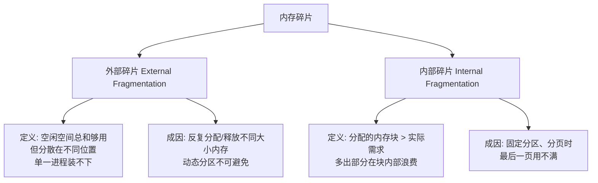

| 碎片类型 | 浪费在哪 | 举例 |
|---------|---------|------|
| 外部碎片 | **块之间** | 总空闲 80MB，但最大连续块只有 30MB |
| 内部碎片 | **块内部** | 进程需 3KB，分配一整页 4KB → 浪费 1KB |

### 4.2 紧凑技术详解

**紧凑（Compaction）**能消除外部碎片——把已分配的块**移动**到一起，让空闲空间连成一片：

```
紧凑前：
┌──┬──┬──────┬──┬──────────┐
│P1│空│ P2   │空│  P3      │
└──┴──┴──────┴──┴──────────┘

紧凑后：
┌──┬──────┬──────────┬─────────────┐
│P1│ P2   │  P3      │  连续空闲    │
└──┴──────┴──────────┴─────────────┘
```

**代价**：紧凑需要移动进程在内存中的位置 ≈ 把代码和数据搬运到新地址——这是**极其昂贵**的操作。现代操作系统已经用**分页**从根本上避免了外部碎片，不再需要紧凑。

### 4.3 碎片问题的根本矛盾

**疑惑：为什么连续分配一定会产生碎片？有没有根本性的解决方案？**

**答疑**：连续分配的根本矛盾在于——进程需要的是一块"连续的"内存，但反复分配/释放会把物理内存切成不规则的小块。"连续性"要求和"不规则释放"之间的矛盾，必然导致碎片。

**根本解决方案：废除"连续性"要求**——这就是**分页**的核心思想。把一个进程切成很多小块（页），每一小块单独分配，不再要求它们物理上连续。


## 05.分页管理机制

### 5.1 分页的基本思想

分页（Paging）将物理内存划分为固定大小的**页框（Page Frame）**，将进程逻辑地址空间划分为同样大小的**页（Page）**。进程的页装入任意空闲页框，不需要连续。

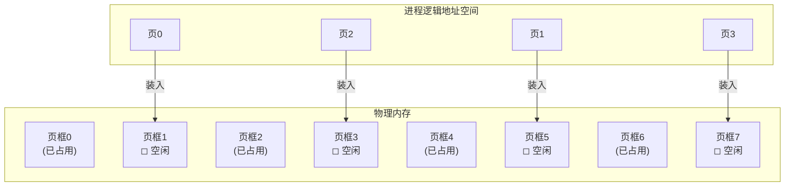

**页大小**：通常 4KB（x86/x86-64 标准）。也有些系统支持 2MB 或 1GB 大页。

**关键结论**：
- 页之间不需要物理连续 → **彻底消灭外部碎片**
- 最后一页可能用不满 → 存在少量内部碎片（平均半页 = 2KB）
- 2KB 的内部碎片 vs 可能几十 MB 的外部碎片 → **分页是巨大进步**

### 5.2 地址转换机构

分页后，逻辑地址需要转换为物理地址。这个转换由**页表**配合 MMU 完成：

```
逻辑地址的结构（32位系统，4KB页）：
┌─────────────┬──────────────┐
│  页号(20位)  │ 页内偏移(12位) │
└─────────────┴──────────────┘
  可寻址 2^20 页    每页 2^12=4KB

物理地址的计算：
  物理地址 = 页框号 × 页面大小 + 页内偏移
```

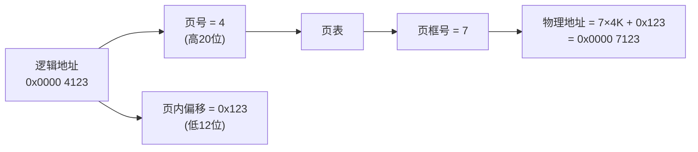

### 5.3 页表结构详解

页表是**每个进程一个**的数据结构，逻辑上是一个数组：`页表[i] = 页框号 + 权限位`。

```
页表项（Page Table Entry, PTE）的结构（x86-64, 8 字节）：

┌────┬───┬───┬───┬───┬───┬──────────────┐
│ P  │R/W│U/S│PWT│PCD│ A │ 页框号(40位)   │
└────┴───┴───┴───┴───┴───┴──────────────┘

P (Present):   该页是否在物理内存中（0=不在→缺页异常）
R/W:          0=只读, 1=可读写
U/S:          0=内核, 1=用户（U/S位保护内核空间不被用户访问）
A (Accessed): 该页是否被访问过（用于页面置换算法）
D (Dirty):    该页是否被修改过（写回磁盘时用）
```

| 标志位 | 作用 | 不设置的后果 |
|--------|------|------------|
| P=0 | 触发缺页异常，OS 从磁盘换入 | 访问不存在的页 → 段错误 |
| R/W=0 | 写操作触发保护异常 | 往只读代码段写数据 → crash |
| U/S=0 | 用户态访问内核页→保护异常 | 用户态代码不能读内核内存 |

### 5.4 多级页表详解

**疑惑：32位系统，4KB页，每个进程的页表有多大？**

**答疑**：

```
32位系统，4KB页：
  页数 = 2^32 / 4KB = 2^20 = 1,048,576 页
  每页表项 4 字节
  页表大小 = 1M × 4B = 4MB

100 个进程 → 需要 400MB 仅仅用来存页表！
而且这 4MB 页表必须是连续的（早期设计），本身就是分配难题
```

**两级页表的解决办法**：把页表本身也分页，不在物理内存中的页表不分配。

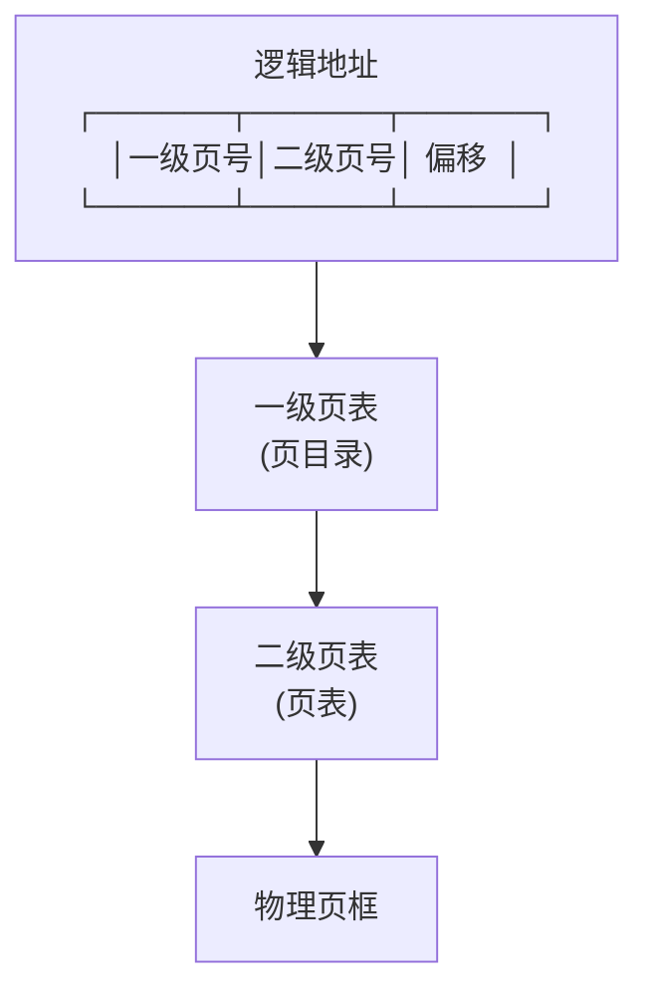

```
两级页表的实际开销（32位系统）：
  一级页表（页目录）：1024 项 × 4B = 4KB（固定，必须全在内存）
  二级页表：      按需分配
    如果进程只用 20MB：
      需要 20MB/4KB = 5120 页
      需要 5120/1024 ≈ 5 张二级页表
      开销：5 × 4KB = 20KB
    比单级页表的 4MB 节省了 99.5%！
```

**现代系统的实际层级（x86-64, 48位地址空间）**：

```
x86-64 四级页表：
  逻辑地址 = [9位 PML4] [9位 PDPT] [9位 PD] [9位 PT] [12位 偏移]

  每级：512 项 × 8 字节 = 4KB
  四级全开最多：4KB × 4 = 16KB（远小于理论上的单级 512GB）
```

### 5.5 倒排页表详解

多级页表的问题：页表大小**正比于进程数量**。100 个进程 = 100 个页表。在 64 位大内存系统上，页表开销仍然可观。

**倒排页表（Inverted Page Table）**反过来——每个物理页框一个表项，记录"哪个进程的哪一页占用了这个页框"：

```
倒排页表：全局只有一张，大小正比于物理内存，不随进程数增长

  物理页框0:  [PID=1024, 虚拟页号=5]
  物理页框1:  [PID=1024, 虚拟页号=2]
  物理页框2:  [PID=2048, 虚拟页号=100]
  ...

查找: 需要知道 (PID, 虚拟页号) → 搜索整个表 → 太慢！
解决: 哈希表加速查找
```

| | 前向页表（多级） | 倒排页表 |
|------|---------------|---------|
| 表项数 | 正比于进程数 × 虚拟页数 | 正比于物理页数 |
| 查找 | O(1) 索引 | O(1) 哈希（或 O(n) 遍历） |
| 共享内存 | 困难（每进程独立页表） | 困难（一个物理页只一个表项） |
| 使用 | x86/x86-64/ARM 主流 | PowerPC、IA-64、部分 ARM 系统 |

### 5.6 分页彻底消灭外部碎

回到 4.3 节的"根本矛盾"：

```
连续分配的问题：一个 8MB 进程需要一块连续的 8MB 物理内存
           ↓ 分页之后
分页的策略：    8MB 进程 = 2048 个 4KB 页
          每个页独立分配，不需要连续
          任意位置的 2048 个空闲页框都能拼成 8MB
          
结论：只要有足够的空闲页框（即使每个都分散在不同位置），就能满足分配
      → 外部碎片被完全消灭
      → 只剩下少量的内部碎片（平均半页 = 2KB 每进程）
```

### 5.7 一次页表遍历硬件级

**疑惑：CPU 发出虚拟地址后，MMU 做了什么？这个过程到底要多少次内存访问？**

以 x86-64 四级页表、TLB miss 为前提，CPU 执行 `mov (%rax), %rbx`（`%rax`=虚拟地址 `0x7f8a1234_5000`）：

```
1. MMU 拆分 48 位虚拟地址:
   0x7f8a1234_5000 =
   ┌──────┬──────┬──────┬──────┬────────────┐
   │ PML4 │ PDPT │  PD  │  PT  │ 页内偏移    │
   │ 9位  │ 9位  │ 9位  │ 9位  │   12位     │
   └──────┴──────┴──────┴──────┴────────────┘
   索引:   idx1    idx2   idx3   idx4     0x000

2. 硬件页表遍历 (每次从 CR3 寄存器开始):
   CR3 → 物理页 A (PML4 表基址)
     PML4[idx1] → 页表项 → P=1, 物理页框=页B
       PDPT母表[idx2] → PTE → P=1, 物理页框=页C
         PD[idx3] → PTE → P=1, 物理页框=页D
           PT[idx4] → PTE { P=1, 页框=0x1A3F0, R/W=1 }

3. 物理地址 = 0x1A3F0 × 4096 + 0x000 = 0x1A3F0_000
   发出内存读请求 → 数据返回到 %rbx

每一步都是一次物理内存访问:
  4 次页表读 + 1 次数据读 = 5 次内存访问
  DDR4 每次 ~60ns → 总延迟 ≈ 300ns (TLB miss, best case)
  若页表不在 CPU Cache → 每次要先等 Cache line fill → 可能 >500ns
```

**为什么四级而不是三级或五级？**

```
三级: 少一层遍历 (5→4 次访存)，但每级需要更大位宽
      512×512×? → 最后一级页表 > 4KB → 浪费

五级 (Intel 已支持 57 位地址):
      PML5→PML4→PDPT→PD→PT → 5 次页表访问
      TLB miss 代价更大 → 需要更大 TLB 补偿

设计目标: 让每个页表刚好占一页 (512项×8B=4096) → 不浪费
```

### 5.8 NUMA下内存访问

**疑惑：多路服务器上，访问"近"的内存和"远"的内存速度差多少？**

NUMA（Non-Uniform Memory Access）架构下，每个 CPU Socket 有本地内存。跨 Socket 访问要走 QPI/UPI 互联总线，慢约 2 倍：

```bash
$ numactl --hardware
available: 2 nodes (0-1)
node 0 cpus: 0-7    node 0 size: 32768 MB
node 1 cpus: 8-15   node 1 size: 32768 MB
node distances:
node   0   1
  0:  10  21    ← 本地代价10 vs 跨Socket 21 (×2.1倍)
```

**NUMA 对分页的影响**：
- 分配页时优先从**当前 CPU 的本地 Node** 分配（`alloc_pages(GFP_KERNEL)`→当前 node）
- 若进程被迁移到另一个 Socket → 所有本地页都变远程 → 性能暴跌
- 延迟敏感服务需绑定 NUMA 节点：`numactl --cpunodebind=0 --membind=0 ./server`


## 06.快表TLB机制

### 6.1 TLB要解决的问题

**疑惑：分页需要每次内存访问先把逻辑地址转物理地址。如果页表在内存里，意味着每次真正的内存访问之前，要先访问一次内存（读页表）——这岂不让内存访问慢了一倍？**

**答疑**：是的。这就是著名的**分页性能问题**。解决办法是 TLB（Translation Lookaside Buffer，快表）——一个在 MMU 内部的**高速硬件缓存**，专门缓存最近用过的页表项。

```
没有 TLB：
  CPU 发出逻辑地址 → 访问内存读页表（100ns）→ 得到物理地址 → 访问内存读数据（100ns）
  总延迟：200ns

有 TLB（命中）：
  CPU 发出逻辑地址 → 查 TLB（~0.5ns）→ 得到物理地址 → 访问内存读数据（100ns）
  总延迟：~100.5ns（几乎无附加开销！）
```

### 6.2 TLB的工作原理

TLB 是一个**全相联**的硬件 Cache，通常只有几十到几百个条目：

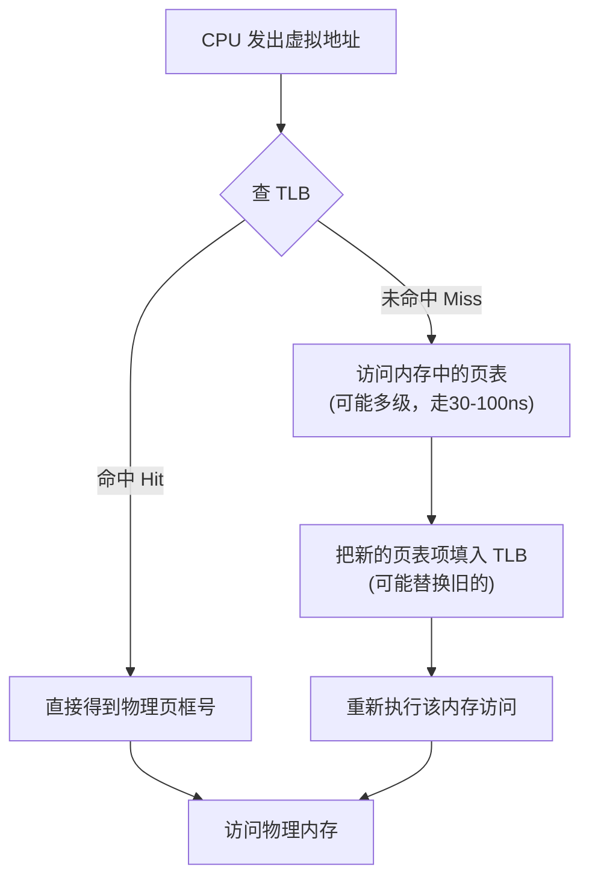

**TLB 的关键特性**：

| 特性 | 典型值 | 意义 |
|------|--------|------|
| 条目数 | 64-1024 项 | 覆盖 256KB-4MB（4KB页） |
| 命中时间 | ~0.5-1 个 CPU 周期 | 近乎零开销 |
| 未命中惩罚 | 10-100 周期 | 走内存页表 |
| 命中率 | 通常 >99% | 得益于程序局部性 |

### 6.3 TLB命中率实践意

**疑惑：既然 TLB 命中率这么重要，写代码时怎么利用它？**

**答疑**：和 CPU Cache 一样，TLB 也依赖程序的**空间局部性**：

```c
// 场景：遍历一个 2MB 数组
int arr[2MB / sizeof(int)];  // 512K 个 int，约占 2MB

// TLB 友好：顺序访问
for (int i = 0; i < 512000; i++) {
    sum += arr[i];  // 相邻元素在同一页 → TLB 高命中
}

// TLB 不友好：大跨度跳跃
for (int i = 0; i < 512000; i += 1024) {
    sum += arr[i];  // 每 4KB 才访问一次 → 每次都换页 → TLB 不断 miss
}
```

```
TLB 覆盖范围计算（4KB 页，64 项 TLB）：
  覆盖范围 = 64 × 4KB = 256KB

如果你操作的数据集 > 256KB 且访问模式不连续：
  → TLB miss → 走页表 → 页表 miss → 更慢

对策：
  1. 使用 2MB 大页（hugetlbfs）：一项 TLB 覆盖 2MB
     → 覆盖范围 = 64 × 2MB = 128MB
  2. 让数据访问尽量局部化（顺序访问）
```

### 6.4 TLBShootd

**疑惑：一个核心改了页表（如 `munmap`），其他核心的 TLB 里还有旧的映射——怎么让它们失效？**

这需要 **TLB shootdown**——跨核广播刷新：

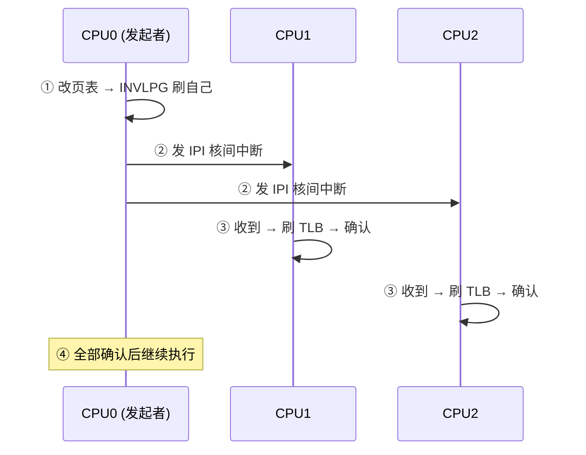

**shootdown 的代价**：在大规模多核系统（如 64 核）上，每次 `munmap` 需要让所有跑同一进程的核心中断并刷 TLB → 数十到数百微秒。这就是为什么频繁 `mmap/munmap` 在多核系统上性能差——因为每次 `munmap` 触发全核 TLB shootdown。

### 6.5 两级TLB缓存层次

现代 CPU 的 TLB 也有 L1/L2 层次：

```
Intel Core:  L1 dTLB 64项(4KB) → L2 sTLB 1536项(混合)
AMD Zen4:    L1 dTLB 72项(4KB)+72项(2MB) → L2 2048项(混合)
```

L1 miss 不直接走内存页表 → 先查 L2 TLB → 降低页表遍历频率。


## 07.分段管理机制

### 7.1 分段的基本思想

分段（Segmentation）从**程序的逻辑结构**出发，把进程分成若干个逻辑段——代码段、数据段、堆、栈，每个段独立管理：

```
进程的逻辑视图（分段）:
┌──────────────┐
│   代码段      │ ← 只读，长度 = 程序大小
├──────────────┤
│   数据段      │ ← 可读写，长度 = 全局变量
├──────────────┤
│   堆         │ ← 可读写，向上增长
│              │
│              │
├──────────────┤
│              │
│   栈         │ ← 可读写，向下增长
└──────────────┘
```

**逻辑地址 = (段号, 段内偏移)**。段是一段**连续**的逻辑空间，长度可变。

### 7.2 段表与地址转换

每个进程有一个**段表（Segment Table）**，每个段表项记录：

```
段表项结构：
┌──────────┬──────────┬──────────┐
│ 段基址    │ 段长度    │ 保护位   │
└──────────┴──────────┴──────────┘

物理地址 = 段基址 + 段内偏移
如果 段内偏移 > 段长度 → 越界异常（Segmentation Fault）
```


### 7.3 分段vs分页

**疑惑：分段和分页看起来很像，到底有什么区别？**

**答疑**：核心区别在于设计哲学。

| 维度 | 分页 | 分段 |
|------|------|------|
| 设计出发点 | **硬件视角**：固定大小，方便管理 | **程序员视角**：逻辑结构，代码/数据/堆/栈 |
| 每段/每页大小 | 固定（4KB） | **可变**（代码段可能 100KB，数据段 50KB） |
| 程序员可见 | **不可见**（透明） | **可见**（段寄存器 CS/DS/SS/ES） |
| 碎片 | 内部碎片（半页） | **外部碎片**（段大小可变 → 同动态分区） |
| 保护 | 页级权限 | 段级权限（代码段只读，数据段读写） |
| 共享 | 页级共享 | 段级共享（共享整个代码段） |
| 地址结构 | 一维（一个线性地址） | **二维**（段号 + 偏移） |

**一句话总结**：分页是硬件好实现（固定大小），分段是程序员好理解（逻辑结构）。现代操作系统用的是**段页式**——取两者之长。

### 7.4 段页式管理详解

段页式（Segmented Paging）先按逻辑分段，再在段内按页分块：

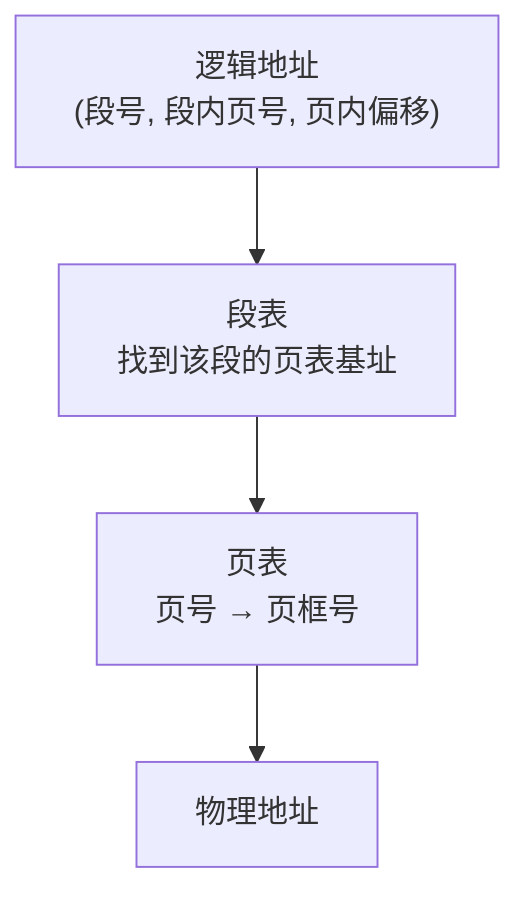

```
x86-64 上的实际体现：

Linux 只使用了分段的最小功能：
  - 代码段（CS）、数据段（DS）的基址都设为 0，长度设为 4GB
  - 实际上把"分段"绕过去了，让分页完全接管地址映射
  - 段寄存器只用来区分特权级（内核 CS vs 用户 CS）
  
而段页式的"段"的功能退化为：
  - 代码段 vs 数据段 vs 栈段的权限区分（R/W/X 位）
```

### 7.5 VMA红黑树—

**疑惑：每个进程有几十上百个 VMA（Virtual Memory Area）——`/proc/PID/maps` 里那些——内核怎么快速找到包含某个地址的 VMA？**

每个进程的 `mm_struct` 里有一棵**红黑树**和一条**双向链表**来管理 VMA：

```c
struct mm_struct {
    struct vm_area_struct *mmap;   // 双向链表头（按地址排序，遍历用）
    struct rb_root mm_rb;          // 红黑树根（按地址排序，查找用）
    unsigned long mmap_base;       // mmap 区域的起始地址
    unsigned long brk;             // 堆顶 (program break)
    // ...
};

struct vm_area_struct {
    unsigned long vm_start, vm_end;  // 虚拟地址范围
    unsigned long vm_flags;          // 权限: VM_READ|VM_WRITE|VM_EXEC
    struct file *vm_file;            // 如果是文件映射，指回原文件
    unsigned long vm_pgoff;          // 文件中的偏移 (页号)
    struct rb_node vm_rb;            // 红黑树节点
    // ...
};
```

**缺页中断时的 VMA 查找**——内核必须快速判断"这个地址在哪段 VMA 内"：

```
查找流程 (内核函数 find_vma()):
  输入: 虚拟地址 addr = 0x7f8a1234_5000
  
  1. 查 VMA 红黑树: O(log n)
     从根开始:
       if addr < vma->vm_start → 走左子树
       if addr >= vma->vm_end → 走右子树
       if vm_start <= addr < vm_end → 找到了!
  
  2. 如果红黑树中没找到 → 可能是:
     a) 栈自动扩展 (addr 在栈 VMA 下方 1 页内) → expand_stack()
     b) 非法访问 → SIGSEGV
```

**探索性问题**：为什么不用哈希表而是红黑树？

```
哈希表: 需要等长分割地址空间 → 预先不知道 VMA 的分布
红黑树: 动态调整 → 每次插入/删除只需 O(log n) 旋转
       支持区间查询 (找"包含某地址"的 VMA, 哈希表做不到)
       Linux 每个进程的查找操作远超插入/删除 → 红黑树更适合
```


## 08.malloc原理

### 8.1 malloc不是系

**疑惑：`malloc(100)` 是一次系统调用吗？它和 `brk()`、`mmap()` 是什么关系？**

**答疑**：`malloc` **不是**系统调用。它是 glibc 等 C 库提供的一个**用户态内存分配器**。只有当它自己管理的空闲内存不足时，才会调用 `brk()` 或 `mmap()` 向内核申请更多内存。

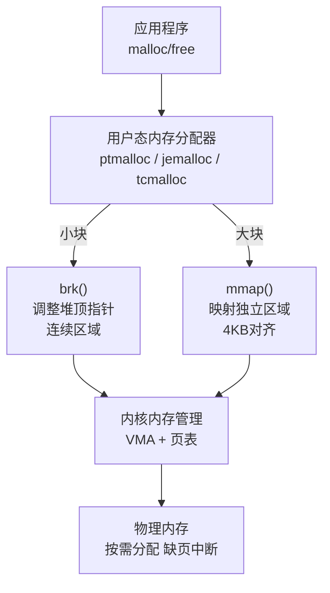

### 8.2 brk与mmap两

| | `brk()` | `mmap()` |
|------|---------|---------|
| 扩容方式 | 移动 program break 指针，扩大堆顶 | 在虚拟地址空间映射一块独立区域 |
| 内存是否连续 | ✅ 连续（堆是一个整体） | ❌ 独立的 VMA |
| 释放难度 | ⚠️ 只能从堆顶释放 | ✅ 随时 `munmap()` |
| 碎片问题 | **严重**（堆顶有数据就无法收缩） | 几乎无（每次映射独立） |
| 最小分配 | 无限制（字节级，但有对齐） | 1 页（4KB） |
| 适用场景 | **小块**（默认 < 128KB） | **大块**（默认 ≥ 128KB） |

**brk 的碎片问题就是 1.1 节案例的根因**：

```
堆的布局：
┌──────────────────────────────────┐
│ 已分配块 │ 已分配块 │ 空闲块 │ 堆顶
└──────────────────────────────────┘
                              ↑ program break

如果堆顶的那个"已分配块"一直不 free：
  → 即使下面有很多空闲，堆顶也缩不下来
  → RSS 只增不减
```

### 8.3 ptmalloc分

glibc 的默认分配器 ptmalloc 对 malloc 的实现可以分成两条路径：

```
malloc(size) 的分流逻辑：

  if size < 128KB:
    走 ptmalloc 内部缓存（fastbins / smallbins / largebins）
    这些缓存来自 brk() 管理的堆
    从缓存拿：纯用户态操作，极快
    缓存不够：调用 brk() 扩展堆 → 不是每次 malloc 都进内核

  if size >= 128KB:
    直接调用 mmap()
    匿名映射一段虚拟内存 → 缺页中断时才实际分配物理页
    释放时 munmap() 立即归还给 OS
```

**ptmalloc 的内部 Bins 体系**：

```
ptmalloc 把空闲块按大小分类存放——这就是 bins 体系：

  fastbins:  16-80字节   (LIFO 单链表，不合并，速度最快)
  smallbins:  <512字节   (FIFO 双链表，精确匹配)
  largebins:  ≥512字节   (按大小范围组织，最佳匹配)
  unsorted bin:           (刚 free 的块暂存区，后续归类)

  当分配时，按 fastbins → smallbins → unsorted → largebins 顺序找
```

### 8.4 小块分配fastb

**fastbins 是 ptmalloc 性能的核心**：

```
假设程序反复 malloc(32) / free()：

没有fastbins:
  malloc → 遍历 smallbins → 找不到 → brk() → 内核分配 → 慢
  free   → 放入 unsorted bin → 整理合并 → 慢

有 fastbins:
  malloc → 直接取 fastbins[32字节槽] → O(1) → 极快
  free   → 直接放回 fastbins[32字节槽] → O(1) → 极快
  （不合并！保留碎片形态，下次直接复用）

代价：fastbins 中的块不合并 = 碎片累积
```

**glibc 2.26 引入了 tcache（Thread-Local Cache）**，在每个线程本地维护缓存，不需要加锁——多线程下的 malloc 性能大幅提升，但也带来了和 fastbins 类似的碎片问题。

### 8.5 大块分配mmap直

```c
// ptmalloc 对大内存直接走 mmap
void *ptr = malloc(200 * 1024);  // 200KB > 128KB 阈值

// 底层等价于：
void *ptr = mmap(NULL, 200*1024,
                 PROT_READ | PROT_WRITE,
                 MAP_PRIVATE | MAP_ANONYMOUS,
                 -1, 0);
// 注意：mmap 映射大小向上对齐到 4KB 整数倍
```

**mmap 阈值**可以通过 `mallopt` 调整：

```c
#include <malloc.h>

// 把 mmap 阈值从 128KB 调到 64KB
mallopt(M_MMAP_THRESHOLD, 65536);

// 调小阈值 → 更多分配走 mmap → 碎片更少，但性能略降
// 调大阈值 → 更多分配走 brk 堆 → 性能更好，但碎片风险更高
```

### 8.6 free发生了什么

**疑惑：`free(ptr)` 后，操作系统能立刻回收这片内存吗？**

**答疑**：大多数情况不能立刻回收。

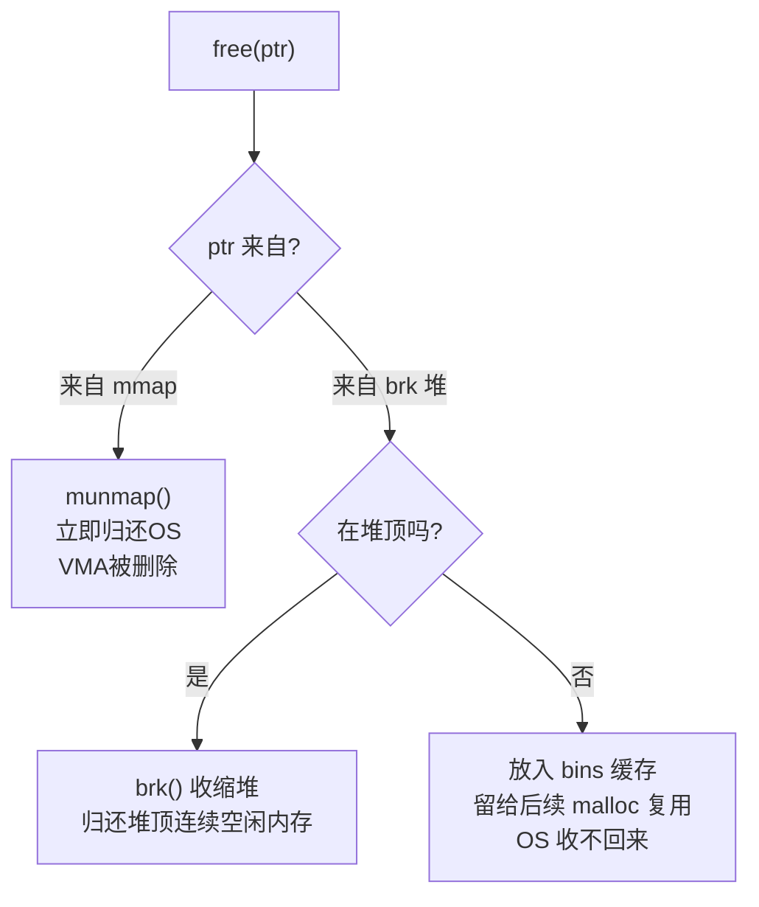

**`malloc_trim()` 手动清理**：

```c
#include <malloc.h>

// 尝试释放堆顶空闲内存（不一定成功，取决于堆顶是否有数据）
malloc_trim(0);
```

**回到 1.1 节的解决**：小张的两个改动——换 jemalloc（更激进的归还策略）+ 定时调用 `malloc_trim()`——RSS 从 8GB 稳定到 500MB。

### 8.7 ptmallocc

**疑惑：`malloc(100)` 返回的指针 `ptr`，内存布局是什么样的？为什么 `free(ptr)` 不需要传 size？**

ptmalloc 在每次分配的内存前后加了**元数据头（chunk header）**：

```
已分配的 chunk (malloc 返回给用户的指针是 payload 的起始地址):
  ptr-16 → ┌────────────────────┐
           │ prev_size (上一块大小, 8B)│  ← 如果上一块空闲
           ├────────────────────┤
  ptr-8 →  │ size (本块大小, 8B)    │  ← 低 3 位是标志位:
           │  bit[0]: PREV_INUSE   │     "上一块在用吗?"
           │  bit[1]: IS_MMAPPED   │     "这是mmap分配的吗?"
           │  bit[2]: NON_MAIN_ARENA│     "来自非主分配区?"
  ptr →    ├════════════════════════┤
           │  payload (用户数据区)      │  ← malloc 返回的指针指向这里
           │  ...                  │
           │  (大小向上对齐到 16B)    │
           └────────────────────┘

被 free 后的 chunk:
           ┌────────────────────┐
           │ prev_size           │
           ├────────────────────┤
           │ size (PREV_INUSE清0)│  ← 表示上一块已空闲
           ├────────────────────┤
           │ fd 指针 (bins双向链表前向)│ ← 复用用户数据区!
           │ bk 指针 (bins双向链表后向)│ ← 复用用户数据区!
           │ (大块还有 fd_nextsize等) │
           └────────────────────┘
```

**为什么 `free(ptr)` 不需要 size 参数？**

```
free(ptr) 的实现:
  p = (chunk_ptr)(ptr - 16)   ← 倒推 16 字节回到 chunk 头
  size = p->size & ~7         ← 从 chunk 头读取大小 (去掉低3位标志)
  → 不需要用户传 size!

利用 PREV_INUSE 位做前后合并:
  if (上一块空闲) → 从 prev_size 字段知道上一块多大 → 合并
  if (下一块空闲) → 从下一块的 size 字段判断 → 合并
```

**探索性问题——unlink 攻击**：`free()` 合并相邻空闲块时，需要把被合并的块从 bins 链表中摘下来（unlink）。如果攻击者能**篡改一个空闲 chunk 的 fd/bk 指针**，就可以在 unlink 时实现任意地址写——这是经典堆利用技术的基础。glibc 2.29 之后加了严格的链表完整性检查（`fd->bk == p && bk->fd == p`）来防御。

### 8.8 分配器的双面刃—

```
ptmalloc 性能优化手段 ←→ 安全隐患
  fastbins: LIFO + 不合并     ←→ 容易 Double Free 利用
  tcache:   无锁 + 无检查     ←→ tcache poisoning 攻击
  unsorted: FIFO + 延迟合并   ←→ unsorted bin attack
```

jemalloc 和 tcmalloc 在设计上原生减少了部分攻击面——比如 jemalloc 把相同大小的分配放在独立 arena，减少了 chunk 头部可预测性。


## 09.内核Slab机制

### 9.1 内核malloc需

内核代码（驱动、网络栈、文件系统）也需要频繁分配小块内存——比如一个 `inode` 结构体、一个 `sk_buff`（网络包缓存）。

**为什么内核不能直接用 ptmalloc？**

```
原因1: ptmalloc 的设计前提是有虚拟内存和缺页中断
       内核某些上下文（中断处理）不能触发缺页
       
原因2: 内核需要严格的内存类型控制
       有些分配必须从 DMA 区域（低 16MB）
       有些可以从高端内存

原因3: ptmalloc 碎片太多，内核需要更高效的利用率
```

### 9.2 Slab分配器原理

Slab 分配器的核心思想：**对象缓存（Object Cache）**——每种内核数据结构（inode、dentry、task_struct）有自己专属的缓存池。

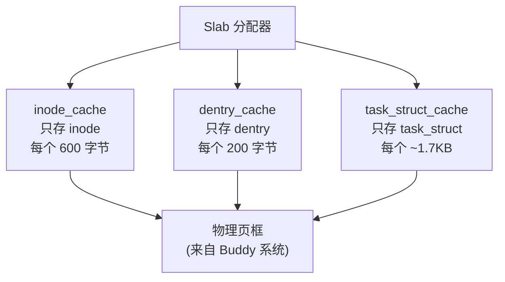

```
Slab 的三层结构:

  Cache（缓存）：
    └── 一个特定的内核对象的"工厂"
        例: inode_cache 专门生产 inode

  Slab（板）：
    └── 一组连续的物理页框（通常 1-4 页）
        里面切分成若干个同样大小的"对象槽"

  对象（Object）：
    └── 实际的数据结构实例
        分配时从 slab 拿一个空闲槽，释放时还回 slab
```

**为什么 Slab 高效？**

| 优势 | 说明 |
|------|------|
| 零碎片 | 同类型对象大小相同，没有外部碎片 |
| CPU Cache 友好 | 同一 Slab 内的对象被一起使用（如 inode 和 dentry 常一起访问） |
| 构造函数复用 | 对象不会完全销毁——释放时保留"部分初始化"状态，下次分配更快 |
| 着色（Coloring） | 不同 Slab 的起始偏移不同 → 避免 Cache Line 冲突 |

### 9.3 Buddy伙伴系统

**疑惑：Slab 的物理页框从哪来的？**

**答疑**：从**Buddy 伙伴系统（Buddy System）**来。

Buddy 系统是内核的**物理页分配器**——负责分配和回收**连续物理页框**。它是 Slab 的下层支撑。

```
Buddy 系统的原理：

把空闲页框按 2 的幂次组织：
  order 0: 1 页   (4KB)     链表
  order 1: 2 页   (8KB)     链表
  order 2: 4 页   (16KB)    链表
  order 3: 8 页   (32KB)    链表
  ...
  order 10: 1024 页 (4MB)   链表

分配时：
  如果请求 3 页 → 向上取整到 4 页 (order 2)
  如果 order 2 有空 → 直接分配
  如果没有 → 从 order 3 分裂：
    order 3 → 两个 order 2（一个分配，一个放回链表）

释放时：
  如果释放的块和它的"伙伴"（同一 order、地址相邻）
  刚好都在空闲 → 合并成更高 order → 递归向上合并
```

**这就是"伙伴"的含义**：两个相同大小、物理地址相邻的空闲块互为"伙伴"，释放时尝试合并。

### 9.4 Buddy分裂融合

用一个具体例子走一遍 Buddy 的全生命周期：

```
物理内存: 16 页
初始: order=4 空闲链表: [页0-15] (16页大块)

========== 分配 1 页 (order=0) ==========
  order=0: 空 → order=1: 空 → order=2: 空 → order=3: 空
  order=4 有 [页0-15] → 分裂!

  order=4 → 分裂为 [页0-7] 和 [页8-15]
    [页8-15] 放入 order=3 链表
  order=3 → 分裂 [页0-7] 为 [页0-3] 和 [页4-7]
    [页4-7] 放入 order=2 链表
  ... 继续分裂直到 order=0
  返回: 页0 (1页)

  空闲链表状态:
    order=0: []        order=1: [页2-3]
    order=2: [页4-7]  order=3: [页8-15]

========== 释放页0 (order=0) ==========
  页0 的伙伴 = 页1 (在 order=0 空闲? 不在，在 order=1 中)
  页1 在 order=1 的 [页2-3] 里? 不是，伙伴地址 = 0 XOR 1 = 1
  页1 已被分配 → 不能合并
  → 页0 单独放入 order=0 链表

========== 再释放页1 (order=0) ==========
  页1 的伙伴 = 页0 (在 order=0 空闲! ✓)
  → 合并页0和页1 → 得到 [页0-1] (order=1)

  现在 [页0-1] 的伙伴 = 页2-3 (在 order=1 空闲! ✓)
  → 继续合并 → [页0-3] (order=2)

  [页0-3] 的伙伴 = 页4-7 (在 order=2 空闲! ✓)
  → 合并 → [页0-7] (order=3)

  [页0-7] 的伙伴 = 页8-15 (在 order=3 空闲! ✓)
  → 合并 → [页0-15] (order=4)  ← 完全恢复!

  这就是伙伴系统的优雅之处: 充分碎片化后, 全部释放就完全恢复
```

### 9.5 三个内存分配标志G

`alloc_pages(GFP_XXX)` 控制从哪个 Zone 分配：

```
GFP_KERNEL:  内核常规分配, 从 ZONE_NORMAL 分配, 可休眠等回收
GFP_ATOMIC:  中断上下文, 不能休眠, 使用紧急预留, 易失败
GFP_DMA:     只能从 ZONE_DMA (低16MB, 某些老式ISA设备需要)

Zone 优先级: ZONE_DMA → ZONE_DMA32 → ZONE_NORMAL → ZONE_HIGHMEM
             (优先从 DMA32 开始, 避免消耗珍贵的 ZONE_DMA 给常规分配)
```

### 9.6 Slab着色—

**疑惑：两个 `inode` 对象相邻分配，它们所在的 Cache Line 会在 L1 Cache 中冲突——怎么避免？**

**Slab 着色（Coloring）**：不同 Slab 的起始偏移量不同，让相同大小对象对齐到不同的 Cache Line：

```
无着色:
  Slab1: [obj1][obj2][obj3]...  ← obj1 和 obj2 在同一个 L1 set
  Slab2: [obj1][obj2][obj3]...  ← obj1 也在同一个 L1 set → 冲突!

有着色 (color=offset):
  Slab1: [空 offset][obj1][obj2]... ← obj1 在 set A
  Slab2: [空 offset2][obj1][obj2]... ← obj1 在 set B → 不冲突!

color 的计算: Slab索引 × cache_line_size
不同 Slab 的不同"着色"让同一位置的对象分散到不同 Cache set
```

```bash
# 查看 Slab 信息
$ sudo cat /proc/slabinfo | head -5
slabinfo - version: 2.1
# name      <active> <num> <objsize> <objperslab> <pagesperslab>
inode_cache  15234  15360    680        24           4
dentry       89231  90000    208        78           4
```


## 10.内存排查案例

### 10.1 场景服务内存持续增

用一个完整的内存排查案例串联本章所有知识点。

**场景**：一个 C++ 微服务，运行一周后 RSS 从 500MB 涨到 6GB，触发 Kubernetes 的 memory limit 被 kill。重启后 3 天又到 6GB。

### 10.2 排查第一步看RSS

```bash
$ cat /proc/$PID/status | grep -E "VmRSS|VmSize|VmData|VmStk"
VmSize:   8234560 kB   # 虚拟内存 8GB
VmRSS:    6345678 kB   # 物理内存 6.2GB
VmData:   7834560 kB   # 数据段（堆）占了 7.8GB！
VmStk:       132 kB   # 栈正常
```

**诊断**：`VmData`（堆）7.8GB → 问题在堆分配，不是栈或 mmap。

### 10.3 排查第二步内存分配

用 `perf` 或 `bcc` 工具看哪个函数在分配内存：

```bash
# 追踪内存分配调用栈
bpftrace -e 'uprobe:/lib/x86_64-linux-gnu/libc.so.6:malloc
            /pid == 12345/ {
               @bytes[ustack()] = sum(arg0);
            }'
```

发现热点：某个 JSON 解析的 `rapidjson` 函数频繁 `malloc(128)`，每次定时任务分配数千次。

### 10.4 排查第三步jema

换了 jemalloc 后，开启 profiling 看内存分配热点：

```bash
export MALLOC_CONF="prof:true,prof_prefix:jeprof.out"
# 运行一段时间后用 jeprof 分析
jeprof --show_bytes --pdf /usr/bin/my_service jeprof.out.*.heap > profile.pdf
```

### 10.5 根因定时零拷贝引发

**真正的根因链**：

```
1. 定时任务触发 → 大量 JSON 解析
2. rapidjson 频繁 malloc/free(128)
3. ptmalloc 的 fastbins 缓存了数千个 128 字节块
4. 这些块散布在堆的各个位置
5. 堆顶附近有少量"长生命周期"对象（连接池、配置等）
6. 堆顶降不下来 → brk() 无法收缩 → RSS 只涨不降
7. 下次定时任务又来，重复 1-6
```

**最终解决方案**：

```cpp
// 方案一：换分配器（主要）
// 链接 jemalloc 替代 ptmalloc
// cmake: target_link_libraries(my_service jemalloc)

// 方案二：定期归还空闲内存
// 在定时任务结束后调用
malloc_trim(0);

// 方案三：对象池（减少分配/释放频率）
class JsonParserPool {
    std::queue<rapidjson::Document*> pool;
public:
    rapidjson::Document* acquire();
    void release(rapidjson::Document* doc);
};
```

**效果**：RSS 稳定在 500MB 以内，不再增长。

### 10.6 知识图谱回顾

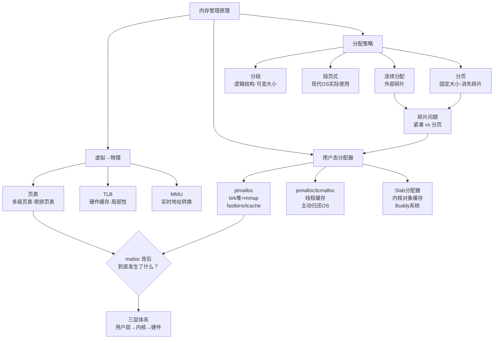

**最终方法论**——排查内存问题时，按三层定位：

1. **用户层**：是内存泄漏（没 free）还是碎片（free 了但没归还 OS）？用 `valgrind`/`AddressSanitizer` 查泄漏，用 `jemalloc` profiling 查碎片
2. **内核层**：`/proc/PID/maps` 看 VMA 数量，`/proc/PID/status` 看 Vs Size/RSS
3. **硬件层**：TLB miss 过高 → 用大页；Cache miss 过高 → 优化数据结构布局


## 11.思考题与作业

### 11.1 基础思考题目

1. **碎片类型**：画一张图说明内部碎片和外部碎片的区别。为什么分页能消灭外部碎片，但仍有内部碎片？内部碎片的平均大小是多少？

2. **页表计算**：32 位系统，4KB 页面。一个进程占用 100MB 内存（25,600 页），采用两级页表（每级 1024 项）。计算实际页表开销。和单级页表相比省了多少？

3. **TLB数学**：64 项 TLB，4KB 页。一个程序顺序访问一个 256KB 数组（刚好 64 页），TLB 命中率是多少？如果随机跳跃访问，命中率是多少？

4. **malloc 阈值**：glibc 的 `M_MMAP_THRESHOLD` 默认 128KB。如果调成 4KB（所有分配都走 mmap），会有什么好处和坏处？如果调成 1GB（所有分配都走 brk）呢？

5. **Slab 原理**：为什么内核不用通用 malloc，而是为每种数据结构建专门的 Slab Cache？这体现了什么设计哲学？

### 11.2 进阶思考题目

1. **1.1 节复盘**：小张的服务从 200MB 涨到 8GB——假设 8GB 中真正"还在用"的数据只有 500MB，剩下的 7.5GB 是碎片/缓存。这些"缓存"的内存在 ptmalloc 里分布在哪些 bins？为什么不能归还 OS？如果用 jemalloc，它是怎么减少这个问题的？

2. **大页的代价**：2MB 大页能用一项 TLB 覆盖 512 倍的地址范围。但为什么不是所有系统都用大页？大页有什么副作用？（提示：内部碎片、换页粒度、透明大页 THP 的 overhead）

3. **COW 和内存超分**：KVM/QEMU 虚拟化中，多个虚拟机可以共享同一物理页（只要它们的内容相同），这就是 KSM（Kernel Same-page Merging）。它和 fork 的 COW 有什么异同？KSM 扫描所有物理内存，对性能有什么影响？

4. **栈和堆增长方向**：为什么栈向下增长，堆向上增长？这种设计有什么好处？如果反过来（栈向上、堆向下），还能工作吗？

5. **brk 还是 mmap**：如果让你设计一个新的 malloc 实现，你会如何决定两者之间的阈值？你会收集什么运行时信息来动态调整这个阈值？

### 11.3 动手实践作业

**作业一（必做）**：观测自己程序的内存分配行为。

```bash
# 1. 写一个反复 malloc/free(128) 的程序
# 2. 用 strace 看系统调用
strace -e brk,mmap,munmap ./your_program

# 3. 用 /proc/pid/maps 看 VMA 变化
cat /proc/$PID/maps | wc -l

# 4. 分析：malloc(128) 触发了 brk 还是 mmap？VMA 数量怎么变？
```

**作业二（选做）**：对比 ptmalloc 和 jemalloc 的碎片行为。

- 写一个程序：分配 10000 个 128 字节块，随机释放其中 5000 个，再分配 5000 个 256 字节块
- 分别链接 ptmalloc 和 jemalloc，用 `/proc/pid/status` 对比 RSS
- 分析哪个分配器 RSS 更小？为什么？

**作业三（选做）**：实现一个简单的 Buddy 内存分配器。

- 实现 `buddy_alloc(order)` 和 `buddy_free(ptr, order)`
- 支持 order 0~5（1~32 页）
- 打印分配/释放过程中空闲链表的演变

**作业四（架构思考）**：分析你当前负责的一个服务的内存使用。

- 查看进程中堆、栈、mmap、代码段各占据多少内存
- 找出最大的内存消费者（哪个数据结构？哪个缓存？）
- 如果这个服务的内存需要缩减 50%，你会从哪些方面入手？
