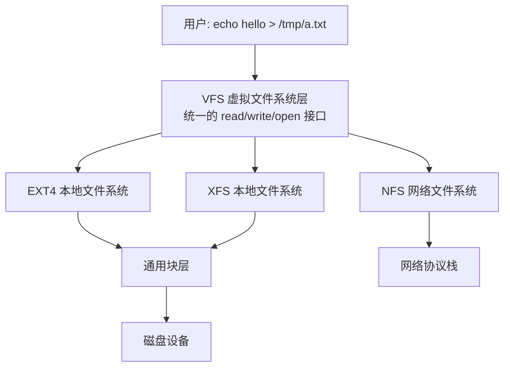
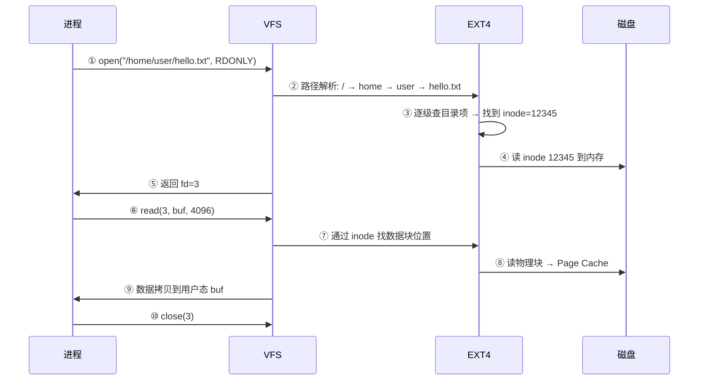
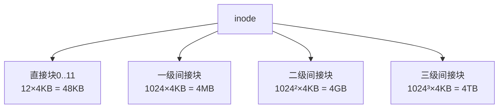
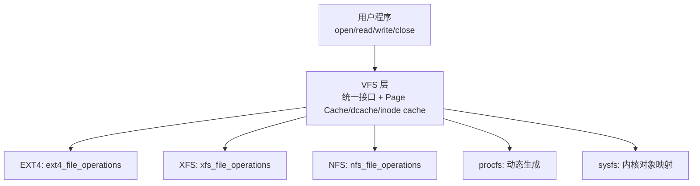
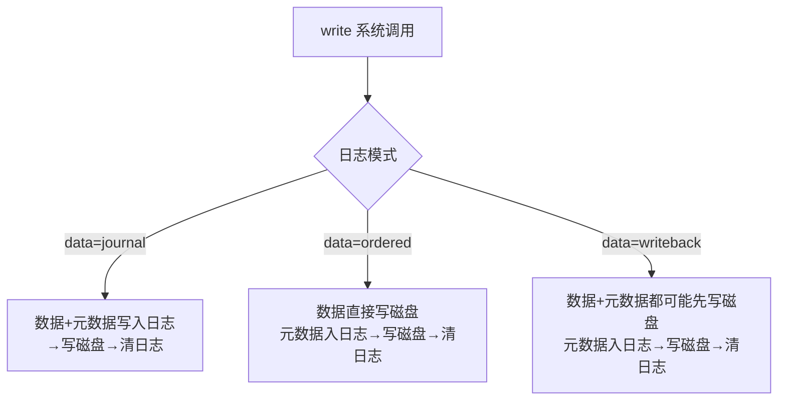
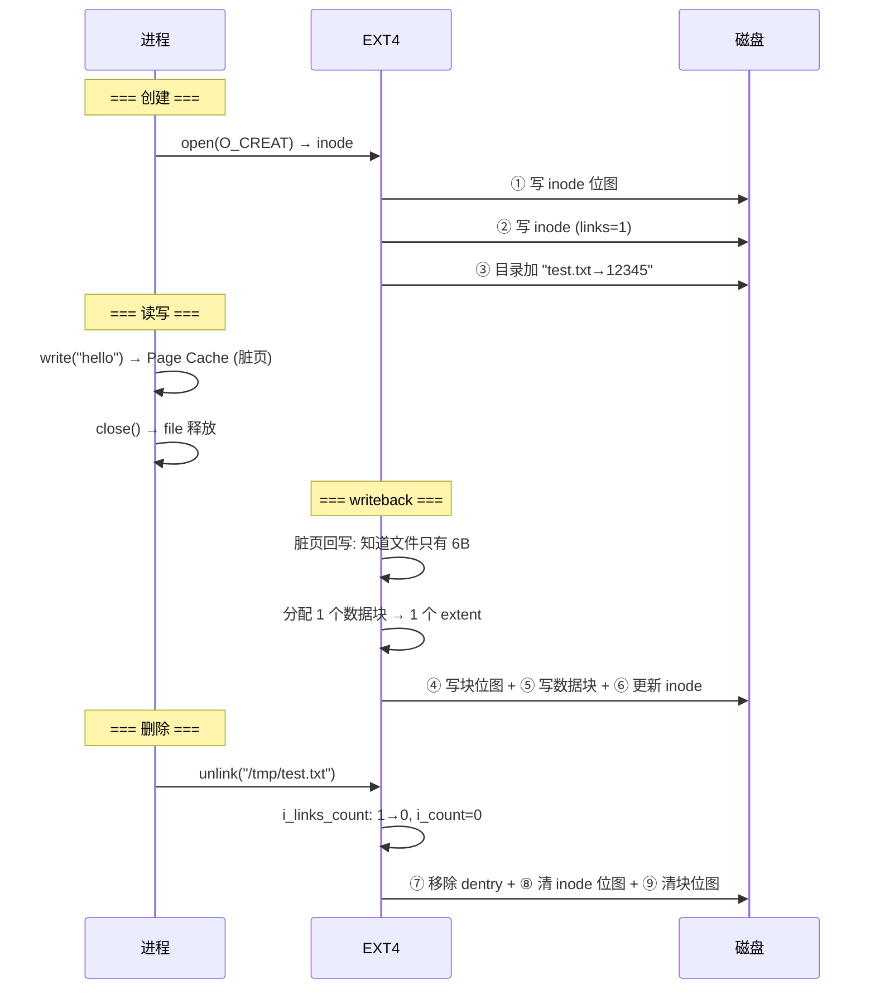
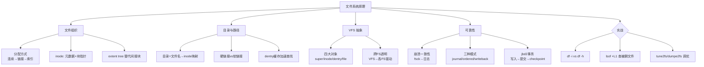

# OS的文件系统原理

> inode/目录结构/VFS/日志文件系统/EXT4 vs XFS——文件到底存在哪

#### 目录介绍
- [01.工作案例引入](#01工作案例引入)
  - [1.1 删除文件后空间没释放](#11-删除文件后空间没释放)
  - [1.2 为什么要学文件系统](#12-为什么要学文件系统)
- [02.文件系统概述](#02文件系统概述)
  - [2.1 文件系统是什么](#21-文件系统是什么)
  - [2.2 文件系统的层次结构](#22-文件系统的层次结构)
  - [2.3 文件的概念与属性](#23-文件的概念与属性)
  - [2.4 文件的打开与读写流程](#24-文件的打开与读写流程)
- [03.文件分配方式](#03文件分配方式)
  - [3.1 连续分配](#31-连续分配)
  - [3.2 链接分配](#32-链接分配)
  - [3.3 索引分配](#33-索引分配)
  - [3.4 三种分配方式对比](#34-三种分配方式对比)
- [04.inode详解](#04inode详解)
  - [4.1 inode里存了什么](#41-inode里存了什么)
  - [4.2 直接块与间接块](#42-直接块与间接块)
  - [4.3 间接块寻址完整追踪](#43-间接块寻址完整追踪)
  - [4.4 inode数量耗尽vs空间耗尽](#44-inode数量耗尽vs空间耗尽)
- [05.目录结构](#05目录结构)
  - [5.1 目录的本质](#51-目录的本质)
  - [5.2 dentry缓存](#52-dentry缓存)
  - [5.3 硬链接与软链接](#53-硬链接与软链接)
  - [5.4 路径名解析全流程](#54-路径名解析全流程)
- [06.VFS虚拟文件系统](#06vfs虚拟文件系统)
  - [6.1 为什么要VFS](#61-为什么要vfs)
  - [6.2 VFS四大核心对象](#62-vfs四大核心对象)
  - [6.3 跨文件系统拷贝的完整流程](#63-跨文件系统拷贝的完整流程)
- [07.日志文件系统](#07日志文件系统)
  - [7.1 崩溃一致性问题](#71-崩溃一致性问题)
  - [7.2 日志的三种模式](#72-日志的三种模式)
  - [7.3 EXT4的日志实现](#73-ext4的日志实现)
- [08.EXT4 vs XFS](#08ext4-vs-xfs)
  - [8.1 架构对比](#81-架构对比)
  - [8.2 特性对比](#82-特性对比)
  - [8.3 选型指南](#83-选型指南)
- [09.综合案例文件系统故障排查](#09综合案例文件系统故障排查)
  - [9.1 场景磁盘满了但找不到大文件](#91-场景磁盘满了但找不到大文件)
  - [9.2 排查路线图](#92-排查路线图)
  - [9.3 根因与修复](#93-根因与修复)
  - [9.4 知识图谱回顾](#94-知识图谱回顾)
- [10.思考题与作业](#10思考题与作业)
  - [10.1 基础思考题](#101-基础思考题)
  - [10.2 进阶思考题](#102-进阶思考题)
  - [10.3 动手作业](#103-动手作业)


## 01.工作案例引入

### 1.1 删文件空间未释

**场景**：小陈是一名刚升任 SRE 的运维工程师。某天凌晨接到告警：**"生产服务器磁盘使用率 99%，Nginx 写日志失败，业务 502"**。

小陈登录服务器：

```bash
$ df -h
Filesystem   Size  Used Avail Use% Mounted on
/dev/sda1    100G   99G     0 100% /
```

他熟练地删掉一堆旧日志文件：

```bash
$ rm -f /var/log/app-2024-*.log
$ df -h
Filesystem   Size  Used Avail Use% Mounted on
/dev/sda1    100G   99G     0 100% /
# 删完空间没变！
```

**疑惑**：明明删了 30GB 的文件，`df` 显示的已用空间纹丝不动？

```bash
$ lsof | grep deleted
nginx   2345 root  3w  REG  8,1  5242880  67890 /var/log/access.log (deleted)
nginx   2345 root  4w  REG  8,1  31457280 67891 /var/log/error.log (deleted)
```

Nginx 还在运行——**这些日志文件的 fd 还开着**。`rm` 只是删除了目录项，inode 和数据块还在，因为进程还持有引用。只有当最后一个引用它的进程关闭 fd 或退出时，空间才真正释放。

**追问链**：

- "为什么删文件空间不释放？" → 只删了目录项（dentry），inode 的引用计数降到 0 但进程还引用着
- "怎么快速释放？" → `nginx -s reload` 让进程关闭旧 fd，或 `echo > /path` 清空内容
- "这和文件系统设计有什么关系？" → 文件系统 = **目录项 + inode + 数据块** 三层结构——目录项只是"名字→inode"，真正的数据在 inode 指向的数据块里

小陈执行 `nginx -s reload`，`df` 瞬间恢复 30GB 可用空间。

### 1.2 为何学文件系统



文件系统是操作系统最"日用而不知"的部分——你每天 `ls`、`cat`、`vim`，但没想过每个文件背后是一整套 inode→目录项→数据块→空闲空间管理→日志的精密工程体系。本章聚焦：

- 文件在磁盘上怎么存的？三种分配方式各有什么优劣？
- inode 为什么是文件系统的灵魂？直接块/间接块怎么寻址大文件？
- 目录本质是什么？硬链接和软链接差在哪？
- VFS 怎么让 `cp /ext4/file /xfs/` 无缝工作？
- 日志为什么能防断电损坏？三种模式各自怎么工作？


## 02.文件系统概述

### 2.1 文件系统是什么

文件系统把磁盘上的原始字节块（扇区）组织成用户可操作的"文件"和"目录"。


**文件系统的五项核心职责**：

| 职责 | 具体工作 | 对应数据结构 |
|------|---------|------------|
| 文件组织 | 把"hello.txt"和"磁盘哪些块属于它"关联 | inode |
| 目录管理 | 把"/home/user/"转成"inode 编号" | dentry |
| 空间分配 | 新建分配空闲块，删除回收 | 块位图 / extent tree |
| 权限控制 | 判断"这个用户能不能读" | inode 中 UID/GID/权限位 |
| 崩溃恢复 | 断电后保证结构不被破坏 | 日志 (journal) |

### 2.2 文件系统层次

```
应用层:     open("/home/user/hello.txt", O_RDONLY)
              ↓ syscall
VFS 层:     内核统一的 file_operations 接口
              ↓ 路由到具体 FS
具体 FS:    EXT4 / XFS 的实现
              ↓ 读数据块
通用块层:   submit_bio() → 磁盘驱动
```

### 2.3 文件的概念与属性

每个文件除了内容（数据块），还有**元数据**存在 inode 中：

```bash
$ stat /etc/passwd
  File: /etc/passwd
  Size: 2345       Blocks: 8      IO Block: 4096  regular file
Device: 801h/2049d Inode: 458753  Links: 1
Access: (0644/-rw-r--r--)  Uid: (0/root)  Gid: (0/root)
Access: 2024-01-15 08:30:00
Modify: 2024-01-14 22:15:30
Change: 2024-01-14 22:15:30
```

| 属性 | 字段 | 说明 |
|------|------|------|
| 大小 | Size | 文件字节数 |
| 占用磁盘块 | Blocks | 实际分配的 512B 块数 |
| inode 号 | Inode | 文件系统中唯一的身份标识 |
| 链接数 | Links | 多少个文件名指向这个 inode |
| 权限 | Access/Uid/Gid | 谁可以做什么 |
| 时间戳 | atime/mtime/ctime | 访问/修改/元数据变更时间 |

### 2.4 文件读写流程

一次完整的 `cat /home/user/hello.txt` 背后的完整流程：



**关键**：`open()` 返回的 fd 只是一个整数——背后是 `fd → file结构体 → dentry → inode → 数据块` 的完整引用链。


## 03.文件分配方式

### 3.1 连续分配详解

每个文件占用磁盘上一段**连续**的物理块——目录项只记录 `(起始块号, 块数)`：

```
连续分配:
  [文件A: 块0-3][文件B: 块4-6][空闲][文件C: 块8-10]

  优点: 读整个文件只需一次寻道，速度快
  缺点: 外部碎片（反复创建删除后磁盘被切碎）、文件增长难（创建时就要知道最终大小）
```

### 3.2 链接分配详解

每个文件块末尾存指针指向下一块——像链表。**隐式链接**指针存在每个数据块末尾（读第 N 块需读前 N-1 块）；**显式链接（FAT 表）**把指针集中到一张表里（始终在内存，查找 O(1)）：

```
隐式链接: [块5|→块9] [块9|→块12] [块12|→NULL]
FAT表:    块5→9, 块9→12, 块12→EOF

优点: 无外部碎片, 文件可动态增长
缺点: 隐式链接随机访问 O(N), FAT 需要大内存(大分区 FAT 表可达 GB)
```

### 3.3 索引分配详解

每个文件有一个**索引块**，存放该文件所有数据块的地址——像页表：

```
索引块 = 该文件的数据块指针数组
  索引块: [块3, 块7, 块15, 块22, ...]

  读第 N 块: 索引块[N] → 跳转到该块 → O(1) 随机访问
  
  这就是 Linux EXT 系列的核心思想——用 inode 里的数据块指针充当索引
```

### 3.4 三种分配方式对比

| | 连续分配 | 链接分配 | 索引分配 |
|------|---------|---------|---------|
| 随机访问 | ✅ O(1) | ❌ O(N)/✅ FAT | ✅ O(1) |
| 外部碎片 | ⚠️ 严重 | ❌ 无 | ❌ 无 |
| 文件增长 | ❌ 需预分配 | ✅ 容易 | ✅ 容易 |
| 空间开销 | 无 | 每块存指针 | 索引块本身 |
| 典型使用 | ISO9660 | FAT32/NTFS | **EXT4/XFS/UFS** |


## 04.inode详解

### 4.1 inode里存了什

inode（Index Node）是文件系统的**灵魂**——每个文件/目录对应唯一 inode，记录元数据和数据块位置：

```
EXT4 inode 结构（简化）：
┌───────────────────────────┐
│ 文件类型+权限+UID+GID    │
│ 大小 Size, 时间戳×3      │
│ 链接计数 i_links_count    │
├───────────────────────────┤
│ 12 个直接块指针           │ ← 小文件直接寻址
│ 1 个一级间接块指针        │ ← 指向 1024 个数据块指针
│ 1 个二级间接块指针        │ ← 指向 1024 个一级间接块
│ 1 个三级间接块指针        │ ← 指向 1024 个二级间接块
├───────────────────────────┤
│ extent tree (EXT4新特性)  │ ← 替代间接块，更高效
└───────────────────────────┘
```

```bash
$ ls -i /etc/passwd
458753 /etc/passwd

$ sudo debugfs -R "stat <458753>" /dev/sda1
Inode: 458753   Type: regular   Mode: 0644
Links: 1   Blockcount: 8   Size: 2345
BLOCKS: (0):12345   # 单块文件，直接块指向物理块12345
```

### 4.2 直接块与间接块

**疑惑：inode 只有 256 字节（EXT4），怎么存 GB 级文件的所有块地址？**

通过**多级间接块**——类似多级页表：



### 4.3 间接块寻址追踪

**疑惑：读 1GB 文件的第 50000 块——需要多少次磁盘 IO？**

```
EXT4 (extent 模式):
  查 extent tree → O(log n) → 找到目标
  → extent tree在内存 → 1 次 IO（只读数据块）
  → extent tree不在 → 2 次 IO

EXT2 (间接块模式):
  50000 - 12(直接) - 1024(一级) = 48964 → 在二级间接块中
  48964 / 1024 = 47 (第47个一级间接块)
  48964 % 1024 = 828 (在一级块中的偏移)
  需要: 1次读inode + 1次读二级间接块 + 1次读一级间接块 + 1次读数据 = 4次IO
```

**这就是 EXT4 用 extent tree 替代间接块的原因——大文件随机访存的 IO 次数从 O(深度) 降到 O(log n)。**

### 4.4 inode数量耗尽

```bash
$ df -h && df -i
/dev/sda1  100G  60G  40G  60%  /     # 空间还有 40GB
/dev/sda1  6553600 6553600  0  100%  /  # inode 用完了！

$ touch /tmp/test
touch: No space left on device    # 不是空间满，是 inode 满！
```

每个文件必须有一个 inode。EXT4 的 inode 表在创建文件系统时固定大小——如果全是小文件（邮件服务器、缓存目录），inode 先于空间耗尽。

**探索性思考**：为什么 XFS 没有这个问题？

```
EXT4: 静态 inode 表——mkfs 时固定数量
XFS:  动态分配 inode——需要时从空闲空间分配新的 inode 块
Btrfs: 同样动态分配

这就解释了为什么小文件密集场景推荐 XFS
```

### 4.5 EXT4物理布局与

**疑惑：一个 100GB 的 EXT4 分区，inode 表、数据块、位图在磁盘上怎么排列的？整个分区长什么样？**

EXT4 把磁盘分成多个**块组（Block Group）**，每个块组自成一个"微型文件系统"：

```
EXT4 磁盘布局:
┌──────────────────────────────────────────────────────┐
│ 引导块  │ 块组0  │ 块组1  │ 块组2  │ ... │ 块组N    │
└──────────────────────────────────────────────────────┘
0        1024      128MB    256MB          ...

每个块组的内部结构 (128MB, 32768 个 4KB 块):
┌──────────┬────────┬────────┬──────────┬─────────────┬──────────┐
│超级块副本  │组描述符  │块位图   │inode位图  │ inode 表    │ 数据块  │
│ (1块)    │(1-N块)  │(1块)   │(1块)     │ (N块)      │ (N块)   │
└──────────┴────────┴────────┴──────────┴─────────────┴──────────┘

超级块: 记录块大小、总块数、总 inode 数、挂载计数
组描述符: 记录该块组的空闲块数、空闲 inode 数、位图位置
块位图: 32768 bit → 标记 32768 个块的占用状态 (1bit/块)
inode 位图: 标记该组 inode 的占用状态
inode 表: 该组所有 inode 的连续存储区
```

```bash
# 查看 EXT4 超级块和块组信息
$ sudo dumpe2fs /dev/sda1 | head -40
Block count:     26214400    # 总块数 (100GB)
Block size:      4096        # 块大小
Blocks per group: 32768      # 每组块数 (128MB)
Inodes per group: 8192       # 每组 inode 数
Inode size:      256         # 每个 inode 256 字节
```

**为什么用块组？**

```
块组设计的三重目的:
  1. 局部性: 一个文件的 inode 和数据块尽量放在同一块组
            → 减少磁盘寻道距离
  2. 可靠性: 每个块组都有超级块和组描述符的副本
            → 即使某些块组损坏，其他块组内的文件不受影响
  3. 并行性: 不同进程操作不同块组时互不冲突
```

### 4.6 extenttre

**疑惑：EXT4 用 extent 代替间接块，extent tree 到底长什么样？怎么遍历的？**

一个 extent 表示一段**连续物理块**（最多 128MB 连续空间）：

```c
struct ext4_extent {
    __le32  ee_block;     // 文件内逻辑块号 (起始)
    __le16  ee_len;       // 连续块数 (最多 32768)
    __le16  ee_start_hi;  // 物理块号高16位
    __le32  ee_start_lo;  // 物理块号低32位
};
// 一个 extent = 12 字节
```

**extent tree 结构（B+树，存在 inode 内部或额外块中）**：

```
小文件 (≤4个extent): extent 存在 inode 内部 (i_data[60B])
          ┌──────────────────────────────────────┐
          │ inode.i_data[60]                    │
          │ ┌──────────┬──────────┬──────┐      │
          │ │eh_header │ extent0  │extent1│...  │
          │ │(12B)     │ (12B)   │(12B)  │     │
          │ └──────────┴──────────┴──────┘      │
          │ max = 4 extent                      │
          └──────────────────────────────────────┘

大文件 (>4个extent): extent tree 需要额外索引块
  inode.i_data (Root)
  ├── extent0 (第0-99块 → 物理块1000)
  ├── extent1 (第100-199块 → 物理块1200)
  ├── extent2 (第200-499块 → 物理块5000)
  └── eh_index → 指向索引块 (第500+块)
        │
        ├── 索引项: 逻辑块500 → 子节点物理块号8000
        └── 索引项: 逻辑块  ...  → 子节点物理块号 ...
              │
              └── 叶子节点 (物理块8000):
                  ├── extent: 块500-799 → 物理块20000
                  ├── extent: 块800-1199 → 物理块21000
                  └── ...
```

**extent 查找的 IO 代价分析**：

```
小文件 (≤600KB): extent 全在 inode 内
  → 读 inode 即得所有 extent → 1 次 IO + 数据 = 2 次

中等文件 (GB级): 可能需要 1-2 层索引
  → 读 inode → 读索引块 → 读数据 = 3 次 IO

大文件 (TB级): 3-4 层 B+树
  → 4-5 次 IO → 仍然 O(log n)
  
对比间接块: TB 级文件 O(深度)=5 次 IO（三级间接块）
extent tree 因为每个 extent 可表示 128MB 连续空间，
同级能覆盖的范围大了 32768 倍 → 树更矮 → IO 更少
```

**探索性问题**：为什么 extent 设计成 B+树而不是 B 树？

```
B+树的选择理由:
  1. 叶子节点间用链表相连 → seq_read 顺序读时不用回头找父节点
  2. 索引不存数据 → 同样大小节点能存更多索引项 → 树更矮
  3. 范围扫描友好 → "读第 200-300 块"只需要找到起始 extent，沿链表读
```

### 4.7 用debugfs亲

```bash
# 创建一个空洞文件 (4KB at 0, 4KB at 1GB)
$ truncate -s 1G /tmp/hole_file
$ dd if=/dev/urandom bs=4096 count=1 of=/tmp/hole_file conv=notrunc
$ dd if=/dev/urandom bs=4096 count=1 of=/tmp/hole_file conv=notrunc seek=262144

$ ls -lh /tmp/hole_file
-rw-r--r-- 1 root root 1.0G  # 大小 1GB
$ du -h /tmp/hole_file
16K /tmp/hole_file             # 实际只占 16KB 磁盘空间！

$ ls -i /tmp/hole_file && sudo debugfs -R "stat <inode>" /dev/sda1
Inode: 123456   Blocks: 2   Size: 1073741824
EXTENTS:
(0):  物理块 88888,  1 块     ← 文件的第0逻辑块
(262144): 物理块 99999, 1 块  ← 文件的第262144逻辑块 (偏移1GB处)
                               ← 中间的块没有分配 = 空洞!

# 这就是稀疏文件 (Sparse File) —— 
# 1GB 的"文件"只占 16KB 磁盘空间
```


## 05.目录结构分析

### 5.1 目录的本质详解

目录也是一个文件——只是它的"内容"是一张 **(文件名 → inode 号)** 的表：

```
目录 /home/user/ 的"内容"：
┌─────────────┬──────────┐
│ 文件名       │ inode 号  │
├─────────────┼──────────┤
│ .           │ 458752   │ ← 自己的 inode
│ ..          │ 458750   │ ← 上级目录的 inode
│ hello.txt   │ 12345    │
│ download    │ 67890    │ ← 子目录
│ .bashrc     │ 23456    │
└─────────────┴──────────┘
```

**文件名不在 inode 里——它只是目录中的一条记录（dentry）**。同一个 inode 可以被多个目录项指向（硬链接）。

### 5.2 dentry缓存

Linux 用 **dentry 缓存（dcache）**加速路径查找——最近访问的 dentry 缓存在内存，避免每次 `open()` 都读磁盘：

```bash
$ cat /proc/sys/fs/dentry-state
89345 82134  45  0  0  0
# 总 dentry 数, 未使用数, 剩余可分配数...
```

### 5.3 硬链接与软链接

| | 硬链接 | 软链接（符号链接） |
|------|-------|-----------------|
| 本质 | 同一个 inode 有多个目录项 | 独立文件，内容是目标路径字符串 |
| `ls -i` | 相同 inode | 不同 inode |
| 跨 FS | ❌ 不同 FS 的 inode 编号独立 | ✅ |
| 删原文件 | ✅ 还在（inode 还在） | ❌ 断链 |
| 目录 | ❌ 一般不允许 | ✅ |

```bash
$ echo hello > original
$ ln original hardlink && ln -s original softlink

$ ls -li
12345 -rw-r--r-- 2 user user 6 original   # Links=2
12345 -rw-r--r-- 2 user user 6 hardlink   # 同一个 inode!
12346 lrwxrwxrwx 1 user user 8 softlink -> original

$ rm original
$ cat hardlink    # ✓ 还在
$ cat softlink    # ✗ No such file
```

**探索**：为什么不允许目录硬链接？

```text
如果你能 ln /a/b /a/c，则 /a/c/../../b/../../c/... 无限循环
→ find 命令永远结束不了 → fsck 遍历死循环
所以 POSIX 只允许 root 给目录做硬链接（仅限于 . 和 ..）
```

### 5.4 路径名解析全流程

一次 `open("/home/user/hello.txt")` 的逐级查找：

```
1. 从 root dentry 开始 (绝对路径)

2. 逐级解析:
   "/"    → root dentry (永远在 dcache)
   "home" → 在 "/" 目录中查找 "home" → inode=200
            dcache有缓存? 直接拿 : 读磁盘目录块
   "user" → 在 "home" 中查找 "user" → inode=300
   "hello.txt" → 在 "user" 中查找 → inode=12345

3. 权限检查: 每级目录需要 x(执行) 权限才能"穿过"
   最终文件需要 r 权限才能读
   → 如果中间某级目录没有 x 权限 → EACCES Permission denied
```

**这就是为什么 `chmod 000` 一个目录后，里面的文件都访问不了——不是文件权限不够，是"穿不过去"。**

### 5.5 目录删除与碎片

**疑惑：`rm` 一个文件时，目录项怎么从目录块中移除？**

EXT2/3/4 使用**线性目录结构**——目录块就是 `struct ext4_dir_entry_2` 数组。删除一条目录项时的操作不是"紧缩数组"，而是"把前一条的 rec_len 加长，盖过去"：

```
删除前:
  目录块内: [direntA  rec_len=20] [direntB  rec_len=30] [direntC  rec_len=50]

执行 rm direntB:
  找到 direntA → 把它的 rec_len 从 20 改成 20+30=50
  [direntA  rec_len=50] #### (原direntB的数据还在, 但被逻辑上"盖过去了")

  新的 dirent 遍历时会跳过原 direntB → 实现"删除"

这个设计的优点:
  不需要移动后面的数据 (O(1) 删除)
  
代价:
  目录块内部碎片——被删除的目录项"空间"无法用于新的大文件名
  如果一个目录反复创建/删除长文件名文件 → 目录块利用率越来越低
```

**探索**：EXT4 大目录的 HTree 索引如何缓解这个问题？

```
EXT4 大目录 (>1个块, 通常 >4KB):
  引入 HTree——目录项按文件名哈希组织成 B+树
  查找从 O(n) 降到 O(log n)
  rm 时同样用 rec_len 覆盖法，但 HTree 叶子节点可以重新平衡
```


## 06.VFS虚拟文件系统

### 6.1 为什么要VFS

Linux 支持几十种文件系统——如果每个 `read()` 都要针对不同 FS 写不同代码，内核会炸。**VFS 提供统一抽象层**：



### 6.2 VFS四大核心对象

| 对象 | 内核结构体 | 生命周期 | 作用 |
|------|----------|---------|------|
| 超级块 | `super_block` | 挂载→卸载 | 描述整个文件系统（块大小、总块数） |
| inode | `inode` | 文件存在期间 | 文件/目录的唯一代表 |
| dentry | `dentry` | 缓存在 dcache | 文件名→inode 的映射 |
| file | `file` | `open`→`close` | 打开上下文（偏移量、打开模式） |

**探索：`struct file` 和 `struct inode` 的区别**

```
inode: 一个文件只有一个（全局对象）
  → 记录元数据（大小、权限、数据块位置）

file: 每次 open() 创建一个新实例
  → 记录打开模式（O_RDONLY vs O_WRONLY）
  → 记录当前偏移量 f_pos
  → 同一文件被两个进程打开 → 两个 file 共享一个 inode
  → 所以两进程写同一文件会覆盖（没有原子保护时）
```

### 6.3 跨系统拷贝追踪

**`cp /ext4/file.txt /xfs/`——源和目标在不同文件系统，VFS 怎么处理？**

```
1. open("/ext4/file.txt") → EXT4 ext4_open()
2. open("/xfs/file.txt")  → XFS xfs_open()
3. read(fd_src,buf,4096):
   → fd_src→file→inode→ext4_readpage()
   → EXT4 从磁盘读 → Page Cache → copy_to_user()
4. write(fd_dst,buf,4096):
   → fd_dst→file→inode→xfs_writepage()
   → XFS 分配新块 → 写入磁盘
5. close(fd_src), close(fd_dst)

用户态代码完全不需要知道源和目标文件系统的差别！
VFS 也统一了 Page Cache——读 EXT4 得到的页存在缓存里，
后续不管是写给 XFS 还是发给 socket，都是同一份内存，省磁盘 IO
```


## 07.日志文件系统

### 7.1 崩溃一致性问题

**疑惑：创建文件需要写多个磁盘位置（inode 位图、inode、目录块、数据块、块位图），写到一半断电怎么办？**

```
创建 /home/user/newfile.txt 需要写的磁盘位置：
  ① inode 位图 (标记 inode 占用)
  ② inode 12345 (权限、大小、块指针)
  ③ 目录块 (加 "newfile.txt → inode 12345")
  ④ 数据块 (文件内容)
  ⑤ 块位图 (标记数据块占用)

若写完①②后断电: → inode 泄漏（占用但无目录指向它）
若写完①②③④后断电: → 块位图未更新，后续被覆盖
```

**三种解决方案**：

| 方案 | 原理 | 问题 |
|------|------|------|
| fsck 事后修复 | 全盘扫描找不一致 | TB 级扫描几小时 |
| 软更新 | 严格控制写入顺序 | 复杂、难维护 |
| **日志** | 先写日志记录再执行，后清日志 | ✅ 现代标准 |

### 7.2 日志的三种模式



| 模式 | 安全性 | 写放大 | 适用 |
|------|--------|--------|------|
| `data=journal` | ★★★★★ | 2x | 极高可靠性 |
| `data=ordered` | ★★★★☆ **（EXT4默认）** | ~1.02x | ✅ 通用 |
| `data=writeback` | ★★☆☆☆ | 1x | 可接受短暂不一致 |

```bash
$ sudo tune2fs -l /dev/sda1 | grep "Default mount"
Default mount options:    user_xattr acl
$ cat /proc/mounts | grep sda1
/dev/sda1 / ext4 rw,relatime,data=ordered 0 0
```

### 7.3 EXT4的日志实现

EXT4 日志（jbd2）是一个**循环日志区域**：

```
一次事务 Transaction 的生命周期:

1. 开始事务: 分配 handle → 标记"原子操作"开始

2. 写日志: 把"要修改的块的副本"写入日志区域
   例: 创建文件 → 把 inode块、目录块、位图块写入日志

3. 提交: 写提交块 → 原子地标记事务完成
   → 此时即使断电，重启后可以重放日志恢复

4. 检查点 Checkpoint:
   把日志中的数据块真正写入磁盘的对应位置
   写完后这些日志记录可安全清除

崩溃恢复 (挂载时):
  mount → 扫描日志 → 找已提交但未 checkpoint 的事务 → 重放
  → 文件系统恢复到一致状态
```

**探索**：为什么元数据写放大 ~2x 是可接受的？

```
写 1MB 文件 (256 个 4KB 块):
  数据块: 直接写磁盘 256块 → 1x
  元数据: 5块 (inode+目录+extent+位图) → 日志写 6块(含提交块) → checkpoint 写 5块
  元数据写放大 ~2x，但只占总写入的 ~2%
  整体写放大 ≈ 1 + 0.02×1 ≈ 1.02x
  → 换来的是"断电不损坏"，完全值得
```

### 7.4 延迟分配—详解

**疑惑：`write()` 后数据写入 Page Cache，但磁盘块位置还没分配——什么时候才分配？**

**延迟分配（Delayed Allocation）**：EXT4 不立刻为 write 分配磁盘块，推迟到**页回写（writeback）**时分配——内核已知道文件最终大小，能一次分配大段连续空间：

```
传统即时分配: write(4KB)×256次 → 256次分配 → 碎片散落
延迟分配:     write(4KB)×256次 → Page Cache累积 → 1次分配 1MB → 1个extent

优势: 减少碎片、减少CPU、extent更紧凑
代价: 断电时丢更多数据 → data=ordered 先写数据页再登记日志来缓解
```

**`fallocate` vs 延迟分配**：`fallocate` 是应用**主动**预分配（保证后续不因磁盘满失败，数据库常用），延迟分配是内核**被动**优化。

### 7.5 inode完整生命

追踪 `echo hello > /tmp/test.txt` 中 inode #12345 的一生：



**释放条件**：`i_links_count=0`（无目录项指向）且 `i_count=0`（无进程引用）。这就是 1.1 节 `rm` 后空间不释放的根本原因——links 归零了，但 Nginx 持有的 fd 让 `i_count` 保持为 1。


## 08.EXT4与XFS

### 8.1 架构对比详解

| | EXT4 | XFS |
|------|------|------|
| inode 分配 | **静态表**（mkfs 时固定） | **动态分配**（按需创建） |
| 空间管理 | 块位图（每个块 1bit） | **B+树 extent**（分配组独立并行） |
| 目录结构 | 线性/HTree 索引 | **B+树目录** |
| 最大文件 | 16TB | 8EB |
| 最大 FS | 1EB | 8EB |

### 8.2 特性对比与选型

| 场景 | 推荐 | 原因 |
|------|------|------|
| 通用服务器 | EXT4 | 稳定、兼容性好、小文件性能佳 |
| 数据库/大数据 | **XFS** | 大文件、高并发、动态 inode |
| 邮件服务器（百万小文件）| **XFS** | EXT4 会耗尽 inode |
| 容器宿主机 | XFS | overlay2 后端推荐 |
| 需要缩分区 | EXT4 | XFS 不能 shrink |

```bash
# EXT4 调优：增加 inode 密度
mkfs.ext4 -i 2048 /dev/sdb1    # 每2KB数据块配一个inode

# XFS 在线扩大（但不能缩小）
xfs_growfs /mnt/data
# EXT4 可以扩大也可以缩小
resize2fs /dev/sdb1 50G
```


## 09.文件系统排查

### 9.1 磁盘满找不到文件

回到 1.1 节——不限于 Nginx 日志删除，完整的文件系统空间排查。

```
现象: df -h 显示 99%, du -sh /* 加起来只有 70GB
丢失的 30GB 可能来自:
  1. 被删但未关闭的文件 (lsof 查)
  2. 挂载点遮盖 (mount --bind 遮住了目录)
  3. 文件系统损坏 (inode 和块位图不一致)
```

### 9.2 排查路线图详解

```bash
# Step 1: 查已删未释放文件
lsof +L1 | awk '$NF~/deleted/{sum+=$7}END{print sum/1024/1024" MB"}'

# Step 2: 排除挂载点遮盖
mount | grep "^/"
# 若 mount --bind 盖住了非空目录：
mount --bind / /mnt/view && du -sh /mnt/view/*

# Step 3: 查 inode 使用
df -i
# 哪个目录小文件多？
for dir in /*; do
  count=$(find $dir -xdev -type f | wc -l)
  echo "$count $dir"
done | sort -rn | head

# Step 4: 强制 fsck
umount /dev/sda1 && fsck.ext4 -f /dev/sda1
```

### 9.3 根因与修复详解

| 根因 | 现象 | 修复 |
|------|------|------|
| deleted 文件 | `lsof` 有 `(deleted)` | 重启进程 或 `echo > /proc/PID/fd/3` |
| 挂载遮盖 | `du` vs `df` 差很多 | bind mount 查看被遮盖内容 |
| inode 耗尽 | `df -i`=100%, `df -h`<100% | 清理小文件 或 重建 FS |
| 文件系统损坏 | `dmesg` 有错误 | fsck 修复 |

### 9.4 知识图谱回顾



**排查三步法**：① `df -h && df -i` 先看是空间满还是 inode 满 → ② `lsof +L1` 查被删未释放 → ③ `du -sh /* --max-depth=1` 逐层定位


## 10.思考题与作业

### 10.1 基础思考题目

1. **间接块寻址**：4KB 块，块指针 4 字节。计算 EXT2 各级最大寻址大小。EXT4 用 extent tree（一个 extent=起始块+长度, ~12B），同样的 256B 能存多少 extent？一个 1GB 文件需要多少个 extent？

2. **硬链接限制**：文件有三个硬链接，`rm` 删一个，inode 和数据块什么时候释放？跨分区硬链接能成功吗？为什么？

3. **目录权限**：`/a/b/c.txt` 权限 0777，但 `chmod 000 /a/b`。用户能 `cat` 吗？写出完整权限检查过程。

4. **日志写放大**：`data=journal` 模式写 10MB 文件，总写入量是多少？和 `data=ordered` 比差多少？

5. **dentry vs inode**：为什么 `rename()` 是原子的？写出 `rename(/a/b, /c/d)` 涉及的磁盘修改步骤。和 `cp + rm` 的区别在哪？

### 10.2 进阶思考题目

1. **1.1 节复盘**：如果一个文件被 `mmap` 映射着，`rm` 它会发生什么？进程还能访问吗？什么场景下这会导致"幽灵文件"？

2. **inode 耗尽攻击**：攻击者如何在磁盘还有大量空闲空间的情况下让服务器不可用？如何防御？

3. **COW 文件系统**：Btrfs/ZFS 用 COW 替代日志——怎么保证崩溃一致性？和 EXT4 日志比有什么优势和劣势？

4. **Page Cache 可靠性**：`write()` 返回后数据在 Page Cache 里。不调 `fsync()` 就 `close()`，数据会丢吗？断电呢？日志能保护吗？

5. **FUSE 用户态文件系统**：s3fs 把 S3 模拟成本地目录——`cat /mnt/s3/file.txt` 走了什么路径？和 EXT4 的 `cat` 差在哪？

### 10.3 动手实践作业

**作业一（必做）**：用 `debugfs` 探索 EXT4 内部。

```bash
echo "hello" > /tmp/test.txt
ls -i /tmp/test.txt   # 记下 inode 号
sudo debugfs -R "stat <inode>" /dev/sda1   # 看直接块/extent tree
sudo debugfs -R "ls <目录inode>" /dev/sda1  # 看目录映射表
```

**作业二（选做）**：模拟 inode 耗尽。

```bash
dd if=/dev/zero of=test.img bs=1M count=10
mkfs.ext4 -N 100 test.img    # 只分配 100 个 inode
mkdir mnt && sudo mount test.img mnt
# 创建超过 100 个小文件, 观察 "No space left on device"
```

**作业三（选做）**：创建一个 FUSE 文件系统。

```bash
# 用 Python fusepy 库实现一个简单的"镜像文件系统"
# 把 /tmp/mirror 目录的内容映射到 /mnt/fuse
# 体验 VFS → FUSE → 用户态 → 磁盘的完整路径
```

**作业四（架构思考）**：分析你项目中最"文件系统密集"的场景——IO 模式（顺序大文件？随机小文件？多线程并发？），EXT4 vs XFS 各有什么优劣，当前用哪个，为什么？如果要优化，文件系统层面能做什么调整？