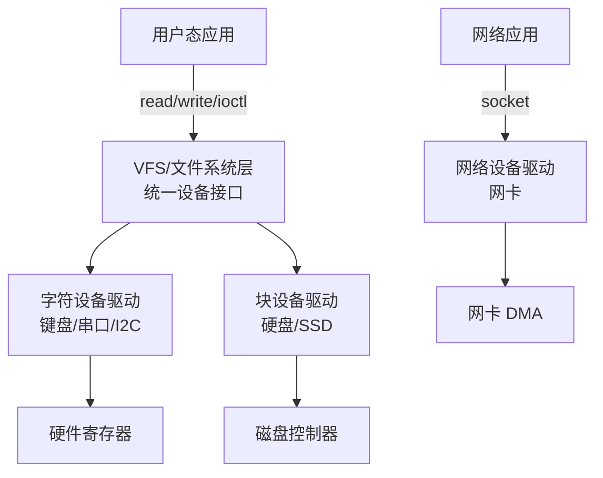
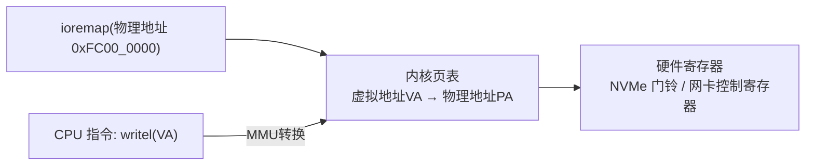
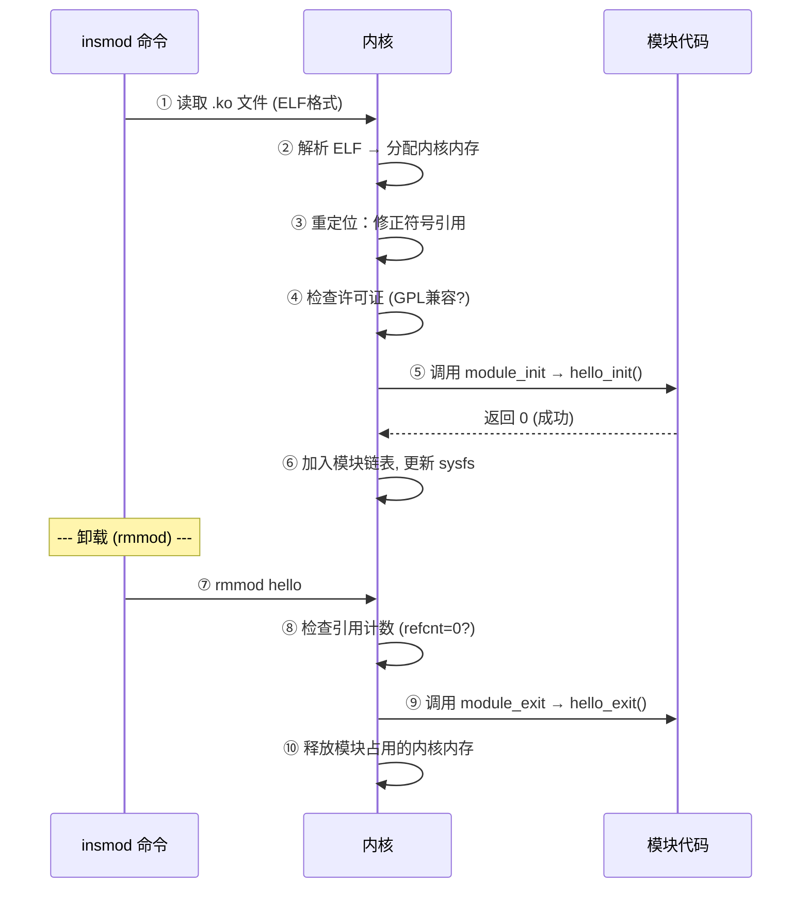
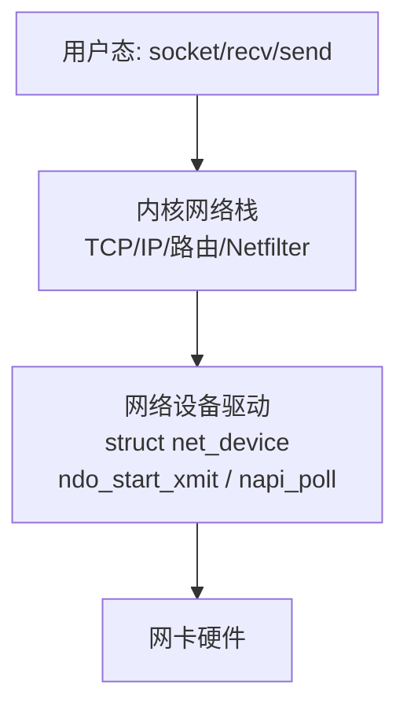
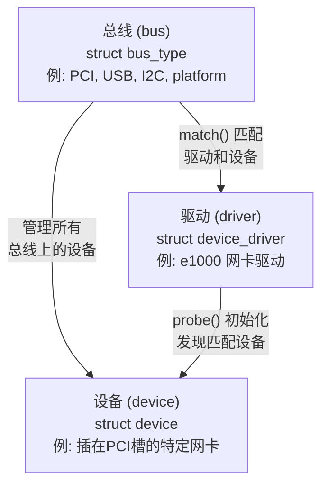
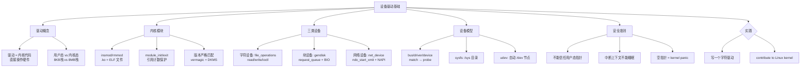

# OS的设备驱动基础

> 字符/块/网络设备、Linux驱动模型、内核模块——为什么写驱动要小心

#### 目录介绍
- [01.工作案例引入](#01工作案例引入)
  - [1.1 一行内核代码让服务器宕机了](#11-一行内核代码让服务器宕机了)
  - [1.2 为什么要学设备驱动](#12-为什么要学设备驱动)
- [02.驱动概述](#02驱动概述)
  - [2.1 驱动是什么](#21-驱动是什么)
  - [2.2 驱动运行在内核空间](#22-驱动运行在内核空间)
  - [2.3 内核态vs用户态——区别在哪里](#23-内核态vs用户态区别在哪里)
- [03.内核模块](#03内核模块)
  - [3.1 模块是什么](#31-模块是什么)
  - [3.2 最小内核模块](#32-最小内核模块)
  - [3.3 模块的加载与卸载](#33-模块的加载与卸载)
  - [3.4 模块的版本依赖](#34-模块的版本依赖)
- [04.字符设备驱动](#04字符设备驱动)
  - [4.1 字符设备是什么](#41-字符设备是什么)
  - [4.2 设备号——内核如何找到驱动](#42-设备号内核如何找到驱动)
  - [4.3 file_operations——驱动的灵魂](#43-file_operations驱动的灵魂)
  - [4.4 一个完整的字符驱动](#44-一个完整的字符驱动)
- [05.块设备驱动](#05块设备驱动)
  - [5.1 块设备不同于字符设备](#51-块设备不同于字符设备)
  - [5.2 gendisk与request_queue](#52-gendisk与request_queue)
- [06.网络设备驱动](#06网络设备驱动)
  - [6.1 网络设备的特殊性](#61-网络设备的特殊性)
  - [6.2 NAPI与中断合并](#62-napi与中断合并)
- [07.Linux设备模型](#07linux设备模型)
  - [7.1 bus/driver/device三要素](#71-busdriverdevice三要素)
  - [7.2 sysfs——内核对象的窗口](#72-sysfs内核对象的窗口)
  - [7.3 udev与自动创建设备节点](#73-udev与自动创建设备节点)
- [08.为什么写驱动要小心](#08为什么写驱动要小心)
  - [8.1 五种致命错误](#81-五种致命错误)
  - [8.2 内核开发的安全准则](#82-内核开发的安全准则)
- [09.综合案例编写一个LED驱动](#09综合案例编写一个led驱动)
  - [9.1 实战从零写字符驱动](#91-实战从零写字符驱动)
  - [9.2 加载、验证与调试](#92-加载验证与调试)
  - [9.3 知识图谱回顾](#93-知识图谱回顾)
- [10.思考题与作业](#10思考题与作业)
  - [10.1 基础思考题](#101-基础思考题)
  - [10.2 进阶思考题](#102-进阶思考题)
  - [10.3 动手作业](#103-动手作业)


## 01.工作案例引入

### 1.1 内核代码宕服务

**场景**：阿杰是一名工作三年的后台开发，刚接手维护一个"内核旁路"的数据采集模块。模块逻辑简单——通过 `mmap` 映射一块 DMA 内存，从网卡直接读数据。测试环境跑了一个月没问题。

上生产那天，模块加载后 30 秒，**服务器直接死机**——没有 coredump、没有 dmesg 输出到磁盘、SSH 断连、只能按电源键硬重启。

阿杰慌了。团队紧急回滚旧版本，事后复盘：

```c
// 问题代码（简化）
static int my_mmap(struct file *filp, struct vm_area_struct *vma) {
    // 将物理地址 0xFC000000 映射给用户态
    unsigned long pfn = 0xFC000000 >> PAGE_SHIFT;
    if (remap_pfn_range(vma, vma->vm_start, pfn,
                         vma->vm_end - vma->vm_start,
                         vma->vm_page_prot)) {
        return -EAGAIN;
    }
    return 0;
}
```

**根因**：`0xFC000000` 是**测试机器**上 DMA 内存的物理地址——但**生产机器**上这个地址属于 ACPI 固件区域。用户态程序 `mmap` 后往这个地址写了数据 → 破坏了 ACPI 表 → 内核无法读电源管理信息 → **NMI 硬件异常** → 系统硬死。

**追问链**：

- "为什么写一个错误的物理地址能让系统死机？" → 内核运行在 Ring 0，没有任何内存保护。驱动的 `remap_pfn_range` 直接把任意物理地址暴露给了用户态——写错地址就是写坏硬件寄存器或关键内核数据
- "那为什么不能像用户态程序一样有 segfault 保护？" → 用户态有 MMU + 页表保护；内核态直接访问物理地址，没有"合法/非法"的校验——**内核信任驱动代码是正确的**
- "内核模块不能做参数检查吗？" → 能做，但阿杰没做。驱动开发中常见的错误：不检查返回值、不验证地址范围、不在中断上下文正确使用锁
- "那怎么防御？" → **代码审查 + 静态分析 + 在测试环境用不同硬件配置验证**

**最重要的教训**：用户态程序崩了最多 core dump，内核态代码崩了**整台机器陪葬**。这就是"为什么写驱动要小心"。

### 1.2 为何学设备驱动



本章的目标是让你理解"操作系统和硬件之间的桥梁"：

- 驱动到底是什么？字符/块/网络三类有什么区别？
- 内核模块怎么加载和卸载？生命周期是什么样的？
- `file_operations` 结构体为什么是驱动的灵魂？
- Linux 设备模型（bus/driver/device）怎么组织的？
- 为什么内核开发是"高危职业"？什么操作会导致系统崩溃？


## 02.驱动概念详解

### 2.1 驱动是什么详解

设备驱动是**运行在内核空间的一段代码**，负责：

| 职责 | 说明 | 举例 |
|------|------|------|
| **硬件初始化** | 配置硬件寄存器、分配资源 | NVMe 驱动初始化提交队列 |
| **数据传输** | 用户 ↔ 设备的数据搬运 | `read()` → 从硬盘读扇区 |
| **中断处理** | 响应硬件中断，处理完成事件 | 网卡收到数据包 → 驱动 ISR |
| **抽象接口** | 把硬件差异封装成统一接口 | 所有块设备都实现 `submit_bio` |

```
操作系统眼中的设备：
  /dev/sda   ← 块设备 (硬盘)
  /dev/tty0  ← 字符设备 (终端)
  eth0       ← 网络设备 (网卡)
  /dev/null  ← 纯软件设备 (无硬件对应)
```

### 2.2 驱动在内核空间

```mermaid
flowchart TB
    subgraph 用户空间 (Ring 3)
        A["ls /dev/sda"]
        B["cat /dev/input/mice"]
    end
    subgraph 内核空间 (Ring 0)
        VFS["VFS 层<br/>把 /dev/sda 路由到<br/>对应驱动的 file_operations"]
        DRV["设备驱动<br/>读写硬件寄存器<br/>处理中断"]
    end
    subgraph 硬件
        HW["磁盘控制器 / 键盘 / 网卡"]
    end
    A -->|stat /dev/sda| VFS
    B -->|open + read| VFS
    VFS --> DRV
    DRV --> HW
```

驱动在内核空间运行意味着：
- ✅ 可以直接访问物理地址和硬件寄存器
- ✅ 可以直接调用内核函数（`kmalloc`, `ioremap`, ...）
- ⚠️ 没有内存保护——空指针不是 segment fault，是 kernel panic
- ⚠️ 栈空间极小——通常只有 8KB（编译时 `CONFIG_THREAD_SIZE`）

### 2.3 内核态vs用户态—

| | 用户态程序 | 内核模块(驱动) |
|------|-----------|--------------|
| 运行特权 | Ring 3 | **Ring 0**（最高） |
| 地址空间 | 独立虚拟地址空间（受 MMU 保护） | 共享内核地址空间（无保护） |
| 崩溃后果 | 进程被 kill（segfault） | **整台机器蓝屏/panic** |
| 可用函数 | libc + 系统调用 | **内核 API**（`printk/kmalloc/ioremap`） |
| 内存分配 | `malloc()`（可从堆拿） | `kmalloc()`（有限 GFP 标志控制行为） |
| 浮点运算 | ✅ 支持 | ⚠️ 需手动保存/恢复 FPU 状态 |
| 栈大小 | 8MB（线程） | **8KB**（不能递归、不能大局部变量） |
| 调试 | gdb + printf + valgrind | `printk` + `kgdb` + crash dump |

### 2.4 ioremap—

**疑惑：驱动的 C 代码写了 `*reg = 0xFF`，这个指针是怎么指向设备硬件寄存器的？**

设备寄存器存在一个**物理地址**上（如 PCI BAR0 映射的 0xFC000000），但内核不能直接解引用物理地址——必须先把物理地址映射到内核虚拟地址空间：

```c
// 1. ioremap: 物理地址 → 内核虚拟地址
void __iomem *regs = ioremap(0xFC000000, 4096);
//  物理地址         ↑                ↑ 长度

// 2. 现在可以通过虚拟地址访问硬件寄存器
writel(0xFF, regs + 0x04);   // 写 32bit 到偏移 0x04 的寄存器
uint32_t val = readl(regs);  // 读 32bit 从偏移 0x00
```



**为什么不能用 `*(volatile uint32_t *)0xFC000000`？**

```
裸指针在有些架构上能跑 (x86 有 1:1 映射)，但:
  1. 没有"内存类型"属性 → 可能被 Cache 缓存
     → 读到的是旧值! 设备寄存器必须直通
  2. ARM/MIPS 没有 1:1 映射 → 立刻崩溃
  3. ioremap 设置页表属性为 uncacheable (UC)
     → 每次读写都直接到设备，不用 Cache

这就是 ioread*/iowrite* 存在的意义:
  → 不仅做内存访问，还加了内存屏障 (barrier)
  → 保证 CPU 不会重排 IO 操作
```

**探索**：为什么 `writel()` 后面可能还需要 `mmiowb()`？

```
PCIe 的写入是 Posted Write（写后不管）:
  CPU: writel(reg, 0x1)  →  写完继续执行下一句
  数据可能还在 CPU Store Buffer 里，还没真正到设备!

writel() 保证: CPU 内部不乱序
mmiowb() 保证: 等 PCIe 总线上的所有写都完成
  → 需要"等设备真正收到数据"时，在 writel 之后加 mmiowb()
```


## 03.内核模块机制

### 3.1 模块是什么详解

Linux 内核是**单体内核（Monolithic Kernel）**——所有代码共享一个地址空间。但可以通过**内核模块（Kernel Module）**动态加载/卸载代码，不需要重新编译内核。

```
编译成内置 (built-in):  vmlinux 镜像的一部分 → 启动时就在 → 不能卸载
编译成模块 (module):   独立的 .ko 文件 → insmod 加载 / rmmod 卸载

所有驱动都可以编译成模块，按需加载。
你会看到 lsmod 列出的都是当前加载的内核模块。
```

### 3.2 最小内核模块

```c
// hello.c —— 最精简的内核模块
#include <linux/module.h>   // 所有模块必须
#include <linux/kernel.h>   // printk

// 模块加载时调用
static int __init hello_init(void) {
    printk(KERN_INFO "Hello, kernel world!\n");
    return 0;  // 返回 0 表示成功，非 0 表示失败
}

// 模块卸载时调用
static void __exit hello_exit(void) {
    printk(KERN_INFO "Goodbye, kernel world!\n");
}

module_init(hello_init);   // 指定初始化函数
module_exit(hello_exit);   // 指定清理函数

MODULE_LICENSE("GPL");     // 许可证声明
MODULE_AUTHOR("YangChong");
MODULE_DESCRIPTION("A minimal kernel module");
```

```bash
# 编译 (需要 Makefile)
$ make
$ sudo insmod hello.ko        # 加载
$ dmesg | tail -1
[ 123.456] Hello, kernel world!

$ sudo rmmod hello            # 卸载
$ dmesg | tail -1
[ 130.789] Goodbye, kernel world!

$ lsmod | grep hello          # 查看已加载模块
hello   16384  0
```

### 3.3 模块的加载与卸载



**关键**：`rmmod` 只有在模块的**引用计数为 0**（没有进程在使用它导出的功能）时才能卸载。可以通过 `MOD_INC_USE_COUNT` / `MOD_DEC_USE_COUNT` 手动管理（现代内核用 `try_module_get`/`module_put`）。

```bash
$ lsmod | grep hello
hello   16384  1    # ← 引用计数=1，有人在使用
$ sudo rmmod hello
rmmod: ERROR: Module hello is in use
```

### 3.4 模块的版本依赖

内核模块**必须和内核版本精确匹配**。因为：

```
内核模块 .ko 文件依赖:
  1. 内核头文件中结构体的大小和布局
     → 不同版本可能不同 (struct task_struct 经常变化)
  2. 内核导出的函数符号
     → 新版本可能移除/改名旧的 API
  3. 编译器版本和配置
     → 不同编译选项可能导致结构体对齐不同

加载时检查:
  .modinfo 段中的 vermagic 字段 = 内核版本 + 编译器信息
  不匹配 → insmod 拒绝加载

解决方法:
  - 为每个内核版本编译对应的 .ko
  - 用 DKMS (Dynamic Kernel Module Support) 自动重建
  - 发行版的 kmod 包管理多个版本
```

### 3.5 内核内存分配—

`kmalloc()` 的标志决定了能否睡眠、从哪分配：

| GFP 标志 | 能睡眠? | 从哪分配 | 适用场景 |
|----------|---------|---------|---------|
| `GFP_KERNEL` | ✅ 可以 | ZONE_NORMAL | 进程上下文 (open/read/write) |
| `GFP_ATOMIC` | ❌ **不能** | 紧急预留池 | 中断上下文 / spinlock内 |
| `GFP_DMA` | ✅ 可以 | ZONE_DMA (<16MB) | 老式 ISA 设备 DMA |

```c
// ✅ 进程上下文 → 可以用 GFP_KERNEL (可能睡眠等回收)
char *buf = kmalloc(4096, GFP_KERNEL);

// ✅ 中断处理函数 → 必须 GFP_ATOMIC
irqreturn_t my_isr(int irq, void *dev) {
    char *tmp = kmalloc(256, GFP_ATOMIC);
}

// ❌ 致命: 中断里用 GFP_KERNEL → 调度器崩溃 → kernel panic
```

**kmalloc vs vmalloc**：

```
kmalloc: 物理连续 → DMA 可用 → 最大~2MB → O(1)
vmalloc: 虚拟连续 → 物理可能不连续 → 可分配GB级 → 需改页表→较慢
ioremapped: 类似 vmalloc → 但 uncacheable → 直接到设备
```


## 04.字符设备驱动

### 4.1 字符设备是什么

字符设备是**按字节流访问**的设备——每次 `read()`/`write()` 处理连续的字节流，不支持随机寻址。

```
字符设备:
  /dev/tty0    ← 串口终端, 读写字节流
  /dev/null    ← 黑洞设备, 写进去消失
  /dev/random  ← 熵源, 读出来随机数
  /dev/i2c-1   ← I2C 总线设备

特点:
  - 顺序访问 (不能 seek)
  - 通常没有缓存 (直接操作硬件)
  - 由 file_operations 定义 read/write/ioctl 等操作
```

### 4.2 设备号机制详解

每个字符设备在内核中有一个**设备号（dev_t）**：

```
设备号 = (主设备号 major, 次设备号 minor)

major: 标识"哪个驱动"来处理请求
minor: 标识"驱动的第几个设备实例"

例: /dev/tty0
  major=4 (tty 驱动)
  minor=0 (第一个 tty)

内核对设备号的查找:
  用户态 open("/dev/tty0")
  → VFS 根据 inode 取出设备号 (4,0)
  → 在 cdev_map 中查找 major=4 → 找到 tty 驱动
  → 调 tty 驱动的 file_operations->open()
```

```c
// 分配设备号的 API
int alloc_chrdev_region(&dev, baseminor, count, name);   // 动态分配
int register_chrdev_region(dev, count, name);             // 静态分配 (知道 major)

// 查看已分配的设备号
$ cat /proc/devices
Character devices:
  1 mem
  4 tty
 13 input
 Block devices:
  8 sd   ← /dev/sda (major=8, minor=0)
```

### 4.3 file_oper

`struct file_operations` 定义了**用户在调用 read/write/open 时驱动做什么**：

```c
struct file_operations {
    struct module *owner;          // 指向本模块 (防止卸载时 module 被释放)
    loff_t (*llseek) (struct file *, loff_t, int);
    ssize_t (*read) (struct file *, char __user *, size_t, loff_t *);
    ssize_t (*write) (struct file *, const char __user *, size_t, loff_t *);
    long (*unlocked_ioctl) (struct file *, unsigned int, unsigned long);
    int (*mmap) (struct file *, struct vm_area_struct *);
    int (*open) (struct inode *, struct file *);
    int (*release) (struct inode *, struct file *);
    // ... 还有 poll, fsync, aio_read, aio_write 等
};
```

**用户态调用的对应关系**：

| 用户态调用 | 内核操作 | 驱动的实现 |
|-----------|---------|-----------|
| `fd = open("/dev/mydev",...)` | `sys_open → chrdev_open` | `file_operations->open()` |
| `read(fd, buf, 4096)` | `sys_read → vfs_read` | `file_operations->read()` |
| `write(fd, buf, 4096)` | `sys_write → vfs_write` | `file_operations->write()` |
| `ioctl(fd, CMD, &arg)` | `sys_ioctl → vfs_ioctl` | `file_operations->unlocked_ioctl()` |
| `close(fd)` | `sys_close → filp_close` | `file_operations->release()` |

### 4.4 完整字符驱动

```c
#include <linux/module.h>
#include <linux/fs.h>       // file_operations
#include <linux/cdev.h>     // cdev
#include <linux/uaccess.h>  // copy_to_user / copy_from_user

#define DEVICE_NAME "mychardev"
static int major;
static char msg[256] = "Hello from kernel!\n";

// ① open: 设备被打开时调用
static int my_open(struct inode *inode, struct file *filp) {
    printk(KERN_INFO "mychardev: opened\n");
    return 0;
}

// ② read: 用户 read() 时调用
static ssize_t my_read(struct file *filp, char __user *buf,
                        size_t count, loff_t *f_pos) {
    int len = strlen(msg);
    if (*f_pos >= len) return 0;  // 已读完
    if (count > len - *f_pos) count = len - *f_pos;

    // ⚠️ 必须用 copy_to_user! 不能直接用 memcpy
    if (copy_to_user(buf, msg + *f_pos, count))
        return -EFAULT;
    *f_pos += count;
    return count;
}

// ③ write: 用户 write() 时调用
static ssize_t my_write(struct file *filp, const char __user *buf,
                         size_t count, loff_t *f_pos) {
    if (count > sizeof(msg) - 1) count = sizeof(msg) - 1;
    // ⚠️ 必须用 copy_from_user!
    if (copy_from_user(msg, buf, count))
        return -EFAULT;
    msg[count] = '\0';
    return count;
}

// ④ release: 设备关闭时调用
static int my_release(struct inode *inode, struct file *filp) {
    printk(KERN_INFO "mychardev: closed\n");
    return 0;
}

// 文件操作表
static struct file_operations my_fops = {
    .owner   = THIS_MODULE,
    .open    = my_open,
    .read    = my_read,
    .write   = my_write,
    .release = my_release,
};

// 模块初始化
static int __init my_init(void) {
    major = register_chrdev(0, DEVICE_NAME, &my_fops);
    if (major < 0) {
        printk(KERN_ALERT "Failed to register device\n");
        return major;
    }
    printk(KERN_INFO "mychardev: major=%d\n", major);
    return 0;
}

static void __exit my_exit(void) {
    unregister_chrdev(major, DEVICE_NAME);
}

module_init(my_init);
module_exit(my_exit);
MODULE_LICENSE("GPL");
```

```bash
# 加载模块后，手动创建设备节点
$ sudo insmod mychardev.ko
$ dmesg | tail -1
mychardev: major=240   # 动态分配的主设备号

$ sudo mknod /dev/mychardev c 240 0
$ sudo chmod 666 /dev/mychardev

# 测试
$ cat /dev/mychardev
Hello from kernel!

$ echo "new message" > /dev/mychardev
$ cat /dev/mychardev
new message
```


## 05.块设备驱动详解

### 5.1 块与字符设备

块设备按**固定大小的块**（通常 512B 或 4KB）传输数据，支持**随机寻址**，**有缓存层**：

```
块设备:
  /dev/sda    ← 硬盘
  /dev/loop0  ← 回环设备
  /dev/nvme0n1 ← NVMe SSD

特点:
  - 支持随机访问 (seek)
  - 有 Page Cache 层 (缓冲 IO)
  - 数据以 BIO (Block I/O) 结构提交
  - 不需要实现 read/write → 实现 submit_bio
```

| | 字符设备 | 块设备 |
|------|---------|--------|
| 访问方式 | 字节流（顺序） | 块（随机寻址） |
| 缓存 | 通常无 | **有 Page Cache** |
| 内核接口 | `file_operations` | `block_device_operations` + `request_queue` |
| 典型设备 | 键盘/串口/GPIO | 硬盘/SSD/DVD |
| 数据单位 | 字节 | 块（512B/4KB） |

### 5.2 gendisk与r

块设备驱动的核心是 `struct gendisk`（代表一个磁盘）和 `struct request_queue`（IO 请求队列）：

```c
// 块设备注册流程（简化）
struct gendisk *disk;

// 1. 分配 gendisk
disk = alloc_disk(minors_per_device);

// 2. 初始化请求队列（处理 BIO 请求）
disk->queue = blk_alloc_queue(GFP_KERNEL);
blk_queue_make_request(disk->queue, my_request_handler);

// 3. 设置磁盘属性
disk->major = major;
disk->first_minor = 0;
disk->fops = &my_block_fops;
sprintf(disk->disk_name, "myblock");
set_capacity(disk, total_sectors);  // 总扇区数

// 4. 注册到内核
add_disk(disk);

// 请求处理函数：内核对"读扇区 100~199"的回调
static blk_qc_t my_request_handler(struct request_queue *q,
                                     struct bio *bio) {
    // bio 包含: 扇区号, 页指针, 长度
    // 驱动: 把 bio 转换为硬件命令 (如 NVMe READ)
    // → 发送给硬件 → 完成时调 bio_endio(bio)
}
```


## 06.网络设备驱动

### 6.1 网络设备的特殊性

网络设备**没有设备文件**——它通过 `socket` 接口和内核网络栈交互，而不是 `open/read/write`：



### 6.2 NAPI与中断合并

高吞吐网卡的驱动普遍使用 **NAPI（New API）**——把中断驱动改为轮询：

```
传统中断模式 (高包速下中断风暴):
  每收到一个包 → 一次硬中断
  10Gbps 网卡 → 每秒 1400 万个包 → 1400 万次中断/秒
  → CPU 被中断淹没，活活"中断活锁"

NAPI 模式:
  ① 第一个包到来 → 硬中断 → 关闭 RX 中断 → 调度软中断
  ② 软中断中轮询: while (还有数据) { 收包处理 }
  ③ 收完了 → 重新开启 RX 中断
  
  效果: 5 个包一起到 → 1 次中断 + 5 次轮询
       而不是 5 次中断
```


## 07.Linux设备模型

### 7.1 bus/drive

Linux 设备模型的核心是三个对象及其关系：



**匹配过程（以PCI为例）**：

```
1. 加载 e1000.ko → 注册到 PCI 总线 (pci_register_driver)
2. 内核扫描 PCI 总线 → 发现 Vendor=8086, Device=10D3
3. 遍历 PCI 总线上的驱动列表 → 比对该驱动的 id_table
4. 匹配成功! → pci_device_probe() → e1000_probe()
5. probe() 中: 映射BAR寄存器, 注册net_device, 初始化硬件
```

### 7.2 sysfs窗口

**sysfs** 把内核对象（bus/driver/device）暴露为**文件系统层次**：

```bash
$ ls /sys/bus/pci/
devices/  drivers/  drivers_autoprobe  ...

$ ls /sys/bus/pci/drivers/e1000e/
0000:00:19.0 -> ../../../../devices/pci0000:00/0000:00:19.0
bind  module  new_id  remove_id  uevent  unbind

$ cat /sys/bus/pci/devices/0000:00:19.0/vendor
0x8086   # Intel

# PCI 设备的完整 sysfs 路径:
/sys/devices/pci0000:00/0000:00:19.0/
├── vendor     (制造商 ID)
├── device     (设备 ID)
├── class      (设备类别)
├── irq        (分配的中断号)
├── resource   (BAR 寄存器映射的物理地址)
└── driver -> ../../../../bus/pci/drivers/e1000e
```

### 7.3 udev与自动创建

传统做法需要手动 `mknod` 创建设备节点。现代 Linux 用 **devtmpfs + udev** 自动创建：

```c
// 驱动中自动创建设备节点（替代手动 mknod）
static struct class *my_class;
static struct device *my_device;

// 在 module_init 中:
my_class = class_create(THIS_MODULE, "mychardev");
my_device = device_create(my_class, NULL, MKDEV(major, 0),
                           NULL, "mychardev");

// module_exit 中:
device_destroy(my_class, MKDEV(major, 0));
class_destroy(my_class);

// 加载模块后，/dev/mychardev 自动出现！
// 不再需要手动 mknod
```

### 7.4 设备树机制详解

**疑惑：PCI 总线可以自动枚举设备（扫描 Vendor/Device ID），ARM 嵌入式系统没有 PCI 怎么办？**

ARM/RISC-V 嵌入式设备用**设备树（Device Tree, DTB）**——编译时固件传给内核的硬件描述文件：

```text
// 设备树片段（.dts 源码）——描述硬件拓扑
i2c@40003000 {
    compatible = "vendor,my-i2c";
    reg = <0x40003000 0x1000>;     // 寄存器物理地址
    interrupts = <42>;               // 使用的中断号

    temperature@4c {
        compatible = "lm75";         // 温度传感器匹配字符串
        reg = <0x4c>;                // I2C 地址
    };
};
```

**设备树到驱动的匹配**：

```c
// 驱动中声明 compatible 匹配表
static const struct of_device_id my_match[] = {
    { .compatible = "vendor,my-i2c" },
    { /* sentinel */ }
};
MODULE_DEVICE_TABLE(of, my_match);

// 内核遍历设备树 → 发现 compatible 匹配 → probe()
static int my_probe(struct platform_device *pdev) {
    struct resource *res = platform_get_resource(pdev, IORESOURCE_MEM, 0);
    void __iomem *regs = devm_ioremap_resource(&pdev->dev, res);
    int irq = platform_get_irq(pdev, 0);
    // init hardware...
}
```

**探索：Device Tree Overlay**——运行时修改设备树。

```
Raspberry Pi 接 HAT 扩展板:
  → 加载 overlay .dtbo 文件
  → 内核动态创建新设备
  → 匹配对应驱动 → probe() 被调用
  → 实现"热插拔非 PCI 设备"!
```

### 7.5 PCI枚举完整流程

x86 服务器上，内核启动时自动扫描 PCI 总线：

```
1. 读 PCI Host Bridge → 发现 Root Complex
2. 递归扫描 Bus 0 → Device 0-31 → Function 0-7
   每个设备: 读配置空间 (Vendor/Device/Class/Revision)
3. 为每个设备创建 struct pci_dev
4. 遍历 pci_driver 列表 → match id_table → probe()
5. probe() 中: pci_request_regions → ioremap BAR → 初始化

$ lspci
00:19.0 Ethernet: Intel I219-V     # Bus0 Dev19 Func0
$ cat /sys/bus/pci/devices/0000:00:19.0/config | xxd   # 256B配置空间
```

**kernel panic / oops 分析——驱动崩溃时发生了什么**

驱动崩了不是 segfault——是**整个内核停摆**：

```
Kernel Oops:
  → 内核遇到无法恢复的错误 (空指针/BUG_ON)
  → 打印寄存器、调用栈、CPU信息
  → 继续运行 (但可能不稳定)

Kernel Panic:
  → 更严重的错误 (Oops后继续运行也危险)
  → 打印信息 → 停掉所有CPU → 只能硬重启

dmesg 示例 (驱动 oops):
  BUG: unable to handle kernel NULL pointer dereference at 00000000
  IP: my_write+0x2a/0x50 [mychardev]
  Call Trace:
   vfs_write+0xa3/0x180
   ksys_write+0x4f/0xa0
  → 在 my_write 函数偏移 0x2a 处解引用了空指针!

读取 oops:
  addr2line -e mychardev.ko 0x2a   → my_write+0x2a: mychardev.c:42
  → 定位到源码行号
```


## 08.写驱动为何小心

### 8.1 五种致命错误

| 错误 | 后果 | 例子 |
|------|------|------|
| **空指针解引用** | kernel panic → 系统死机 | `int *p = NULL; *p = 42;` |
| **滥写物理地址** | 损坏硬件/固件/内核数据 | remap 了错误的物理页 |
| **中断中睡眠** | 死锁或调度器崩溃 | 在 ISR 里调 `msleep()` |
| **栈溢出** | 静默数据损坏 → 随机崩溃 | 内核栈 8KB → 大局部变量/递归 |
| **忘记解锁** | 死锁 → 进程全部 D 状态 | `spin_lock()` 后忘记 `spin_unlock()` |

### 8.2 内核安全准则

```
1. 永远检查返回值
   → kmalloc 可能失败 → 返回 NULL
   → copy_from_user 可能失败 → 返回未拷贝字节数

2. 中断上下文不能睡眠
   → 不能调 schedule(), msleep(), wait_event()
   → 只能用 spin_lock (不能 mutex_lock)
   → kmalloc 必须用 GFP_ATOMIC (不能 GFP_KERNEL)

3. 用户态指针不能"直接"用
   → 必须通过 copy_from_user / copy_to_user
   → 内核地址和用户地址不在同一地址空间
   → 直接访问 → 在有些架构上能跑但 ARM/MIPS 就崩

4. 做好并发控制
   → 假设代码永远在 SMP + 抢占场景下跑
   → 共享数据必须加锁

5. 永远假设"下一行代码就会被换出"
   → 不要依赖时序 (硬件操作后忙等待可能被调度器打断)
   → 用内核定时器或完成量 (completion) 替代
```


## 09.LED驱动案例

### 9.1 从零写字符驱动

**场景**：Raspberry Pi 或开发板上，用内核模块控制 GPIO LED。完整走一遍从代码到验证的流程。

```c
// gpio_led.c —— 一个控制 GPIO 的字符设备驱动
#include <linux/module.h>
#include <linux/fs.h>
#include <linux/uaccess.h>
#include <linux/gpio.h>
#include <linux/device.h>

#define GPIO_PIN 17    // BCM GPIO17
#define DEV_NAME "gpled"

static int major;
static struct class *cls;
static struct device *dev;
static int led_state = 0;  // 0=灭, 1=亮

static ssize_t led_read(struct file *f, char __user *buf,
                         size_t count, loff_t *pos) {
    char val = led_state ? '1' : '0';
    if (*pos > 0) return 0;
    if (copy_to_user(buf, &val, 1)) return -EFAULT;
    *pos += 1;
    return 1;
}

static ssize_t led_write(struct file *f, const char __user *buf,
                          size_t count, loff_t *pos) {
    char cmd;
    if (copy_from_user(&cmd, buf, 1)) return -EFAULT;

    if (cmd == '1') {
        gpio_set_value(GPIO_PIN, 1);
        led_state = 1;
    } else if (cmd == '0') {
        gpio_set_value(GPIO_PIN, 0);
        led_state = 0;
    } else {
        return -EINVAL;
    }
    return 1;
}

static struct file_operations fops = {
    .owner = THIS_MODULE,
    .read  = led_read,
    .write = led_write,
};

static int __init led_init(void) {
    if (gpio_request(GPIO_PIN, "gpled") < 0) {
        printk(KERN_ERR "gpled: gpio_request failed\n");
        return -EBUSY;
    }
    gpio_direction_output(GPIO_PIN, 0);

    major = register_chrdev(0, DEV_NAME, &fops);
    // 自动创建 /dev/gpled
    cls = class_create(THIS_MODULE, DEV_NAME);
    dev = device_create(cls, NULL, MKDEV(major, 0), NULL, DEV_NAME);

    printk(KERN_INFO "gpled: loaded, major=%d, /dev/%s\n", major, DEV_NAME);
    return 0;
}

static void __exit led_exit(void) {
    device_destroy(cls, MKDEV(major, 0));
    class_destroy(cls);
    unregister_chrdev(major, DEV_NAME);
    gpio_set_value(GPIO_PIN, 0);
    gpio_free(GPIO_PIN);
    printk(KERN_INFO "gpled: unloaded\n");
}

module_init(led_init);
module_exit(led_exit);
MODULE_LICENSE("GPL");
```

### 9.2 加载、验证与调试

```bash
$ make && sudo insmod gpio_led.ko
$ dmesg | tail -1
gpled: loaded, major=241, /dev/gpled

# 控制 LED
$ sudo sh -c 'echo 1 > /dev/gpled'   # LED 亮
$ sudo sh -c 'echo 0 > /dev/gpled'   # LED 灭

$ cat /dev/gpled    # 读状态
1

# 从用户态读取（不需要 sudo，如果 udev 规则配好了）
$ cat /dev/gpled
0
```

### 9.3 知识图谱回顾



**最终方法论**——理解设备驱动的三层递进：

1. **接口层**：用户看到什么？（`/dev/xxx` 文件 + read/write/ioctl）
2. **驱动层**：驱动做什么？（`file_operations` 里的回调函数）
3. **硬件层**：硬件怎么控制？（寄存器读写、中断处理、DMA 传输）


## 10.思考题与作业

### 10.1 基础思考题目

1. **内核态 vs 用户态**：列出至少 5 个内核模块和用户态程序的区别。为什么内核栈只有 8KB？如果一个驱动函数的局部变量占了 16KB 会怎样？

2. **设备号**：`ls -l /dev/sda` 输出 `brw-rw---- 1 root disk 8, 0`——这里的 8 和 0 分别是什么？`/dev/sda1` 的次设备号又是什么？设备号在内核中怎么和驱动关联的？

3. **file_operations 映射**：用户调用 `write(fd, "hello", 5)` 最终会调到驱动的哪个函数？从 `sys_write` 到驱动的 `file_operations->write` 画出调用链。

4. **insmod 发生了什么**：从用户敲 `insmod hello.ko` 到驱动 `hello_init()` 被调用，内核做了什么？module_init 宏的作用是什么？

5. **copy_from_user 必要性**：为什么驱动不能直接用 `memcpy(buf, user_ptr, n)` 把用户态数据拷贝到内核？什么架构下会出问题？

### 10.2 进阶思考题目

1. **1.1 节复盘**：阿杰的 DMA 地址硬编码事故。如果让你重写这个模块，你会怎么获取 DMA 内存的物理地址？`dma_alloc_coherent` 和硬编码物理地址有什么区别？IOMMU 能防止这类错误吗？

2. **NAPI 的权衡**：NAPI 在高速率下比中断模式好，但在低速率下（比如每秒几个包），NAPI 反而可能引入额外延迟——为什么？内核怎么用"自适应中断合并"解决这个问题？

3. **用户态驱动**：DPDK 把网卡驱动放到了用户态（通过 UIO/VFIO 映射寄存器），牺牲了什么换来了什么？什么场景值得这么做？

4. **probe 失败的回滚**：驱动的 `probe()` 函数失败时需要撤销所有已经分配的资源。"goto-style" 错误处理为什么是内核的标准做法？这和 RAII 的哲学冲突在哪？

5. **竞争条件**：两个 CPU 同时 open 同一个字符设备——你的 `open()` 和 `read()` 会发生竞态吗？内核是否保证了`file_operations` 回调的互斥？

### 10.3 动手实践作业

**作业一（必做）**：写一个简单的字符设备驱动。

- 实现 `open/release/read/write` 四个回调
- 在 read/write 中使用 `copy_to_user`/`copy_from_user`
- 用 `device_create` 自动创建 `/dev/` 节点
- 加载后用 `echo` 写入、用 `cat` 读出，验证功能

**作业二（选做）**：给上面的驱动增加 `ioctl` 支持。

- 定义 3 个自定义 ioctl 命令（如清空缓冲区、设置缓冲区大小、获取统计信息）
- 用户态用 `ioctl(fd, CMD, &arg)` 调用
- 注意 `_IOW/_IOR/_IOWR` 宏的正确定义

**作业三（选做）**：写一个 `/proc` 文件系统接口。

```c
// 创建 /proc/mydriver 文件
proc_create("mydriver", 0, NULL, &my_proc_fops);
// 用户 cat /proc/mydriver 时返回驱动的运行统计
// 对比 /proc 接口和字符设备 /dev 接口的优劣
```

**作业四（架构思考）**：从 Linux 内核代码树中找一个你感兴趣的驱动（`drivers/` 目录下），分析它的 file_operations、probe 流程和中断处理，画出模块的生命周期状态图。