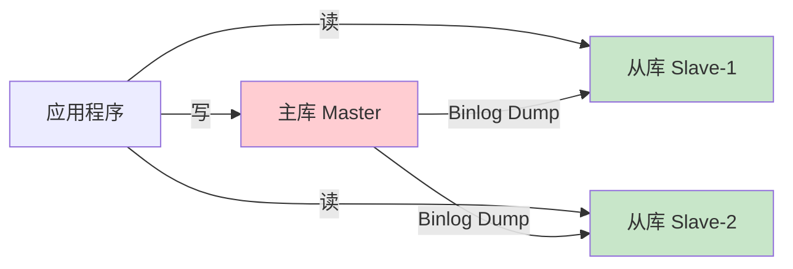
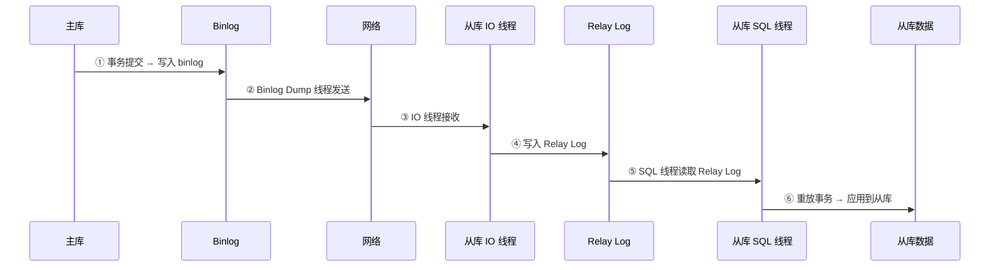
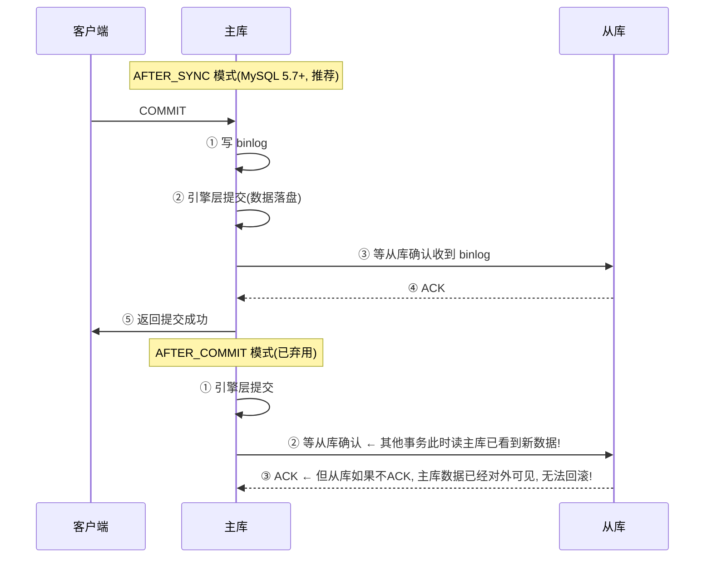
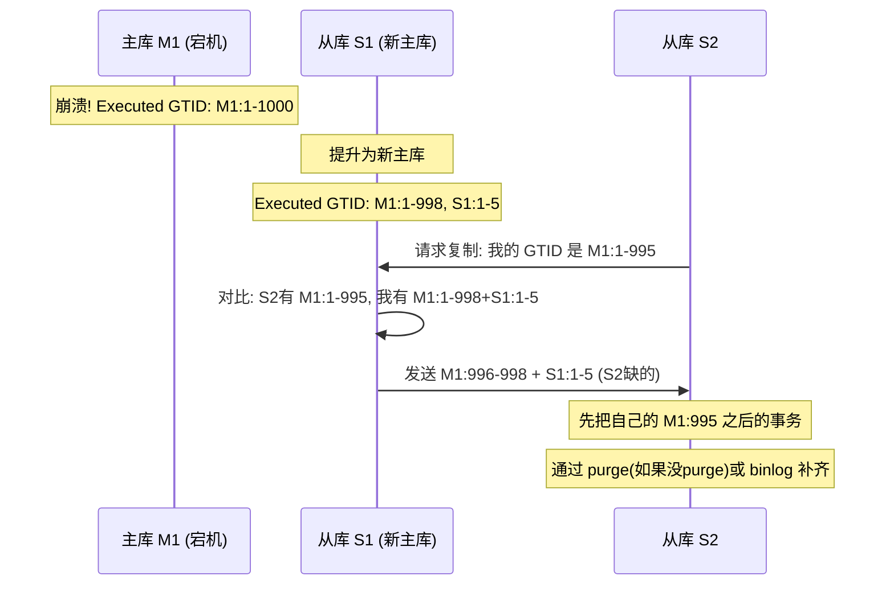
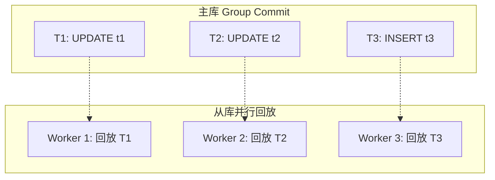
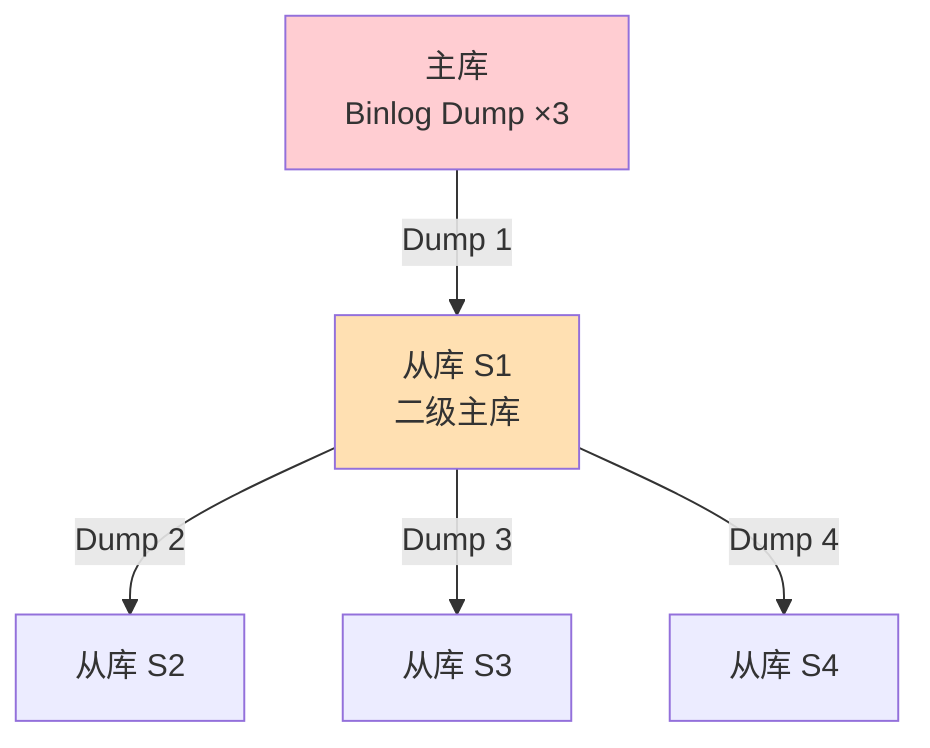
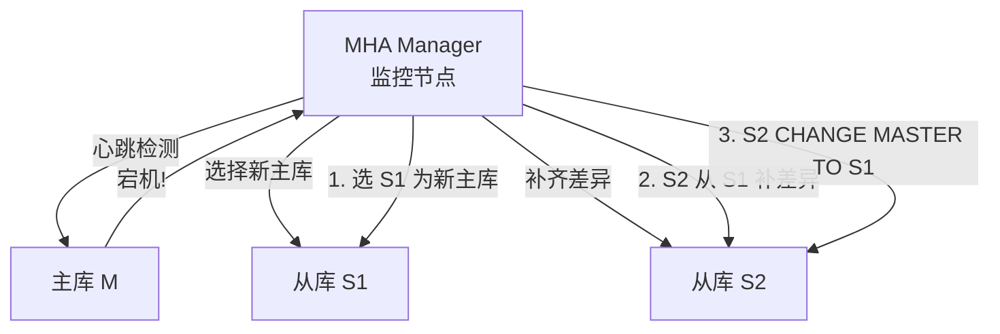
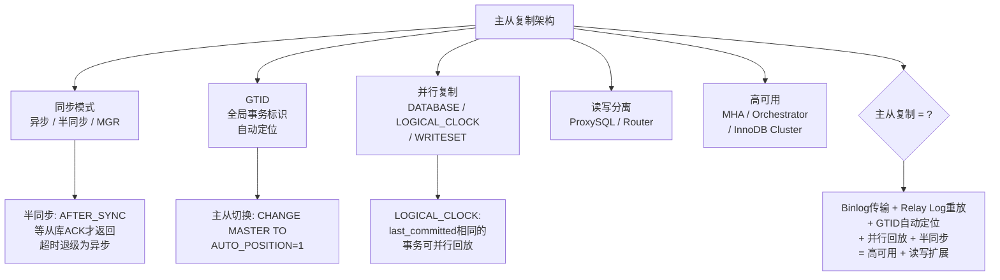
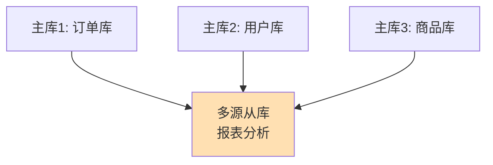

# 数据库主从复制架构

> binlog 同步机制、半同步复制、GTID 原理、读写分离与延迟处理

#### 目录介绍
- [01.工作案例引入](#01工作案例引入)
  - [1.1 主从延迟事故](#11-一次主从延迟引发的线上事故)
  - [1.2 为何学复制](#12-为什么要深入复制原理)
- [02.主从复制概述](#02主从复制概述)
  - [2.1 架构模型](#21-架构模型)
  - [2.2 三种复制方式](#22-三种复制方式)
  - [2.3 Dump协议](#23-binlog-dump协议数据如何从主库流向从库)
- [03.异步复制](#03异步复制基础模型)
  - [3.1 IO线程与SQL线程](#31-io线程与sql线程)
  - [3.2 延迟与丢失](#32-异步复制的问题主从延迟与数据丢失)
  - [3.3 延迟监控](#33-主从延迟的量化和监控)
  - [3.4 Relay Log](#34-relay-log的结构与crash-safe)
  - [3.5 复制过滤](#35-复制过滤不是所有数据都值得同步)
- [04.半同步复制](#04半同步复制)
  - [4.1 同步模式对比](#41-after_sync-vs-after_commit)
  - [4.2 退级机制](#42-半同步复制的退级机制)
- [05.GTID](#05gtid全局事务标识)
  - [5.1 为何GTID](#51-为什么需要gtid)
  - [5.2 GTID组成](#52-gtid的组成)
  - [5.3 主从切换](#53-gtid模式下的主从切换)
  - [5.4 生命周期](#54-gtid的生命周期)
  - [5.5 限制与陷阱](#55-gtid的三大限制与陷阱)
  - [5.6 自动恢复](#56-gtid模式下从库的自动恢复)
- [06.并行复制](#06并行复制)
  - [6.1 SQL瓶颈](#61-单线程sql的瓶颈)
  - [6.2 并行复制](#62-基于组的并行复制logical_clock)
  - [6.3 三种模式](#63-并行复制的三种模式)
  - [6.4 WRITESET](#64-writeset并行复制的终极形态)
- [07.读写分离](#07读写分离与延迟处理)
  - [7.1 读写分离的架构](#71-读写分离的架构)
  - [7.2 延迟策略](#72-主从延迟的应对策略)
  - [7.3 级联复制](#73-级联复制解耦主库的传输压力)
  - [7.4 延迟从库](#74-延迟从库误操作的最后防线)
- [08.高可用架构](#08高可用架构)
  - [8.1 MHA](#81-mha自动故障转移)
  - [8.2 拓扑管理](#82-orchestrator自动拓扑管理)
  - [8.3 MGR](#83-mgr)
- [09.综合案例](#09综合案例大促主从延迟优化)
  - [9.1 场景与排查](#91-场景与排查)
  - [9.2 优化效果](#92-优化方案与效果)
  - [9.3 知识图谱](#93-知识图谱回顾)
  - [9.4 多源复制](#94-探索多源复制的架构)
- [10.思考题与作业](#10思考题与作业)
  - [10.1 基础思考题](#101-基础思考题)
  - [10.2 进阶思考题](#102-进阶思考题)
  - [10.3 动手作业](#103-动手作业)


## 01.工作案例引入

### 1.1 主从延迟事故

**场景**：小陈负责的电商平台在"双11"凌晨零点整遭遇到一波流量洪峰。用户下单后，订单状态接口显示"支付超时，请重新下单"，但实际上支付已经成功——**这是经典的主从延迟导致的数据不一致**。

小陈排查后发现——支付回调写入了主库，但订单状态查询走了从库，从库的 binlog 还没同步过来这条支付记录：

```
主库(T=0ms):   收到支付回调 → UPDATE orders SET status='paid' WHERE id=12345
从库(T=2000ms): 用户刷新订单页 → SELECT status FROM orders WHERE id=12345
                → 读到 status='pending' → 显示支付超时!
```

**疑惑链条**：

- "为什么不让订单状态查询也走主库？" → 可以，但读写分离的初衷就是减轻主库压力——热点数据全打主库等于没做读写分离
- "从库延迟 2 秒——这 2 秒消耗在哪里？" → 主库写 binlog → 网络传输 → 从库 IO 线程写 relay log → SQL 线程重放 → 3 个环节叠加
- "为什么不把 binlog 格式改成 ROW 来加速？" → ROW 格式日志量更大，可能反而增加延迟——关键是**SQL 线程的单线程瓶颈**
- "MySQL 5.7 不是支持并行复制了吗？" → 是的，`LOGICAL_CLOCK` 模式可以把同一个组提交内的事务在从库并行回放——但前提是主库开了组提交
- "半同步复制能解决丢失问题吗？" → 能，但会增加主库提交延迟——是性能和数据安全的又一次权衡

这场事故让小陈意识到：**主从复制不是"搭好了就完事"，延迟、数据一致性、故障切换都需要系统性的理解和设计**。

### 1.2 为何学复制

```
主从复制的三大核心功能:
  ① 读写分离: 写走主库, 读走从库 → 分摊读压力
  ② 数据备份: 从库 = 实时热备 → 主库挂了从库顶上
  ③ 高可用: 主从切换 + 故障自动转移 → 服务不中断

你以为的复制: 主库写 → 从库读 → 搞定
实际的复制: 格式选择×同步模式×并行策略×延迟处理×故障切换
```


## 02.主从复制概述

### 2.1 架构模型



主库负责**写**、从库负责**读**。写操作在主库执行后通过 binlog 传递给从库重放。

### 2.2 复制方式

| 复制方式 | 原理 | 丢数据风险 | 主库延迟 | 适用场景 |
|---------|------|:---:|:---:|---------|
| **异步复制** | 主库提交后不管从库 | ⚠️ 可能丢 | 最低 | 默认模式 |
| **半同步复制** | 至少一个从库收到 binlog 后才返回 | ✅ 不丢 | 增加约 1ms | 金融/订单 |
| **全同步复制** (Group Replication) | 所有从库确认后提交 | ✅ 不丢 | 最高 | 强一致性 |

### 2.3 Dump协议

**疑惑：主库怎么把 binlog 发给从库？是主库"推送"还是从库"拉取"？**

**答疑**：是从库主动拉取——从库的 IO 线程向主库发起一个长连接请求，主库启动 **Binlog Dump 线程**持续推送：

```
协议交互流程 (从库 IO 线程发起):

Phase 1: 握手
  从库 → 主库: COM_REGISTER_SLAVE (注册自己)
  从库 → 主库: COM_BINLOG_DUMP (请求复制)
    参数: binlog_file, binlog_pos, server_id, ...

Phase 2: 持续推送
  主库: 创建 Dump 线程 → 读取 binlog → 封装为 Binlog Event → 发送
  主库 → 从库: event1 (GTID / Query / Row / Xid / ...)
  主库 → 从库: event2
  ...

Phase 3: 半双工(5.6-) vs 全双工(5.7+)
  MySQL 5.6 及以前: 半双工 → 从库收到一个 event 要回复 ACK
  MySQL 5.7+: 全双工 → 主库无需等 ACK 即可发下一个 event → 吞吐量 ↑

关键参数:
  --master_info_repository=TABLE   → 复制进度存 relay-log.info 表(崩溃安全)
  --relay_log_info_repository=TABLE → 同上
  --slave_net_timeout=60           → 60秒没收到数据 → 认为主库挂了 → 重连
```

**探索**：Binlog Dump 线程在 `SHOW PROCESSLIST` 中长什么样？

```sql
-- 主库上查看
SHOW PROCESSLIST;
-- +----+------+-----------+------+------------+------+-------------------+
-- | Id | User | Host      | db   | Command    | Time | State             |
-- +----+------+-----------+------+------------+------+-------------------+
-- | 12 | repl | 10.0.1.2  | NULL | Binlog Dump| 3600 | Master has sent...|
-- +----+------+-----------+------+------------+------+-------------------+
-- 这个线程已经持续工作 3600 秒 (1小时) — 说明从库一直在同步

-- 每个从库在主库上对应一个 Binlog Dump 线程
-- 10 个从库 = 10 个 Dump 线程 → 主库网络带宽 = 10 × binlog 写入速率
```


## 03.异步复制

### 3.1 IO与SQL线程

MySQL 的异步复制通过两个线程实现：



```
IO 线程职责: 从主库拉取 binlog → 写入从库的 relay log
SQL 线程职责: 从 relay log 读取事件 → 在从库逐条重放

两个线程独立工作:
  IO 线程跑得快 → relay log 堆积 → SQL 线程跟不上 → 主从延迟
```

**从库的三层状态**：

```sql
SHOW SLAVE STATUS\G
-- Slave_IO_Running: Yes        ← IO 线程正常工作
-- Slave_SQL_Running: Yes       ← SQL 线程正常工作
-- Seconds_Behind_Master: 0     ← 核心! 主从延迟秒数
-- Relay_Log_File: relay-bin.000002
-- Relay_Log_Pos: 1204
-- Master_Log_File: binlog.000001
-- Read_Master_Log_Pos: 8947    ← IO 线程读到主库 binlog 的哪个位置
-- Exec_Master_Log_Pos: 7230    ← SQL 线程执行到主库 binlog 的哪个位置
                                 → 差值 = 主从延迟的字节数
```

### 3.2 延迟与丢失

**问题一：主从延迟**

异步模式下，主库不等待从库确认。如果 SQL 线程跟不上，从库数据落后于主库——这就是 1.1 节小陈遇到的问题。

```
主从延迟的根本原因:
  ① 主库并发写入 N 个事务 → 只用 1 秒
  ② 从库 SQL 线程单线程重放 → 需要 5 秒
  → 延迟 = 5-1 = 4 秒

  本质: 主库的写入并行度 > 从库的回放并行度
```

**问题二：数据丢失**

如果主库在 binlog 还没同步到从库时宕机——这部分数据从从库上读不到——即使从库被提升为新主库，这些事务也永久丢失：

```
T1: 主库 COMMIT 事务A → binlog 记录
T2: 主库还没来得及传 binlog 给从库 → 宕机
T3: 从库提升为新主库
T4: 事务A 在新主库上不存在 → 数据丢失!
```

### 3.3 延迟监控

```sql
-- 方法1: Seconds_Behind_Master (最常用但不精确)
SHOW SLAVE STATUS\G
-- Seconds_Behind_Master: 当 SQL 线程遇到长时间语句时不准

-- 方法2: 比较 Master_Log_Pos 和 Exec_Master_Log_Pos
-- 上面 3.1 节已经展示

-- 方法3: pt-heartbeat (Percona Toolkit)
-- 主库定时写时间戳到心跳表 → 从库读时间戳 → 计算差值
pt-heartbeat --database percona --create-table --update
pt-heartbeat --database percona --monitor --interval=1
-- 输出: 0.00s [  0.00s,  0.00s,  0.00s ] ← 各从库的延迟

-- 方法4: 业务层面
-- 写入后在主库记一个 redis key, 从库查到该 key 后清除 → 实时感知延迟
```

### 3.4 Relay Log

**疑惑：从库重启后，relay log 里的数据还在吗？怎么知道从哪继续？**

Relay Log 的结构和 binlog 完全一样——本质上就是从主库 binlog 的"本地副本"：

```
从库的数据目录:
├── relay-bin.000001      ← Relay Log 文件 (格式=binlog)
├── relay-bin.000002
├── relay-bin.index        ← Relay Log 文件索引
├── relay-log.info (TABLE) ← 记录当前 IO 线程进度
└── master.info   (TABLE)  ← 连接主库的信息(host/user/pass)

MySQL 5.6+ Crash-Safe Slave:
  把 relay-log.info 和 master.info 从文件改为 InnoDB 表存储:
  --master_info_repository=TABLE
  --relay_log_info_repository=TABLE

  为什么需要 Crash-Safe?
    传统文件方式: 每收到 10000 个 event 才更新一次 master.info
    → 如果崩溃 → master.info 记录的位点可能是几秒前的
    → 重启后从旧位点重新拉 → 重复执行已执行的事务 → 可能数据异常!
  
  TABLE 方式 (5.6+): SQL 线程每事务更新一次表
    事务执行 → 更新 mysql.slave_relay_log_info 中的 Master_log_pos
    这个更新和事务本身在同一个存储引擎事务中 → 原子性保证!
    → 崩溃恢复后, 位点精确到事务级别 → 不重复不遗漏

检查:
SELECT * FROM mysql.slave_master_info\G   -- 主库连接信息
SELECT * FROM mysql.slave_relay_log_info\G -- 当前恢复进度
```

### 3.5 复制过滤

**疑惑：主库有 100 个库，从库只想同步其中 3 个——怎么配置？**

```sql
-- 从库配置 (my.cnf)

-- 只复制 orders / payments / users 三个库
replicate_do_db = orders
replicate_do_db = payments
replicate_do_db = users

-- 或: 排除 log 库
replicate_ignore_db = log_db

-- 或: 按表名过滤
replicate_do_table = orders.order_2024
replicate_wild_do_table = orders.order_%  -- 通配符

-- 风险: STATEMENT 格式下, 跨库的 UPDATE 可能被过滤漏掉
-- 例: USE log_db; UPDATE orders.order SET ... ← 虽然操作orders表, 但当前库是log_db
--      如果 replicate_ignore_db=log_db → 这条 UPDATE 被忽略!
-- 所以过滤配合 ROW 格式才安全
```


## 04.半同步复制

### 4.1 同步模式对比

半同步复制在异步复制的基础上增加了一条规则：**至少一个从库确认收到 binlog 后，主库才返回客户端"提交成功"**。



**为什么 AFTER_SYNC 更好**：如果从库未 ACK，主库的事务对所有连接不可见——避免了"主库有数据、从库没有导致切换后丢失"的问题。

```sql
-- 启用半同步复制
-- 主库: 安装插件
INSTALL PLUGIN rpl_semi_sync_master SONAME 'semisync_master.so';
SET GLOBAL rpl_semi_sync_master_enabled = 1;
SET GLOBAL rpl_semi_sync_master_timeout = 10000;  -- 10秒超时退级

-- 从库: 安装插件
INSTALL PLUGIN rpl_semi_sync_slave SONAME 'semisync_slave.so';
SET GLOBAL rpl_semi_sync_slave_enabled = 1;
```

### 4.2 退级机制

当从库在 `rpl_semi_sync_master_timeout` 时间内没有回复 ACK 时，主库**退级为异步复制**——避免半同步阻塞整个集群的写入：

```
退级日志:
2024-06-01T02:00:00 [Warning] Timeout waiting for reply of binlog, switching to asynchronous
2024-06-01T02:01:00 [Note] Semi-sync replication switched on (至少一个从库恢复)

监控:
SHOW STATUS LIKE 'Rpl_semi_sync%';
-- Rpl_semi_sync_master_status: ON       ← 当前模式
-- Rpl_semi_sync_master_clients: 1       ← 连接的半同步从库数
-- Rpl_semi_sync_master_yes_tx: 15234    ← 半同步确认的事务数
-- Rpl_semi_sync_master_no_tx: 5         ← 异步完成的事务数(退级次数)
```

**探索**：退级风险——如果从库持续不 ACK 导致退级→异步→主库宕机→丢失退级期间的事务。

```
对策: rpl_semi_sync_master_wait_for_slave_count = 1
      → 至少 N 个从库 ACK 才算数 → 增加冗余
      rpl_semi_sync_master_timeout = 永远的无限值?
      → 不行! 如果从库都挂了 → 主库写入永远阻塞 → 整个集群不可写!
      → 所以超时退级是必需的, 但要监控退级次数
```


## 05.GTID

### 5.1 为何GTID

传统的基于 binlog 文件名+位置的复制有一个致命问题——**主从切换后，从库不知道从哪个位置继续同步**：

```
传统模式下的主从切换:
  主库 M1 挂了 → 提升 S1 为新主库
  S2 原来是 M1 的从库 → 现在要以 S1 为主库 → 从哪个位置开始?
  S2 需要知道 S1 的 binlog 对应自己 relay log 的哪个位置
  → 手动计算或丢失数据 → 复杂且容易出错
```

**GTID（Global Transaction Identifier）** 给每个事务一个全局唯一 ID，从库根据 GTID 自动定位，不需要手动指定位置。

### 5.2 GTID组成

```
GTID 格式: server_uuid:transaction_id
  例: 3E11FA47-71CA-11E1-9E33-C80AA9429562:23
      服务器唯一标识                        :第23个事务

GTID 集合:
  已执行的事务集合: 3E11...:1-100, 5F22...:1-50
  → 从库告诉主库"我已经执行了这些GTID"
  → 主库发送"这些GTID之后"的事务
```

```sql
-- 查看 GTID 模式
SHOW VARIABLES LIKE 'gtid_mode';  -- ON / OFF / ON_PERMISSIVE

-- 查看已执行的 GTID
SHOW MASTER STATUS\G
-- Executed_Gtid_Set: 3E11FA47...:1-100

-- 从库自动定位
CHANGE MASTER TO MASTER_AUTO_POSITION = 1;
-- 不需要指定 MASTER_LOG_FILE 和 MASTER_LOG_POS!
```

### 5.3 主从切换



### 5.4 生命周期

```
事务 T:

① 主库执行事务 → 生成 GTID (server_uuid:transaction_id)
② 写入 binlog (在事务开头, 通过 Gtid_log_event)
③ 从库收到 binlog → 记录 GTID 到 gtid_executed 表
④ 从库重放事务 → GTID 标记为已执行
⑤ binlog 过期被清理 → GTID 会保留在 gtid_executed 中 → 防止重复执行

冲突处理:
  如果从库发现某个 GTID 已经执行过 → 跳过! (不重复执行)
  这就是 GTID 的"幂等性"保证
```

### 5.5 限制与陷阱

**疑惑：GTID 这么好，为什么不是所有公司都开了？**

GTID 有明确的限制——不是想开就能开：

```
限制1: 不支持 CREATE TABLE ... SELECT
  原因: 这个语句拆成 CREATE + INSERT 两个操作
        但 GTID 只能分配一个 GTID → 两个"逻辑操作"共用一个 GTID
        → 从库无法安全重放 → 直接报错!
  替代: 先 CREATE TABLE, 再 INSERT ... SELECT

限制2: 不支持事务中更新非事务引擎表(MyISAM)
  原因: MyISAM 不支持事务回滚
        如果事务中先更新 InnoDB 再更新 MyISAM
        → MyISAM 无法回滚 → 主从数据不一致
  替代: 全用 InnoDB

限制3: 不支持 sql_slave_skip_counter
  原因: GTID 模式下不能"跳过 N 个事务"——跳过GTID会导致set不连续
  替代: 注入一个空事务占据那个 GTID
    SET GTID_NEXT='xxx:N';
    BEGIN; COMMIT;  -- 空事务
    SET GTID_NEXT=AUTOMATIC;
```

### 5.6 自动恢复

```
场景: 从库执行了某个事务后报错(如主键冲突)

传统模式: SET GLOBAL SQL_SLAVE_SKIP_COUNTER=1; START SLAVE;
         → 跳过一个事务 → 但可能数据不一致

GTID 模式: 不能跳过, 但可以"注入空事务"
  ① 找到出错的 GTID: SHOW SLAVE STATUS\G → Retrieved_Gtid_Set
  ② SET GTID_NEXT='出错的GTID';
  ③ BEGIN; COMMIT;  -- 注入空事务, 告诉从库"这个GTID我已经处理了"
  ④ SET GTID_NEXT=AUTOMATIC;
  ⑤ START SLAVE;  -- 从下一个GTID继续

或更简单: 跳过整个事务并重置
  STOP SLAVE;
  RESET SLAVE ALL;     -- 清除复制配置
  CHANGE MASTER ...;   -- 重新指向主库
  START SLAVE;
```


## 06.并行复制

### 6.1 SQL瓶颈

**疑惑：主库可以并发写入，为什么从库的 SQL 线程只有一个？**

这是传统异步复制最大的性能瓶颈：

```
主库: 100 个连接并发写入 → 事务 1-100 执行完毕 → 写入 binlog
从库: 1 个 SQL 线程 → 逐条重放 1-100 → 慢 100 倍!

主库 TPS = 5000, 从库 SQL 线程能扛 500 TPS → 延迟越来越大
```

MySQL 5.6 引入了基于 schema 的并行复制，5.7 引入了基于组提交的 `LOGICAL_CLOCK` 并行复制。

### 6.2 并行复制

**核心思想**：在主库上，同一组提交（Group Commit）内的事务互相之间没有冲突——因为它们同时提交，说明锁不冲突。因此这些事务在从库也可以**并行回放**：



**关键参数**：

```sql
-- 开启并行复制
SET GLOBAL slave_parallel_type = 'LOGICAL_CLOCK';   -- MySQL 5.7+
SET GLOBAL slave_parallel_workers = 4;              -- Worker 线程数

-- 等待多久认为"没有事务可以并行"了
SET GLOBAL slave_preserve_commit_order = ON;        -- 保持提交顺序

-- 查看并行复制状态
SELECT * FROM performance_schema.replication_applier_status_by_worker;
```

**LOGICAL_CLOCK 的工作原理**：

```
主库 binlog 中, 每个事务写入了 last_committed 和 sequence_number:

last_committed: 在此号码之前提交的事务, 当前事务必须在它们之后才能回放
sequence_number: 当前事务的序列号

从库判断:
  如果多个事务的 last_committed 相同 → 它们可以并行回放!
  如果 last_committed 不同 → 必须串行 (T2 的 last_committed 引用 T1 的 sequence_number)
```

### 6.3 三种模式

| 模式 | 原理 | 并行度 | 适用 |
|------|------|:---:|------|
| **DATABASE** (5.6) | 不同 schema 的事务并行 | 低 (和库数绑定) | 多库分库 |
| **LOGICAL_CLOCK** (5.7, 推荐) | 同一组提交的事务并行 | **高** (和组提交频率绑定) | 通用 |
| **WRITESET** (8.0) | 没有行冲突的事务即可并行 | **最高** | 行级冲突检测 |

### 6.4 WRITESET

**疑惑：LOGICAL_CLOCK 依赖组提交——如果组提交频率低（比如只有 1 个事务/组），并行度就上不去。MySQL 8.0 怎么突破这个限制？**

**答疑**：MySQL 8.0 的 **WRITESET** 模式不再依赖组提交——它直接分析事务**修改了哪些行**，只要没有行级冲突就允许并行：

```
WRITESET 的核心逻辑:

每个事务在 binlog 中记录一个 "writeset" —— 被修改行的哈希值集合:
  T1: UPDATE t WHERE id=1  → writeset = {hash("t","1")}
  T2: UPDATE t WHERE id=2  → writeset = {hash("t","2")}
  T3: UPDATE t WHERE id=1  → writeset = {hash("t","1")}

从库判断:
  T1 和 T2 的 writeset 不相交 → 没有冲突 → 可以并行! ✅
  T1 和 T3 的 writeset 有交集 → T3 必须在 T1 之后 → 串行!

WRITESET 的优势:
  ① 不受组提交限制 → 即使单事务组提交也能并行
  ② 准确: 基于行级冲突检测, 不会误判
  ③ 从库在内存中维护一张 hash map → O(1) 冲突判断

配置:
SET GLOBAL slave_parallel_type = 'WRITESET';  -- MySQL 8.0
SET GLOBAL binlog_transaction_dependency_tracking = 'WRITESET';  -- 主库依赖跟踪

限制: 如果表没有主键或唯一索引 → 无法生成 writeset → 退化为 LOGICAL_CLOCK
```


## 07.读写分离

### 7.1 读写分离

```
应用层读写分离:
  写请求 → 主库
  读请求 → 从库

实现方式:
  ① 代码层: 根据 SQL 类型路由 (mybatis 插件)
  ② 中间件层: MySQL Router / ProxySQL / MaxScale
  ③ 数据库驱动: MySQL Connector/J 的 ReplicationDriver

ProxySQL 示例配置:
  INSERT/UPDATE/DELETE → hostgroup 0 (主库)
  SELECT → hostgroup 1 (从库)
```

### 7.2 延迟策略

| 策略 | 实现 | 适用场景 |
|------|------|---------|
| **强制读主库** | 写后立即读走主库 | 支付回调后查订单 |
| **延迟阈值内读从库** | `Seconds_Behind_Master < 1s` 才读从库 | 允许一定延迟的非关键读 |
| **关键业务读主** | 核心业务永远读主 | 库存/余额查询 |
| **写后key缓存** | 写入后记录到 Redis → 读从库前查 Redis 是否有未同步标记 | 需要改代码 |
| **GTID等待** | `WAIT_FOR_EXECUTED_GTID_SET()` 等从库追上再读 | 8.0+ 支持 |

```sql
-- MySQL 8.0: 等待从库追上特定 GTID
SELECT WAIT_FOR_EXECUTED_GTID_SET('3E11...:100', 1);
-- 最多等 1 秒 → 返回 0=成功, 1=超时
```

### 7.3 级联复制

**疑惑：10 个从库都直连主库拉 binlog——主库的 Binlog Dump 压力有多大？**

**答疑**：这就是**级联复制（Cascading Replication）**要解决的问题——从库也可以充当"二级主库"：



```
级联复制的优势:
  ① 主库只需要给 S1 传一份 binlog → Dump 压力降为 1/N
  ② S1 开启 log_slave_updates → 它的 binlog 继续往下传
  ③ 适合跨机房: 主库在北京, S1 在上海, S2-S4 也在上海

级联复制的代价:
  ① 延迟叠加: 主→S1 延迟1s + S1→S2 延迟0.5s = S2 总延迟1.5s
  ② S1 是单点: S1 挂了 → S2-S4 全部失联
  ③ S1 的 IO 压力大: 既要收也要发

配置 S1 为二级主库:
  [mysqld]
  log_bin = /var/log/mysql/binlog       -- 开启 binlog
  log_slave_updates = ON                -- 把从主库收到的更新也写 binlog ← 关键!
  -- 这样 S2 才能从 S1 的 binlog 中读取到来自 M 的更新
```

### 7.4 延迟从库

**疑惑：有人 `DELETE FROM orders`（忘了加 WHERE）——主库和所有从库立刻都删了，怎么救？**

**答疑**：**延迟从库（Delayed Slave）**——让某个从库有意落后主库一段时间（如 1 小时），即使主库误操作，这个从库还没执行到那条语句：

```sql
-- 设置延迟从库: 故意比主库慢 3600 秒(1小时)
CHANGE MASTER TO MASTER_DELAY = 3600;

-- 查看延迟
SHOW SLAVE STATUS\G
-- SQL_Delay: 3600  ← 设置的延迟
-- SQL_Remaining_Delay: 1200  ← 还需要等待 20 分钟

工作原理:
  IO 线程照常拉取 binlog → 写入 relay log (不受影响)
  SQL 线程收到 event 后: "这是 10:00:00 的 event, 现在还差于 11:00:00 → 等待!"
  → 等 1 小时后再执行

误操作恢复:
  ① 发现主库误删了 orders 表
  ② 立刻 STOP SLAVE SQL_THREAD 在延迟从库上
  ③ 延迟从库的 orders 表还在! (比主库晚 1 小时, 还没执行 DELETE)
  ④ 从延迟从库 mysqldump 导出 orders 表 → 恢复到主库
  → 挽回灾难!
```


## 08.高可用架构

### 8.1 MHA

MHA（Master High Availability）是业界最成熟的 MySQL 高可用方案之一：



MHA 的切换流程：检测主库不可达→选延迟最小的从库→补齐差异 relay log→提升为新主→其他从库切换到新主。

### 8.2 拓扑管理

Orchestrator 比 MHA 更进一步——它不仅做主从切换，还**自动管理和发现整个复制拓扑**：

```
Orchestrator 的能力:
  - 自动发现集群拓扑 (谁是谁的从库)
  - 可视化拖拽式主从切换
  - 基于规则的自动故障恢复
  - 主从延迟的细粒度监控
  - 支持中间主库、级联复制等复杂拓扑
```

### 8.3 InnoDB Cluster / Group Replication

MySQL 5.7 引入的 Group Replication（MGR）用 **Paxos 协议**实现多主复制：

```
MGR 的优势:
  - 多主写入 (或单主模式)
  - 自动故障检测和成员变更
  - Paxos 保证强一致性
  - 无需额外的高可用软件

MGR 的代价:
  - 需要至少 3 个节点 (Paxos 多数派)
  - 写入延迟高于异步/半同步
  - 网络要求高 (低延迟, 高带宽)

MySQL InnoDB Cluster = MGR + MySQL Router + MySQL Shell
→ 一键部署高可用集群
```


## 09.综合案例

### 9.1 场景排查

回到 1.1 节小陈的案例——主从延迟从平时的 0.5s 飙到 5s：

```sql
-- Step 1: 确认延迟程度
SHOW SLAVE STATUS\G
-- Seconds_Behind_Master: 5  ← 5 秒延迟

-- Step 2: 看 SQL 线程在忙什么
SHOW PROCESSLIST;
-- SQL 线程正在执行: UPDATE orders SET status='paid' WHERE ...
-- 发现大量状态更新的 UPDATE 堆积

-- Step 3: 看 IO 线程是否正常
-- Slave_IO_Running: Yes ← 不是网络问题
-- Relay_Log_Space: 2GB  ← relay log 堆积!
```

### 9.2 优化效果

| 优化 | 操作 | 效果 |
|------|------|------|
| ② 并行复制 | `slave_parallel_workers=4` | SQL 线程 1→4 → 延迟 5s→1.5s |
| ③ 拆分大事务 | 批量更新改为 100 行/批 | 减少长事务阻塞并行 |
| ④ 日志格式 | `binlog_format=ROW` | 主从一致性 + 并行度提升 |
| ⑤ 半同步复制 | 开启 AFTER_SYNC | 防止主库宕机丢数据 |
| ⑥ 读写分离 | 支付回调后的查询走主库 | 业务层面消除感知 |

优化后：主从延迟从 5s → **0.2s**，用户不再看到"支付超时"。

### 9.3 知识图谱



**最终方法论——主从延迟排查四步法**：

1. **看延迟**：`SHOW SLAVE STATUS` → `Seconds_Behind_Master`
2. **看线程**：IO 线程在拉取吗？SQL 线程在阻塞吗？
3. **找瓶颈**：大事务？单线程跟不上？网络不行？
4. **上并行**：开启 `LOGICAL_CLOCK` + `slave_parallel_workers`

### 9.4 多源复制

**疑惑：如果公司有两个独立的 MySQL 集群（订单库 + 用户库），能不能把两个主库的数据汇聚到一个从库做报表分析？**

**答疑**：可以——**多源复制（Multi-Source Replication）**，从库从多个主库接收 binlog：



```sql
-- 多源复制配置 (MySQL 5.7+)

-- 为每个主库创建独立的 channel
CHANGE MASTER TO MASTER_HOST='10.0.1.1', ... FOR CHANNEL 'channel_orders';
CHANGE MASTER TO MASTER_HOST='10.0.1.2', ... FOR CHANNEL 'channel_users';

-- 独立启动/停止每个 channel
START SLAVE FOR CHANNEL 'channel_orders';
STOP SLAVE FOR CHANNEL 'channel_users';

-- 查看所有 channel 的状态
SELECT * FROM performance_schema.replication_connection_status\G
SELECT * FROM performance_schema.replication_applier_status_by_worker\G
```

```
多源复制的三大挑战:

挑战1: 主键冲突 (最头疼!)
  订单库和用户库都有 id=1 的行 → 汇聚到同一个从库 → 主键冲突!
  解决方案:
    a) 每个库用不同的主键段: orders用1-1000万, users用1000万-2000万
    b) 在从库上建视图, 用库名+主键做区分
    c) 用分库分表中间件统一分配主键

挑战2: 事务独立
  每个 channel 的事务独立回放, 无法跨 channel 保证一致性
  → 从库上的"订单+用户"联表查询可能读到不一致数据

挑战3: 各 channel 延迟独立
  channel_orders 可能领先 channel_users 5 秒
  → 从库的数据是"时间交错"的

适用场景:
  → 数据汇聚(报表/数仓/离线分析) → 对一致性要求不高
  → 业务分库后的跨库查询 → 不需要 JOIN 的简单查询
```


## 10.思考题与作业

### 10.1 基础思考题

1. **复制三组件**：IO 线程、SQL 线程、Relay Log 各自的职责是什么？如果 SQL 线程挂了，从库还能接收主库的 binlog 吗？

2. **异步 vs 半同步**：异步复制的数据丢失窗口有多大？半同步复制如何缩小这个窗口？什么情况下半同步也会丢数据？

3. **GTID 自动定位**：为什么 GTID 模式下不需要 `MASTER_LOG_FILE` 和 `MASTER_LOG_POS`？从库如何知道该从哪个位置开始同步？

4. **并行复制原理解析**：`LOGICAL_CLOCK` 模式如何判断哪些事务可以并行回放？`last_committed` 和 `sequence_number` 的作用？

5. **读写分离延迟**：列出至少 3 种应对主从延迟的策略，并说明各自的适用场景。

### 10.2 进阶思考题

1. **1.1 节复盘**：小陈的订单状态错乱——如果直接把所有查询都切到主库，会有什么问题？有没有更好的方案？

2. **半同步退级的连锁反应**：如果从库网络抖动导致退级为异步，同时主库又宕机了——新主库会丢失多少数据？怎么监控这种风险？

3. **级联复制的利与弊**：主→从1→从2 的级联复制中，从1 既要接收主库 binlog 又要发送给从2——从1 的 IO/CPU 压力有多大？和直接 1→N 相比各有什么优劣？

4. **MGR vs 传统主从**：Group Replication 用 Paxos 实现了强一致性，但为什么多数互联网公司还是用传统的异步/半同步主从？什么场景才"必须"上 MGR？

5. **多源复制**：一个从库从多个主库接收 binlog——这种架构适合什么场景？会有什么新的挑战？

### 10.3 动手作业

**作业一（必做）**：搭建一套主从复制。

```sql
-- 主库 my.cnf:
[mysqld]
server_id = 1
log_bin = /var/log/mysql/binlog
binlog_format = ROW
gtid_mode = ON
enforce_gtid_consistency = ON

-- 从库 my.cnf:
server_id = 2
gtid_mode = ON

-- 从库执行:
CHANGE MASTER TO MASTER_HOST='主库IP', MASTER_USER='repl',
  MASTER_PASSWORD='xxx', MASTER_AUTO_POSITION=1;
START SLAVE;
SHOW SLAVE STATUS\G
```

**作业二（选做）**：模拟主从延迟。

在主库用脚本批量 UPDATE，观察从库 `Seconds_Behind_Master` 的变化。对比单线程和并行复制（`slave_parallel_workers=4`）的延迟差异。

**作业三（选做）**：测试半同步复制。

开启半同步，然后 `STOP SLAVE IO_THREAD` 模拟从库故障，观察主库是否会退级为异步，以及退级后的行为。

**作业四（架构思考）**：对你当前的数据库架构——有主从吗？用了什么复制模式？主从延迟多大？读写分离怎么做的？如果主库宕机，要多久能切到从库？