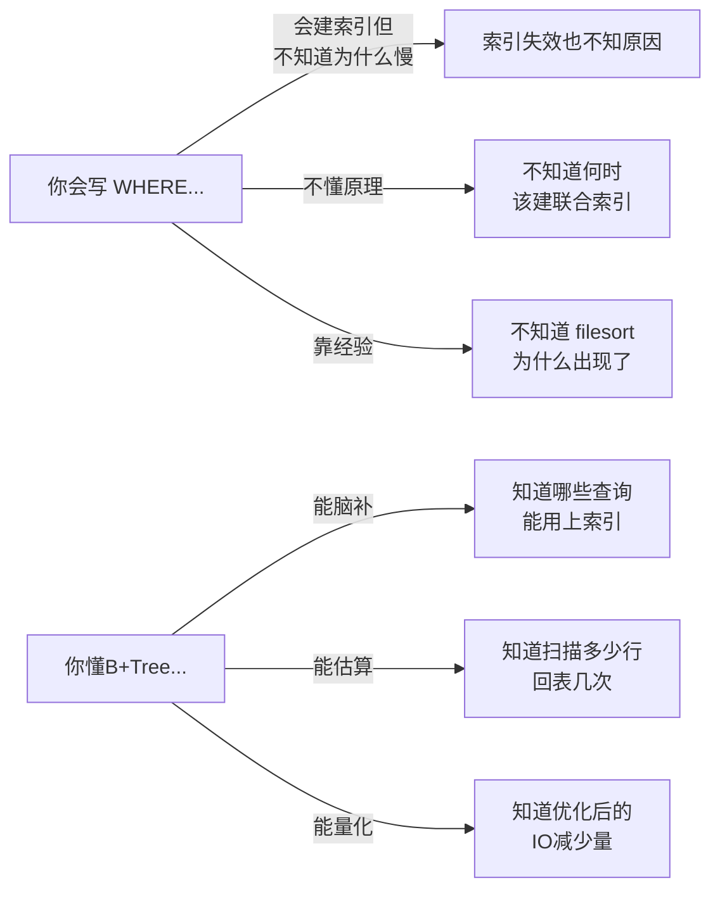
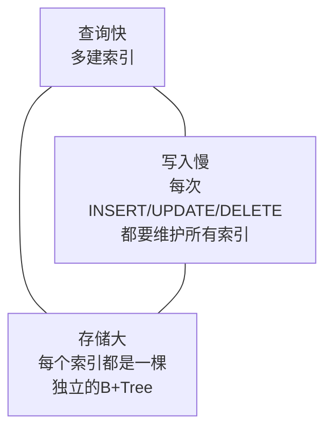
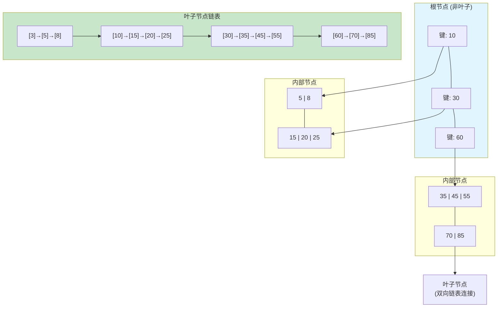
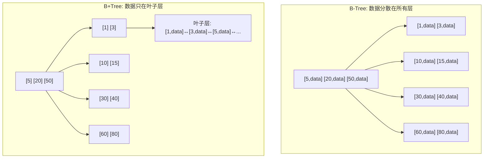
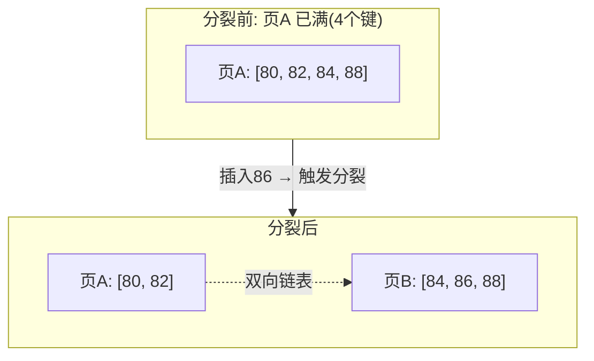
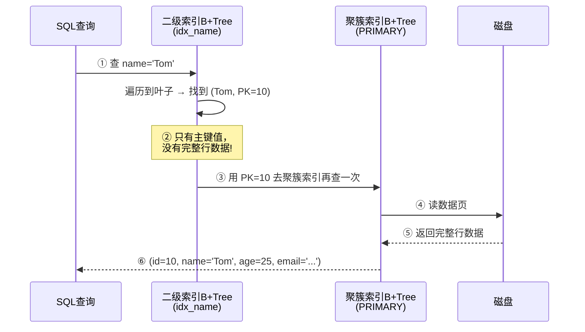
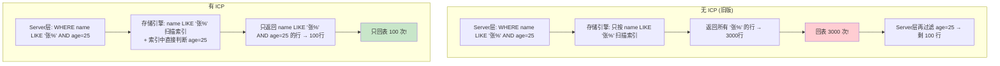
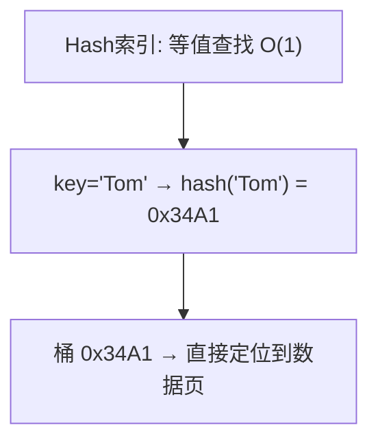
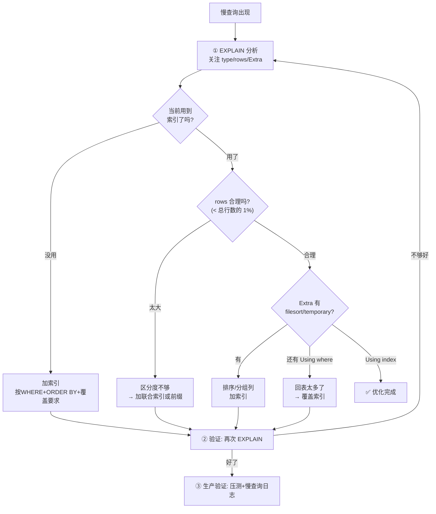
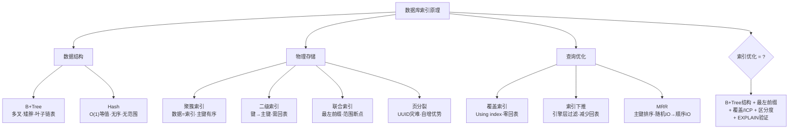

# 数据库索引底层原理

> B+Tree 为什么快、Hash索引怎么用、联合索引最左前缀、索引下推与索引失效

#### 目录介绍
- [01.工作案例引入](#01工作案例引入)
  - [1.1 慢查询拖垮订单](#11-一个慢查询差点拖垮订单系统)
  - [1.2 为何学索引原理](#12-为什么学了sql还要学索引原理)
- [02.什么是索引](#02什么是索引)
  - [2.1 索引的本质](#21-索引的本质)
  - [2.2 索引的三种类比](#22-索引的三种类比)
  - [2.3 索引核心权衡](#23-索引设计的核心权衡)
- [03.二分与二叉](#03二分查找与二叉搜索树)
  - [3.1 为什么数组不够用](#31-为什么数组不够用)
  - [3.2 二叉搜索树的退化](#32-二叉搜索树的退化)
  - [3.3 平衡二叉树的代价](#33-平衡二叉树的代价)
- [04.B+Tree深度解析](#04btree深度解析)
  - [4.1 B+Tree的结构](#41-btree的结构)
  - [4.2 B vs B+](#42-为什么是btree而不是b-tree)
  - [4.3 对比红黑树](#43-为什么比红黑树更适合磁盘)
  - [4.4 B+Tree的查找成本](#44-btree的查找成本)
  - [4.5 B+Tree的插入过程](#45-btree的插入过程)
  - [4.6 页分裂](#46-页分裂最贵的操作)
  - [4.7 删除与页合并](#47-btree的删除与页合并)
- [05.两种索引](#05聚簇索引与二级索引)
  - [5.1 聚簇索引](#51-聚簇索引数据即索引)
  - [5.2 二级索引](#52-二级索引需要回表)
  - [5.3 回表的代价量化](#53-回表的代价量化)
  - [5.4 自增主键](#54-为什么建议用自增主键)
- [06.联合索引](#06联合索引与最左前缀)
  - [6.1 联合索引结构](#61-联合索引的物理结构)
  - [6.2 最左前缀原理](#62-最左前缀原理)
  - [6.3 范围断点](#63-范围查询断点效应)
  - [6.4 字段顺序原则](#64-索引字段顺序的设计原则)
- [07.覆盖与下推](#07覆盖索引与索引下推)
  - [7.1 覆盖索引](#71-覆盖索引不回表的优化)
  - [7.2 索引下推ICP](#72-索引下推icp)
  - [7.3 MRR多范围读](#73-mrr多范围读)
- [08.Hash索引与自适应哈希](#08hash索引与自适应哈希)
  - [8.1 Hash速度](#81-hash索引的极致速度)
  - [8.2 Hash缺陷](#82-hash索引的致命缺陷)
  - [8.3 自适应Hash](#83-innodb自适应哈希索引)
- [09.索引失效](#09索引失效的十大场景)
  - [9.1 函数与运算](#91-函数与运算导致失效)
  - [9.2 隐式类型转换](#92-隐式类型转换)
  - [9.3 左模糊](#93-模糊查询左模糊)
  - [9.4 十大场景速查表](#94-十大场景速查表)
- [10.优化器如何选索引](#10优化器如何选索引)
  - [10.1 基数Cardinality](#101-基数cardinality)
  - [10.2 选错纠正](#102-优化器的选错与纠正)
  - [10.3 索引选择跟踪](#103-索引选择跟踪)
- [11.综合案例](#11综合案例订单表索引优化)
  - [11.1 场景与慢查询分析](#111-场景与慢查询分析)
  - [11.2 全流程优化实战](#112-全流程优化实战)
  - [11.3 索引优化方法论](#113-索引优化方法论)
  - [11.4 知识图谱回顾](#114-知识图谱回顾)
- [12.思考题与作业](#12思考题与作业)
  - [12.1 基础思考题](#121-基础思考题)
  - [12.2 进阶思考题](#122-进阶思考题)
  - [12.3 动手作业](#123-动手作业)


## 01.工作案例引入

### 1.1 慢查询拖垮订单

**场景**：小王是一家电商公司的后端开发。某天大促预热期间，运营同学反馈"订单列表页加载卡顿了"。小王打开监控一看——订单列表接口的 P99 延迟从平时的 50ms 飙升到 5s，数据库 CPU 打到 95%。

他赶紧登录数据库：

```sql
-- 查一下慢查询
SHOW FULL PROCESSLIST;
```

发现大量这条 SQL 堆积：

```sql
SELECT * FROM orders
WHERE user_id = 12345
  AND status = 'paid'
  AND create_time >= '2024-06-01'
ORDER BY create_time DESC;
```

小王一看表结构，已经有一个 `idx_user_id` 索引——怎么还这么慢？

```sql
EXPLAIN SELECT * FROM orders
WHERE user_id = 12345 AND status = 'paid'
  AND create_time >= '2024-06-01'
ORDER BY create_time DESC\G

-- 结果让小王震惊的 EXPLAIN 输出：
-- key: idx_user_id
-- rows: 356789           ← 扫描了 35 万行！
-- Extra: Using where; Using filesort  ← 还要额外排序
```

**疑惑链条**：

- "明明有索引，为什么扫描 35 万行？" → 因为 `idx_user_id` 只覆盖了 `user_id` 一个字段，`status` 和 `create_time` 的过滤都在**回表之后**才做
- "那为什么不用联合索引 `(user_id, status, create_time)`？" → 这就涉及到最左前缀原则——如果查询不带 `user_id`，这个联合索引就用不上
- "那再建一个 `(status, create_time)` 的索引行不行？" → 行是行，但要多维护一棵 B+Tree，写入代价翻倍
- "能不能不建索引也能不 filesort？" → 覆盖索引可以让查询直接从索引拿数据，但 `SELECT *` 要拿所有列，覆盖不了
- "为什么 `type=range` 但 `rows` 还是 35 万？" → 因为这个 `user_id` 下有 35 万笔已支付的订单——索引区分度不够

**小王最终的修复方案**：

```sql
-- 把单列索引替换为联合索引
ALTER TABLE orders DROP INDEX idx_user_id;
ALTER TABLE orders ADD INDEX idx_uid_status_time (user_id, status, create_time);

-- 改写查询：把 SELECT * 改成只查需要的列
SELECT order_id, user_id, amount, status, create_time
FROM orders
WHERE user_id = 12345
  AND status = 'paid'
  AND create_time >= '2024-06-01'
ORDER BY create_time DESC;
```

```sql
-- 新 EXPLAIN：
-- key: idx_uid_status_time
-- rows: 128               ← 从 35 万降到 128
-- Extra: Using index      ← 覆盖索引，不回表！
```

P99 从 5000ms → 15ms，数据库 CPU 从 95% → 8%。小王的老板拍拍他肩膀说"干得不错"，但小王知道——他只是"会用索引"，离"懂索引"还差得远。

### 1.2 为何学索引原理

小王这次事故的根本问题不是"不知道建索引"，而是**不知道索引到底是怎么工作的**。他用 `EXPLAIN` 看到了 `key` 和 `rows`，但看不懂这些数字背后 B+Tree 的物理结构、回表的 IO 代价、count 字段顺序的影响。



本章的目标，是把 MySQL InnoDB 的索引**拆开给你看**——B+Tree 的节点长什么样、页分裂的时候磁盘发生了什么、联合索引的最左前缀为什么不是"匹配任意子集"、`Using index` 和 `Using where` 的区别到底是什么。

读完之后，你不仅能用 `EXPLAIN` 分析慢查询，还能**在脑海中画出 B+Tree 的查找路径**，估算一次查询的 IO 次数。这就是"懂索引"的工程师和"会建索引"的工程师之间的本质区别。


## 02.什么是索引

### 2.1 索引的本质

**疑惑：数据库索引到底是什么？跟书的目录一样吗？**

**答疑**：是的——但"像目录"只是表象。从数据结构角度看，索引是一种**有序的数据结构**，它维护着"索引键 → 数据位置"的映射，让数据库可以**不扫描全表**就定位到目标行。

```
目录 vs 索引：
  书的目录: 章节名 → 页码         （一层映射）
  数据库索引: 索引键 → 数据页号    （通过 B+Tree 实现 O(log n) 查找）
```

**索引的本质定义**：

```
索引 = 一种能加速数据检索的有序数据结构
      ↓
      满足两个要求：
      ① 按索引键有序排列（支持二分/范围查找）
      ② 每个索引条目指向对应数据行的位置

在 InnoDB 中，这个数据结构就是 B+Tree。
```

### 2.2 索引的三种类比

| 类比 | 数据库概念 | 说明 |
|------|----------|------|
| 书的**目录** | 聚簇索引 | 按章节顺序排列，内容紧跟着目录 |
| 书的**索引表**（书末的术语索引） | 二级索引 | 按术语首字母排序，指向术语出现的页码 |
| 图书馆的**卡片目录** | B+Tree 非叶子节点 | 只有"书在哪"的描述，不存书本身 |

三种类比对应 B+Tree 的三个结构层次：
- **非叶子节点**（卡片目录）：只存索引键 + 子节点指针，没有任何行数据
- **叶子节点的索引记录**（书末索引）：存索引键 + 主键值，指向实际数据
- **叶子节点的数据记录**（书的正文）：存完整的行数据，按主键有序排列

### 2.3 索引核心权衡

**疑惑：为什么不给每一列都建上索引？多建几个索引不是更快吗？**

**答疑**：这就是索引的**"不可能三角"**——查询速度、写入速度、存储空间，三者不可兼得：



**量化代价**：

```
假设订单表 orders:
  10,000,000 行
  主键索引 (innodb): 约 600MB
  建一个 idx_user_id: 额外 ~200MB
  建 idx_status_create_time: 额外 ~250MB
  总计: 600MB + 200MB + 250MB = 1.05GB  → 比表本身还大！

每次 INSERT:
  不仅要插入数据行，还要在 2 棵 B+Tree 中各插入一条索引记录
  → 每次 INSERT 可能触发 2 次以上的页分裂
  → 写入吞吐量直接从 5000 QPS 降到 2000 QPS
```

**结论**：索引是**用写入性能和存储空间换查询性能**。加索引之前必须问自己——这个查询的调用频率足够高吗？省下来的查询时间值不值得付出的写入和存储代价？


## 03.二分与二叉

### 3.1 为什么数组不够用

**疑惑：数据库为什么不用有序数组做索引？二分查找 O(log n) 也很快啊。**

**答疑**：数组的二分查找确实 O(log n)，但**插入和删除是 O(n)**——中间插入一个元素，后面所有元素都要移位。数据库每秒几千次 INSERT，数组方案立刻崩溃：

```
有序数组:
  查找: O(log n) ✅
  插入: O(n)     ❌ 中间插入要移动半个数组
  删除: O(n)     ❌ 同上
  
  例: 1 亿行数据，插入一条 → 平均移动 5000 万行 → 几秒钟
```

**结论**：数据库需要的数据结构必须同时满足——查找快 + 插入快 + 范围查找快。这是评价所有索引结构的三个维度。

### 3.2 二叉搜索树的退化

二叉搜索树（BST）插入 O(log n)、查找 O(log n)，看上去完美。但有个致命缺陷——**在极端情况下会退化成链表**：

```
按主键 1→2→3→4→5 顺序插入 BST:
  1
   \
    2
     \
      3
       \
        4
         \
          5

查找 5: 需要比较 5 次 → O(n)
树的深度 = n → 100 万行数据 → 深度 100 万层 → 每次查找 100 万次磁盘 IO → 慢到不可用
```

**这就是为什么自增主键对应的 BST 会退化为链表！**——而数据库中绝大多数主键都是自增的。

### 3.3 平衡二叉树的代价

AVL 树 / 红黑树通过自平衡解决了退化问题（深度保持 O(log n)）。但**磁盘场景下仍然不够**：

```
红黑树: 1 亿行数据
  深度 ≈ log₂(1亿) ≈ 27 层
  每次查找最坏 27 次磁盘 IO
  每次 IO ~0.1ms(SSD) → 一次查找 2.7ms → 每秒只能查 370 次
  
  对数据库来说，这太慢了！
```

**探索性问题**：为什么内存中用红黑树（如 C++ `std::map`）没问题，但磁盘上不行？

```
内存 vs 磁盘的关键差异:
  内存访问: ~100ns, 每次比较开销可忽略 → 27 次比较 ≈ 0.0000027ms
  磁盘 IO:   ~100μs, 每次比较 = 一次磁盘读 → 27 次 IO ≈ 2.7ms
  → 差了 100 万倍！

所以: 内存中"比较开销"是瓶颈 → 优化比较次数 → 二叉树就够了
     磁盘中"IO次数"是瓶颈       → 必须让每个节点存更多数据 → 降低树高度
     → B+Tree 登场！
```


## 04.B+Tree深度解析

### 4.1 B+Tree的结构

B+Tree 的核心思想是：**让每个节点存储 N 个键 + N+1 个指针（多叉），用"矮胖"的树代替"瘦高"的二叉树，从而大幅减少磁盘 IO 次数。**



**InnoDB B+Tree 的关键参数**：

```
每个节点 = 一个磁盘页 (默认 16KB)

非叶子节点 (内部节点):
  每条记录 = 索引键(如 4B 的 INT) + 子节点页号(4B) = 8B
  一个 16KB 页能存 ≈ 16KB / 8B ≈ 2000 条记录
  → 一个非叶子节点可以指向 2000 个子节点

叶子节点:
  每条记录 = 索引键 + 主键值(二级索引) 或 完整行数据(聚簇索引)
  单个页能存几十到几百条记录
```

**这棵 B+Tree 的查找能力**：

```
高度=1: 根节点即叶子 → 最多 2000 行
高度=2: 根 → 2000 个子节点 → 2000 × 2000 = 4,000,000 行
高度=3: 400 万 × 2000 = 80 亿行

结论: 一张亿级表，B+Tree 高度只需要 3 层！
      每次查找只需 3 次磁盘 IO（如果根节点常驻 Buffer Pool，只要 2 次）
```

### 4.2 B vs B+

**疑惑：B-Tree 和 B+Tree 到底差在哪？为什么 MySQL 选了 B+Tree？**

B-Tree 的每个节点（叶子 + 非叶子）都存数据；B+Tree 只有叶子节点存数据，非叶子节点只存索引键：



| 维度 | B-Tree | B+Tree |
|------|--------|--------|
| 数据存储位置 | **所有节点都存数据** | 只有**叶子节点**存数据 |
| 非叶子节点容量 | 小（被数据占据空间） | **大**（只存键+指针）→ 扇出更高 → 树更矮 |
| 范围查询 | 需中序遍历（来回跳） | **叶子节点有双向链表** → 顺序扫描即可 |
| 查询稳定性 | 不稳定（可能根节点就命中） | **稳定**（每次都到叶子） |
| 磁盘IO | 非叶子也可能有数据要读 | 非叶子只做路由 → **IO 更少** |

**B+Tree 的胜出逻辑**：

```
1. 扇出更高 → 树更矮 → IO 更少
   B-Tree 非叶子也存 data → 同样 16KB 页，存的键更少 → 扇出低 → 树更高

2. 范围查询是 O(1) 访问叶子链表
   SELECT * FROM t WHERE id BETWEEN 100 AND 200;
   B+Tree: 找到 id=100 的叶子 → 沿链表向右扫 100 条 → 完成
   B-Tree: 需要中序遍历 → 在各层之间跳来跳去 → 更多随机 IO

3. 查询成本可预测
   B+Tree 每次查询都到叶子 → IO 次数 = 树高度（固定）
   B-Tree 可能第 1 层就命中 → 但优化器无法预判 → 执行计划不稳定
```

### 4.3 对比红黑树

回到 3.3 节的量化分析——**磁盘场景下，多叉 = 更少的 IO**：

```
数据量: 1 亿行, 索引键 4B (INT), 指针 4B

红黑树:
  深度 ≈ log₂(1亿) ≈ 27 层
  搜索次数: 平均 ~27 次随机 IO
  每次 IO: 0.1ms (SSD)
  一次查找耗时: 27 × 0.1ms = 2.7ms

B+Tree (InnoDB, 16KB 页, 非叶子节点 2000 个键):
  深度 ≈ log₂₀₀₀(1亿) ≈ log(1亿)/log(2000) ≈ 8/3.3 ≈ 2.4 → 3 层
  搜索次数: 2-3 次 IO (根节点常驻 Buffer Pool → 1-2 次)
  一次查找耗时: 2 × 0.1ms = 0.2ms

性能差距: 2.7ms / 0.2ms ≈ 13.5 倍!
```

**探索性问题**：如果把页大小从 16KB 改成 64KB，树会更矮吗？代价是什么？

```
页大小 64KB → 每页存的键更多(8000个) → 树高度从3降到2
→ 理论 IO 从 3 次降到 2 次 → 快了 33%

但代价:
  1. 每次读整页 64KB → 即使只需要 1 行数据也要读 64KB
  2. 页分裂时写入量翻 4 倍 (16KB→64KB)
  3. Buffer Pool 利用率降低 → 同样 128MB Buffer Pool 能缓存的页数从 8000 降到 2000
  → 整体命中率下降 → 反而可能更慢

InnoDB 的 16KB 是在"单次 IO 粒度"和"缓存利用率"之间的最优平衡点。
```

### 4.4 B+Tree的查找成本

用一次 **等值查找** 量化 B+Tree 的磁盘 IO：

```
查询: SELECT * FROM t WHERE id = 98765;

假设 B+Tree 高度=3（根在内存, 内部+叶子在磁盘）:

Step 1: 查根节点 → 在 Buffer Pool 中 (0 次磁盘 IO)
  根节点键范围 [1, 50000, 100000]
  98765 在 50000 和 100000 之间 → 去第 2 个子节点页 (页号 1234)

Step 2: 读页号 1234 → 1 次磁盘 IO (如不在 Buffer Pool)
  内部节点键 [60000, 80000, 95000]
  98765 > 95000 → 去第 4 个子节点页 (页号 5678)

Step 3: 读页号 5678 → 1 次磁盘 IO
  叶子节点键 [95001, ..., 99000, ...]
  二分查找定位 98765 → 拿到完整行数据

总 IO: 2 次 (根在内存)
```

**范围查找的成本**：

```
查询: SELECT * FROM t WHERE id BETWEEN 98765 AND 98800;

Step 1-3: 同上面，定位到 98765 → 2 次 IO
Step 4: 叶子节点是双向链表 → 直接向右扫描
  大概率 98765-98800 在同一页 → 0 次额外 IO
  如果跨页了 → 链表指针指向下一个叶子页 → +1 次 IO

总 IO: 2-3 次
```

### 4.5 B+Tree的插入过程

**疑惑：插入一条数据时，B+Tree 内部发生了什么？**

以插入 `id=86` 到一棵高度为 2 的 B+Tree 为例：

```
插入前 (阶=4, 即每个节点最多4个键):
  根节点: [20, 50, 80]
   ├─ 叶子1: [3, 10, 15]
   ├─ 叶子2: [25, 35, 45]
   ├─ 叶子3: [55, 65, 75]
   └─ 叶子4: [82, 84, 88]  ← 已有3个键 (最多4个，还能放)

插入 86:
  Step 1: 从根开始: 86 > 80 → 去叶子4
  Step 2: 叶子4 做二分查找: 86 在 84 和 88 之间
  Step 3: 叶子4 仍有空间 → 插入 [82, 84, 86, 88]
  
  磁盘操作:
    读取根节点 (Buffer Pool 命中 → 0 IO)
    读取叶子4 (可能不在 Buffer Pool → 1 IO)
    写入叶子4 (标记脏页 → 异步写回 → 计 1 次逻辑IO)
  
  如果叶子4恰好满了（4个键都占满）→ 触发页分裂！
```

### 4.6 页分裂

**疑惑：为什么用 UUID 做主键比自增 ID 慢那么多？**

**答疑**：根源在于**页分裂（Page Split）**。

当叶子节点满了还要插入新数据时，InnoDB 必须申请一个新页，把原页一半的数据挪过去：



**页分裂的成本**：

```
一次页分裂的完整操作:
  1. 申请新页 (空闲页链表 → 1 IO)
  2. 把原页一半数据复制到新页 (内存拷贝, ~8KB → 极快)
  3. 更新原页和新页的链表指针 (原页→新页→原next页)
  4. 在父节点插入新页的索引条目 → 可能触发父节点分裂
     → 如果父节点也满了 → 递归分裂 → 最坏一直裂到根节点！
  
  最小代价: 2 次 IO (新页写入 + 原页标记脏)
  最坏代价: 如果裂到根 → 整棵树高度+1 → 多级分裂 → 10+ 次 IO

自增主键 vs UUID 主键:
  自增ID: 插入总是在最后 → 新页追加 → 极少分裂
  UUID:   插入位置随机 → 每个页都可能被插满 → 频繁分裂
           → 写入慢 2-3 倍, 碎片率高 10 倍
```

**探索：为什么自增主键可能导致热点页竞争？**

```
自增主键的"最后页"是热点:
  所有 INSERT 都往最后一个叶子页写
  → 高并发下，多个线程争抢同一个页的锁
  → 产生锁等待

雪花算法 (Snowflake ID):
  趋势递增但非严格单调 → 高并发插入分散在不同页
  → 减少热点竞争，但仍有随机插入带来的轻微分裂

选择取决于场景:
  写多读少 → 雪花ID (减少热点)
  读多写少 → 自增ID (页更紧凑、缓存友好)
```

### 4.7 删除与页合并

删除一条数据时，B+Tree 只是**标记为删除**（逻辑删除），空间暂不归还。只有当**页的填充率低于阈值（MERGE_THRESHOLD, 默认 50%）** 时，InnoDB 才会尝试把该页与相邻页合并：

```
页合并的触发条件:
  页A 有效数据 < 页大小 × 50%
  检查相邻页B:
    if 页A填充率 + 页B填充率 > 100% → 只做"平衡"(挪一部分数据到页A)
    if 页A填充率 + 页B填充率 ≤ 100% → 合并为一页 → 释放一页
```

`optimize table` 强制重构表，回收碎片空间。


## 05.两种索引

### 5.1 聚簇索引

InnoDB 的聚簇索引（Clustered Index）**将数据和索引合二为一**——叶子节点直接存储完整行数据，按主键有序排列：

```
InnoDB 聚簇索引叶子节点的物理存储:
  Page 1: [PK=1 | col1=xxx | col2=xxx | ...]
          [PK=3 | col1=yyy | col2=yyy | ...]
          [PK=5 | col1=zzz | col2=zzz | ...]
  
  Page 2: [PK=8 | col1=...]
          [PK=12 | col1=...]
          ...
  
  Page N: [PK=9999997 | ...]
          [PK=9999999 | ...]
```

**关键结论**：
- 每个 InnoDB 表**有且只有一个**聚簇索引
- 如果表有主键 → 主键就是聚簇索引
- 如果没有主键 → 找第一个 NOT NULL UNIQUE 索引
- 如果都没有 → InnoDB 自动生成一个隐藏的 6 字节 `row_id`

### 5.2 二级索引

**疑惑：二级索引（非聚簇索引）和聚簇索引有什么区别？**

二级索引的叶子节点存的不是完整行数据，而是**索引键 + 主键值**：

```
聚簇索引叶子: [PK=10] → (id=10, name='Tom', age=25, email='...')
二级索引叶子: [name='Tom'] → (name='Tom', PK=10)
                                         ↑ 只有主键值！
```

**通过二级索引查找的完整流程（回表）**：



这个"拿着主键值再去聚簇索引查一次"的过程就叫**回表**——是二级索引查询不可避免的额外开销。

### 5.3 回表的代价量化

```
一次二级索引等值查询的 IO 成本:

  二级索引 B+Tree 查找: 2-3 次 IO
      ↓ 拿到主键值
  聚簇索引 B+Tree 查找: 2-3 次 IO
      ↓ 拿到完整行
  ──────────────────
  总计: 4-6 次 IO

对比: 直接主键查询只需 2-3 次 IO
回表让 IO 增加近一倍!
```

**这就是为什么 `SELECT *` 在走二级索引时特别昂贵**——每一行都要回表一次。如果查询返回 10000 行，就是 10000 次额外的随机 IO。

### 5.4 自增主键

回到 4.6 节的问题——自增主键不仅减少页分裂，还让**聚簇索引的叶子节点按追加顺序排列**：

```
自增 ID (BIGINT AUTO_INCREMENT):
  写入顺序: 1→2→3→4→5→6→...
  叶子页:   紧密排列, 几乎没有空洞
  磁盘占用: 最小
  Buffer Pool 利用率: 最高 (一页可以装最多行)

UUID (CHAR(36)):
  写入顺序: 随机
  叶子页:   大量页分裂 + 空洞(填充率 50-75%)
  磁盘占用: 2-3倍
  Buffer Pool 利用率: 低 (同样的内存能缓存的活跃行更少)
```

**探索性问题**：分布式环境下，自增 ID 的瓶颈在哪？

```
单机自增 ID: AUTO_INCREMENT 锁 → 高并发插入竞争
分布式自增 ID: 需要全局发号器 → 雪花算法(趋势递增) 或 Leaf-segment
  
趋势递增 (雪花算法):
  INSERT 大部分追加在最后 → 页分裂少
  但不如纯自增紧凑 → 中间可能有少量"插队"
  → 仍然比 UUID 好得多
```


## 06.联合索引

### 6.1 联合索引结构

**疑惑：联合索引 `(a, b, c)` 在 B+Tree 里是怎么排列的？**

联合索引的排序规则是**按字段顺序依次比较**——先按 `a` 排序，`a` 相同再按 `b`，`b` 相同再按 `c`：

```
联合索引 idx_abc (a, b, c) 的叶子节点排序:
  (1, 2, 5)
  (1, 3, 1)   ← a相同(1), 按b排序: 2<3
  (1, 3, 4)   ← a相同(1), b相同(3), 按c排序: 1<4
  (2, 1, 3)   ← a不同(1→2)
  (2, 1, 7)   ← a相同(2), b相同(1), 按c排序: 3<7
  (2, 4, 2)
  (3, 1, 1)

物理上: 一维存储，但逻辑上像一个多级目录:
  a=1 → b=2 → c=5
  a=1 → b=3 → c=1, 4
  a=2 → b=1 → c=3, 7
  a=2 → b=4 → c=2
```

### 6.2 最左前缀原理

联合索引能加速查询的前提——**查询条件必须匹配索引的最左前缀**。换言之，索引 (a, b, c) 相当于创建了三个索引：

```mermaid
flowchart TB
    IDX[(联合索引<br/>idx_abc<br/>(a, b, c))]
    IDX --> A["能用: ① (a)<br/>先按a有序 → 二分查找a=5"]
    IDX --> B["能用: ② (a, b)<br/>a相同时按b有序 → 先二分a=5, 再二分b=3"]
    IDX --> C["能用: ③ (a, b, c)<br/>三个字段都有序 → 精确匹配"]
    
    IDX -.-> D["不能用: (b) 或 (c)<br/>在整体B+Tree中, b不连续!<br/>(1,3,1)→(1,3,4)→(2,1,3)<br/>b的值跳来跳去, 没法二分"]
    IDX -.-> E["不能用: (b, c)<br/>同理, (b,c) 每个组合<br/>分散在 B+Tree 各处"]
```

**最左前缀的精确定义**：

```
idx(a, b, c) 支持:
  ✅ WHERE a = 1
  ✅ WHERE a = 1 AND b = 2
  ✅ WHERE a = 1 AND b = 2 AND c = 3
  ✅ WHERE a = 1 AND c = 3         ← 能用a这一部分, c用不上(跳过了b)
  ✅ WHERE a > 1 AND b = 2         ← a范围能定位, b精确匹配也能用

idx(a, b, c) 不支持:
  ❌ WHERE b = 2                    ← 没有a, b全局无序
  ❌ WHERE c = 3                    ← 没有a, c全局无序
  ❌ WHERE b = 2 AND c = 3         ← 没有a
```

### 6.3 范围断点

**疑惑：`WHERE a = 1 AND b > 2 AND c = 3`——c 能用上索引吗？**

**答疑**：**不能**。这是最左前缀最容易被忽视的陷阱——范围查询右边的列全部失效：

```
idx(a, b, c), WHERE a=1 AND b>2 AND c=3

查找过程:
  1. 二分定位 a=1 的起始位置  ✅ 用上了
  2. b>2 → 从 b=2 之后开始扫描  ✅ 用上了
  3. c=3 → 在这段范围扫描中逐条检查  ❌ 用不上索引!

为什么c=3用不上?
  在 B+Tree 中, a=1 且 b>2 的所有行按 b 有序排列:
    (1, 3, 100), (1, 3, 7), (1, 4, 3), (1, 4, 8), (1, 5, 3), ...
                               ↑ c 的值无序! 3→8→3 跳来跳去
  → 没法用二分查找 c=3, 只能逐条扫描
```

**范围查询的等价写法比较**：

```sql
-- 写法1: c 用不上 (b 是范围)
WHERE a = 1 AND b > 2 AND c = 3

-- 写法2: 改成等值 + 排序, c 就能用上了
WHERE a = 1 AND b >= 3 AND c = 3
UNION ALL
WHERE a = 1 AND b > 3 AND c = 3
-- 实际中很少这样写, 但原理上可以
```

### 6.4 字段顺序原则

按**区分度从高到低**排列字段——把 `=` 条件的字段放前面、范围条件的放最后：

```
查询: WHERE user_id = ? AND status = ? AND create_time > ?

方案A: idx(status, user_id, create_time)
  → status 区分度低 (paid/unpaid/cancel, 3 种)
  → 第一步过滤: 全表 33% → 效果差

方案B: idx(user_id, status, create_time)    ← ✅ 推荐
  → user_id 区分度极高 (几乎唯一)
  → 第一步过滤就能定位到极少数行
  → status 进一步过滤
  → create_time 范围扫描

"等值在前，范围在后，区分度高的在前"
```


## 07.覆盖与下推

### 7.1 覆盖索引

**覆盖索引（Covering Index）**：查询的所有列都在索引中，不需要回表。这是二级索引性能的天花板。

```sql
-- 有索引 idx_user_status (user_id, status, amount)

-- 使用覆盖索引 ✅
SELECT user_id, status, amount
FROM orders
WHERE user_id = 12345 AND status = 'paid';
-- EXPLAIN Extra: Using index
-- → 只在二级索引B+Tree的叶子节点就能拿到所有需要的列
-- → 0 次回表, 只需要 2-3 次 IO

-- 未覆盖 ❌
SELECT user_id, status, amount, create_time
FROM orders
WHERE user_id = 12345 AND status = 'paid';
-- create_time 不在索引中 → 必须回表
-- → 每一行多一次聚簇索引查找 → IO 翻倍
```

**覆盖索引 vs 回表——性能差异**：

```
1000 行查询:
  覆盖索引: 二级索引扫描 (50-100μs)
  回表查询: 二级索引扫描 + 1000 次随机 IO (10-50ms)
  → 差 100-500 倍
```

### 7.2 索引下推ICP

**索引条件下推（Index Condition Pushdown, ICP）**：MySQL 5.6 引入的优化——把 WHERE 中的部分过滤条件下推到存储引擎层，在**索引遍历时**就过滤，减少回表次数：



```sql
-- ICP 生效的 EXPLAIN
-- Extra: Using index condition
-- 含义: 存储引擎层过滤了一部分条件，减少了回表
```

### 7.3 MRR多范围读

**MRR（Multi-Range Read）**：把二级索引查到的**随机的主键值先排序**，再按主键顺序回表——把随机 IO 变成顺序 IO：

```
无 MRR:
  二级索引查到的主键: [999, 12, 5000, 45, 3000, 78]
  回表顺序: 999→12→5000→45→3000→78  ← 随机IO, 磁盘寻道多

有 MRR:
  排序后: [12, 45, 78, 999, 3000, 5000]
  回表顺序: 12→45→78→999→3000→5000  ← 顺序IO, 磁盘只转一圈
```

MRR 对 SSD 的提升不如 HDD 明显（SSD 没有寻道时间），但仍能减少 IO 次数（相邻主键可能在同一页）。


## 08.Hash索引与自适应哈希

### 8.1 Hash速度

**疑惑：为什么 MySQL 不默认用 Hash 索引？等值查找 O(1) 不比 B+Tree O(log n) 快吗？**

Hash 索引确实快——等值查找只需要**一次**哈希计算 + 一次磁盘 IO（如果不在内存），理论上比 B+Tree 的 2-3 次 IO 更快。



**Memory 引擎默认使用 Hash 索引**——因为 Memory 引擎的数据在内存中，不需要考虑范围查询和持久化。

### 8.2 Hash缺陷

| 缺陷 | 具体表现 | 说明 |
|------|---------|------|
| 不支持范围查询 | `WHERE id > 10` 全表扫描 | Hash 函数把数据打散，相邻键的 Hash 值天差地别 |
| 不支持排序 | `ORDER BY name` 需额外排序 | Hash 表无序 |
| 哈希冲突 | 大量冲突 → 退化为链表 O(n) | 需要设计好的哈希函数 |
| 不支持部分匹配 | `LIKE 'Tom%'` 无法利用索引 | 哈希函数对 "Tom" 和 "Tommy" 产生完全不同的值 |
| 不支持联合索引最左前缀 | `(a,b)` 的 Hash 索引不能单独查 `a` | 哈希函数对 `(1,2)` 和 `(1,3)` 完全不同 |

### 8.3 自适应Hash

InnoDB 没有 Hash 索引，但有一个**自适应哈希索引（Adaptive Hash Index, AHI）**——自动在 Buffer Pool 中为**频繁访问的索引页**建立哈希表，加速等值查找：

```
AHI 的工作原理:
  InnoDB 监控 B+Tree 索引页的访问模式
  如果发现某页被频繁等值查询 → 自动为该页建 Hash 索引
  Hash 索引存在 Buffer Pool 中 → 重启后重建

AHI 的触发条件:
  - 同一个索引页被连续访问 N 次(N=16)
  - 访问模式 = 等值查询(非范围)

查看 AHI 状态:
SHOW ENGINE INNODB STATUS\G
  -- 搜索 "INSERT BUFFER AND ADAPTIVE HASH INDEX"
  -- Hash table size, node heap, 命中率
```

**AHI 的局限**：只对**热点页的等值查询**有效，范围查询、冷数据、写入密集型场景反而可能因为维护哈希表而拖慢性能。


## 09.索引失效

### 9.1 函数与运算

**对索引列使用函数或表达式 → 索引失效**。因为 B+Tree 存的是原始值，不是函数结果：

```sql
-- ❌ 索引失效: 对列使用函数
SELECT * FROM orders WHERE DATE(create_time) = '2024-06-01';
-- 优化器不知道怎么把 DATE(create_time) 映射到 B+Tree 的 create_time 值

-- ✅ 正确写法: 函数放等号右边
SELECT * FROM orders WHERE create_time >= '2024-06-01' AND create_time < '2024-06-02';
```

```sql
-- ❌ 索引失效: 对列做运算
SELECT * FROM orders WHERE amount + 10 > 100;
-- amount = 91 能满足 (91+10=101>100), 但优化器无法反推

-- ✅ 正确写法
SELECT * FROM orders WHERE amount > 90;
```

### 9.2 隐式类型转换

**字符串索引列与数字比较 → 索引失效**：

```sql
-- phone 列是 VARCHAR, 有索引 idx_phone

-- ❌ 索引失效: 隐式转换
SELECT * FROM users WHERE phone = 13800138000;
-- MySQL 会把 phone 的每个值 CAST 为数字再比较 → 相当于对列使用函数

-- ✅ 正确写法
SELECT * FROM users WHERE phone = '13800138000';
```

同样，**字符集不一致的 JOIN** 也会导致隐式转换 → 索引失效。

### 9.3 左模糊

```sql
-- ❌ 索引失效: % 在左边
SELECT * FROM users WHERE name LIKE '%Tom';

-- ✅ 索引可用: % 在右边 (范围扫描)
SELECT * FROM users WHERE name LIKE 'Tom%';

-- 为什么? B+Tree 按字符串字典序排列
-- 知道前缀 'Tom' → 可以二分定位到 Tom* 范围
-- 不知道前缀 → 全树都是候选 → 只能全表扫描
```

### 9.4 十大场景速查表

| # | 场景 | 示例 | 原因 |
|---|------|------|------|
| 1 | 对列使用函数 | `WHERE DATE(create_time) = ...` | 函数破坏了索引值的有序性 |
| 2 | 对列做运算 | `WHERE amount + 10 > 100` | 优化器无法反推 |
| 3 | 隐式类型转换 | `WHERE varchar_col = 123` | 内部 CAST 相当于对列用函数 |
| 4 | 左模糊/全模糊 | `WHERE name LIKE '%Tom'` | 不知道前缀，无法二分 |
| 5 | `!=` / `NOT IN` | `WHERE status != 'paid'` | 不等值无法利用有序性 |
| 6 | `IS NULL` / `IS NOT NULL` | 索引列含大量 NULL | 索引不存 NULL（部分场景下） |
| 7 | OR 非索引列 | `WHERE a=1 OR b=2` (b 无索引) | OR 的一边没索引 → 全表扫描 |
| 8 | 联合索引最左缺失 | `WHERE b=2` (idx 是 (a,b)) | b 全局无序 |
| 9 | 范围查询右边的列 | `WHERE a=1 AND b>2 AND c=3` | c 在 b 不同的区间内无序 |
| 10 | `ORDER BY` 与索引不匹配 | `WHERE a=1 ORDER BY c` (idx(a,b)) | 跳过了 b, c 无序 |

```sql
-- 快速检查索引是否生效
EXPLAIN SELECT ...;
-- 关注:
--   type:  ALL  = 全表扫描（索引完全没用到）
--   key:   NULL = 没用任何索引
--   Extra: Using where; Using filesort = 需要额外排序
```


## 10.优化器如何选索引

### 10.1 基数Cardinality

优化器根据**基数（Cardinality）**——索引列上不同值的个数——评估一个索引的"好坏"：

```sql
SHOW INDEX FROM orders;
-- +-------+------------+----------+--------------+-------------+-----------+...
-- | Table | Non_unique | Key_name | Seq_in_index | Column_name | Cardinality|...
-- +-------+------------+----------+--------------+-------------+-----------+...
-- | orders|          1 | idx_uid  |            1 | user_id     |     100000 |
-- | orders|          1 | idx_st   |            1 | status      |          3 |
```

Cardinality 越大 → 区分度越高 → 索引越好。`status` 只有 3 个值（paid/unpaid/cancel）→ 优化器可能直接选择全表扫描。

```
估算扫描行数 = 总行数 / Cardinality

orders 表 10,000,000 行:
  WHERE user_id = 12345:
     估算: 10,000,000 / 100,000 = 100 行 → 用 idx_uid ✅
  
  WHERE status = 'paid':
     估算: 10,000,000 / 3 = 3,333,333 行 → 全表扫描可能更快 ❌
```

### 10.2 选错纠正

**疑惑：明明建了索引，EXPLAIN 却显示全表扫描——为什么优化器"不听话"？**

优化器基于**代价估算**选择索引。如果估算的扫描行数超过总行数的某个比例（~20-30%），优化器会认为回表代价太高，不如直接全表扫描：

```sql
-- 强制使用某个索引
SELECT * FROM orders FORCE INDEX(idx_user_id) WHERE user_id = 12345;

-- 忽略某个索引
SELECT * FROM orders IGNORE INDEX(idx_status) WHERE ...;

-- 更优雅的方式: 通过 ANALYZE TABLE 更新统计信息
ANALYZE TABLE orders;
-- 刷新 Cardinality → 让优化器做出更准确的估算
```

### 10.3 索引选择跟踪

```sql
-- 查看优化器为什么选/不选某个索引
SET optimizer_trace='enabled=on';
SELECT * FROM orders WHERE user_id = 12345 AND status = 'paid';
SELECT * FROM information_schema.OPTIMIZER_TRACE\G

-- 输出会显示:
-- "considered_execution_plans": [
--   { "plan_prefix": [], "table": "orders",
--     "best_access_path": { "considered_access_paths": [
--       { "access_type": "ref", "index": "idx_user_id", "rows": 100, "cost": 123 },
--       { "access_type": "ref", "index": "idx_status",  "rows": 3000000, "cost": 4000000 }
--     ]}
--   }
-- ]
-- 结论: idx_user_id cost=123 << idx_status cost=4000000 → 选 idx_user_id
```


## 11.综合案例

### 11.1 场景与慢查询分析

回到 1.1 节小王的订单表，进行一次完整的索引优化演练：

```sql
-- 表结构
CREATE TABLE orders (
    id BIGINT PRIMARY KEY AUTO_INCREMENT,
    user_id BIGINT NOT NULL,
    status VARCHAR(20) NOT NULL,       -- 'unpaid','paid','shipped','cancel'
    amount DECIMAL(10,2) NOT NULL,
    product_name VARCHAR(200),
    create_time DATETIME NOT NULL,
    update_time DATETIME,
    INDEX idx_user_id (user_id),
    INDEX idx_status (status),
    INDEX idx_create_time (create_time)
) ENGINE=InnoDB DEFAULT CHARSET=utf8mb4;

-- 数据量: 10,000,000 行
```

**五个典型查询的 EXPLAIN 结果**：

```sql
-- Q1: 用户查自己的订单
EXPLAIN SELECT * FROM orders WHERE user_id = 12345;
-- key: idx_user_id | rows: 128 | Extra: NULL  ← 还行

-- Q2: 用户查自己的已支付订单
EXPLAIN SELECT * FROM orders WHERE user_id = 12345 AND status = 'paid';
-- key: idx_user_id | rows: 128 | Extra: Using where  ← 128行回表后才过滤status

-- Q3: 用户查自己最近的已支付订单
EXPLAIN SELECT * FROM orders WHERE user_id = 12345
  AND status = 'paid' AND create_time >= '2024-06-01' ORDER BY create_time DESC;
-- key: idx_user_id | rows: 356789 | Extra: Using where; Using filesort  ← 致命！

-- Q4: 后台统计某天所有已支付订单
EXPLAIN SELECT COUNT(*) FROM orders WHERE status = 'paid'
  AND create_time >= '2024-06-01' AND create_time < '2024-06-02';
-- key: idx_status | rows: 5000000 | Extra: Using where  ← 全表一半！

-- Q5: 后台统计某天各状态的订单数
EXPLAIN SELECT status, COUNT(*) FROM orders
WHERE create_time >= '2024-06-01' AND create_time < '2024-06-02'
GROUP BY status;
-- key: idx_create_time | rows: 50000 | Extra: Using where; Using temporary; Using filesort
```

### 11.2 全流程优化实战

**Step 1：分析核心查询，确定联合索引**

```
高频查询:
  Q1: WHERE user_id = ?                                                   → 需要 (user_id)
  Q2: WHERE user_id = ? AND status = ?                                    → 需要 (user_id, status)
  Q3: WHERE user_id = ? AND status = ? AND create_time >= ? ORDER BY create_time → 需要 (user_id, status, create_time)

低频查询:
  Q4: WHERE status = ? AND create_time BETWEEN ...                        → 单独索引 (status, create_time)
  Q5: WHERE create_time BETWEEN ... GROUP BY status → 创建时间范围 + 分组
```

**Step 2：设计索引**

```sql
-- 用联合索引替代多个单列索引
ALTER TABLE orders DROP INDEX idx_user_id;
ALTER TABLE orders DROP INDEX idx_status;
ALTER TABLE orders DROP INDEX idx_create_time;

-- 核心索引: 覆盖 Q1-Q3
ALTER TABLE orders ADD INDEX idx_uid_st_ct (user_id, status, create_time);

-- 辅助索引: 覆盖 Q4-Q5 (后台统计)
ALTER TABLE orders ADD INDEX idx_st_ct (status, create_time);
```

**Step 3：验证优化效果**

```sql
-- Q1: 用户查自己的订单
EXPLAIN SELECT * FROM orders WHERE user_id = 12345;
-- key: idx_uid_st_ct | rows: 128 | Extra: NULL ✅

-- Q2: 用户查自己已支付
EXPLAIN SELECT * FROM orders WHERE user_id = 12345 AND status = 'paid';
-- key: idx_uid_st_ct | rows: 85 | Extra: NULL ✅ (rows 从 128 → 85)

-- Q3: 用户查自己最近的已支付 (修改了查询)
EXPLAIN SELECT order_id, user_id, amount, status, create_time
FROM orders
WHERE user_id = 12345 AND status = 'paid' AND create_time >= '2024-06-01'
ORDER BY create_time DESC;
-- key: idx_uid_st_ct | rows: 128 | Extra: Using index ✅✅✅
-- rows 从 356789 → 128, Extra 从 Using where; Using filesort → Using index!

-- Q4: 后台统计某天已支付
EXPLAIN SELECT COUNT(*) FROM orders WHERE status = 'paid'
  AND create_time >= '2024-06-01' AND create_time < '2024-06-02';
-- key: idx_st_ct | rows: 50000 | Extra: Using index ✅
-- rows 从 5,000,000 → 50,000

-- Q5: 后台统计各状态订单数 (回表不可避免，但缩小了范围)
EXPLAIN SELECT status, COUNT(*) FROM orders
WHERE create_time >= '2024-06-01' AND create_time < '2024-06-02'
GROUP BY status;
-- 这个仍然需要 idx_st_ct → 创建时间范围扫描 + 回表 + 分组
-- 如果这个查询特别频繁 → 考虑增加覆盖字段或使用汇总表
```

**Step 4：压测对比**

```
改造前:
  Q1: 5ms
  Q2: 12ms
  Q3: 5000ms (慢查询!)
  Q4: 30000ms (慢查询!)
  Q5: 8000ms

改造后:
  Q1: 2ms       (↓ 60%)
  Q2: 3ms       (↓ 75%)
  Q3: 15ms      (↓ 99.7%, 从5秒→15毫秒!)
  Q4: 200ms     (↓ 99.3%)
  Q5: 500ms     (↓ 93.8%)
```

### 11.3 索引优化方法论

从这次优化中提炼出的通用流程：



**五条铁律**：

1. **EXPLAIN 先行**：改索引前先看当前执行计划
2. **等值在前，范围在后**：联合索引的字段顺序
3. **覆盖优先**：高频查询尽量设计成覆盖索引
4. **区分度筛选**：Cardinality 低的列不单独建索引
5. **定期分析**：`ANALYZE TABLE` 保持统计信息新鲜

### 11.4 知识图谱回顾



**最终方法论——分析任何慢查询的 EXPAIN 三步法**：

1. **看 type**：`ALL`=全表扫描（不可接受），`index`=全索引扫描（大表不可接受），尽量到 `ref`/`range`/`const`
2. **看 rows**：估算扫描行数占总行数的比例，>5% 就需要关注
3. **看 Extra**：`Using filesort` 和 `Using temporary` 是性能杀手，`Using index` 是黄金标准


## 12.思考题与作业

### 12.1 基础思考题

1. **B+Tree vs B-Tree**：用自己的话解释为什么 B+Tree 比 B-Tree 更适合磁盘存储。至少从扇出、范围查询、查询稳定性三个角度说明。

2. **回表代价**：`SELECT * FROM t WHERE name = 'Tom'`（name 有索引，但非覆盖）需要几次磁盘 IO？为什么聚簇索引查询只需 2-3 次，而二级索引查询可能要 4-6 次？

3. **最左前缀**：给定联合索引 `idx(a,b,c)`，判断以下哪些能用到索引、哪些不能：
   - `WHERE a=1 AND b=2`
   - `WHERE b=2 AND c=3`
   - `WHERE a=1 AND c=3`
   - `WHERE a=1 AND b>2 AND c=3`
   - `WHERE a=1 ORDER BY b`
   - `WHERE a=1 ORDER BY c`

4. **页分裂**：自增主键 vs UUID 主键，为什么插入性能差 2-3 倍？从页分裂、填充率、Buffer Pool 利用率三个角度分析。

5. **索引失效**：列出至少 5 种导致索引失效的常见场景，并写出对应的正确写法。

### 12.2 进阶思考题

1. **1.1 节复盘**：小王的 `WHERE user_id=12345 AND status='paid' AND create_time>='...'`、`ORDER BY create_time DESC`——如果他用 `idx(user_id, create_time, status)` 而不是 `idx(user_id, status, create_time)`，Explain 的 key_len 和 Extra 分别会有什么不同？

2. **区分度陷阱**：`status` 只有 3 个值，为什么建 `idx(status, create_time)` 在某些查询上反而有用？优化器什么时候会选这个索引？

3. **前缀索引设计**：对 `email VARCHAR(255)` 建 `INDEX(email(10))`(前缀索引)——什么查询能用上？什么查询用不上？前缀长度 10 是怎么定的？

4. **InnoDB vs MyISAM 索引**：MyISAM 没有聚簇索引——它的主键和二级索引叶子节点分别存什么？为什么 MyISAM 的 `COUNT(*)` 比 InnoDB 快？

5. **B+Tree 的内部并发**：InnoDB 怎么保证 B+Tree 在并发读写时不出现"读到一半页分裂"的脏数据？（提示：latch vs lock、索引锁的粒度）

### 12.3 动手作业

**作业一（必做）**：EXPLAIN 实战——找你们项目中最慢的 3 条 SQL。

```sql
-- Step 1: 开启慢查询日志
SET GLOBAL slow_query_log = 1;
SET GLOBAL long_query_time = 0.1;

-- Step 2: 分析每条慢SQL的 EXPLAIN
-- Step 3: 对照本章的索引失效清单, 找出每个慢SQL的问题
-- Step 4: 设计优化方案
```

把优化前后的 EXPLAIN + 执行时间对比整理成一张表：

| SQL | 优化前 type | 优化前 rows | 优化前时间 | 优化后 type | 优化后 rows | 优化后时间 |
|-----|-----------|-----------|----------|-----------|-----------|----------|
| | | | | | | |

**作业二（选做）**：手写 B+Tree。

用你熟悉的语言（C/Java/Python）实现一个内存中的 B+Tree，支持 insert、search、range_search 三个操作。设定参数：页大小=4KB，键类型=INT。统计插入 100 万元素后的树高度、页分裂次数。

**作业三（选做）**：复现页分裂。

```sql
-- 创建一个非自增主键的表
CREATE TABLE test_split (
    id CHAR(36) PRIMARY KEY,   -- UUID主键
    data VARCHAR(1000)
) ENGINE=InnoDB;

-- 插入 10 万行随机 UUID
-- 用 SHOW TABLE STATUS 或 information_schema 观察 Data_length 变化
-- 对比同样的数据量但用 BIGINT AUTO_INCREMENT 主键的表
-- 计算碎片率: (Data_length - 理论数据大小) / Data_length
```

**作业四（架构思考）**：对你最熟悉的一个数据库表，画一张"索引覆盖关系图"：

- 列出所有查询（至少 5 个不同的 WHERE/ORDER BY 组合）
- 画一张表：查询 → 当前使用的索引 → 是否覆盖 → rows 估算 → 耗时
- 判断：现有索引是否冗余（能否合并）？是否有缺失（需要新建）？
