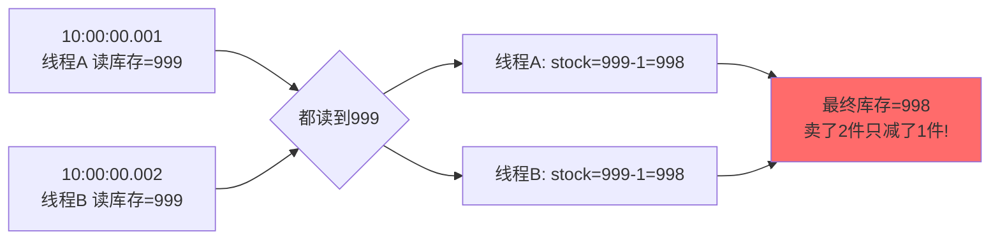
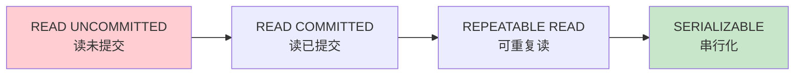
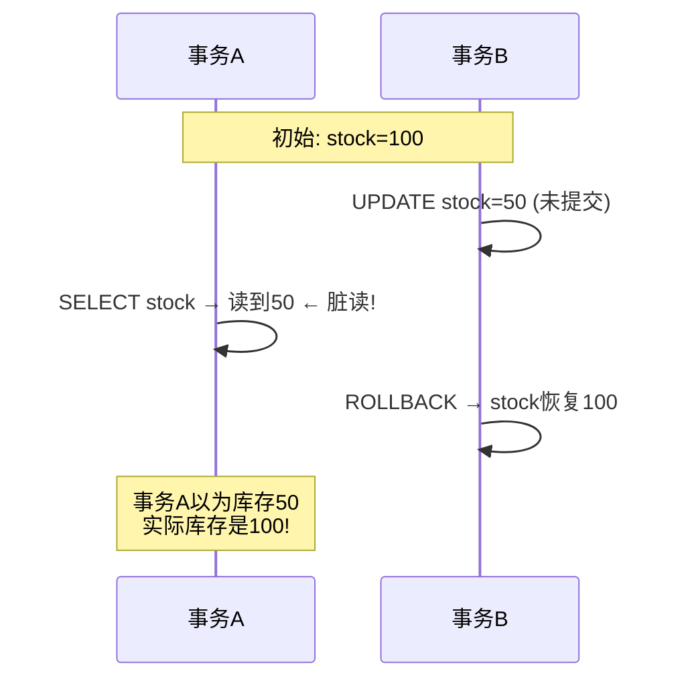
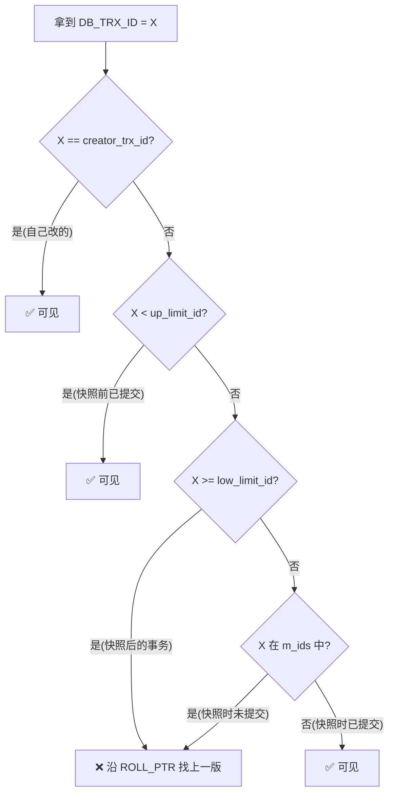
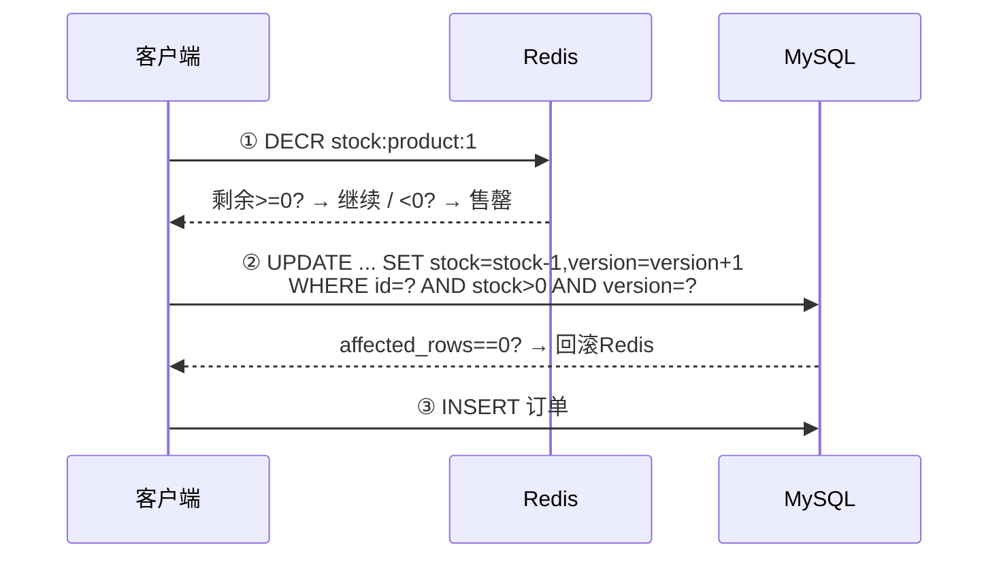
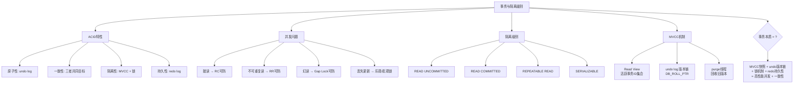

# 数据库事务隔离级别

> ACID、脏读/幻读/不可重复读、MVCC 如何做到高并发下数据一致

#### 目录介绍
- [01.工作案例引入](#01工作案例引入)
  - [1.1 库存超卖](#11-一次线上事故库存超卖)
  - [1.2 为何学事务原理](#12-为什么要学事务原理)
- [02.什么是事务](#02什么是事务)
  - [2.1 事务的定义](#21-事务的定义)
  - [2.2 为什么需要事务](#22-为什么需要事务)
  - [2.3 开启事务](#23-mysql中如何开启事务)
- [03.ACID四大特性](#03acid四大特性)
  - [3.1 原子性](#31-原子性atomicity)
  - [3.2 一致性](#32-一致性consistency)
  - [3.3 隔离性](#33-隔离性isolation)
  - [3.4 持久性](#34-持久性durability)
  - [3.5 实现总览](#35-acid的实现机制总览)
- [04.并发事务的问题](#04并发事务的问题)
  - [4.1 脏读](#41-脏读dirty-read)
  - [4.2 不可重复读](#42-不可重复读non-repeatable-read)
  - [4.3 幻读](#43-幻读phantom-read)
  - [4.4 丢失更新](#44-丢失更新lost-update)
  - [4.5 对比总结](#45-四种问题对比总结)
- [05.四种隔离级别](#05四种隔离级别)
  - [5.1 SQL标准定义](#51-sql标准定义的隔离级别)
  - [5.2 读未提交](#52-read-uncommitted-读未提交)
  - [5.3 读已提交](#53-read-committed-读已提交)
  - [5.4 可重复读](#54-repeatable-read-可重复读)
  - [5.5 串行化](#55-serializable-串行化)
  - [5.6 RR特殊表现](#56-innodb下rr的特殊表现)
- [06.MVCC多版本并发控制](#06mvcc多版本并发控制)
  - [6.1 MVCC思想](#61-mvcc的核心思想)
  - [6.2 隐藏列与undo](#62-隐藏列与undo-log)
  - [6.3 Read View](#63-read-view事务的快照)
  - [6.4 RC下ReadView](#64-rc下的read-view)
  - [6.5 RR下ReadView](#65-rr下的read-view)
  - [6.6 部分防幻读](#66-为什么rr能部分防幻读)
- [07.Undo Log](#07undo-logmvcc的基石)
  - [7.1 Undo结构](#71-undo-log的结构)
  - [7.2 版本链](#72-undo-log的版本链)
  - [7.3 purge清理](#73-undo-log的清理purge线程)
  - [7.4 长事务灾难](#74-长事务为什么是灾难)
- [08.隔离级别选择](#08事务隔离级别的选择)
  - [8.1 性能权衡](#81-隔离级别与并发性能的权衡)
  - [8.2 不同场景的选型](#82-不同场景的选型建议)
  - [8.3 查看与修改](#83-查看与修改隔离级别)
- [09.综合案例秒杀系统](#09综合案例秒杀系统的库存扣减)
  - [9.1 场景分析](#91-场景与问题分析)
  - [9.2 方案对比](#92-五种方案对比)
  - [9.3 知识图谱](#93-知识图谱回顾)
- [10.思考题与作业](#10思考题与作业)
  - [10.1 基础思考题](#101-基础思考题)
  - [10.2 进阶思考题](#102-进阶思考题)
  - [10.3 动手作业](#103-动手作业)


## 01.工作案例引入

### 1.1 库存超卖

**场景**：小陈是一家电商公司的后端工程师，负责秒杀系统。某天上午十点整，秒杀活动准时开始——999 件限量的 iPhone 在 3 秒内被"抢光"。运营同学高兴地发战报，但 5 分钟后，仓库打来电话："你们后台显示卖了 1203 件，但我们只有 999 件库存，多出来的 204 件发不出货！"

小陈脑子嗡的一下——**库存超卖了**。

他立刻查代码，秒杀扣库存的 SQL 是这样的：

```java
// 扣减库存的代码
@Transactional
public void deductStock(Long productId) {
    // Step 1: 查库存
    int stock = jdbc.query("SELECT stock FROM products WHERE id = ?", productId);
    // Step 2: 判库存
    if (stock <= 0) throw new SoldOutException();
    // Step 3: 减库存
    jdbc.update("UPDATE products SET stock = stock - 1 WHERE id = ?", productId);
}
```

**疑惑链条**：

- "这代码有问题吗？不是加 `@Transactional` 了吗？" → `@Transactional` 只保证这三次操作是一个原子整体，但**不保证并发安全**。两个线程同时读到 `stock=999`，都认为还有货，各自减 1 → 库存剩 998 或 997，取决于最后谁写——这就叫**丢失更新（Lost Update）**
- "那加 `synchronized` 行不行？" → 单机可以，但秒杀系统不可能只部署一台。分布式锁（Redis/ZK）才能解决跨 JVM 的并发问题
- "光加锁就行了吗？和事务隔离级别有关系吗？" → 有！即使加了锁，如果隔离级别是 `READ UNCOMMITTED`，事务 A 可能读到事务 B **还未提交**的修改——读到"假库存"
- "那 MySQL 默认的 REPEATABLE READ 够用吗？" → 对**当前读**（`SELECT ... FOR UPDATE`）够用，对**快照读**（普通 `SELECT`）——在 RR 级别读到的永远是事务开始时的快照，可能读到旧库存
- "怎么彻底避免？" → `SELECT ... FOR UPDATE`（排他锁当前行）+ 乐观锁版本号兜底（`UPDATE ... WHERE version = oldVersion`）

小陈修复后的核心 SQL：

```sql
UPDATE products
SET stock = stock - 1, version = version + 1
WHERE id = ? AND stock > 0 AND version = ?;
-- affected_rows == 0 → 版本号变了或没库存 → 重试
```

加上 Redis 分布式锁 + 数据库乐观锁双保险，超卖问题彻底解决。但小陈知道——他只是"会用锁和事务"，对 MVCC、Read View、undo log 版本链还一知半解。

### 1.2 为何学事务原理



**丢失更新**只是并发事务问题的一种。还有脏读、不可重复读、幻读——每一次都是不同的原因，需要不同的解决手段。本章的目标，就是从 **ACID 四个字母**出发，深入到 InnoDB 的 **MVCC（多版本并发控制）** 机制，让你真正理解：

- **隔离级别到底隔离了什么？** 不仅仅是"能读到什么"，更是"用锁还是用快照"的选择
- **MVCC 的快照是怎么拍的？** Read View + undo log 版本链的完整工作原理
- **为什么长事务是灾难？** undo log 膨胀 + 锁不释放的真正原因


## 02.什么是事务

### 2.1 事务的定义

事务（Transaction）是一组**要么全部成功、要么全部失败**的数据库操作序列。它把多个写操作捆绑成一个不可分割的逻辑单元。

```
类比：银行转账
  A 账户扣 100 元 → B 账户加 100 元
  这两个操作要么一起成功，要么一起失败
  绝不能出现"A 扣了钱但 B 没收到"的中间状态
```

### 2.2 为什么需要事务

| 如果没有事务 | 会导致什么问题 | 真实案例 |
|------------|-------------|---------|
| 不支持回滚 | 写一半系统崩溃，数据永久损坏 | 转账扣了钱没加上 |
| 不支持隔离 | 并发操作互相干扰 | 库存超卖 |
| 不支持持久性 | 提交了的数据断电丢失 | 订单丢失 |

### 2.3 开启事务

```sql
-- 方式1: 显式事务
START TRANSACTION;  -- 或 BEGIN
  UPDATE accounts SET balance = balance - 100 WHERE id = 1;
  UPDATE accounts SET balance = balance + 100 WHERE id = 2;
COMMIT;  -- 或 ROLLBACK

-- 方式2: 自动提交(默认)
-- autocommit = 1 → 每条语句自动包装成一个事务
SHOW VARIABLES LIKE 'autocommit';

-- 方式3: 关闭自动提交
SET autocommit = 0;
UPDATE accounts SET balance = balance - 100 WHERE id = 1;
-- 需要显式 COMMIT 或 ROLLBACK
```


## 03.ACID四大特性

### 3.1 原子性

**原子性 = 不可分割**。事务中的所有操作要么全部成功，要么全部回滚。实现机制是 **undo log（回滚日志）**——修改数据前先把**旧值**写到 undo log，回滚时用旧值逐条撤销。

```
UPDATE accounts SET balance = 100 WHERE id = 1;
-- undo log 记录: <id=1, 旧balance=200, 新balance=100>
-- ROLLBACK: 用旧值200覆盖回去
```

### 3.2 一致性

**疑惑：一致性到底是什么？和原子性、隔离性有什么区别？**

**答疑**：一致性是 ACID 中**最抽象但最核心**的概念——它强调数据库从**一个合法状态迁移到另一个合法状态**。

```
不满足一致性的例子:
  A 转账给 B:
    A.balance -= 100;   // A 扣了 100
    B.balance += 99;    // B 只加了 99 (金额对不上!)
  → 事务"原子地"完成了，但业务层面不一致——总金额少了 1 元

一致性 = 原子性 + 隔离性 + 业务约束（CHECK/FOREIGN KEY）共同保证
→ 一致性是"目标"，原子性和隔离性是"手段"
```

### 3.3 隔离性

**隔离性 = 并发事务互不干扰**。但"完全隔离"代价太高——所以 SQL 标准定义了**四种隔离级别**，从弱到强：



隔离性越强 → 并发性能越差。实现机制是 **MVCC + 锁**。

### 3.4 持久性

**持久性 = 事务一旦提交，修改永久保存**。即使数据库崩溃，重启后数据还在。实现机制是 **redo log（重做日志）** + WAL（Write-Ahead Logging）。

```
持久性不等于"立刻写磁盘":
  MySQL 先写 redo log (顺序IO，快) → 再异步刷数据页 (随机IO，慢)
  事务提交时，只要 redo log 落盘就算"已持久化"
  崩溃恢复: 用 redo log 重放已提交的事务
```

### 3.5 实现总览

| 特性 | 实现机制 | 核心文件 | 作用 |
|------|---------|---------|------|
| **原子性** | undo log | undo 表空间 | 回滚未提交事务的修改 |
| **一致性** | undo + redo + 锁 | — | 三者共同保证 |
| **隔离性** | MVCC + 锁机制 | — | 并发事务互不干扰 |
| **持久性** | redo log + double write | `ib_logfile0/1` | 崩溃恢复 |

**探索性问题**：如果只保留 redo log 和 undo log 中的一个，ACID 会缺哪些特性？

```
只保留 redo，没有 undo:
  ✅ 持久性: 崩溃后能恢复
  ❌ 原子性: 无法回滚 → 事务改了一半崩溃 → 恢复后是"半完成"状态

只保留 undo，没有 redo:
  ✅ 原子性: 能回滚
  ❌ 持久性: 已提交数据若只在内存 → 崩溃后丢失
  → 这就是 WAL 机制存在的意义: 保证"已提交"的不丢
```


## 04.并发事务的问题

### 4.1 脏读

**定义**：事务 A 读到了事务 B **尚未提交**的修改。如果 B 最终回滚，A 读到的是"脏数据"——从未真正存在过的数据。



### 4.2 不可重复读

**定义**：事务 A 内两次读同一行数据，**结果不一致**——因为中间事务 B 修改了这行并提交了。

**脏读 vs 不可重复读**：脏读读到的是**未提交**数据；不可重复读读到的是**已提交**数据——但**同事务内两次读不一样**。

### 4.3 幻读

**定义**：事务 A 内两次执行相同条件的范围查询，**结果集行数不一致**——因为中间事务 B 插入了新行并提交。

**幻读 vs 不可重复读**：不可重复读针对已有行的值变化（UPDATE）；幻读针对新插入的行（INSERT），结果集行数变了。

### 4.4 丢失更新

**定义**：两个事务同时读、各自改、各自写——**后提交的事务覆盖了先提交事务的修改**。这正是 1.1 节库存超卖的根本原因。

```
T1: 事务A 读 stock=999
T2: 事务B 读 stock=999
T3: 事务A 写 stock=998, 提交
T4: 事务B 写 stock=998, 提交  ← 覆盖了A的修改! 少扣了一件
```

**解决方式**：不是隔离级别能解决的——必须用锁或乐观锁（版本号）。

### 4.5 对比总结

| 问题 | 现象 | 解决方式 |
|------|------|---------|
| **脏读** | 读到未提交数据 | READ COMMITTED 即可 |
| **不可重复读** | 同一行两次读值不同 | REPEATABLE READ 快照读 |
| **幻读** | 结果集行数不同 | 间隙锁 (SERIALIZABLE) |
| **丢失更新** | 后提交覆盖前者 | 乐观锁/悲观锁 |


## 05.四种隔离级别

### 5.1 隔离级别定义

| 隔离级别 | 脏读 | 不可重复读 | 幻读 |
|---------|:---:|:-------:|:---:|
| **READ UNCOMMITTED** | ❌ | ❌ | ❌ |
| **READ COMMITTED** | ✅ | ❌ | ❌ |
| **REPEATABLE READ** | ✅ | ✅ | ❌ |
| **SERIALIZABLE** | ✅ | ✅ | ✅ |

MySQL InnoDB 默认 **REPEATABLE READ**。（Oracle / PostgreSQL 默认 READ COMMITTED）

### 5.2 读未提交

不加任何锁，直接读最新数据（包括未提交的）。性能最高但几乎没有任何隔离性——生产环境几乎不用。

### 5.3 读已提交

每次 `SELECT` 都生成一个新 Read View，只能看到**已提交**事务的修改。防止脏读但不防不可重复读。适合配合乐观锁使用（需要读到最新 version）。

### 5.4 可重复读

只在**第一次 `SELECT`** 时生成一个 Read View，整个事务复用。同事务内多次读同一行值不变，防止脏读和不可重复读。InnoDB 默认级别。

### 5.5 串行化

所有事务串行执行——读加共享锁、写加排他锁，读写互斥。防止所有并发问题，但并发性能极差，生产环境几乎不用。

### 5.6 RR特殊表现

**疑惑：不是说 RR 不能防幻读吗？为什么很多文章说"InnoDB 的 RR 能防幻读"？**

**答疑**：因为 InnoDB 的 RR 对**快照读**（普通 `SELECT`）能防幻读，对**当前读**（`SELECT ... FOR UPDATE`）不能——除非搭配**间隙锁（Gap Lock）**：

```sql
-- InnoDB RR 下的幻读测试

-- 会话A:
START TRANSACTION;
SELECT * FROM users WHERE age > 18;  -- 快照读: 返回80行 (创建了 Read View)

-- 会话B:
INSERT INTO users (name, age) VALUES ('Tom', 25);  -- 插入新行
COMMIT;

-- 会话A:
SELECT * FROM users WHERE age > 18;              -- 快照读: 仍是80行 ✅
SELECT * FROM users WHERE age > 18 FOR UPDATE;   -- 当前读: 81行 ❌ 幻读了!
```

**结论**：InnoDB RR 对快照读能防幻读（MVCC 快照）；对当前读需依赖 Gap Lock。Gap Lock 在 RR 级别下自动生效——`SELECT ... FOR UPDATE` 不仅锁定查到的行，还锁定行之间的间隙。


## 06.MVCC多版本并发控制

### 6.1 MVCC思想

**疑惑：RC 和 RR 到底是怎么实现"读不阻塞写、写不阻塞读"的？**

**答疑**：通过 **MVCC（Multi-Version Concurrency Control，多版本并发控制）**——数据库保留数据的**多个历史版本**，每个事务根据自己的"快照"看到不同版本。

```
传统方式（基于锁）:
  读操作加共享锁 → 写操作被阻塞 → 读写互斥 → 并发度低

MVCC 方式:
  写操作不改原数据，而是创建新版本
  读操作根据自己的 Read View 选择合适的版本
  → 读写互不阻塞！→ 并发度高
```

### 6.2 隐藏列与undo

InnoDB 每行数据有**三个隐藏列**，是 MVCC 的基础：

| 隐藏列 | 大小 | 作用 |
|--------|------|------|
| `DB_TRX_ID` | 6B | 最后一次修改本行的事务 ID |
| `DB_ROLL_PTR` | 7B | 回滚指针——指向 undo log 中上一版本 |
| `DB_ROW_ID` | 6B | 行 ID（无主键时用作聚簇索引） |

```
一行数据的"前世今生"——版本链:

当前行 (在B+Tree叶子节点):
┌──────────────────────────────────────────────┐
│ id=1 │ balance=100 │ TRX_ID=300 │ ROLL_PTR ──┐
└──────────────────────────────────────────────┘    │
                                                   ▼
            undo log 版本链:
┌────────────────────────────────────────────┐
│ balance=200 │ TRX_ID=200 │ ROLL_PTR ──┐    │
└────────────────────────────────────────┘    │
                                             ▼
                              ┌─────────────────┬───NULL
                              │ balance=300     │
                              │ TRX_ID=100      │
                              └─────────────────┘
```

`DB_ROLL_PTR` 把多个版本串成单向链表——**undo log 版本链**。这也是事务回滚的数据来源。

### 6.3 Read View

**Read View 是 MVCC 的核心数据结构**——记录"创建快照时哪些事务正在活跃（未提交）"：

```c
// Read View 简化定义
struct ReadView {
    trx_id_t m_low_limit_id;   // 下一个要分配的事务ID
    trx_id_t m_up_limit_id;    // 活跃事务中最小的ID
    trx_ids_t m_ids;           // 活跃事务ID的集合
    trx_id_t m_creator_trx_id; // 创建者自身的事务ID
};
```

**可见性判断规则**——给定行数据 `DB_TRX_ID = X`：



**通俗理解**：你进入大楼（开启事务），前台给你"登记表"（Read View）——上面写着谁还在施工（未提交）。你看到的每个房间门牌上有"最后装修者ID"——如果装修者不在登记表上→他的工作已完成→你能看到；如果在→还在施工→不能进→去看上一个版本。

### 6.4 RC下ReadView

**RC 级别下，每次 `SELECT` 都生成一个新的 Read View**：

```
事务A (trx_id=100), 事务B (trx_id=200)

A 第一次 SELECT:
  创建 Read View: up=100, low=300, m_ids=[100,200]
  当前行 trx_id=150 (不在 m_ids, 已提交) → balance=200 ✅

B: UPDATE balance=100 + COMMIT

A 第二次 SELECT:
  重新创建 Read View: up=100, low=300, m_ids=[100] (200已提交)
  当前行 trx_id=200 (不在 m_ids, 已提交!) → balance=100 ✅
  ⚠️ 两次读结果不同 = 不可重复读
```

**RC 每次重建 Read View → 总能看到最新已提交数据 → 不防不可重复读。**

### 6.5 RR下ReadView

**RR 级别下，只在第一次 `SELECT` 时生成 Read View，整个事务复用**：

```
事务A (trx_id=100), 事务B (trx_id=200)

A 第一次 SELECT:
  创建 Read View: up=100, low=300, m_ids=[100,200]
  当前行 trx_id=150 → balance=200 ✅

B: UPDATE balance=100 + COMMIT

A 第二次 SELECT:
  复用旧 Read View: m_ids=[100,200] 不变!
  当前行 trx_id=200 (在 m_ids 中!) → 不可见
  沿 ROLL_PTR 找上一版 trx_id=150 → balance=200 ✅
  ✅ 两次读一致 = 可重复读!
```

**RR 复用同一个 Read View → 看不到后续提交的修改 → 防不可重复读。**

### 6.6 部分防幻读

```
RR 对快照读的幻读防护:
  事务A 第一次 SELECT * WHERE age>18 → 创建 Read View, 活跃=[100,200] → 80行
  事务B INSERT (age=25), trx_id=200 → 在活跃列表中 → A 不可见!
  事务A 第二次 SELECT * WHERE age>18 → 复用旧 Read View → 仍是80行 ✅

RR 对当前读的幻读:
  事务A SELECT * WHERE age>18 FOR UPDATE → 不走快照，读最新 → 81行 ❌
  → 需 Gap Lock 补位: 锁住间隙 → 阻止 B 的 INSERT
```


## 07.Undo Log

### 7.1 Undo结构

每次修改数据，InnoDB 生成一条 undo log 记录：

- **INSERT 的 undo log**：只记录主键，回滚时按主键删行
- **UPDATE 的 undo log**：记录被修改列的旧值 + DB_TRX_ID + ROLL_PTR
- **DELETE 的 undo log**：类似 UPDATE，标记行"已删除"→ 回滚时恢复

### 7.2 版本链

事务 A（trx_id=150，Read View 活跃=[150,200]）读一行被三次修改过的数据：

```
当前行: trx_id=300 (≥ low_limit → 不可见) → 沿 ROLL_PTR
版本2:  trx_id=200 (在 m_ids → 不可见)    → 沿 ROLL_PTR
版本1:  trx_id=100 (< up_limit → 可见✅)   → 返回 balance=200

这就是 MVCC 通过 Read View + undo 版本链实现"读不阻塞写"的完整原理。
```

### 7.3 purge清理

undo log 不能无限增长。当**没有任何 Read View 需要某个 undo 版本**时，purge 线程回收它：

```
purge 触发条件:
  某 undo 条目 → 所有可能引用它的 Read View 都销毁 → 才能 purge

推论:
  长事务持有旧的 Read View → purge 无法回收这段时间的 undo
  → undo 表空间持续膨胀 → 撑爆磁盘
```

### 7.4 长事务灾难

**疑惑：为什么说"长事务是 MySQL 的噩梦"？**

长事务造成**两个方向**的灾难：

```
灾难1: undo log 膨胀
  事务开始 → 创建 Read View → 之后所有修改都产生 undo
  这个 Read View 需要所有在它开启后才产生的 undo 版本
  → purge 无法回收 → undo 表空间持续增长
  例: 1 小时长事务 + 其他事务修了 1000 万行 → 1000 万条 undo 堆积

灾难2: 锁不释放
  长事务持有的行锁/间隙锁一直不释放
  → 阻塞其他事务 → 锁等待 → 连锁反应 → 整个系统卡死

检测长事务:
SELECT * FROM information_schema.INNODB_TRX
WHERE trx_started < NOW() - INTERVAL 60 SECOND;
```

**生产环境铁律**：监控长事务（> 60s），强制 kill 或告警。


## 08.隔离级别选择

### 8.1 性能权衡

```
隔离性从弱到强:  RU → RC → RR → SERIALIZABLE
并发性从强到弱:  RU → RC → RR → SERIALIZABLE
```

### 8.2 选型建议

| 场景 | 推荐级别 | 理由 |
|------|---------|------|
| 通用 Web 应用 | RR（InnoDB 默认） | 防脏读+不可重复读，并发性能尚可 |
| 高并发读多写少 | RC | 每次读最新提交数据，配合乐观锁效果好 |
| 秒杀/库存扣减 | RC + 乐观锁 | RC 总是读最新数据让版本号匹配更准 |
| 财务报表 | SERIALIZABLE 或 RR+显式锁 | 绝不能出现不一致 |
| 数据迁移/批量处理 | RC | 避免长事务 undo 膨胀 |

### 8.3 查看与修改

```sql
-- 查看
SELECT @@global.transaction_isolation;
SELECT @@session.transaction_isolation;

-- 设置
SET GLOBAL TRANSACTION ISOLATION LEVEL READ COMMITTED;
SET SESSION TRANSACTION ISOLATION LEVEL REPEATABLE READ;
```


## 09.综合案例

### 9.1 场景分析

回到 1.1 节：999 件库存，10000 人同时抢购。每笔请求：查库存→判断>0→减库存→创建订单。问题本质是步骤①和③之间有时间窗口→并发读到相同库存→丢失更新。

### 9.2 方案对比

**方案一：纯 @Transactional（最弱）**

快照读查库存→判断→UPDATE 扣减——快照读和当前读的数据来源不一致→必然丢失更新。❌

**方案二：SELECT ... FOR UPDATE 悲观锁**

```sql
START TRANSACTION;
SELECT stock FROM products WHERE id = ? FOR UPDATE;  -- 排他锁
UPDATE products SET stock = stock - 1 WHERE id = ?;
COMMIT;
```
✅ 绝对安全 | ❌ 高并发下连接耗尽 → 吞吐量低。

**方案三：乐观锁（CAS）**

```sql
UPDATE products SET stock = stock - 1, version = version + 1
WHERE id = ? AND stock > 0 AND version = ?;
-- affected_rows==0 → 重试
```
✅ 无锁等待 | ❌ 高冲突时大量重试。

**方案四：Redis 预减 + 数据库乐观锁兜底（生产推荐）**



Redis 解决查询性能瓶颈（O(1)），数据库乐观锁保证最终一致性。即使 Redis 宕机，数据库 `stock>0` 判断仍做最后防线。✅

### 9.3 知识图谱



**最终方法论——排查事务问题的四步法**：

1. **确认隔离级别**：`SELECT @@transaction_isolation`
2. **区分快照读 vs 当前读**：普通 SELECT 走 MVCC 快照；FOR UPDATE/INSERT/UPDATE/DELETE 走当前读
3. **追踪 Read View 生命周期**：RC 每次重建，RR 一次创建复用全程
4. **检查长事务**：`information_schema.INNODB_TRX`——长事务是 undo 膨胀和锁等待的根因


## 10.思考题与作业

### 10.1 基础思考题

1. **ACID 对号入座**：分别说出原子性、一致性、隔离性、持久性的定义，并指出每个特性的实现机制（undo log / redo log / MVCC / 锁）。

2. **四种并发问题**：用自己的话解释脏读、不可重复读、幻读、丢失更新的区别。各举一个 SQL 示例，说明哪个隔离级别能防止哪个问题。

3. **Read View 可见性判断**：假设 Read View 中 `up_limit_id=100`，`low_limit_id=300`，`m_ids=[100,150,200]`，`creator_trx_id=250`。判断下列 `DB_TRX_ID` 的数据是否对当前事务可见：X=50, X=100, X=150, X=200, X=250, X=300, X=350。

4. **undo log 版本链追踪**：一行数据被三个事务依次修改（trx_id: 100→200→300），当前行 trx_id=300。事务 A（trx_id=250）在 trx_id=200 提交后、trx_id=300 提交前开始。事务 A 读这行数据，最终读到哪个版本？请沿版本链完整追踪。

5. **RC vs RR 的 Read View 创建时机**：为什么 RC 会有不可重复读而 RR 不会？从 Read View 创建时机解释。

### 10.2 进阶思考题

1. **1.1 节复盘**：小陈的秒杀系统——如果隔离级别是 RR、用快照读查库存会出现什么问题？RC 呢？SERIALIZABLE 呢？分析三种级别在这场景下的表现。

2. **长事务的连锁反应**：一个 `SELECT * FROM orders` 的事务运行了 30 分钟——这期间其他事务修改了 500 万行。从 undo 膨胀、purge 阻塞、主从延迟三个角度分析影响。

3. **MVCC 与锁的配合**：InnoDB RR 下 `UPDATE ... WHERE status='pending'` 没显式加锁——InnoDB 会自动加什么锁？这条语句的"读"阶段是快照读还是当前读？为什么？

4. **PostgreSQL 的 MVCC vs MySQL 的 MVCC**：PostgreSQL 没有 undo log，旧版本直接存在数据页中。这种设计的优缺点？为什么 PG 需要 VACUUM 而 MySQL 有 purge 线程？

5. **分布式事务的挑战**：秒杀请求跨 Redis 减库存 + MySQL 扣库存 + 第三方支付——怎么保证原子性？分布式事务（XA/Seata/TCC）和单机事务 ACID 有本质区别？

### 10.3 动手作业

**作业一（必做）**：复现四种并发问题。

分别在 RC 和 RR 隔离级别下，用两个会话复现脏读、不可重复读、幻读。把结果填表：

| 并发问题 | READ UNCOMMITTED | READ COMMITTED | REPEATABLE READ | SERIALIZABLE |
|---------|:---:|:---:|:---:|:---:|
| 脏读 | | | | |
| 不可重复读 | | | | |
| 幻读(快照读) | | | | |
| 幻读(当前读) | | | | |

**作业二（选做）**：模拟长事务灾害。

```sql
-- 会话A (长事务):
START TRANSACTION;
SELECT * FROM products WHERE id = 1;  -- 创建 Read View, 不提交!

-- 会话B (批量更新):
-- 对 products 做 10 万次 UPDATE (每次都 COMMIT)
-- 观察: SHOW ENGINE INNODB STATUS 中的 History list length
-- 观察: information_schema.INNODB_TRX 中的 trx_started

-- 提交会话A → 观察: History list length 是否立刻下降？
```

**作业三（选做）**：实现乐观锁秒杀。

用你熟悉的语言实现乐观锁版本库存扣减——100 个并发线程，初始库存 10。统计成功扣减次数、重试次数、最终库存。对比悲观锁版本的性能。

**作业四（架构思考）**：对你当前项目的核心业务表，梳理事务使用情况——哪些地方用了 `@Transactional`？隔离级别是多少？有没有长事务风险？有没有丢失更新隐患？如果遇到并发写冲突，选乐观锁还是悲观锁？

