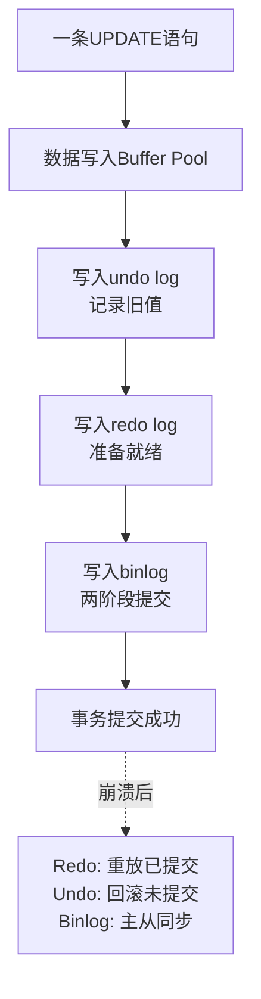
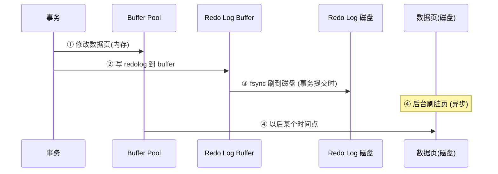
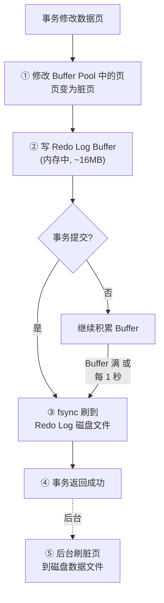
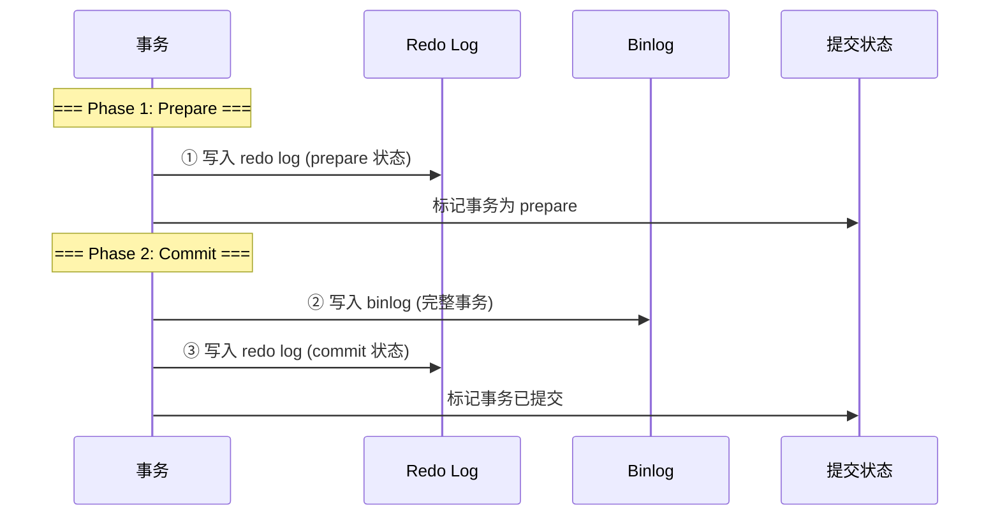
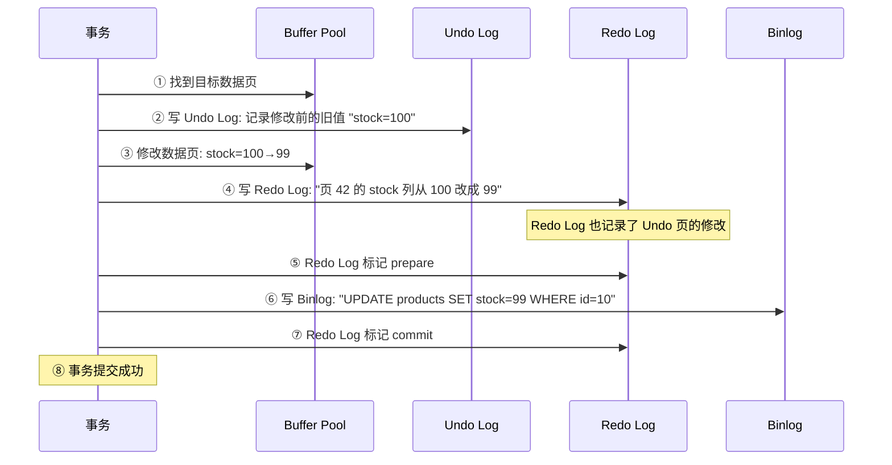
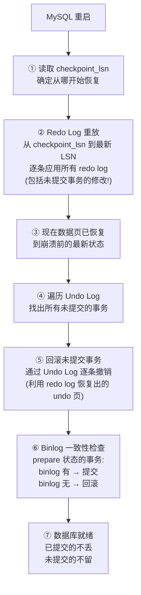
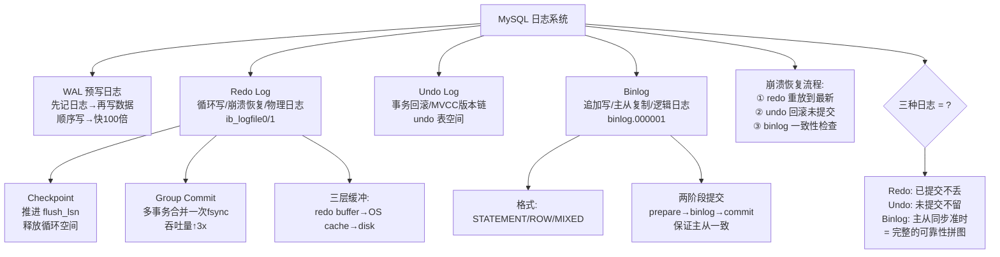

# 数据库日志系统设计

> redo log/undo log/binlog 三者关系、WAL 机制、崩溃恢复完整流程

#### 目录介绍
- [01.工作案例引入](#01工作案例引入)
  - [1.1 崩溃丢数据](#11-一次崩溃后数据丢了)
  - [1.2 为何学日志](#12-为什么要学日志系统)
- [02.三种日志概述](#02三种日志概述)
  - [2.1 三种日志职责](#21-三种日志职责)
  - [2.2 日志对比](#22-三种日志的对比)
  - [2.3 日志位置](#23-日志写在什么位置)
- [03.WAL机制](#03wal机制)
  - [3.1 为何WAL](#31-为什么先写日志再写数据)
  - [3.2 WAL流程](#32-wal的全流程)
  - [3.3 WAL优势](#33-wal的性能优势)
- [04.Redo Log](#04redo-log持久性的守护者)
  - [4.1 Redo结构](#41-redo-log的结构)
  - [4.2 Redo写入](#42-redo-log的写入流程)
  - [4.3 循环写入](#43-redo-log的循环写入)
  - [4.4 检查点](#44-checkpoint机制)
  - [4.5 组提交](#45-组提交group-commit)
  - [4.6 三层缓冲](#46-redo-log的三层缓冲区)
- [05.Binlog](#05binlog主从复制的基石)
  - [5.1 三种格式](#51-binlog的三种格式)
  - [5.2 两阶段提交](#52-binlog的写入时机两阶段提交)
  - [5.3 对比Redo](#53-binlog-vs-redo-log)
- [06.Undo Log](#06undo-log回顾)
  - [6.1 双重使命](#61-undo-log的双重使命)
  - [6.2 一次UPDATE](#62-三种日志协同完成一次update)
- [07.崩溃恢复完整流程](#07崩溃恢复完整流程)
  - [7.1 恢复流程](#71-恢复的总流程)
  - [7.2 Redo重放](#72-redo-log重放已提交的必须恢复)
  - [7.3 Undo回滚](#73-undo-log回滚未提交的必须撤销)
  - [7.4 崩溃场景](#74-三种崩溃场景分析)
- [08.综合案例](#08综合案例机房断电后的恢复)
  - [8.1 场景与排查](#81-场景与排查)
  - [8.2 知识图谱回顾](#82-知识图谱回顾)
- [09.思考题与作业](#09思考题与作业)
  - [9.1 基础思考题](#91-基础思考题)
  - [9.2 进阶思考题](#92-进阶思考题)
  - [9.3 动手作业](#93-动手作业)


## 01.工作案例引入

### 1.1 崩溃丢数据

**场景**：老赵是一家电商公司的 DBA。某天凌晨，机房一台物理机突然断电——MySQL 狠狠摔了一跤。运维紧急切换到备机，但老赵还是一身冷汗——万一数据丢了怎么办？

幸好，重启后数据库**不仅没丢数据，连崩溃前最后几秒提交的事务都在**。老赵松了一口气，同时产生了疑惑：

**疑惑链条**：

- "断电瞬间，Buffer Pool 里还没刷盘的脏数据页去哪了？" → 依赖 **redo log**——崩溃时通过重放 redo log 把脏页恢复出来
- "那正在执行但还没提交的事务怎么办？比如扣了库存但没创建订单——怎么回滚？" → 依赖 **undo log**——恢复过程中发现有未提交的事务，用 undo log 回滚
- "Redo log 和 binlog 有什么区别？为什么需要两套日志？" → redo log 是 InnoDB 引擎层的（崩溃恢复），binlog 是 Server 层的（主从复制+数据恢复）
- "为什么 redo log 是循环写的，binlog 是追加写的？" → redo log 只需要保证"最近一段时间"的持久性，binlog 需要保留全量变更历史
- "两阶段提交是什么？为什么需要？" → 保证 redo log 和 binlog 的一致性——不能让主从数据不一致

这次断电让老赵深刻体会到：**数据库的可靠性不是靠"不会崩"，而是靠"崩了能恢复"**。而恢复的底气，全部来自三个日志文件。

### 1.2 为何学日志

日志系统是数据库可靠性的基石。单独看任何一个知识点（redo/binlog/undo）都能找到文章，但很少有人能串起来回答：



本章的目标——把 redo log、undo log、binlog 三条线**织成一张网**，让你理解一次 UPDATE 在日志层面到底经历了什么，崩溃后三者如何协作恢复数据。


## 02.三种日志概述

### 2.1 redo log / undo log / binlog 的职责

| 日志 | 所属层 | 记录内容 | 核心职责 | 写入方式 |
|------|--------|---------|---------|---------|
| **redo log** | InnoDB 引擎层 | "数据页做了什么修改"（物理） | **崩溃恢复**：把已提交的修改重放 | 循环写 |
| **undo log** | InnoDB 引擎层 | "修改前的旧值"（逻辑） | **事务回滚 + MVCC** | 随机写 |
| **binlog** | MySQL Server 层 | "SQL语句或行变更"（逻辑） | **主从复制 + 数据恢复** | 追加写 |

### 2.2 日志对比

| 维度 | redo log | undo log | binlog |
|------|---------|---------|--------|
| **产生者** | InnoDB | InnoDB | Server 层(任何引擎) |
| **记录内容** | 物理：页号+偏移+改了什么 | 逻辑：旧值 | 逻辑：SQL或行变更 |
| **写入时机** | 事务执行中持续写 | 修改数据前先写 undo | 事务提交时写入 |
| **能否归档** | ❌ 循环覆盖 | ❌ purge 线程清理 | ✅ 可以归档 |
| **作用范围** | 单机崩溃恢复 | 单机回滚+MVCC | 跨机器主从复制 |
| **文件位置** | `ib_logfile0/1` | undo 表空间 | `binlog.000001` |

### 2.3 日志位置

```
MySQL 数据目录:
├── ib_logfile0           ← redo log (48MB)
├── ib_logfile1           ← redo log (48MB)
├── undo_001              ← undo log 表空间 (可独立)
├── undo_002              ← undo log 表空间
├── binlog.000001         ← binlog (1GB)
├── binlog.000002         ← binlog (下一个文件)
├── binlog.index          ← binlog 文件列表
└── mydb/
    └── orders.ibd        ← 表数据 + 索引
```

```bash
# 查看日志状态
SHOW ENGINE INNODB STATUS\G
-- Log sequence number: 1293847234
-- Log flushed up to:   1293847234
-- Pages flushed up to: 1293845000
-- Last checkpoint at:  1293845000

SHOW MASTER STATUS;
-- File: binlog.000001, Position: 8947
```


## 03.WAL机制

### 3.1 为何WAL

**疑惑：为什么不直接把修改写到磁盘数据页？为什么中间要经过 redo log？**

**答疑**：这就是 **WAL（Write-Ahead Logging，预写日志）** 的核心思想——**先记日志，再写磁盘**。

```
不用 WAL (直接写磁盘数据页):
  UPDATE 一行 → 找到该行的 16KB 数据页 → 读入内存 → 修改 → 写回磁盘
  每次 UPDATE = 1 次随机磁盘写 (16KB)
  1000 UPDATE/s = 1000 次随机写 → 磁盘 IO 瓶颈 → 慢!

用 WAL (先记日志):
  UPDATE 一行 → 找到该行的 16KB 数据页 → 读入内存 → 修改 → 写 redo log (顺序写!) → 完成!
  redo log 写入 = 顺序写 ~几十字节 → 极快!
  后续: 后台线程把脏页批量刷到磁盘 (随机写, 但不影响前台延迟)
```

### 3.2 WAL流程



**关键**：事务提交时只要 redo log 落盘就算"已持久化"，不需要等数据页落盘。这就是 WAL 让写入变快的核心。

### 3.3 WAL优势

```
WAL 的两个核心优势:

1. 顺序写 vs 随机写
   Redo log: 顺序追加到文件尾 → 即使 HDD 也能 100MB/s+
   数据页: 随机分布在不同位置 → HDD 只有 1-2MB/s (SSD 好一些)
   → 顺序写快 50-100 倍!

2. 延迟写 vs 立即写
   数据页需要完整 16KB 写入 (可能涉及页分裂、合并)
   Redo log 只需记录"改了什么" → 几十字节
   → 单次写入量少 100-500 倍!
```

**探索性问题**：既然 redo log 这么快，为什么不把所有数据都存在 redo log 里？

```
Redo log 是循环写的(固定大小) → 空间有限 → 旧日志会被覆盖
Redo log 不是"数据本身"，而是"修改记录" → 必须配合数据页才能还原
类比: Redo log = 施工日记, 数据页 = 竣工建筑
      施工日记记录"某个房间刷了什么颜色"→ 但你不能住进日记里
```


## 04.Redo Log

### 4.1 Redo结构

Redo log 由固定大小的文件组组成，**循环写入**：

```
Redo Log 文件 (每个默认 48MB, 一组 2 个 = 96MB):

ib_logfile0: [____已写____|______空闲______]
ib_logfile1: [____________空闲____________]
              ↑
         log sequence number (LSN)

关键指针:
  LSN (Log Sequence Number): 当前日志写入位置 (单调递增的字节偏移)
  flushed_to_disk_lsn: 已刷到磁盘的位置
  checkpoint_lsn: 检查点位置——这之前的日志对应的脏页都已刷盘
  → LSN - checkpoint_lsn = 需要保留的有效日志长度
```

### 4.2 Redo写入



### 4.3 循环写入

```
Redo Log 组 = 4 个文件 × 1GB = 4GB (可配置大小)

循环写入规则:
  1. 从第一个文件开始顺序写
  2. 写到组末尾 → 回到第一个文件开头
  3. 如果追上 checkpoint_lsn → 必须等待! (redo log 满了)
     → 触发脏页刷盘 → 推进 checkpoint → 释放 redo log 空间

这就是第 5 章提到的"redo log 快满时疯狂刷脏页"现象:
  redo log 太小 → 频繁循环 → 频繁刷脏页 → IO 压力大
  redo log 太大 → 崩溃恢复时间长 (需要扫描更多日志)

建议: 4 个 × 1GB = 4GB, 或根据写入量调整
  innodb_log_file_size = 1G
  innodb_log_files_in_group = 4
```

### 4.4 检查点

**Checkpoint（检查点）** 是 redo log 循环复用的关键：

```
Checkpoint 的触发时机:
  1. Master Thread: 每 1 秒或 10 秒一次
  2. Redo Log 空间不足: LSN - checkpoint_lsn > 75% 总大小 → 需推进
  3. 脏页比例过高: 触发刷盘 → 推进 checkpoint
  4. 数据库正常关闭: 全量刷盘 → 推进 checkpoint 到最新 LSN

Checkpoint 做的事:
  1. 把所有 LSN ≤ checkpoint_lsn 对应的脏页刷入磁盘
  2. 更新 checkpoint_lsn → checkpoint 之前的 redo log 空间可被覆盖

查看:
SHOW ENGINE INNODB STATUS\G
-- LOG section:
-- LSN: ① Log sequence number                      当前 LSN
-- LSN: ② Log flushed up to                        已刷盘的 LSN
-- LSN: ③ Pages flushed up to                      数据页已刷盘的 LSN
-- LSN: ④ Last checkpoint at                       最新 checkpoint
-- 有效日志 = ① - ④, 必须 < 75% 总大小
```

### 4.5 组提交

**疑惑：多个事务同时提交，每个都 fsync 一次 redo log——性能很浪费。怎么优化？**

**答疑**：InnoDB 的 **组提交（Group Commit）** 把多个事务的 redo log 合并为**一次 fsync**：

```
没有组提交:
  事务A commit → fsync redo log ← 等待磁盘
  事务B commit → fsync redo log ← 等待磁盘
  事务C commit → fsync redo log ← 等待磁盘
  → 3 次 fsync, 每次 1ms → 总 3ms

有组提交:
  事务A commit → 进入提交队列 → 等一会儿
  事务B commit → 进入同一个队列 →
  事务C commit → 进入同一个队列 →
  一次 fsync 把三个事务的 redo log 一起刷盘!
  → 1 次 fsync, 1ms → 总 1ms → 吞吐量提升 3 倍!

innodb_flush_log_at_trx_commit = 1 (默认, 推荐)
  → 每次提交都 fsync → 最安全, 但依赖组提交减少 fsync 次数

innodb_flush_log_at_trx_commit = 2
  → 每次提交写 OS cache, 每秒 fsync → 快但可能丢 1 秒数据

innodb_flush_log_at_trx_commit = 0 (不推荐)
  → 每秒写 OS cache + fsync → 可能丢 1 秒数据
```

### 4.6 三层缓冲

```
从修改到磁盘的三层缓冲:
  ┌─────────────────────────────────────┐
  │ ① Redo Log Buffer (innodb_log_buffer_size = 16MB)
  │    事务修改时先记在这里 (内存)
  ├─────────────────────────────────────┤
  │ ② OS Page Cache
  │    write() 到这里, 还未 fsync
  ├─────────────────────────────────────┤
  │ ③ 磁盘 (ib_logfile0/1)
  │    fsync() 后才真正落盘
  └─────────────────────────────────────┘

innodb_flush_log_at_trx_commit 控制每次提交的写入深度:
  = 1: 写到 ③ (最安全)
  = 2: 写到 ② (OS 缓存)
  = 0: 写到 ① (每秒才往后写, 最不安全)
```


## 05.Binlog

### 5.1 三种格式

Binlog 是 MySQL Server 层的逻辑日志——记录引起数据变化的 SQL 语句或行变更：

| 格式 | 记录内容 | 优点 | 缺点 |
|------|---------|------|------|
| **STATEMENT** | SQL 语句原文 | 日志量小 | 部分函数(UUID/NOW)导致主从不一致 |
| **ROW** (5.7 默认) | 每行变更的前后值 | 精准, 不会不一致 | 日志量大 (UPDATE 全表 = 每行一条记录) |
| **MIXED** | 大多数用 STATEMENT, 不安全时切 ROW | 折中 | 复杂性高 |

```sql
-- 查看 binlog 格式
SHOW VARIABLES LIKE 'binlog_format';

-- 查看 binlog 内容
mysqlbinlog --base64-output=DECODE-ROWS -v binlog.000001

-- ROW 格式示例输出:
### UPDATE `mydb`.`products`
### WHERE
###   @1=10 /* id */
###   @2=100 /* stock */
### SET
###   @1=10
###   @2=99
```

### 5.2 两阶段提交

**疑惑：事务提交时，先写 redo log 还是先写 binlog？如果只写了一个就崩溃了怎么办？**

**答疑**：这就是**两阶段提交（Two-Phase Commit, 2PC）**必须解决的问题——不能让 redo log 和 binlog 不一致：



**两阶段提交保证 redo log 和 binlog 的一致性**：

```
崩溃后的三种情况:

情况 A: ① prepare 之后崩溃, binlog 还没写
  → Redo log 有 prepare 记录, binlog 无此事务
  → 恢复时: 遇到 prepare 但 binlog 无对应记录 → 回滚!

情况 B: ② binlog 写完后崩溃, redo log commit 没写
  → Redo log 有 prepare 记录, binlog 有完整事务
  → 恢复时: 遇到 prepare 且 binlog 有对应记录 → 提交!

情况 C: ③ 全部写完后崩溃
  → Redo log 有 commit 记录
  → 恢复时: 直接提交!

通过两阶段提交 + binlog 完整性检查:
  → 主库 redo log 和 binlog 永远一致
  → 从库重放 binlog → 主从数据一致 ✅
```

### 5.3 对比Redo

| 维度 | Redo Log | Binlog |
|------|---------|--------|
| 产生层 | InnoDB 引擎 | Server 层 |
| 记录内容 | 物理："页X偏移Y改成了Z" | 逻辑："UPDATE t SET c=1 WHERE id=2" |
| 写入方式 | 循环写（固定大小） | 追加写（文件满了切新文件） |
| 用途 | 崩溃恢复（重放） | 主从复制 + 数据恢复 |
| 刷盘控制 | `innodb_flush_log_at_trx_commit` | `sync_binlog` |
| 归档保留 | 不需要（循环覆盖） | 需要（可设置过期时间 `expire_logs_days`） |


## 06.Undo Log

### 6.1 双重使命

Undo log 的作用在前两章已经详细介绍过（第 3 章事务、第 6 章 MVCC），这里简要回顾：

```
Undo Log 的两大职责:
  ① 事务回滚: ROLLBACK 时, 用 undo log 逐条撤销修改
  ② MVCC 快照读: 通过 DB_ROLL_PTR 版本链, 读取历史版本

详细的 undo log 结构、purge 线程、长事务影响
  → 见第 3 章 06.MVCC 和第 07.Undo Log 两个章节
```

### 6.2 一次UPDATE



**关键**：redo log 不仅记录数据页的修改，也记录 undo 页的修改。这样崩溃恢复时——undo log 本身如果丢失，也能通过 redo log 重建。


## 07.崩溃恢复完整流程

### 7.1 恢复流程

这是日志系统知识的**最终检验**——MySQL 崩溃重启后的恢复全流程：



### 7.2 Redo重放

```
Redo Log 重放的逻辑:

从 checkpoint_lsn 开始, 逐条扫描 redo log:
  for (lsn = checkpoint_lsn; lsn <= latest_lsn; lsn++):
    读取 redo log 记录
    → "把页42偏移200处的4字节改成 0x00000063" (stock=99)
    应用到数据页 → 即使页不在 Buffer Pool, 也先读入再应用

重放完成后:
  → 所有"已提交事务"的数据页修改都已恢复
  → 但"未提交事务"的修改也被重放了! (因为 redo log 不区分提交状态)
  → 需要下一步的 Undo Log 回滚来撤销
```

**探索性问题**：为什么 redo log 重放时不区分提交/未提交？

```
Redo log 的记录格式不包含"事务是否提交"的标志位
→ 重放就是机械地把所有记录都执行一遍
→ 这样可以简化 redo log 的设计 → 性能更高

真正区分提交/未提交是在 Undo Log 环节:
  遍历 Undo Log → 找到活跃事务→ 回滚 → 覆盖掉 redo 重放的效果
```

### 7.3 Undo回滚

```
Undo Log 回滚的逻辑:

① 从 Undo 表空间找到所有 "TRX_UNDO_ACTIVE" 状态的事务
   这些是崩溃时还未提交的事务

② 对每个未提交事务:
   沿 undo log 版本链, 从最新到最旧, 逐条执行逆操作:
     UPDATE → 用旧值覆盖回去
     INSERT → 删除该行
     DELETE → 恢复该行

③ 标记对应的 undo log 为 TRX_UNDO_DISCARDED

注意: undo log 本身也可能在崩溃中损坏 → 但 redo log 重放时也恢复了 undo 页
→ 这就是第 6 章提到的"redo log 也记录 undo 页修改"的意义
```

### 7.4 崩溃场景

| 崩溃时机 | Redo Log 状态 | Undo Log 状态 | Binlog 状态 | 恢复结果 |
|---------|:---:|:---:|:---:|------|
| **场景 A**: 事务修改了页, 尚未写 redo log | 无记录 | 已写 undo | — | 重启后: 数据页回滚到修改前 (redo 无记录, undo 有) |
| **场景 B**: redo log prepare + binlog 已写, 但未写 commit | prepare 无 commit | 有 | 完整 | 重启后: 扫描 binlog → 有此事务 → 提交 ✅ |
| **场景 C**: redo log prepare + binlog 未写 | prepare | 有 | 无 | 重启后: 扫描 binlog → 无此事务 → 回滚 ❌ |


## 08.综合案例

### 8.1 场景排查

回到 1.1 节老赵的断电事故——完整复盘恢复过程：

```
断电前状态:
  - 事务 T1: 扣库存 + 创建订单 → 已提交 (redo + binlog 完整)
  - 事务 T2: 扣库存 → 未提交 (只有 undo + redo prepare)
  - 事务 T3: 修改配置 → 已提交

重启后恢复日志:
$ tail -100 /var/log/mysqld.log
InnoDB: Starting crash recovery.
InnoDB: Doing recovery: scanned up to log sequence number 1293847234
InnoDB: Starting an apply batch of log records to the database...
InnoDB: Apply batch completed
InnoDB: Last MySQL binlog file position 0 8947, file name binlog.000001
InnoDB: 2 transaction(s) which must be rolled back or cleaned up
InnoDB: Starting rollback of user threads...
InnoDB: Rollback of user threads completed
InnoDB: Crash recovery finished.

解读:
  "scanned up to log seq num" → Redo Log 重放完成
  "2 transactions must be rolled back" → 发现 2 个未提交事务 (包括 T2)
  "Rollback completed" → T2 的扣库存操作被回滚 → 库存恢复了!
```

### 8.2 知识图谱回顾



**最终方法论——日志问题的排查思路**：

1. **看 redo log 是否满了**：`SHOW ENGINE INNODB STATUS` → Log sequence number 和 checkpoint 的差值
2. **看 binlog 是否堆积**：`SHOW MASTER STATUS` → 检查从库延迟和 binlog 过期设置
3. **看 undo log 是否膨胀**：`information_schema.INNODB_TRX` → 长事务导致 undo 堆积
4. **看 fsync 频率**：`innodb_flush_log_at_trx_commit` + `sync_binlog` → 安全 vs 性能的权衡


## 09.思考题与作业

### 9.1 基础思考题

1. **三种日志对号入座**：redo log、undo log、binlog 分别由哪层产生？记录什么？用于什么场景？

2. **WAL 原理**：为什么"先写日志再写数据"比"直接写数据页"快？从顺序 IO vs 随机 IO、写入数据量两个角度回答。

3. **Checkpoint 的作用**：什么是 checkpoint？为什么 redo log 需要 checkpoint？如果没有 checkpoint，redo log 需要多大？

4. **两阶段提交**：用你自己的话描述一次 UPDATE 在两阶段提交中的完整流程。如果 redo log prepare 后、binlog 写入前崩溃——恢复时会怎么处理？

5. **崩溃恢复**：MySQL 重启后的恢复分为哪三步？每一步做什么？未提交事务的修改在 redo 重放时被恢复了——后续怎么撤销？

### 9.2 进阶思考题

1. **1.1 节复盘**：老赵机房断电后——已提交的事务为什么能恢复？未提交的事务为什么能回滚？详细描述 redo log + undo log 的分工。

2. **innodb_flush_log_at_trx_commit = 0/1/2**：三种值分别是什么含义？=2 时最多丢多少数据？什么场景可以设成 0 或 2？

3. **双1 配置的风险**：`innodb_flush_log_at_trx_commit=1` + `sync_binlog=1`（双 1）最安全但最慢——什么时候必须双 1？什么时候可以放宽？

4. **组提交的实现**：Group Commit 如何减少 fsync 次数？为什么在 SSD 上收益比 HDD 上低？（提示：SSD 的 fsync 延迟远低于 HDD）

5. **Binlog 的三种格式对比**：为什么 ROW 格式能保证主从一致而 STATEMENT 不能？举一个 STATEMENT 导致主从不一致的 SQL 例子。

### 9.3 动手作业

**作业一（必做）**：查看三种日志状态。

```sql
-- Redo Log 状态
SHOW ENGINE INNODB STATUS\G
-- 搜索 LOG section → 记录 LSN / flushed / checkpoint

-- Binlog 状态
SHOW MASTER STATUS;
SHOW BINARY LOGS;

-- Undo Log 状态 (活跃事务)
SELECT * FROM information_schema.INNODB_TRX;
```

**作业二（选做）**：模拟崩溃恢复。

```sql
-- ① 开启事务, 但不提交
START TRANSACTION;
UPDATE test SET value = 99 WHERE id = 1;
-- 不提交!

-- ② 模拟崩溃: 强制 kill MySQL 进程
-- (测试环境!)

-- ③ 重启后检查: id=1 的 value 是否恢复了?
SELECT * FROM test WHERE id = 1;
-- 应该恢复为 crash 前的旧值 (undo 回滚生效)
```

**作业三（选做）**：测试 `innodb_flush_log_at_trx_commit` 的性能影响。

```bash
# 用 sysbench 分别测试 =0, =1, =2 时的写入 TPS
sysbench oltp_write_only --mysql-host=127.0.0.1 run
# 对比三种配置的 TPS 和安全性的权衡
```

**作业四（架构思考）**：对你当前项目的数据重要性分级——哪些表必须双 1？哪些可以放宽？当前 `sync_binlog` 和 `innodb_flush_log_at_trx_commit` 分别设置的是多少？是否合理？