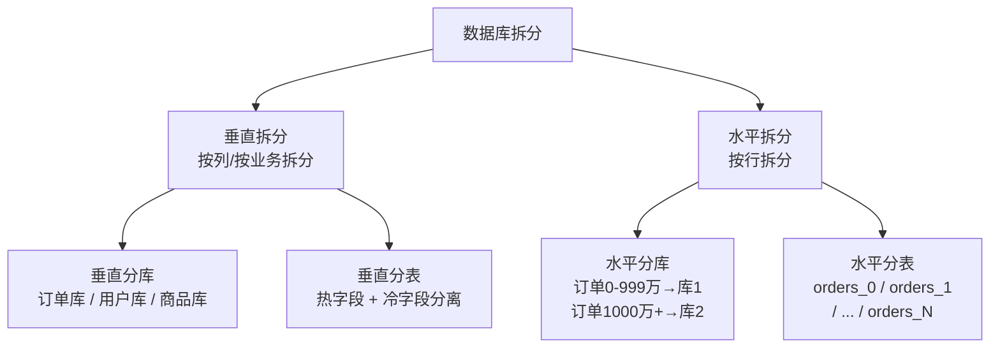
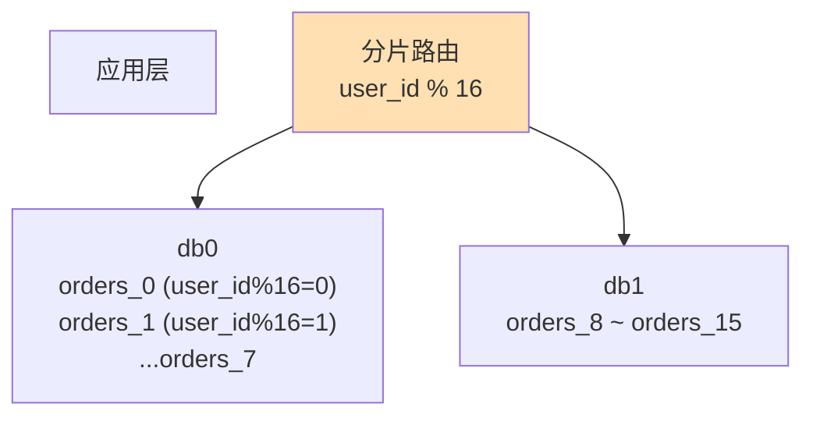
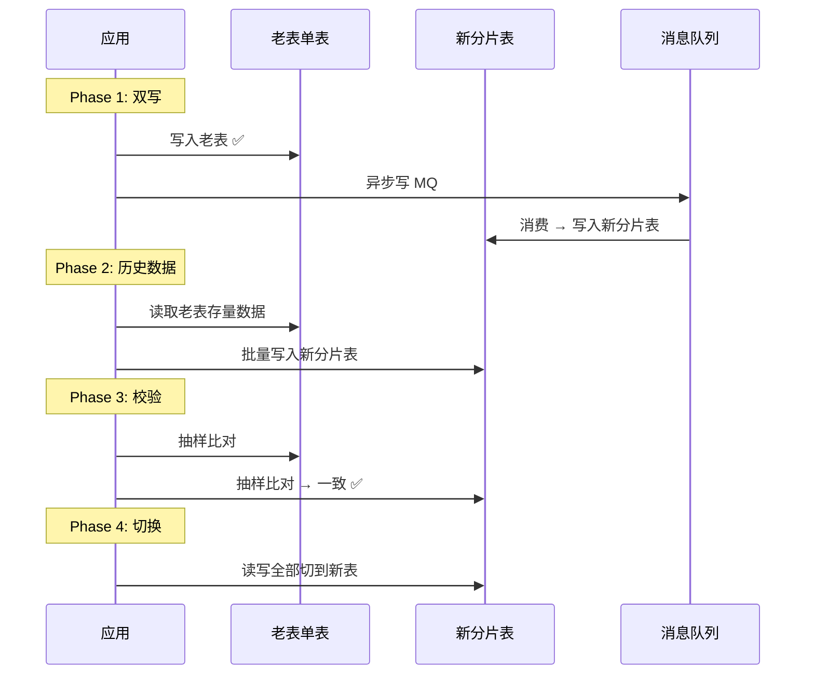
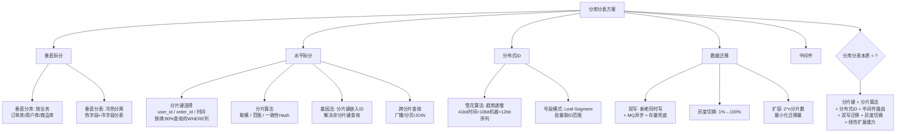

# 数据库分库分表方案

> 水平/垂直拆分、分片键选择、跨分片查询方案、数据迁移平滑策略

#### 目录介绍
- [01.工作案例引入](#01工作案例引入)
  - [1.1 订单表撑爆](#11-一张订单表撑爆了数据库)
  - [1.2 为何学分库分表](#12-为什么要学分库分表)
- [02.拆分方式概述](#02拆分方式概述)
  - [2.1 垂直vs水平](#21-垂直拆分-vs-水平拆分)
  - [2.2 分库vs分表](#22-分库-vs-分表)
- [03.垂直拆分](#03垂直拆分)
  - [3.1 垂直分库](#31-垂直分库按业务拆分)
  - [3.2 垂直分表](#32-垂直分表冷热分离)
  - [3.3 拆分代价](#33-垂直拆分的代价)
- [04.水平拆分](#04水平拆分)
  - [4.1 水平分库表](#41-水平分库分表)
  - [4.2 选分片键](#42-分片键的选择)
  - [4.3 分片算法](#43-分片算法)
  - [4.4 基因法](#44-基因法解决非分片键查询)
  - [4.5 冗余索引表](#45-冗余索引表方案)
- [05.跨分片查询](#05跨分片查询)
  - [5.1 精准路由](#51-分片键查询精准路由)
  - [5.2 全分片广播](#52-非分片键查询全分片广播)
  - [5.3 深度分页](#53-分页查询深度分页难题)
  - [5.4 聚合查询](#54-聚合查询)
  - [5.5 跨分片JOIN](#55-跨分片-join)
- [06.分布式ID生成](#06分布式id生成)
  - [6.1 不能自增](#61-为什么不能自增id)
  - [6.2 雪花算法](#62-雪花算法snowflake)
  - [6.3 号段模式](#63-号段模式)
- [07.数据迁移方案](#07数据迁移方案)
  - [7.1 停机迁移](#71-停机迁移)
  - [7.2 双写迁移](#72-双写迁移零停机)
  - [7.3 分片扩容](#73-分片扩容数据重分布)
- [08.中间件选型](#08中间件选型)
  - [8.1 代理vs客户端](#81-代理模式-vs-客户端模式)
  - [8.2 ShardingSphere-JDBC](#82-shardingsphere-jdbc)
- [09.综合案例](#09综合案例亿级订单表拆分)
  - [9.1 方案设计](#91-场景与方案设计)
  - [9.2 迁移流程](#92-迁移全流程)
  - [9.3 知识图谱](#93-知识图谱回顾)
- [10.思考题与作业](#10思考题与作业)
  - [10.1 基础思考题](#101-基础思考题)
  - [10.2 进阶思考题](#102-进阶思考题)
  - [10.3 动手作业](#103-动手作业)


## 01.工作案例引入

### 1.1 订单表撑爆

**场景**：大刘是一家电商公司的基础架构负责人。公司业务迅猛增长，订单表 `orders` 从年初的 500 万行涨到了 2 亿行。更可怕的是："双11"当天产生了 8000 万条订单记录，MySQL 单表快扛不住了。

```sql
-- 当前的 orders 表
CREATE TABLE orders (
    id BIGINT PRIMARY KEY AUTO_INCREMENT,
    user_id BIGINT NOT NULL,
    product_id BIGINT,
    amount DECIMAL(10,2),
    status VARCHAR(20),
    create_time DATETIME,
    -- ... 30+ 列
    INDEX idx_user_id (user_id),
    INDEX idx_create_time (create_time)
) ENGINE=InnoDB;
```

现象：单表查询 `SELECT * FROM orders WHERE user_id=?` 从 5ms 涨到 200ms，`COUNT(*)` 需要 30 秒，`ALTER TABLE` 跑了几小时还卡住。

**疑惑链条**：

- "加索引、优化 SQL 不就完了吗？" → 2 亿行的 B+Tree 高度 ~3-4 层，但每层的**数据量**已经大到 Buffer Pool 装不下 → 每次查询大概率磁盘 IO → 慢了不止一个数量级
- "读写分离呢？" → 读写分离解决**读**压力，但单表 2 亿行的**写**压力（每秒 5000 INSERT）让主库也吃不消——B+Tree 页分裂 + 索引维护 + redo log 写入 → 磁盘 IO 瓶颈
- "那怎么办？把数据拆到多张表？" → 对！这就是**水平分表**——2 亿行拆成 32 张表，每张 600 万行 → B+Tree 高度下降 + Buffer Pool 命中率上升 + 写入分散到多个磁盘
- "按什么拆？拆完之后怎么查？" → 这是本章的核心——**分片键选择 + 分片算法 + 跨分片查询**

### 1.2 为何学分库分表

```
单表性能的天花板:
  索引原理(第2章): 优化单表查询
  锁机制(第4章):   优化单表并发
  主从复制(第8章): 扩展读能力

  但所有优化都绕不开一个物理极限:
    → 一张 InnoDB 表超过 2000 万行后, B+Tree 的维护成本急剧上升
    → 单库的写入 TPS 有上限(磁盘 IO + 锁竞争)
    → 唯一的破局方式: 把数据拆到多个库/多张表

分库分表 = 数据库的"横向扩展"
```


## 02.拆分方式概述

### 2.1 垂直vs水平



| 维度 | 垂直拆分 | 水平拆分 |
|------|---------|---------|
| 拆的是什么 | **列**（字段） | **行**（记录） |
| 解决的问题 | 表太宽、业务耦合 | 表太大、写入瓶颈 |
| 拆分后 | 每个表列数变少 | 每个表行数变少 |
| 复杂度 | 低（应用层 JOIN 变多） | 高（跨分片查询） |

### 2.2 分库vs分表

```
分表不分离: orders → orders_0, orders_1, ..., orders_15
  → 还在同一个 MySQL 实例 → 共享同一个物理机的 CPU/内存/磁盘
  → 解决单表行数过大的问题, 但不解决单库写入TPS瓶颈

分库+分表: orders → db0.orders_0~7, db1.orders_8~15
  → 分散到多个 MySQL 实例 → 每个实例独立 CPU/内存/磁盘
  → 解决单表行数 + 单库写入TPS 两大问题
  → 一般 8 表/库, 需要多少库 = 总表数/8
```

**成本优先级**：单表行数大 → 先分表；写入 TPS 瓶颈 → 必须分库；存储容量不够 → 必须分库。


## 03.垂直拆分

### 3.1 垂直分库

```
拆分前(单体库):
  一个数据库: shop_db
    ├── orders (订单表)
    ├── users (用户表)
    ├── products (商品表)
    ├── payments (支付表)

拆分后(微服务库):
  订单库(order_db):  orders, order_items
  用户库(user_db):   users, user_address
  商品库(product_db): products, product_skus
  支付库(pay_db):    payments, payment_logs

优势: 每个服务独立数据库 → 独立扩缩容、独立备份
代价: 跨库 JOIN 不能用了 → 需要应用层聚合或数据冗余
```

### 3.2 垂直分表

```
拆分前: products 表 (40+ 列)
  id, name, price, stock,            ← 热字段: 频繁查询
  description(TEXT, 2KB),            ← 冷字段: 偶尔才读
  detail_html(TEXT, 10KB),           ← 冷字段
  ...

拆分后:
  products(热表): id, name, price, stock, category_id, create_time
  products_detail(冷表): product_id, description, detail_html, specs_json

优势: 热表行更紧凑 → Buffer Pool 能装更多热行 → 命中率↑
      冷字段不参与全表扫描 → SELECT * 时只扫描热表
```

### 3.3 拆分代价

```
之前: SELECT * FROM products WHERE id = 10;
之后: SELECT p.*, pd.description FROM products p
      JOIN products_detail pd ON p.id = pd.product_id
      WHERE p.id = 10;

代价清单:
  ① 原本一条 SQL → 现在 JOIN 或两次查询
  ② 原来一个事务内改两列 → 现在跨表更新
  ③ 分布式事务 → CAP 理论 → 数据一致性代价
```

**探索性问题**：垂直分表后为什么不把冷热表放在不同数据库实例？

```
冷热表放不同实例:
  热表在 SSD 高速实例 → 查询快
  冷表在 HDD 低价实例 → 存储便宜

但代价: 每次需要读冷字段时 → 跨实例 JOIN(网络开销 ~1ms)
如果你的业务 99% 的查询只读热字段 → 值得!
如果经常一起查 → 得不偿失
```


## 04.水平拆分

### 4.1 水平分库表



```
2 亿行 orders → 2 个库 × 8 张表 = 16 张表
  每张表: 2亿/16 ≈ 1250 万行 → B+Tree 高度约 2-3 层
  每库写入: 5000/s ÷ 2 = 2500/s → 单库压力减半
  
分片规则: user_id % 16
  同一用户的订单始终在同一张表 → 用户查自己的订单只需路由到一张表
```

### 4.2 选分片键

**分片键（Sharding Key）** 是水平拆分最核心的决策——选错了代价极高：

| 候选分片键 | 路由精准度 | 数据均匀度 | 业务适配度 | 评价 |
|----------|:---:|:---:|:---:|------|
| `user_id` | ⭐⭐⭐ 用户查自己 | ⭐⭐ 大 V 有倾斜 | ⭐⭐⭐ | 最常用 |
| `order_id` | ⭐ 查询需要先知道 id | ⭐⭐⭐ | ⭐⭐ | 适合按订单号查 |
| `create_time` | ⭐⭐ 按时间范围 | ⭐⭐⭐ 天然均匀 | ⭐⭐ | 老数据冷、新数据热 |
| `merchant_id` | ⭐⭐⭐ | ⭐ 大商户集中 | ⭐⭐ | 容易热点倾斜 |

**选分片键的铁律**：

```
① 必须是大多数查询的 WHERE 条件列
   如果 80% 的查询是 WHERE user_id=?, 就用 user_id 做分片键

② 数据分布尽量均匀
   user_id 按 hash 取模天然均匀, 商户ID可能导致大商户单表过大

③ 尽量是主键的一部分
   订单表的主键可以设计为 (user_id, order_id) 联合主键
   → 既满足分片, 又能实现聚簇索引的用户级局部性
```

### 4.3 算法

**算法一：取模（最常用）**

```sql
-- user_id % 16 → 分 16 个分片
-- 分片 = user_id % 16
-- 优点: 数据绝对均匀
-- 缺点: 扩容需要 rehash (全部数据重新分布)
```

**算法二：范围分片**

```
-- 按 user_id 范围
-- db0: user_id 1-1000万
-- db1: user_id 1000万-2000万
-- 路由: 查路由表 → 知道 user_id=1500万 在 db1

优点: 扩容只需迁移部分数据 (新范围)
缺点: 数据不一定均匀, 需要维护路由表
```

**算法三：一致性哈希**

```
一致性哈希环:
  物理节点和数据都映射到同一个 hash 环上
  数据存到顺时针最近的物理节点

扩容时只迁移受影响的部分数据 → 最小化迁移量
适用于物理节点频繁变动的场景
```

### 4.4 基因法

**疑惑：分片键是 `user_id`，但我需要按 `order_id` 查——没有 `user_id` 怎么知道去哪张表？**

**答疑**：**基因法（或称"分片键注入"）**——把分片键的信息编码进 `order_id` 中：

```
雪花算法生成 order_id: 64位
  ┌─────┬───────────┬───────┬──────────┐
  │1bit │ 41bit     │10bit  │ 12bit    │
  │符号位│ 时间戳    │机器ID  │ 序列号    │
  └─────┴───────────┴───────┴──────────┘

改造: 用后 10bit 嵌入 user_id%1024 作为分片基因
  order_id = snowflake_id | (user_id % 1024)

查询时: 从 order_id 的末 10bit 反推分片号
  shard = order_id & 0x3FF   → 直接定位分片!

优势: 不需要查 "order_id→user_id" 的映射表
代价: 序列号从 12bit 缩到 2bit(4个序号/ms) → 单机QPS上限降低
      但实际可以用更多位(比如 16bit 基因 → 65536 分片)
```

### 4.5 冗余索引表

基因法只能解决**能从生成规则反推**的场景。如果必须按非分片键的任意列查询（如按 `product_id` 查订单），需要**冗余索引表**：

```
原理: 维护一个 product_id → (user_id, order_id) 的映射表
  ① 写入 orders 表时, 同步写一条到 product_order_idx 表
  ② 查询 WHERE product_id = ? → 先查索引表得到 (user_id, order_id)
     → user_id 是分片键 → 路由到对应分片 → 查 orders 表

索引表可以按 product_id 单独分片:
  product_order_idx 按 product_id 分 16 张表
  orders 按 user_id 分 16 张表

代价: 写入时多写一张索引表 → 分布式事务问题
```


## 05.跨分片查询

### 5.1 精准路由

能带上分片键的查询是最理想的情况：

```sql
-- user_id 是分片键 → 路由到确定的一张表
SELECT * FROM orders WHERE user_id = 12345 AND status = 'paid';
-- 分片 = 12345 % 16 = 1 → 直接查 orders_1

-- 分片中间件自动做这个路由 → 对业务透明
```

### 5.2 全分片广播

没有分片键 → 必须在所有分片上执行 → 结果合并：

```sql
-- 按 product_id 查 → 不知道在哪个分片 → 全分片扫描
SELECT * FROM orders WHERE product_id = 888;
→ 在 16 个分片上都执行 → 合并 16 个结果集

性能: 1次查询 → 16次查询(并行) → 网络开销 + 内存合并
极限: 分片越多 → 性能越差 → 这就是为什么要控制分片数
```

### 5.3 深度分页

**疑惑：`LIMIT 10000, 20` 在分库分表下怎么办？**

单表时都慢的深度分页，分库分表后更灾难：

```
SELECT * FROM orders WHERE user_id IN (...) ORDER BY create_time DESC LIMIT 10000, 20;

传统做法: 每个分片取前 10020 条 → 合并 16 × 10020 = 160320 条 → 内存排序 → 取 10000-10019
  → 网络传输 16 万条数据 → 内存爆了!

优化方案:
  ① 禁止跳页: 只允许"上一页/下一页" → 用游标(WHERE create_time < last_time)
  ② 二次查询法:
     第一次: 每个分片取 20 条 → 比较所有分片的最小 create_time = T_min
     第二次: 每个分片取 create_time < T_min 的前 20 条 → 再合并
     → 虽然还是两次, 但每次只取 20 + 20 × 16 = 340 条
  ③ ES/HBase: 搜索场景同步到 ES → 分页走 ES → 拿到 ID 列表再回数据库查
```

### 5.4 聚合

```sql
-- COUNT(*) → 需要每个分片单独 COUNT → 应用层求和
-- 不能直接用 SELECT COUNT(*) FROM orders → 分库分表下这条路堵死了

-- 方案: 定时任务跑 SUM → 写入统计表 → 查询时读统计表
-- 或: 用 Redis 做实时计数器 (写入时 INCR)
```

### 5.5 跨分片JOIN

```
分库分表后的 JOIN 三策略:

① 分片键相同 → 同类表共分片
  orders 和 order_items 都用 user_id 分片 → 同一个用户的订单+明细在同一分片
  → 本地 JOIN 可行!

② 应用层 JOIN
  第一次查 orders 表拿 order_id 列表
  第二次查 order_items 表 → 应用层代码合并

③ 冗余字段 + 最终一致性
  order_items 表中冗余存 user_id → 按 user_id 分片
  代价: 冗余数据 + 需要保证一致性
```


## 06.分布式ID生成

### 6.1 不能自增

```
AUTO_INCREMENT 在分库分表下不行:
  db0.orders: id=1,2,3...
  db1.orders: id=1,2,3...  ← 主键冲突!
  
  即使分表不分库 → 自增ID仍然按表独立的序列
  → 将来如果要合并数据 → ID 全冲突
```

### 6.2 雪花算法

```
Snowflake ID (64bit):
┌──────┬─────────────────────┬───────────┬────────────┐
│ 1bit │ 41bit 时间戳(毫秒)   │ 10bit机器ID│ 12bit序列号  │
│ 符号位│ 可用69年             │ 1024个节点 │ 4096/ms/节点 │
└──────┴─────────────────────┴───────────┴────────────┘

优势:
  ① 全局唯一
  ② 趋势递增 → 对 InnoDB 的 B+Tree 友好 (近似追加)
  ③ 单机 4096 × 1000 = 409 万 QPS → 足够用
  ④ 包含时间戳 → 天然按时间排序

缺点:
  ① 依赖机器时钟 → 时钟回拨可能导致 ID 重复
     → 解决方案: 美团 Leaf 的"号段模式" + 时钟回拨检测
  ② ID 长度 19 位 → 比自增 ID 更长 → 索引占用空间更大
```

### 6.3 号段模式

美团 Leaf 的号段模式是一种生产级方案，每次从数据库批量取一段 ID 范围缓存在本地：

```
号段模式 (美团 Leaf-Segment):
  数据库中维护一张 segment 表:
    biz_tag: 'order'
    max_id: 100000
    step: 1000

  应用启动: UPDATE max_id = max_id + 1000, 拿到 (100001-101000) 这 1000 个 ID
  用完后: 再取下一段

优势: 对数据库依赖低(每 step 次才访问一次), 号段内单机递增
```


## 07.数据迁移方案

### 7.1 停机迁移

最安全但也最原始——窗口期内停止写入，全量迁移：

```
步骤:
  ① 发布停服公告 (凌晨 2:00-4:00)
  ② STOP 写入
  ③ mysqldump 导出全量数据
  ④ 数据转换、分片计算、导入多个目标表
  ⑤ 验证数据完整性
  ⑥ 切换数据源、重启应用 → 恢复服务

优点: 简单、一致性好
缺点: 停机窗口, 数据量大时时间不够
```

### 7.2 双写迁移

**这是生产环境最常用的在线迁移方案**：



```
① 双写阶段: 新写入同时写老表和新分片表 (异步)
   如果异步失败 → MQ 重试
   同时通过定时任务做存量数据的"补齐"

② 历史迁移: 分批把老表存量数据搬到新分片表
   每次取 1000 条 → 分片计算 → 写入对应分片

③ 一致性校验: 每天凌晨对比老表和新分片表的 COUNT / CHECKSUM
   不一致的 → 补一条

④ 灰度切换: 1% → 10% → 50% → 100% 逐步切流量到新表

⑤ 清理: 稳定运行 2 周后 → DROP 老表
```

### 7.3 分片扩容

当现有分片不够用（如从 16 片扩到 32 片）时，需要数据**重分布（resharding）**：

```
扩容 16 → 32:
  旧规则: user_id % 16
  新规则: user_id % 32

  数据迁移策略:
    双写阶段: 同时按 %16 和 %32 双写
    存量迁移: user_id % 16 = 0 的数据 → 有一部分要迁到新分片 16
              user_id % 32 如果是 0 → 留在分片 0
              user_id % 32 如果是 16 → 迁移到分片 16

  最小化迁移的秘诀:
    使用 2^n 分片数: 16 → 32 只需迁移一半数据
    如果 10 → 20 (非2^n) → 需要迁移 80% 数据!
```


## 08.中间件选型

### 8.1 代理vs客户端

| 模式 | 代表 | 部署 | 性能 | 复杂度 |
|------|------|------|------|:---:|
| **客户端模式** | ShardingSphere-JDBC | jar 包嵌入应用 | 最高(无网络开销) | 中 |
| **代理模式** | ShardingSphere-Proxy, MyCAT | 独立中间件进程 | 多一跳网络(~1ms) | 低(对应用透明) |

```
客户端模式: 应用 →(直接)→ 各个数据库分片
  优点: 没有中间层延迟, 性能最高
  缺点: 每个应用都要引入 jar 包, 升级麻烦

代理模式: 应用 → ShardingSphere-Proxy → 各个数据库分片
  优点: 应用无感知, 就像连单库一样
  缺点: 多一跳网络延迟, Proxy 本身需要高可用
```

### 8.2 ShardingSphere-JDBC

```yaml
# 分片配置示例 (YAML)
dataSources:
  ds0: { url: jdbc:mysql://10.0.1.0:3306/order_db0 }
  ds1: { url: jdbc:mysql://10.0.1.1:3306/order_db1 }

rules:
  - !SHARDING
    tables:
      orders:
        actualDataNodes: ds$->{0..1}.orders_$->{0..7}  # 2库×8表
        databaseStrategy:
          standard:
            shardingColumn: user_id
            shardingAlgorithmName: db-inline
        tableStrategy:
          standard:
            shardingColumn: user_id
            shardingAlgorithmName: tbl-inline

    shardingAlgorithms:
      db-inline:
        type: INLINE
        props: { algorithm-expression: ds$->{user_id % 2} }
      tbl-inline:
        type: INLINE
        props: { algorithm-expression: orders_$->{user_id % 8} }
```


## 09.综合案例

### 9.1 方案设计

回到大刘的案例——2 亿行 orders 表，目标拆分为 16 个分片：

```
方案设计:
  分片键: user_id (80% 查询都带)
  分片数: 2 库 × 8 表 = 16 分片
  分片算法: user_id % 16
  分布式ID: 雪花算法 (改造版, 嵌入 user_id%16 基因)
  迁移方式: 双写 + 存量迁移 + 灰度切换
```

### 9.2 迁移流程

| 阶段 | 操作 | 耗时 | 风险 |
|------|------|:---:|------|
| ① 双写 | 新写入同时写老表 + 新分片表(MQ异步) | 2周 | 低(异步, 失败重试) |
| ② 存量迁移 | 分批迁移老数据(1000条/批) | 3天 | 低(限流, 不影响在线) |
| ③ 校验 | 每日抽样比对 COUNT + CHECKSUM | 3天 | — |
| ④ 灰度切读 | 1%→10%→50%→100% 切读流量 | 1周 | 中(监控延迟和报错) |
| ⑤ 全量切写 | 写流量切到新表, 老表只保留兜底 | 1天 | 高(观察双写一致性) |
| ⑥ 清理 | 2周观察期后清理老表 + 下线双写 | 2周 | 低 |

```
迁移效果:
  单表行数: 2亿 → 1250万/表
  单条查询延迟: 200ms → 5ms
  写入TPS: 5000 → 10000+(两库分摊)
  Buffer Pool命中率: 75% → 98%
```

### 9.3 知识图谱



**最终方法论——分库分表决策树**：

1. **能不能不分？** → 先优化 SQL/加索引/读写分离/加缓存
2. **能不能只垂直拆分？** → 按业务拆库（微服务化）
3. **必须水平拆分时** → 选分片键（80% 查询的 WHERE 条件列）→ 选算法（取模最简单）→ 实现分布式 ID（雪花/号段）→ 引入中间件（ShardingSphere）
4. **迁移时** → 双写 + 存量 + 灰度 → 零停机


## 10.思考题与作业

### 10.1 基础思考题

1. **垂直拆分 vs 水平拆分**：用自己的话解释什么时候用垂直拆分、什么时候用水平拆分。一张表又宽又大怎么办？

2. **分片键的选择**：`orders` 表有 `user_id`、`order_id`、`create_time` 三个候选——分别做分片键的优缺点是什么？为什么绝大多数场景用 `user_id`？

3. **取模 vs 范围分片**：两种算法的优缺点——为什么取模扩容时要迁移 50%+ 数据而范围分片只需迁移新增部分？

4. **基因法原理**：为什么要在 order_id 中嵌入 `user_id % 1024`？如果不是雪花算法而是 UUID 做主键——还能用基因法吗？

5. **跨分片 COUNT**：分库分表后 `SELECT COUNT(*) FROM orders` 怎么实现？写出至少两种可行方案的思路。

### 10.2 进阶思考题

1. **1.1 节复盘**：大刘的 2 亿行订单表——如果只做读写分离不做分库分表，Buffer Pool 命中率为什么还是会下降？这和 B+Tree 的内部节点/叶子节点的比例有什么关系？

2. **双写的一致性问题**：双写迁移阶段——MQ 异步写新分片表时失败了怎么办？如果新分片表写入成功但老表回滚了又怎么办？（分布式事务）

3. **动态扩容的平滑方案**：16 → 32 分片的扩容——数据迁移量是多少？有没有办法让迁移期间线上查询不受影响？（提示：v1 规则 + v2 规则双查）

4. **分片键变更**：如果一开始用 `user_id` 做分片键，后来发现 50% 的查询按 `merchant_id`——怎么过渡到用 `merchant_id` 做分片键？能不能同时支持两个分片键？

5. **TiDB vs 分库分表**：TiDB 等 NewSQL 数据库号称不需要分库分表——它的自动分片机制和手动分库分表有什么本质区别？什么场景下还是必须手动分？

### 10.3 动手作业

**作业一（必做）**：用 ShardingSphere-JDBC 搭建一个分库分表演示。

```
数据模型:
  orders: id, user_id, product_id, amount, status, create_time
  order_items: id, order_id, product_id, quantity

分片配置:
  orders: 2库 × 4表, 按 user_id % 8
  order_items: 与 orders 共分片 (按同一 user_id, 保证本地 JOIN)

验证:
  ① INSERT 1000 条 → 检查各分片数据量
  ② SELECT WHERE user_id = ? → 确认精准路由到一张表
  ③ SELECT WHERE product_id = ? → 确认广播到所有分片
```

**作业二（选做）**：实现基因法。

用 Java/Go/Python 写一个雪花算法 ID 生成器，在生成的 ID 中嵌入 `user_id % 1024` 作为分片基因。测试：给定一个嵌入了基因的 order_id → 能否还原出分片号？

**作业三（选做）**：模拟双写迁移。

用两个 MySQL 实例（老表单表 + 新分片表），写一个迁移脚本：双写新数据 + 分批迁移存量 + 实时校验一致性。

**作业四（架构思考）**：对你当前项目的数据增长趋势做一个预估——如果单表每年增长 5000 万行——多久需要分库分表？如果现在设计，你会选什么分片键？用什么分片算法？迁移方案是什么？