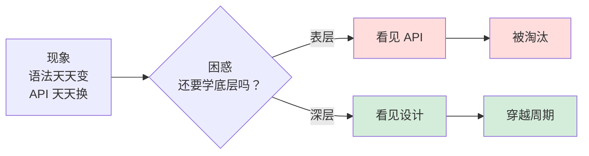
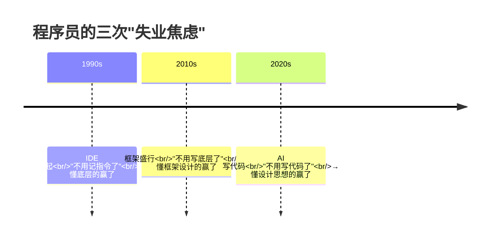
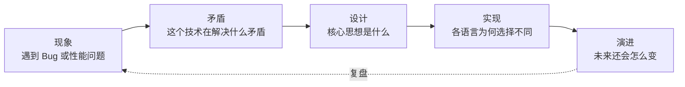

# 专栏的导读和绪论

> 语言在更新，框架在迭代，AI 都能写代码了——**学"老底层"还有意义吗？** 为何要懂底层设计思想？这篇文章回答这个问题，也交代整个专栏的方法论、承诺与阅读路径。

---

## 要看懂这篇导读



---

## 1.根本矛盾和焦虑

### 1.1 一个真实的场景

我见过太多这样的工程师：

- 会用 `synchronized`，但说不清为什么"锁会升级"；
- 会写 `async/await`，但不知道"挂起点"到底挂起了什么；
- 会调 `ThreadPoolExecutor` 参数，但从没想过线程池为什么要设计一个 `ctl` 变量；
- 会用 `ConcurrentHashMap`，但看到 Go 的 `sync.Map`、C++ 的 `concurrent_hash_map`，依然觉得"这是完全不同的东西"。

他们焦虑的并不是"我不会某个 API"，而是：**"我学的东西，5 年后还值钱吗？"**

### 1.2 这个焦虑的根源

技术栈的寿命正在急剧缩短：

| 时代 | 代表技术 | 寿命 |
|------|---------|------|
| 1990s | C / Unix / MFC | **30 年+** |
| 2000s | Java / .NET / PHP | **20 年+** |
| 2010s | Android / iOS / Node.js | **10-15 年** |
| 2020s | Flutter / RN / Electron | **5-10 年**？ |
| AI 时代 | LangChain / Agent / MCP | **？** |

表层 API 的半衰期正在趋近于 3 年。但是**底层设计思想的半衰期是 30 年以上。**

**进程 / 线程 / 锁 / CAS / 事件循环 / GC / 所有权**——这些概念 1970s 诞生，2020s 依然是面试题、依然是高薪岗位的分水岭、依然决定你能不能看懂 Go 新版本的 runtime、能不能调出 Rust 编译器的报错。

### 1.3 为何要看该专栏

很多读者打开底层书的第一个问题不是"看不懂"，而是"**为什么要看？**"：写业务代码十年，没碰过 JVM、没写过线程池底层，不也照样发版？

AI 时代代码自动生成，还有必要懂指针、懂 GC、懂事件循环吗？框架天天换，今年是 React 明年是 Solid，学"原理"不是徒劳吗？

序卷给你三个不绕弯的回答：

1. **能写"会跑的代码"和能写"不出事的代码"是两件事**——后者只能靠原理。
2. **语法在变，但矛盾不变**——线程通信 1965 年的矛盾今天还在，知道矛盾就能看穿任何新框架。
3. **"看见设计"是工程师不可被替代的能力**——AI 能写代码，但回答不了"为什么要这样设计"。

---

## 2.为什么非学不可

### 2.1 工业革命下的程序员



每一次"生产力革命"都在淘汰"只会一层"的工程师。

- IDE 淘汰的是"背指令的人"，留下的是"懂编译原理的人"；
- 框架淘汰的是"抄 API 的人"，留下的是"懂框架为什么这么设计的人"；
- **AI 淘汰的是"写胶水代码的人"，留下的是"能定义问题、能判断设计对错的人"**。

### 2.2 本专栏的定位

市面上主流的底层文章有三种：

| 类型         | 代表 | 问题 |
|------------|------|------|
| **单语言深挖**  | "Java 并发编程实战"、"C++ 内存管理" | **换语言就失效** |
| **面试八股文**  | "JVM 十问"、"多线程面试题" | **只背结论，不懂为什么** |
| **翻译 RFC** | "深入 Linux 内核"类译作 | **太硬核，没有跨语言视角** |

本专栏的位置是**第四种**：**跨语言对比 × 只问矛盾 × 看演进史**

看见 Java `ConcurrentHashMap` 和 Go `sync.Map` 背后是**同一个"分段锁"**；
看见 Kotlin 协程和 C++20 协程都是**同一个"CPS 状态机变换"**；
看见 Rust 的 Ownership 和 C++ 的 RAII 都在**解决同一个矛盾**——资源的释放时机。

**这就是"看见设计，而不是语法"的含义。**

---

## 3.每篇都做到3件事

### 3.1 至少对比3种语言

不是"Java 并发"、"C++ 并发"、"Go 并发"各写一篇，而是**一篇文章里把三种语言放一起对比**：

| 维度 | Java | C++ | Go |
|------|------|-----|----|
| ... | ... | ... | ... |

这才是跨语言视角——让读者一眼看出"共性"与"差异"。

### 3.2 开头必有"根本矛盾"

所有技术设计的源头都是**一对矛盾**。

- 锁 = `并发访问` vs `数据一致`；
- 协程 = `写得像同步` vs `跑得像异步`；
- GC = `自动释放` vs `可预测性能`；
- 泛型 = `类型安全` vs `代码复用`；
- 引用计数 = `确定性释放` vs `循环引用`。

看懂矛盾，你就拿到了"一把万能钥匙"——任何新语言的新特性，都是在这对矛盾上做新的折中。

### 3.3 每篇必有"时间轴"


**为什么现在是这样**——只有看演进，才能真正回答。

### 3.4 贯穿的思维方法



**理解矛盾 → 理解设计 → 理解实现 → 理解演进**——这条闭环在后续每一卷都会反复出现。

---

## 4.阅读方法｜三条路径

专栏有 50+ 篇，没必要从头啃到尾。**三条路径任选一条：**

### 4.1 路径 A｜建立整体观（新手）

**目标**：先有"整本书的骨架"，再补细节。

```
0A 导读 → 00 数据编码 → 01 字符串 → 07 类加载
      → 11 线程由来 → 15 并发设计 → 22 单线程模型
      → 25 线程池 → 31 内存模型 → 41 消息机制
```

读完这 10 篇，你会拥有一张**计算机系统的心智地图**。**学完能做到**：理解程序"从启动到运行"的全景，但不深入硬核细节。

### 4.2 路径 B｜深入核心矛盾（进阶）

**目标**：已经会用，想知道"为什么"。

```
04 泛型 → 09 方法分派 → 18 锁设计 → 19 上下文切换
      → 20 CAS → 21 异步同步 → 23 协程 → 24 Actor/CSP
      → 33 GC → 34 引用类型 → 36 所有权/RAII → 50 分层全景
```

读完这 12 篇，你看任何新语言的 runtime 源码都不会害怕。**学完能做到**：能从硬件指令推导到语言并发原语，能看懂大多数主流框架的源码。

### 4.3 路径 C｜面试冲刺

**目标**：3 周突击一线大厂。

```
03 值与引用 ｜ 04 泛型 ｜ 15 并发三大核心 ｜ 16 并发三大Bug
17 并发安全 ｜ 18 锁升级 ｜ 20 CAS/ABA ｜ 27 线程池原理
33 GC 演进 ｜ 34 四种引用
```

这 10 篇覆盖了 80% 的高频考点，并且**理解深度足以应对任何追问**。面试官问到任何并发或 JVM 内存问题，都能从根因出发回答。

### 4.4 三种推荐读法

```
🟢 通读型：序卷 → 第1卷 → 第2卷 → 第3卷 → 第4卷 → 第5卷。建议每天 1 篇，持续 50 天

🟡 围猎型：先读序卷，再带着具体问题去找对应章节。例如最近被 OOM 困扰 → 直接跳第4卷

🔴 突击型：序卷 + 第3卷 + 第4卷。面试前 7 天集中突破并发与内存
```

## 5.整体设计哲学

### 5.1 设计5卷的结构


这 5 卷不是随便拼凑的"知识点合集"——它们之间有严格的**逻辑递进**：

| 卷 | 回答的问题 | 在专栏中的位置 |
|---|---|---|
| **第 1 卷·数据的本质** | 程序的"原料"——0/1 怎么变成有意义的信息 | 一切的基础 |
| **第 2 卷·运行时模型** | 程序"跑起来"——类、对象、栈帧、字节码、JIT 怎么协作 | 单线程世界的全景 |
| **第 3 卷·并发之道** | 多线程后的所有矛盾——可见性、原子性、有序性、协程、Actor、CSP | 全书最重，连接前后 |
| **第 4 卷·内存的真相** | 程序的"物理基础"——虚拟内存、GC、引用、缓存、泄漏诊断 | 性能问题的源头 |
| **第 5 卷·交互与系统** | 程序的"上层世界"——窗口、渲染、事件、消息、IPC、加密 | 应用层的设计基石 |

### 5.2 三大独家承诺

```text
① 跨语言对比：每篇至少对比 3+ 种语言/平台
② 只问矛盾：不背 API，只讲"这个设计解决了什么矛盾"
③ 看演进史：让你看见"为什么是这样"
```

---

## 6.常见疑问的说明

### Q1：需要看"跨语言"吗？

**要**。原因：

- **跨语言视角让你看清"哪些是本质、哪些是语法糖"**；
- 面试官最爱问"你们 Java 的锁，跟 Go 的锁有什么区别"——这种问题只有跨语言视角能答；
- 一旦跳槽技术栈，别人需要半年重新学，你只需要一周。

### Q2：这些东西 AI 不是都能回答吗？

AI 能回答**表层问题**——"ConcurrentHashMap 是什么"、"怎么用"。

但 AI 答不好的是：

- "为什么 Java 1.7 的 ConcurrentHashMap 是分段锁，1.8 改成 CAS + synchronized？**哪种更好？为什么？**"
- "协程在 Kotlin 里为什么是 suspend 函数，在 Go 里却是 go 关键字？**这两种选择的取舍是什么？**"

**AI 给你答案，但人判断答案好坏**。判断力从哪来？从对"设计思想"的理解来。

### Q3：学完专栏我能得到什么？

- **看源码的速度**：3-5 倍提升。看任何开源框架，能直接找到"核心矛盾"和"关键折中"。
- **设计能力**：从"写代码实现需求"升级到"定义问题 + 设计结构"。
- **迁移能力**：换技术栈从 6 个月缩短到 1-2 周。
- **面试表现**：高频考点有**深度认知**，能扛住 3 轮追问。

### Q4：需要先具备什么基础？

- 熟悉至少一门主流语言（Java / C++ / JS / Python / Go 任一）；
- 懂基础数据结构（数组、链表、哈希表、树）；
- 不要求懂操作系统，但懂一点会读得更快。

---

## 7.一句话总结

**语法会过时，框架会淘汰，但"设计思想"穿越周期。**

> 这个专栏不教你"怎么用某个 API"，**而是教你"看见 API 背后的设计"**——
> 这样，无论 5 年后语言怎么变、AI 怎么进化，**你依然是那个能做判断、能定方向的人**。
