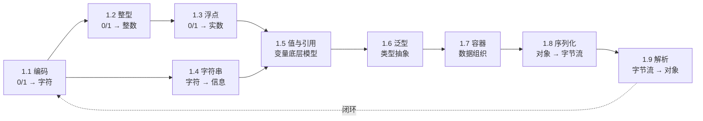

# 第 1 卷｜数据的本质

> **万物起源**——计算机如何用有限的位表示无限的信息？这是所有上层设计的源头。

---

## 🎯 这一卷要回答什么

业务里你天天用 int、String、List、JSON、泛型——但能回答下面这些"小问题"吗？

- 为什么 `(start + end) / 2` 这种"看起来人畜无害"的写法会引发线上事故？补码到底解决了什么？
- 为什么 `"abc" == "abc"` 在 Java 里是 true，在 JS 里也是 true，但**机制完全不同**？
- 为什么 `0.1 + 0.2 ≠ 0.3` 是全世界 CPU 共同的"病"，而不是某门语言的 bug？
- 为什么 ArrayList 用 `contains` 在百万级数据下会把服务打挂？容器选择背后是哪一组权衡？
- 为什么 Java 的泛型是"假泛型"，C++ 是"真泛型"，Go 又是另一种实现？
- 同样的对象，序列化成 JSON 是 200 字节，序列化成 Protobuf 是 30 字节——差的 170 字节去哪了？
- 同一个 JSON 解析器，为什么 simdjson 比 Jackson 快 100 倍？

这一卷不是讲 API，是讲**这些数据结构当年是为了什么矛盾被发明的**。

---

## 📖 篇章总览（9 篇）

| 序号 | 文档 | 核心矛盾 |
|------|------|---------|
| 1.1 | [数据编码设计原理](https://yccoding.com/pages/27269c/) | 全人类文字如何在 0/1 上达成共识？ASCII → Unicode → UTF-8 |
| 1.2 | [整型与位运算原理](https://blog.csdn.net/m0_37700275/article/details/161518459) | 为什么是补码？整数溢出与位运算背后的硬件约束 |
| 1.3 | [浮点型数据设计灵魂](https://blog.csdn.net/m0_37700275/article/details/161518694) | IEEE 754 是工程妥协而非数学真理 |
| 1.4 | [字符串设计的灵魂](https://yccoding.com/pages/4322cf/) | 为何字符串要不可变？常量池、StringBuilder 的真正动机 |
| 1.5 | [值类型与引用设计](https://yccoding.com/pages/429d17/) | 值传递、引用传递、共享可变状态的本源 |
| 1.6 | [泛型设计灵魂思想](https://yccoding.com/pages/f4bb3e/) | 类型擦除 vs 单态化——同一个目标的两条工程路线 |
| 1.7 | [集合容器设计原理](https://yccoding.com/pages/710953/) | 数组 / 链表 / 哈希 / 树——一组关于时间空间的根本权衡 |
| 1.8 | [序列化数据的思想](https://yccoding.com/pages/9de8b4/) | JSON / XML / Protobuf / Thrift 的体积与可读性 trade-off |
| 1.9 | [数据解析设计思想](https://yccoding.com/pages/6c6e3e/) | 词法 / 语法 / SIMD —— 解析器为何能差出 100 倍 |

---

## 🔗 知识脉络

数据从最底层的 0/1 编码出发，一路抽象到泛型与容器，再以序列化"压扁"回字节流，最后由解析器"还原"——**这是一条完整的数据生命周期回路**。

---

## 🌉 与其他卷的承接

- **承接序卷**：序卷讲"为什么学"，本卷给出第一个具体的"什么"——数据。
- **通往第 2 卷**：第 2 卷讲"对象怎么活在内存里"，必须先理解本卷的"数据怎么被表示"。
- **回响第 4 卷**：序列化 / 拷贝 / 容器内存布局在第 4 卷会被再次提及，但视角从"数据格式"转到"内存与缓存"。

---

## 💡 学完你能回答

- 一个 emoji 占几个字节？为什么 MySQL utf8 不能存 emoji？
- 为什么 `int` 加法会"绕回"，编译器为何敢于据此做激进优化？
- `String s = "a" + "b"` 在编译期会发生什么？
- HashMap 的负载因子为何是 0.75？rehash 的代价从何而来？
- Java 泛型的擦除带来了哪些"看似不合理"的限制？
- 为什么大公司内部 RPC 大多用 Protobuf 而不是 JSON？
- 100MB 的 JSON 在浏览器里为什么会卡住主线程？怎么破？
