# 2.1 类加载机制核心原理

📍 **本篇位置**：第 2 卷 · 运行时模型 · 第 1 篇（开卷起源篇）

🎯 **核心矛盾**：**静态字节码 vs 动态运行实体** —— 磁盘上躺着的一坨字节，怎么变成内存里活生生的、能 `new` 能 `invoke` 的"类"？

🧭 **设计灵魂**：加载是一场翻译。从「字节序列」到「可执行实体」，每种语言都给出了自己的答案，但**它们解决的是同一个矛盾**。

🌐 **跨语言覆盖**：Java(ClassLoader + 双亲委派) · C/C++(链接器 + 动态库) · JavaScript(Module + 解释执行) · Go(静态链接 + 反射) · Python(import 机制) · .NET(AssemblyLoadContext)

## 通用加载模型

在深入各语言细节之前，先建立**跨语言通用认知**——所有语言都遵循同一套抽象框架：

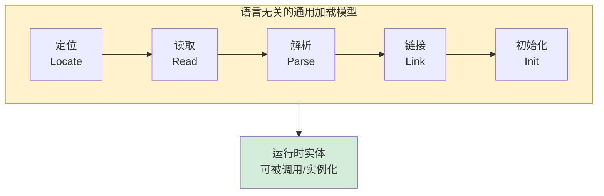

| 通用阶段 | 本质操作 | 编译型(t=c) | 解释型(t=r) |
|---------|---------|------------|------------|
| **定位** | 找到目标代码的物理位置 | 编译期按路径找源文件/库 | 运行时按模块名搜索路径 |
| **读取** | 将外部数据复制到内存 | 链接期一次性读入 | 按需惰性读入 |
| **解析** | 将字节序列翻译成结构化数据 | 编译期 AST/R 转换 | 运行时逐行解析 |
| **链接** | 符号引用替换为内存地址 | 静态/动态链接器 | 运行时查表绑定 |
| **初始化** | 执行模块级启动代码 | crt0/构造器 | 模块顶层语句执行 |

> **核心规律**：一种语言把五个阶段放在**编译期**越多，启动越快但越死板；放**运行时**越多，越灵活但开销越大。理解这五个阶段，你就能用一套心智模型分析任何语言的加载机制。

```mermaid
flowchart LR
    A[磁盘字节<br/>.class/.so/.js/.py] --> B[加载<br/>读入内存]
    B --> C[链接<br/>验证/准备/解析]
    C --> D[初始化<br/>执行启动代码]
    D --> E[运行时实体<br/>可被 new/invoke]
    E --> F[设计本质<br/>把字节流变成<br/>"可调用的对象"]
    style F fill:#d4edda
```

🎯 **阅读建议**：本章不是"知识陈列"，是"侦探推理"。每一节都从一个反直觉现象出发，让你跟着设计者的思路把答案"推"出来——而不是"被告知"。

---

#### 目录介绍

- [1.事故与根源](#1事故与根源)
  - [1.1 同名不同身](#11-同名不同身)
  - [1.1.1 双加载事故](#111-双加载事故)
  - [1.1.2 共同骨架](#112-共同骨架)
  - [1.1.3 连锁现象](#113-连锁现象)
  - [1.2 灵魂的五问](#12-灵魂的五问)
  - [1.3 探索路径](#13-探索路径)
  - [1.4 学习价值](#14-学习价值)
- [2.核心矛盾](#2核心矛盾)
  - [2.1 字节对象鸿沟](#21-字节对象鸿沟)
  - [2.2 三大根本约束](#22-三大根本约束)
  - [2.3 语言答卷](#23-语言答卷)
  - [2.4 五阶段拆解](#24-五阶段拆解)
  - [2.5 设计哲学共识](#25-设计哲学共识)
  - [2.6 加载四律](#26-加载四律)
- [3.类加载机制](#3类加载机制)
  - [3.0 加载三问](#30-加载三问)
  - [3.0.1 物理三问](#301-物理三问)
  - [3.0.2 语言答卷](#302-语言答卷)
  - [3.0.3 翻译速查表](#303-翻译速查表)
  - [3.0.4 三步拆解](#304-三步拆解)
  - [3.1 三阶段全景](#31-三阶段全景)
  - [3.2 双亲委派](#32-双亲委派)
  - [3.3 命名隔离](#33-命名隔离)
  - [3.4 唯一性等价](#34-唯一性等价)
  - [3.5 打破委派](#35-打破委派)
  - [3.6 初始化时机](#36-初始化时机)
  - [3.7 初始通用规律](#37-初始化通用规律)
- [4.编译型加载](#4编译型加载)
  - [4.1 静态链接](#41-静态链接)
  - [4.2 动态库加载](#42-动态库加载)
  - [4.3 符号重定位](#43-符号重定位)
  - [4.4 运行时加载](#44-运行时加载)
  - [4.5 语言本质差](#45-语言本质差)
  - [4.6 编译型共性](#46-编译型共性)
- [5.解释型加载](#5解释型加载)
  - [5.1 模块演进史](#51-模块演进史)
  - [5.2 导入机制](#52-导入机制)
  - [5.3 静态链接](#53-静态链接)
  - [5.4 解释与编译](#54-解释与编译)
  - [5.5 加载光谱](#55-加载模型光谱)
- [6.陷阱与反模式](#6陷阱与反模式)
  - [6.1 版本冲突](#61-版本冲突)
  - [6.2 初始化死锁](#62-初始化死锁)
  - [6.2.1 同根陷阱](#621-同根陷阱)
  - [6.2.2 语言对照表](#622-语言对照表)
  - [6.3 同名不同源](#63-同名不同源)
  - [6.4 符号污染](#64-符号污染)
  - [6.5 循环依赖](#65-循环依赖)
  - [6.6 陷阱根源](#66-陷阱根源)
- [7.综合案例](#7综合案例)
  - [7.1 案例背景](#71-案例背景)
  - [7.2 链路全景](#72-链路全景)
  - [7.3 启动加载](#73-启动加载)
  - [7.4 插件热加载](#74-插件热加载)
  - [7.4.1 跨语言热加载](#741-跨语言热加载)
  - [7.5 跨域调用](#75-跨域调用)
  - [7.6 卸载与回收](#76-卸载与回收)
  - [7.7 知识点回归](#77-知识点回归)
- [8.总结展望](#8总结展望)
  - [8.1 三层认知阶梯](#81-三层认知阶梯)
  - [8.2 七字真言](#82-七字真言)
  - [8.3 下篇承接](#83-下篇承接)
  - [8.4 七条设计原则](#84-通用设计原则)

---

## 1.事故与根源

### 1.1 同名不同身

> **本节定位**：我们要证明的不是"Java ClassLoader 有多奇怪"，而是——**"代码在加载链路上分裂出两个身份"是所有语言通用的痛点**，各家只是用不同的武器去对付。

### 1.1.1 双加载事故

凌晨 2 点 17 分，告警群被刷屏：**支付网关大面积 ClassCastException**。被强转的两个类——同一个全限定名、同一个 JAR、同一台机器——**运行时却认为它们是两个不同的类**。

把这个事故的"骨架"剥离出来，其实是一句话：

> **"代码加载"在物理上是一次"字节 → 运行时实体"的翻译。只要这次翻译被执行了多次（不同的加载器、不同的 dlopen、不同的 require 缓存键），就会得到多个"不同身份的同名实体"——即使字节码一模一样。**

下面我们看五种主流语言如何"在自己的舞台上演完同一出戏"——你会发现**症状惊人地相似**。

##### Java：双 ClassLoader 导致 ClassCastException

```
java.lang.ClassCastException:
   com.payment.OrderDTO cannot be cast to com.payment.OrderDTO
```

热部署框架用自定义 ClassLoader 又加载了一次 `OrderDTO`——**同名类被两个不同的 ClassLoader 加载，在 JVM 眼里就是两个不同的类**。根因：JVM 规定"**类的唯一身份 = (类全限定名, 定义类加载器)**"。

##### C/C++：dlopen 加载同一个 .so 两次导致 typeid 不等

```cpp
// 同一个 libpayment.so 被两个进程内组件 dlopen 两次
void* h1 = dlopen("libpayment.so", RTLD_LOCAL);   // 注意：LOCAL 不全局可见
void* h2 = dlopen("libpayment.so", RTLD_LOCAL);

OrderDTO* a = ((create_t)dlsym(h1, "create"))();
OrderDTO* b = ((create_t)dlsym(h2, "create"))();
// typeid(*a) != typeid(*b)  ← 同名类型却 RTTI 不等
// dynamic_cast<OrderDTO*>(b) 从 a 的视角看可能失败
```

**根因**：`RTLD_LOCAL` 让两个 dlopen 各自维护独立的符号表和 typeinfo——**与 Java 的"双 ClassLoader 两个类"完全同构**。**解药**：用 `RTLD_GLOBAL` 共享符号表（代价是符号冲突可能性）。

##### Node.js：require 缓存键不一致导致 "instanceof 失效"

```js
// 父进程
const A = require('/abs/path/Order.js');
const a = new A();

// 子模块通过相对路径或 npm link 又解析到了同一物理文件
const A2 = require('order');   // 解析到 node_modules/order/Order.js（其实是同一文件）
console.log(a instanceof A2);  // false ← 缓存键不同 → 两份模块实例
```

**根因**：Node.js 的模块缓存以**解析后的绝对路径**为 key——**符号链接、npm link、monorepo 的路径解析差异，会让"同一份代码"产生两个 module 实例**，构造函数也是两个。与 Java 双 ClassLoader 同构。

##### Python：相对导入 vs 绝对导入产生两份 module

```python
# package/sub.py
from .core import Order      # 相对导入 → package.core.Order

# main.py
from package.core import Order as O1
from package.sub import Order as O2
# 如果 sub.py 内部又 from core import Order（绝对）
# 在某些 sys.path 配置下，O1 和 O2 是两个不同的类对象
isinstance(O1(), O2)   # False ← 同名却不同身份
```

**根因**：Python 的 `sys.modules` 缓存以**模块名字符串**为 key——同一文件被以不同名字（`core` vs `package.core`）import 就产生两份。**解药**：统一使用绝对导入路径。

##### Go：编译期就把这类问题消灭了

```go
// import 路径就是模块身份
import "github.com/foo/payment"
// 编译期：同一 import 路径全局唯一
// 二进制里每个类型有唯一 _type 指针，不存在"双加载"
```

**根因消除**：Go 把"加载"从运行时挪到了编译/链接期——**所有依赖在 `go build` 时被静态确定，二进制里每个类型的 `_type` 指针全局唯一**。**代价**：不支持运行时插件（直到 Go 1.8 的 `plugin` 包，但限制很多，本质是有限版的 dlopen）。

### 1.1.2 共同骨架

```
              字节流 → 解析翻译 → 注册到运行时 → 后续访问 ┐
                                                       ▼
        Java     :  以 (类名, ClassLoader) 为身份键，可重复加载
        C/C++    :  以 dlopen handle + 符号表为身份，RTLD_LOCAL 时重复
        Node.js  :  以模块绝对路径为身份键，路径不一致时重复
        Python   :  以 sys.modules 名字字符串为身份键，名字不一致时重复
        Go       :  以 import 路径为身份，编译期唯一，运行时不可重复
```

> **结论一句话**：**"同名却不同身份"是所有支持运行时加载/链接的语言共同的物理事实**——根源是"身份键的设计"。各语言选择了不同的键（ClassLoader / dlopen handle / 文件路径 / 模块名），但**只要键能产生两次不同值，就会有两份实体**。

### 1.1.3 连锁现象

带着上面这把统一钥匙，你会发现一组看似零散、其实同源的问题——

- 为什么 Tomcat 能让两个 WebApp 用不同版本的 `log4j` 共存？（→ §3 命名空间隔离）
- 为什么 OSGi 能做"模块热替换"，普通 Java 却不行？（→ §3 + §6 反模式）
- 为什么 C/C++ 没有 ClassLoader 概念，却有 `dlopen`？（→ §4 跨语言）
- 为什么 Node.js 里 `require('./a')` 和 `import('./a')` 加载行为不一样？（→ §5 脚本语言）
- 为什么 Go 程序"一个二进制走天下"，根本不存在"加载第三方包"这回事？（→ §5 Go 静态链接）

它们最终都指向同一个故事——**字节如何变成运行时对象**，以及这个翻译过程中各方的工程取舍。**本章的核心承诺是：你将从此能用同一把尺子去丈量任何一门语言的加载机制**。

### 1.2 灵魂的五问

事故抛出了五个绕不开的问题：

**1.磁盘上的字节凭什么能"活"过来？** 字节码不过是一坨数字，CPU 凭什么知道哪几个字节是方法表、哪几个字节是常量池？

**2.为什么 Java 要分"加载、链接、初始化"三步？** 直接读进来执行不就行了吗？凭空多两步是开发者强迫症吗？

**3.为什么同名类被两个 ClassLoader 加载会变成两个类？** 这种"反人类直觉"的设计到底解决了什么问题？

**4.为什么 C/C++ 没有 ClassLoader？** 它们的"加载"长什么样？凭什么能在没有运行时元数据的情况下跑起来？

**5.JS / Python / Go 又是怎么做的？** 同样一段"加载代码"的需求，怎么会演化出五种完全不同的答案？

带着这五个问题往下看，你会发现：**类加载机制不是某一门语言的特性，而是所有"高级编程语言"都必须回答的同一个工程问题**——只是各家给出了不同的折中。

### 1.3 探索路径


下面我们沿着这条路径，把每一种语言的加载哲学和它留下的"工程伤疤"都讲清楚。

### 1.4 学习价值

读到这里你可能会想：类加载不就是把 class 文件读进来吗？至于花一整章？我想先抛三个**几乎所有资深工程师都答不上来**的问题：

**1.JVM 规范为什么把"链接"拆成"验证、准备、解析"三个独立子阶段？** ——为什么不一气呵成？这三个步骤是不是可以合并？

**2.为什么 C++ 的"静态变量初始化顺序"是出了名的坑（SIOF, Static Initialization Order Fiasco），而 Java 的"静态块"却几乎从不出问题？** ——同样是"加载类的时候初始化静态成员"，为什么两边的工程稳定性差这么多？

**3.为什么 Go 编译出的二进制可以"裸跑"在没有任何运行时的 alpine 镜像上，而 Java 永远需要一个 JVM？** ——这不是性能问题，是**世界观差异**——能讲清楚这一点，你就理解了两种语言对"加载"的根本分歧。

如果你能答出第 1 题，你理解了**安全验证为何必须在使用前完成**；
如果你能答出第 2 题，你理解了**初始化时机与依赖序的工程取舍**；
如果你能答出第 3 题，你理解了**"运行时加载"与"编译时绑定"两条技术路线的本质差异**。

这一章我们就要把这三个谜底，连同它们背后的整套设计哲学，**让你亲手推导出来**——不是被告知，而是**和五种语言的设计者一起想一遍**。

---

## 2.核心矛盾

### 2.1 字节对象鸿沟

**疑惑**：磁盘上的 `.class` 文件不过是一坨字节，CPU 怎么会知道哪几个字节是"方法"、哪几个字节是"字段"？为什么不能像读文本文件那样"直接用"？

**论证**：

来看一个最小的 Java 类编译后到底是什么：

```
HelloWorld.class (字节级别)
─────────────────────────────────────
CA FE BA BE             ← Magic Number（"咖啡宝贝"）
00 00 00 34             ← 版本号（minor + major）
00 1D                   ← 常量池大小 = 29
01 00 0A 48 65 6C 6C ...← 常量池条目（UTF-8 字符串、类引用、方法引用...）
00 21                   ← 访问标志（public + super）
00 05                   ← this_class 索引
00 06                   ← super_class 索引
...                     ← 接口表、字段表、方法表、属性表
─────────────────────────────────────
```

这堆字节本身**没有"类"这个概念**。它只是一份按 JVM 规范第 4 章定义好的、有严格格式的"二进制档案"。要让它"变成一个类"，必须经过四件事：

1. **读入内存**：把磁盘字节复制到 JVM 堆外的方法区
2. **结构解析**：按规范拆开常量池、字段表、方法表，建立数据结构
3. **关系建链**：解析 `super_class` 索引→找到 `java.lang.Object` 的 Class 对象→把指针连起来
4. **元数据可达**：在 `Class<?>` 对象里挂上所有方法、字段的反射入口

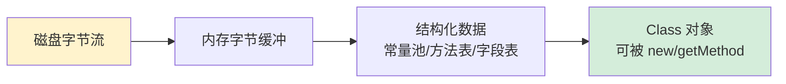

**结论**：所谓"加载类"，**本质是一次结构化翻译**——把"按规范排列的字节"翻译成"可被运行时访问的对象图"。这个翻译过程是**任何高级语言都绕不开的**——只是 Java 把它显式化为"ClassLoader"，C++ 把它隐式化为"链接器 + ELF 加载器"。

### 2.2 三大根本约束

**疑惑**：JVM 直接把 class 字节读进来执行不就完了吗？为什么非要折腾出"加载/链接/初始化"三个阶段，每个阶段又有那么多子步骤？

**论证**：

设想你是 1995 年的 Java 设计者，要在网络上传输并执行字节码（Java 当年最重要的卖点是 Applet——浏览器里跑别人服务器上的 class 文件）。你立刻面临**三条硬约束**：

| 约束 | 来自 | 不满足的代价 |
|---|---|---|
| **安全**：拒绝执行恶意/损坏字节码 | 网络下载的不可信代码 | 浏览器中招 = 操作系统沦陷 |
| **隔离**：不同应用的类不能互相污染 | 一个浏览器跑多个 Applet | A 站的代码改了 B 站的逻辑 |
| **性能**：不能在每次方法调用时都重做工作 | JIT/AOT 时代之前算力珍贵 | 启动慢到不可用 |

光"安全"这一条，就必须在执行之前做这些事：

```
- 字节码格式合法吗？           ← 验证阶段（防恶意构造）
- final 类有没有被继承？        ← 验证阶段（防类型逃逸）
- 静态字段的内存分配在哪？      ← 准备阶段（GC 才能识别）
- 符号引用指向的类真的存在吗？  ← 解析阶段（防 NoClassDefFoundError 飞窜）
```

这就是为什么 JVM 规范把"链接"拆成 **验证 → 准备 → 解析** 三步——**每一步对应一个独立的安全/性能不变式**：

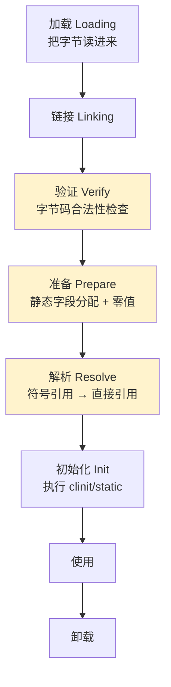

**关键洞察**：这三步看起来繁琐，但每一步**都不能省也不能调换顺序**：

- 没有"验证"，恶意字节码可以构造非法栈帧，直接破坏 JVM
- 没有"准备"，`static int x = 5` 这条语句要"赋值给谁"都不知道
- 没有"解析"，方法调用每次都要"查表找类"，性能崩溃

**结论**：加载的复杂度不是"过度设计"，而是**三条硬约束（安全、隔离、性能）的必然产物**。任何想"简化加载"的尝试（比如 Java 1.0 早期没拆开链接阶段），最终都会因为某条约束没满足而崩溃，再被迫重新拆开。

### 2.3 语言答卷

**疑惑**：既然"加载"是所有语言都要解决的问题，为什么我们说"类加载"时几乎只想到 Java？C/C++/Go/JS 程序员凭什么不需要懂这个？

**论证**：

不是不需要懂，而是**每种语言把"加载"放在了不同的时间点**。这背后是编程语言设计的一条根本规律——**绑定时序定律**：

> 语言对"加载"的选择 = f(类型存活期 × 安全约束 × 启动性能)，三者不可能同时最优。

看下面这张对比图：

| 语言 | "加载"发生在 | 加载的实体 | 谁来做 | 运行时元数据 |
|---|---|---|---|---|
| **C** | 编译/链接期 + 程序启动 | 函数符号 / 数据符号 | 链接器 + ELF/PE/Mach-O 加载器 | 几乎没有（仅 debug 段） |
| **C++** | 编译/链接期 + 启动 + `dlopen` | 同上 + 虚表 + RTTI | 同上 + 动态链接器 | 少量（RTTI/虚表） |
| **Java** | 运行时按需 | Class 对象 | ClassLoader + JVM | 完整（反射可见） |
| **JavaScript** | 解析期 + 运行时 | Module / Function | 引擎（V8 等）+ Module Map | 完整（一切皆动态） |
| **Go** | 编译期一次完成 | 已编译为机器码的函数 | 编译器静态链接 | 部分（reflect 包） |
| **Python** | 运行时按需 | Module 对象 | 解释器 import 机制 | 完整（一切是字典） |
| **Rust** | 编译/链接期（静态）| 已编译函数 | 链接器（可配动态库） | 极低（仅 trait 对象虚表） |
| **.NET** | 运行时按需 + AOT | Assembly 对象 | AssemblyLoadContext | 完整（元数据流） |

从**六种语言的加载时间轴**看：

```
C/C++/Go ─────────────────────────── Java/Python/JS
   编译期决定一切                       运行时决定一切
   零运行时元数据                       完整元数据
   启动即跑，无加载阶段                  按需加载，反射友好
   ↓                                   ↓
   性能极致 / 死板                      灵活动态 / 慢启动
```

**这不是好坏，是 trade-off**。来看一个直观对比：

```c
// C 的"加载"：编译时就知道每个函数地址
extern void foo();         // 链接器把 foo 的地址硬编码进调用点
int main() { foo(); }      // 运行时直接 call <地址>，0 元数据
```

```java
// Java 的"加载"：运行时才解析
public class Main {
    public static void main(String[] a) {
        new Foo().bar();   // JVM 第一次执行到这里时才查 Foo 类，找 bar 方法
    }
}
```

```javascript
// JS 的"加载"：边解析边执行
const Foo = require('./foo');  // 同步加载、立即执行 foo.js 顶层代码
new Foo().bar();
```

```go
// Go 的"加载"：根本没有加载这回事
import "fmt"               // 编译期就把 fmt.Println 链接成二进制
fmt.Println("hi")          // 运行时直接 call <编译期确定的地址>
```

**结论**：**"类加载"看起来是 Java 的专属概念，本质上是所有高级语言都要面对的"字节→对象"问题，只是 Java 把这个阶段最显式化**。理解了 Java 的 ClassLoader，再看 C++ 的 dlopen、JS 的 ESM、Python 的 importlib，你会发现它们都在解决同一个矛盾，只是给出的折中不同。

### 2.4 五阶段拆解

为了在后面三章对照各语言时不混乱，我们先把"加载"这个抽象动词拆成五个具体阶段——**所有语言都做了这五件事，只是合并/拆分的方式不同**：

```
┌───────────────────────────────────────────────────────────┐
│  通用加载五阶段（语言无关）                                 │
├───────────────────────────────────────────────────────────┤
│  ① 定位（Locate）   找到字节流在哪里                       │
│  ② 读入（Read）     把字节读到内存                         │
│  ③ 解析（Parse）    把字节翻译成结构化数据                  │
│  ④ 链接（Link）     和已有实体建立关系                      │
│  ⑤ 初始化（Init）   执行启动代码（构造函数/static块）       │
└───────────────────────────────────────────────────────────┘
```

各语言把这五步**分配在编译期还是运行时**，决定了完全不同的工程取舍：

| 阶段 | C/C++（静态） | Java | JavaScript | Go |
|---|---|---|---|---|
| ① 定位 | 链接期完成 | 运行时 ClassLoader | 运行时 Resolver | 编译期完成 |
| ② 读入 | 启动期一次性 | 运行时按需 | 运行时按需 | 启动期一次性 |
| ③ 解析 | 编译期完成 | 运行时（链接·验证） | 运行时（解析阶段）| 编译期完成 |
| ④ 链接 | 启动期（动态链接器）| 运行时（链接·解析） | 运行时（绑定）| 编译期完成 |
| ⑤ 初始化 | 启动期（`_init`）| 首次使用时 | 首次 import 时 | 启动期（`init()`）|

**关键观察**：

- **C/Go 把所有事都尽量推到编译期**——换来启动快、运行时零开销
- **Java/JS 把所有事都推到运行时**——换来动态性、热替换、反射
- **C++ 是混合体**：静态部分像 C，加上 `dlopen` 又能动态，所以 C++ 程序员同时要懂两套机制

### 2.5 设计哲学共识

虽然五种语言的方案差异巨大，但**底层有三条共识**，这是任何"加载机制"都绕不开的设计哲学：

**共识一：延迟绑定**（Lazy Binding）

```
不要在 t0 时刻做 t1 才需要的事。
- Java: 类不主动用就不加载 / 方法不调用就不解析 / clinit 不触发就不执行
- C++:  虚函数通过 vtable 间接调用，不到运行时不知道调谁
- JS:   动态 import 推迟到 await 那一行
- 共同动机: 启动性能 + 内存占用
```

**共识二：唯一性绑定**（Identity Binding）

```
一个"类"或"模块"在某个上下文里必须唯一。
- Java: 同一个 (ClassLoader, FQN) 唯一对应一个 Class
- Node: 同一个 require.cache key 唯一对应一个 Module
- ESM:  同一个 specifier 在 module map 里唯一
- Python: sys.modules[name] 单例
- 共同动机: 单例语义 + 状态共享
```

**共识三：失败隔离**（Failure Isolation）

```
加载失败不能拖垮整个进程。
- Java: ClassNotFoundException 是检查异常，调用方必须处理
- C++:  dlopen 返回 NULL，由调用方判断
- JS:   import 失败抛出 Promise rejection
- Go:   编译期就拒绝缺失的依赖（最严格）
- 共同动机: 系统韧性
```

**结论**：理解这三条共识后，你看任何新语言、新框架的"模块加载"机制，本质都在做这三件事的折中。下面三章我们就分别深入 Java、C/C++、脚本语言三大流派的具体实现。

### 2.6 加载四律

在三种共识之上，纵观所有主流语言，可以提炼出**四条不可违反的加载铁律**，它们构成了加载机制的"物理学"：

**第一律·翻译守恒**：加载的本质永远是"翻译"——将一种表示形式（字节/源码/AST）转换为另一种（可执行实体/符号表/运行时对象）。任何语言都不能跳过翻译这一步，区别只在于翻译发生在编译期还是运行时。

**第二律·身份绑定**：每个加载实体在运行时一定有唯一身份——身份键 = (名字, 上下文)。其中"上下文"可以是 ClassLoader、dlopen handle、文件路径或模块名。身份键的多样性决定了"双加载事故"的发生概率。

**第三律·时序约束**：加载的各阶段之间有严格的偏序关系——必须先定位再读取，先解析再链接，先链接再初始化。任何语言都不能违反这个偏序，但可以通过"惰性求值"调整各阶段的时间间距。

**第四律·失败边界**：加载失败的传播范围严格受限于加载上下文。一个模块/类加载失败，不能影响已加载的兄弟模块。这条铁律是所有现代加载机制"韧性"的根本来源。

> **四律的工程意义**：违反任何一条都会导致不可调试的系统级灾难。所有"成熟的加载机制"（JVM 类加载、Python importlib、Node require、C++ dlopen）的本质，就是用工程手段确保这四条铁律不被违反。

---

## 3.类加载机制

### 3.0 加载三问

> **本节定位**：在跳进 Java 的"加载-链接-初始化"细节之前，先把"加载"这件事的通用骨架立起来——**任何一门有运行时的语言都要回答同样三个问题**，Java 只是把这三个问题的答卷写得最显式。

### 3.0.1 物理三问

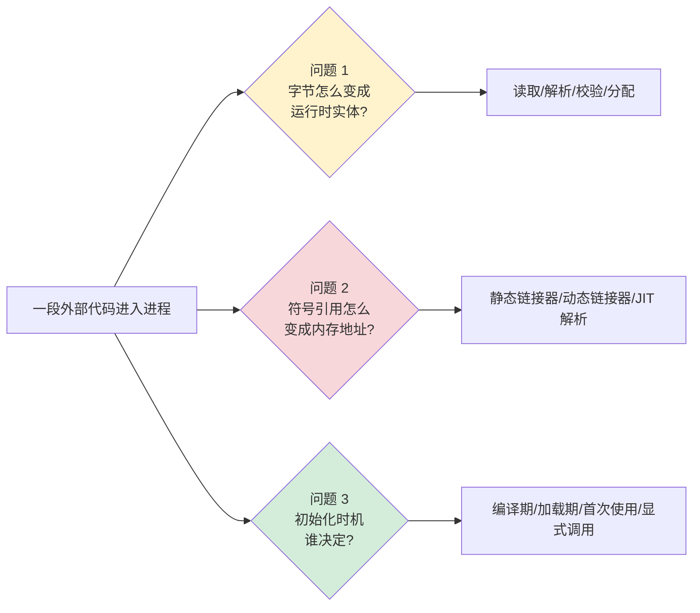

### 3.0.2 语言答卷

| 维度 | C/C++（静态）| C/C++（dlopen）| Java | Go | Python | JS（V8）|
|---|---|---|---|---|---|---|
| **字节 → 实体** | 编译期 ELF/PE 段 | 运行时 mmap + 重定位 | ClassLoader → Klass | 编译期合入二进制 | 解释器读 .py → 编译为 PyCodeObject | Parser → AST → Bytecode → Ignition |
| **符号解析** | 静态链接器 ld | 动态链接器 ld.so | 类加载第 4 步"解析" | 链接期完成 | 运行时按名查表（dict）| 内联缓存 IC |
| **初始化时机** | crt0 → `_init` → main | dlopen 返回前调 ctor | **首次主动使用**（lazy）| 进程启动时按依赖序 init() | import 时立即执行 | 模块求值时 |
| **失败处理** | 链接失败编译不过 | dlopen 返回 NULL | LinkageError 体系 | 编译/启动直接 panic | ImportError | SyntaxError / runtime error |
| **可重复加载** | 不可 | 可（不同 handle）| 可（不同 ClassLoader）| 不可 | 可（不同模块名/路径）| 可（不同 cache key）|

**抓住核心同构性**：

> **"加载"在所有语言中都是同一个三步漏斗——读字节、解析符号、首次执行**。
> Java 把这三步显式地命名为"加载/链接/初始化"，其他语言只是把它们藏在了链接器、解释器或 import 机制里。**学会一种，就理解了全部**。

### 3.0.3 翻译速查表

| JVM 概念 | C/C++ 对应 | Go 对应 | Python 对应 | JS 对应 |
|---|---|---|---|---|
| 类加载（Loading）| ld.so 加载 .so | 编译期合入 | 解释器 compile() | Parser + Compiler |
| 验证（Verification）| ELF magic 检查 | go vet（编译期）| pyc magic + py_compile | SyntaxError |
| 准备（Preparation）| BSS 段零初始化 | 全局变量零值 | 模块 dict 创建 | LexicalEnvironment |
| 解析（Resolution）| 动态链接重定位 | 链接器 | 属性查找时 | 内联缓存 |
| 初始化（`<clinit>`）| ctor / `_init` | `init()` 函数 | 模块顶层语句 | 模块顶层语句 |
| ClassLoader | dlopen handle | 无（编译期唯一）| sys.modules 键 | require/import cache |

### 3.0.4 三步拆解

注意上表里 Java 的"准备 / 解析"被显式拆开——其他语言要么合并到链接器（C/C++），要么合并到运行时（Python）。**Java 这样拆有什么独到价值？**

> **它把"字段地址分配"和"符号解析"独立出来，使得每个类的链接结果可以独立缓存与失效**——这正是双亲委派、热部署、OSGi 模块化的物理基础。**这一步设计奠定了 JVM 二十年类生态的可扩展性**。

**读到这里再往下看**：下面 §3.1-§3.6 我们以 Java 加载机制为"代表性深度案例"——**你看到的"双亲委派""命名空间隔离""<clinit> 时机"这些概念，本质都是上表三问的具体回答**，只是 Java 把它们写得最透。

---

### 3.1 三阶段全景

**疑惑**：很多教程会说 Java 类加载分"加载/链接/初始化"三阶段，可这只是名词。我真正想问的是——**为什么是这三个？而不是两个或四个？每一步要不要执行能否由开发者决定？**

**论证**：

回到 §2.2 的三大约束（安全/隔离/性能）。在 JVM 规范第 5 章里，"装载一个类直到能用"被精确拆成 **7 个动作**：


每一阶段都有**严格的入口条件和出口契约**：

| 阶段 | 入口契约 | 关键动作 | 出口契约 |
|---|---|---|---|
| 加载 | 拿到字节流（来源不限：jar/网络/动态生成）| 在方法区生成 `Klass` 结构 | 内存里有了"结构化字节"|
| 验证 | 字节已结构化 | 4 项检查（文件格式/元数据/字节码/符号引用） | 字节码"安全可执行" |
| 准备 | 验证通过 | static 字段分配内存 + 零值初始化 | 静态字段地址确定 |
| 解析 | 准备完成 | 符号引用 → 直接引用（指针） | 调用方可拿到目标内存地址 |
| 初始化 | 解析完成 + 首次主动使用 | 执行 `<clinit>`（static 块 + static 字段赋值）| 类对外可用 |

**反直觉点**：「准备」**只赋零值**，不执行 `static int x = 5` 里的"5"。这条赋值要等到"初始化"阶段才真正执行：

```java
public class Demo {
    static int x = 5;   // 准备阶段: x=0;  初始化阶段: x=5
    static final int Y = 5;  // 编译期常量, 准备阶段直接 Y=5
}
```

为什么这么"绕"？因为**准备阶段所有类的静态字段必须先全部"占好坑"**，否则 `<clinit>` 里互相引用会拿到未初始化的内存。这是 JLS 12.4.2 显式规定的顺序。

**结论**：Java 把"加载到能用"拆成这么多步，本质是为了**让每一步都对应一个独立的不变式**——任何一步失败都能精准定位、独立处理。这也是为什么 ClassLoader 异常体系细到可怕：`ClassNotFoundException` / `NoClassDefFoundError` / `VerifyError` / `ExceptionInInitializerError` 一一对应不同阶段。

### 3.2 双亲委派

**疑惑**：每本 Java 书都讲"双亲委派"，但**为什么是"向上委派"而不是"向下委派"**？为什么不让子加载器先试一遍？这条规则到底解决了什么实际问题？

**论证**：

假设你是 JDK 1.2 的设计者，要在 JVM 里支持"加载第三方代码"。你立刻面临一个噩梦：

> 用户写了一个类叫 `java.lang.String`，里面 `equals()` 永远返回 `true`。如果 JVM 用了这个类，整个安全模型彻底崩溃——`if (passwd.equals(input))` 立刻形同虚设。

怎么阻止？最直观的想法是"加黑名单"，但黑名单永远列不全。**只有一个解法稳定有效——让"系统类"永远优先于"用户类"被加载**。这就是双亲委派：

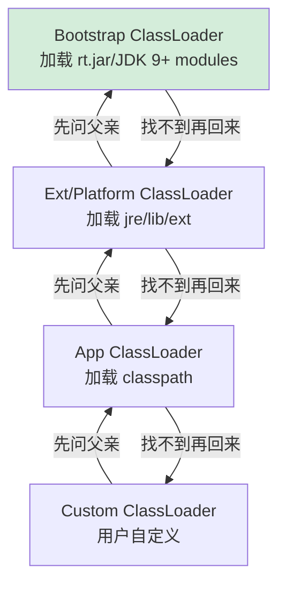

委派的实现就是一段 20 行不到的代码（`ClassLoader#loadClass`）：

```java
protected Class<?> loadClass(String name, boolean resolve) {
    synchronized (getClassLoadingLock(name)) {
        Class<?> c = findLoadedClass(name);      // ① 我自己加过吗?
        if (c == null) {
            try {
                if (parent != null) {
                    c = parent.loadClass(name, false);   // ② 先问父亲
                } else {
                    c = findBootstrapClassOrNull(name);
                }
            } catch (ClassNotFoundException e) { /* 父亲没找到 */ }
            if (c == null) {
                c = findClass(name);             // ③ 父亲找不到我才自己找
            }
        }
        return c;
    }
}
```

这段代码同时解决了**三个问题**：

1. **安全**：你写的 `java.lang.String` 永远被 Bootstrap 拦截在前——因为 Bootstrap 先返回了真正的 `String`
2. **唯一**：同一个全限定名永远只在最高层被加载一次，避免类的"重复定义"
3. **共享**：JDK 核心类（如 `Object`）所有应用共用同一份，省内存

**结论**：双亲委派不是"约定俗成"，而是**用最小代码量同时满足"安全 + 唯一 + 共享"三个不变式的天才设计**。它的代价是失去"向下加载"的灵活性——后面 §3.5 会讲如何打破它。

### 3.3 命名隔离

**疑惑**：双亲委派保证了"同名类只有一份"，那为什么 Tomcat 里可以让两个 WebApp 用**不同版本的 Spring**？这不矛盾吗？

**论证**：

矛盾的化解关键，在于**"同一个类"的定义**：

> 在 JVM 里，**类的唯一性 = (全限定名 + 定义它的 ClassLoader)**，不是只看类名。

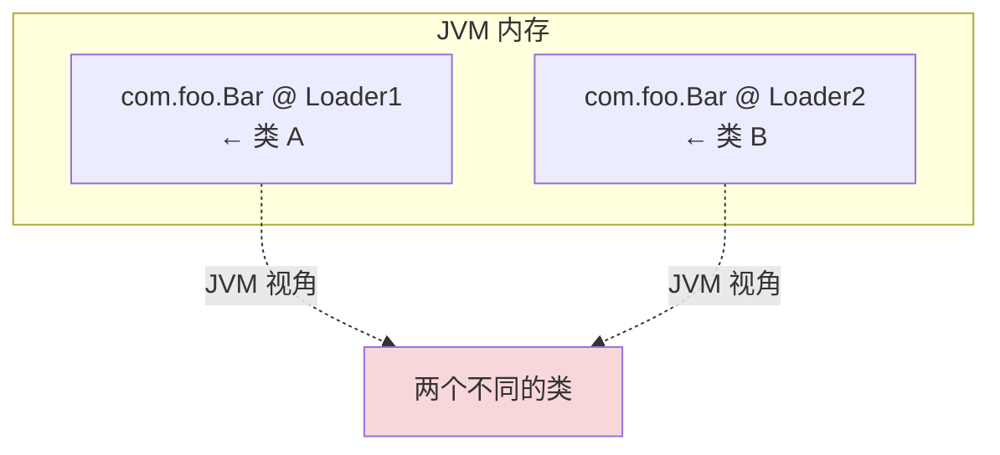

这就是为什么 Tomcat 给每个 WebApp 一个独立的 `WebappClassLoader`：

```
                Bootstrap ClassLoader     ← 加载 JDK 核心
                       ↑
                  App ClassLoader         ← 加载 Tomcat 自身 + servlet-api
                  ↗            ↖
        WebappClassLoader_A   WebappClassLoader_B
        (WebApp A)            (WebApp B)
        Spring 5.0.0          Spring 6.0.0    ← 两个完全独立的类世界
```

注意一个反直觉点：**`WebappClassLoader_A` 并不向上委派给 `WebappClassLoader_B` 的 Spring**，因为它们是**平级**的。每个 WebApp 在自己的"类宇宙"里 `Spring.class` 是 5.0.0，互不干扰。这是 Tomcat **故意打破双亲委派**的（标准委派模型下，Spring 应该被 App ClassLoader 加载，无法做版本隔离）。

代码层面，WebappClassLoader 重写了 `loadClass`，**反转了委派顺序**：

```java
// Tomcat WebappClassLoader 的简化逻辑
public Class<?> loadClass(String name) {
    Class<?> c = findLoadedClass(name);
    if (c == null) {
        // ① 先自己找（与标准委派相反！）
        try { c = findClass(name); } catch (Exception e) {}
        // ② 找不到再问父亲
        if (c == null) c = super.loadClass(name);
    }
    return c;
}
```

**结论**：**ClassLoader 不仅是"加载器"，更是"命名空间隔离器"**。Java 之所以能撑起 Tomcat / OSGi / Spring Boot 这种复杂的多模块生态，本质就靠这一个机制：**让"同名类"在不同上下文里被识别为不同实体**。

### 3.4 唯一性等价

**疑惑**：开篇那个 `ClassCastException` 案例——同一个 JAR、同一个全限定名，为什么强转失败？

**论证**：

把 §3.3 的结论再深挖一层：

```java
// 框架代码（系统 ClassLoader 加载）
public Object createOrder() {
    return loadOrderViaPlugin();   // ← 插件 ClassLoader 加载的 OrderDTO
}

// 业务代码（系统 ClassLoader 加载）
OrderDTO order = (OrderDTO) framework.createOrder();   // ← 强转失败！
```

JVM 视角下：
- 业务代码里的 `OrderDTO` = `(OrderDTO, AppClassLoader)`
- 插件返回的 `OrderDTO` = `(OrderDTO, PluginClassLoader)`

**两个不同的类**，强转必然失败。这条规则在 JVM 规范 §5.3.4 有明确条文：

> A class with a particular name C is loaded under a particular class loader L. The class is denoted (C, L<sub>d</sub>).

也就是说，类型相等的判定永远是 `Class<?>.equals()`，而 `Class<?>` 对象只要不是同一个**内存对象**就不相等。

**实战急救方案**：
1. 用接口隔离：把 `OrderDTO` 抽成接口放在父加载器，子加载器只放实现
2. 通过反射/序列化跨边界传递：放弃强类型，回到 `Map<String, Object>` 风格
3. 用 SPI 机制：`ServiceLoader` 配合契约接口，是上面两种的工程化版本

**结论**：在框架/插件/热部署场景下，"类型"本身是有边界的。**当你写下 `(SomeClass) x`，你假设的是"同一个 ClassLoader 加载的同一个类"**——这个假设在多 ClassLoader 系统下随时可能被打破。

### 3.5 打破委派

**疑惑**：既然双亲委派是"金科玉律"，为什么 Tomcat、OSGi、SPI 都在打破它？是设计错了吗？

**论证**：

双亲委派擅长"顶层共享、底层隔离"，但有**三个真实需求它解决不了**：

**① SPI（Service Provider Interface）反向加载**

JDBC 是经典案例：`java.sql.DriverManager`（在 rt.jar，Bootstrap 加载）需要加载 `com.mysql.cj.jdbc.Driver`（在 classpath，App 加载）。**父亲想用儿子，标准委派下做不到**。

解法：**线程上下文 ClassLoader（TCCL）**：

```java
// DriverManager.loadInitialDrivers() 的关键逻辑
ServiceLoader<Driver> loadedDrivers =
    ServiceLoader.load(Driver.class);   // ← 内部用 Thread.currentThread().getContextClassLoader()
```

`ServiceLoader` 不走双亲委派，而是**直接拿当前线程绑定的 ClassLoader**——通常就是 App ClassLoader，从而"反向"加载子加载器里的实现。

**② 模块化热替换（OSGi/JPMS）**

OSGi 给每个 Bundle 一个独立 ClassLoader，**Bundle 之间的依赖通过显式声明（Import-Package / Export-Package）打通**，根本不走双亲委派：

```mermaid
flowchart LR
    A[Bundle A<br/>ClassLoader_A] -.Import org.json.-> B[Bundle B<br/>ClassLoader_B]
    style A fill:#fff3cd
    style B fill:#d4edda
```

代价：复杂的依赖图、`Could not resolve module` 噩梦——但换来了**真正的运行时热插拔**。

**③ 应用容器的版本隔离（Tomcat）**

§3.3 已展开。

**结论**：**双亲委派是 default，不是 must**。三类场景里"打破它"都不是 hack，是显式的工程取舍。理解这一层，你才能看懂 Spring Boot 为什么有 `LaunchedURLClassLoader`、为什么 JDK 9 之后引入了 `Platform ClassLoader` 替换 Ext。

### 3.6 初始化时机

**疑惑**：什么时候 `<clinit>` 才会执行？换句话说，**static 块到底什么时候跑**？

**论证**：

JLS §12.4.1 列了 **6 种**"主动使用"，**只有它们才会触发 `<clinit>`**：

```
① new 一个实例
② 调用 static 方法
③ 访问/赋值 static 字段（非 final 常量）
④ 反射 Class.forName(name) 触发
⑤ 子类被初始化（先初始化父类）
⑥ JVM 启动时的主类（含 main 方法那个）
```

其他一切都属于**被动使用**——不会触发初始化：

```java
class Parent { static { System.out.println("Parent init"); } static int X = 1; }
class Child extends Parent { static { System.out.println("Child init"); } }

// 被动使用：访问父类的 static 字段
System.out.println(Child.X);   // 只打印 "Parent init"，Child 不会初始化
```

```java
// 被动使用：通过数组定义引用类
Parent[] arr = new Parent[10];  // 什么都不打印，Parent 没被初始化
```

```java
// 被动使用：编译期常量
class C { public static final String NAME = "hello"; static { ... } }
System.out.println(C.NAME);     // 不会触发 C 的初始化，NAME 在编译期被 inline
```

**为什么 JVM 要这么"抠"？** 因为初始化要**执行用户代码**（`<clinit>` 含 static 块），而执行用户代码意味着：
- 可能抛异常（`ExceptionInInitializerError`）
- 可能耗时（连数据库、加载远程配置）
- 可能死锁（两个类的 static 块互相引用）

**所以 JVM 设计了一条铁律**：**能拖就拖，能不执行就不执行**——这是 §2.5 "延迟绑定"共识在 Java 里的具体落地。

**结论**：理解"主动使用六条"和"`<clinit>` 锁"，你才能解释这些"诡异现象"：
- 为什么数据库连接池在 `getInstance()` 第一次调用前不会建立连接？（static 字段在主动调用前不赋值）
- 为什么单例的 `static final INSTANCE` 是线程安全的？（`<clinit>` 由 JVM 用类锁保证只执行一次）
- 为什么 static 块里写 `Thread.sleep(60000)` 会让整个应用启动卡死？（`<clinit>` 持有类锁，所有想用这个类的线程全部阻塞）

### 3.7 初始化通用规律

> 把本节的 Java `<clinit>` 放回跨语言维度，可提炼出三条**所有语言共享的初始化铁律**：

**铁律一·惰性优先**：初始化应尽可能推迟到首次使用。Java 的"主动使用"、C/C++ 的函数内 `static`（Construct on First Use）、JavaScript 的 `import()` 动态加载，本质上都在实践同一条原则——**不为尚未需要的代码付出初始化代价**。

**铁律二·互斥执行**：初始化代码必须是线程安全的，且全局只执行一次。Java 用类锁、C++11 起保证函数内 static 线程安全、Go 用包级 `init()` 按拓扑序串行执行——手段不同，目的相同：**绝不允许同一个模块被初始化两次**。

**铁律三·依赖先行**：被依赖方必须先于依赖方完成初始化。Java 通过 `<clinit>` 递归触发父类，Go 通过编译期拓扑排序确保 `init()` 顺序，C++ 仅保证单翻译单元内有序——约束从编译期到运行期逐渐放松，故障概率递增。

| 语言 | 惰性程度 | 互斥保证 | 依赖保证 |
|-----|---------|---------|---------|
| Java | 极高（主动使用6条）| 类锁 | 父类先于子类 |
| C++ | 中（函数内static最惰）| C++11起保证 | 仅单TU内有序 |
| Go | 低（启动时全部init）| 拓扑序串行 | 编译期强制 |
| Python | 中（首次import执行）| GIL + 缓存 | 半成品模块 |
| JS | 高（CJS/ESM均惰性）| 单线程执行 | 缓存保障 |

> **通用结论**：三种铁律的严格程度决定了语言的可靠性边界。Go 依赖保证最强、故障概率最低；C++ 依赖保证最弱、故障概率最高。**没有正确与错误的选择，只有"可靠性 vs 灵活性"的权衡空间**。

---

## 4.编译型加载

### 4.1 静态链接

**疑惑**：C 程序里 `printf` 怎么"加载"进来的？我没写过任何 ClassLoader，凭什么 `int main() { printf("hi"); }` 就能跑？

**论证**：

C 没有运行时加载，因为**链接器在编译期就把"加载"做完了**。来看这条命令背后发生了什么：

```bash
gcc hello.c -o hello
```

它其实是三步：

```
┌─ 编译 ───────────────────────────┐
│  hello.c  ──► hello.o (含 printf 的"符号引用")
│  printf 此时还没有真实地址，只是一个"洞"
└─────────────────────────────────┘
                ↓
┌─ 静态链接 ───────────────────────┐
│  hello.o + libc.a  ──► hello (可执行 ELF)
│  链接器把 libc.a 里 printf 的代码"粘"进 hello
│  hello 文件里 printf 已经是确定的内存偏移
└─────────────────────────────────┘
                ↓
┌─ 加载（运行时）──────────────────┐
│  内核 exec("./hello")
│  把 ELF 各 segment mmap 到进程地址空间
│  printf 的代码段就位 → call 立刻能跳
└─────────────────────────────────┘
```

**Java 程序员的关键认知**：C 里的"加载"**没有任何元数据**——hello 二进制里**根本没有"printf 是什么"的描述**，只有一个内存地址。没有反射、没有"找不到方法异常"——找不到方法在**链接期就报错了**：

```bash
$ gcc hello.c -o hello
/usr/bin/ld: undefined reference to `printf2'   ← 链接器在编译期就发现错误
```

**结论**：C 把"加载"的复杂度**全部前置到了编译/链接期**。换来的是**运行时零开销**——但失去了"反射、热替换、动态扩展"。这是一种世界观选择：**所有依赖在出厂前确定，出厂后不能再变**。

### 4.2 动态库加载

**疑惑**：那 `.so` / `.dll` / `.dylib` 又是怎么回事？为什么有了静态链接还要搞动态库？

**论证**：

动态库（Dynamic Shared Object）是 C/C++ 世界对"运行时加载"的妥协。它要解决静态链接的三个痛点：

| 痛点 | 静态链接的代价 | 动态库的解法 |
|---|---|---|
| 内存浪费 | 10 个程序各打包一份 libc，占 10 倍内存 | 共享一份 `.so`，全系统共用 |
| 升级困难 | libc 修 bug 要全系统重新编译 | 替换 `.so` 即可热更新 |
| 体积膨胀 | 静态打包后二进制几十 MB | 动态依赖只引用，二进制几百 KB |

动态库的加载分**三件事**（与 Java 的"加载/链接/初始化"惊人对应）：


**关键点**：在 main 函数执行**之前**，动态链接器（Linux 上是 `ld-linux.so`，被内核优先 exec）就把所有 `.so` 加载完了。看一个直观对比：

```bash
$ ldd /usr/bin/curl
    linux-vdso.so.1
    libcurl.so.4 => /lib/.../libcurl.so.4
    libc.so.6    => /lib/.../libc.so.6
    /lib64/ld-linux-x86-64.so.2    ← 动态链接器，比 main 更早执行
```

**结论**：动态库的存在，是 C/C++ 默认"零运行时元数据"哲学的一个**显式让步**——为了换内存共享、热升级和动态扩展，开发者必须承担额外的工具链复杂度（`LD_LIBRARY_PATH` / `rpath` / `dlopen`）。

### 4.3 符号重定位

**疑惑**：动态库里的函数地址是怎么"找"到的？运行时不就是要"动态绑定"吗？为什么不直接调用？

**论证**：

考虑一个真实问题：你的程序写 `printf("hi")`，编译时**根本不知道 printf 在 libc.so 里的哪个偏移**——因为 libc 还没加载。怎么办？

C/C++ 用 **GOT + PLT 间接跳转** 解决：

```
你的代码:                       PLT 表:                     GOT 表:
                                                            
call printf@plt   ──────►   printf@plt:           ───►    printf@got:
                              jmp [printf@got]              (运行时填充)
                              push ...                        ↓
                              jmp resolver                   ld.so 把真实地址
                                                             填到这里
```

**首次调用**走 `resolver` 路径——动态链接器负责**真正地找到 printf 在哪**，把地址写回 GOT。**后续调用**直接通过 GOT 跳转，几乎零开销。

这有个学名：**Lazy Binding（延迟绑定）**——和 §2.5 的"延迟绑定"完全是同一个哲学，只是发生在 C 的 PLT 机制里。

**反直觉点**：C/C++ 的"延迟绑定"是**地址级别**的——绑的是函数地址。Java 的"延迟绑定"是**对象级别**的——绑的是 Class 对象。两者解决的是**同一个矛盾在不同抽象层的体现**。

**结论**：C/C++ 看似"无运行时"，其实在动态库场景里**也搞了一套延迟绑定机制**——只是它隐藏在 PLT/GOT 这种工具链黑话之下，不像 Java 那样显式暴露给开发者。

### 4.4 运行时加载

**疑惑**：那 C/C++ 能不能像 Java 那样"运行时动态加载新代码"？

**论证**：

能，靠 `dlopen` 家族：

```c
#include <dlfcn.h>

int main() {
    // 运行时打开一个 .so（相当于 ClassLoader.loadClass）
    void* handle = dlopen("./plugin.so", RTLD_LAZY);
    if (!handle) { fprintf(stderr, "%s\n", dlerror()); return 1; }

    // 按名字找符号（相当于 Class.getMethod）
    void (*plugin_run)() = dlsym(handle, "plugin_run");
    if (!plugin_run) { fprintf(stderr, "%s\n", dlerror()); return 2; }

    plugin_run();        // 调用
    dlclose(handle);     // 卸载（相当于 ClassLoader 被 GC）
    return 0;
}
```

把这段代码和 Java 对照：

| C: dlopen 流派 | Java: ClassLoader 流派 |
|---|---|
| `dlopen("./plugin.so")` | `loader.loadClass("Plugin")` |
| `dlsym(h, "run")` | `cls.getMethod("run")` |
| `dlclose(h)` | `loader = null` + GC |
| 失败：`dlerror()` 返回字符串 | 失败：`ClassNotFoundException` |

**底层都做了同样的五件事**（定位、读入、解析、链接、初始化），区别只是 C 给你的是"函数指针 + 字符串"，Java 给你的是"Class 对象 + 反射 API"。

**但有两个本质差异不能忽略**：

1. **没有命名空间隔离**：两次 `dlopen("./plugin.so")` 返回的是**同一个加载实例**（除非用 `RTLD_LOCAL`）。无法像 Java 那样让"同名符号"在不同 Loader 里共存。
2. **没有 GC**：`dlclose` 只是减引用计数，到 0 才卸载。如果忘记调用，会**永久泄漏**——比 Java 的 ClassLoader 泄漏更隐蔽。

**结论**：`dlopen` 是 C/C++ 给"运行时扩展"留的一扇侧门——能用，但比 Java 的 ClassLoader 原始得多。所有插件式 C 程序（Apache module、Nginx module、Postgres extension）都建立在这个机制之上。

### 4.5 语言本质差

**疑惑**：既然 dlopen 也能做"运行时加载"，那 C/C++ 和 Java 的差异本质在哪？

**论证**：

差异藏在**两个看似次要的细节**里——但它们决定了完全不同的工程取舍：

**差异一：元数据完整性**

| | C/C++ | Java |
|---|---|---|
| 运行时能拿到函数参数类型吗？ | ❌ 只有函数地址 | ✅ Method.getParameterTypes() |
| 运行时能枚举所有方法吗？ | ❌ 必须自己维护符号表 | ✅ Class.getMethods() |
| 运行时能修改字段吗？ | ❌ 没有"字段"的概念 | ✅ Field.set() |

C 编译出来的 `.so` 默认**剥光了所有元数据**——只保留"导出符号"这一条最小信息。Java 的 `.class` 把**整个类的结构**（字段类型、方法签名、注解）都打包带走。

**差异二：类型系统嵌入度**

```c
// C: 类型只活在编译期
typedef struct { int x, y; } Point;
Point p = { 1, 2 };           // 运行时只剩一坨 8 字节, 没有"Point"这个概念
```

```java
// Java: 类型活到运行时
class Point { int x, y; }
Point p = new Point();        // p.getClass() 永远能拿到 Point.class
```

这就解释了为什么：
- C 里没有 `instanceof`、没有反射、没有动态代理
- Java 里有 Spring AOP、Hibernate ORM、Mock 框架——**全部依赖运行时类型元数据**

**根本分歧**可以用一句话概括：

```
C/C++ 的世界观: 字节就是真相，类型只是编译期的脚手架
Java 的世界观: 类型就是真相，字节只是它的序列化形态
```

**结论**：Java 多出来的那部分加载复杂度（ClassLoader、链接、`<clinit>`），换来了一整套**运行时可编程性**——这是 Spring 整个生态的根基。C/C++ 的"零成本抽象"是另一种极致，但代价是放弃了运行时元数据带来的灵活性。**没有谁对谁错，只有 trade-off 的位置不同**。

### 4.6 编译型共性

把 C/C++ 和 Go 放一起观察，编译型语言在加载机制上有**三个共同基石**，它们构成了编译型语言"快"的物理根源：

**基石一·前期绑定**：所有符号（函数、变量、类型）在编译/链接期就确定了最终内存地址。运行时没有"查找"只有"跳转"。这是 C/C++/Go 启动快于 Java/Python 至少一个数量级的核心原因。

**基石二·无元数据**：编译后的二进制不携带类型信息（C/C++ 的 debug 段和 Go 的 `runtime._type` 除外）。这意味着编译型语言的运行时"不知道自己是谁"——没有反射能力，但也因此没有运行时元数据查询的开销。

**基石三·平台耦合**：编译型语言的"加载"深度绑定操作系统加载器（ELF/PE/Mach-O）。`exec()` 系统调用本质上就是一次"加载操作"——内核把二进制段 mmap 到内存，动态链接器接管重定位。

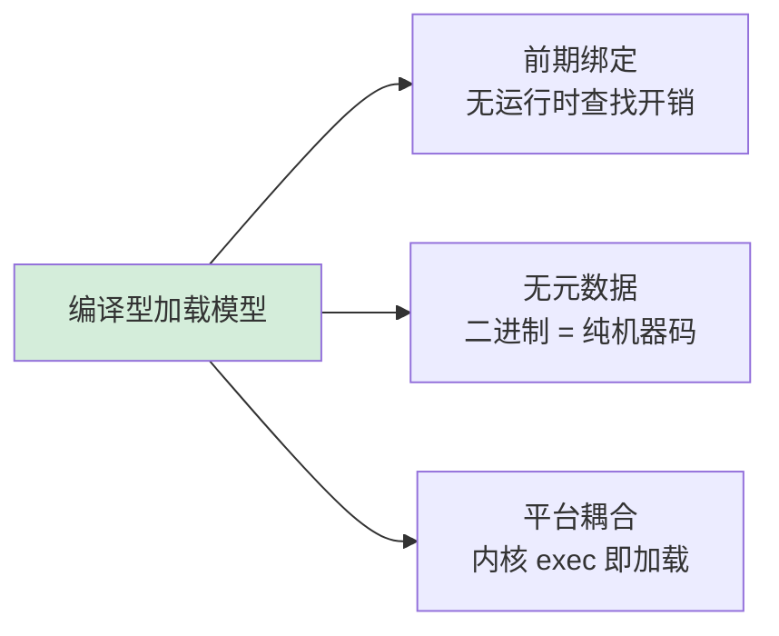

> **重要推论**：编译型语言的热加载（dlopen/plugin）本质上是对"前期绑定"世界观的**协议破坏**——它强迫一个编译期就确定了所有地址的系统，在运行时重新去解一个"符号地址"的方程。这就是为什么 `dlopen` 和 Go 的 `plugin` 包都异常复杂且充满陷阱。

**补充案例·Rust 的加载哲学**：Rust 代表了编译型语言的"最激进形态"。它的 `cargo build` 默认产出**全静态链接**的二进制——所有 crate 的代码在编译期被 LLVM 优化、内联、合并成一个 ELF/PE/Mach-O。Rust 甚至还更进一步：

```rust
// Rust 编译期"加载"通过所有权/生命周期，从类型层面消灭了加载陷阱
use some_crate::Config;
// 编译期：Config 的所有依赖被静态分析，不存在运行时"找不到类"
// 编译期：借用检查器确保不存在"未初始化就使用"（→ Java 的 clinit 问题）
// 编译期：trait 的孤儿规则防止"同名实现冲突"（→ Java 的同名类问题）
```

Rust 的世界观是："如果能在编译期证明安全，就不需要在运行时做任何检查"。这在加载机制上对应一个极端：**把"加载"的五个阶段全部压缩到编译期**，运行时只留下一个 `call` 指令。

> **两全其美？** Rust 的 `cdylib` 支持编译动态库 + 运行时用 `libloading` crate 实现 `dlopen` 风格加载——这证明了即使是最激进的全编译期语言，也无法完全逃避"运行时加载"这一通用需求。

---

## 5.解释型加载

### 5.1 模块演进史

**疑惑**：JS 没有"编译"，也没有 ClassLoader，那 `require()` 和 `import` 究竟在干什么？为什么 Node.js 里 `require('./a')` 和 `await import('./a')` 行为不一样？

**论证**：

JS 的"模块加载"演化史本身就是一部"边写边补"的工程史诗：

```
1995  无模块（<script> 全局污染）
   ↓
2009  CommonJS（Node.js）：require 同步加载、module.exports
   ↓
2011  AMD（RequireJS）：浏览器异步加载
   ↓
2015  ES Modules（语言标准）：静态 import + 动态 import()
   ↓
2020+ ESM 一统江湖（Node.js 13.2+ 原生支持）
```

每一代都在解决前一代的问题：

| 方案 | 加载方式 | 解决了什么 | 留下了什么坑 |
|---|---|---|---|
| `<script>` | 顺序加载 | 简单 | 全局污染、依赖手工管理 |
| CommonJS | 同步 require | 模块化、依赖解析自动化 | 浏览器无法异步 |
| AMD | 异步 define | 浏览器友好 | 语法繁琐 |
| **ESM** | 静态分析 + 异步 | 编译期可优化（tree-shaking） | CommonJS 互操作复杂 |

来看 CommonJS 加载一个模块到底发生了什么：

```javascript
// require('./foo') 的内部伪代码
function require(id) {
    // ① 解析路径（按 node_modules 算法）
    const path = resolve(id);
    // ② 缓存命中检查（这是关键！）
    if (cache[path]) return cache[path].exports;
    // ③ 创建 module 对象，先放进 cache（防循环依赖）
    const module = { exports: {} };
    cache[path] = module;
    // ④ 读文件 + 包裹成函数
    const code = readFileSync(path);
    const wrapped = `(function(exports, module, require) { ${code} })`;
    // ⑤ 执行模块顶层代码
    eval(wrapped)(module.exports, module, require);
    // ⑥ 返回 exports
    return module.exports;
}
```

**惊人的相似性**：这五步和 §2.4 的通用五阶段（定位/读入/解析/链接/初始化）一一对应。**JS 的"模块加载"本质上就是 Java 类加载的一个简化版**：

- `cache[path]` ≈ Java 的"加载状态记录"
- 包裹函数 ≈ Java 的字节码验证
- 顶层代码执行 ≈ Java 的 `<clinit>`

**ESM vs CommonJS 的本质差异**：

```javascript
// CommonJS：运行时同步、动态、可分支
if (env === 'dev') {
    const debug = require('./debug');  // 运行时才决定加载
}

// ESM：静态分析、编译期确定、不能在 if 里
import debug from './debug';   // ❌ 必须在顶层
// ESM 动态加载要显式用 import()
const debug = await import('./debug');  // ✅ 返回 Promise
```

差异背后是设计哲学的根本分歧：
- **CommonJS 选了灵活性**：任何位置都能加载，但失去了 tree-shaking
- **ESM 选了可分析性**：静态结构换来打包优化和顶级 await

**结论**：JS 的模块加载演进，本质是**"动态性 vs 可分析性"**这条钢丝绳上的反复摇摆。今天的 ESM 是 25 年探索后的最优解，但 CommonJS 因为巨量历史代码永远不会被淘汰——所以现代 Node.js 必须同时支撑两套机制，这本身就是工程现实的写照。

### 5.2 导入机制

**疑惑**：Python 的 `import` 看起来最简单——一行代码就能用。但**为什么 `import os` 和 `from os import path` 行为不一样？为什么有时候改了模块代码必须重启解释器？**

**论证**：

Python 的 `import` 内部走的是 **Finder + Loader** 两段式：

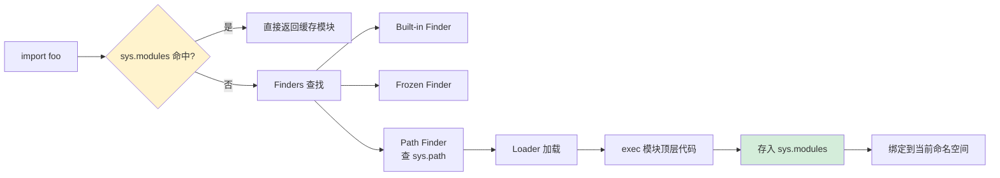

`sys.modules` 是 Python 加载机制的**核心数据结构**——它就是 §2.5 提到的"唯一性绑定"在 Python 里的实现：

```python
import sys
import foo
print(sys.modules['foo'] is foo)   # True

# 这就是为什么改了 foo.py 后再 import foo 不生效
# 必须用 importlib.reload(foo)
```

**关键洞察**：Python 的"模块"就是个**对象**——`foo` 模块本质是个字典 `foo.__dict__`，所有顶层定义的函数、变量都是这个字典的键。所以：

```python
import os
os.path           # ← 等价于 sys.modules['os'].__dict__['path']

from os import path
path              # ← 直接绑定到当前命名空间，不需要每次走 os.__dict__
```

理解这一点后，几个"诡异现象"就解释得通了：

**现象一：循环依赖部分失败**

```python
# a.py
from b import b_func
def a_func(): pass

# b.py
from a import a_func    # ← 此时 a 还在初始化中，a_func 可能还没定义
def b_func(): pass
```

Python 通过把 a 先放入 `sys.modules`（**还没初始化完成**）来允许循环 import，但**早期访问会拿到不完整的模块**——这是 §3.6 "初始化顺序"问题在 Python 里的体现。

**现象二：reload 不能根治问题**

```python
import foo
foo.SomeClass()
importlib.reload(foo)        # foo 模块重新执行
# 但是已经创建的 SomeClass 实例还引用旧的类对象！
```

Python 的"热替换"只换模块字典，**已经持有旧引用的对象不会自动迁移**——这和 Java 的 ClassLoader 卸载问题如出一辙。

**结论**：Python 看起来最"无脑"的 import，其实是**"对象就是命名空间字典"**这一极简哲学的产物。简单的代价是：**所有的加载问题都暴露给开发者自己处理**——没有 ClassLoader 隔离，没有版本管理，靠 `virtualenv` 这种外挂工具救场。

### 5.3 静态链接

**疑惑**：Go 程序 `go build` 出来一个二进制就能跑，连 `.so` 都不依赖。**Go 是怎么做到的？这又意味着什么？**

**论证**：

Go 的设计哲学极端到了一种程度：**"运行时加载"这件事就不应该存在**。

```bash
$ go build -o app main.go
$ ldd app           # 在 Linux 上
        not a dynamic executable    ← 没有任何动态依赖

$ ls -lh app
-rwxr-xr-x  ... 8.2M app   ← 所有依赖都已经被静态编译进去
```

为什么 Go 选择这条路？回到 §2.5 的三大约束，Go 给出的是**最激进的回答**：

| 约束 | Go 的回答 |
|---|---|
| 安全 | 编译期类型检查 + 运行时无字节码执行 |
| 隔离 | 单进程单二进制，根本没有"多模块" |
| 性能 | 静态链接 + 直接机器码，零运行时元数据查询 |

Go 的 `import` 跟 Java/JS 完全不是一回事：

```go
import "fmt"             // ← 这一行只是编译期标记，告诉编译器把 fmt 包链接进来
fmt.Println("hi")        // ← 编译后变成 call <fmt.Println 的确定地址>
```

**Go 没有运行时的"模块对象"**。`fmt` 不是一个内存里能拿到的实体——它纯粹是命名空间。这意味着：

- 没有 ClassLoader / sys.modules / require.cache
- 没有反射类型加载（`reflect` 包能做的事极其有限）
- 没有热替换（要更新必须重启二进制）

**为这条路付出的代价**：

```go
// 想动态加载插件？只有一条路：用 plugin 包（仅 Linux/Mac）
import "plugin"

p, _ := plugin.Open("./myplugin.so")
sym, _ := p.Lookup("Run")
runFn := sym.(func())   // 必须强转，因为 Go 没有运行时元数据
runFn()
```

`plugin.Open` 看起来像 `dlopen`，事实上**底层就是 dlopen**——Go 在这种场景下回退到了 C 的世界观。而且 `plugin` 包**官方明确警告"不推荐生产用"**：版本不匹配就会段错误。

**结论**：Go 把"加载"做成了一个**编译期问题**——这是它能做到"单二进制部署 + 极快启动"的根本原因。代价是失去了运行时灵活性。**这种取舍非常适合云原生场景**（K8s 一个容器一个进程，加载灵活性根本不需要），但对插件化框架就是噩梦。Go 的世界观可以浓缩为一句话：**"运行时越简单越好，动态性是 bug 的温床"**。

### 5.4 解释与编译

**疑惑**：脚本语言（Python/JS）和编译语言（C/Go）在"加载"这件事上的差异，根本上是因为什么？

**论证**：

把前面几节连起来看，差异并不是"是否编译"——而是**"类型信息是否活到运行时"**：

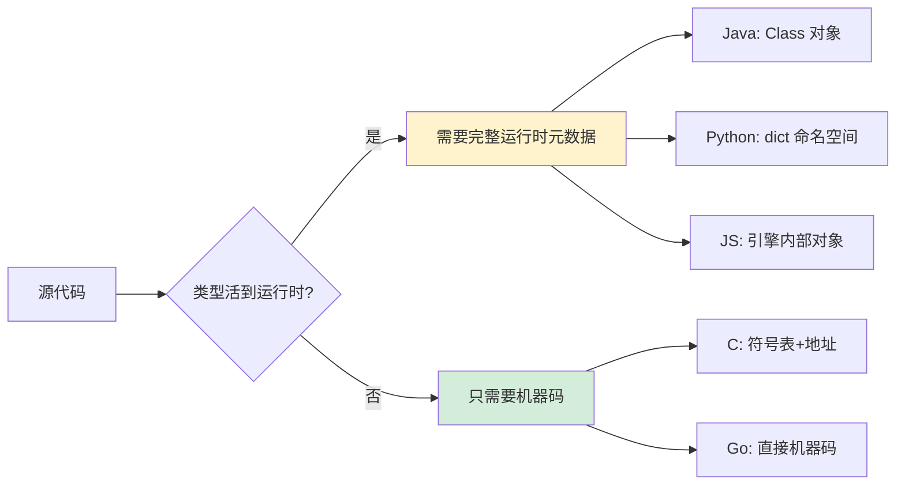

这条分界线决定了一切：

| 维度 | "类型活在运行时" | "类型不活到运行时" |
|---|---|---|
| 加载机制 | 必须有 | 几乎不存在 |
| 反射能力 | 强 | 弱或无 |
| 二进制体积 | 必须带 VM/解释器 | 单文件几 MB |
| 启动速度 | 慢（需初始化 VM） | 快（直接 exec） |
| 热替换 | 容易 | 困难甚至不可能 |
| 适用场景 | 框架、应用服务器、AI | 系统编程、容器、嵌入式 |

**反直觉点**：Java 看似"编译型"，但它的 `.class` 字节码本质上是**"带完整类型元数据的中间表示"**——所以 Java 在加载行为上**更接近 Python 而非 C**。这就解释了为什么 Spring/Hibernate 能在 Java 里实现，**根本无法在 C/Go 里实现**——它们需要的运行时反射能力，编译型语言天生缺失。

**结论**："加载机制的复杂度"不是因为语言"高级"，而是因为它**需要保留多少运行时类型信息**。这条规律对所有新语言都适用：
- Rust 没有运行时类型 → 静态链接为主，无反射
- Kotlin 编译到 JVM 字节码 → 完全继承 Java 的加载体系
- TypeScript 编译到 JS → 加载行为完全等同于 JS

**记住这一条**：**当你在设计一门语言或框架时，"运行时是否需要类型"是第一个要做的决定，它决定了加载机制的全部复杂度**。

### 5.5 加载模型光谱

将五种语言的加载机制放在同一维度下，可以画出一条**"加载时间轴"光谱**——这是理解所有加载机制的最高视角：


| 光谱位置 | 代表语言 | 加载特征 | 核心取舍 |
|---------|---------|---------|---------|
| **全编译期** | Rust | `cargo build` 完成所有链接，默认静态；支持 `cdylib` 动态库，但非主流 | 零运行时 + 所有权模型消除 GC 需求 |
| **全编译期** | Go | 所有依赖在 `go build` 时静态链接完成，运行时零加载 | 灵活性和动态性完全为零 |
| **编译+启动** | C/C++ | 静态部分编译期，动态库启动期，`dlopen` 运行时 | 三种模式共存，心智负担最大 |
| **编译+运行时** | Java | JIT 编译 + 按需类加载，类型元数据完整保留 | 启动慢但运行时极灵活 |
| **编译+运行时** | .NET | AssemblyLoadContext + R2R AOT，与 Java 高度同构 | 元数据完整度与 Java 同级，加载模型几乎一一映射 |
| **全运行时** | Python | 源码即加载实体，`sys.modules` 管理一切 | 最灵活但规范性最弱 |
| **全运行时** | JS | 解析→编译→执行流水线，引擎内部高度优化 | 动态性极强，类型安全靠 TypeScript 外挂 |

> **光谱定律扩展**：Rust 和 .NET 是两个重要的"边界案例"。Rust 证明了"全编译期"不一定要牺牲安全性——它用所有权/生命周期在编译期完成了 Java 通过类加载器在运行时保证的安全隔离。.NET 则证明了"全运行时"体系可以不只有 Java 一种实现——AssemblyLoadContext 与 ClassLoader 在设计意图上完全同构。**理解这两个案例，你才算真正掌握了加载机制的通用认知**。

---

## 6.陷阱与反模式

### 6.1 版本冲突

**疑惑**：明明项目里只引了一个 `jackson-databind`，怎么会冒出来 `NoSuchMethodError`？

**论证**：

这是 Java 工程中最常见的崩溃——**俗称 JAR Hell**：

```
你的应用
├── library-A (依赖 jackson 2.8.0)
└── library-B (依赖 jackson 2.13.0)
                 ↓
   classpath 上同时存在两个版本的 ObjectMapper 类
                 ↓
   Maven 仲裁后只保留一个（通常是版本较高的）
                 ↓
   library-A 编译时调用了 jackson 2.8 才有的方法
                 ↓
   运行时找到的是 jackson 2.13 ── NoSuchMethodError
```

为什么会出现？双亲委派下，App ClassLoader 看到 classpath 上**任意一份** `jackson-databind`，就**永远只用那一份**——因为类的唯一性由 `(FQN, ClassLoader)` 决定。

**急救方案**（按代价递增）：

```
① mvn dependency:tree 排查版本冲突 (5 分钟)
② <exclusion> 排除冲突依赖              (10 分钟，可能引入新问题)
③ Shading: 把依赖重命名打包         (1 小时，maven-shade-plugin)
④ 用 OSGi / JPMS 做模块隔离          (1 周，架构级改造)
```

Shading 是工业界最常用的根治方案——把 `jackson` 的所有类**重命名**到 `com.yourapp.shaded.jackson`，从根本上避免冲突。Spring Boot、Hadoop、Kafka 都用了这招。

**结论**：JAR Hell 本质是**"双亲委派下不允许同名类共存"**这条规则的副作用。要根治，要么让命名不再冲突（Shading），要么打破委派（OSGi）——没有"轻量级解决方案"。

### 6.2 初始化死锁

**疑惑**：明明没写任何 `synchronized`，应用就死锁了？jstack 一看，全卡在"Loading"状态？

**论证**：

`<clinit>` 由 JVM 用类锁保证只执行一次（§3.6），**但这个锁是按"类"维度的**，可以和别的类锁形成死锁环：

```java
class A {
    static B b = new B();
    static int x = 1;
}

class B {
    static A a = new A();    // ← B 初始化时要触发 A
    static int y = 2;
}

// Thread1: 第一次访问 A → 拿 A.class 锁 → 触发 A.<clinit> → new B() → 等 B.class 锁
// Thread2: 第一次访问 B → 拿 B.class 锁 → 触发 B.<clinit> → new A() → 等 A.class 锁
// 死锁
```

`jstack` 长这样：

```
"Thread1" waiting to lock <0x... (B.class)>
   ... holding <0x... (A.class)>

"Thread2" waiting to lock <0x... (A.class)>
   ... holding <0x... (B.class)>
```

**这种死锁无法用 `-Dsun.misc.Unsafe` 这种 hack 绕过**——它是 JVM 规范的一部分。**唯一解法是改代码**：

- 用懒加载（`Holder` 模式）打破环
- 用单例容器（Spring）替代手写 static 初始化
- static 块里**绝对不要做** I/O / Sleep / 反向引用其他类

**结论**：`<clinit>` 是个**披着 static 外衣的隐式锁**。任何对它的滥用——耗时 I/O、跨类引用、Thread.sleep——都是埋雷。生产代码里 `static {}` 块应该极简、纯函数、不依赖外部状态。

### 6.2.1 同根陷阱

`<clinit>` 死锁不是 Java 的专利——只要语言支持"模块/单元级初始化"，就有这个雷区：

**C++ 的 SIOF（Static Initialization Order Fiasco）**：

```cpp
// translation_unit_A.cpp
extern Logger& g_logger;
Config g_config = Config::load(g_logger);   // 用到了 logger

// translation_unit_B.cpp
Logger g_logger;     // 但这个 logger 可能还没构造！
```

**根因**：C++ 标准只保证**单个翻译单元内**全局变量按声明序构造，**跨翻译单元的顺序是未定义的**。比 Java 的死锁更隐蔽——它不死锁，而是**用未构造对象悄悄继续运行**，导致随机数据异常。

**经典解药**：Construct on First Use 惯用法

```cpp
Logger& getLogger() {
    static Logger instance;     // 函数内 static——C++11 起线程安全且按需构造
    return instance;
}
```

**Go 的 init() 顺序陷阱**：

```go
// pkg_a/init.go
var Config = loadConfig()      // 调用了 pkg_b.GetLogger()

// pkg_b/init.go
var Logger = newLogger()
```

Go 保证**按导入图拓扑序**执行 init——A 导入 B，B 的 init 一定先跑。**但循环导入直接编译期报错**（"import cycle not allowed"），把 Java 的"运行时死锁"消灭在编译期。

**Python 的循环导入**：

```python
# a.py
from b import B
class A: pass

# b.py
from a import A    # ← 循环 → ImportError 或拿到半成品模块
class B: pass
```

**根因**：Python 的 `sys.modules` 在模块代码执行前就已经放入条目（半成品）——循环导入时拿到的是这个半成品。

### 6.2.2 语言对照表

| 维度 | Java `<clinit>` | C++ SIOF | Go init | Python import |
|---|---|---|---|---|
| **保证** | 类锁互斥 + 单次执行 | 单 TU 内有序，跨 TU 未定义 | 导入图拓扑序 | 第一次 import 时执行 |
| **故障模式** | 跨类引用死锁 | 用到未构造对象 | 循环导入编译错 | 半成品模块 |
| **检测时机** | 运行时 | 运行时随机崩溃 | **编译期** | 运行时 |
| **根治方案** | 懒加载 Holder | 函数内 static | 静态依赖图设计 | 重构去环 |

**抽象统一**：所有支持"声明即初始化"的语言都在解同一道题——**"初始化顺序与依赖顺序如何匹配"**。Java 用类锁、C++ 用 TU 顺序、Go 用拓扑序、Python 用 sys.modules 缓存——**没有银弹，只有取舍**。

### 6.3 同名不同源

**疑惑**：开篇那个 `ClassCastException: OrderDTO cannot be cast to OrderDTO`，工程上怎么避免？

**论证**：

回顾 §3.4，这种事故的根因是"类型边界"被破坏。架构上的根治方案是**契约接口下沉**：

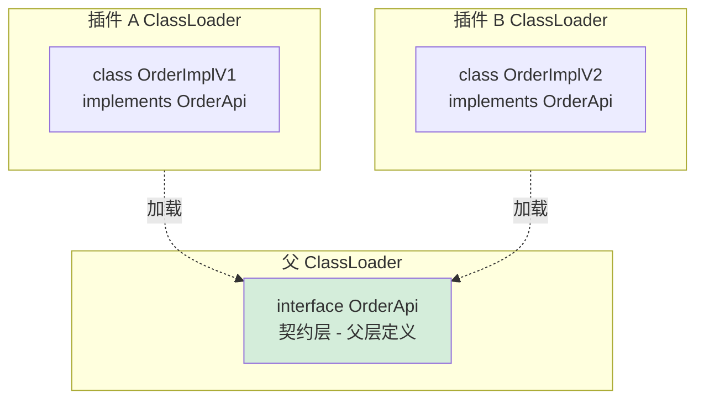

**关键设计**：
- **接口（契约）**在父加载器里——所有子加载器共享同一份 `OrderApi.class`
- **实现类**在子加载器里——可以互相隔离，可以热替换

代码长这样：

```java
// 框架代码（父加载器）
public interface OrderApi { void process(); }

// 业务代码也用接口接收
OrderApi order = framework.create();   // ← 不管 create 返回哪个实现，都是 OrderApi
order.process();                       // ← 多态调用，编译期类型即 OrderApi
```

**为什么必须用接口而不是基类？** 因为基类**也是类**，会带状态、构造器、static 字段——这些都会引发同样的加载器绑定问题。接口只是契约，最干净。

**结论**：在多 ClassLoader 系统里，**通信只能通过"父加载器定义的契约接口"**——这是 OSGi、Tomcat、JBoss、Spring Boot 插件机制共同遵守的铁律。违反它的代价是不定期出现的 ClassCastException。

### 6.4 符号污染

**疑惑**：C/C++ 项目里 `dlopen` 两个不同插件，结果一个插件的函数被"劫持"成另一个插件的版本——这是怎么回事？

**论证**：

`dlopen` 默认行为是 `RTLD_GLOBAL`（在某些场景下）：**加载的符号会进入全局符号表，被后续 dlopen 的其他库直接看见**。

```c
// plugin_a.so 定义了 int helper() { return 1; }
// plugin_b.so 也定义了 int helper() { return 2; }

dlopen("plugin_a.so", RTLD_LAZY);
dlopen("plugin_b.so", RTLD_LAZY);   // ← plugin_b 内部调用的 helper() 可能是 plugin_a 的版本！
```

这就是 C/C++ 没有命名空间隔离的代价——**全局符号表是 process-wide 的**。

**两种解法**：

```c
// 方案 1: 用 RTLD_LOCAL，符号不进入全局表
dlopen("plugin_a.so", RTLD_LAZY | RTLD_LOCAL);
dlopen("plugin_b.so", RTLD_LAZY | RTLD_LOCAL);   // ← 各自独立
```

```c
// 方案 2: 编译时给符号加 hidden visibility（gcc）
__attribute__((visibility("hidden"))) int helper() { ... }
// 编译时加 -fvisibility=hidden
```

**反向类比 Java**：这跟"双亲委派打破"的 Tomcat 场景类似——都是"我希望两份同名实现共存"。区别是 Java 给你了 ClassLoader 这个清晰抽象，C/C++ 只给你 `RTLD_LOCAL` 这种隐晦标志。

**结论**：C/C++ 动态库的"命名空间问题"完全暴露在工具链层面，没有任何高层抽象帮你 cover。这就是为什么 Nginx、Apache、Postgres 的插件机制都要**严格规范符号命名前缀**（`ngx_*` / `apr_*` / `pg_*`）——靠人工纪律替代语言机制。

### 6.5 循环依赖

**疑惑**：循环依赖在五种语言里行为大不一样——为什么？

**论证**：

来看同一个循环依赖在不同语言里的"症状"：

| 语言 | 行为 | 根因 |
|---|---|---|
| **Java** | `<clinit>` 时拿到"半成品"，可能 NPE 或拿到 null 字段 | static 块先后顺序问题 |
| **C++** | SIOF（Static Initialization Order Fiasco）——未定义行为 | 不同 translation unit 间 static 初始化顺序不定 |
| **JS (CJS)** | 早访问拿到部分导出，后续才填齐 | module.exports 边执行边填 |
| **Python** | sys.modules 里有半成品模块 | 同 JS，但语义略复杂 |
| **Go** | **编译期直接拒绝**，编译报错 `import cycle not allowed` | 最严格 |

Go 的设计在这里是**反人类直觉的胜利**——它**根本不让你制造循环依赖**：

```bash
$ go build
package a imports b
        imports a: import cycle not allowed
```

为什么 Go 敢这么"霸道"？因为 Go 假设你**有能力把代码拆好包结构**，而不是用循环依赖糊作业。换来的好处巨大：
- 编译期发现，永不在生产爆雷
- 静态链接顺序确定，无 SIOF
- 重构友好，依赖图永远是 DAG

**Java/C++ 为什么不这么做？** 因为它们诞生在"动态加载"的世界——`<clinit>` 可能在任意时刻触发，根本不可能在加载时就建立全局依赖图。

**结论**：循环依赖不是"语法错误"，是"加载语义的边界条件"。一个语言对循环依赖的处理方式，**直接折射出它对"加载时机"的设计哲学**：
- Go：编译期一锤定音 → 最严格但最稳健
- Java/Python/JS：运行时按需 → 灵活但有边界 case
- C++：编译单元独立 → 最自由但最危险（SIOF）

**实战守则**：**任何时候发现循环依赖，都优先用重构打破，不要靠"语言能容忍"撑着**——容忍只是"暂时没爆"，不是"安全"。

### 6.6 陷阱根源

纵观六种陷阱，可以归结为**一个通用规律**——所有加载陷阱都源于对 §2.5 三条共识的破坏：

| 陷阱 | 破坏的共识 | 通用根因 |
|------|----------|---------|
| 版本冲突 | **唯一性绑定** | 身份键冲突——同名实体映射到不同版本，加载器无法区分 |
| 初始化死锁 | **延迟绑定** | 惰性执行与互斥锁的天然矛盾——两个初始化相互等待 |
| 同名不同源 | **唯一性绑定** | 身份键设计允许同一名字对应多个上下文 |
| 符号污染 | **唯一性绑定** | 全局符号表缺乏命名隔离，后加载的覆盖先加载的 |
| 循环依赖 | **延迟绑定** | 惰性加载使编译期无法建立完整依赖图 |
| 内存泄漏 | **失败隔离** | 卸载条件过于严苛，残留引用阻止 GC 回收 |

> **陷阱预防铁律**：每当你设计或使用"加载/模块化"机制时，**先检查三条共识会不会被违反**——这套心智模型可以让你在代码写完之前就预判到陷阱。

---

## 7.综合案例

### 7.1 案例背景

把前面所有理论拉到一个**真实工程场景**里走一遍——这一节我们以「电商平台的营销插件系统」为例，从启动期到运行时、从 JVM 到 C 扩展，把整条加载链路串起来。

**场景设定**：

> 公司有一个电商主应用（Spring Boot），需要支持运营团队**热更新营销活动逻辑**（满减/拼团/秒杀/直播）而不重启服务。安全团队还要求营销代码**严格沙箱化**——不允许访问数据库连接池、不允许写文件。同时为了性能，**风控规则引擎用 C++ 写的 .so 库**，运行时按地区动态加载。

涉及到的加载机制：

- Java 主应用：标准双亲委派
- 营销插件：自定义 `PluginClassLoader`，破坏委派 + 沙箱安全
- 风控 .so 库：`System.loadLibrary` / JNI 触发 dlopen
- 配置热加载：Spring Boot Actuator + 反射刷新

### 7.2 链路全景

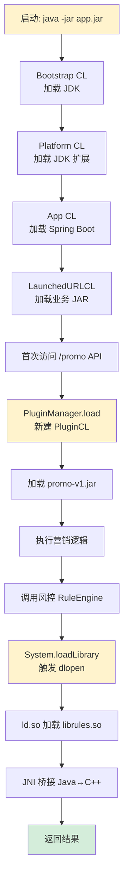

### 7.3 启动加载

JVM 启动到 main 执行前，**Bootstrap → Platform → App → LaunchedURLClassLoader** 四层加载器全部就位。Spring Boot 的 `LaunchedURLClassLoader` 重写了 `loadClass`，**让 `BOOT-INF/lib/` 下的依赖能被加载**——本质上就是 §3.5 提到的"打破委派"的工程实例。

```java
// org.springframework.boot.loader.LaunchedURLClassLoader 简化逻辑
protected Class<?> loadClass(String name, boolean resolve) {
    // ① 先走标准委派
    Class<?> c = findLoadedClass(name);
    if (c != null) return c;
    // ② 父加载器先试
    try { return parent.loadClass(name); } catch (ClassNotFoundException e) {}
    // ③ 自己找（BOOT-INF/lib/*.jar）
    return findClass(name);
}
```

启动期所有 `@Bean` 都会触发 `<clinit>`——如果某个 Bean 的 static 块卡死，整个应用启动卡死（§6.2 提到的死锁场景）。

### 7.4 插件热加载

运营要求"营销活动改完代码 1 分钟内生效"，常规做法**重启服务**——15 分钟以上不可接受。我们用**自定义 PluginClassLoader** 解决：

```java
public class PluginClassLoader extends URLClassLoader {
    public PluginClassLoader(URL[] urls, ClassLoader parent) {
        super(urls, parent);
    }

    @Override
    protected Class<?> loadClass(String name, boolean resolve) {
        // 1. JDK 类必须走双亲委派（安全）
        if (name.startsWith("java.")) return super.loadClass(name, resolve);
        // 2. 框架契约接口走双亲委派（保证类型一致）
        if (name.startsWith("com.shop.api.")) return super.loadClass(name, resolve);
        // 3. 其他插件类自己加载（隔离）
        Class<?> c = findLoadedClass(name);
        if (c == null) {
            try { c = findClass(name); }
            catch (Exception e) { c = super.loadClass(name, resolve); }
        }
        return c;
    }
}
```

**热加载流程**：

```java
// 新版本到达时
PluginClassLoader newLoader = new PluginClassLoader(promoV2Urls, appLoader);
Class<?> pluginClass = newLoader.loadClass("com.shop.plugin.PromoPlugin");
PromoApi newPlugin = (PromoApi) pluginClass.newInstance();

// 原子切换
PluginRegistry.swap("promo", newPlugin);

// 老 ClassLoader 失去强引用 → GC 触发后可被回收（§7.6 详述）
oldLoader = null;
```

注意三个关键点：
1. **契约接口 `PromoApi` 在父加载器**——这是 §6.3 的工程实践
2. **新旧加载器同时存在**一小段时间——保证正在执行的请求不受影响
3. **必须置空旧引用**——否则 ClassLoader 内存泄漏

### 7.4.1 跨语言热加载

**C/C++ 用 `dlopen` 实现**：

```cpp
// 新版本到达
void* newH = dlopen("libpromo.so.v2", RTLD_NOW | RTLD_LOCAL);
PromoApi* (*create)() = (PromoApi*(*)())dlsym(newH, "create_promo");
PromoApi* newPlugin = create();

PluginRegistry::swap("promo", newPlugin);

// 老版本卸载（必须先确保无人使用）
dlclose(oldH);
```

**关键差异**：C/C++ 没有 ClassLoader 隔离机制，**符号污染风险高**（见 §6.4）——同一 `create_promo` 符号被两个 .so 导出时，谁优先取决于加载顺序。**等价于 Java 的 ClassLoader 体系**，但安全网更少。

**Go 用 `plugin` 包**：

```go
p, _ := plugin.Open("promo_v2.so")
sym, _ := p.Lookup("Create")
newPlugin := sym.(func() PromoApi)()
registry.Swap("promo", newPlugin)
// 注意：Go plugin 不支持卸载——加载即永久
```

**关键差异**：Go 把 Java 的"双加载"路堵死了——**plugin 一旦加载无法卸载**。这与 Go"编译期确定一切"的世界观一致：宁可放弃热替换的灵活性，也要保证类型系统的确定性。

**Node.js 用模块缓存清除**：

```js
delete require.cache[require.resolve('./promo')];   // ← 清缓存
const PromoV2 = require('./promo');     // 重新加载新版本
registry.swap('promo', new PromoV2());
```

**关键差异**：Node.js 实现热加载最简单（清缓存即可），但**老的实例仍持有老的类引用**——这正是 §6.3 同名类不同身份的同构问题。

**抽象统一**：四种语言的热加载都在解同一道题——"**新旧版本如何隔离地共存到老的最后一个引用消失**"。Java 用 ClassLoader 树，C++ 用 dlopen handle，Node.js 用 require.cache key，Go 干脆禁用卸载。**武器不同，意图相同**。

### 7.5 跨域调用

营销插件需要调用主应用的 `OrderService`。这一步**必须通过契约接口**：

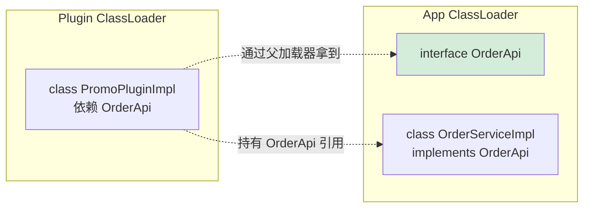

如果 `OrderApi` 同时存在于父加载器和插件加载器（比如插件 JAR 不小心打包了 api.jar），**就会出现 §3.4 的 ClassCastException**——这是营销插件机制最经典的事故。

**防御措施**：插件 JAR 构建时用 `provided` 作用域引用 api：

```xml
<dependency>
    <groupId>com.shop</groupId>
    <artifactId>shop-api</artifactId>
    <scope>provided</scope>   <!-- 编译期需要，运行时由父加载器提供 -->
</dependency>
```

### 7.6 卸载与回收

ClassLoader 的卸载是个**让无数生产环境翻车的难题**：

```
ClassLoader 可回收的充要条件：
1. ClassLoader 对象本身无强引用
2. 该 Loader 加载的所有 Class 对象无强引用
3. 这些 Class 的所有实例无强引用
```

任何一条不满足，整个加载器及其加载的所有类**永远留在 Metaspace**。常见泄漏点：

```java
// ① ThreadLocal 持有插件类的实例
static ThreadLocal<PromoPlugin> CTX = new ThreadLocal<>();  // ← 致命

// ② 静态字段持有插件类的反射 Method
private static Method PROMO_METHOD;   // ← 经典泄漏

// ③ JDBC Driver 注册（DriverManager 持有强引用）
DriverManager.registerDriver(new com.mysql.Driver());   // ← 老版 MySQL 驱动的坑
```

**检查工具**：

```bash
# 查看 Metaspace 是否持续增长
jstat -gc <pid> 1000

# 找出泄漏的 ClassLoader
jcmd <pid> GC.class_stats | grep "PluginCL"

# 内存分析（最权威）
jmap -dump:format=b,file=heap.bin <pid>
# 用 MAT 打开 → 找 "Path to GC Roots"
```

### 7.7 知识点回归

把案例里出现过的所有知识点回扣到前 6 章：

| 案例环节 | 对应原理 |
|---|---|
| Spring Boot 启动加载 | §3.1 三阶段全景图、§3.5 打破委派 |
| @Bean 初始化 | §3.6 主动使用六条、§6.2 静态初始化死锁 |
| 自定义 PluginClassLoader | §3.2 双亲委派、§3.3 命名空间隔离 |
| 插件契约接口下沉 | §3.4 类的唯一性、§6.3 ClassCastException |
| System.loadLibrary | §4.2 动态库三件事、§4.4 dlopen |
| JNI 桥接 | §4.5 元数据差异 |
| 热替换原子切换 | §2.5 唯一性绑定、§3.4 多 ClassLoader 共存 |
| ClassLoader 泄漏排查 | §3.4 加载器作为 GC Root |

**关键认知**：一个真实的微服务，把 §3、§4、§5、§6 的知识点**全部用到了**——而且不是"用到一个"，而是"层层叠叠用到"。能讲清楚这个案例的每一环，你才算把这一章"消化"了。

---

## 8.总结展望

### 8.1 三层认知阶梯

**第一层（操作层）**：能正确使用各语言的加载机制——写得出 `ClassLoader`、`dlopen`、`import`，能解决 90% 的日常问题。

**第二层（原理层）**：理解每种机制背后的"加载五阶段"和"三大共识"（延迟绑定/唯一性绑定/失败隔离）——能调试加载链路、能写出多 ClassLoader 系统。

**第三层（哲学层）**：能在新的语言/框架出现时**立刻看穿其加载哲学的取舍**——你看到 Rust 的 `cargo` 就知道它和 Go 同一类世界观，看到 Deno 的 ESM-only 就知道它在为 §5.1 的演进收尾。**这一层是"原理学习的复利"**。

### 8.2 七字真言

把整章浓缩成一句话：

> **加载即翻译，绑定即时机，隔离即上下文。**

- **加载即翻译**：所有"类加载"在做同一件事——把字节翻译成可执行实体（§2.1）
- **绑定即时机**：编译期 vs 运行时绑定是世界观分歧，决定了所有后续设计（§5.4）
- **隔离即上下文**：类的"身份"永远由"名字 + 上下文"共同决定（§3.3）

**这九个字是语言无关的**：

| 真言 | Java | C/C++ | Go | Python | JS | Rust | .NET |
|---|---|---|---|---|---|---|---|---|
| 加载即翻译 | ClassLoader → Klass | ld.so 重定位 | 编译期合入 | compile() → PyCode | Parser + Ignition | 编译期 MIR→LLVM IR | AssemblyLoadContext |
| 绑定即时机 | 运行时解析（lazy）| 编译期 ld 或运行时 ld.so | 编译期 | 完全运行时 | 内联缓存（自适应）| 编译期（默认）| 运行时 JIT 或 AOT |
| 隔离即上下文 | (类名, ClassLoader) | dlopen handle + 符号表 | import 路径 | sys.modules 键 | require/import cache key | crate 命名空间 | Assembly + ALC |

**学完这一章，你应当能做到**：拿起任何一门新语言（Rust 的 `cargo` / Deno 的 ESM / Zig 的 `@import` / Swift 的 Module），翻它的"加载/链接"那一节，**你能立刻把它的设计映射到上表对应格子里**——这就是"通用原理"的复利。

这三句话**足以解释你将遇到的所有加载相关问题**。

### 8.3 下篇承接

我们用整整一章讲完了"字节如何变成对象"——这是运行时模型的**第一个核心矛盾**。下一篇 [《2.对象创建核心流程》](https://yccoding.com/pages/5b77ea/) 将进入第二个矛盾：

> **类已经加载了，那"new 一个对象"到底发生了什么？**

类是"模板"，对象是"实例"——从模板到实例的过程，又是另一场跨越五种语言的精彩对比。Java 的 `new` 不只是分配内存，C++ 的 `new` 不只是调用构造，Go 根本没有 `new` 关键字……这些差异背后，藏着对象生命周期管理的另一套设计哲学。

**通用编程原理的探索之旅，才刚刚开始。**

### 8.4 通用设计原则

如果你将来要**从零设计一门新语言的加载机制**（或一个插件框架），以下是贯穿全章的**七条通用设计原则**，直接可用：

| # | 原则 | 说明 | 反例 |
|---|------|------|------|
| **1** | **惰性优先** | 能推迟到运行时的不要放在启动时做 | C++ 全局变量在 main 前全部初始化 → SIOF |
| **2** | **身份分层** | 加载实体必须有 (名字, 上下文) 二元组身份 | C 的全局符号表单层 → 符号污染 |
| **3** | **隔离即自由** | 不同模块用不同上下文装载，做到版本共存 | Python 全量 sys.modules → 无版本隔离 |
| **4** | **编译期拒错** | 能在编译期发现的错误绝不留到运行时 | Java `<clinit>` 循环引用运行时死锁 |
| **5** | **卸载条件可预测** | 显式定义加载实体何时可被回收 | dlopen 引用计数 = 0 才卸载，极易泄漏 |
| **6** | **契约接口下沉** | 跨上下文通信只通过父上下文的纯接口 | 插件直接传递具体类 → ClassCastException |
| **7** | **失败不扩散** | 一个模块加载失败，不得影响已加载的模块 | 任何成熟的现代加载机制都已遵守此条 |

> **设计检验法**：在设计你的加载机制时，逐一检查这七条。每缺少一条，就预言一个对应类型的生产事故。这七条是本章 1900 行的浓缩——**记住原则，忘掉细节**。

---

